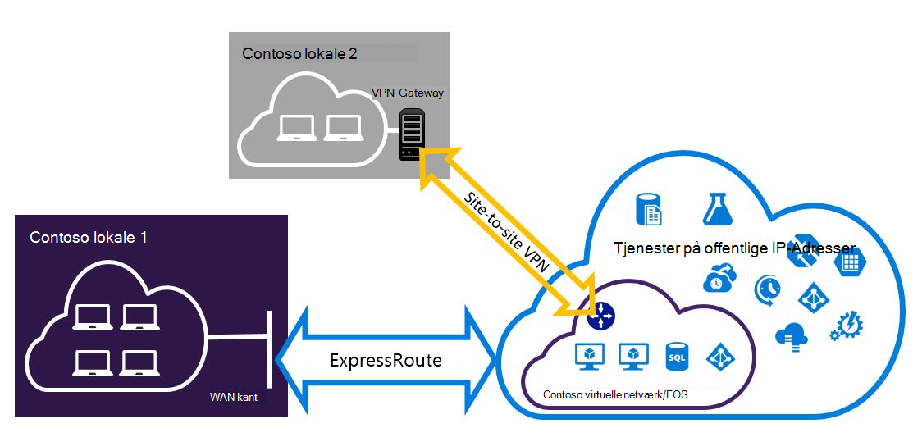

<properties
   pageTitle="Konfigurere Expressroute og websted til websted VPN-forbindelser, der kan fungere | Microsoft Azure"
   description="I denne artikel vejleder dig gennem konfigurationen af ExpressRoute og en-til-websted VPN-forbindelse, der kan fungere til klassisk installation-modellen."
   documentationCenter="na"
   services="expressroute"
   authors="charwen"
   manager="carmonm"
   editor=""
   tags="azure-service-management"/>
<tags
   ms.service="expressroute"
   ms.devlang="na"
   ms.topic="get-started-article"
   ms.tgt_pltfrm="na"
   ms.workload="infrastructure-services"
   ms.date="10/10/2016"
   ms.author="charwen"/>

# Konfigurere ExpressRoute og websted til websted fungerer sammen forbindelser til den klassiske implementeringsmodel

> [AZURE.SELECTOR]
- [PowerShell - ressourcestyring](expressroute-howto-coexist-resource-manager.md)
- [PowerShell - klassisk](expressroute-howto-coexist-classic.md)

Har du mulighed for at konfigurere VPN til-websted og ExpressRoute har flere fordele. Du kan konfigurere VPN til-websted som en sikker failover sti til ExressRoute, eller brug VPN til-websted til at oprette forbindelse til websteder, som ikke har forbindelse via ExpressRoute. Vi kommer ind på trinnene for at konfigurere begge scenarier i denne artikel. I denne artikel gælder for den klassiske implementeringsmodel. Denne konfiguration er ikke tilgængelig i portalen.

**Om Azure-installation modeller**

[AZURE.INCLUDE [vpn-gateway-clasic-rm](../../includes/vpn-gateway-classic-rm-include.md)] 

>[AZURE.IMPORTANT] ExpressRoute kredsløb skal være allerede konfigureret, før du følge vejledningen nedenfor. Sørg for, at du har fulgt hjælpelinjer til at [oprette et ExpressRoute kredsløb](expressroute-howto-circuit-classic.md) og [konfigurere routing](expressroute-howto-routing-classic.md) , før du følge nedenstående trin.

## Grænser og begrænsninger

- **Overførsel routing understøttes ikke.** Du kan ikke distribuere (via Azure) mellem dit lokale netværk forbindelse via VPN til-websted og dit lokale netværk, der er forbundet via ExpressRoute.
- **Punkt-til-site understøttes ikke.** Du kan ikke aktivere punkt-til-site VPN-forbindelser til den samme VNet, der er forbundet til ExpressRoute. Punkt-til-site VPN og ExpressRoute fungerer ikke sammen til den samme VNet.
- **Tvunget tunnelføring kan ikke aktiveres på gatewayen VPN-websted til websted.** Du kan kun "gennemtvinge" al trafik til internetbaserede tilbage til dit lokale netværk via ExpressRoute.
- **Grundlæggende SKU gatewayen understøttes ikke.** Du skal bruge en ikke - grundlæggende SKU gateway til både [ExpressRoute gateway](expressroute-about-virtual-network-gateways.md) og [VPN-gateway](../vpn-gateway/vpn-gateway-about-vpngateways.md).
- **Kun rute-baserede VPN gatewayen understøttes.** Du skal bruge en distribution baseret [VPN-Gateway](../vpn-gateway/vpn-gateway-about-vpngateways.md).
- **Statisk rute skal være konfigureret til din VPN-gateway.** Hvis dit lokale netværk er tilsluttet både ExpressRoute og en VPN til-websted, skal du have en statisk rute, der er konfigureret i dit lokale netværk til at dirigere til websted VPN-forbindelse til det offentlige Internet.
- **ExpressRoute gateway skal konfigureres først.** Du skal oprette gatewayen ExpressRoute først, før du tilføjer gatewayen VPN-websted til websted.

## Konfiguration af design

### Konfigurere en VPN til-websted som en failover sti til ExpressRoute

Du kan konfigurere en-til-websted VPN-forbindelse som en sikkerhedskopi til ExpressRoute. Dette gælder kun for virtuelle netværk, der er knyttet til Azure privat peering stien. Der findes ingen failover VPN-baseret løsning for tjenester tilgængelige via Azure offentlige og Microsoft peerings. ExpressRoute kredsløb er altid det primære link. Vil dataflow via VPN-websted til stien, kun, hvis ExpressRoute kredsløbet mislykkes. 

### Konfigurer en VPN-forbindelse til et websted til at oprette forbindelse til websteder, der ikke har forbindelse via ExpressRoute

Du kan konfigurere dit netværk, hvor nogle websteder oprette forbindelse direkte til Azure via VPN til-websted, og nogle websteder oprette forbindelse via ExpressRoute. 

>[AZURE.NOTE] Du kan ikke konfigurere et virtuelt netværk som en overførsel router.

## Valg af disse trin for at bruge

Der findes to forskellige typer procedurer til at vælge mellem for at konfigurere forbindelser, der kan fungere. Fremgangsmåden konfiguration, som du vælger afhænger af, om du har et eksisterende virtuelt netværk, du vil oprette forbindelse til, eller du vil oprette et nyt virtuelt netværk.

- Jeg ikke har en VNet og har brug at oprette et.
    
    Hvis du ikke allerede har et virtuelt netværk, fører denne procedure dig gennem oprettelse af et nyt virtuelt netværk ved hjælp af klassisk installation modellen og oprette nye ExpressRoute og websted til websted VPN-forbindelser. Hvis du vil konfigurere, skal du følge trinnene i afsnittet artikel [til at oprette et nyt virtuelt netværk og fungerer sammen forbindelser](#new).

- Jeg har allerede en klassisk implementeringsmodel VNet.

    Du kan allerede har et virtuelt netværk i sted med et eksisterende websted til websted VPN-forbindelse eller ExpressRoute forbindelse. Afsnittet artikel for [at konfigurere coexsiting forbindelser til en eksisterende VNet](#add) fører dig igennem slette gatewayen, og derefter oprette nye ExpressRoute og websted til websted VPN-forbindelser. Bemærk, at når du opretter nye forbindelser, skal trinnene udføres i en meget bestemt rækkefølge. Brug ikke instruktionerne i andre artikler til at oprette din gateways og forbindelser.

    I denne procedure, og vil oprette forbindelser, der kan fungere kræver, at du slette din gateway og derefter konfigurere nye gateways. Det betyder, at du får nedetid for dine forbindelser i tværs det lokale miljø, mens du slette og gendanne din gateway og forbindelser, men du behøver ikke at overføre et af dine FOS eller tjenester til et nyt virtuelt netværk. Dine FOS og tjenester vil stadig kunne kommunikere ud gennem justering af belastning, mens du konfigurerer din gateway, hvis de er konfigureret til at gøre dette.

## Du kan oprette et nyt virtuelt netværk og fungerer sammen forbindelser

Denne fremgangsmåde kan hjælper dig med at oprette en VNet og oprette-til-websted og ExpressRoute forbindelser, der skal fungere.

1. Du skal installere den nyeste version af Azure PowerShell-cmdlet'er. Se, [hvordan du installerer og konfigurerer Azure PowerShell](../powershell-install-configure.md) kan finde flere oplysninger om installation af PowerShell-cmdlet'er. Bemærk, at den-cmdletter, som du skal bruge til denne konfiguration kan være en smule anderledes end hvad du kan have kendskab til. Sørg for at bruge-cmdletter angivet i disse instruktioner. 

2. Oprette et skema for netværket virtuel. Se [Azure virtuelt netværk konfiguration skema](https://msdn.microsoft.com/library/azure/jj157100.aspx)kan finde flere oplysninger om konfiguration af skemaet.

    Når du opretter dit skema, skal du kontrollere du bruge følgende værdier:

    - Gateway-undernet til det virtuelle netværk skal være /27 eller et kortere præfiks (såsom /26 eller /25).
    - Forbindelsestype gateway er "dedikeret."

              <VirtualNetworkSite name="MyAzureVNET" Location="Central US">
                <AddressSpace>
                  <AddressPrefix>10.17.159.192/26</AddressPrefix>
                </AddressSpace>
                <Subnets>
                  <Subnet name="Subnet-1">
                    <AddressPrefix>10.17.159.192/27</AddressPrefix>
                  </Subnet>
                  <Subnet name="GatewaySubnet">
                    <AddressPrefix>10.17.159.224/27</AddressPrefix>
                  </Subnet>
                </Subnets>
                <Gateway>
                  <ConnectionsToLocalNetwork>
                    <LocalNetworkSiteRef name="MyLocalNetwork">
                      <Connection type="Dedicated" />
                    </LocalNetworkSiteRef>
                  </ConnectionsToLocalNetwork>
                </Gateway>
              </VirtualNetworkSite>

3. Når du opretter og konfiguration af XML-skemafil, overfør filen. Dette vil oprette din virtuelt netværk.

    Brug følgende cmdlet til at overføre filen, erstatter værdien med din egen.

        Set-AzureVNetConfig -ConfigurationPath 'C:\NetworkConfig.xml'

4. Oprette en ExpressRoute gateway. Sørg for at angive GatewaySKU som *Standard*, *ved anvendelse*, eller *UltraPerformance* og GatewayType som *DynamicRouting*.

    Brug det følgende eksempel erstatning med værdierne for din egen.

        New-AzureVNetGateway -VNetName MyAzureVNET -GatewayType DynamicRouting -GatewaySKU HighPerformance

5. Sammenkæde gatewayen ExpressRoute til ExpressRoute kredsløb. Når dette trin er fuldført, er der oprettet forbindelse mellem dit lokale netværk og Azure gennem ExpressRoute.

        New-AzureDedicatedCircuitLink -ServiceKey <service-key> -VNetName MyAzureVNET

6. Dernæst skal du oprette din VPN-websted til websted gateway. GatewaySKU skal være *Standard*, *ved anvendelse*, eller *UltraPerformance* og GatewayType skal være *DynamicRouting*.

        New-AzureVirtualNetworkGateway -VNetName MyAzureVNET -GatewayName S2SVPN -GatewayType DynamicRouting -GatewaySKU  HighPerformance

    For at hente virtuelt netværk gateway indstillinger, herunder gateway-ID og den offentlige IP-adresse, du bruger den `Get-AzureVirtualNetworkGateway` cmdlet.

        Get-AzureVirtualNetworkGateway

        GatewayId            : 348ae011-ffa9-4add-b530-7cb30010565e
        GatewayName          : S2SVPN
        LastEventData        :
        GatewayType          : DynamicRouting
        LastEventTimeStamp   : 5/29/2015 4:41:41 PM
        LastEventMessage     : Successfully created a gateway for the following virtual network: GNSDesMoines
        LastEventID          : 23002
        State                : Provisioned
        VIPAddress           : 104.43.x.y
        DefaultSite          :
        GatewaySKU           : HighPerformance
        Location             :
        VnetId               : 979aabcf-e47f-4136-ab9b-b4780c1e1bd5
        SubnetId             :
        EnableBgp            : False
        OperationDescription : Get-AzureVirtualNetworkGateway
        OperationId          : 42773656-85e1-a6b6-8705-35473f1e6f6a
        OperationStatus      : Succeeded

7. Oprette et lokalt websted VPN gateway enhed. Denne kommando konfigurere ikke din lokale VPN-gateway. I stedet kan det du give de lokale gateway-indstillinger, som den offentlige IP-adresse og lokale-mellemrum, så gatewayen Azure VPN kan oprette forbindelse til den.

    >[AZURE.IMPORTANT] Det lokale websted for at websted VPN er ikke defineret i netcfg. I stedet skal du bruge denne cmdlet til at angive parametrene lokale websted. Du kan ikke definere den ved hjælp af portalen eller netcfg filen.

    Brug det følgende eksempel erstatter værdierne med dine egne.

        New-AzureLocalNetworkGateway -GatewayName MyLocalNetwork -IpAddress <MyLocalGatewayIp> -AddressSpace <MyLocalNetworkAddress>

    > [AZURE.NOTE] Hvis dit lokale netværk har flere omdirigerer, kan du sende dem alle på som en matrix.  $MyLocalNetworkAddress =@("10.1.2.0/24","10.1.3.0/24","10.2.1.0/24")  

    For at hente virtuelt netværk gateway indstillinger, herunder gateway-ID og den offentlige IP-adresse, du bruger den `Get-AzureVirtualNetworkGateway` cmdlet. Se eksemplet nedenfor.

        Get-AzureLocalNetworkGateway

        GatewayId            : 532cb428-8c8c-4596-9a4f-7ae3a9fcd01b
        GatewayName          : MyLocalNetwork
        IpAddress            : 23.39.x.y
        AddressSpace         : {10.1.2.0/24}
        OperationDescription : Get-AzureLocalNetworkGateway
        OperationId          : ddc4bfae-502c-adc7-bd7d-1efbc00b3fe5
        OperationStatus      : Succeeded

8. Konfigurere din lokale VPN-enhed til at oprette forbindelse til den ny gateway. Brug de oplysninger, du har hentet i trin 6, når du konfigurerer din VPN-enhed. Du kan finde flere oplysninger om konfiguration af VPN-enhed, [VPN-enhedskonfiguration](../vpn-gateway/vpn-gateway-about-vpn-devices.md).

9. Link til websted VPN gatewayen på Azure til den lokale gateway.

    I dette eksempel er connectedEntityId lokale gateway-ID, som du kan finde ved at køre `Get-AzureLocalNetworkGateway`. Du kan finde virtualNetworkGatewayId ved hjælp af den `Get-AzureVirtualNetworkGateway` cmdlet. Når dette trin er oprettet forbindelse mellem dit lokale netværk og Azure via til websted VPN-forbindelse.

        New-AzureVirtualNetworkGatewayConnection -connectedEntityId <local-network-gateway-id> -gatewayConnectionName Azure2Local -gatewayConnectionType IPsec -sharedKey abc123 -virtualNetworkGatewayId <azure-s2s-vpn-gateway-id>

## Sådan konfigureres coexsiting forbindelser til en eksisterende VNet

Hvis du har et eksisterende virtuelt netværk, skal du kontrollere gateway undernet størrelsen. Hvis gateway-undernettet er /28 eller /29, skal du først slette gatewayen virtuelt netværk og øge gateway undernet størrelse. Trinnene i dette afsnit vises du, hvordan du gør dette.

Hvis gateway-undernettet er /27 eller større og det virtuelle netværk er forbundet via ExpressRoute, kan du springe nedenstående trin og gå videre til ["Trin 6 - Opret en VPN-websted til websted gateway"](#vpngw) i det forrige afsnit.

>[AZURE.NOTE] Når du sletter den eksisterende gateway, mister dine lokale lokale forbindelsen til netværket virtuel, mens du arbejder på denne konfiguration.

1. Du skal installere den nyeste version af Azure ressourcestyring PowerShell-cmdlet'er. Se, [hvordan du installerer og konfigurerer Azure PowerShell](../powershell-install-configure.md) kan finde flere oplysninger om installation af PowerShell-cmdlet'er. Bemærk, at den-cmdletter, som du skal bruge til denne konfiguration kan være en smule anderledes end hvad du kan have kendskab til. Sørg for at bruge-cmdletter angivet i disse instruktioner. 

2. Slette eksisterende ExpressRoute eller VPN-websted til gatewayen. Brug følgende cmdlet, erstatter værdierne med dine egne.

        Remove-AzureVNetGateway –VnetName MyAzureVNET

3. Eksportere virtuelt netværk skemaet. Brug følgende PowerShell-cmdlet, erstatter værdierne med dine egne.

        Get-AzureVNetConfig –ExportToFile “C:\NetworkConfig.xml”

4. Redigere netværk konfiguration fil skemaet, så gateway-undernettet er /27 eller et kortere præfiks (såsom /26 eller /25). Se eksemplet nedenfor. 
>[AZURE.NOTE] Hvis du ikke har nok IP-adresser til venstre i netværket virtuel at øge størrelsen på gateway undernet, skal du tilføje mere plads på IP-adresse. Se [Azure virtuelt netværk konfiguration skema](https://msdn.microsoft.com/library/azure/jj157100.aspx)kan finde flere oplysninger om konfiguration af skemaet.

          <Subnet name="GatewaySubnet">
            <AddressPrefix>10.17.159.224/27</AddressPrefix>
          </Subnet>

5. Hvis din gateway, der tidligere var en VPN til-websted, skal du også ændre forbindelsestypen til **dedikeret**.

                 <Gateway>
                  <ConnectionsToLocalNetwork>
                    <LocalNetworkSiteRef name="MyLocalNetwork">
                      <Connection type="Dedicated" />
                    </LocalNetworkSiteRef>
                  </ConnectionsToLocalNetwork>
                </Gateway>

6. På dette tidspunkt har du en VNet med ingen gateways. For at oprette nye gateways og fuldføre dine forbindelser, kan du fortsætte med [trin 4 – oprette en ExpressRoute gateway](#gw), findes i den foregående række trin.

## Næste trin

Du kan finde flere oplysninger om ExpressRoute, se [ExpressRoute ofte stillede spørgsmål](expressroute-faqs.md)
