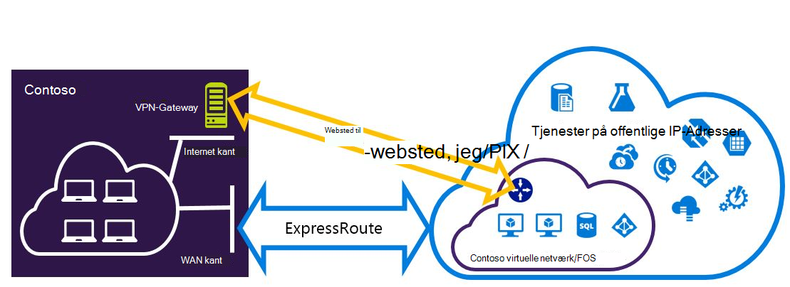

<properties
   pageTitle="Konfigurere Expressroute og websted til websted VPN-forbindelser, der kan fungere for implementeringsmodel ressourcestyring | Microsoft Azure"
   description="I denne artikel vejleder dig gennem konfigurationen af ExpressRoute og en-til-websted VPN-forbindelse, der kan fungere for ressourcestyring model."
   documentationCenter="na"
   services="expressroute"
   authors="charwen"
   manager="carmonm"
   editor=""
   tags="azure-resource-manager"/>
<tags
   ms.service="expressroute"
   ms.devlang="na"
   ms.topic="get-started-article"
   ms.tgt_pltfrm="na"
   ms.workload="infrastructure-services"
   ms.date="10/10/2016"
   ms.author="charleywen"/>

# Konfigurere ExpressRoute og websted til websted fungerer sammen forbindelser til implementeringsmodel ressourcestyring

> [AZURE.SELECTOR]
- [PowerShell - ressourcestyring](expressroute-howto-coexist-resource-manager.md)
- [PowerShell - klassisk](expressroute-howto-coexist-classic.md)

Har du mulighed for at konfigurere VPN til-websted og ExpressRoute har flere fordele. Du kan konfigurere VPN til-websted som en sikker failover sti til ExressRoute, eller brug VPN til-websted til at oprette forbindelse til websteder, som ikke har forbindelse via ExpressRoute. Vi kommer ind på trinnene for at konfigurere begge scenarier i denne artikel. I denne artikel gælder for implementeringsmodel ressourcestyring. Denne konfiguration er ikke tilgængelig i portalen Azure.

**Om Azure-installation modeller**

[AZURE.INCLUDE [vpn-gateway-clasic-rm](../../includes/vpn-gateway-classic-rm-include.md)] 

>[AZURE.IMPORTANT] ExpressRoute kredsløb skal være allerede konfigureret, før du følge vejledningen nedenfor. Sørg for, at du har fulgt hjælpelinjer til at [oprette et ExpressRoute kredsløb](expressroute-howto-circuit-arm.md) og [konfigurere routing](expressroute-howto-routing-arm.md) , før du følge nedenstående trin.

## Grænser og begrænsninger

- **Overførsel routing understøttes ikke.** Du kan ikke distribuere (via Azure) mellem dit lokale netværk forbindelse via VPN til-websted og dit lokale netværk, der er forbundet via ExpressRoute.
- **Grundlæggende SKU gatewayen understøttes ikke.** Du skal bruge en ikke - grundlæggende SKU gateway til både [ExpressRoute gateway](expressroute-about-virtual-network-gateways.md) og [VPN-gateway](../vpn-gateway/vpn-gateway-about-vpngateways.md).
- **Kun distribuere-baserede VPN gatewayen understøttes.** Du skal bruge en distribution baseret [VPN-Gateway](../vpn-gateway/vpn-gateway-about-vpngateways.md).
- **Statisk rute skal være konfigureret til din VPN-gateway.** Hvis dit lokale netværk er tilsluttet både ExpressRoute og en VPN til-websted, skal du have en statisk rute, der er konfigureret i dit lokale netværk til at dirigere til websted VPN-forbindelse til det offentlige Internet.
- **ExpressRoute gateway skal konfigureres først.** Du skal oprette gatewayen ExpressRoute først, før du tilføjer gatewayen VPN-websted til websted.

## Konfiguration af design

### Konfigurere en VPN til-websted som en failover sti til ExpressRoute

Du kan konfigurere en-til-websted VPN-forbindelse som en sikkerhedskopi til ExpressRoute. Dette gælder kun for virtuelle netværk, der er knyttet til Azure privat peering stien. Der findes ingen failover VPN-baseret løsning for tjenester tilgængelige via Azure offentlige og Microsoft peerings. ExpressRoute kredsløb er altid det primære link. Vil dataflow via VPN-websted til stien, kun, hvis ExpressRoute kredsløbet mislykkes.
>[AZURE.NOTE] Mens ExpressRoute kredsløb er prefered over VPN til-websted, når begge omdirigerer er den samme, Brug Azure longuest præfiks Sammenlign til at vælge ruten mod pakkens destination.

### Konfigurer en VPN-forbindelse til et websted til at oprette forbindelse til websteder, der ikke har forbindelse via ExpressRoute

Du kan konfigurere dit netværk, hvor nogle websteder oprette forbindelse direkte til Azure via VPN til-websted, og nogle websteder oprette forbindelse via ExpressRoute. 

>[AZURE.NOTE] Du kan ikke konfigurere et virtuelt netværk som en overførsel router.

## Valg af disse trin for at bruge

Der findes to forskellige typer procedurer til at vælge mellem for at konfigurere forbindelser, der kan fungere. Fremgangsmåden konfiguration, som du vælger afhænger af, om du har et eksisterende virtuelt netværk, du vil oprette forbindelse til, eller du vil oprette et nyt virtuelt netværk.

- Jeg ikke har en VNet og har brug at oprette et.
    
    Hvis du ikke allerede har et virtuelt netværk, fører denne procedure dig gennem oprettelse af et nyt virtuelt netværk ved hjælp af Ressourcestyring implementeringsmodel og oprette nye ExpressRoute og websted til websted VPN-forbindelser. Hvis du vil konfigurere, skal du følge trinnene i afsnittet artikel [til at oprette et nyt virtuelt netværk og fungerer sammen forbindelser](#new).

- Jeg har allerede en ressourcestyring implementeringsmodel VNet.

    Du kan allerede har et virtuelt netværk i sted med et eksisterende websted til websted VPN-forbindelse eller ExpressRoute forbindelse. Sektionen [til at konfigurere coexsiting forbindelser til en eksisterende VNet](#add) fører dig igennem slette gatewayen, og derefter oprette nye ExpressRoute og websted til websted VPN-forbindelser. Bemærk, at når du opretter nye forbindelser, skal trinnene udføres i en meget bestemt rækkefølge. Brug ikke instruktionerne i andre artikler til at oprette din gateways og forbindelser.

    I denne procedure, og vil oprette forbindelser, der kan fungere kræver, at du slette din gateway og derefter konfigurere nye gateways. Det betyder, at du får nedetid for dine forbindelser i tværs det lokale miljø, mens du slette og gendanne din gateway og forbindelser, men du behøver ikke at overføre et af dine FOS eller tjenester til et nyt virtuelt netværk. Dine FOS og tjenester vil stadig kunne kommunikere ud gennem justering af belastning, mens du konfigurerer din gateway, hvis de er konfigureret til at gøre dette.

## Du kan oprette et nyt virtuelt netværk og fungerer sammen forbindelser

Denne fremgangsmåde kan hjælper dig med at oprette en VNet og oprette-til-websted og ExpressRoute forbindelser, der skal fungere.
    
1. Du skal installere den nyeste version af Azure PowerShell-cmdlet'er. Se, [hvordan du installerer og konfigurerer Azure PowerShell](../powershell-install-configure.md) kan finde flere oplysninger om installation af PowerShell-cmdlet'er. Bemærk, at den-cmdletter, som du skal bruge til denne konfiguration kan være en smule anderledes end hvad du kan have kendskab til. Sørg for at bruge-cmdletter angivet i disse instruktioner.

2. Login din konto og konfigurere miljøet.
    
        login-AzureRmAccount
        Select-AzureRmSubscription -SubscriptionName 'yoursubscription'
        $location = "Central US"
        $resgrp = New-AzureRmResourceGroup -Name "ErVpnCoex" -Location $location

3. Oprette et virtuelt netværk, herunder Gateway undernet. Du kan finde flere oplysninger om den virtuelle netværkskonfiguration, [Azure virtuelle netværkskonfiguration](../virtual-network/virtual-networks-create-vnet-arm-ps.md).

    >[AZURE.IMPORTANT] Gateway-undernet skal være /27 eller et kortere præfiks (såsom /26 eller /25).
    
    Oprette en ny VNet.

        $vnet = New-AzureRmVirtualNetwork -Name "CoexVnet" -ResourceGroupName $resgrp.ResourceGroupName -Location $location -AddressPrefix "10.200.0.0/16" 

    Tilføj undernet.

        Add-AzureRmVirtualNetworkSubnetConfig -Name "App" -VirtualNetwork $vnet -AddressPrefix "10.200.1.0/24"
        Add-AzureRmVirtualNetworkSubnetConfig -Name "GatewaySubnet" -VirtualNetwork $vnet -AddressPrefix "10.200.255.0/24"

    Gemme VNet konfigurationen.

        $vnet = Set-AzureRmVirtualNetwork -VirtualNetwork $vnet

4. Oprette en ExpressRoute gateway. Du kan finde flere oplysninger om ExpressRoute gateway konfigurationen, [ExpressRoute gateway konfiguration](expressroute-howto-add-gateway-resource-manager.md). GatewaySKU skal være *Standard*, *ved anvendelse*eller *UltraPerformance*.

        $gwSubnet = Get-AzureRmVirtualNetworkSubnetConfig -Name "GatewaySubnet" -VirtualNetwork $vnet
        $gwIP = New-AzureRmPublicIpAddress -Name "ERGatewayIP" -ResourceGroupName $resgrp.ResourceGroupName -Location $location -AllocationMethod Dynamic
        $gwConfig = New-AzureRmVirtualNetworkGatewayIpConfig -Name "ERGatewayIpConfig" -SubnetId $gwSubnet.Id -PublicIpAddressId $gwIP.Id
        $gw = New-AzureRmVirtualNetworkGateway -Name "ERGateway" -ResourceGroupName $resgrp.ResourceGroupName -Location $location -IpConfigurations $gwConfig -GatewayType "ExpressRoute" -GatewaySku Standard 

5. Sammenkæde gatewayen ExpressRoute til ExpressRoute kredsløb. Når dette trin er fuldført, er der oprettet forbindelse mellem dit lokale netværk og Azure gennem ExpressRoute. Du kan finde flere oplysninger om sammenkædningen, [Link VNets til ExpressRoute](expressroute-howto-linkvnet-arm.md).

        $ckt = Get-AzureRmExpressRouteCircuit -Name "YourCircuit" -ResourceGroupName "YourCircuitResourceGroup"
        New-AzureRmVirtualNetworkGatewayConnection -Name "ERConnection" -ResourceGroupName $resgrp.ResourceGroupName -Location $location -VirtualNetworkGateway1 $gw -PeerId $ckt.Id -ConnectionType ExpressRoute

6. Dernæst skal du oprette din VPN-websted til websted gateway. Se [konfigurere en VNet med en forbindelse til websted](../vpn-gateway/vpn-gateway-create-site-to-site-rm-powershell.md)kan finde flere oplysninger om VPN-gateway konfigurationen. GatewaySKU skal være *Standard*, *ved anvendelse*eller *UltraPerformance*. VpnType skal *RouteBased*.

        $gwSubnet = Get-AzureRmVirtualNetworkSubnetConfig -Name "GatewaySubnet" -VirtualNetwork $vnet
        $gwIP = New-AzureRmPublicIpAddress -Name "VPNGatewayIP" -ResourceGroupName $resgrp.ResourceGroupName -Location $location -AllocationMethod Dynamic
        $gwConfig = New-AzureRmVirtualNetworkGatewayIpConfig -Name "VPNGatewayIpConfig" -SubnetId $gwSubnet.Id -PublicIpAddressId $gwIP.Id
        New-AzureRmVirtualNetworkGateway -Name "VPNGateway" -ResourceGroupName $resgrp.ResourceGroupName -Location $location -IpConfigurations $gwConfig -GatewayType "Vpn" -VpnType "RouteBased" -GatewaySku "Standard"

    Azure VPN-gateway understøtter BGP. Du kan angive - EnableBgp i følgende kommando.

        $azureVpn = New-AzureRmVirtualNetworkGateway -Name "VPNGateway" -ResourceGroupName $resgrp.ResourceGroupName -Location $location -IpConfigurations $gwConfig -GatewayType "Vpn" -VpnType "RouteBased" -GatewaySku "Standard" -EnableBgp $true

    Du kan finde BGP peering IP- og AS tallet, der bruger Azure af VPN gatewayen i $azureVpn.BgpSettings.BgpPeeringAddress og $azureVpn.BgpSettings.Asn. Yderligere oplysninger finder du se [Konfigurere BGP](../vpn-gateway/vpn-gateway-bgp-resource-manager-ps.md) til Azure VPN-gateway.

7. Oprette et lokalt websted VPN gateway enhed. Denne kommando konfigurere ikke din lokale VPN-gateway. I stedet kan det du give de lokale gateway-indstillinger, som den offentlige IP-adresse og lokale-mellemrum, så gatewayen Azure VPN kan oprette forbindelse til den.

    Hvis enheden lokale VPN understøtter kun statisk routing, kan du konfigurere de statiske omdirigerer på følgende måde.

        $MyLocalNetworkAddress = @("10.100.0.0/16","10.101.0.0/16","10.102.0.0/16")
        $localVpn = New-AzureRmLocalNetworkGateway -Name "LocalVPNGateway" -ResourceGroupName $resgrp.ResourceGroupName -Location $location -GatewayIpAddress *<Public IP>* -AddressPrefix $MyLocalNetworkAddress

    Hvis enheden lokale VPN understøtter BGP, og du vil aktivere dynamisk routing, skal du vide BGP peering IP- og AS tallet, der bruger din lokale VPN-enhed.

        $localVPNPublicIP = "<Public IP>"
        $localBGPPeeringIP = "<Private IP for the BGP session>"
        $localBGPASN = "<ASN>"
        $localAddressPrefix = $localBGPPeeringIP + "/32"
        $localVpn = New-AzureRmLocalNetworkGateway -Name "LocalVPNGateway" -ResourceGroupName $resgrp.ResourceGroupName -Location $location -GatewayIpAddress $localVPNPublicIP -AddressPrefix $localAddressPrefix -BgpPeeringAddress $localBGPPeeringIP -Asn $localBGPASN

8. Konfigurere din lokale VPN-enhed til at oprette forbindelse til den nye Azure VPN-gateway. Du kan finde flere oplysninger om konfiguration af VPN-enhed, [VPN-enhedskonfiguration](../vpn-gateway/vpn-gateway-about-vpn-devices.md).

9. Link til websted VPN gatewayen på Azure til den lokale gateway.

        $azureVpn = Get-AzureRmVirtualNetworkGateway -Name "VPNGateway" -ResourceGroupName $resgrp.ResourceGroupName
        New-AzureRmVirtualNetworkGatewayConnection -Name "VPNConnection" -ResourceGroupName $resgrp.ResourceGroupName -Location $location -VirtualNetworkGateway1 $azureVpn -LocalNetworkGateway2 $localVpn -ConnectionType IPsec -SharedKey <yourkey>

## Sådan konfigureres coexsiting forbindelser til en eksisterende VNet

Hvis du har et eksisterende virtuelt netværk, skal du kontrollere gateway undernet størrelsen. Hvis gateway-undernettet er /28 eller /29, skal du først slette gatewayen virtuelt netværk og øge gateway undernet størrelse. Trinnene i dette afsnit vises du, hvordan du gør dette.

Hvis gateway-undernettet er /27 eller større og det virtuelle netværk er forbundet via ExpressRoute, kan du springe nedenstående trin og gå videre til ["Trin 6 - Opret en VPN-websted til websted gateway"](#vpngw) i det forrige afsnit. 

>[AZURE.NOTE] Når du sletter den eksisterende gateway, mister dine lokale lokale forbindelsen til netværket virtuel, mens du arbejder på denne konfiguration. 

1. Du skal installere den nyeste version af Azure PowerShell-cmdlet'er. Se, [hvordan du installerer og konfigurerer Azure PowerShell](../powershell-install-configure.md) kan finde flere oplysninger om installation af PowerShell-cmdlet'er. Bemærk, at den-cmdletter, som du skal bruge til denne konfiguration kan være en smule anderledes end hvad du kan have kendskab til. Sørg for at bruge-cmdletter angivet i disse instruktioner. 

2. Slette eksisterende ExpressRoute eller VPN-websted til gatewayen. 

        Remove-AzureRmVirtualNetworkGateway -Name <yourgatewayname> -ResourceGroupName <yourresourcegroup>

3. Slette gatewayen undernet.
        
        $vnet = Get-AzureRmVirtualNetwork -Name <yourvnetname> -ResourceGroupName <yourresourcegroup> 
        Remove-AzureRmVirtualNetworkSubnetConfig -Name GatewaySubnet -VirtualNetwork $vnet

4. Tilføje en Gateway-undernet, der er /27 eller større.
    >[AZURE.NOTE] Hvis du ikke har nok IP-adresser til venstre i netværket virtuel at øge størrelsen på gateway undernet, skal du tilføje mere plads på IP-adresse.

        $vnet = Get-AzureRmVirtualNetwork -Name <yourvnetname> -ResourceGroupName <yourresourcegroup>
        Add-AzureRmVirtualNetworkSubnetConfig -Name "GatewaySubnet" -VirtualNetwork $vnet -AddressPrefix "10.200.255.0/24"

    Gemme VNet konfigurationen.

        $vnet = Set-AzureRmVirtualNetwork -VirtualNetwork $vnet

5. På dette tidspunkt har du en VNet med ingen gateways. For at oprette nye gateways og fuldføre dine forbindelser, kan du fortsætte med [trin 4 – oprette en ExpressRoute gateway](#gw), findes i den foregående række trin.

## Føje punkt-til-site konfiguration til gatewayen VPN
Du kan følge nedenstående trin for at føje konfiguration af punkt-til-websted til din VPN-gateway i en konfiguration af CO-existence.

1. Tilføj VPN-klient adresse puljen. 

        $azureVpn = Get-AzureRmVirtualNetworkGateway -Name "VPNGateway" -ResourceGroupName $resgrp.ResourceGroupName
        Set-AzureRmVirtualNetworkGatewayVpnClientConfig -VirtualNetworkGateway $azureVpn -VpnClientAddressPool "10.251.251.0/24"

2. Overføre VPN-certifikatet til Azure for din VPN-gateway. I dette eksempel antages det, at certifikatet er gemt i den lokale computer, hvor de følgende PowerShell-cmdletter der køres. 

        $p2sCertFullName = "RootErVpnCoexP2S.cer"
        $p2sCertMatchName = "RootErVpnCoexP2S"
        $p2sCertToUpload=get-childitem Cert:\CurrentUser\My | Where-Object {$_.Subject -match $p2sCertMatchName}
        if ($p2sCertToUpload.count -eq 1){
            write-host "cert found"
        } else {
            write-host "cert not found"
            exit
        } 
        $p2sCertData = [System.Convert]::ToBase64String($p2sCertToUpload.RawData)
        Add-AzureRmVpnClientRootCertificate -VpnClientRootCertificateName $p2sCertFullName -VirtualNetworkGatewayname $azureVpn.Name -ResourceGroupName $resgrp.ResourceGroupName -PublicCertData $p2sCertData

Du kan finde flere oplysninger om punkt-til-Site VPN, [konfigurere en forbindelse til punkt-til-websted](../vpn-gateway/vpn-gateway-howto-point-to-site-rm-ps.md).

## Næste trin

Du kan finde flere oplysninger om ExpressRoute, [ExpressRoute ofte stillede spørgsmål](expressroute-faqs.md).
