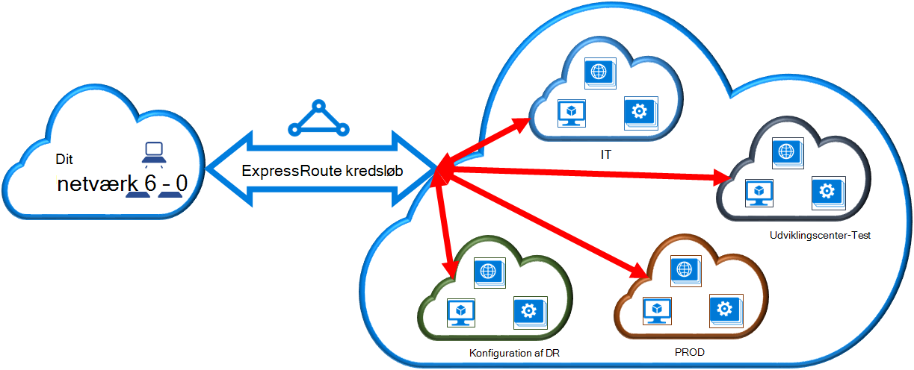

<properties 
   pageTitle="Sammenkæde et virtuelt netværk med et ExpressRoute kredsløb ved hjælp af PowerShell | Microsoft Azure"
   description="Dette dokument indeholder en oversigt over, hvordan du kan sammenkæde virtuelle netværk (VNets) til ExpressRoute kredsløb ved hjælp af Ressourcestyring implementeringsmodel og PowerShell."
   services="expressroute"
   documentationCenter="na"
   authors="ganesr"
   manager="carmonm"
   editor=""
   tags="azure-resource-manager"/>
<tags 
   ms.service="expressroute"
   ms.devlang="na"
   ms.topic="article"
   ms.tgt_pltfrm="na"
   ms.workload="infrastructure-services"
   ms.date="10/10/2016"
   ms.author="ganesr" />

# Sammenkæde et virtuelt netværk med et ExpressRoute kredsløb

> [AZURE.SELECTOR]
- [Azure Portal - ressourcestyring](expressroute-howto-linkvnet-portal-resource-manager.md)
- [PowerShell - ressourcestyring](expressroute-howto-linkvnet-arm.md)
- [PowerShell - klassisk](expressroute-howto-linkvnet-classic.md)

I denne artikel kan du sammenkæde virtuelle netværk (VNets) med Azure ExpressRoute kredsløb ved hjælp af Ressourcestyring implementeringsmodel og PowerShell. Virtuelt Network kan enten være i samme abonnement eller en del af et andet abonnement.

**Om Azure-installation modeller**

[AZURE.INCLUDE [vpn-gateway-clasic-rm](../../includes/vpn-gateway-classic-rm-include.md)] 

## Forudsætninger for konfiguration

- Du har brug for den seneste version af Azure PowerShell-moduler (mindst version 1.0). Se, [hvordan du installerer og konfigurerer Azure PowerShell](../powershell-install-configure.md) kan finde flere oplysninger om installation af PowerShell-cmdlet'er.
- Du skal gennemgå [forudsætninger](expressroute-prerequisites.md), [routing krav](expressroute-routing.md)og [arbejdsprocesser](expressroute-workflows.md) , inden du starter konfigurationen.
- Du skal have et aktivt ExpressRoute kredsløb. 
    - Følg vejledningen for at [oprette et ExpressRoute kredsløb](expressroute-howto-circuit-arm.md) og har det kredsløb, der er aktiveret af din connectivity udbyder. 
    - Sørg for, at du har Azure privat peering konfigureret for din kredsløb. Se artiklen [konfigurere routing](expressroute-howto-routing-arm.md) routing vejledning. 
    - Sikre, at Azure private peering er konfigureret og BGP peering mellem dit netværk og Microsoft er oprettet, så du kan aktivere til slut connectivity.
    - Sørg for, at du har et virtuelt netværk og et virtuelt netværk gatewayen oprettet og fuldt klargjort. Følg vejledningen for at oprette en [VPN-gateway](../articles/vpn-gateway/vpn-gateway-create-site-to-site-rm-powershell.md), men Sørg for at bruge `-GatewayType ExpressRoute`.

Du kan sammenkæde op til 10 virtuelle netværk til et almindeligt ExpressRoute kredsløb. Alle virtuelle netværk skal være i samme geopolitiske region, når du bruger et standard ExpressRoute kredsløb. 

Du kan sammenkæde et virtuelt Network uden for området geopolitiske af ExpressRoute kredsløb eller oprette forbindelse et større antal virtuelle netværk til din ExpressRoute kredsløb, hvis du har aktiveret ExpressRoute premium tilføjelsesprogrammet. Se [ofte stillede spørgsmål](expressroute-faqs.md) til flere oplysninger om tilføjelsesprogrammet premium.

## Forbinde et virtuelt netværk i samme abonnement til et kredsløb

Du kan oprette forbindelse et virtuelt netværksgateway til en ExpressRoute kredsløb ved hjælp af følgende cmdlet. Sørg for, at gatewayen virtuelt netværk oprettes og er klar til at sammenkæde, før du køre følgende cmdlet:

    $circuit = Get-AzureRmExpressRouteCircuit -Name "MyCircuit" -ResourceGroupName "MyRG"
    $gw = Get-AzureRmVirtualNetworkGateway -Name "ExpressRouteGw" -ResourceGroupName "MyRG"
    $connection = New-AzureRmVirtualNetworkGatewayConnection -Name "ERConnection" -ResourceGroupName "MyRG" -Location "East US" -VirtualNetworkGateway1 $gw -PeerId $circuit.Id -ConnectionType ExpressRoute

## Forbinde et virtuelt netværk i et andet abonnement til et kredsløb

Du kan dele et ExpressRoute kredsløb på tværs af flere abonnementer. I følgende figur vises en enkel skematiske af hvordan deling fungerer for ExpressRoute kredsløb på tværs af flere abonnementer.

Hver af de mindre skyer i store skyen bruges til at repræsentere abonnementer, der tilhører forskellige afdelinger i en organisation. Hver af afdelinger i organisationen kan bruge deres egen abonnement til implementering af deres services – men de kan dele et enkelt ExpressRoute kredsløb til at oprette forbindelse tilbage til dit lokale netværk. En enkelt afdeling (i dette eksempel: IT) kan ejer ExpressRoute kredsløb. Andre abonnementer i organisationen kan bruge ExpressRoute kredsløbet.

>[AZURE.NOTE] Forbindelsen og båndbredde gebyrer for dedikeret kredsløb anvendes til ExpressRoute kredsløb ejer. Alle virtuelle netværk dele den samme båndbredde.

### Administration

*Kredsløb ejer* er en autoriserede power bruger af ExpressRoute kredsløb ressourcen. Ejeren af kredsløb kan oprette tilladelser, der kan være indløst af *kredsløb brugere*. *Kredsløb brugere* er ejere af virtuelt netværk gateways (, der ikke er i samme abonnement som ExpressRoute kredsløb). *Kredsløb brugere* kan indløse tilladelser (én authorization per virtuelt netværk).

*Kredsløb ejeren* har mulighed for at redigere og ophæve tilladelser når som helst. Tilbagekalde en godkendelse resultater i alle link forbindelser blive slettet fra det abonnement, hvis adgang blev tilbagekaldt.

### Kredsløb ejer handlinger 

#### Oprette en tilladelse
    
Ejeren af kredsløb opretter en tilladelse. Dette resulterer i oprettelse af en tilladelse nøgle, der kan bruges af en kredsløb bruger til at forbinde deres virtuelt netværk gateways til ExpressRoute kredsløb. Tilladelsen er gyldige for kun én forbindelse.

De følgende cmdlet kodestykke viser, hvordan du opretter en tilladelse:

    $circuit = Get-AzureRmExpressRouteCircuit -Name "MyCircuit" -ResourceGroupName "MyRG"
    Add-AzureRmExpressRouteCircuitAuthorization -ExpressRouteCircuit $circuit -Name "MyAuthorization1"
    Set-AzureRmExpressRouteCircuit -ExpressRouteCircuit $circuit

        $circuit = Get-AzureRmExpressRouteCircuit -Name "MyCircuit" -ResourceGroupName "MyRG"
    $auth1 = Get-AzureRmExpressRouteCircuitAuthorization -ExpressRouteCircuit $circuit -Name "MyAuthorization1"
        

Svar til denne skal indeholde godkendelse nøgle og status:

    Name                   : MyAuthorization1
    Id                     : /subscriptions/&&&&&&&&&&&&&&&&&&&&&&&&&&&&&&&&&&&&/resourceGroups/ERCrossSubTestRG/providers/Microsoft.Network/expressRouteCircuits/CrossSubTest/authorizations/MyAuthorization1
    Etag                   : &&&&&&&&&&&&&&&&&&&&&&&&&&&&&&&&&&&& 
    AuthorizationKey       : ####################################
    AuthorizationUseStatus : Available
    ProvisioningState      : Succeeded

        

#### Gennemgå tilladelser

Ejeren af kredsløb kan gennemse alle de tilladelser, der er udstedt på et bestemt kredsløb ved at køre følgende cmdlet:

    $circuit = Get-AzureRmExpressRouteCircuit -Name "MyCircuit" -ResourceGroupName "MyRG"
    $authorizations = Get-AzureRmExpressRouteCircuitAuthorization -ExpressRouteCircuit $circuit
    

#### Tilføjelse af tilladelser

Ejeren af kredsløb kan tilføje tilladelser ved hjælp af følgende cmdlet:

    $circuit = Get-AzureRmExpressRouteCircuit -Name "MyCircuit" -ResourceGroupName "MyRG"
    Add-AzureRmExpressRouteCircuitAuthorization -ExpressRouteCircuit $circuit -Name "MyAuthorization2"
    Set-AzureRmExpressRouteCircuit -ExpressRouteCircuit $circuit
    
    $circuit = Get-AzureRmExpressRouteCircuit -Name "MyCircuit" -ResourceGroupName "MyRG"
    $authorizations = Get-AzureRmExpressRouteCircuitAuthorization -ExpressRouteCircuit $circuit

    
#### Sletning af tilladelser

Ejeren af kredsløb kan revoke/Slet tilladelser til brugeren, ved at køre følgende cmdlet:

    Remove-AzureRmExpressRouteCircuitAuthorization -Name "MyAuthorization2" -ExpressRouteCircuit $circuit
    Set-AzureRmExpressRouteCircuit -ExpressRouteCircuit $circuit    

### Kredsløb bruger handlinger

Kredsløb brugeren skal have et peer-ID og en authorization nøgle fra ejeren af kredsløb. Tasten authorization er en GUID.

Peer-ID er, kan kontrolleres fra følgende kommando.

    Get-AzureRmExpressRouteCircuit -Name "MyCircuit" -ResourceGroupName "MyRG"

#### Indløse forbindelse tilladelser

Kredsløb brugeren kan køre følgende cmdlet for at indløse en link tilladelse:

    $id = "/subscriptions/********************************/resourceGroups/ERCrossSubTestRG/providers/Microsoft.Network/expressRouteCircuits/MyCircuit"  
    $gw = Get-AzureRmVirtualNetworkGateway -Name "ExpressRouteGw" -ResourceGroupName "MyRG"
    $connection = New-AzureRmVirtualNetworkGatewayConnection -Name "ERConnection" -ResourceGroupName "RemoteResourceGroup" -Location "East US" -VirtualNetworkGateway1 $gw -PeerId $id -ConnectionType ExpressRoute -AuthorizationKey "^^^^^^^^^^^^^^^^^^^^^^^^^^^^^^^^^^^^^^^^^^^^^"

#### Frigive forbindelse tilladelser

Du kan frigive en authorization ved at slette forbindelsen, der er sammenkædet ExpressRoute kredsløb til det virtuelle netværk.

## Næste trin

Du kan finde flere oplysninger om ExpressRoute, [ExpressRoute ofte stillede spørgsmål](expressroute-faqs.md).
