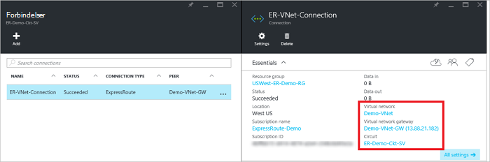

<properties
   pageTitle="Sammenkæde et virtuelt netværk til en ExpressRoute kredsløb ved hjælp af implementeringsmodel ressourcestyring og portalen Azure | Microsoft Azure"
   description="Dette dokument indeholder en oversigt over, hvordan kan kædes ExpressRoute kredsløb virtuelle netværk (VNets)."
   services="expressroute"
   documentationCenter="na"
   authors="cherylmc"
   manager="carmonm"
   editor=""
   tags="azure-resource-manager"/>
<tags
   ms.service="expressroute"
   ms.devlang="na"
   ms.topic="article"
   ms.tgt_pltfrm="na"
   ms.workload="infrastructure-services"
   ms.date="10/10/2016"
   ms.author="cherylmc" />

# Sammenkæde et virtuelt netværk med et ExpressRoute kredsløb

> [AZURE.SELECTOR]
- [Azure Portal - ressourcestyring](expressroute-howto-linkvnet-portal-resource-manager.md)
- [PowerShell - ressourcestyring](expressroute-howto-linkvnet-arm.md)
- [PowerShell - klassisk](expressroute-howto-linkvnet-classic.md)

I denne artikel kan du sammenkæde virtuelle netværk (VNets) til Azure ExpressRoute kredsløb ved hjælp af implementeringsmodel ressourcestyring og Azure portalen. Virtuelt Network kan enten være i samme-abonnement, eller de kan være en del af et andet abonnement.

**Om Azure-installation modeller**

[AZURE.INCLUDE [vpn-gateway-clasic-rm](../../includes/vpn-gateway-classic-rm-include.md)]

## Forudsætninger for konfiguration

- Sørg for, at du har gennemgået [forudsætninger](expressroute-prerequisites.md), [routing krav](expressroute-routing.md)og [arbejdsprocesser](expressroute-workflows.md) , inden du starter konfigurationen.
- Du skal have et aktivt ExpressRoute kredsløb.
    - Følg vejledningen for at [oprette et ExpressRoute kredsløb](expressroute-howto-circuit-arm.md) og har det kredsløb, der er aktiveret af din connectivity udbyder.

    - Sørg for, at du har Azure privat peering konfigureret for din kredsløb. Se artiklen [konfigurere routing](expressroute-howto-routing-portal-resource-manager.md) routing vejledning.

    - Sikre, at Azure private peering er konfigureret og BGP peering mellem dit netværk og Microsoft er oprettet, så du kan aktivere til slut connectivity.

    - Sørg for, at du har et virtuelt netværk og et virtuelt netværk gatewayen oprettet og fuldt klargjort. Følg vejledningen for at oprette en [VPN-gateway](../articles/vpn-gateway/vpn-gateway-howto-site-to-site-resource-manager-portal.md) (Følg kun trin 1-5).

Du kan sammenkæde op til 10 virtuelle netværk til et almindeligt ExpressRoute kredsløb. Alle virtuelle netværk skal være i samme geopolitiske region, når du bruger et standard ExpressRoute kredsløb. Du kan sammenkæde et virtuelt Network uden for området geopolitiske af ExpressRoute kredsløb eller oprette forbindelse et større antal virtuelle netværk til din ExpressRoute kredsløb, hvis du har aktiveret ExpressRoute premium tilføjelsesprogrammet. Se [ofte stillede spørgsmål](expressroute-faqs.md) til flere oplysninger om tilføjelsesprogrammet premium.

## Forbinde et virtuelt netværk i samme abonnement til et kredsløb

### Sådan oprettes en forbindelse

1. Sørg for, at dine ExpressRoute kredsløb og Azure private peering er konfigureret korrekt. Følg vejledningen i [oprette et ExpressRoute kredsløb](expressroute-howto-circuit-arm.md) og [Konfigurer distribution](expressroute-howto-routing-arm.md). Din ExpressRoute kredsløb skal se ud som følgende billede.

    

    >[AZURE.NOTE] BGP konfigurationsoplysninger bliver ikke vist Hvis provideren layer 3 konfigureret dine peerings. Hvis din kredsløb er i en klargjort tilstand, skal du kunne oprette forbindelser.

2. Nu kan du starte klargøring af en forbindelse for at knytte din virtuelt netværksgateway til din ExpressRoute kredsløb. Klik på **forbindelse** > **Tilføj** til at åbne bladet **Tilføj forbindelse** , og derefter konfigurere værdierne. Se eksemplet nedenfor reference.

      

3. Når forbindelsen er konfigureret korrekt, vises forbindelsesobjektet oplysningerne for forbindelsen.

    

### Slette en forbindelse

Du kan slette en forbindelse ved at vælge ikonet **Slet** på bladet for forbindelsen.

## Forbinde et virtuelt netværk i et andet abonnement til et kredsløb

På nuværende tidspunkt, du kan ikke oprette forbindelse virtuelle netværk på tværs af abonnementer ved hjælp af portalen Azure. Dog kan du bruge PowerShell til at gøre dette. Artiklen [PowerShell](expressroute-howto-linkvnet-arm.md) kan finde flere oplysninger.

## Næste trin

Du kan finde flere oplysninger om ExpressRoute, [ExpressRoute ofte stillede spørgsmål](expressroute-faqs.md).
