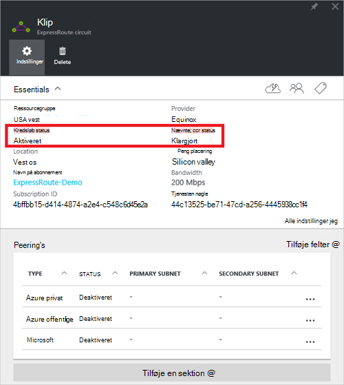
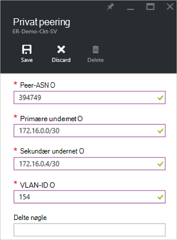
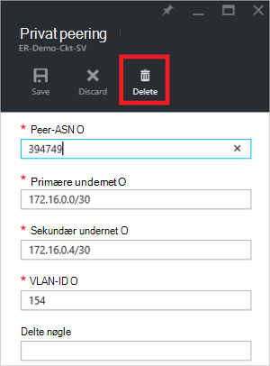
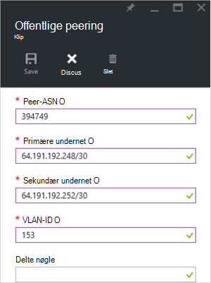
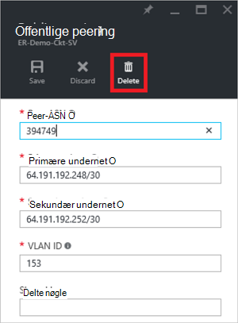
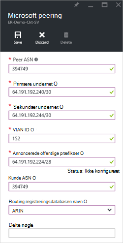
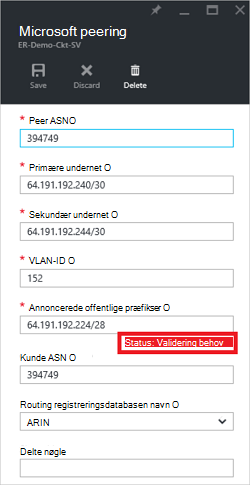
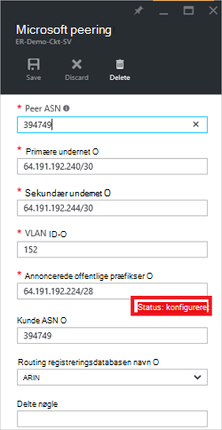
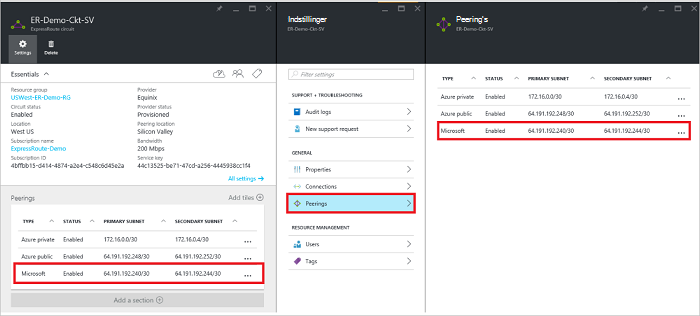
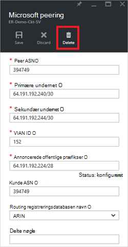

<properties
   pageTitle="Hvordan du konfigurerer routing til et ExpressRoute kredsløb ved hjælp af portalen Azure | Microsoft Azure"
   description="I denne artikel fører dig gennem trinnene til oprettelse og klargøring privat, offentlige og Microsoft peering af et ExpressRoute kredsløb. Denne artikel kan du også hvordan til at kontrollere status, opdatere eller slette peerings for din kredsløb."
   documentationCenter="na"
   services="expressroute"
   authors="cherylmc"
   manager="carmonm"
   editor=""
   tags="azure-resource-manager"/>
<tags
   ms.service="expressroute"
   ms.devlang="na"
   ms.topic="hero-article" 
   ms.tgt_pltfrm="na"
   ms.workload="infrastructure-services"
   ms.date="10/10/2016"
   ms.author="cherylmc"/>

# Oprette og redigere distribution til et ExpressRoute kredsløb

> [AZURE.SELECTOR]
[Azure Portal - ressourcestyring](expressroute-howto-routing-portal-resource-manager.md)
[PowerShell - ressourcestyring](expressroute-howto-routing-arm.md)
[PowerShell - klassisk](expressroute-howto-routing-classic.md)

I denne artikel fører dig gennem trinnene til at oprette og administrere konfigurationen af routing til en ExpressRoute kredsløb, ved hjælp af portalen Azure og implementeringsmodel ressourcestyring.

**Om Azure-installation modeller**

[AZURE.INCLUDE [vpn-gateway-clasic-rm](../../includes/vpn-gateway-classic-rm-include.md)] 

## Forudsætninger for konfiguration

- Sørg for, at du har gennemgået siden [forudsætninger](expressroute-prerequisites.md) , siden [routing krav](expressroute-routing.md) og siden [arbejdsprocesser](expressroute-workflows.md) , inden du starter konfigurationen.
- Du skal have et aktivt ExpressRoute kredsløb. Følg vejledningen til at [oprette et ExpressRoute kredsløb](expressroute-howto-circuit-arm.md) og har det kredsløb, der er aktiveret af din udbyder af connectivity, før du fortsætter. ExpressRoute kredsløb skal være i tilstanden klargjort og aktiveret for dig at kunne køre cmdletter beskrevet nedenfor.

Disse instruktioner gælder kun for kredsløb, der er oprettet med tjenesteudbydere tilbyder Layer 2 forbindelsestjenester. Hvis du bruger en udbyder af tilbyde administrerede Layer 3-tjenester (normalt en IPVPN, som MPLS), skal udbyderen connectivity konfigurere og administrere routing for dig. 

>[AZURE.IMPORTANT] Vi annoncere i øjeblikket ikke peerings af tjenesteudbydere via service management-portalen. Vi arbejder på at aktivere denne funktion snart. Spørg din tjenesteudbyder, inden du konfigurerer BGP peerings.

Du kan konfigurere en, to eller alle tre peerings (Azure privat, Azure offentligt og Microsoft) for en ExpressRoute kredsløb. Du kan konfigurere peerings i en hvilken som helst rækkefølge, du vælger. Skal du sikre dig, at du har fuldført konfigurationen af hver peering én ad gangen. 

## Azure privat peering

Dette afsnit indeholder vejledning i at oprette, få, opdatere og slette Azure privat peering konfigurationen for et ExpressRoute kredsløb. 

### Oprette Azure privat peering

1. Konfigurere ExpressRoute kredsløb. Sørg for, at kredsløbet er klargjort fuldt af provideren connectivity, før du fortsætter.

    

2. Konfigurere Azure privat peering for kredsløbet. Sørg for, at du har følgende elementer, før du fortsætter med de næste trin:

    - En /30 undernet til linket primære. Dette må ikke være en del af en hvilken som helst reserveret til virtuelle netværk adresseområde.
    - En /30 undernet til linket sekundær. Dette må ikke være en del af en hvilken som helst reserveret til virtuelle netværk adresseområde.
    - Et gyldigt VLAN ID til at oprette denne peering på. Sikre, at ingen andre peering i kredsløbet bruger det samme VLAN-ID.
    - SOM tal for peering. Du kan bruge både 2-byte og 4 byte som tal. Du kan bruge en privat som tal for denne peering. Sørg for, at du ikke bruger 65515.
    - En MD5 hashværdi, hvis du vælger at bruge en. **Dette er valgfrit**.

3. Vælg Azure privat peering rækken, som vist nedenfor.
    
    
    

4. Konfigurere private peering. Billedet nedenfor viser et eksempel på konfiguration.

    

    
5. Gemme konfigurationen, når du har angivet alle parametre. Når konfigurationen er blevet accepteret korrekt, får du vist noget lignende eksemplet nedenfor.

    
    

### At få vist Azure privat peering oplysninger

Du kan få vist egenskaberne for Azure privat peering ved at vælge den peering.

### Opdatere Azure privat peering konfiguration

Du kan markere rækken for peering og ændre egenskaberne peering. 

### Slette Azure privat peering

Du kan fjerne konfigurationen af peering ved at vælge sletteikonet som vist nedenfor.

## Azure offentlige peering

Dette afsnit indeholder vejledning i at oprette, få, opdatere og slette Azure offentlige peering konfigurationen for et ExpressRoute kredsløb. 

### Oprette Azure offentlige peering

1. Konfigurere ExpressRoute kredsløb. Sørg for, at kredsløbet er klargjort fuldt af provideren connectivity, før du fortsætter yderligere.

    

2. Konfigurere Azure offentlige peering for kredsløbet. Sørg for, at du har følgende elementer, før du fortsætter med de næste trin:

    - En /30 undernet til linket primære. 
    - En /30 undernet til linket sekundær. 
    - Alle IP-adresser, der bruges til at konfigurere denne peering skal være gyldige offentlige IPv4-adresser.
    - Et gyldigt VLAN ID til at oprette denne peering på. Sikre, at ingen andre peering i kredsløbet bruger det samme VLAN-ID.
    - SOM tal for peering. Du kan bruge både 2-byte og 4 byte som tal.
    - En MD5 hashværdi, hvis du vælger at bruge en. **Dette er valgfrit**.

3. Vælg Azure offentlige peering rækken, som vist nedenfor.
    
    
    

4. Konfigurere offentlige peering. Billedet nedenfor viser et eksempel på konfiguration.

    

    
5. Gemme konfigurationen, når du har angivet alle parametre. Når konfigurationen er blevet accepteret korrekt, får du vist noget lignende eksemplet nedenfor.

    
    

### At få vist Azure offentlige peering oplysninger

Du kan få vist egenskaberne for Azure offentlige peering ved at vælge den peering.

### Opdatere Azure offentlige peering konfiguration

Du kan markere rækken for peering og ændre egenskaberne peering. 

### Slette Azure offentlige peering

Du kan fjerne konfigurationen af peering ved at vælge sletteikonet som vist nedenfor.

## Microsoft peering

Dette afsnit indeholder vejledning i at oprette, få, opdatere og slette peering konfigurationen af Microsoft til et ExpressRoute kredsløb. 

### Til at oprette Microsoft peering

1. Konfigurere ExpressRoute kredsløb. Sørg for, at kredsløbet er klargjort fuldt af provideren connectivity, før du fortsætter yderligere.

    

2. Konfigurere Microsoft peering for kredsløbet. Sørg for, at du har følgende oplysninger, inden du fortsætter.

    - En /30 undernet til linket primære. Det skal være et gyldigt offentlige IPv4 præfiks ejet af dig og er registreret i en RIR / IA.
    - En /30 undernet til linket sekundær. Det skal være et gyldigt offentlige IPv4 præfiks ejet af dig og er registreret i en RIR / IA.
    - Et gyldigt VLAN ID til at oprette denne peering på. Sikre, at ingen andre peering i kredsløbet bruger det samme VLAN-ID.
    - SOM tal for peering. Du kan bruge både 2-byte og 4 byte som tal.
    - **Annonceret præfikser:** Du skal angive en liste over alle præfikser du planlægger at annoncere over BGP session. Kun offentlige IP-adressepræfikser accepteres. Hvis du planlægger at sende et sæt af præfikser, kan du sende en kommasepareret liste. Disse præfikser skal være registreret for dig i en RIR / IA.
    - **Kunde ASN:** Hvis du er reklame præfikser på enheder, der ikke er registreret til peering som tal, kan du angive det som tal, som de er registreret. **Dette er valgfrit**.
    - **Routing registreringsdatabasen navn:** Du kan angive RIR / IA mod som det som tal og præfikser er registreret. **Dette er valgfrit.**
    - En MD5-hash, hvis du vælger at bruge en. **Dette er valgfrit.**
    
3. Du kan vælge peering, du vil konfigurere som vist nedenfor. Vælg rækken Microsoft peering.
    
    
    

4.  Konfigurere Microsoft peering. Billedet nedenfor viser et eksempel på konfiguration.

    

    
5. Gemme konfigurationen, når du har angivet alle parametre. 

    Hvis din kredsløb bliver til en validering behov tilstand (som vist nedenfor), skal du åbne en supportbilletter for at få vist dokumentere dit ejerskab af præfikser til vores supportteam.  
    
    

    Du kan åbne en supportbilletter direkte fra portalen som vist nedenfor   
    
    

6. Når konfigurationen er blevet accepteret korrekt, får du vist noget lignende eksemplet nedenfor.

    
    

### At få vist Microsoft peering oplysninger

Du kan få vist egenskaberne for Azure offentlige peering ved at vælge den peering.

### Opdatere Microsoft peering konfiguration

Du kan markere rækken for peering og ændre egenskaberne peering. 

### Sådan sletter du Microsoft peering

Du kan fjerne konfigurationen af peering ved at vælge sletteikonet som vist nedenfor.

## Næste trin

Næste trin, [Link en VNet til en ExpressRoute kredsløb](expressroute-howto-linkvnet-arm.md).

-  Du kan finde flere oplysninger om ExpressRoute arbejdsprocesser, [ExpressRoute arbejdsprocesser](expressroute-workflows.md).

-  Du kan finde flere oplysninger om kredsløb peering, se [ExpressRoute kredsløb og routing domæner](expressroute-circuit-peerings.md).

-  Se [Oversigt over virtuelle netværk](../virtual-network/virtual-networks-overview.md), du kan finde flere oplysninger om at arbejde med virtuelle netværk.

