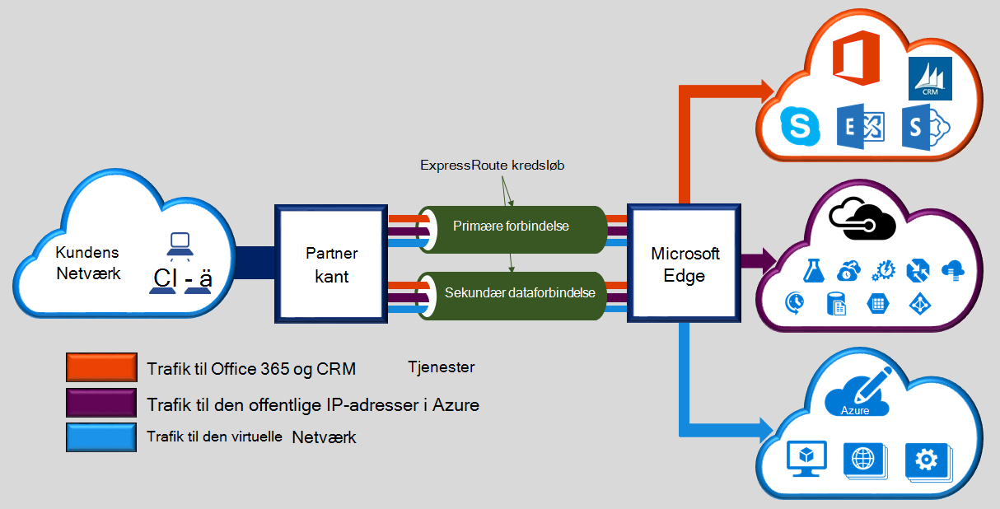
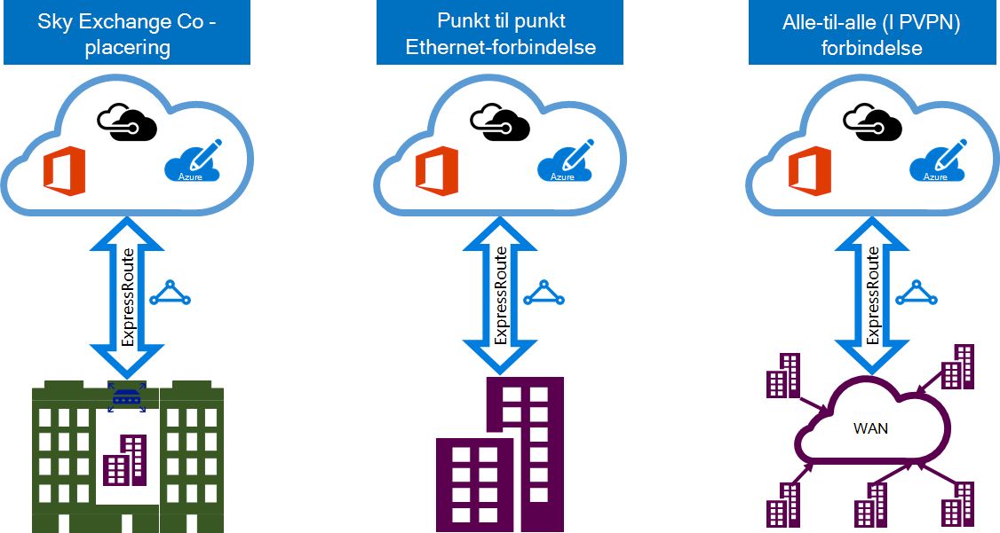

<properties 
   pageTitle="Introduktion til ExpressRoute | Microsoft Azure"
   description="Denne side indeholder en oversigt over tjenesten ExpressRoute, herunder hvordan forbindelse ExpressRoute fungerer."
   documentationCenter="na"
   services="expressroute"
   authors="cherylmc"
   manager="carmonm"
   editor=""/>
<tags 
   ms.service="expressroute"
   ms.devlang="na"
   ms.topic="get-started-article" 
   ms.tgt_pltfrm="na"
   ms.workload="infrastructure-services" 
   ms.date="10/10/2016"
   ms.author="cherylmc"/>

# ExpressRoute teknisk oversigt

Microsoft Azure ExpressRoute kan du udvide dit lokale netværk i Microsoft cloud over en dedikeret privat forbindelse via en udbyder af connectivity. Med ExpressRoute, kan du oprette forbindelse til Microsofts skytjenester, som Microsoft Azure, Office 365 og CRM Online. Forbindelse kan være fra en en-til-alle netværk (VPN IP), et punkt til punkt Ethernet-netværk eller en virtuel tværs forbindelse via en udbyder af connectivity på en samtidig placering facilitet. ExpressRoute forbindelser går ikke via offentlige internettet. Dette giver mulighed for ExpressRoute forbindelser til at tilbyde flere pålidelighed, hastigheden, nederste latenstider og højere sikkerhed end typisk forbindelser via internettet.

**Vigtigste fordele omfatter:**

- Layer 3 forbindelsen mellem dit lokale netværk og Microsoft Cloud via en forbindelse. Forbindelse kan være fra en en-til-alle (IPVPN) netværk, Ethernet fastklæbning, eller via en virtuel tværs forbindelse via en Ethernet exchange.
- Forbindelse til Microsofts skytjenester på tværs af alle områder i geopolitiske område.
- Global forbindelse til Microsoft-tjenester på tværs af alle områder med ExpressRoute premium tilføjelsesprogrammet.
- Dynamisk routing mellem dit netværk og Microsoft over branche standard protokoller (BGP).
- Indbygget redundans i hver peering placering for højere pålidelighed.
- Forbindelse oppetid [SERVICENIVEAUAFTALE](https://azure.microsoft.com/support/legal/sla/).
- QoS og understøttelse af flere klasser til særlige formål, såsom Skype for Business-tjenesten.

Se [ExpressRoute ofte stillede spørgsmål](expressroute-faqs.md) få mere at vide.

## Hvordan kan jeg oprette forbindelse mit netværk til Microsoft ved hjælp af ExpressRoute?

Du kan oprette en forbindelse mellem dit lokale netværk og Microsoft skyen på tre forskellige måder:

### Samtidig findes i en sky exchange

Hvis du er samtidig placeret i en funktion med en sky exchange, kan du bestille virtuelle kryds-forbindelser til Microsoft cloud gennem samtidig placering-provideren Ethernet exchange. Udbydere af samtidig placering kan tilbyde Layer 2 kryds-forbindelser eller administrerede Layer 3 kryds-forbindelser mellem infrastrukturen i funktionen samtidig placering og Microsoft skyen.

### Punkt til punkt Ethernet-forbindelser 

Du kan oprette forbindelse til din lokale datacentre/kontorer i Microsoft skyen gennem punkt til punkt Ethernet links. Punkt til punkt Ethernet udbydere kan tilbyde Layer 2 forbindelser eller administrerede Layer 3 forbindelser mellem webstedet og Microsoft skyen.

### Alle-til-alle (IPVPN) netværk

Du kan integrere din WAN med Microsoft skyen. IPVPN udbydere (typisk MPLS VPN) tilbyder en-til-en forbindelse mellem din gren kontorer og datacentre. Microsoft cloud kan være forbundet til din WAN at give den et ligesom andre afdelingen. WAN udbydere tilbyder typisk administrerede Layer 3-forbindelse. ExpressRoute egenskaber og funktioner, er alle identiske på tværs af alle de ovenstående connectivity-modeller. 

Udbydere af Connectivity kan tilbyde en eller flere connectivity-modeller. Du kan arbejde med din connectivity udbyder du skal vælge den model, der passer dig bedst.

## ExpressRoute funktioner

ExpressRoute understøtter følgende funktioner og egenskaber: 

### Layer 3 connectivity

Microsoft bruger branche standard dynamiske routing-protokollen (BGP) til at udveksle dirigerer mellem dit lokale netværk, din forekomster i Azure og Microsoft offentlige adresser.  Vi oprette flere BGP sessioner med dit netværk for forskellige trafik profiler. Yderligere oplysninger finder du i artiklen [ExpressRoute kredsløb og routing domæner](expressroute-circuit-peerings.md) .

### Redundans

Hvert ExpressRoute kredsløb består af to forbindelser til to Microsoft Enterprise kant routere (MSEEs) fra provideren connectivity / dit hjemmenetværk kant. Microsoft kræver to BGP forbindelse fra provideren connectivity / din side – et til hver MSEE. Du kan vælge ikke at implementere overflødige enheder / Ethernet kredsløb din sidst. Men bruge connectivity udbydere overflødige enheder til at sikre, at dine forbindelser er afleveret til Microsoft på en overflødige måde. En overflødige Layer 3 connectivity konfiguration er et krav for vores [SERVICENIVEAUAFTALE](https://azure.microsoft.com/support/legal/sla/) skal gælde. 

### Forbindelse til Microsofts skytjenester

[AZURE.INCLUDE [expressroute-office365-include](../../includes/expressroute-office365-include.md)]

ExpressRoute forbindelser aktivere adgang til følgende tjenester:

- Microsoft Azure-tjenester
- Microsoft Office 365-tjenester
- Microsoft CRM Online services 
 
Du kan besøge siden [ExpressRoute ofte stillede spørgsmål om](expressroute-faqs.md) for en detaljeret liste over tjenester, der understøttes over ExpressRoute.

### Forbindelse til alle områder i et geopolitiske område

Du kan oprette forbindelse til Microsoft på en af vores [peering placeringer](expressroute-locations.md) og har adgang til alle områder i området geopolitiske. 

Eksempelvis hvis du har forbindelse til Microsoft i Amsterdam gennem ExpressRoute, har du adgang til alle Microsofts skytjenester nord Europa og vestlige Europe som vært. Se [ExpressRoute partnere og peering placeringer](expressroute-locations.md) artiklen for at få overblik over geopolitiske områder, tilknyttede Microsoft cloud-områder og tilsvarende ExpressRoute peering placeringer.

### Global forbindelse med ExpressRoute premium tilføjelsesprogram

Du kan aktivere funktionen ExpressRoute premium tilføjelsesprogram til at udvide connectivity på tværs af geopolitiske grænser. Eksempelvis hvis du har forbindelse til Microsoft i Amsterdam gennem ExpressRoute, vil du have adgang til alle Microsofts skytjenester, der er hostet i alle områder på tværs af hele verden (nationale skyer er udeladt). Du kan få adgang til tjenester, der er implementeret i Sydamerika eller Australien på samme måde, du få adgang til Nord- og Vest Europe områderne.

### RTF connectivity partner økosystemet

ExpressRoute har en konstant voksende netværk af connectivity udbydere og SI partnere. Du kan referere til de seneste oplysninger artikel [ExpressRoute udbydere og placeringer](expressroute-locations.md) .

### Forbindelse til nationale skyer

Microsoft arbejder isolerede skyen miljøer til særlige geopolitiske områder og kunde målgrupper. Referere til siden [ExpressRoute udbydere og placeringer](expressroute-locations.md) for en liste over nationale skyer og udbydere.

### Understøttede båndbredde indstillinger

Du kan købe ExpressRoute kredsløb til en bred vifte af båndbredder. På listen over understøttede båndbredder vises nedenfor. Sørg for at kontakte din connectivity udbyder til at afgøre, på listen over understøttede båndbredder de giver.

- 50 Mbps
- 100 Mbps
- 200 Mbps
- 500 Mbps
- 1 Gbps
- 2 Gbps
- 5 Gbps
- 10 Gbps

### Dynamisk skalering af båndbredde

Du har mulighed for at øge ExpressRoute kredsløb båndbredde (på grundlag bedste indsats) uden at ned dine forbindelser. 

### Fleksibel fakturerende modeller

Du kan vælge en fakturering model, der passer dig bedst. Vælg mellem de fakturering modeller nedenfor. Se siden [ExpressRoute ofte stillede spørgsmål](expressroute-faqs.md) få mere at vide. 

- **Ubegrænset data**. ExpressRoute kredsløb debiteres baseret på et gebyr, og al indgående og udgående dataoverførsel er gratis inkluderet i procent. 
- **Betalte data**. ExpressRoute kredsløb debiteres baseret på et månedligt gebyr. Al indgående dataoverførsel er gratis. Udgående dataoverførsel er anvender per GB dataoverførsel. Data filoverførsel prisen kan variere efter område.
- **ExpressRoute premium tilføjelsesprogram**. ExpressRoute premium er et tilføjelsesprogram over ExpressRoute kredsløb. ExpressRoute premium tilføjelsesprogrammet indeholder følgende funktioner: 
    - Øget distribuere begrænsninger for Azure offentlige og Azure privat peering fra 4.000 omdirigerer til 10.000 omdirigerer.
    - Global connectivity for tjenester. Et ExpressRoute kredsløb, der er oprettet i en hvilken som helst område (undtagen nationale skyer) får adgang til ressourcer på tværs af en hvilken som helst andet område i verden. Et virtuelt netværk, der er oprettet i Vest Europa kan for eksempel åbnes via et ExpressRoute kredsløb klargjort i Silicon Valley.
    - Øget antal VNet links per ExpressRoute kredsløb fra 10 til en større grænse, afhængigt af båndbredden for kredsløbet.

## Næste trin

- Få mere at vide om ExpressRoute forbindelser og routing domæner. Se [ExpressRoute kredsløb og routing domæner](expressroute-circuit-peerings.md).
- Finde en tjenesteudbyder af. Se [ExpressRoute partnere og peering placeringer](expressroute-locations.md).
- Sørg for, at alle forudsætninger er opfyldt. Se [ExpressRoute forudsætninger](expressroute-prerequisites.md).
- Se krav til [distribution](expressroute-routing.md), [NAT](expressroute-nat.md) og [QoS](expressroute-qos.md).
- Konfigurere ExpressRoute forbindelsen.
    - [Oprette et ExpressRoute kredsløb](expressroute-howto-circuit-classic.md)
    - [Konfigurere routing](expressroute-howto-routing-classic.md)
    - [Sammenkæde en VNet med et ExpressRoute kredsløb](expressroute-howto-linkvnet-classic.md)
