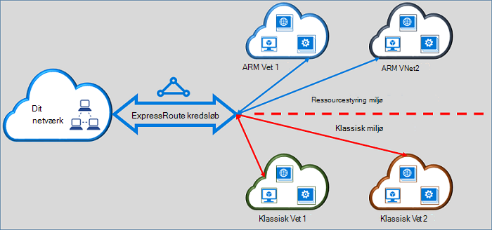

<properties
   pageTitle="Flytte ExpressRoute kredsløb fra klassisk til Ressourcestyring | Microsoft Azure"
   description="Denne side indeholder en oversigt over, hvad du bør vide om broer klassiske og ressourcestyring installation modeller."
   documentationCenter="na"
   services="expressroute"
   authors="ganesr"
   manager="carmonm"
   editor=""/>
<tags
   ms.service="expressroute"
   ms.devlang="na"
   ms.topic="get-started-article"
   ms.tgt_pltfrm="na"
   ms.workload="infrastructure-services"
   ms.date="10/10/2016"
   ms.author="ganesr"/>

# Flytte ExpressRoute kredsløb fra klassiske til implementeringsmodel ressourcestyring

Denne artikel indeholder en oversigt over, hvad det betyder at flytte et Azure ExpressRoute kredsløb fra klassiske til implementeringsmodel Azure ressourcestyring.

[AZURE.INCLUDE [vpn-gateway-sm-rm](../../includes/vpn-gateway-classic-rm-include.md)]

Du kan bruge et enkelt ExpressRoute kredsløb til at oprette forbindelse til virtuelle netværk, der er installeret, både i klassiske og ressourcestyring installation modeller. Et ExpressRoute kredsløb, uanset hvor den er oprettet, kan nu sammenkæde virtuelle netværk på tværs af begge installation-modeller.

## ExpressRoute kredsløb, der er oprettet i modellen, klassisk installation

ExpressRoute kredsløb, der er oprettet i den klassiske implementeringsmodel skal flyttes til implementeringsmodel ressourcestyring først for at aktivere forbindelsen til både klassiske og ressourcestyring installation modeller. Der er ikke connectivity tab eller afbrydelser når en forbindelse flyttes. Alle kredsløb til virtuelt netværk links i den klassiske implementeringsmodel (inden for samme abonnement og kryds-abonnement) bevares.

Når Flyt er fuldført, skal ExpressRoute kredsløbet ser ud, udfører og fungerer præcis som et ExpressRoute kredsløb, der er oprettet i implementeringsmodel ressourcestyring. Nu kan du oprette forbindelse til virtuelle netværk i implementeringsmodel ressourcestyring.

Når du har en ExpressRoute er kredsløb blevet flyttet til implementeringsmodel ressourcestyring kan du administrere ExpressRoute kredsløb livscyklus kun ved hjælp af Ressourcestyring implementeringsmodel. Det betyder, at du kan udføre handlinger som tilføjelse/opdatering/slette peerings, opdaterer kredsløb egenskaber (som båndbredde, SKU og fakturering type) og slette kredsløb kun i implementeringsmodel ressourcestyring. Se afsnittet nedenfor på kredsløb, der er oprettet i ressourcestyring implementeringsmodel yderligere oplysninger om, hvordan du kan administrere adgang til begge installation-modeller.

Du behøver ikke at involverer udbyderen forbindelse for at udføre Flyt.

## ExpressRoute kredsløb, der er oprettet i implementeringsmodel ressourcestyring

Du kan aktivere ExpressRoute kredsløb, der er oprettet i implementeringsmodel ressourceleder, der er tilgængelige fra begge installation-modeller. En hvilken som helst ExpressRoute kredsløb i dit abonnement kan være aktiveret til at få adgang til fra begge installation modeller.

- ExpressRoute kredsløb, der er oprettet i implementeringsmodel ressourcestyring har ikke adgang til den klassiske implementeringsmodel som standard.
- ExpressRoute kredsløb, der er blevet flyttet fra den klassiske implementeringsmodel til ressource manager implementeringsmodel er tilgængelige fra begge installation modeller som standard.
- Et ExpressRoute kredsløb har altid adgang til Ressourcestyring implementeringsmodel, uanset om det blev oprettet i ressourcestyring eller klassisk implementeringsmodel. Det betyder, at du kan oprette forbindelser til virtuelle netværk, der er oprettet i implementeringsmodel ressourcestyring ved at følge vejledningen til, [hvordan du forbinde virtuelle netværk](expressroute-howto-linkvnet-arm.md).
- Adgang til den klassiske implementeringsmodel styres af parameteren **allowClassicOperations** i ExpressRoute kredsløb.

>[AZURE.IMPORTANT] Alle kvoter, der er beskrevet på siden [service begrænsninger](../azure-subscription-service-limits.md) gælder. Et almindeligt kredsløb kan have højst 10 virtuelle links/netværksforbindelser på tværs af både klassiske og ressourcestyring installation modeller som et eksempel.

## Kontrol af adgang til den klassiske implementeringsmodel

Du kan aktivere et enkelt ExpressRoute kredsløb kædes sammen med virtuelle netværk i begge installation modeller ved at angive parameteren **allowClassicOperations** af ExpressRoute kredsløb.

Angive **allowClassicOperations** til sand, kan du forbinde virtuelle netværk fra begge installation modeller til ExpressRoute kredsløb. Du kan sammenkæde til virtuelle netværk i den klassiske implementeringsmodel ved at følge vejledning i [at forbinde virtuelle netværk i modellen Klassisk installation](expressroute-howto-linkvnet-classic.md). Du kan sammenkæde til virtuelle netværk i implementeringsmodel ressourcestyring ved at følge vejledning i [at forbinde virtuelle netværk i implementeringsmodel ressourcestyring](expressroute-howto-linkvnet-arm.md).

Konfigurer **allowClassicOperations** til falsk blokerer for adgang til kredsløbet fra den klassiske implementeringsmodel. Men alle virtuelt netværk links i den klassiske implementeringsmodel bevares. I dette tilfælde er ExpressRoute kredsløb ikke synlig i modellen, klassisk installation.

## Understøttede handlinger i modellen Klassisk installation

Følgende klassisk handlinger understøttes på en ExpressRoute kredsløb, når **allowClassicOperations** er indstillet til sand:

 - Få ExpressRoute kredsløb oplysninger
 - Oprette/Opdater/get/slette virtuelt netværk links til klassisk virtuelle netværk
 - Oprette/Opdater/get/slette virtuelt netværk link godkendelser af forbindelse i tværs-abonnement

Du kan ikke udføre følgende klassisk handlinger, når **allowClassicOperations** er indstillet til sand:

 - Opret/Opdater/get/Slet kant Gateway Protocol (BGP) peerings til Azure privat, Azure offentligt, og Microsoft peerings
 - Slette ExpressRoute kredsløb

## Kommunikationen mellem klassiske og ressourcestyring installation modeller

ExpressRoute kredsløb fungerer som en bro mellem klassiske og ressourcestyring installation modeller. Trafik mellem virtual machines i virtuelle netværk i modellen Klassisk installation og de virtuelle netværk i ressourcestyring installation model flyder gennem ExpressRoute Hvis begge virtuelle netværk er sammenkædet med det samme ExpressRoute kredsløb.

Sammenlæg overførselshastighed er begrænset af overførselshastighed kapaciteten af gatewayen virtuelt netværk. Trafik træder ikke connectivity udbyderens netværk eller dit netværk i så fald. Trafikken mellem de virtuelle netværk er helt indeholdt i Microsoft network.

## Adgang til Azure offentlige og Microsoft peering ressourcer

Du kan fortsætte med at få adgang til ressourcer, der typisk adgang via Azure offentlige peering og Microsoft peering uden at forstyrre.  

## Hvad er understøttet

I dette afsnit beskrives, hvad der er understøttet for ExpressRoute kredsløb:

 - Du kan bruge et enkelt ExpressRoute kredsløb at få adgang til virtuelle netværk, der er implementeret i klassiske og ressourcestyring installation modeller.
 - Du kan flytte et ExpressRoute kredsløb fra klassiske til implementeringsmodel ressourcestyring. Når du har flyttet, ExpressRoute kredsløb ser ud, mener og udfører som andre ExpressRoute kredsløb, der er oprettet i implementeringsmodel ressourcestyring.
 - Du kan flytte ExpressRoute kredsløbet. Kredsløb links, virtuelt netværk og VPN gateways kan ikke flyttes til denne handling.
 - Når du har en ExpressRoute er kredsløb blevet flyttet til implementeringsmodel ressourcestyring kan du administrere ExpressRoute kredsløb livscyklus kun ved hjælp af Ressourcestyring implementeringsmodel. Det betyder, at du kan udføre handlinger som tilføjelse/opdatering/slette peerings, opdaterer kredsløb egenskaber (som båndbredde, SKU og fakturering type) og slette kredsløb kun i implementeringsmodel ressourcestyring.
 - ExpressRoute kredsløb fungerer som en bro mellem klassiske og ressourcestyring installation modeller. Trafik mellem virtual machines i virtuelle netværk i modellen Klassisk installation og de virtuelle netværk i ressourcestyring installation model flyder gennem ExpressRoute Hvis begge virtuelle netværk er sammenkædet med det samme ExpressRoute kredsløb.
 - Kryds-abonnement connectivity understøttes i både klassiske og ressourcestyring installation modeller.

## Dette understøttes ikke

I dette afsnit beskrives, hvad understøttes ikke for ExpressRoute kredsløb:

 - Flytte kredsløb links, gateways og virtuelle netværk fra klassiske til implementeringsmodel ressourcestyring.
 - Administration af et ExpressRoute kredsløb livscyklus fra den klassiske implementeringsmodel.
 - Rollebaseret Access kontrolelement (RBAC) understøttelse af den klassiske implementeringsmodel. Du kan ikke udføre RBAC kontrolelementer til et kredsløb i modellen Klassisk installation. En administrator coadministrator på abonnementet, kan oprette et link eller fjerne sammenkædningen virtuelle netværk til kredsløbet.

## Konfiguration

Følg de instruktioner, der er beskrevet i [flytte et ExpressRoute kredsløb fra klassiske til implementeringsmodel ressourcestyring](expressroute-howto-move-arm.md).

## Næste trin

- Kan finde Arbejdsprocesoplysninger [ExpressRoute kredsløb klargøring af arbejdsprocesser og kredsløb tilstand](expressroute-workflows.md).
- Sådan konfigureres ExpressRoute forbindelsen:

    - [Oprette et ExpressRoute kredsløb](expressroute-howto-circuit-arm.md)
    - [Konfigurere routing](expressroute-howto-routing-arm.md)
    - [Sammenkæde et virtuelt netværk med et ExpressRoute kredsløb](expressroute-howto-linkvnet-arm.md)
