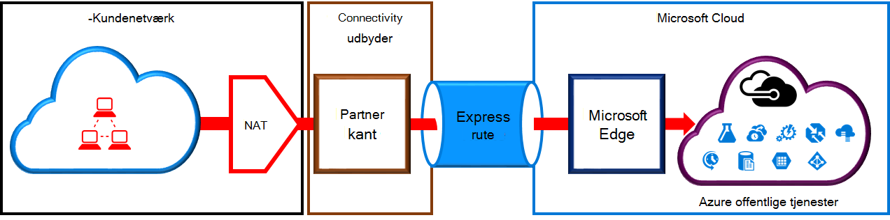
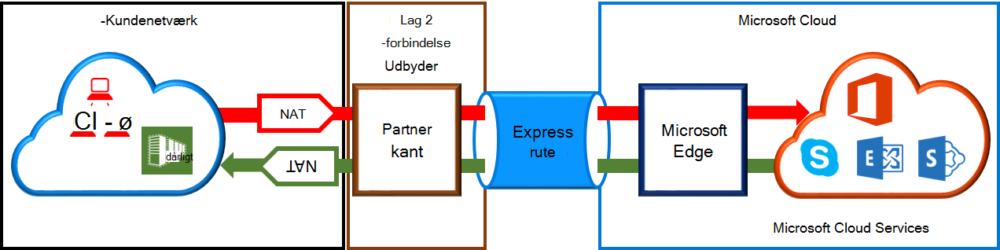

<properties
   pageTitle="NAT krav til ExpressRoute kredsløb | Microsoft Azure"
   description="Denne side indeholder særlige krav til konfiguration og administration af NAT til ExpressRoute kredsløb."
   documentationCenter="na"
   services="expressroute"
   authors="cherylmc"
   manager="carmonm"
   editor=""/>
<tags
   ms.service="expressroute"
   ms.devlang="na"
   ms.topic="get-started-article"
   ms.tgt_pltfrm="na"
   ms.workload="infrastructure-services"
   ms.date="10/10/2016"
   ms.author="cherylmc"/>

# ExpressRoute NAT krav

Hvis du vil oprette forbindelse til Microsofts skytjenester ved hjælp af ExpressRoute, skal du konfigurere og administrere NAT-enheder. Nogle connectivity udbydere tilbyder konfiguration og administration af NAT som en administreret tjeneste. Spørg udbyderen forbindelse for at kunne se, hvis de tilbyder sådanne en tjeneste. Hvis ikke, du skal overholde krav beskrevet nedenfor. 

Gennemgå siden [ExpressRoute kredsløb og routing domæner](expressroute-circuit-peerings.md) for at få en oversigt over de forskellige routing domæner. For at opfylde offentlige IP-adresse kravene til Azure offentlige og Microsoft peering, anbefaler vi, at du konfigurerer NAT mellem dit netværk og Microsoft. Dette afsnit indeholder en detaljeret beskrivelse af NAT-infrastrukturen, du vil konfigurere.

## NAT krav til Azure offentlige peering

Azure offentlige peering stien gør det muligt at oprette forbindelse til alle tjenester, der findes i Azure over deres offentlige IP-adresser. Disse omfatter tjenester, der er angivet i [ExpessRoute ofte stillede spørgsmål](expressroute-faqs.md) og de tjenester, der er hostet af softwareudviklere på Microsoft Azure. Forbindelse til Microsoft Azure-tjenester på offentlige peering startes altid fra dit netværk til Microsoft network. Trafik bestemt til Microsoft Azure på offentlige peering skal være SNATed til gyldige offentlige IPv4-adresser, inden de angiver Microsoft network. Figuren nedenfor indeholder et overordnet billede af hvordan NAT kan være konfigureret til at opfylde ovennævnte krav.

 

### NAT IP puljen og distribuere reklamer

Du skal sikre dig, at trafik indtaster Azure offentlige peering stien med gyldig offentlige IPv4-adresse. Microsoft skal kunne validere ejerskabet af IPv4 NAT adresse puljen mod en internationale routing Internet registreringsdatabase (RIR) eller en Internet routing registreringsdatabasen (IA). Tjek vil blive udført afhængigt af det som tal, der peered med og de IP-adresser, der bruges til NAT. Referere til siden [ExpressRoute routing krav](expressroute-routing.md) for oplysninger om routing registre.
 
Der er ingen begrænsninger for længden af præfikset NAT IP annonceret via denne peering. Du skal overvåge NAT puljen og sikre, at du ikke mangler af NAT-sessioner.

>[AZURE.IMPORTANT] NAT IP puljen reklame for Microsoft skal ikke reklame for internettet. Dette vil afbryde forbindelsen til andre Microsoft-tjenester.

## NAT krav til Microsoft peering

Microsoft peering stien kan du oprette forbindelse til Microsofts skytjenester, der ikke understøttes via Azure offentlige peering stien. Listen over tjenester omfatter Office 365-tjenester, som Exchange Online, SharePoint Online, Skype for Business og CRM Online. Microsoft forventer, at understøtte tovejs-forbindelse på Microsoft peering. Trafik bestemt til Microsofts skytjenester skal være SNATed til gyldige offentlige IPv4-adresser, inden de angiver Microsoft network. Trafik til dit netværk er bestemt fra Microsofts skytjenester skal være SNATed, før de kan indtaste dit netværk. Figuren nedenfor indeholder et overordnet billede af hvordan NAT skal være opsætning af Microsoft peering.
 
 

#### Trafik kommer fra dit netværk, der er beregnet til Microsoft

- Du skal sikre dig, at trafik indtastning af Microsoft peering stien med en gyldig offentlige IPv4-adresse. Microsoft skal kunne validere ejeren af IPv4 NAT adresse puljen mod internationale routing internet registreringsdatabasen (RIR) eller en internet routing registreringsdatabasen (IA). Tjek vil blive udført afhængigt af det som tal, der peered med og de IP-adresser, der bruges til NAT. Referere til siden [ExpressRoute routing krav](expressroute-routing.md) for oplysninger om routing registre.

- IP-adresser, der bruges til Azure offentlige peering konfigurationen og andre ExpressRoute kredsløb skal ikke reklame for Microsoft via BGP-session. Der er ingen begrænsninger for længden af præfikset NAT IP annonceret via denne peering.

    >[AZURE.IMPORTANT] NAT IP puljen reklame for Microsoft skal ikke reklame for internettet. Dette vil afbryde forbindelsen til andre Microsoft-tjenester.

#### Trafik kommer fra Microsoft, der er beregnet til dit netværk

- Visse situationer kræver Microsoft for at starte forbindelse til tjenesten slutpunkter hostet i dit netværk. Et typisk eksempel på dette scenario er forbindelse til netværket fra Office 365 som vært ADFS-servere. I så fald skal du sive relevante præfikser ud fra dit netværk i Microsoft peering. 

- Du skal SNAT trafik bestemt til IP-adresser i dit netværk fra Microsoft. 

## Næste trin

- Se krav til [distribution](expressroute-routing.md) og [QoS](expressroute-qos.md).
- Kan finde Arbejdsprocesoplysninger [ExpressRoute kredsløb klargøring af arbejdsprocesser og kredsløb tilstand](expressroute-workflows.md).
- Konfigurere ExpressRoute forbindelsen.

    - [Oprette et ExpressRoute kredsløb](expressroute-howto-circuit-classic.md)
    - [Konfigurere routing](expressroute-howto-routing-classic.md)
    - [Sammenkæde en VNet med et ExpressRoute kredsløb](expressroute-howto-linkvnet-classic.md)

