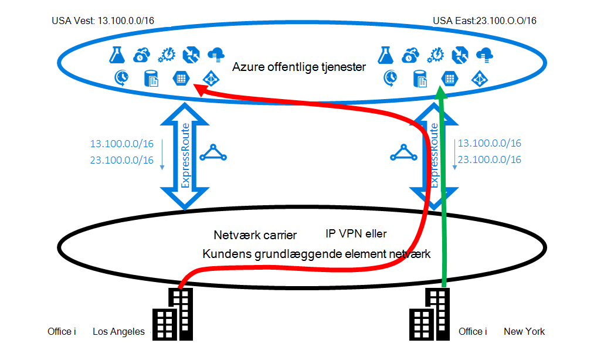
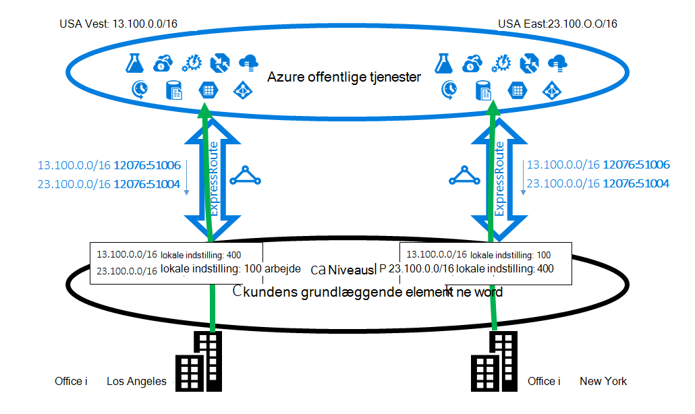
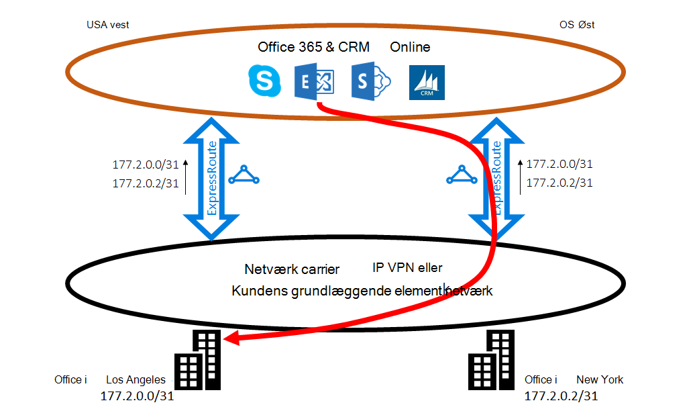
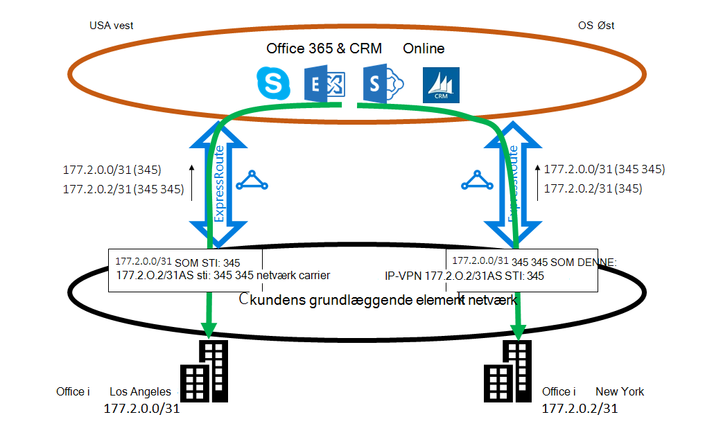

<properties
   pageTitle="Optimere ExpressRoute routing | Microsoft Azure"
   description="Denne side indeholder oplysninger om, hvordan du kan optimere rute, når en kunde har mere end ét ExpressRoute kredsløb, der opretter forbindelse mellem Microsoft og kundens corp netværk."
   documentationCenter="na"
   services="expressroute"
   authors="charwen"
   manager="carmonm"
   editor=""/>
<tags
   ms.service="expressroute"
   ms.devlang="na"
   ms.topic="get-started-article"
   ms.tgt_pltfrm="na"
   ms.workload="infrastructure-services"
   ms.date="10/10/2016"
   ms.author="charwen"/>

# Optimere ExpressRoute Routing
Når du har flere ExpressRoute kredsløb, har du mere end én sti til at oprette forbindelse til Microsoft. Som et resultat, kan opstå, ikke-optimal routing - det vil sige, din trafik kan tage en længere sti til at gå til Microsoft og Microsoft til netværket. Jo længere netværksstien, jo højere ventetid. Ventetid har direkte indvirkning på programmet ydeevnen og brugernes oplevelse. I denne artikel vil illustrere problemet og beskriver, hvordan du kan optimere routing ved hjælp af de almindelige routing teknologier.

## Ikke-optimal routing tilfælde 1
Lad os se nærmere Luk på routing problemet ved et eksempel. Forestil dig, at du har to kontorer i USA, én i Los Angeles og én i New York. Din kontorer er forbundet på et netværk WAN (Wide Area), som kan være enten dit eget grundlæggende element netværk eller din tjenesteudbyder IP VPN. Du har to ExpressRoute kredsløb, én i os Vest og én i os Øst, der er også forbundet på WAN. Tydeligt, har du to stier til at oprette forbindelse til Microsoft-netværk. Nu Forestil dig, at du har Azure-installation (fx Azure App Service) i både os Vest og OS Øst. Din hensigten er at forbinde dine brugere i Los Angeles til Azure os Vest og dine brugere i New York til Azure os Øst, fordi din tjenesteadministrator anmelder, at brugere i hver office adgang i nærheden Azure tjenesterne til optimal oplevelser. Planen fungerer desværre godt for brugerne, østkyst, men ikke for brugerne, vestkysten. Årsag til problemet er følgende. På hvert ExpressRoute kredsløb, er vi offentliggør for dig både præfikset i Azure os Øst (23.100.0.0/16) og præfikset i Azure os Vest (13.100.0.0/16). Hvis du ikke ved, hvilken præfikset er fra området, kan du ikke behandle den anderledes. Netværket WAN synes måske begge af præfikserne er tættere på os Øst end OS Vest og derfor omdirigere begge office-brugere til ExpressRoute kredsløbet i os Øst. I sidste ende har du mange surt brugere i office Los Angeles.

### Løsning: Brug BGP Communities
Hvis du vil optimere distribution til begge office-brugere, skal du ved, hvilken præfiks er fra Azure os Vest og som fra Azure os Øst. Vi kode disse oplysninger ved hjælp af [BGP Community værdier](expressroute-routing.md). Vi har tildelt en entydig BGP Community værdi til hver Azure region, f.eks. "12076:51004" til os Øst, "12076:51006" til os vest. Nu hvor du ved, hvilken præfikset er fra hvilke Azure område, kan du konfigurere, hvilke ExpressRoute kredsløb skal være Foretrukne. Da vi bruge BGP til at udveksle routing oplysninger, kan du bruge BGPS lokale indstilling til at påvirke routing. I vores eksempel kan du tildele en højere værdi for lokal indstilling at 13.100.0.0/16 i os Vest end i os Øst og på samme måde, en højere værdi for lokal indstilling til 23.100.0.0/16 i os Øst end i os vest. Denne konfiguration sikrer, at når begge stier til Microsoft er tilgængelige, brugerne i Los Angeles træder ExpressRoute kredsløb i os vest til at oprette forbindelse til Azure os vest, mens dine brugere i New York tage ExpressRoute i os øst til Azure os Øst. Routing er udviklet på begge sider. 

## Ikke-optimal routing tilfælde 2
Her er et andet eksempel, hvor forbindelser fra Microsoft tager en længere sti til at oprette forbindelse til netværket. I dette tilfælde skal bruge du lokale Exchange-servere og Exchange Online i et [hybridmiljø](https://technet.microsoft.com/library/jj200581%28v=exchg.150%29.aspx). Din kontorer er tilsluttet et WAN. Du annoncere præfikser af dine lokale servere i begge af dine kontorer til Microsoft via de to ExpressRoute kredsløb. Exchange Online starter forbindelser til lokale servere i tilfælde som overførsel af postkasse. Desværre kan sendes forbindelsen til dit Los Angeles office til ExpressRoute kredsløb i os Øst før gå på tværs hele Europa tilbage til vestkyst. Årsag til problemet ligner den første opgave. Microsoft network kan ikke se hvilke kunde præfiks er tæt på os Øst og hvilken en der er tæt på os Vest uden et tip. Sker det til at vælge den forkerte sti til office i Los Angeles.

### Løsning: Brug AS STIEN prepending
Der findes to løsninger på problemet. Den første del er, at du blot annoncere dit lokale præfiks for dit Los Angeles office 177.2.0.0/31 på ExpressRoute kredsløb i os Vest og dine lokale præfiks for dit New York office 177.2.0.2/31 på ExpressRoute kredsløb i os Øst. Som et resultat, er der kun en sti, som Microsoft for at oprette forbindelse til hver af dine kontorer. Der er ingen tvetydighed og routing er udviklet. Med denne design skal du tænke på din strategi for failover. I tilfælde af, at stien til Microsoft via ExpressRoute er brudt, skal du kontrollere, at Exchange Online kan stadig oprette forbindelse til din lokale servere. 

Den anden løsning er, at du fortsat annoncere begge af præfikserne på begge ExpressRoute kredsløb, og desuden du give os et tip om, hvilke præfiks er tæt på en af dine kontorer. Da vi understøtter BGP AS stien prepending, kan du konfigurere AS stien til din præfiks for at påvirke routing. I dette eksempel kan du øge AS STIEN til 172.2.0.0/31 i os Øst, så vi kan foretrækker ExpressRoute kredsløb i os vest til trafik tiltænkt præfikset (som vores netværk tror, at stien til præfikset er kortere vest). På samme måde kan du øge AS STIEN til 172.2.0.2/31 i os vest, så vi kan foretrækker ExpressRoute kredsløb i os Øst. Routing er optimeret til begge kontorer. Med denne design, hvis ét ExpressRoute kredsløb er brudt, kan Exchange Online stadig kontakte dig via en anden ExpressRoute kredsløb og din WAN. 

>[AZURE.IMPORTANT] Vi fjerne privat som tal i AS STIEN til de præfikser har modtaget på Microsoft Peering. Du skal tilføje offentlige som tal i AS STIEN til påvirke distribution til Microsoft Peering.

>[AZURE.IMPORTANT] Mens eksemplerne her er til Microsoft og offentlige peerings, understøtter vi de samme funktioner til den Private peering. Desuden AS stien prepending fungerer i én enkelt ExpressRoute kredsløb, til påvirke markeringen af de primære og sekundære stier.
