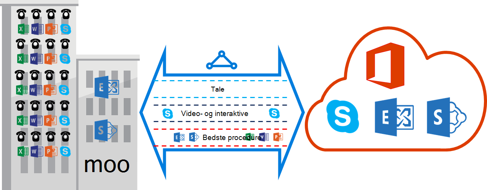

<properties
   pageTitle="QoS krav til ExpressRoute | Microsoft Azure"
   description="Denne side indeholder særlige krav til konfiguration og administration af QoS til ExpressRoute kredsløb."
   documentationCenter="na"
   services="expressroute"
   authors="cherylmc"
   manager="carmonm"
   editor=""/>
<tags
   ms.service="expressroute"
   ms.devlang="na"
   ms.topic="get-started-article"
   ms.tgt_pltfrm="na"
   ms.workload="infrastructure-services"
   ms.date="10/10/2016"
   ms.author="cherylmc"/>

# ExpressRoute QoS krav

Skype for Business har forskellige arbejdsbelastninger, som kræver opdelte QoS behandling. Hvis du planlægger at bruge tale-tjenesterne via ExpressRoute, skal du overholde krav beskrevet nedenfor.

>[AZURE.NOTE] QoS krav gælder for Microsoft peering kun. DSCP-værdierne i netværkstrafikken har modtaget på Azure offentlige peering og Azure privat peering nulstilles til 0. 

Den følgende tabel indeholder en liste over DSCP-angivelser bruges af Skype for Business. Se [Administrere QoS for Skype for Business](https://technet.microsoft.com/library/gg405409.aspx) kan finde flere oplysninger.

| **Trafik klasse** | **Behandling (DSCP-angivelse)** | **Skype for Business arbejdsmængder** |
|---|---|---|
| **Tale** | ELEMENTÆRFILEN (46) | Skype / Lync-taleopkald |
| **Interaktive** | AF41 (34) | Video |
|   | AF21 (18) | Programdeling | 
| **Standard** | AF11 (10) | Filoverførsel|
|   | CS0 (0) | Alt andet| 

- Du skal klassificere arbejdsmængder og markere de rigtige DSCP-værdier. Følg vejledningen [her](https://technet.microsoft.com/library/gg405409.aspx) om, hvordan du kan indstille DSCP-angivelser i dit netværk.

- Du skal konfigurere og understøtter flere QoS køer i dit netværk. Tale skal være en enkeltstående klasse og få den ELEMENTÆRFIL behandling, der er angivet i RFC 3246. 

- Du kan bestemme kø ordning, overbelastning registrering politik og tildeling af båndbredde per trafik klasse. Men den DSCP-markering for Skype for Business arbejdsbelastninger skal bevares. Hvis du bruger DSCP-angivelser ikke er anført ovenfor, f.eks. AF31 (26), skal du omskrive DSCP-værdien 0 før pakken sendes til Microsoft. Microsoft sender kun pakker, der er markeret med den DSCP-værdi, der vises i ovenstående tabel. 

## Næste trin

- Se krav til [distribution](expressroute-routing.md) og [NAT](expressroute-nat.md).
- Se følgende links for at konfigurere forbindelsen ExpressRoute.

    - [Oprette et ExpressRoute kredsløb](expressroute-howto-circuit-classic.md)
    - [Konfigurere routing](expressroute-howto-routing-classic.md)
    - [Sammenkæde en VNet med et ExpressRoute kredsløb](expressroute-howto-linkvnet-classic.md)
