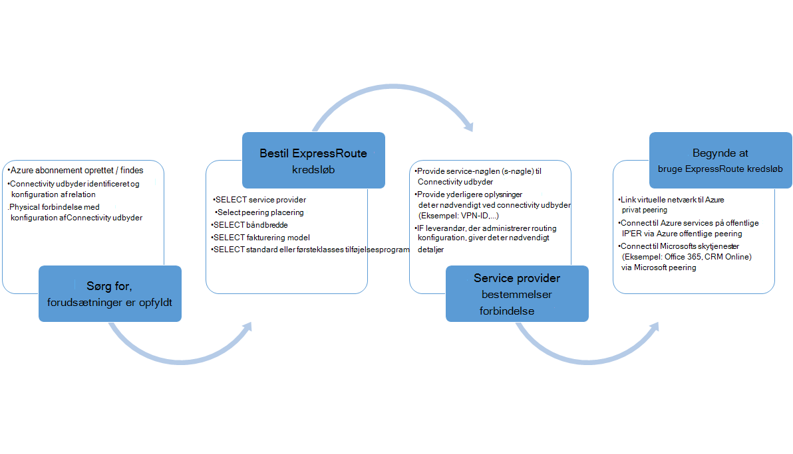
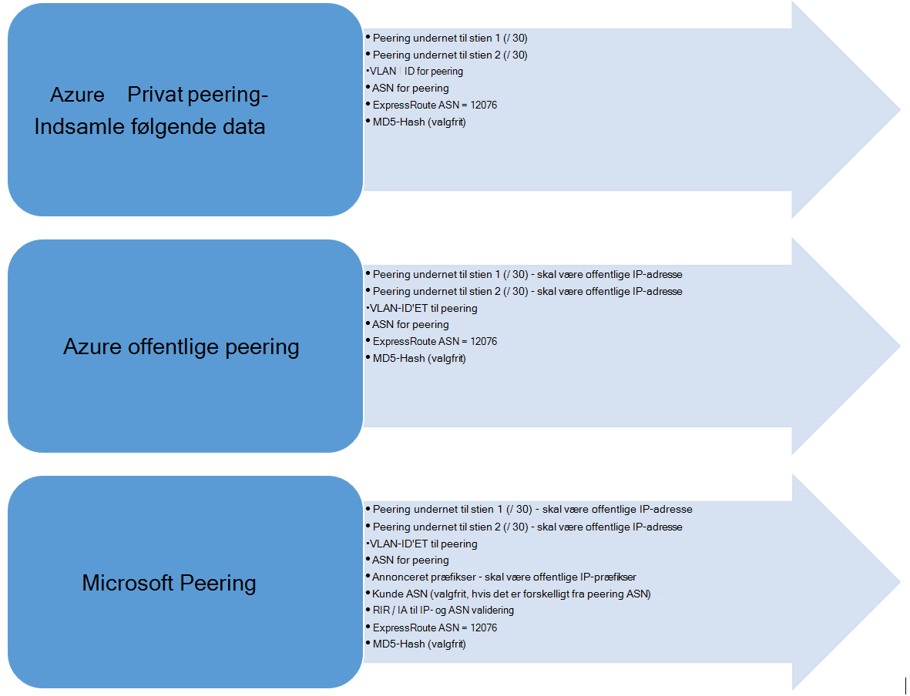

<properties
   pageTitle="Arbejdsprocesser til konfiguration af et ExpressRoute kredsløb | Microsoft Azure"
   description="Denne side vejleder dig gennem arbejdsprocesserne til konfiguration af ExpressRoute kredsløb og peerings"
   documentationCenter="na"
   services="expressroute"
   authors="cherylmc"
   manager="carmonm"
   editor="" />
<tags
   ms.service="expressroute"
   ms.devlang="na"
   ms.topic="article" 
   ms.tgt_pltfrm="na"
   ms.workload="infrastructure-services"
   ms.date="10/10/2016"
   ms.author="cherylmc"/>

# ExpressRoute arbejdsprocesser for klargøring af kredsløb og kredsløb tilstande

Denne side vejleder dig gennem tjenesten klargøring og routing konfiguration arbejdsprocesser på højt niveau.

I følgende figur og tilsvarende trin vises de opgaver, du skal følge for at få et ExpressRoute kredsløb klargjort til slut. 

1. Bruge PowerShell til at konfigurere et ExpressRoute kredsløb. Følg vejledningen i artiklen [oprette ExpressRoute kredsløb](expressroute-howto-circuit-classic.md) få mere at vide.

2. Bestil connectivity fra udbyderen af. Denne proces varierer. Kontakt din connectivity udbyder få mere at vide om, hvordan du Bestil connectivity.

3. Sørg for, at kredsløbet er klargjort korrekt, ved at kontrollere det ExpressRoute kredsløb klargøring tilstand via PowerShell. 

4. Konfigurere routing domæner. Hvis udbyderen connectivity administrerer Layer 3 for dig, skal konfigurerer de routing til din kredsløb. Hvis din forbindelse-udbyder tilbyder kun lag 2 tjenester, skal du konfigurere routing i henhold til retningslinjer, der er beskrevet i siderne [routing krav](expressroute-routing.md) og [konfigurationen af routing](expressroute-howto-routing-classic.md) .

    -  Aktivere Azure privat peering – du skal aktivere denne peering at oprette forbindelse til FOS / tjenester, der er implementeret i virtuelle netværk i skyen.
    -  Aktivere Azure offentlige peering – du skal aktivere Azure offentlige peering, hvis du vil oprette forbindelse til Azure services på offentlige IP-adresser. Dette er et krav til at få adgang til Azure ressourcer, hvis du har valgt at aktivere standard routing til Azure private peering.
    -  Aktivere Microsoft peering - skal du aktivere den til at få adgang til Office 365 og CRM online-tjenester. 
    
    >[AZURE.IMPORTANT] Du skal sikre dig, at du bruge en separat proxy / kant for at oprette forbindelse til Microsoft end, du bruger til internettet. Bruge den samme kant til både ExpressRoute og internettet medføre asymmetrisk routing og medføre connectivity udfald til dit netværk.

    

5. Sammenkæde virtuelle netværk til ExpressRoute kredsløb - du kan sammenkæde virtuelle netværk til din ExpressRoute kredsløb. Følg instruktionerne [til at sammenkæde VNets](expressroute-howto-linkvnet-arm.md) til din kredsløb. Disse VNets kan enten være i samme Azure abonnement som ExpressRoute kredsløb eller kan være i et andet abonnement.

## ExpressRoute kredsløb klargøring tilstande

Hvert ExpressRoute kredsløb har to tilstande:

- -Udbyder klargøring tjenestetilstand
- Status

Status repræsenterer Microsofts klargøring tilstand. Denne egenskab er indstillet til aktiveret, når du opretter et Expressroute kredsløb

Tilstanden connectivity udbyder klargøring repræsenterer tilstanden provideren connectivity side. Det kan enten være *NotProvisioned*, *artikel Provisioning*eller *Provisioned*. ExpressRoute kredsløb skal være i Provisioned tilstand for dig at kunne bruge den.

### Mulige tilstande af en ExpressRoute kredsløb

Dette afsnit beskrives ud af de mulige tilstande for en ExpressRoute kredsløb.

#### På klokkeslættet for oprettelsen af

Du får vist ExpressRoute kredsløbet i følgende tilstand, så snart du køre PowerShell-cmdlet for at oprette ExpressRoute kredsløbet.

    ServiceProviderProvisioningState : NotProvisioned
    Status                           : Enabled

#### Når connectivity udbyder er i gang med at klargøring kredsløbet

Du får vist ExpressRoute kredsløbet i følgende tilstand, så snart du overfører tasten tjeneste til connectivity udbyderen og de har startet klargøring processen.

    ServiceProviderProvisioningState : Provisioning
    Status                           : Enabled

#### Når connectivity udbyder har fuldført processen klargøring

ExpressRoute kredsløb i tilstanden følgende vises som provideren connectivity har fuldført processen klargøring.

    ServiceProviderProvisioningState : Provisioned
    Status                           : Enabled

Klargjort og aktiveret er den eneste tilstand kredsløbet kan være i for dig at kunne bruge den. Hvis du bruger en lag 2-udbyder, kan du konfigurere routing til din kredsløb kun, når det er i denne tilstand.

#### Når connectivity udbyder er ophævelse af klargøring kredsløbet

Hvis du har skrevet tjenesteudbyder til deprovision ExpressRoute kredsløb, vises kredsløbet, der er angivet til tilstanden følgende, når udbyderen af har fuldført processen deprovisioning.

    ServiceProviderProvisioningState : NotProvisioned
    Status                           : Enabled

Du kan vælge at aktivere den igen, hvis det er nødvendigt, eller Kør PowerShell-cmdletter for at slette kredsløbet.  

>[AZURE.IMPORTANT] Hvis du kører mislykkes PowerShell-cmdlet til at slette kredsløbet, når ServiceProviderProvisioningState eller Provisioned handlingen. Skal du samarbejde med din udbyder af forbindelse til deprovision ExpressRoute kredsløb først og derefter slette kredsløbet. Microsoft fortsætter med at opkræve betaling kredsløbet, indtil du køre PowerShell-cmdlet for at slette kredsløbet.

## Routing session konfigurationstilstand

BGP klargøring tilstand giver dig besked, hvis BGP sessionen er blevet aktiveret på Microsoft edge. Tilstanden skal være aktiveret for dig at kunne bruge den peering.

Det er vigtigt at kontrollere tilstanden BGP session især til Microsoft peering. Ud over den BGP klargøring tilstand, der er en anden tilstand, der kaldes *annonceret offentlige præfikser tilstand*. Tilstanden annoncerede offentlige præfikser skal være i *konfigureret* tilstand, både for BGP sessioner lov til at være op og for din routing Hvis du vil arbejde til slut. 

Hvis tilstanden annoncerede offentlige præfiks er indstillet til tilstanden *Validering det er nødvendigt* , BGP sessionen ikke er aktiveret, som de annoncerede præfikser ikke svarede som tallet i en af de routing registre. 

>[AZURE.IMPORTANT] Hvis tilstanden annoncerede offentlige præfikser er i *Manuel validering* tilstand, skal du åbne en supportbilletter med [Microsoft support](https://portal.azure.com/?#blade/Microsoft_Azure_Support/HelpAndSupportBlade) og bevise, at du ejer IP-adresserne annonceret langs med den tilknyttede selvstændige System tal.

## Næste trin

- Konfigurere ExpressRoute forbindelsen.

    - [Oprette et ExpressRoute kredsløb](expressroute-howto-circuit-arm.md)
    - [Konfigurere routing](expressroute-howto-routing-arm.md)
    - [Sammenkæde en VNet med et ExpressRoute kredsløb](expressroute-howto-linkvnet-arm.md)
