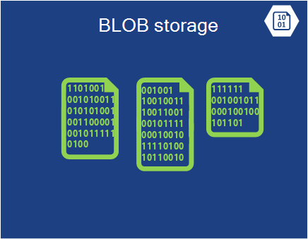
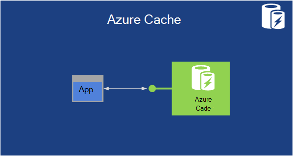

<properties
    pageTitle="Introduktion til Microsoft Azure | Microsoft Azure"
    description="Ny bruger af Microsoft Azure? Få et grundlæggende overblik af tjenesterne, det tilbyder med eksempler på, hvordan de kan bruges."
    services=" "
    documentationCenter=".net"
    authors="rboucher"
    manager="carolz"
    editor=""/>

<tags
    ms.service="multiple"
    ms.workload="multiple"
    ms.tgt_pltfrm="na"
    ms.devlang="na"
    ms.topic="article"
    ms.date="06/30/2015"  
    ms.author="robb"/>

# Introduktion til Microsoft Azure

Microsoft Azure er Microsofts programplatform til offentlige skyen.  Mål i denne artikel er at give dig en foundation for at forstå grundlæggende Azure, selvom du ikke vide noget om cloud computing.

**Hvordan du kan læse denne artikel**

Azure voksende hele tiden, så det er nemt at få overbelastet.  Start med de grundlæggende tjenester, der vises først i denne artikel, og gå derefter til yderligere tjenester. Det betyder ikke, du kan ikke bruge de ekstra tjenester alene, men de grundlæggende tjenester udgør kernen i et program, der kører i Azure.

**Give feedback**

Din feedback er vigtigt. I denne artikel skal give dig en effektiv oversigt over Azure. Hvis det ikke er tilfældet, kan du fortælle os i sektionen kommentarer i bunden af siden. Give nogle detaljer på hvad du forventede at finde og hvordan du kan forbedre i artiklen.  

## Komponenterne i Azure

Azure grupperer tjenester i kategorier i portalen administration og på forskellige visuelle hjælpemidler som [Hvad er Azure Infographic](https://azure.microsoft.com/documentation/infographics/azure/) . Portalen Management er, hvad du skal bruge til at administrere de fleste (men ikke alle) tjenester i Azure.

I denne artikel anvender en **anden organisation** at tale om tjenester, der er baseret på samme funktion og for at fremhæve vigtige underordnede tjenester, der er en del af større dem.  

   
 *Figur: Azure leverer Internet-tilgængelige programtjenester kører i Azure datacentre.*

## Administrationsportalen
Azure har en grænseflade til kaldet [Management Portal](http://manage.windowsazure.com) , som giver administratorer mulighed for at få adgang til og administrere mest, men ikke alle Azure funktioner.  Microsoft udgiver typisk portalen nyere Brugergrænsefladen i beta før en ældre på pension. Nyere en, der kaldes ["Azure Preview Portal"](https://portal.azure.com/).

Der er typisk en lang overlapning, når begge portaler er aktiv. Mens core services vises i begge portaler, muligvis ikke alle funktioner tilgængelige i både. Nyere tjenester kan vises i de nyere portalen første og ældre versioner tjenester og funktionalitet findes kun i et ældre.  Meddelelsen her er, hvis du ikke finder noget i portalen ældre, Markér den nyere, og omvendt.

## Beregne

En af de mest grundlæggende ting, der indeholder en skyen platform er udføre programmer. Hver af Azure Beregn modellerne har sin egen rolle.

Du kan bruge disse teknologier separat eller kombinere dem efter behov for at oprette højre grundlaget for dit program. Den fremgangsmåde, du vælger, afhænger af, hvilke problemer, du forsøger at løse.

### Azure virtuelle maskiner

   
*Figur: Azure virtuelle maskiner giver dig fuld kontrol over virtuelt forekomster i skyen.*

Mulighed for at oprette en virtuel maskine efter behov, om fra et almindeligt billede eller fra en, du angiver, kan være meget nyttigt. Denne metode, ofte kaldet Infrastructure som en tjeneste (IaaS), er det virtuelle Azure-computere giver. Figur 2 viser en kombination af hvordan et virtuelt (VM) kører, og hvordan du opretter en fra en virtuel harddisk.  

For at oprette en VM skal angive du, hvilke Virtuelle skal bruges, og hvor VM størrelse.  Du betaler for det tidspunkt, hvor VM kører. Du betaler efter minuttet, og kun, når den kører, selvom der er et minimale lagerplads gebyr for bevarelse af den virtuelle harddisk, der er tilgængelige. Azure indeholder et galleri med aktie virtuelle harddiske (kaldet "billeder"), der indeholder et kan startes fra operativsystem til at starte fra. Dette omfatter indstillinger for Microsoft og partner som Windows Server og Linux, SQL Server, Oracle og meget mere. Er du Velkommen til at oprette virtuelle harddiske og billeder, og derefter overføre dem dig selv. Du kan også overføre virtuelle harddiske, der indeholder kun data og derefter få adgang til dem fra din kører FOS.

Det sted, hvor den virtuelle harddisk stammer fra, kan du gemme eventuelle ændringer, mens der kører en VM vedvarende. Næste gang du opretter en VM fra Virtuelle Vælg ting hvor du slap. De virtuelle harddiske, tilbage virtuelle maskiner er gemt i Azure-lager blob, som vi taler om senere.  Det betyder, at du får redundans at sikre, at din FOS ikke forsvinder på grund af hardware og disk mislykkede forsøg. Det er også muligt at kopiere den ændrede Virtuelle af Azure, og derefter køre den lokalt.

Dit program kører i en eller flere virtuelle maskiner, afhængigt af hvordan du oprettede det før eller beslutter dig for at oprette den fra bunden nu.

Denne helt generelle metoder inden for cloud computing kan bruges til at løse mange forskellige problemer.

**Virtuelt scenarier**

1.  **Udviklingscenter/Test** - du kan bruge dem til at oprette en billige udvikling og test platform, som du kan lukke, når du er færdig med at bruge den. Du kan også oprette og køre programmer, der bruger uanset sprog og biblioteker, du kan lide. Disse programmer kan bruge en af de indstillinger for administration af data, Azure leverer, og du kan også vælge at bruge SQL Server eller en anden DBMS, der kører på en eller flere virtuelle computere.
2.  **Flytte programmerne til Azure (elevator-og-Skift)** - "Elevator-og-Skift" refererer til flytte dit program meget, som du vil bruge en trucken til at flytte et stort objekt.  Du "løft" den virtuelle harddisk fra dit lokale datacenter, og "Skift" til Azure og køre den der.  Du skal typisk gøre nogle arbejde for at fjerne afhængigheder af andre systemer. Hvis der er for mange, kan du vælge indstillingen 3 i stedet.  
3.  **Udvid datacentret** - Brug Azure FOS som en udvidelse af din lokale datacenter, kører SharePoint eller andre programmer. For at understøtte denne, er det muligt at oprette Windows-domæner i skyen ved at køre Active Directory i Azure FOS. Du kan bruge Azure virtuelt netværk (nævnt senere) til knytter dit lokale netværk og dit netværk i Azure sammen.

### Webapps

   
 *Figur: Azure Onlines kører et websted til computeren i skyen uden at skulle administrere underliggende webserveren.*

En af de mest almindelige ting, som personer kan i skyen køres websteder og web-programmer. Azure virtuelle maskiner tillader det, men det stadig forlader du ansvarlig for administration af en eller flere FOS og de underliggende operativsystemer. Cloud services web roller kan gøre dette, men implementere og vedligeholde dem stadig tager administrative arbejde.  Hvad nu, hvis du blot ønsker et websted hvor andres tager sig af den administrative arbejde for dig?

Dette er præcis hvad Web Apps giver. Denne Beregn model indeholder et administreret internetbaseret miljø ved hjælp af Azure Management portal samt API'er. Du kan flytte et eksisterende websted-program i Web Apps uændret, eller du kan oprette en ny direkte i skyen. Når et websted kører, kan du tilføje eller fjerne forekomster dynamisk, stole på Azure Onlines at indlæse balance anmodninger på tværs af dem. Azure Apps indeholder både en delt indstilling, hvor webstedet kører i et virtuelt med andre websteder, og et almindeligt indstilling, der gør det muligt for et websted til at køre i sin egen VM. Indstillingen standard kan du øge størrelsen (computer power) på din forekomster, hvis det er nødvendigt.

For udvikling understøtter Web Apps .NET, PHP, Node.js, Java og Python sammen med SQL-Database og MySQL (fra ClearDB, en Microsoft-partner) for relationsdatabaser lagerplads. Det giver også indbygget understøttelse af flere populære programmer, herunder WordPress, Joomla og Drupal. Målet er at tilvejebringe et lave omkostninger, SVG og bredt nyttige forum til at oprette websteder og web-programmer i offentlige skyen.

**Web Apps-scenarier**

Web Apps er beregnet på at være nyttige til virksomheder, udviklere og web design myndigheder. Til virksomheder er det en nemt at styre, SVG, meget sikre og meget tilgængelige løsning til kørsel af tilstedeværelse websteder. Når du har brug at konfigurere et websted, er det bedst at starte med Azure Web Apps, og gå videre til Skytjenester, når du har brug for en funktion, der ikke er tilgængelig. Se slutningen af afsnittet "Beregn" for flere links, der kan hjælpe dig med at vælge mellem indstillinger.

### Cloud Services
   
*Figur: Azure Cloud Services indeholder et sted at køre meget SVG brugerdefineret kode på en Platform som et (PaaS)-servicemiljø*

Antag, at du vil oprette et program i skyen, der kan understøtte mange samtidige brugere, kræver ikke meget administration og aldrig går ned. Du kan være en eksisterende softwareleverandør, f.eks, der har besluttet at understøtte Software som en tjeneste (SaaS) ved at opbygge en version af en af dine programmer i skyen. Eller du kan være en opstart oprettelse af en forbruger-program, som du mod forventning vokser hurtigt. Hvis du opretter på Azure, hvilken udførelse af der skal bruges?

Azure Web Apps giver mulighed for oprettelse af denne type webprogram, men der er visse begrænsninger. Du har ikke administratoradgang, for eksempel, hvilket betyder, at du ikke kan installere vilkårlig software. Azure virtuelle maskiner giver dig masser af fleksibilitet, herunder administratoradgang, og du selvfølgelig kan bruge den til at opbygge en meget SVG programmet, men du er nødt til at håndtere mange aspekter af overvågning og administration af dig selv. Hvad du vil have er en indstilling, der giver dig det kontrolelement, du har brug for, men håndterer også mest muligt ud af det arbejde, der kræves til overvågning og administration.

Dette er præcis det leveres af Azure Cloud Services. Denne teknologi udtrykkeligt er udviklet til at understøtte SVG, pålidelig, og lav admin-programmer, og det er et eksempel på, hvad har også kaldet Platform som en tjeneste (PaaS). For at bruge det, opretter du et program ved hjælp af den teknologi, du vælger, som C#, Java, PHP, Python, Node.js eller noget andet. Din kode udfører på virtuelle computere (kaldet forekomster) med en version af Windows Server.

Men disse FOS er væsentligt forskellige fra dem, du opretter med virtuelle Azure-computere. For én ting, Azure selve administrerer dem at gøre ting som installation af operativsystem rettelser og automatisk distribution af ny installeret for at udbedre billeder. Det betyder, at dit program ikke bør vedligeholde tilstanden i web eller arbejder rolle forekomster; det opbevares i stedet i en af indstillingerne Azure data management, der er beskrevet i næste afsnit. Azure overvåger også disse FOS, genstart alle denne fejl. Du kan angive skytjenester til automatisk at oprette flere eller færre forekomster svar efter behov. Dette giver dig mulighed at håndtere øget brugen, og klik derefter skalere tilbage, så du ikke betale så meget, når der er mindre brugen.

Du har to roller for at vælge mellem, når du opretter en forekomst, begge er baseret på Windows Server. Primære forskellen mellem to er, at en forekomst af en web rolle kører IIS, mens en forekomst af en kollega rolle ikke. Begge administreres på samme måde, men, og det er fælles for et program til at bruge begge. For eksempel en forekomst af web rolle kan acceptere anmodninger fra brugere, og derefter overføre dem til en kollega rolle forekomst for behandling. Hvis du vil skalere dit program, op eller ned, kan du anmode om, at Azure oprette flere forekomster af enten rolle eller Luk eksisterende forekomster. Og lignende til Azure virtuelle maskiner, du er betale kun for tid, der kører hver web eller arbejder rolle forekomst.

**Cloud Services scenarier**

Cloud Services er velegnet til at understøtte massive Skaler ud, når du har brug for mere kontrol over platformen end leveres af Azure Web Apps, men du behøver ikke kontrol over det underliggende operativsystem.

#### Vælge en Beregn Model
Siden [Azure Web Apps, Skytjenester og virtuelle maskiner sammenligning](./app-service-web/choose-web-site-cloud-service-vm.md) indeholder mere detaljerede oplysninger om hvordan du vælger en Beregn model.

## Datastyring

Programmer skal bruge data, og forskellige typer af programmer skal forskellige typer data. Derfor indeholder Azure flere forskellige måder at gemme og administrere data. Azure leverer indstillinger for lagring af mange, men alle er udviklet til meget robust lagerplads.  Med en af disse indstillinger er der altid 3 kopier af dine data, der synkroniseres på tværs af en Azure datacenter – 6, hvis du tillader Azure bruge geografisk redundans til at sikkerhedskopiere til en anden datacenter mindst 300 sømil ikke til stede.     

### I virtuelle maskiner
Muligheden for at køre SQL Server eller en anden DBMS i en VM, der er oprettet med virtuelle Azure-computere er allerede blevet omtalt. Opdager, at denne indstilling ikke er begrænset til relationelle kontrolsystemer Du er også til at køre NoSQL teknologier som MongoDB og Cassandra. Kører din egen databasesystem er enkle it flergangsbestemmelser hvad vi er vant til i vores egen datacentre – men det kræver også håndtering af administrationen af pågældende DBMS.  Andre indstillinger håndterer Azure flere af eller alle af administration for dig.

Tilstanden for den virtuelle maskine og eventuelle yderligere datadisk, du opretter eller overføre understøttes igen, af blob-lager (som vi taler om senere).  

### Azure SQL-Database
   

*Figur: Azure SQL-Database indeholder en administreret relationsdatabase tjeneste i skyen.*

Azure leverer for relationel lagerplads, funktionen SQL-Database. Lad ikke navngive narre dig. Dette er anderledes end en typisk SQL-Database, der leveres af SQL Server, der kører oven på Windows Server.  

Azure SQL-Database, der tidligere hed SQL Azure, indeholder alle de vigtigste funktioner i en relationel database administrationssystem, herunder atomiske transaktioner samtidige dataadgang af flere brugere med dataintegritet, ANSI SQL-forespørgsler og en velkendte programming model. Såsom SQL Server, SQL-Database kan åbnes ved hjælp af enhed Framework, adgang ADO.NET, JDBC og andre velkendte data teknologier. Det understøtter også de fleste T-SQL-sproget, sammen med SQL Server-værktøjer såsom SQL Server Management Studio. For alle kendskab til SQL Server (eller en anden relationsdatabase) Brug af SQL-Database er enkle.

SQL-Database er det ikke bare en DBMS i skyen-it er en PaaS tjeneste. Du stadig styre dine data og hvem der har adgang til den, men SQL-Database tager sig af administrative grunt arbejde, som håndtering af hardware-infrastrukturen og automatisk holde database og operativsystem softwaren opdateret. SQL-Database også giver høj tilgængelighed, automatisk sikkerhedkopiering, punkt-in-time gendanne funktioner og kan gentage kopier på tværs af geografiske områder.  

**Scenarier for SQL-Database**

Hvis du opretter en Azure program (ved hjælp af en af Beregn modellerne), der skal relationelle lagerplads, kan SQL-Database være en god indstilling. Programmer, der kører uden for skyen kan også bruge denne tjeneste, så der er masser af andre scenarier. Data gemt i SQL-Database kan for eksempel åbnes fra anden klientsystemer, herunder pc'er, bærbare computere, tabletter og telefoner. Og fordi den indeholder indbyggede høj tilgængelighed gennem replikering, ved hjælp af SQL-Database kan hjælpe med at minimere nedetid.

### Tabeller
  

*Figur: Azure tabeller indeholder en flad NoSQL metode til at gemme data.*

Denne funktion kaldes også forskellige udtryk som det er en del af en større funktion, der hedder "Azure-lager". Hvis du ser "tabeller", "Azure tabeller" eller "lagerplads tabeller", er det samme.  

Og ikke forveksles med navnet: denne teknologi indeholder ikke relationelle lagerplads. Faktisk er det et eksempel på en NoSQL fremgangsmåde, kaldet en nøgleværdi/store. Azure tabeller lade et program, gemme egenskaber for forskellige typer, som strenge, heltal og datoer. Et program kan derefter hente en gruppe af egenskaber ved at angive en entydig nøgle for den pågældende gruppe. Mens komplekse handlinger som ikke understøttes af joinforbindelser, tabeller giver hurtig adgang til indtastede data. De er også meget SVG, med en enkelt tabel kan indeholde så meget som en terabyte data. Og tilsvarende deres enkle tabeller er normalt billigere at bruge end SQL-Database relationelle lagerplads.

**Scenarier for tabeller**

Antag, at du vil oprette et Azure-program, der kræver hurtig adgang til har skrevet data måske masser af den, men har brug for ikke til at udføre kompleks SQL-forespørgsler på disse data. Forestil dig f.eks, du opretter et forbruger-program, der skal gemme kunde profiloplysninger for hver bruger. Din app, skal være meget populære, så skal du tillade for mange data, men du ikke vil udføre meget med disse data uden at gemme, hente dem i nemme måder. Dette er præcis slags scenarie, hvor Azure tabeller giver mening.

### BLOB
    
*Figur: Azure BLOB indeholder ustrukturerede binære data.*  

Azure BLOB (igen "Blob-lager" og lige "lagerplads BLOB" er det samme) er udviklet til at gemme ustrukturerede binære data. LIKE-tabeller, BLOB giver billige lagring og en enkelt blob kan være så stor som 1TB (en terabyte). Azure-programmer kan også bruge Azure drev, så BLOB give fast lagerplads til et Windows-filsystem, der er forbundet med en Azure forekomst. Programmet kan se almindelige Windows-filer, men indholdet er faktisk gemt i en blob.

BLOB-lager, der bruges af mange andre Azure funktioner (herunder virtuelle maskiner), så den kan selvfølgelig håndtere dine arbejdsmængder for.

**Scenarier, hvor BLOB**

Et program, der gemmer video, store filer eller andre binære oplysninger kan bruge BLOB for enkel, billige lagerplads. BLOB bruges også ofte sammen med andre tjenester som indhold netværk til levering, som vi vil tale om senere.  

### Importere / eksportere
  

*Figur: Azure Importér / Eksportér giver mulighed for at levere en fysisk harddisk til eller fra Azure til hurtigere og billigere flere data importere eller eksportere.*  

Nogle gange vil du flytte en stor mængde data til Azure. Der skal tage lang tid, måske dage, og brug en masse båndbredde. I disse tilfælde kan du bruge Azure Importér/Eksportér, som du kan bruge til at levere Bitlocker-krypterede 3,5" SATA harddiske direkte til Azure datacentre, hvor Microsoft vil overføre data til blob-lager for dig.  Når overførslen er fuldført, leveres Microsoft drev tilbage til dig.  Du kan også anmode om, at store mængder data fra Blob-lager eksporteres til harddiske og sendes tilbage til dig via mail.

**Scenarier, hvor Importér / Eksportér**

- **Stor dataoverførsel** – når du har store mængder data (TB), du vil overføre til Azure Importér/Eksportér tjenesten er ofte meget hurtigere og måske billigere end overførsel via internettet. Når dataene er i blob, kan du behandle den i andre former som Table storage eller en SQL-Database.

- **Arkiverede datagendannelse** - du kan bruge Importér/Eksportér skal have Microsoft filoverførsel store mængder data gemt i Azure Blob-lager til en lagerplads enhed, du sender og derefter har enheden leveret tilbage til en placering, du ønsker. Da det kan tage lidt tid, er det ikke er et godt valg til nedbrud. Det er bedst for arkiverede data, du ikke behøver hurtig adgang til.

### Fil-tjenesten
    
*Figur: Azure File Services indeholder små og mellemstore virksomheder \\ \\server\share stier til programmer, der kører i skyen.*

Lokalt, det er fælles for har store mængder fillagring, der er tilgængelige via den Server meddelelse blok (små og mellemstore virksomheder)-protokollen ved hjælp af en \\ \\Server\share format. Azure har nu en tjeneste, hvor du kan bruge denne protokol i skyen. Programmer, der kører i Azure kan bruge det til at dele filer mellem FOS ved hjælp af velkendte filsystem API'er som ReadFile og WriteFile. Filerne kan desuden også åbnes på samme tid via en RESTEN grænseflade, hvor du kan få adgang til aktierne fra det lokale, når du også konfigurere et virtuelt netværk. Azure-filer er bygget oven på blob-tjenesten, så den arver de samme tilgængelighed, holdbarhed, skalerbarhed og geografisk-redundans indbygget i Azure-lager.

**Scenarier for Azure-filer**

- **Overflytning eksisterende apps i skyen** - dens nemmere at overføre lokale programmer i skyen, der bruger filshares til at dele data mellem dele af programmet. Hver VM opretter forbindelse til det pågældende filshare og derefter den kan læse og skrive filer ligesom det ville mod en lokal fil dele.

- **Delt programindstillinger** – et almindeligt mønster for distribuerede programmer er at have konfigurationsfiler i et centralt sted, hvor de kan åbnes fra mange forskellige virtuelle computere. Konfigurationsfilerne kan være gemt i et filshare på Azure, og Læs efter alle forekomster af tjenesteprogrammer. Indstillingerne kan også administreres via den REST brugergrænseflade, som gør det muligt for global adgang til af konfigurationsfilerne.

- **Diagnosticering dele** - du kan gemme og dele diagnosticering filer som logfiler, målepunkter og Crashdumps. Har disse filer tilgængelige via både små og mellemstore virksomheder og RESTEN grænseflade gør det muligt for programmer til at bruge en lang række analyseværktøjerne for at behandle og dataanalyse diagnosticering.

- **Test-Udviklingscenter/fejlfinding** – når udviklere og administratorer arbejder på virtuelle maskiner i skyen, skal de ofte et sæt værktøjer eller funktioner. Installation og distribuere disse værktøjer på hver virtuel maskine er lang tid. Med Azure filer, kan en udvikler eller administrator gemme deres foretrukne værktøjer på et filshare og oprette forbindelse til dem fra en hvilken som helst virtuel maskine.

## Netværk

Azure kører i dag i mange datacentre udbrede verden. Når du kører et program eller gemme data, kan du vælge en eller flere af disse datacentre bruge. Du kan også oprette forbindelse til disse datacentre på forskellige måder, du bruger tjenesterne nedenfor.

### Virtuelt netværk
   

*Figur: Virtuelle netværk indeholder et privat netværk i skyen, så forskellige tjenester kan tale med hinanden, eller til lokale ressourcer Hvis du har konfigureret en VPN-forbindelse tværs lokale forbindelse.*  

En nyttig måde at bruge en offentlig sky er at behandle den som en udvidelse af din egen datacenter.

Da du kan oprette FOS efter behov, derefter fjerne dem (og stop betaling) når de er ikke længere skal bruges, kan du få computing power kun, når du vil have den. Og da virtuelle Azure-computere kan du oprette VM'er, der kører SharePoint, Active Directory og andre velkendte lokalt software, denne metode kan arbejde med de programmer, du allerede har.

For at gøre dette virkelig brugbare, der er dog bør brugerne skal kunne behandle disse programmer, som om de kørte i dit eget datacenter. Dette er præcis hvad Azure virtuelt netværk tillader. Ved hjælp af en VPN-gateway-enhed, kan en administrator konfigurere et virtuelt privat netværk (VPN) mellem dit lokale netværk og dit VM'er, der er installeret på et virtuelt netværk i Azure. Da du tildeler dine egne IP-v4-adresser til skyen FOS, vises de på dit eget netværk. Brugerne i organisationen kan få adgang til programmerne, der indeholder disse FOS, som om de kørte lokalt.

Du kan finde flere oplysninger om planlægning og oprettelse af et virtuelt netværk, der passer dig, [Virtuelt netværk](./virtual-network/virtual-networks-overview.md).

### Express rute

   

*Figur: ExpressRoute bruger et virtuelt Azure-netværk, men dirigerer forbindelser til og med hurtigere dedikeret linjer i stedet for det offentlige Internet.*  

Hvis du har brug for flere båndbredde eller sikkerhed end en Azure virtuelt netværk forbindelse kan give, kan du undersøge ExpressRoute. I nogle tilfælde kan ExpressRoute også gemme du penge. Du skal stadig et virtuelt netværk i Azure, men sammenkædningen mellem Azure og webstedet bruger en dedikeret forbindelse, der ikke går via offentlige internettet. Hvis du vil bruge denne tjeneste, skal du har en aftale med en udbyder af netværk eller en exchange-udbyder.

Konfigurere en forbindelse kræver mere tid ExpressRoute og planlægning, så du vil starte med en VPN til-websted, og derefter overføre til en ExpressRoute forbindelse.

Du kan finde flere oplysninger om ExpressRoute, [ExpressRoute teknisk oversigt](./expressroute/expressroute-introduction.md).

### Trafik Manager

   

*Figur: Azure trafik Manager giver dig mulighed at dirigere globale trafik til din tjeneste, der er baseret på intelligent regler.*

Hvis din Azure programmet kører i flere datacentre, kan du bruge Azure trafik Manager til at dirigere anmodninger fra brugere intelligent på tværs af forekomster af programmet. Du kan også omdirigere trafikken til tjenester, der ikke kører i Azure, som de er tilgængelige fra internettet.  

En Azure-program med brugere i en enkelt del af verden kan køre i kun én Azure datacenter. Et program med brugere spredt over hele verden, er dog mere sandsynlige til at køre i flere datacentre, måske også alle. I denne anden situation, du står over for et problem: Sådan du intelligent bl.a forekomster af tjenesteprogrammer? De fleste tilfælde, ønsker du sandsynligvis hver bruger til at få adgang til det datacenter, der er tættest på hende, da det sandsynligvis kan give hende det bedste svar tidspunkt. Men hvad nu, hvis forekomsten af programmet er overloadede eller ikke tilgængelig? I dette tilfælde vil det være rart at dirigere hendes anmodning automatisk til en anden datacenter. Dette er nøjagtigt, hvad der er udført af Azure trafik Manager.

Ejeren af et program definerer regler, der angiver, hvordan anmodninger fra brugere skal sendes til datacentre, og derefter er baseret på trafik Manager til at udføre disse regler. For eksempel brugere kan normalt omdirigeres til det nærmeste Azure datacenter, men bliver sendt til en anden, når svartid fra deres standard datacenter overstiger svartid fra andre datacentre. Globalt distribuerede programmer med mange brugere er har en indbygget tjeneste til at håndtere problemer som disse nyttig.

Trafik manager bruger Directory Name Service (DNS) til at dirigere brugere til tjenesten slutpunkter, men yderligere trafik Gå ikke gennem trafik Manager, når forbindelsen er foretaget. Dette bevarer trafik Manager i at blive en flaskehals, langsommere din servicemeddelelser.

## Developer Services
Azure tilbyder en række værktøjer til at hjælpe udviklere og IT-ekspert oprette og vedligeholde programmer i skyen.  

### Azure SDK
Tilbage i 2008 understøttes den første foreløbige version af Azure kun .NET udvikling. I dag, men kan du oprette Azure-programmer på ret meget alle sprog. Microsoft yder aktuelt sprogspecifikke SDK'er til .NET, Java, PHP, Node.js, fonetisk og Python. Der er også en generel Azure SDK, som indeholder grundlæggende support til alle sprog, som C++.  

Disse SDK'er hjælpe dig med at opbygge, installere og administrere Azure-programmer. De er tilgængelige, enten fra [www.microsoftazure.com](https://azure.microsoft.com/downloads/) eller GitHub, og de kan bruges med Visual Studio og Eklipse. Azure indeholder også kommandolinjeværktøjer, som udviklere kan bruge med redaktør eller udvikling miljø, herunder værktøjer til installation af programmer til Azure fra til Linux og Macintosh.

Sammen med hjælpe dig med at opbygge Azure-programmer, disse SDK'er giver også klientbiblioteker, der hjælper dig med at udvikle software, der bruger Azure tjenester. Du kan for eksempel opbygge et program, der læser og skriver Azure blob, eller Opret et værktøj, der installerer Azure-programmer via administrationsbrugergrænsefladen på Azure.

### Visual Studio Team Services

Visual Studio Team Services er et marketing navn, som dækker et tal tjenester, som hjælper med at udvikle programmer i Azure.

For at undgå forvirring - giver det ikke en hostet eller webbaseret version af Visual Studio. Du stadig har brug for din lokale, der kører kopi af Visual Studio. Men det indeholder mange andre værktøjer, som kan være meget nyttigt.

Det omfatter et hostet kilde kontrolelement system, kaldet Team Foundation-tjenesten, som indeholder versionsstyring og sporing af arbejde element.  Du kan også bruge ciffer til versionsstyring, hvis du foretrækker. Og du kan variere systemet til kilde du bruger af project. Du kan oprette ubegrænset privat gruppeprojekter tilgængelig fra et vilkårligt sted i verden.  

Visual Studio Team Services udbyder Indlæs test. Du kan udføre Indlæs test, der er oprettet i Visual Studio på FOS i skyen. Du angiver det samlede antal brugere, du vil indlæse test med, og Visual Studio Team Services bestemmer automatisk, hvor mange supportmedarbejdere er nødvendige, aktiveres de nødvendige virtuelle maskiner og udføre Indlæs test. Hvis du har en MSDN-abonnement, kan du få tusindvis af gratis bruger-minutter af belastning test af hver måned.

Visual Studio Team Services tilbyder også understøttelse af fleksible udvikling med funktioner såsom fortløbende integration opbygger, kanban-områder og virtuelt team rum.

**Visual Studio Team Services scenarier**

Visual Studio Team Services er et godt valg til virksomheder, der skal samarbejde i hele verden og ikke allerede har infrastrukturen i sted til at gøre dette. Du kan få konfiguration i minutter, vælge et system til kontrol af kilde og begynde at skrive kode og opbygning af pågældende dag.  Værktøjerne team giver dig et sted til samarbejde og samarbejde og de yderligere værktøjer giver analysen behov for at teste og finjustere dit program hurtigt.

Men organisationer, som allerede har et lokalt system kan teste nye projekter på Visual Studio Team Services til at se, om det er mere effektivt.   

### Programmet indsigt

  

*Figur: Programmet indsigt skærme ydeevne og brugen af din live internettet eller enhed app.*

Når du har udgivet din app –, om der køres på mobilenheder, stationære computere eller webbrowsere - fortæller programmet indsigt du, hvordan det fungerer og hvad brugerne laver med den. Vil holde en optælling af nedbrud og langsom svar, besked du Hvis tallene cross kan accepteres tærskler og hjælpe dig med at diagnosticere problemer.

Når du udvikler en ny funktion, du Planlæg at måle dens succes med brugere. Ved at analysere brugsmønstre, du forstå, hvad passer bedst til dine kunder og forbedre din app i hver udviklingscyklus.

Selvom det er hostet i Azure, fungerer programmet indsigt til en bred og voksende udvalg af apps, både til og fra Azure. Både J2EE og ASP.NET web apps er dækket, samt iOS, Android, OSX og Windows-programmer. Telemetri sendes fra en SDK, oprettet med appen, til at analysere og vises i tjenesten programmet indsigt i Azure.

Hvis du vil mere specialiserede analytics, kan du eksportere telemetri strømmen til en database eller til Power BI eller andre værktøjer.

**Programmet indsigt scenarier**

Du udvikler en app. Det kan være en web-app eller en enhed app eller en enhed app med web back-end.

* Finjustere ydeevnen for din app, når den er blevet publiceret, eller mens det er i indlæse test.  Programmet indsigt aggregerer telemetri fra alle installerede forekomster, og giver dig diagrammer over svar gange, anmodningen og undtagelse tæller, afhængighed svar gange og andre indikatorer. Disse hjælper dig med at finjustere ydeevnen i din app. Du kan indsætte kode for at rapportere mere bestemte data, hvis du vil have den.
* Registrere og diagnosticere problemer i din direkte app. Du kan få beskeder via mail, hvis indikatorer cross acceptable tærskler. Du kan undersøge bestemt brugersessioner, for eksempel for at se den forespørgsel, der opstod en undtagelse.
* Spore brugen at vurdere en vellykket for hver ny funktion. Når du designer en ny bruger tekstenhed, du Planlæg at måle, hvor meget det bruges, og om brugere opnå deres forventede mål. Programmet indsigt giver dig grundlæggende Brugsdata som webside visninger, og du kan indsætte kode for at spore brugeroplevelsen mere detaljeret.

### Automatisering
Ingen synes godt om at spilde tid på de samme manuelle processer igen og igen. Azure automatisering gør muligt for dig at oprette, overvåge, administrere og installere ressourcer i dit Azure-miljø.  

Automatisering bruger "runbooks", som bruger Windows PowerShell arbejdsprocesser (i modsætning til lige normalt PowerShell) under overfladen. Runbooks er beregnet til at blive udført uden brugerinput. PowerShell arbejdsprocesser kan tilstanden for et script skal gemmes på kontrolpunkter undervejs. Og hvis der opstår fejl, kan du ikke behøver at starte et script fra begyndelsen. Du kan genstarte den på den sidste kontrolpunkt. Dette gemmer du en masse arbejde, der forsøger at oprette scriptet håndtere alle mulige fejl.

**Scenarier med Automation**

Azure automatisering er et godt valg til at automatisere manuel, længerevarende, fejlbehæftede og ofte gentagne opgaver i Azure.

### Administration af API

Oprette og publicere Programmer API'er (Application Interface) på internettet er et almindelige metode til at levere tjenester til programmer. Hvis disse tjenester er resellable (for eksempel, vejrudsigt data), kan en organisation tillade andre tredjeparter til at få adgang til de samme tjenester for et gebyr. Når du skalere til flere partnere, skal du som regel optimere og kontrollere adgangen.  Nogle partnere muligvis også dataene i et andet format.

Azure API Management gør det nemt for virksomheder at udgive API'er for partnere, medarbejdere og tredjeparters udviklere sikkert og skaleres. Det indeholder et andet API slutpunkt og fungerer som en proxy til at ringe til det faktiske slutpunkt samtidig med at tjenester som cachelagring, transformation, throttling, adgangskontrol og analytics sammenlægning.

**API Management scenarier**

Antag, at dit firma har et antal enheder, at alle skal ringe tilbage til en central service for at hente data – for eksempel en levering virksomhed, der har enheder i hver bil på farten.  Selvfølgelig ønsker firmaet konfigurere et system til at spore individuelt lastbiler, så den kan pålideligt forudsige og opdatere leveringstider. Det kan ved, hvor mange lastbiler den har og planlægge korrekt.  Hver bil skal en enhed, der ringer tilbage til en central placering med dens placering og hastigheden data, og måske meget mere.

En kunde på levering firma vil sikkert også drage fordel af henter denne placering data.  Kunden kan bruge det til at vide, hvor langt produkter er at rejse, hvor de sidder fast, hvor meget de betaling langs bestemte forbindelser (hvis kombineres med de betalt levere). Hvis virksomheden levering samler disse data allerede, kan mange kunder betale for den.  Men derefter levering virksomhed skal ikke en metode til at give kunder dataene. Når de giver adgang til kunder, kan de ikke har kontrol over, hvor ofte dataene er forespørges. De skal angive regler for, hvem der kan få adgang til hvilke data. Alle disse regler skulle være indbygget i deres eksterne API. Dette er hvor API Management kan hjælpe.  

## Identitets- og

Arbejde med identitet er en del af de fleste programmer. Viden om, hvem der er en bruger kan beslutte, hvordan den skal interagere med den pågældende bruger programmet. Azure leverer tjenester for at registrere identitet samt integreres med identitet butikker bruger du muligvis allerede.

### Active Directory

Azure Active Directory gemmer som de fleste katalogtjenester, oplysninger om brugere og de organisationer, de tilhører. Det kan brugere logger, og leverer dem med tokens, de kan præsentere til programmer for at bevise deres identitet. Det kan også synkronisere brugeroplysninger med Windows Server Active Directory kører lokalt i dit lokale netværk. Mens mekanismerne og dataformater, der bruges af Azure Active Directory ikke er identisk med dem, der bruges i Windows Server Active Directory, er de funktioner, der udføres helt lignende.

Det er vigtigt at forstå, Azure Active Directory er primært udviklet til brug af cloud-programmer. Det kan bruges af programmer, der kører på Azure, for eksempel eller på andre platforme i skyen. Det er også bruges af Microsofts egne skyen programmer, som dem i Office 365. Hvis du vil udvide dit datacenter til skyen ved hjælp af virtuelle Azure-computere og Azure virtuelt netværk, men Azure Active Directory er ikke det rigtige valg. I stedet, du vil køre Windows Server Active Directory i virtuelle computere.

For at lade programmer adgang til de oplysninger, den indeholder, indeholder Azure Active Directory en RESTful API kaldet Azure Active Directory Graph. Denne API kan programmer, der kører på en hvilken som helst platform access directory-objekter og relationerne mellem dem.  Et autoriserede program kan for eksempel bruge denne API til at få mere for at vide om en bruger, han tilhører grupperne og andre oplysninger. Programmer kan også se relationer mellem brugere deres social graph-tilladelsen til, at dem arbejde mere effektivt med forbindelserne mellem personer.

En anden funktion af denne tjeneste, Azure Active Directory adgangskontrol, gør det nemmere for et program tilladelse til at acceptere identitetsoplysninger fra Facebook, Google, Windows Live-ID og andre populære id-udbydere. I stedet for at kræve program tilladelse til at forstå de forskellige dataformater og protokoller, der bruges af hver af disse udbydere, oversætter adgangskontrol dem alle til en enkelt almindeligt format. Det kan også et program, acceptere logon fra en eller flere Active Directory-domæner. En leverandør, give et SaaS program kan for eksempel bruge Azure Active Directory-adgangskontrol til at give brugere i hver af dens kunder single sign-on til programmet.

Katalogtjenester er en central understøttelse af computing lokalt. Det ikke bør være overraskende, at de er også vigtige i skyen.

### Multi-Factor Authentication
   

*Figur: Multi-Factor Authentication giver funktionalitet for dit program til at kontrollere mere end én form for identifikation*

Sikkerhed er altid vigtigt. Multi-Factor authentication (MFA) hjælper med at sikre, at kun brugerne selv adgang til deres konti. MFA (også kendt som to-faktor-godkendelse eller "2FA") kræver, at brugere angiver to af disse tre metoder til identitet bekræftelse for bruger logon og transaktioner.

- Noget du kender (normalt en adgangskode)
- Noget, du har (en der er tillid til enhed, der ikke nemt er duplikeret, som en telefon)
- Noget, du er (biometri)

Når en bruger logger på, kan du så kræve dem at også kontrollere vedkommendes identitet med en mobilapp, et telefonopkald eller en SMS-besked sammen med deres adgangskode. Som standard understøtter Azure Active Directory brugen af adgangskoder som den eneste godkendelsesmetode til brugeren logon. Du kan bruge MFA sammen med Azure AD eller med brugerdefinerede programmer og mapper ved hjælp af MFA SDK. Du kan også bruge det sammen med lokale programmer ved hjælp af Multi-Factor Authentication Server.

**MFA scenarier**

Login beskyttelse under følsomme konti som bank logon og kilde kode access hvor uautoriseret adgang kan have en høj finansielle eller immateriel egenskab omkostninger.   

## Mobile

Hvis du opretter en app til en mobilenhed, hjælpe Azure gemme data i skyen, godkende brugere og sende pushmeddelelser uden at du behøver at skrive en masse brugerdefineret kode.

Mens du kan selvfølgelig opretter back-end for en mobilapp, der bruger virtuelle maskiner, Cloud Services eller Web Apps, kan du bruge meget mindre tid skrive de underliggende tjenestekomponenter ved hjælp af Azure's services.

### Mobilapps

*Figur: Mobilapps indeholder funktioner, der ofte kræves af programmer som brugergrænsefladen med mobilenheder.*

Azure Mobile-Apps indeholder mange praktiske funktioner, der kan du spare tid ved opbygning af en back-end for en mobil-program. Det kan du foretage enkle klargøring og administration af data, der er gemt i en SQL-Database. Du kan nemt bruge indstillinger for lagring af yderligere data som blob-lager eller MongoDB med serversiden kode. Mobile-Apps giver understøttelse af meddelelser, selvom i visse tilfælde kan du i stedet bruge meddelelse Hubs som beskrevet nedenfor.  Tjenesten har også en REST-API, der kan ringe til din mobilenhed til at få arbejdet fra hånden. Mobile-Apps giver også mulighed for at godkende brugere via Microsoft og Active Directory og andre kendte identitetsudbydere som Facebook, Twitter og Google.   

Du kan bruge andre Azure tjenester som Service Bus og arbejder roller og oprette forbindelse til lokale systemer. Du kan endda forbruge 3 part tilføjelsesprogrammer fra Azure Store (såsom SendGrid til mail) for at give ekstra funktionalitet.

Oprindelig klient billedbiblioteker til Android-, iOS-, HTML-/ JavaScript-, Windows Phone- og Windows Store gør det nemmere at udvikle Apps på alle store mobile platforme. En REST-API gør det muligt at bruge Mobile-tjenester data og godkendelse funktionalitet med apps på forskellige platforme. En enkelt mobile service kan tilbage flere klient apps, så du kan give en ensartet brugeroplevelse på tværs af enheder.

Da Azure understøtter massive skala allerede, kan du håndtere trafikken, som din app bliver mere populært.  Overvågning og logføring understøttes for at foretage fejlfinding af problemer og administrere ydeevne.

### Meddelelse om Hubs

  

*Figur: Meddelelse Hubs indeholder funktioner, der ofte kræves af programmer som brugergrænsefladen med mobilenheder.*

Mens du kan skrive kode for at gøre beskeder i Azure Mobile-Apps, er meddelelse om Hubs optimeret til udsendelse millioner af meget tilpassede pushmeddelelser i minutter.  Du behøver at bekymre dig om oplysninger som telefonselskab eller producenten af enheden. Du kan målrette individuelle eller millioner af brugere med et enkelt API-opkald.

Meddelelse om Hubs er udviklet til at fungere sammen med en hvilken som helst back end. Du kan bruge Azure Mobile-Apps, en brugerdefineret back-end i skyen kører på en hvilken som helst udbyder eller en lokal back end.

**Meddelelse om Hub scenarier** Hvis du er ved at skrive en mobile game, hvor afspillere fandt omdannes, skal du muligvis besked player 2 Denne spiller 1 færdig hendes slå. Hvis det er alt, du skal gøre, kan du blot bruge Mobile-Apps. Afspille din game, men hvis du havde 100.000 brugere, og du vil sende et tidspunkt følsomme gratis tilbud til alle meddelelser Hubs er det bedste valg.

Du kan sende seneste nyheder, sport begivenheder og produkt meddelelse meddelelser for millioner af brugere med lav ventetid. Virksomheder kan give besked om deres medarbejdere om nye tid følsomme kommunikation, som kundeemner, så medarbejdere, der ikke behøver at kontrollere konstant mail eller andre programmer for at holde dig opdateret. Du kan også sende en-gang-adgangskoder påkrævet til multi-Factor authentication.

## Sikkerhedskopiering
Hver enkelt virksomhed skal sikkerhedskopiere og gendanne data. Du kan bruge Azure til at sikkerhedskopiere og gendanne dit program om i skyen eller i det lokale miljø. Azure indeholder forskellige muligheder for at afhængigt af typen sikkerhedskopi.

### Gendannelse af websteder

Azure gendannelse af websteder (tidligere Hyper-V gendannelse Manager) kan hjælpe dig med at beskytte vigtige programmer ved at koordinere gentagelse og gendannelse på tværs af websteder. Gendannelse af websteder giver mulighed for at beskytte programmer, der er baseret på Hyper-v, VMWare eller SAN til dit eget sekundær websted, til en værten websted eller til Azure og undgå omkostninger og kompleksiteten af opbygge og administrere dine egne sekundær placering. Azure krypterer data og kommunikation, og du har mulighed for aktivere kryptering for data på resten for.

Den overvåger løbende tilstanden for dine tjenester og hjælper med at automatisere velordnet gendannelse af tjenester i tilfælde af et websted afbrydelse på det primære datacenter. Virtuelle maskiner kan være bragt i en orchestrated måde til at gendanne tjenesten hurtigt, selv for komplekse med flere lag arbejdsmængder.

Gendannelse af websteder, der fungerer med eksisterende teknologier som Hyper-V replika, System Center og SQL Server altid på. Se [Oversigt over Azure gendannelse af websteder](site-recovery/site-recovery-overview.md) kan finde flere oplysninger.

### Azure sikkerhedskopi
  

*Figur: Azure sikkerhedskopi kopieres data fra lokale Windows-servere i skyen.*  

Azure sikkerhedskopi kopieres data fra lokale servere, der kører Windows Server i skyen. Du kan administrere dine sikkerhedskopier direkte fra sikkerhedskopien værktøjerne i Windows Server 2012, Windows Server 2012 Essentials eller System Center 2012 – Data Protection Manager. Du kan også bruge en særlig sikkerhedskopiering agent.

Data er mere sikker fordi sikkerhedskopier krypteres før overførslen og gemt krypteret i Azure og beskyttet af et certifikat, du overfører. Tjenesten bruger den samme overflødige og fleksibelt databeskyttelse findes i Azure-lager.  Du kan sikkerhedskopiere filer og mapper med jævne mellemrum eller med det samme, kører komplet eller trinvis sikkerhedskopier. Når dataene er sikkerhedskopieret i skyen, kan autoriserede brugere nemt gendanne sikkerhedskopier til en hvilken som helst server. Den indeholder også konfigurerbar data opbevaringspolitikker, datakomprimering og data overføre (throttling) så du kan administrere de omkostninger for at gemme og overføre data.

**Scenarier, hvor Azure sikkerhedskopi**

Hvis du allerede bruger Windows Server eller System Center, Azure sikkerhedskopi er en naturlig løsning til at sikkerhedskopiere din servers filsystem, virtuelle maskiner og SQL Server-databaser.  Det fungerer med krypterede, sparse og komprimerede filer. Der er visse begrænsninger, så du skal [kontrollere Azure sikkerhedskopi forudsætninger](http://technet.microsoft.com/library/dn296608.aspx) først.

## Chat og Integration

Uanset hvad det gør, skal kode ofte interagere med anden kode.  I nogle situationer er alle, der er nødvendige for grundlæggende i kø messaging. Mere komplekse interaktioner er påkrævet i andre tilfælde. Azure leverer et par forskellige måder at løse disse problemer. Figur 5 illustrerer valgmuligheder.

### Køer

*Figur: Køer kan løse kobling mellem dele af et program og lette skalering.*  

Køfunktionen er en simpel ide: ét program placerer en meddelelse i en kø, og meddelelsen efterhånden læse af et andet program. Hvis dit program skal bruge denne enkle tjeneste, være Azure køer det bedste valg.

På grund af den måde, Azure gamle over tid, tjenesteydelser Azure lagerplads køer og Bus servicekøer lignende kø. Er dækket af årsager, hvorfor du skulle bruge ligger oven på hinanden i ret tekniske papiret [Azure køer og Service Bus køer - sammenlignet og Contrasted](http://msdn.microsoft.com/library/azure/hh767287.aspx).  I mange situationer fungerer enten.

**Kø scenarier**

En almindelig brug af køer er i dag at lade en forekomst af web rolle kommunikere med en forekomst af arbejder rolle i det samme Cloud Services-program.

Lad os antage, at du opretter et Azure program til deling af video. Programmet består af PHP kode, der kører i en web rolle, hvor brugere Overfør og se videoer, sammen med en kollega rolle, der er implementeret i C#, der oversætter overførte video til forskellige formater.

Når en forekomst af web rolle får en ny video fra en bruger, kan det gemme videoen i en blob og derefter sende en meddelelse til en kollega rolle via en kø, angive, hvor du kan finde denne nye video. En kollega rolle forekomst-it ikke noget hvilke én-er og derefter læse meddelelsen fra køen og foretage de nødvendige video oversættelser i baggrunden.

Strukturere et program på denne måde kan asynkron behandling, og det også gør programmet lettere at skala, da antallet web rolle forekomster og arbejder rolle forekomster kan ændres uafhængigt af hinanden. Du kan også bruge kø størrelsen som en udløser til at skalere antallet arbejder roller op og ned. Højt, og du har tilføjet flere roller. Når den er lavere, kan du reducere antallet af igangværende roller for at spare penge.  

Du kan bruge denne samme mønster mellem mange forskellige dele af dit program, selvom de ikke bruger internettet og arbejder roller.  Det gør det muligt at skalere dele på begge sider af køen op og ned som behov og behandlingstid kræver.

### Service Bus
Om de kører i skyen, i dit datacenter, på en mobilenhed eller et andet sted, skal programmer interagere. Formålet med Azure Service Bus er at lade programmer, der kører stort set hvor som helst udveksle data.

Ud over køerne (en) beskrevet tidligere, giver Service Bus også til andre kommunikationsmetoder.

#### Tjenesten Bus Relay

*Figur: Service Bus Relay tillader kommunikation mellem programmer på forskellige sider af en firewall.*

Tjenesten Bus giver direkte kommunikation via dens relay-tjenesten giver en sikker måde at kommunikere via firewalls. Service Bus relæer kan programmer til at kommunikere ved at udveksle meddelelser via et slutpunkt, der er placeret i skyen, i stedet for lokalt.

**Tjenesten Bus Relay scenarier**

Programmer, kommunikerer via Service Bus kan være Azure-programmer eller software, der kører på nogle andre skyen platform. De kan også være programmer, der kører uden for i skyen, men. For eksempel Tænk på et flyselskab, der implementerer reservation tjenester i computere i sin egen datacenter. Flyselskabet skal vise disse tjenester til mange klienter, herunder indtjekning kiosker i lufthavne, reservation agent klienter og måske lige kundernes telefoner. Det kan bruge Service Bus til at gøre dette, oprette løst Koblede interaktioner mellem de forskellige programmer.

#### Tjenesten Bus emner og abonnementer
   
 *Figur: Service Bus emner kan flere apps til at skrive beskeder og andre programmer for at abonnere for at modtage meddelelser, der opfylder bestemte kriterier.*

Service Bus er et Udgiv og abonnere middel, kaldet emner og abonnementer. Med publish-subscribe, kan et program sende meddelelser til et emne, mens andre programmer kan oprette abonnementer til dette emne. Dette giver mulighed for en-til-mange kommunikationen mellem et udvalg af programmer, så den samme meddelelse, der læses af flere modtagere.

**Tjenesten Bus emner og abonnementer scenarier**

Når som helst du indstiller hvor der er mange meddelelser, der er alle vigtige, men forskellige efterfølgende systemer kun har brug at lytte til forskellige undersæt af disse kommunikation Service Bus emne og abonnementer er en god indstilling.

### BizTalk-tjenester
   
 *Figur: BizTalk tjenester giver mulighed for at transformere XML-meddelelser formater i skyen.*

Nogle gange skal du oprette forbindelse systemer, der kommunikerer ved hjælp af forskellige SMS formater. Det er fælles for business til at have forskellige ved hjælp af databaseskemaer og XML-messaging formater, selvom der findes en fælles standard. I stedet for at skrive en masse brugerdefineret kode, kan du bruge lokale F.eks for at integrere forskellige systemer.  Azure BizTalk Services indeholder den samme type-tjenesten, men i skyen. Du kan betale for kun hvad du bruger og ikke bekymre dig om skalering, som du ville have til en lokal installation.

**BizTalk Services scenarier**

Business to Business (B2B) interaktioner kræver ofte denne type oversættelse.  For eksempel skal en virksomhed, opbygge fly Bestil dele fra det er forskellige dele leverandører. Det har mange dele leverandører.  Disse ordrer skal være automatisk for at gå direkte fra fly builders systemer til leverandører systemer.  Hverken virksomhed ønsker at ændre deres core-systemer og meddelelsesformater, og det er ikke meget sandsynligt, at disse formater er den samme. BizTalk-tjenester kan tage meddelelser og oversætte mellem de nye filformater begge dele. Fly leverandør kan gøre arbejdet oversætte eller de forskellige leverandører kan, afhængigt af, hvem der ønsker mere kontrol og mængden oversættelse, det er nødvendigt.     

## Beregne hjælp
Azure indeholder assistance til tjenester, der ikke er nødvendigt at køre hele tiden.  

### Opgavestyring

   
*Figur: Azure Scheduler er en måde til at planlægge job på et bestemt tidspunkt for et bestemt tidsrum.*

Nogle gange skal programmer kun køre på et bestemt tidspunkt. Azure, kan du gemme penge med denne app i stedet for at lade et program, der er blot at køre 24 x 7 venter på at behandle data. Azure Scheduler kan du planlægge, hvornår et program skal køres baseret på interval af klokkeslæt eller en kalender. Det er pålidelig og kontrollere, at en proces kører selvom der sker netværk, maskine og data center-fejl. Du kan bruge Scheduler REST-API til at administrere disse handlinger.

Når en planlagt alarmen Scheduler sender HTTP eller HTTPS meddelelser til et bestemt slutpunkt eller kan anbringe en meddelelse i en lagerplads kø.  Så skal du have dit program enten har handicapvenlige ark eller har det overvåge en lagerplads kø. Når det bliver meddelelsen, kan det derefter udføre den handling, den er programmeret til at.

**Scheduler scenarier**

- Tilbagevendende programmet handlinger: som et eksempel, kan en tjeneste med jævne mellemrum hente data fra twitter og indsamle data til et normalt feed.
- Daglig vedligeholdelse: Log behandling eller fjernes, udfører sikkerhedskopier og andre periodisk planlægge opgaver.
- Opgaver, der kører på NAT..
- Web-programmer opgaver som daglig fjernelse af logfiler, sikkerhedskopiering og andre opgaver til vedligeholdelse. En administrator kan vælge at sikkerhedskopiere sin database på 1 AM hver dag for de næste 9 måneder, f.eks.

Scheduler API gør det muligt at oprette, opdatere, slette, få vist og administrere job af websteder og planlagte opgaver ved hjælp af programmering.

## Ydeevne

Ydeevnen er altid vigtige for et program. Programmer har tendens til at få adgang til de samme data igen og igen. En metode til at forbedre ydeevnen, er at beholde en kopi af de pågældende data tættere til det program, minimere den tid, der er nødvendige for at hente den. Azure indeholder forskellige tjenester til at gøre dette.

### Azure cachelagring

   
 **Figur: Et Azure-program kan lagring af data i hukommelsen og endda opdele den på tværs af mange arbejder roller**

Få adgang til data, der gemmes i en af Azure's data management services-SQL-Database, tabeller eller BLOB-er helt hurtigt. Endnu adgang til data, der er gemt i hukommelsen er endnu hurtigere. På grund af dette, kan bevarelse af en i hukommelsen kopi af hyppigt data forbedre ydeevnen af programmet. Du kan bruge Azures i hukommelsen cachelagring for at gøre dette.

Et Cloud Services-program kan lagre data i cachen og derefter hente det direkte uden at skulle få adgang til fast lagerplads. Cachen kan vedligeholdes i dit program FOS eller udbetales af FOS dedikeret udelukkende til cachelagring. I begge tilfælde, må distribueres cachen, med dataene, den indeholder opslag på tværs af flere FOS i en Azure datacenter.

Azure indeholder en række forskellige cache-teknologier, der er forskudt mod over tid. I den rækkefølge, de blev introduceret, der er en delt i rolle, administreres og Redis cache. Den delte cachelagring er en ældre teknologi, og du bør ikke oprette nye installationer med den. Den administrerede Cache har de samme funktioner af i-rolle cachen, men som administreret tjeneste uden for portalen Azure administration. Cachen Redis er i Vis udskrift. Redis implementering har det største tal af funktioner og anbefales, når du skriver nye cachelagring kode.

**Azure Cache scenarier**

Et program, som gentagne gange læser et produktkatalog kan få glæde af ved hjælp af denne type cache, for eksempel siden dataene skal vil det være tilgængelige hurtigere. Teknologien, der understøtter også låsning, så den bruges sammen med læse-og skriveadgang samt skrivebeskyttede data. Og ASP.NET-programmer kan bruge tjenesten til at gemme sessionsdata med blot en konfigurationsændring af.

### Netværk til levering af indhold
   
 **Figur: Kopier af en blob kan cachelagres på steder i hele verden.**

Antag, at du vil gemme blob-data, der kan åbnes af brugere over hele verden. Måske er det en video af seneste World Cup matcher, for eksempel eller driveropdateringer eller en populære e-bog. Gemme en kopi af data i flere Azure datacentre hjælper, men hvis der er mange brugere, det er sikkert ikke nok. Du kan bruge Azure CDN for endnu bedre ydeevne.

CDN har massevis af websteder over hele verden, hver især kan lagring af kopier af Azure BLOB. Første gang en bruger i en del af verden har adgang til en bestemt blob kopieres oplysningerne om den indeholder fra et Azure datacenter til lokale CDN lageret i pågældende Geografi. Derefter bruger adgang fra del af verden blob kopien cachelagret i CDN-de ikke skal gå hele vejen til det nærmeste Azure datacenter. Resultatet er hurtigere adgang til hyppigt data efter brugere et vilkårligt sted i verden.

**LEVERANDØR(er) scenarier**

Det er almindeligt at bruge CDN med Media Services til at levere video over hele verden. Video er som regel store og kræver en masse båndbredde.  Media Services er talt om et andet sted på denne side.

## Big Data og stor Beregn

### HDInsight (Hadoop)
   
 **Figur: HDInsight hjælper dig med massebehandling af store datamængder**

I mange år er blevet udført størstedelen af dataanalyse på relationelle data, der er gemt i et datalager, der er oprettet med en relationel DBMS. Denne type BA er stadig er vigtigt, og det vil være for lang tid at komme. Men hvad nu, hvis dataene, du vil analysere er så stor ikke, relationsdatabaser blot kan håndtere det? Og Antag, at dataene er relationelle ikke? Det kan være server logfiler i et datacenter, for eksempel eller historiske begivenhed data fra sensorer eller noget andet. I er tilfældet har du det, der kendes som et dataproblem med stor. Du skal bruge en anden metode.

Den dominerende teknologi i dag til at analysere big data er Hadoop. En Apache Åbn kildeprojektet, denne teknologi gemmer data ved hjælp af Hadoop-distribueret fil System (HDFS), og derefter kan udviklere med at udvikle MapReduce jobs for at analysere dataene. HDFS opslag data på tværs af flere servere, og derefter kører dele af MapReduce jobbet på hver af dem, så stor dataene behandles parallelt.

HDInsight er navnet på den Azure Apache Hadoop-baseret tjeneste. HDInsight kan HDFS gemme data på klyngen og distribuere den på tværs af flere FOS. Det spreder logik om et MapReduce job på tværs af disse FOS. Samme måde som med lokale Hadoop data er behandlet lokalt feltet logik og de data, den fungerer på er i samme VM- og parallelt for at forbedre ydeevnen. HDInsight kan også gemme data i Azure lagerplads samling (ASV), som bruger BLOB.  Brug af ASV, kan du spare penge, fordi du kan slette din HDInsight klynge når den ikke er i brug, men stadig bevare dine data i skyen.

HDinsight understøtter andre komponenter i Hadoop økosystemet samt, herunder Hive og gris. Microsoft har også oprettet komponenter, der gør det nemmere at arbejde med data, der er oprettet med HDInsight ved hjælp af traditionelle BI-værktøjer, som HiveODBC kortet og Data Explorer, der fungerer sammen med Excel.

### High-Performance Computing (stor Beregn)

En af de mest flot måder at bruge en skyen platform er at køre høj ydeevne HPC (computing) og andre "Stor beregne" programmer. Som eksempler kan nævnes specialiserede tekniske programmer, der er udviklet til at anvende branchestandard der passerer MPI (Message Interface) samt papirark embarrassingly parallelle programmer, sådanne finansielle risiko-modeller.

Essensen ved stor beregne udfører kode på mange computere på samme tid. På Azure maskiner denne betyder, at køre mange virtuelle, samtidig, alle arbejder parallelt til at løse et problem. Dette kræver, at nogle måde til ressourcer og til at planlægge programmer, det vil sige, at distribuere deres arbejde på tværs af disse forekomster. Microsofts gratis HPC Pack og andre Beregn Klyngeløsninger kan udføre godt i Azure, udnytte Azure Beregn og infrastruktur services til at føje kapacitet efter behov til en lokal computerklynge eller køre stor beregne programmer helt i skyen.

Azure indeholder et område af VM forekomst størrelser med forskellige konfigurationer af CPU kerner, hukommelse, diskkapacitet og andre egenskaber opfylder kravene fra forskellige programmer. Senest introduceret A8 og A9 forekomster arbejdet godt for mange beregne intensivt arbejdsmængder og parallelle MPI programmer især, fordi de har høj hastighed, Multifacetteret CPU'er og store mængder hukommelse. Forekomster drage fordel af et netværk, lav ventetid og høj overførselshastighed programmet i skyen, der indeholder remote direkte hukommelse access (RDMA) teknologi til maksimal effektivitet af parallelle MPI programmer i visse konfigurationer.

Azure tilbyder også stor beregne udviklere og partnere et komplet sæt af beregningsmuligheder, tjenester, arkitektur valgmuligheder og værktøjer til udvikling af. Azure understøtter brugerdefinerede stor beregne arbejdsprocesser der involverer specialiserede data arbejdsprocesser og sag og planlægge mønstre, der kan skalere til tusindvis af beregne kerner.

## Medier

   
 **Figur: Media Services er en platform til programmer, som giver video og andre medier til kunder over hele verden.**

Video udgør en stor del af internettrafik i dag, og procentdelen bliver endnu større i morgen. Men give video på internettet ikke simpel. Der findes mange variabler, som algoritmen kodning og skærmens opløsning af brugerens skærm. Video ofte også har lyseksplosioner i behov, som en lørdag NAT. samling når masser af mennesker beslutter de gerne vil se en online film.

Da dens popularitets, er en sikker være sikker på, at mange nye programmer der oprettes, brug af video. Men dem alle skal løse nogle af de samme problemer, og at hver enkelt løse disse problemer på sin egen gør ingen mening. En bedre fremgangsmåde er at oprette en platform, der indeholder almindelige løsninger på mange programmer til brug. Og opbygning af denne platform i skyen, har nogle Ryd fordele. Det kan være alment tilgængelig på grundlag af overkommelige, og det kan også håndtere variansen i behov, der ofte vises video-programmer.

Azure Media Services løser dette problem. Den indeholder et sæt af skyen komponenter, der gør livet lettere for personer, oprette og køre programmer, der bruger video og andre medier.

Som i figur vises, indeholder Media Services et sæt af komponenter til programmer, der fungerer med video og andre medier. For eksempel den indeholder et medie indtager komponent overføre video til Media Services (hvor det er gemt i Azure BLOB), en kodning komponent, der understøtter forskellige video- og lydformater, en indholdsbeskyttelse komponent, der indeholder (digital rights Management), et objekt til at indsætte reklamer i en video-stream, -komponenter til streaming og mere. Microsoft-partnere kan også give komponenter til platformen og derefter få Microsoft distribuere disse komponenter og stykliste på deres vegne.

Programmer, der bruger denne platform kan køre på Azure eller et andet sted. For eksempel en på computeren til en video fremstilling house kan lade brugerne Overfør video til Media Services, derefter behandle den på forskellige måder. Alternativt kan du muligvis en skybaseret Indholdsstyring tjeneste, der kører på Azure er baseret på Media Services til at behandle og distribuere video. Hvor der køres, og hvad gør den, vælger hvert program hvilke komponenter, der skal bruge, få adgang til dem via RESTful grænseflader.

For at distribuere den giver et program Brug Azure CDN, en anden CDN eller blot sende bit direkte til brugere. Men det bliver der, video, der er oprettet ved hjælp af Media Services kan blive brugt i forskellige klientsystemer, herunder Windows, Macintosh, HTML 5, iOS, Android, Windows Phone, Flash og Silverlight. Målet er at gøre det nemmere at oprette moderne medieprogrammer.

**Referencer**

Hente [Azure Media Services plakat]for en mere visuel visning af, hvordan Media Services fungerer[Azure Media Services Poster].

## Commerce

Stigningen i Software som en tjeneste er at transformere hvordan vi oprette programmer. Det er også at transformere hvordan vi sælger programmer. Da der findes et SaaS program i skyen, kan det giver mening, dens potentielle kunder skal søge efter løsninger, der er online. Og denne ændring gælder for data samt som programmer. Hvorfor ikke bør personer ud i skyen for kommercielt tilgængelige datasæt? Microsoft-adresser for begge af disse problemer med [Azure Marketplace](https://azure.microsoft.com/marketplace/).

   
 **Figur: Azure Marketplace og Azure Store kan du finde og købe Azure-programmer og kommercielle datasæt og bruge dem som en del af dine Azure-programmer.**

Forskellen mellem to er, at Marketplace er uden for portalen Azure Management, men i Store kan åbnes fra i portalen. Potentielle kunder kan søge for at finde Azure-programmer, der opfylder deres behov. Kunder kan søge efter kommercielle datasæt samt, herunder demografiske data, økonomiske data, geografiske data og meget mere. Når de finder noget de ønsker, de har adgang til den enten fra leverandøren, direkte via webplaceringer Marketplace eller Store eller i nogle tilfælde fra portalen administration. Programmer kan også bruge Bing Søg API gennem Marketplace, hvilket giver dem adgang til resultaterne af søgninger på internettet.

**Commerce scenarier**

SendGrid er et program i Azure Store, hvor du kan sende mail. Det giver adgang til flere funktioner som pålidelig levering og statistik.  Du kan købe dette program og relaterede tjenester i stedet for forsøger at oprette en infrastruktur med sådanne dig selv.  

## Kom godt i gang

Nu hvor du har det store billede, er næste trin at skrive dit første Azure-program. Vælg dit sprog, [få den relevante SDK](/downloads/), og gå til den. Cloud computing er den nye standard – Kom i gang nu.

[Azure Media Services Poster]: http://azure.microsoft.com/documentation/infographics/media-services/
