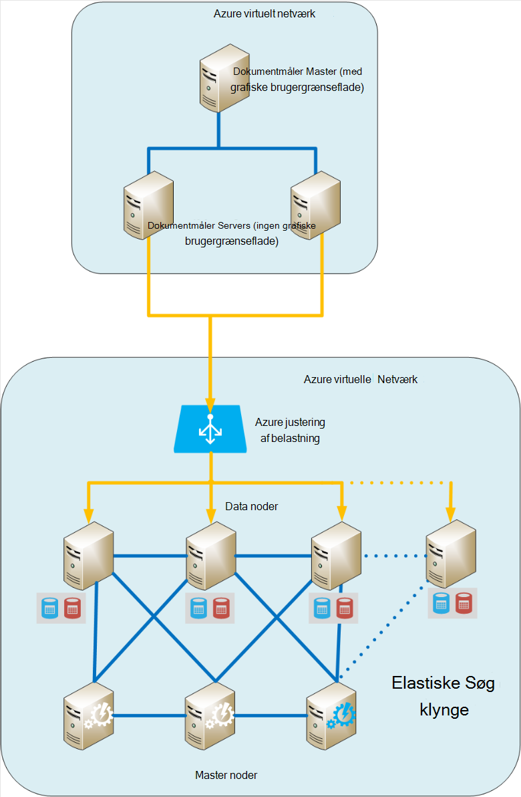
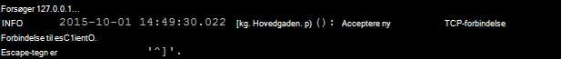
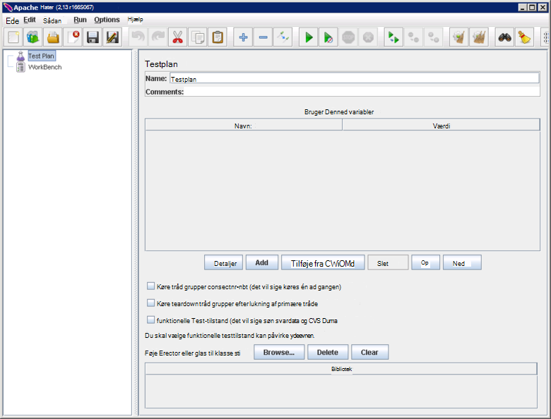
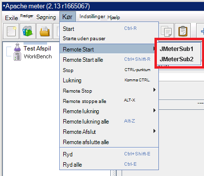
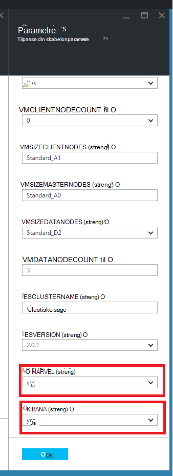
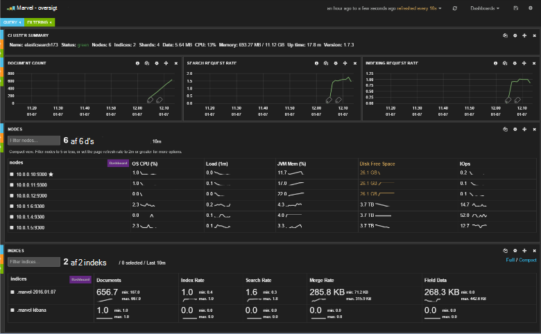
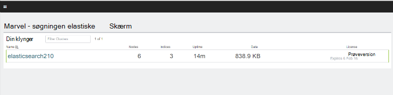
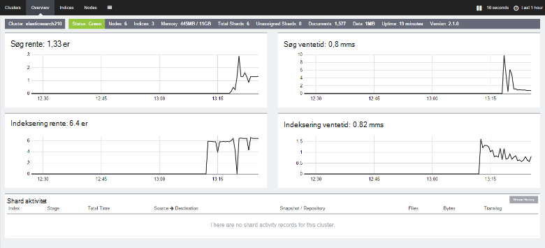

<properties
   pageTitle="Oprette en performance-test miljø til Elasticsearch | Microsoft Azure"
   description="Hvordan du konfigurerer et miljø til test af ydeevnen for en Elasticsearch klynge."
   services=""
   documentationCenter="na"
   authors="dragon119"
   manager="bennage"
   editor=""
   tags=""/>

<tags
   ms.service="guidance"
   ms.devlang="na"
   ms.topic="article"
   ms.tgt_pltfrm="na"
   ms.workload="na"
   ms.date="09/22/2016"
   ms.author="masashin"/>
   
# <a name="creating-a-performance-testing-environment-for-elasticsearch-on-azure"></a>Oprette en performance-test miljø til Elasticsearch på Azure

[AZURE.INCLUDE [pnp-header](../../includes/guidance-pnp-header-include.md)]

I denne artikel er [en del af en række](guidance-elasticsearch.md). 

Dette dokument beskriver, hvordan du konfigurerer et testmiljø ydeevnen for en Elasticsearch klynge. Denne konfiguration blev brugt til at teste ydeevnen for data indtagelse og forespørgsel arbejdsbelastninger, som det er beskrevet i [optimering af data indtagelse ydeevne for Elasticsearch på Azure][].

Ydeevnen test processen bruges [Apache JMeter](http://jmeter.apache.org/)med den [standard angive](http://jmeter-plugins.org/wiki/StandardSet/) af plug-ins installeret i en overordnet/underordnet-konfiguration ved hjælp af et sæt af dedikeret FOS (ikke en del af Elasticsearch klynge) specifikt er konfigureret til formålet. 

[PerfMon Server Agent](http://jmeter-plugins.org/wiki/PerfMonAgent/) blev installeret på hver Elasticsearch node. De følgende afsnit indeholder instruktioner til at genskabe testmiljøet til gør det muligt at foretage dine egne performance-test med JMeter. Disse instruktioner forudsætter, at du allerede har oprettet en Elasticsearch klynge med noder, der er forbundet med en Azure virtuelt netværk. 

Bemærk, at testmiljøet også kører som et sæt af Azure FOS administreres ved hjælp af en enkelt Azure ressourcegruppe.

[Marvel](https://www.elastic.co/products/marvel) blev også installeret og konfigureret til at aktivere de interne aspekter af Elasticsearch klynge skal overvåges og analysere nemmere. Hvis JMeter statistik viste en spidsbelastning eller trough i ydeevne, kan oplysninger, der er tilgængelige via Marvel være uvurderlig hjælp til at bestemme udsving årsagen.

Følgende billede viser strukturen i hele systemet. 



Bemærk følgende punkter:

- JMeter master VM kører Windows Server for at give den grafiske brugergrænseflade miljø til konsollen JMeter. JMeter Master VM indeholder den grafiske brugergrænseflade ( *jmeter* -program) for at aktivere en tester til at oprette test, køre test og visualisere resultaterne. Denne VM koordinater med JMeter serveren VM'er, der faktisk sende anmodningerne, der udgør testene.

- De JMeter underordnede FOS køre Ubuntu Server (Linux), der er ingen grafiske krav til disse FOS. JMeter serveren FOS køre serversoftware JMeter (jmeter - programmet *server* ) til at sende anmodninger til Elasticsearch klynge.

- Dedikeret klient noder blev ikke brugt, selvom dedikeret master noder blev.

- Antallet af dataknuder i klyngen kan variere, afhængigt af scenariet testes.

- Alle noderne i Elasticsearch klynge køre Marvel at overvåge ydeevnen på kørselstidspunktet og JMeter Server Agent til at indsamle overvågningsdata til efterfølgende analyse.

- Når du tester Elasticsearch 2.0.0 og senere, en af noderne data også kører Kibana. Dette er påkrævet af versionen af Marvel, der kører på Elasticsearch 2.0.0 eller nyere.

## <a name="creating-an-azure-resource-group-for-the-virtual-machines"></a>Oprette en Azure ressourcegruppe til de virtuelle maskiner

JMeter master skal kunne oprette forbindelse direkte til hver af noderne i Elasticsearch klynge indsamle ydelsesdata. Hvis JMeter VNet er forskellige fra Elasticsearch klynge VNet, derefter indebærer dette konfiguration af hver Elasticsearch node med en offentlig IP-adresse. Hvis dette er et problem med konfigurationen af den Elasticsearch, bør du overveje at implementere JMeter FOS i den samme VNet som Elasticsearch klynge ved hjælp af samme ressourcegruppe, hvorefter kan du udelade proceduren første.

Først skal [oprette en ressourcegruppe](../resource-group-template-deploy-portal.md). Dette dokument forudsætter, at din ressourcegruppe hedder *JMeterPerformanceTest*. Hvis du vil køre JMeter FOS i den samme VNet som Elasticsearch klynge, skal du bruge den samme ressourcegruppe som klyngen i stedet for at oprette en ny.

## <a name="creating-the-jmeter-master-virtual-machine"></a>Oprette JMeter master virtuel maskine

Næste [oprette en Windows-VM](../virtual-machines/virtual-machines-windows-hero-tutorial.md) ved hjælp af *Windows Server 2008 R2 SP1* billedet.  Vi anbefaler indstillingen en VM størrelse med tilstrækkelige kerner og hukommelse til at køre performance-test. Ideelt set dette er en maskine med mindst 2 kerner og 3,5 GB RAM (A2 Standard eller større).

<!-- TODO add info on why disabling diagnostics is positive --> 

Vi anbefaler, at du deaktiverer diagnosticering. Når du opretter VM i portalen, er det gøre under bladet *Indstillinger* i sektionen *overvågning* under *diagnosticering*. Du kan lade de andre indstillinger til standardværdierne.

Kontrollér, at VM og alle de tilknyttede ressourcer er blevet oprettet ved [at undersøge ressourcegruppen](../azure-portal/resource-group-portal.md#manage-resource-groups) på portalen. De viste ressourcer skal bestå af en VM, et netværk sikkerhedsgruppe og en offentlig IP-adresse alle med samme navn og network-grænseflade og lager konto med navne, der er baseret på den pågældende VM.

## <a name="creating-the-jmeter-subordinate-virtual-machines"></a>Oprette JMeter underordnede virtuelle maskiner

Nu [oprette en Linux VM](../virtual-machines/virtual-machines-linux-quick-create-portal.md) ved hjælp af *Ubuntu Server 14.04 LTS* billedet.  Vælg en VM størrelse med tilstrækkelige kerner og hukommelse til at køre performance-test, som i den JMeter master VM. Ideelt set dette er en maskine med mindst 2 kerner og mindst 3,5 GB RAM (Standard A2 eller større).

Igen, anbefaler vi, at du deaktiverer diagnosticering.

Du kan oprette så mange underordnede FOS, som du ønsker. 

## <a name="installing-jmeter-server-on-the-jmeter-subordinate-vms"></a>Installerer JMeter server på de underordnede FOS JMeter

De JMeter underordnede FOS kører Linux, og som standard du kan ikke oprette forbindelse til dem ved at åbne en forbindelse til Fjernskrivebord (RDP). I stedet kan du [bruge trykfarver for at åbne et vindue med kommandolinjen](../virtual-machines/virtual-machines-linux-mac-create-ssh-keys.md) på hver VM.

Når du har forbindelse til en af de underordnede FOS, bruger vi fest du konfigurerer JMeter.

Start med at installere den Java Runtime-miljø, der kræves for at køre JMeter.

```bash
sudo add-apt-repository ppa:webupd8team/java
sudo apt-get update
sudo apt-get install oracle-java8-installer
```

Nu hente JMeter softwaren pakket som en zip-fil.

```bash
wget http://apache.mirror.anlx.net/jmeter/binaries/apache-jmeter-2.13.zip
```

Installer kommandoen unzip, og derefter bruge det til at udvide JMeter softwaren. Softwaren er kopieret til en mappe med navnet **apache-jmeter-2.13**.

```bash
sudo apt-get install unzip
unzip apache-jmeter-2.13.zip
```

Ændre til holder JMeter eksekverbare *bin* -mappen, og foretag *jmeter-server* og *jmeter* programmerne eksekverbare.

```bash
cd apache-jmeter-2.13/bin
chmod u+x jmeter-server
chmod u+x jmeter
```

Nu skal vi brug for at redigere filen `jmeter.properties` findes i den aktuelle mappe (Brug tekstredigeringsprogrammet du kender mest med, som *vi* eller *vim*). Find følgende linjer:

```yaml
...
client.rmi.localport=0
...
server.rmi.localport=4000
...
```

Fjern kommentar fra (fjerne linjeafstanden \## tegn) og ændre disse linjer, som vist nedenfor, og derefter gemme filen, og Luk editor:

```yaml
...
client.rmi.localport=4441
...
server.rmi.localport=4440
```

Nu skal du køre følgende kommandoer til at åbne port 4441 til indgående TCP-trafik (dette er den port, du lige har konfigureret *jmeter-server* for at lytte på):

```bash
sudo iptables -A INPUT -m state --state NEW -m tcp -p tcp --dport 4441 -j ACCEPT
```

Hent den zip-fil, der indeholder den standard samling af plug-ins til JMeter (disse plug-ins indeholder ydeevne overvågning tællere) og derefter udpakke filen til mappen **apache-jmeter-2.13** . Plug-ins placeres udpakke filen på denne placering i den rigtige mappe.

Hvis du bliver bedt om at erstatte licens-fil, kan du skrive A (for alle):

```bash
wget http://jmeter-plugins.org/downloads/file/JMeterPlugins-Standard-1.3.0.zip
unzip JMeterPlugins-Standard-1.3.0.zip
```

Brug `nohup` til Start JMeter serveren i baggrunden. Det skal svare ved at vise et proces-ID og en meddelelse om, at det har oprettet et remote objekt og er klar til at starte modtager kommandoer.  Kør følgende kommando i mappen ~/apache-jmeter-2.13/bin. 

```bash
nohup jmeter-server &
```

> [AZURE.NOTE]Hvis VM er lukket afbrydes programmet JMeter server. Du skal oprette forbindelse til VM og genstarte den igen manuelt. Alternativt kan du konfigurere systemet for at køre kommandoen *jmeter-server* automatisk ved start ved at tilføje følgende kommandoer til den `/etc/rc.local` fil (før kommandoen *Afslut 0* ):

```bash
sudo -u <username> bash << eoc
cd /home/<username>/apache-jmeter-2.13/bin
nohup ./jmeter-server &
eoc
```

Erstatte `<username>` med dit login-navn.

Det kan være praktisk at holde vinduet terminal åben, så du kan overvåge forløbet af JMeter serveren, mens test er i gang.

Du skal gentage disse trin for hver underordnede VM JMeter.

## <a name="installing-the-jmeter-server-agent-on-the-elasticsearch-nodes"></a>Installerer JMeter Server Agent på noderne Elasticsearch

Denne procedure antages det, at du har login adgang til noderne Elasticsearch. Hvis du har oprettet den klynge ved hjælp af skabelonen Ressourcestyring, du kan oprette forbindelse til de enkelte noder gennem boksen gå VM, som vist i afsnittet Elasticsearch topologi i [Kører Elasticsearch på Azure](guidance-elasticsearch-running-on-azure.md). Du kan oprette forbindelse til boksen gå med trykfarver samt. 

Du kan bruge *ssh* -kommandoen til at logge på hver af noderne i Elasticsearch klynge derfra.

Log på en af noderne Elasticsearch som administrator.  Skriv følgende kommandoer til at oprette en mappe til at holde JMeter Server Agent fest kommandoprompten, og flytte til den pågældende mappe:

```bash
mkdir server-agent
cd server-agent
```

Kør følgende kommandoer for at installere kommandoen *udpakke* (hvis det ikke allerede er installeret), hente JMeter Server Agent softwaren og udpakke den:

```bash
sudo apt-get install unzip
wget http://jmeter-plugins.org/downloads/file/ServerAgent-2.2.1.zip
unzip ServerAgent-2.2.1.zip
```
 
Kør følgende kommando til at konfigurere firewallen og aktivere TCP-trafik til passerer gennem port 4444 (dette er den port, som JMeter Server Agent):

```bash
sudo iptables -A INPUT -m state --state NEW -m tcp -p tcp --dport 4444 -j ACCEPT
```

Kør følgende kommando for at starte JMeter Server Agent i baggrunden:

```bash
nohup ./startAgent.sh &
```

JMeter Server Agent skal svare med meddelelser, der angiver, at den er startet og lytter på port 4444.  Tryk på Enter for at få en kommandoprompt og derefter køre følgende kommando.

```bash
telnet <nodename> 4444
```

Erstatte `<nodename>` med navnet på din node. (Du kan finde navnet på din node ved at køre den `hostname` kommandoen.) Denne kommando åbner en telnet-forbindelse til port 4444 på din lokale computer. Du kan bruge denne forbindelse til at bekræfte, at JMeter Server Agent kører korrekt.

Hvis JMeter Server Agent ikke kører, får du vist svaret 

`*telnet: Unable to connect to remote host: Connection refused*.`

Hvis JMeter Server Agent kører og port 4444 er blevet konfigureret korrekt, skal du se følgende svaret:



> [AZURE.NOTE] Telnet-sessionen giver ikke en hvilken som helst type prompt, når den er tilsluttet.

Skriv følgende kommando i telnet-session:

``` 
test
```

Hvis JMeter Server Agent er konfigureret og lytter korrekt, skal den fortæller, at det modtaget kommandoen og svare med meddelelsen *Yep*.

> [AZURE.NOTE]Du kan skrive i andre kommandoer til at hente ydeevne overvågningsdata. For eksempel kommandoen `metric-single:cpu:idle` kan give dig den aktuelle del af den tid, som CPU'EN inaktiv (dette er et øjebliksbillede). Gå til siden [PerfMon Server Agent](http://jmeter-plugins.org/wiki/PerfMonAgent/) for en komplet liste over kommandoer. : Tilbage til kalder han Perfmon Server Agent. >>

Skriv følgende kommando for at afslutte sessionen og vende tilbage til kommandoprompten fest i telnet-session:

``` 
exit
```

> [AZURE.NOTE]Som med JMeter underordnede FOS, hvis du logger, eller hvis denne computer er lukket og genstartet derefter JMeter Server Agent skal genstartes manuelt ved hjælp af den `startAgent.sh` kommandoen. Hvis du vil JMeter Server Agent til at starte automatisk, skal du tilføje følgende kommando til slutningen af den `/etc/rc.local` filer, før kommandoen *Afslut 0* . 
> Erstatte `<username>` med dit login-navn:

```bash
sudo -u <username> bash << eoc
cd /home/<username>/server-agent
nohup ./startAgent.sh &
eoc
```

Du kan nu enten gentage hele processen for alle andre node i Elasticsearch klynge, eller du kan bruge den `scp` kommando for at kopiere server-agent mappen og indhold til alle andre node og brug den `ssh` kommandoen start JMeter Server Agent, som vist nedenfor. e Erstat `<username>` med dit brugernavn og `<nodename>` med navnet på den knude, hvor du vil kopiere, og køre softwaren (du kan blive bedt om at angive din adgangskode, som du kører hver kommando):

```bash
scp -r \~/server-agent <username>@<nodename>:\~
ssh <nodename> sudo iptables -A INPUT -m state --state NEW -m tcp -p tcp --dport 4444 -j ACCEPT
ssh <nodename> -n -f 'nohup \~/server-agent/startAgent.sh'
```

## <a name="installing-and-configuring-jmeter-on-the-jmeter-master-vm"></a>Installation og konfiguration af JMeter på JMeter master VM

Klik på **ressourcegrupper**i Azure-portalen. Klik på den ressourcegruppe, der indeholder JMeter master- og underordnede FOS i bladet **ressourcegrupper** .  Klik på **JMeter master VM**i bladet **ressourcegruppe** . Klik på **Opret forbindelse**i bladet virtuelt på værktøjslinjen. Åbn filen RDP, når du bliver bedt om webbrowseren. Windows opretter en forbindelse til Fjernskrivebord til din VM.  Angiv brugernavnet og adgangskoden for VM, når du bliver bedt om.

I VM, ved hjælp af Internet Explorer, gå til siden [Hente Java til Windows](http://www.java.com/en/download/ie_manual.jsp) . Følg vejledningen for at hente og køre installationsprogrammet til Java.

Gå til siden [Hente Apache JMeter](http://jmeter.apache.org/download_jmeter.cgi) i webbrowseren, og Hent den zip, der indeholder den seneste binært tal. Gemme postnummeret i et praktisk sted på din VM.

Gå til webstedet [Brugerdefineret JMeter plug-ins](http://jmeter-plugins.org/) og hente plug-ins sæt Standard. Gemme postnummeret i samme mappe som JMeter overførslen fra det forrige trin.

I Windows Stifinder, gå til den mappe, der indeholder apache-jmeter -*xxx* zip-fil, hvor *xxx* er den aktuelle version af JMeter. Udpak filerne til den aktuelle mappe.

Udtrække filerne i JMeterPlugins-Standard -*yyy*.zip-fil, hvor *yyy* er den aktuelle version af plug-ins, i apache-jmeter -*xxx* mappe. Dette tilføjer plug-ins til den korrekte mappe for JMeter. Du kan sikkert flette mapperne bibliotek og overskrive licens og vigtige oplysninger om filerne, hvis du bliver bedt om.

Gå til apache-jmeter -*xxx*mappe / mappe og rediger jmeter.properties fil via Notesblok.  I den `jmeter.properties` filer, finde sektionen mærket *Remote værter og Filformatet konfiguration*.  Find følgende linje i dette afsnit af filen:

```yaml
remote_hosts=127.0.0.1
```

Ret denne linje, og Erstat listen IP-adresse 127.0.0.1 med et komma, der er adskilt af IP-adresser eller host navne for hver af de underordnede JMeter-servere. Eksempel:

```yaml
remote_hosts=JMeterSub1,JMeterSub2
```

Find følgende linje, og derefter fjerne den `#` tegn i starten af linjen og ændre værdien af client.rmi.localport indstillingerne fra:

```yaml
#client.rmi.localport=0
```

Hvis du vil:

```yaml
client.rmi.localport=4440
```

Gem filen, og Luk Notesblok. 

Klik på **Start**på værktøjslinjen Windows, klik på **Administration**, og klik derefter på **Windows Firewall med Avanceret sikkerhed**.  Højreklik på **Indgående regler**i Windows Firewall med Avanceret sikkerhed-vinduet i venstre rude, og klik derefter på **Ny regel**.

Vælg **Port**i **Indgående guiden Ny regel**på siden **Regeltype** , og klik derefter på **Næste**.  Vælg **TCP**på siden protokoller og porte, skal du vælge **bestemte, lokale porte**, i tekstfeltet skrive `4440-4444`, og klik derefter på **Næste**.  Vælg **Tillad forbindelsen**, og klik derefter på **Næste**på siden handling. Lad alle indstillinger, der er markeret på profilsiden, og klik derefter på **Næste**.  På siden navn i **navn** tekstfeltet Skriv *JMeter*, og klik derefter på **Udfør**.  Luk Windows Firewall med Avanceret sikkerhed vindue.

I Windows Stifinder i apache-jmeter -*xx*mappe / mappe, skal du dobbeltklikke på *jmeter* Windows batchfilen for at starte den grafiske brugergrænseflade. Brugergrænsefladen skal vises:



Klik på **Kør**i menulinjen, klik på **Remote Start**, og Bekræft, at de to JMeter underordnede computere er angivet:



Du er nu klar til at starte test af ydeevne.

## <a name="installing-and-configuring-marvel"></a>Installation og konfiguration af Marvel

Skabelonen Elasticsearch Hurtig start til Azure installerer og konfigurerer den relevante version af Marvel automatisk, hvis du angiver parametrene MARVEL og KIBANA til SAND ("Ja"), når du opbygger klyngen:



Hvis du føjer Marvel til en eksisterende klynge, du skal udføre installationen manuelt, og processen er forskellige, afhængigt af om du bruger Elasticsearch version 1.7.x eller 2.x, som beskrevet i følgende procedurer.

### <a name="installing-marvel-with-elasticsearch-173-or-earlier"></a>Installere Marvel med Elasticsearch 1.73 eller tidligere

Hvis du bruger Elasticsearch 1.7.3 eller tidligere, skal du udføre følgende trin *på hver node* i klyngen:

- Log på noden, og gå til mappen Elasticsearch privat.  På Linux, typisk privat mappen er `/usr/share/elasticsearch`.

-  Kør følgende kommando for at hente og installere plug-in'en til Marvel til Elasticsearch:

```bash
sudo bin/plugin -i elasticsearch/marvel/latest
```

- Stop og genstart Elasticsearch på noden:

```bash
sudo service elasticsearch restart
```

- Åbn en webbrowser for at bekræfte, at Marvel blev installeret korrekt, og gå til URL-adressen `http://<server>:9200/_plugin/marvel`. Erstatte `<server>` med navnet eller IP-adressen på en hvilken som helst Elasticsearch server i klyngen.  Kontrollere, at der vises en side, der ligner, som vist nedenfor:




### <a name="installing-marvel-with-elasticsearch-200-or-later"></a>Installation af Marvel med Elasticsearch 2.0.0 eller nyere

Hvis du bruger Elasticsearch 2.0.0 eller nyere, udføre følgende opgaver *på hver node* i klyngen:

Log på noden og flytte til mappen Elasticsearch Startside (typisk `/usr/share/elasticsearch`) køre følgende kommandoer for at hente og installere plug-in'en til Marvel til Elasticsearch:

```bash
sudo bin/plugin install license
sudo bin/plugin install marvel-agent
```

Stop og genstart Elasticsearch på noden:

```bash
sudo service elasticsearch restart
```

Erstat teksten i den følgende procedure `<kibana-version>` med 4.2.2, hvis du bruger Elasticsearch 2.0.0 eller Elasticsearch 2.0.1 eller med 4.3.1, hvis du bruger Elasticsearch 2.1.0 eller nyere.  Erstatte `<marvel-version>` med 2.0.0, hvis du bruger Elasticsearch 2.0.0 eller Elasticsearch 2.0.1 eller med 2.1.0, hvis du bruger Elasticsearch 2.1.0 eller nyere.  Du kan udføre følgende opgaver *på en node* i klyngen:

Log på noden og hente den relevante build Kibana til din version af Elasticsearch fra [Elasticsearch hente websted](https://www.elastic.co/downloads/past-releases), og derefter udtrække pakken:

```bash
wget https://download.elastic.co/kibana/kibana/kibana-<kibana-version>-linux-x64.tar.gz
tar xvzf kibana-<kibana-version>-linux-x64.tar.gz
```

Åbn port 5601 at acceptere indgående anmodninger:

```bash
sudo iptables -A INPUT -m state --state NEW -m tcp -p tcp --dport 5601 -j ACCEPT
```

Flytte til mappen Kibana config (`kibana-<kibana-version>-linux-x64/config`), redigere den `kibana.yml` fil, og Tilføj følgende linje. Erstatte `<server>` med navnet eller IP-adressen for en Elasticsearch server i klyngen:

```yaml
elasticsearch.url: "http://<server>:9200"
```

Gå til mappen Kibana bin (`kibana-<kibana-version>-linux-x64/bin`), og køre følgende kommando for at integrere Marvel plug-in'et i Kibana:

```bash
sudo ./kibana plugin --install elasticsearch/marvel/<marvel-version>
```

Start Kibana:

```bash
sudo nohup ./kibana &
```

Åbn en webbrowser for at bekræfte Marvel installationen, og gå til URL-adressen `http://<server>:5601/app/marvel`. Erstatte `<server>` med navnet eller IP-adressen på den server, der kører Kibana.

Kontroller, at en side, der ligner, som vist nedenfor vises (navnet på din klynge varierer sandsynligt fra, som vist på billede).



Klik på linket, der svarer til din klynge (elasticsearch210 i billedet ovenfor). Skal vises en side, der ligner, som vist nedenfor:




[Justering af Data indtagelse ydeevnen til Elasticsearch på Azure]: guidance-elasticsearch-tuning-data-ingestion-performance.md  