<properties
   pageTitle="Implementere en JMeter JUnit CVS til test Elasticsearch ydeevne | Microsoft Azure"
   description="Sådan bruges en JUnit CVS til at oprette og overføre data til en Elasticsearch klynge."
   services=""
   documentationCenter="na"
   authors="dragon119"
   manager="bennage"
   editor=""
   tags=""/>

<tags
   ms.service="guidance"
   ms.devlang="na"
   ms.topic="article"
   ms.tgt_pltfrm="na"
   ms.workload="na"
   ms.date="09/22/2016"
   ms.author="masashin"/>
   
# Implementere en JMeter JUnit CVS til test Elasticsearch ydeevne

[AZURE.INCLUDE [pnp-header](../../includes/guidance-pnp-header-include.md)]

I denne artikel er [en del af en række](guidance-elasticsearch.md). 

Dette dokument beskriver, hvordan du opretter og bruger en JUnit CVS, som kan generere og overføre data til en Elasticsearch klynge som en del af en JMeter testplan. Denne fremgangsmåde giver en meget fleksible fremgangsmåde for at indlæse test, der kan generere store mængder testdata uden afhængigt af eksterne data-filer.

> [AZURE.NOTE] Indlæs test, der bruges til at vurdere ydeevnen for data indtagelse er beskrevet i [optimering af data indtagelse ydeevne for Elasticsearch](guidance-elasticsearch-tuning-data-ingestion-performance.md) blev oprettet ved hjælp af denne metode. Oplysninger om JUnit koden er beskrevet i dokumentet.

Test data indtagelse ydeevne koden JUnit udvikling ved hjælp af Eklipse (Mars) og afhængigheder er blevet løst ved hjælp af Maven. I følgende procedurer beskrives trinvise processen til installation af Eklipse, konfigurere Maven, oprette en JUnit test og implementere denne test som en anmodning om JUnit CVS i en JMeter test.

> [AZURE.NOTE] Se [oprette en ydeevne testmiljø til Elasticsearch på Azure][]kan finde detaljerede oplysninger om strukturen og konfigurationen af testmiljøet.

## Forudsætninger for installation

Du skal [Java Runtime-miljø](http://www.java.com/en/download/ie_manual.jsp) på computeren udvikling.
Du skal også at installere [Eklipse IDE til Java-udviklere](https://www.eclipse.org/downloads/index.php?show_instructions=TRUE).

> [AZURE.NOTE] Hvis du bruger den JMeter master VM er beskrevet i [oprette en ydeevne testmiljø til Elasticsearch på Azure][] som dit udviklingsmiljø, kan du hente Windows 32-Bit versionen af Eklipse Installer.

## Oprette et projekt til test af JUnit for belastning test Elasticsearch

Starte Eklipse IDE, hvis den ikke allerede kører, og luk derefter siden **Velkommen** .  Klik på menuen **filer** , og klik derefter på **Java Project**.

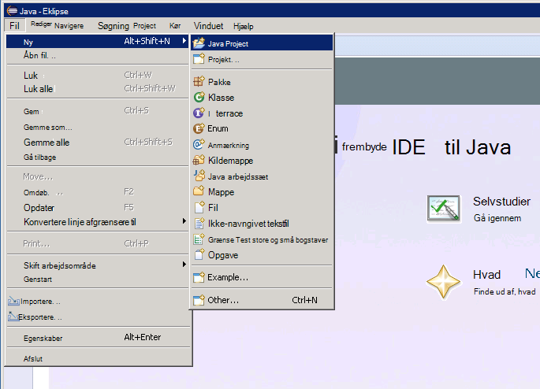

I vinduet **Nyt Java projekt** skal angive et projektnavn, Vælg **Brug standard JRE**og klik derefter på **Udfør**.

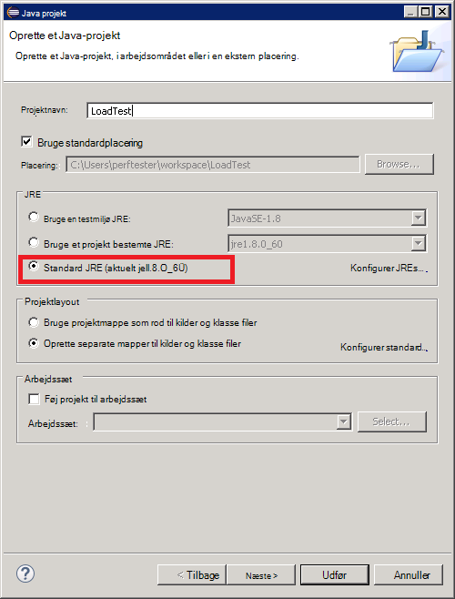

Udvid noden navngives efter dit projekt i **Pakke Stifinder** -vinduet. Kontrollér, at den indeholder en mappe med navnet **src** og en reference til den JRE, du har angivet.

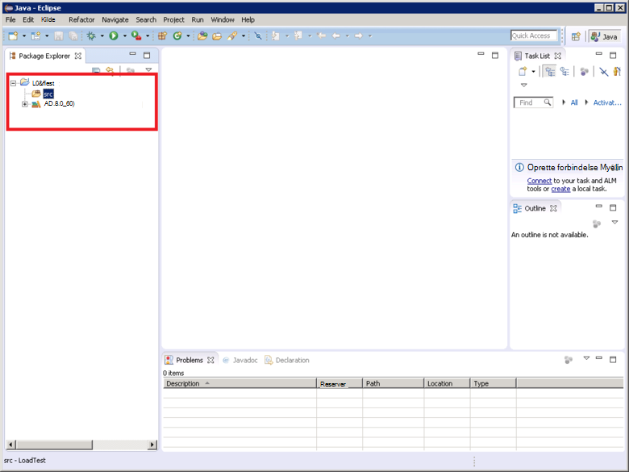

Højreklik på mappen **src** , klik på **Ny**og derefter klikke på **JUnit Test sag**.

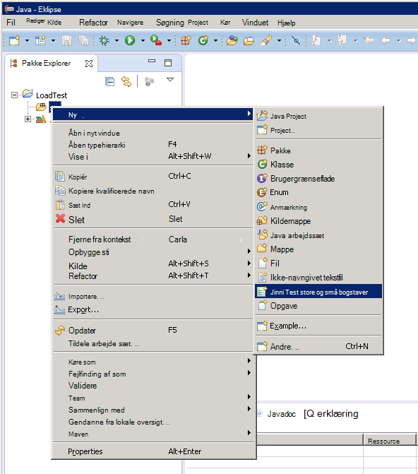

Angiv et navn til pakken (det kan være den samme som navnet på projektet, selvom ved konferencen det skal starte med et bogstav til små bogstaver), i vinduet **Ny JUnit Test sag** , Vælg **nye Junit 4 test**, et navn til boksen Testklasse, og vælg de indstillinger, som opretter de metode følgebrev, der kræves til din test. **Klasse under test** du lade feltet være tomt, og klik derefter på **Udfør**.

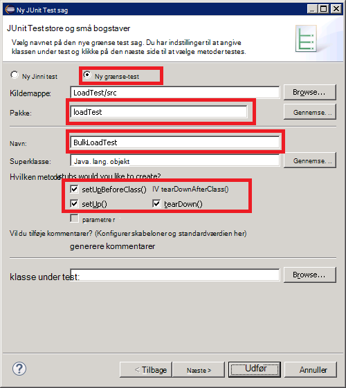

Hvis dialogboksen følgende **Ny JUnit Test sag** vises, skal du vælge muligheden for at føje biblioteket JUnit 4 til build stien, og klik derefter på **OK**. 

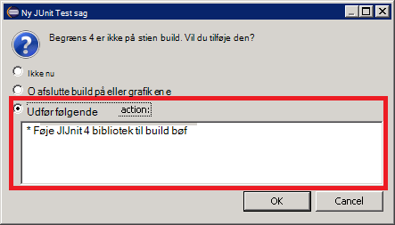

Kontrollér, skelet koden for JUnit test er oprettet og vises i vinduet Java editor.

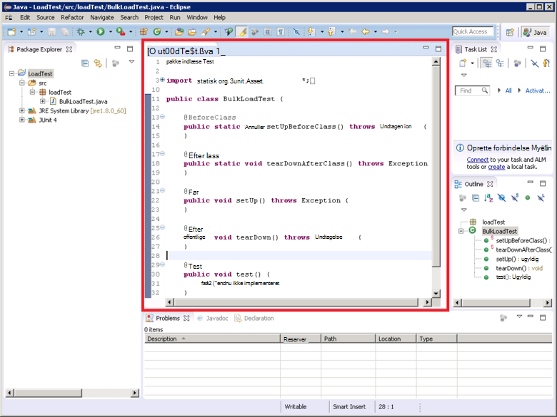

Højreklik på noden for projektet i **Pakke Explorer**, klik på **Konfigurer**, og klik derefter på **Konverter til Maven projekt**.

> [AZURE.NOTE]Brug af Maven, der gør det muligt for dig at administrere nemt eksterne afhængigheder (såsom Elasticsearch Java klientbiblioteker) afhænger et projekt af.

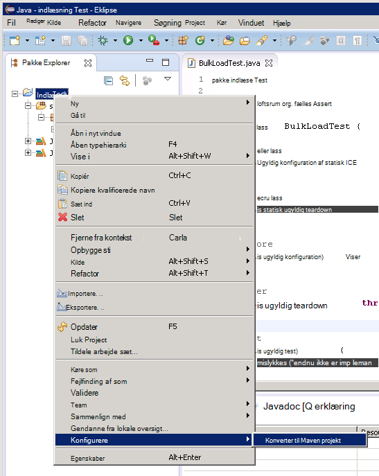

Vælg **glas**i dialogboksen **Opret ny POM** i rullelisten **emballagen** , og klik derefter på **Udfør**.

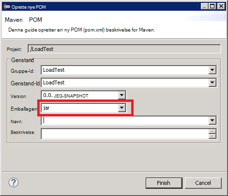

Ruden, der vises under af project object model (POM) editor kan blive vist advarslen "Build sti Angiver testmiljø J2SE 1,5. Der er ingen JREs installeret i arbejdsområdet, der er kun kompatible med dette miljø", afhængigt af hvilken version af Java er installeret på computeren udvikling. Hvis du har en version af Java, der er nyere end version 1.5, kan du ignorere denne advarsel.

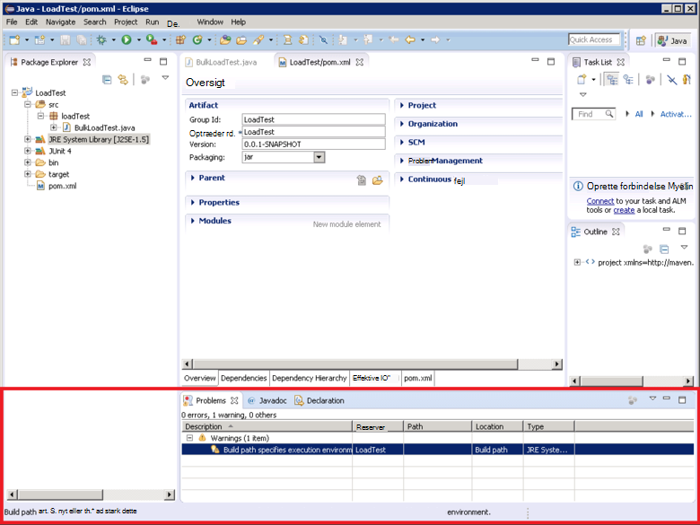

I editoren POM Udvid **Egenskaber** , og klik derefter på **Opret**.

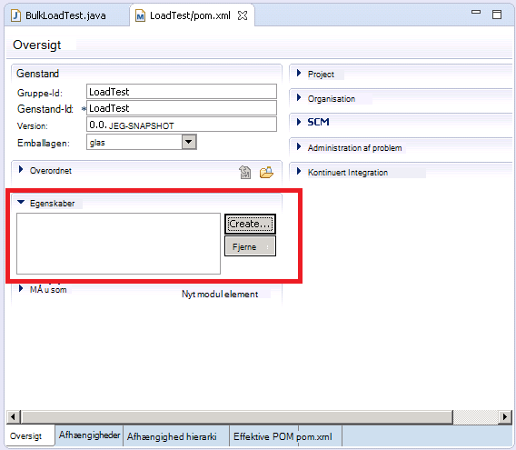

Skriv *1.7.2*i feltet **værdi** i feltet **navn** Skriv *es.version*i dialogboksen **Tilføj egenskab** , og klik derefter på **OK**. Dette er versionen af biblioteket Elasticsearch Java-klienten til at bruge (denne version kan tilsidesættes i fremtiden, og definere versionen som en POM egenskab og henvisninger til denne egenskab et andet sted i projektet, der gør det muligt for versionen, der skal ændres hurtigt).

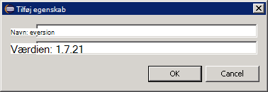

Klik på fanen **afhængigheder** i bunden af POM editoren, og klik derefter på **Tilføj** ud for listen **afhængigheder** .

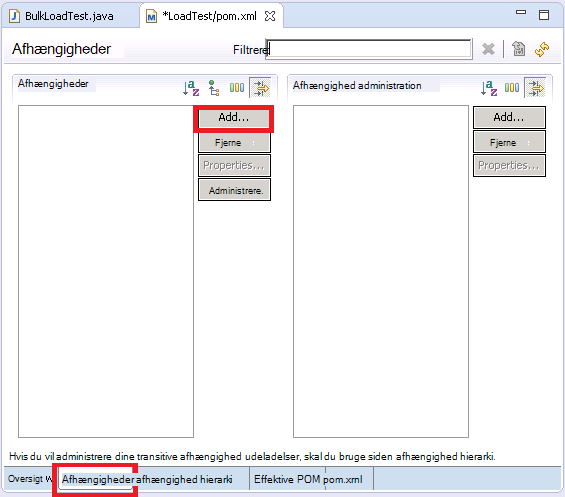

Skriv *org.elasticsearch*i feltet **Gruppe-Id** i dialogboksen **Vælg afhængighed** , i feltet **Genstand** Skriv *elasticsearch*i **Version** skrive * \${es.version}*, og klik derefter på **OK**. Oplysninger om Java Elasticsearch klient-biblioteket, der er opbevares i det online Maven centralt lager, og denne konfiguration overfører automatisk biblioteket og dets afhængigheder, når projektet er oprettet.

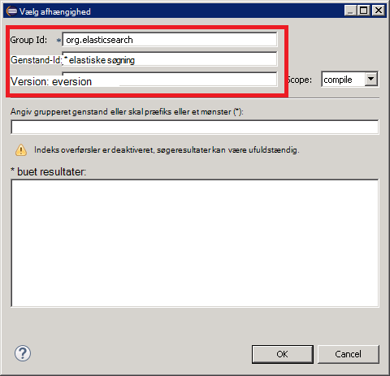

Klik på **Gem alt**i menuen **filer** . Denne handling sparer og opbygge i projektet, hente de afhængigheder, der er angivet af Maven. Kontrollér, at mappen Maven afhængigheder vises i pakke Stifinder. Udvid denne mappe for at få vist glas filerne hentes for at understøtte biblioteket Elasticsearch Java-klienten.

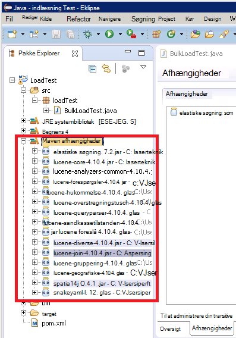

## Importere et eksisterende JUnit testprojekt til Eklipse

Denne procedure antages det, at du har hentet et Maven projekt, der tidligere blev oprettet ved hjælp af Eklipse.

Start Eklipse IDE. Klik på **Importér**i menuen **filer** .

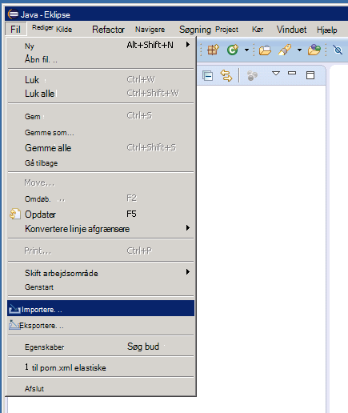

Udvid mappen **Maven** , klik på **Eksisterende Maven projekter**, og klik derefter på **Næste**i vinduet **Vælg** .

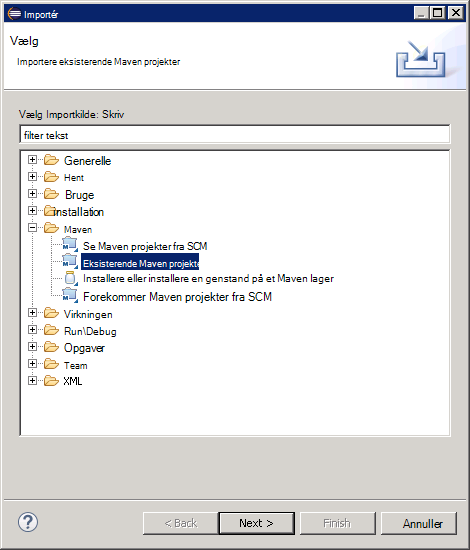

Angiv den mappe, holde projektet (den mappe med pom.xml-fil), skal du klikke på **Marker alt**, og klik derefter på **Udfør**i vinduet **Maven projekter** .

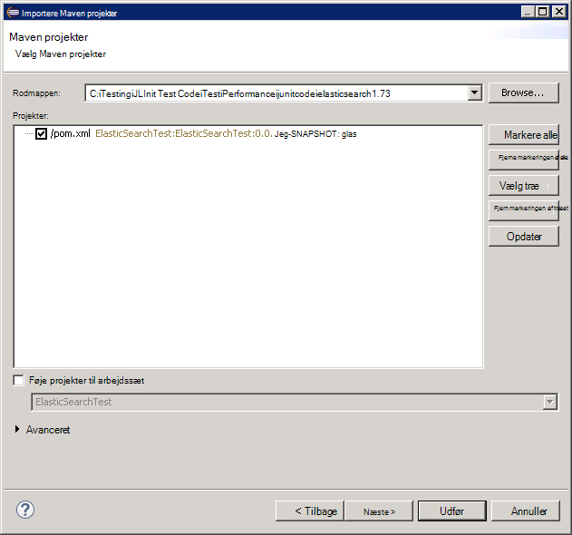

Udvid noden svarer til dit projekt i **Pakke Stifinder** -vinduet. Kontrollér, at projektet, indeholder en mappe med navnet **src**. Denne mappe indeholder kildekode til JUnit test. Projektet kan være kompileret og installeret følge vejledningen nedenfor.

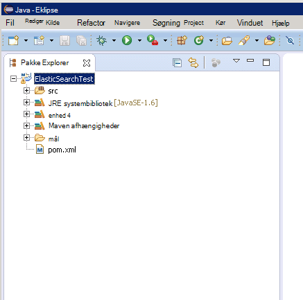

## Anvender en JUnit test for JMeter

Denne procedure antages det, du har oprettet et projekt med navnet LoadTest, der indeholder en JUnit Test klasse, kaldet `BulkLoadTest.java` , der accepterer konfiguration af parametre blev sendt som en enkelt streng til en parametre (dette er den metode, JMeter forventer).

Højreklik på projektnoden i Eklipse IDE, i **Pakke Explorer**, og klik derefter på **Eksporter**.

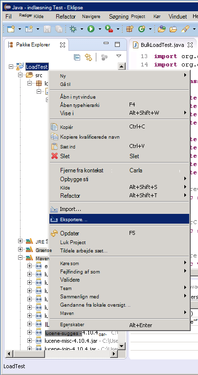

I **Guiden Eksporter**, på siden **Vælg** Udvid noden **Java** , skal du klikke på **JAR fil**, og klik derefter på **Næste**.

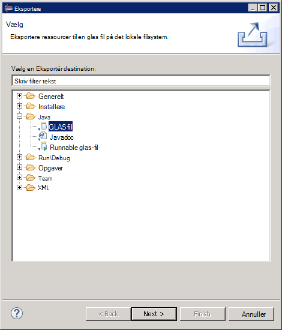

På siden **JAR specifikation af filen** i boksen **Vælg ressourcerne, der skal eksporteres** , udvide projektet Fravælg **.project**og fjerne markeringen af **pom.xml**. Angive et filnavn og en placering til glas (det bør have filtypenavnet .jar) i feltet **JAR fil** , og klik derefter på **Udfør**.

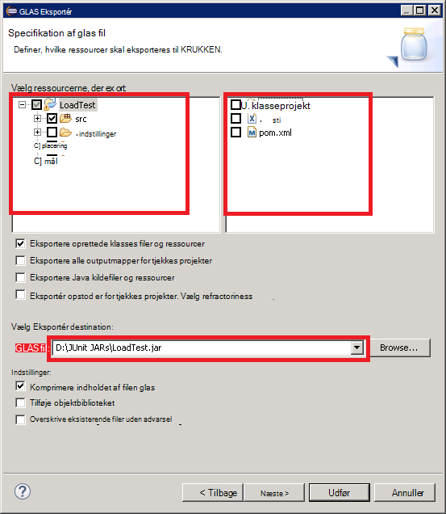

Med Windows Stifinder, Kopier filen glas, du lige har oprettet til den overordnede JVM JMeter og gemmer den i apache-jmeter-2.13\\bibliotek\\junit mappe under den mappe, hvor du har installeret JMeter (se fremgangsmåden "Oprettelse af den JMeter master virtuelle maskine" i at [oprette en ydeevne testmiljø til Elasticsearch på Azure](guidance-elasticsearch-creating-performance-testing-environment.md) mere).

Gå tilbage til Eklipse, udvide **Pakke Stifinder** -vinduet og notere alle glas filerne og deres placering, der er angivet i mappen Maven afhængigheder for projektet. Bemærk, at filer vises på følgende billede, kan variere, afhængigt af hvilken version af Elasticsearch du bruger:

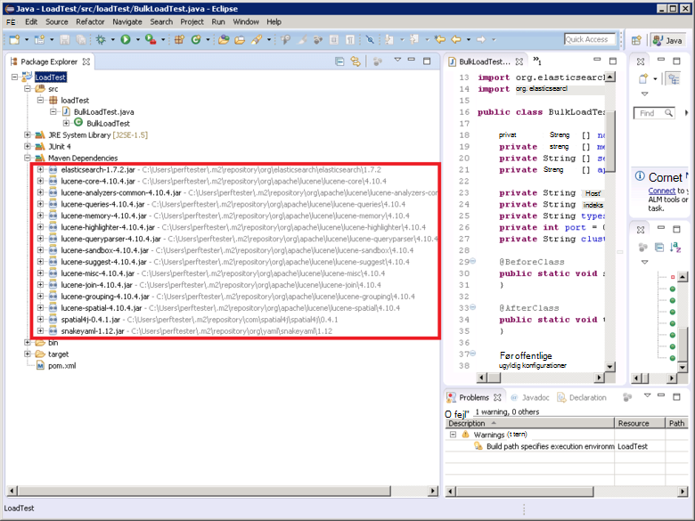

Med Windows Stifinder, kopiere hver enkelt glas-fil, der refereres til i mappen Maven afhængigheder til apache-jmeter-2.13\\bibliotek\\junit mappe på den overordnede VM JMeter.

Hvis bibliotek\\junit mappe allerede indeholder ældre versioner af filerne glas, skal du fjerne dem. Hvis du lader dem på stedet derefter JUnit test fungerer muligvis ikke som referencer kan oversættes til de forkerte krukker.

Stop JMeter på JMeter uden VM, hvis kører i øjeblikket.  Start JMeter.  I JMeter, skal du højreklikke på **Testplan**, klik på **Tilføj**, skal du klikke på **tråde (brugere)**og klik derefter på **Tråd gruppe**.

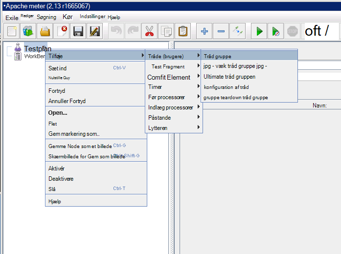

Under noden **Testplan** , højreklikke **Tråd gruppen**, klik på **Tilføj**, skal du klikke på **CVS**og klik derefter på **JUnit anmodning**.

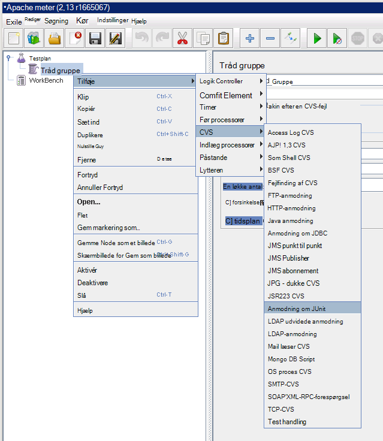

Vælg **Søg efter JUnit4 anmærkninger (i stedet for JUnit 3)**på siden **JUnit** . Vælg klasse JUnit Indlæs test i rullelisten **Klassenavn** (det vil blive angivet i formularen * &lt;pakke&gt;.&lt; klasse&gt;*), i **Teste metode** rullelisten Vælg JUnit teste metode (dette er den metode, som faktisk udfører arbejdet der er knyttet til en test og skal der er markeret med den *@test* anmærkning i Eklipse projektet), og Angiv værdierne, der skal overføres til parametre i boksen **Parametre streng etiket** . De oplysninger, der er vist på følgende billede er blot eksempler; din **Klassenavn** * *Testmetode*, og * *Parametre streng etiket** vil sandsynligvis være forskellige fra disse vist.

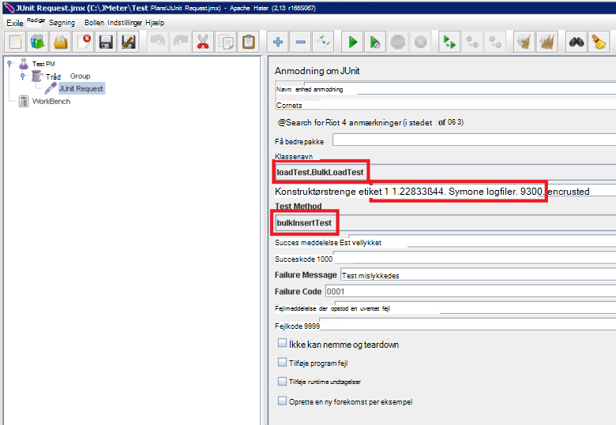

Hvis din klasse ikke vises i rullelisten **Klassenavn** , det sandsynligvis betyder, at glas ikke blev eksporteret korrekt eller ikke er placeret i bibliotek\\junit mappe eller nogle af de afhængige krukker mangler i bibliotek\\junit mappe. Hvis dette sker, eksportere projektet fra Eklipse igen og sikre, at du har valgt **src** ressourcen, kopiere KRUKKEN til bibliotek\\junit mappe og derefter kontrollere, at du har kopieret alle de afhængige krukker, der er angivet af Maven på mappen bibliotek.

Luk JMeter. Det er ikke nødvendigt at gemme testplanen.  Kopier filen glas, der indeholder klassen JUnit test til /home/&lt;brugernavn&gt;/apache-jmeter-2.13/lib/junit mappe på hver af de underordnede FOS JMeter (*&lt;brugernavn&gt; * er navnet på den administrative bruger du angav, da du oprettede VM, skal du se fremgangsmåden "Oprettelse af JMeter underordnede virtuelle maskiner" i at [oprette en ydeevne testmiljø til Elasticsearch på Azure](guidance-elasticsearch-creating-performance-testing-environment.md) kan finde flere oplysninger.)

Kopiere afhængige glas filerne, der kræves af klassen JUnit test til /home/&lt;brugernavn&gt;/apache-jmeter-2.13/lib/junit mappe på hver af de underordnede FOS JMeter. Sørg for at fjerne ældre versioner af glas filer fra denne mappe først.

Du kan bruge den `pscp` giver mulighed for at kopiere filer fra en Windows-computer til Linux.

[Oprette en Performance-test miljø til Elasticsearch på Azure]: guidance-elasticsearch-creating-performance-testing-environment.md
