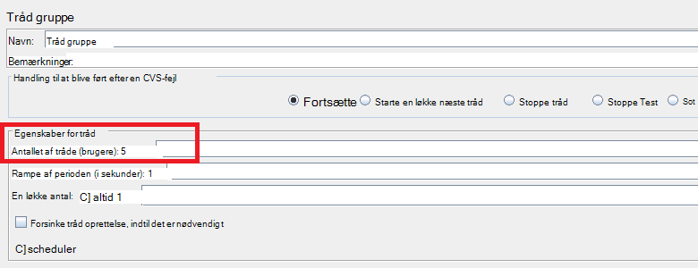
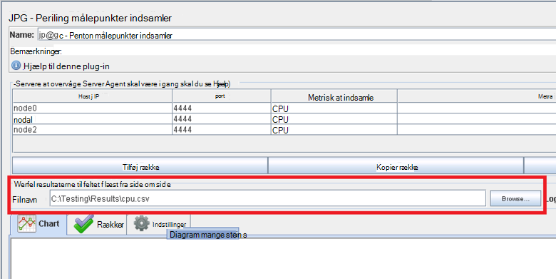
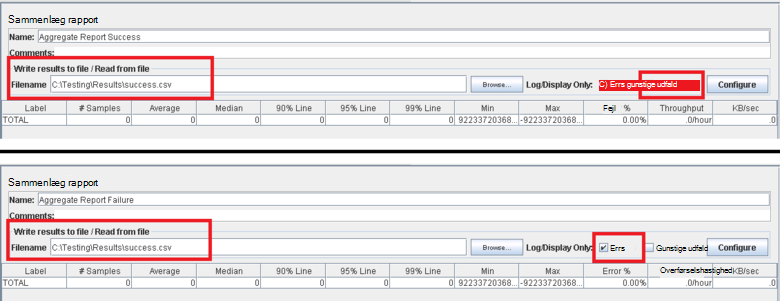
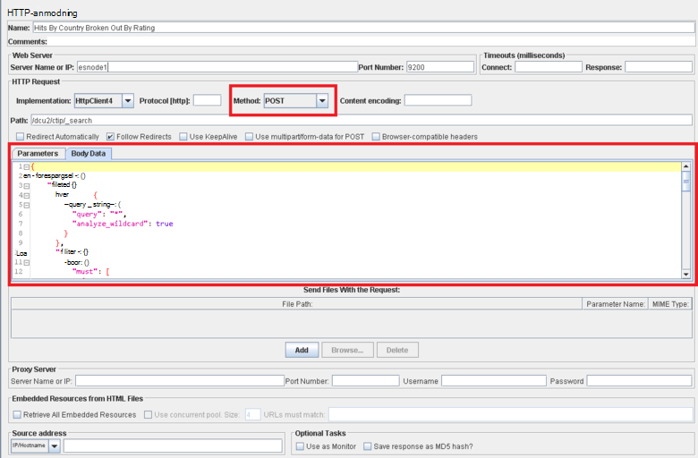

<properties
   pageTitle="Implementere en JMeter testplan for Elasticsearch | Microsoft Azure"
   description="Sådan køres ydeevne tester til Elasticsearch med JMeter."
   services=""
   documentationCenter="na"
   authors="dragon119"
   manager="bennage"
   editor=""
   tags=""/>

<tags
   ms.service="guidance"
   ms.devlang="na"
   ms.topic="article"
   ms.tgt_pltfrm="na"
   ms.workload="na"
   ms.date="09/22/2016"
   ms.author="masashin" />
   
# <a name="implementing-a-jmeter-test-plan-for-elasticsearch"></a>Implementere en JMeter testplan for Elasticsearch

[AZURE.INCLUDE [pnp-header](../../includes/guidance-pnp-header-include.md)]

I denne artikel er [en del af en række](guidance-elasticsearch.md). 

De performance-test, der udføres mod Elasticsearch er implementeret ved hjælp af JMeter testplaner sammen med Java-kode integreres som en JUnit test for at udføre opgaver som at overføre data til klyngen. Testplaner og JUnit kode er beskrevet i [optimering af data indtagelse ydeevne for Elasticsearch på Azure][]og [optimering af datasammenlægning og forespørgselsydelse for Elasticsearch på Azure][].

Formålet med dette dokument er opsummere vigtige oplevelsen erfaringer fra bygning af og kører disse test planer. Siden [JMeter bedste fremgangsmåder](http://jmeter.apache.org/usermanual/best-practices.html) på webstedet Apache JMeter indeholder mere generalized gode råd om effektiv brug af JMeter.

## <a name="implementing-a-jmeter-test-plan"></a>Implementere en JMeter testplan

Følgende liste indeholder en oversigt over de elementer, du bør overveje, når du opretter en JMeter testplan:

- Oprette en separat tråd gruppe for hver test, du vil udføre. En test, der kan indeholde flere trin, herunder logik enheder, timerne, før og efter processorer, eksempler og lyttere.

- Undgå at oprette for mange tråde i en tråd gruppe. Et stort antal tråde medfører JMeter mislykkes med "Hukommelse af" undtagelser. Det er bedst at tilføje flere JMeter underordnede servere kører et mindre antal tråde for at forsøge at køre et stort antal tråde på en enkelt JMeter-server.



- Inkorporere [Perfmon målepunkter indsamler](http://jmeter-plugins.org/wiki/PerfMon/) plug-in'et i testplanen for at vurdere ydeevnen for klyngen. Dette er en JMeter lytter, der er tilgængelige som et af de almindelige JMeter-plug-ins. Gem rå ydeevne dataene til et sæt af filer i kommaseparerede værdier (CSV)-format og behandle dem, når en test er fuldført. Dette er mere effektiv og giver mindre belaste JMeter end forsøg på at behandle dataene, som det er hentet. 



Du kan bruge et værktøj sådanne Excel til at importere dataene og oprette en række grafer til analytiske formål.

Overvej at indsamle følgende oplysninger:

- CPU-forbrug for hver node i Elasticsearch klynge.

- Antallet af byte Læs sekundet fra disk for hver node.

- Hvis det er muligt brugt procentdelen af CPU-tid vente på I/O udføres på hver node. Det er ikke altid muligt for Windows FOS, men du kan oprette en brugerdefineret metrikværdi (en EKSEKVERBAR metrisk), der kører følgende shellkommando for at kalde *vmstat* på en node for Linux:

```Shell
sh:-c:vmstat 1 5 | awk 'BEGIN { line=0;total=0;}{line=line+1;if(line&gt;1){total=total+\$16;}}END{print total/4}'
```

Feltet 16 i output fra *vmstat* indeholder den CPU-tid, der venter på I/O. Du kan finde flere oplysninger om, hvordan denne erklæring fungerer [vmstat kommandoen](http://linuxcommand.org/man_pages/vmstat8.html)vises.

- Antallet byte, der sendes og modtages via netværket til hver node.

- Brug separat Sammenlæg rapport lyttere til at registrere den ydeevne og hyppigheden for vellykkede og mislykkede handlinger. Registrere vellykkede og mislykkede data til andre filer.



- Bevar hver JMeter test sag så enkelt som muligt at gør det muligt at koordinere direkte ydeevne med bestemte test handlinger. I test tilfælde, der kræver kompleks logik, kan du overveje encapsulating denne logik i en JUnit test og bruge JUnit anmodning CVS i JMeter til at køre testen.

- Bruge på http-anmodning eksemplet til at udføre HTTP handlinger, som få, INDLÆG, læg eller Slet. For eksempel kan du køre Elasticsearch søgninger ved hjælp af en forespørgsel i INDLÆG og give Forespørgselsoplysninger i feltet *Brødtekst Data* :



- For at lette repeterbarhed og genbrug, standardelementet teste JMeter testplaner. Du kan derefter bruge scripting til at automatisere kørslen af testplaner.

## <a name="implementing-a-junit-test"></a>Implementere en JUnit test

Du kan integrere komplekse kode på en JMeter testplan ved at oprette en eller flere JUnit test. Du kan skrive en JUnit test ved hjælp af en Java integreret udviklingsmiljø (IDE) som Eklipse. [Implementere en JMeter JUnit CVS til test Elasticsearch ydeevne][] indeholder oplysninger om, hvordan du konfigurerer et passende udviklingsmiljø.

Følgende liste indeholder en oversigt over nogle af de bedste fremgangsmåder skal du følge, når du skriver kode for en JUnit-test:

- Brug den test klasse til at videregive Initialiseringsparametre til testen. JMeter kan bruge en parametre, der fører en enkelt strengargument. Fortolke dette argument til dets individuelle elementer i parametre, som vist i følgende kodeeksempel:

```Java
private String hostName = "";
private String indexName = "";
private String typeName = "";
private int port = 0;
private String clusterName = "";
private int itemsPerBatch = 0;

/\* JUnit test class constructor \*/
public ElasticsearchLoadTest2(String params) {
    /* params is a string containing a set of comma separated values for:
        hostName
        indexName
        typeName
        port
        clustername
        itemsPerBatch
    */

    /* Parse the parameter string into an array of string items */
    String delims = "\[ \]\*,\[ \]\*"; // comma surrounded by zero or more spaces
    String\[\] items = params.split(delims);

    /* Note: Parameter validation code omitted */

    /* Use the parameters to populate variables used by the test */
    hostName = items[0];
    indexName = items[1];
    typeName = items[2];
    port = Integer.parseInt(items[3]);
    clusterName = items[4];
    itemsPerBatch = Integer.parseInt(items[5]);

    if(itemsPerBatch == 0)
        itemsPerBatch = 1000;
}
```

- Undgå at i/o-handlinger eller andre tidskrævende handlinger i parametre eller konfiguration Testklasse, fordi de udføre hver gang en JUnit test kører. (Samme JUnit test kan køre mange tusinde gange ved hver udføres fra JMeter test).

- Overvej at bruge enkeltstående installation til initialisering dyr test af store og små bogstaver.

- Hvis testen kræver et stort antal inputparametre, gemme oplysninger om test konfigurationen i en separat konfigurationsfil og overføre placeringen af denne fil i constructor.

- Undgå at hårdt kodningssprog filstier i Indlæs test koden. Dette kan medføre fejl på grund af forskelle mellem operating systems som Windows og Linux.

- Brug påstande til at angive fejl i JUnit teste metoder, så du kan spore dem med JMeter og bruge dem som en virksomhedsmål. Hvis det er muligt at overføre tilbage oplysninger om årsagen til fejlen, som vist i fed i følgende kodeeksempel:

```Java
@Test
public void bulkInsertTest() throws IOException {
    ...
    BulkResponse bulkResponse = bulkRequest.execute().actionGet();
    assertFalse(
        bulkResponse.buildFailureMessage(), bulkResponse.hasFailures());
        ...
}
```


[Running Elasticsearch on Azure]: guidance-elasticsearch-running-on-azure.md
[Justering af Data indtagelse ydeevnen til Elasticsearch på Azure]: guidance-elasticsearch-tuning-data-ingestion-performance.md
[Implementere en JMeter JUnit CVS til test Elasticsearch ydeevne]: guidance-elasticsearch-deploying-jmeter-junit-sampler.md
[Justering af datasammenlægning og Forespørgselsydelse for Elasticsearch på Azure]: guidance-elasticsearch-tuning-data-aggregation-and-query-performance.md
