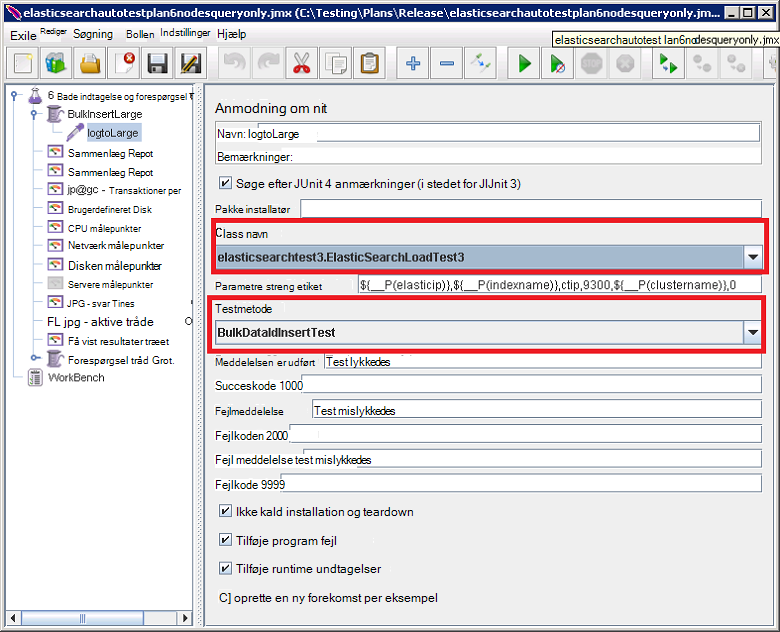

<properties
   pageTitle="Kørsel af automatiseret Elasticsearch ydeevne tester | Microsoft Azure"
   description="Beskrivelse af hvordan du kan køre performance-test i dit eget miljø."
   services=""
   documentationCenter="na"
   authors="dragon119"
   manager="bennage"
   editor=""
   tags=""/>

<tags
   ms.service="guidance"
   ms.devlang="na"
   ms.topic="article"
   ms.tgt_pltfrm="na"
   ms.workload="na"
   ms.date="09/22/2016"
   ms.author="masashin"/>
   
# <a name="running-the-automated-elasticsearch-performance-tests"></a>Kører de automatiserede Elasticsearch performance-test

[AZURE.INCLUDE [pnp-header](../../includes/guidance-pnp-header-include.md)]

I denne artikel er [en del af en række](guidance-elasticsearch.md). 

Dokumenterne, [optimering af data indtagelse ydeevne for Elasticsearch på Azure] og [optimering af datasammenlægning og forespørgselsydelse for Elasticsearch på Azure] beskriver et antal performance-test, som er kørt mod en stikprøve Elasticsearch klynge.

Disse test blev scripts for at aktivere dem til at blive kørt i en automatiseret måde. I dette dokument beskrives, hvordan du kan gentage testene i dit eget miljø.

## <a name="prerequisites"></a>Forudsætninger

De automatiske tests kræver følgende elementer:

-  En Elasticsearch klynge.

- En JMeter installation som beskrevet i dokumentet, [opretter en ydeevne testmiljø til Elasticsearch på Azure].

- [Python 3.5.1 til](https://www.python.org/downloads/release/python-351/) installeret på JMeter masteren VM.


## <a name="how-the-tests-work"></a>Hvordan testene, der fungerer
Testene, der køres ved hjælp af JMeter. En JMeter master server indlæser en testplan og sender den til en række JMeter underordnede servere, der faktisk kører testene. JMeter master serveren koordinater JMeter underordnede servere og indsamles resultaterne.

Der findes følgende testplaner:

* [elasticsearchautotestplan3nodes.jmx](https://github.com/mspnp/azure-guidance/blob/master/ingestion-and-query-tests/templates/elasticsearchautotestplan3nodes.jmx). Kører indtagelse testen over en 3-node klynge.

* [elasticsearchautotestplan6nodes.jmx](https://github.com/mspnp/azure-guidance/blob/master/ingestion-and-query-tests/templates/elasticsearchautotestplan6nodes.jmx). Kører indtagelse testen over en 6-node klynge.

* [elasticsearchautotestplan6qnodes.jmx](https://github.com/mspnp/azure-guidance/blob/master/ingestion-and-query-tests/templates/elasticsearchautotestplan6qnodes.jmx). Kører indtagelse og forespørgsel testen over en 6-node klynge.

* [elasticsearchautotestplan6nodesqueryonly.jmx](https://github.com/mspnp/azure-guidance/blob/master/ingestion-and-query-tests/templates/elasticsearchautotestplan6nodesqueryonly.jmx). Kører en forespørgsel kun test over en 6-node klynge.


Du kan bruge disse teste planer som udgangspunkt for din egen scenarier, hvis du har brug for færre eller flere noder.

Testplaner Brug en JUnit anmodning CVS til at generere og overføre testdataene. Testplan JMeter opretter og kører denne CVS og overvåger hver af Elasticsearch noderne til ydelsesdata.  

## <a name="building-and-deploying-the-junit-jar-and-dependencies"></a>Opbygge og implementere JUnit JAR og afhængigheder
Samle, før du kører de performance-test, skal du hente og installere de JUnit test, der er placeret under mappen ydeevne/junitcode. Disse test, der refereres til af testplan JMeter. Yderligere oplysninger finder du se fremgangsmåden "Importere et eksisterende JUnit testprojekt til Eklipse" i dokumentet [anvender en JMeter JUnit CVS til test Elasticsearch ydeevne].

Der er to versioner af testene, JUnit: 

- [Elasticsearch1.73](https://github.com/mspnp/azure-guidance/tree/master/ingestion-and-query-tests/junitcode/elasticsearch1.73). Du kan bruge denne kode til at udføre indtagelse test. Disse test Brug Elasticsearch 1.73.

- [Elasticsearch2](https://github.com/mspnp/azure-guidance/tree/master/ingestion-and-query-tests/junitcode/elasticsearch2). Du kan bruge denne kode for at udføre testene forespørgsel. Disse test Brug Elasticsearch 2.1 og senere versioner.

Kopiere den relevante Java arkivfilen (glas) sammen med resten af afhængighederne til JMeter-computere. Processen er beskrevet i [implementere en JMeter JUnit CVS til test Elasticsearch ydeevne][]. 

> **Vigtige** Når du anvender en JUnit test, bruge JMeter til at indlæse og konfigurere testplaner, som henviser til denne JUnit test, og Sørg for, at gruppen BulkInsertLarge tråd henviser til den korrekte glas-fil, JUnit klassenavnet og teste metode:
> 
> 
> 
> Gemme de opdaterede testplaner før kørsel af tester.

## <a name="creating-the-test-indexes"></a>Oprettelse af test indeks
Hver test udfører indtagelse og/eller et enkelt indeks forespørgsler angivet Når testen køres. Du skal oprette indekset ved hjælp af skemaer er beskrevet på listerne dokumenter [optimering af data indtagelse ydeevne for Elasticsearch på Azure] og [optimering af datasammenlægning og forespørgselsydelse for Elasticsearch på Azure] og konfigurere dem ifølge scenariet test (dokument værdier aktiveret/deaktiveret, flere replikaer osv.) Bemærk, at testplaner forudsætter, at indekset indeholder en enkelt type med navnet *ctip*.

## <a name="configuring-the-test-script-parameters"></a>Konfigurere test script-parametre
Kopier følgende test script parameter filer til servercomputeren JMeter:

* [run.properties](https://github.com/mspnp/azure-guidance/blob/master/ingestion-and-query-tests/run.properties). Denne fil angiver antallet JMeter test tråde til brug, varigheden af en test (i sekunder), IP-adressen på en node (eller en belastningsjustering i klynge Elasticsearch) og navnet på klyngen:

  ```ini
  nthreads=3
  duration=300
  elasticip=<IP Address or DNS Name Here>
  clustername=<Cluster Name Here>
  ```
  
  Redigere denne fil, og Angiv de relevante værdier til test og klynge.

* [forespørgsel-config-win.ini](https://github.com/mspnp/azure-guidance/blob/master/ingestion-and-query-tests/query-config-win.ini) og [forespørgsel-config-nix.ini](https://github.com/mspnp/azure-guidance/blob/master/ingestion-and-query-tests/query-config-nix.ini). Disse to filer indeholder de samme oplysninger at *vinde* filen er formateret til Windows filnavne og stier, og filen *nix* er formateret til Linux filnavne og stier:

  ```ini
  [DEFAULT]
  debug=true #if true shows console logs.

  [RUN]
  pathreports=C:\Users\administrator1\jmeter\test-results\ #path where tests results are saved.
  jmx=C:\Users\administrator1\testplan.jmx #path to the JMeter test plan.
  machines=10.0.0.1,10.0.0.2,10.0.0.3 #IPs of the Elasticsearch data nodes separated by commas.
  reports=aggr,err,tps,waitio,cpu,network,disk,response,view #Name of the reports separated by commas.
  tests=idx1,idx2 #Elasticsearch index(es) name(s) to test, comma delimited if more than one.
  properties=run.properties #Name of the properties file.
  ```

  Redigere denne fil for at angive placeringen af undersøgelsesresultaterne, navnet på testplan JMeter skal køres IP-adresser noderne Elasticsearch data, du indsamler ydeevne målepunkter fra de rapporter, der indeholder de rå ydeevne data, der skal oprettes, og det navn (eller navne kommasepareret) af indeks under test, hvis mere end én , test, der kører efter hinanden. Hvis filen run.properties er placeret i en anden mappe eller en mappe, kan du angive den fulde sti til filen.

## <a name="running-the-tests"></a>Kørsel af tester

* Kopiere filen [forespørgsel test.py](https://github.com/mspnp/azure-guidance/blob/master/ingestion-and-query-tests/query-test.py) til servercomputeren JMeter i samme mappe som run.properties og forespørgsel-config-win.ini (forespørgsel-config-nix.ini) filer.

* Sørg for, at jmeter.bat (Windows) eller jmeter.sh (Linux) er på den eksekverbare sti for dit miljø.

* Du kan køre scriptet forespørgsel test.py fra kommandolinjen til at udføre testene:

  ```cmd
  py query-test.py
  ```

* Når testen er gennemført, gemmes resultaterne, som sæt af kommaseparerede værdier (CSV) filer, der er angivet i filen forespørgsel-config-win.ini (forespørgsel-config-nix.ini). Du kan bruge Excel til at analysere og denne grafikdata.


[Justering af Data indtagelse ydeevnen til Elasticsearch på Azure]: guidance-elasticsearch-tuning-data-ingestion-performance.md
[Justering af datasammenlægning og Forespørgselsydelse for Elasticsearch på Azure]: guidance-elasticsearch-tuning-data-aggregation-and-query-performance.md
[Oprette en Performance-test miljø til Elasticsearch på Azure]: guidance-elasticsearch-creating-performance-testing-environment.md
[Implementere en JMeter JUnit CVS til test Elasticsearch ydeevne]: guidance-elasticsearch-deploying-jmeter-junit-sampler.md
