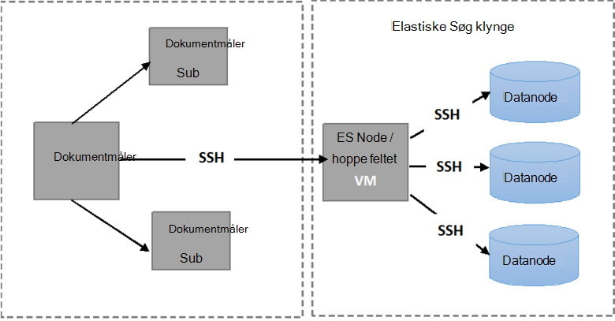

<properties
   pageTitle="Kørsel af automatiseret Elasticsearch fleksibilitet tester | Microsoft Azure"
   description="Beskrivelse af hvordan du kan køre testene, der fleksibilitet i dit eget miljø."
   services=""
   documentationCenter="na"
   authors="dragon119"
   manager="bennage"
   editor=""
   tags=""/>

<tags
   ms.service="guidance"
   ms.devlang="na"
   ms.topic="article"
   ms.tgt_pltfrm="na"
   ms.workload="na"
   ms.date="09/22/2016"
   ms.author="masashin"/>

# <a name="running-the-automated-elasticsearch-resiliency-tests"></a>Kørsel af automatiseret Elasticsearch fleksibilitet tester

[AZURE.INCLUDE [pnp-header](../../includes/guidance-pnp-header-include.md)]

I denne artikel er [en del af en række](guidance-elasticsearch.md).

I [konfiguration af spændstighed og gendannelse på Elasticsearch på Azure][elasticsearch-resilience-recovery], vi beskrevet en række test, der blev udført mod en stikprøve Elasticsearch klynge for at finde ud af, hvor godt systemet reageret på nogle almindelige former for fejl, og hvor godt den gendannes. Testene, der blev scripts for at aktivere dem til at blive kørt i en automatiseret måde. I dette dokument beskrives, hvordan du kan gentage testene i dit eget miljø. 

Følgende scenarier er testet:

- **Node fejl og genstart uden tab af data**. En datanode stoppes og genstartes efter 5 minutter.
Elasticsearch blev konfigureret ikke kunne omfordele manglende shards i dette interval, så ingen yderligere I/O er påløbet i bevæge sig shards rundt. Når noden genstarter, viser genoprettelsen shards på noden tilbage opdateret.

- **Node fejl med katastrofal datatab**. En datanode stoppes, og de data, den indeholder slettes for at efterligne katastrofal diskfejl. Noden derefter genstartes (efter 5 minutter), effektivt som en erstatning for den oprindelige node. Genoprettelsen kræver, at genopbygge de manglende data for denne node og kan omfatte overflytte shards på andre noder.

- **Node fejl og genstart med uden tab af data, men med shard Genallokering**. En datanode stoppes, og der tildeles de shards, den indeholder de andre noder. Noden genstartes derefter og flere Genallokering finder sted for at genoprette klyngen.

- **Rullende opdateringer**. Hver node i klyngen stoppes og genstartes efter et kort tidsinterval til at simulere maskiner blive genstartet efter en softwareopdatering. Kun én node er ikke længere på én gang.
Shards er ikke tildeles, mens en node er nede.

## <a name="prerequisites"></a>Forudsætninger

De automatiske tests kræver følgende elementer:

- En Elasticsearch klynge.

- En JMeter installation som beskrevet i [ydeevne test vejledning]. 

- De følgende tilføjelser, der er installeret på den JMeter master VM kun.

    - Java Runtime 7.

    - Nodejs 4.x.x eller nyere.

    - Værktøjerne ciffer kommandolinjen.

## <a name="how-the-scripts-work"></a>Hvordan fungerer scriptene

Testscripts er beregnet til at køre på JMeter Master VM. Når du vælger en test for at køre, udføre scriptene følgende sekvens af handlinger:

1.  Starte en JMeter testplan, der passerer de parametre, du har angivet.

2.  Kopiere et script, som udfører de handlinger, der kræves, før en test til en bestemt VM i klyngen. Det kan være en hvilken som helst VM, der har en offentlig IP-adresse eller *Jumpbox* VM, hvis du har oprettet den klynge ved hjælp af [Azure Elasticsearch Hurtig start skabelon](https://github.com/Azure/azure-quickstart-templates/tree/master/elasticsearch).

3.  Køre scriptet på VM (eller Jumpbox).

Følgende billede viser strukturen i testmiljø og Elasticsearch klynge. Bemærk, at test scriptene bruger secure shell (SSH) til at oprette forbindelse til de enkelte noder i klynge for at udføre forskellige Elasticsearch handlinger som stoppe eller genstarte en node.



## <a name="setting-up-the-jmeter-tests"></a>Konfiguration af JMeter tester

Før du kører spændstighed tester skal du samle og installere de JUnit test, der er placeret i mappen fleksibilitet/jmeter/test. Disse test, der refereres til af testplan JMeter. Yderligere oplysninger finder du se fremgangsmåden "Importere et eksisterende JUnit testprojekt til Eklipse" i [implementere en JMeter JUnit CVS til test Elasticsearch ydeevne][].

Der er to versioner af de JUnit test, som findes i følgende mapper:

- **Elasticsearch17.** Projektet i denne mappe genererer filen Elasticsearch17.jar. Brug denne glas til test Elasticsearch versioner 1.7.x

- **Elasticsearch20**. Projektet i denne mappe genererer filen Elasticsearch20.jar. Brug denne glas til test Elasticsearch version 2.0.0 og nyere

Kopiere den relevante glas fil sammen med resten af afhængighederne til JMeter-computere. Processen er beskrevet i fremgangsmåden "Implementering af en JUnit test til JMeter" i [implementere en JMeter JUnit CVS test Elasticsearch ydeevne].

## <a name="configuring-vm-security-for-each-node"></a>Konfiguration af VM sikkerhed for hver enkelt node

Testscripts kræver en godkendelsescertifikat være installeret på hver Elasticsearch node i klyngen. Dette kan du køre scripts til at køre automatisk uden at spørge om et brugernavn og adgangskode, som de opretter forbindelse til forskellige FOS.

Starte med at logge på en af noderne i Elasticsearch klynge (eller Jumpbox VM) og derefter køre følgende kommando for at oprette en godkendelsesnøgle:

```Shell
ssh-keygen -t rsa
```

Mens forbundet med den Elasticsearch node (eller Jumpbox), kan du køre følgende kommandoer for hver node i han Elasticsearch klynge. Erstatte `<username>` med navnet på en gyldig bruger på de enkelte VM og Erstat `<nodename>` med DNS-navn eller IP-adressen på den VM vært noden Elasticsearch.
Bemærk, at du vil blive bedt om adgangskoden for brugeren, når du kører disse kommandoer.
Flere oplysninger under [SSH login uden adgangskode](http://www.linuxproblem.org/art_9.html):

```Shell
ssh <username>@<nodename> mkdir -p .ssh (
cat .ssh/id\_rsa.pub | ssh <username>*@<nodename> 'cat &gt;&gt; .ssh/authorized\_keys'
```

## <a name="downloading-and-configuring-the-test-scripts"></a>Hente og konfiguration af test scriptene

Testscripts leveres i et ciffer lager. Brug følgende fremgangsmåde til at hente og konfigurere scriptene.

Åbne et ciffer computeren vindue (ciffer fest) på JMeter master maskinen sted, hvor du vil køre testene, og klone lager, der indeholder scriptene, som følger:

```Shell
git clone https://github.com/mspnp/azure-guidance.git
```

Flytte til mappen fleksibilitet test og køre følgende kommando for at installere de afhængigheder, der er nødvendige for at køre testene:

```Shell
npm install
```

Hvis JMeter masteren kører på Windows, kan du hente [Plink](http://www.chiark.greenend.org.uk/~sgtatham/putty/download.html), som er en kommandolinjen til trykfarver Telnet-klienten. Kopiér den eksekverbare Plink til mappen fleksibilitet-test/bibliotek.

Hvis JMeter masteren kører på Linux, du ikke behøver at hente Plink, men du skal konfigurere adgangskode mindre SSH mellem JMeter master og Elasticsearch node eller Jumpbox, du har brugt ved at følge trinnene beskrevet i fremgangsmåden "konfiguration af VM sikkerhed for hver enkelt node." 

Redigere følgende konfigurationsparametre i den `config.js` fil, der matcher testmiljø og Elasticsearch klynge. Disse parametre er fælles for alle testene:

| Navn | Beskrivelse | Standardværdi |
| ---- | ----------- | ------------- |
| `jmeterPath` | Lokal sti, hvor JMeter er placeret. | `C:/apache-jmeter-2.13` |
| `resultsPath` | Relative mappe, hvor scriptet gemmer resultatet. | `results` |
| `verbose` | Angiver, om scriptet skriver i detaljeret tilstand eller ej. | `true` |
| `remote` | Angiver, om JMeter testene køres lokalt eller på de eksterne servere. | `true` |
| `cluster.clusterName` | Navnet på Elasticsearch klyngen. | `elasticsearch` |
| `cluster.jumpboxIp`         | IP-adressen på Jumpbox computeren.                 |-|
| `cluster.username`          | Du har oprettet under installation af klyngen administrator. |-|
| `cluster.password`          | Adgangskode til administrator.                        |-|
| `cluster.loadBalancer.ip`   | IP-adressen på Elasticsearch justering af belastning.    |-|
| `cluster.loadBalancer.url`  | Grundlæggende URL-adressen for justering af belastning.                          |-|

## <a name="running-the-tests"></a>Kørsel af tester

Flytte til mappen fleksibilitet test og køre følgende kommando:

```Shell
node app.js
```

Følgende menu skal vises:


Angiv antallet af dette scenario, du vil køre: `11`, `12`, `13` eller `21`. 

Når du vælger et scenarie, køres testen automatisk. Resultaterne er gemt som et sæt kommaseparerede værdier (CSV) filer i en mappe, oprettes under mappen resultater. Hver Kør har sit eget resultater.
Du kan bruge Excel til at analysere og denne grafikdata.

[Running Elasticsearch on Azure]: guidance-elasticsearch-running-on-azure.md
[Tuning Data Ingestion Performance for Elasticsearch on Azure]: guidance-elasticsearch-tuning-data-ingestion-performance.md
[ydeevnen test vejledning]: guidance-elasticsearch-creating-performance-testing-environment.md
[JMeter guidance]: guidance-elasticsearch-implementing-jmeter.md
[Considerations for JMeter]: guidance-elasticsearch-deploying-jmeter-junit-sampler.md
[Query aggregation and performance]: guidance-elasticsearch-query-aggregation-performance.md
[elasticsearch-resilience-recovery]: guidance-elasticsearch-configuring-resilience-and-recovery.md
[Resilience and Recovery Testing]: guidance-elasticsearch-running-automated-resilience-tests.md
[Implementere en JMeter JUnit CVS til test Elasticsearch ydeevne]: guidance-elasticsearch-deploying-jmeter-junit-sampler.md
