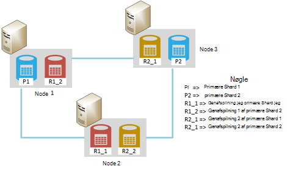
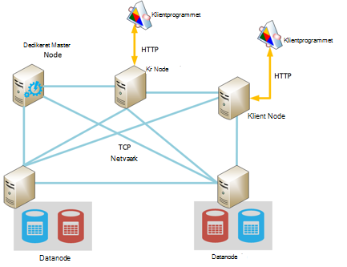
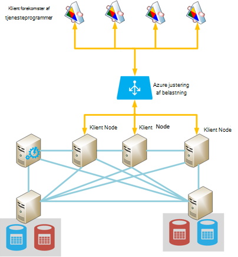
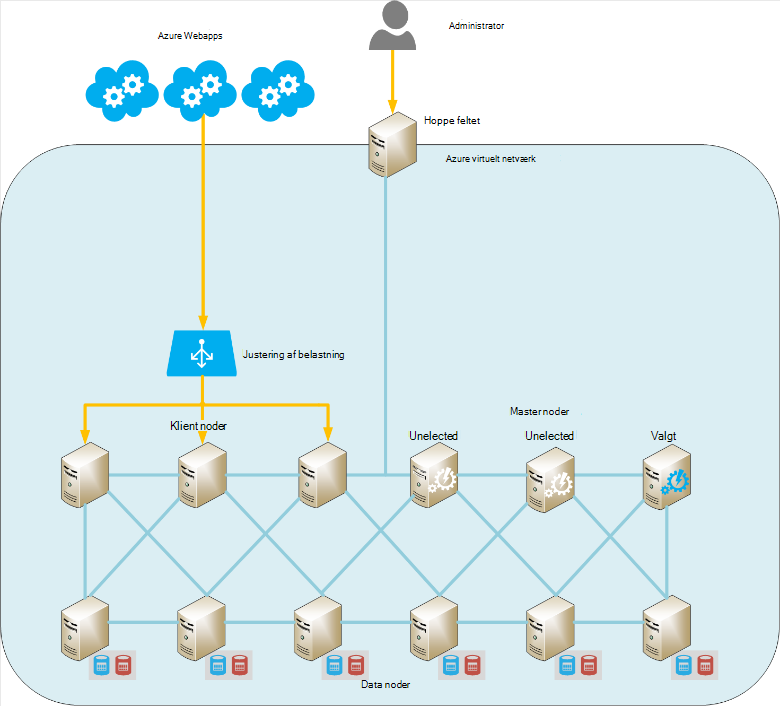

<properties
   pageTitle="Kører Elasticsearch på Azure | Microsoft Azure"
   description="Hvordan du kan installere, konfigurere og køre Elasticsearch på Azure."
   services=""
   documentationCenter="na"
   authors="dragon119"
   manager="bennage"
   editor=""
   tags=""/>

<tags
   ms.service="guidance"
   ms.devlang="na"
   ms.topic="article"
   ms.tgt_pltfrm="na"
   ms.workload="na"
   ms.date="09/22/2016"
   ms.author="masashin"/>

# <a name="running-elasticsearch-on-azure"></a>Kører Elasticsearch på Azure

[AZURE.INCLUDE [pnp-header](../../includes/guidance-pnp-header-include.md)]

I denne artikel er [en del af en række](guidance-elasticsearch.md). 

## <a name="overview"></a>Oversigt

Dette dokument indeholder en kort introduktion til den generelle struktur i Elasticsearch og derefter beskrives, hvordan du kan implementere en Elasticsearch klynge, ved hjælp af Azure. Den rører om bedste fremgangsmåder til implementering af en Elasticsearch klynge, koncentreret om de forskellige funktionelle ydeevne og administration af kravene i dit system og i betragtning hvordan dine krav til bør styrer konfiguration og topologi, du vælger.

> [AZURE.NOTE] Denne vejledning antages det, at nogle grundlæggende kendskab til [Elasticsearch][].

## <a name="the-structure-of-elasticsearch"></a>Strukturen i Elasticsearch 

Elasticsearch er en dokument-database, der er meget optimeret til at fungere som et søgeprogram. Dokumenter er serialiseres i JSON-formatet. Dataene opbevares i indeks, implementeret ved hjælp af [Apache Lucene][], selvom oplysninger er udtrukket fra visningen og det er ikke nødvendigt at forstå fuldt Lucene for at kunne bruge Elasticsearch.

### <a name="clusters-nodes-indexes-and-shards"></a>Klynger, noder, indeks og shards

Elasticsearch implementerer en grupperet arkitektur, der bruger sharding til at distribuere data på tværs af flere noder og gentagelse til at levere høj tilgængelighed. Dokumenter gemmes i indeks. Brugeren kan angive, hvilke felter i et dokument, der bruges til at identificere den entydigt inden for et indeks, eller systemet kan generere et nøglefelt og værdier automatisk. Indekset bruges til at organisere fysisk dokumenter og er hovedstolen betyder til at finde dokumenter. 

Et indeks indeholder et sæt af shards. Dokumenter, der er jævnt fordelt på tværs af shards ved hjælp af en hash-funktion, der er baseret på de indeks nøgleværdier og antallet af shards i indekset. 

Indeks kan replikeres. I dette tilfælde kopieres hver shard i indekset. Elasticsearch sikrer, at hver oprindelige shard for et indeks (kaldes en "primære shard") og dens replika altid er placeret på forskellige noder. Når et dokument er tilføjet eller ændret, skrive alle handlinger udføres på den primære shard første og klik derefter på hver replika. 

I nedenstående figur vises de væsentlige aspekter af en Elasticsearch klynge, der indeholder tre noder. Blevet er oprettet et indeks, der består af to primære shards med to replikaer for hver shard (seks shards i alle).



*En simpel Elasticsearch klynge, der indeholder to primære noder og to sæt replikaer*

Primære shard 1 og primære shard 2 er placeret på separate noder til at udjævner belastning på tværs af dem i denne klynge. Replikaerne fordeles på samme måde. Hvis en enkelt node mislykkes, har de resterende noder tilstrækkelige oplysninger til at aktivere system kunne fungere. Hvis det er nødvendigt, hæve Elasticsearch en replika shard for at blive en primær shard, hvis den tilsvarende primære shard ikke er tilgængelig.

### <a name="node-roles"></a>Node roller

Knuderne i en Elasticsearch klynge kan udføre følgende roller:

- En **datanode** , kan indeholde et eller flere shards, der indeholder indeksere data.

- En **klient node** , der ikke indeholder indeksere data, men håndterer indgående anmodninger fra klientprogrammer til noden relevante data.
 
- En **overordnet node** , der ikke indeholder indeksere data, men, som udfører klynge management handlinger, som vedligeholde og distribuere routing-oplysninger omkring klyngen (listen som noder indeholder hvilke shards), bestemme hvilke knuder er tilgængelige, overflytte shards som noder vises og skjules, og koordinere gendannelse efter node fejl. Flere noder kan konfigureres som mastere, men kun én faktisk vælges til at udføre de overordnede funktioner. Hvis denne node mislykkes, et andet valg finder sted og en af de andre berettigede master noder vælges og tage over.

> [AZURE.NOTE]Noden markeret master er meget vigtigt til ordentligt stå i klyngen. De andre noder pinge den regelmæssigt for at sikre, at den er stadig tilgængelig. Hvis noden markeret master fungerer også som en datanode, er der en mulighed, noden kan blive optaget og fejl for at besvare disse pinger. I så fald masteren anses for at have mislykkedes og en af de andre master noder er valgt i stedet. 

 Figuren nedenfor vises en topologi, der indeholder en blanding af dedikeret master, -klienten og noder data i en Elasticsearch klynge.



*En Elasticsearch klynge, der viser forskellige typer af knuder*

### <a name="costs-and-benefits-of-using-client-nodes"></a>Omkostninger og fordele ved at bruge klienten noder

Når et program sender en forespørgsel til en Elasticsearch klynge, er noden, programmet opretter forbindelse ansvarlig for at dirigere forespørgselsprocessen. Noden videresendes anmodningen til hver datanode og indsamler de resultater, returnerer den akkumulerede oplysninger til programmet. Hvis en forespørgsel involverer sammenlægninger og andre beregninger, udfører noden, programmet opretter forbindelse det nødvendige arbejde efter henter data fra hver af de andre noder. Denne proces punkt/Indhent kan forbruge betydelige behandling og hukommelse ressourcer.

Brug af dedikeret klient noder til at udføre disse opgaver kan data noder til at fokusere på administrere og lagring af data. Resultatet er, at mange scenarier, der involverer komplekse forespørgsler og sammenlægninger kan få glæde af ved hjælp af dedikeret klient noder. Virkningen af at bruge dedikeret klient noder, sandsynligt varierer afhængigt af din situation, arbejdsbelastningen og klyngestørrelse. 

> [AZURE.NOTE] Referere til [justering af datasammenlægning og Forespørgselsydelse for Elasticsearch på Azure][] yderligere oplysninger om justering processen.

### <a name="connecting-to-a-cluster"></a>Oprette forbindelse til en klynge

Elasticsearch Fremviser en række REST API'er til at opbygge klientprogrammer og afsendelse af anmodninger om til en klynge. Hvis du udvikler programmer, der bruger .NET Framework, to højere API'er findes – [Elasticsearch.Net og INDLEJRE][].

Hvis du opretter ved hjælp af Java-klientprogrammer, kan du bruge [Node klient API][] til at oprette klient noder dynamisk og føje dem til klyngen. Det er praktisk, hvis din computer bruger et lille antal langlivet forbindelser oprette klient noder dynamisk. Klient noder, der er oprettet ved hjælp af Node API er leveret med klyngen routing tilknytte (oplysninger som noder indeholder hvilke shards) af den overordnede node. Disse oplysninger gør det muligt for Java program tilladelse til at oprette forbindelse direkte til de relevante knuder når indeksering eller oprette forespørgsler til data, reducere antallet af hop, der kan være nødvendigt, når du bruger andre API'er.

Omkostningerne for denne metode er spild af tilmelding af klientnoden i klyngen. Hvis et stort antal klient noder vises og forsvinder hurtigt, blive hvilken virkning vedligeholde og distribuere klynge routing kortet betydeligt.

I nedenstående figur vises et program, der bruger en belastningsjustering til at dirigere anmodninger til et sæt klient noder, selvom den samme strategi kan bruges til at oprette forbindelse direkte til data noder Hvis klienten noder ikke bruges.



*Oprette forbindelse til en Elasticsearch klynge gennem den Azure justering af belastning forekomster af klienten tjenesteprogrammer*

> [AZURE.NOTE]Du kan bruge [Azure belastning][] til at fremvise klynge til det offentlige Internet, eller du kan bruge en [intern justering af belastning][] , hvis klientprogrammer og klynge befinder sig helt i det samme private virtuelle netværk (VNet).

### <a name="node-discovery"></a>Node registrering

Elasticsearch er baseret på peer-to-peer-kommunikation, så opdager andre noder i en klynge er en vigtig del i livscyklus for en node. Node registrering gør det muligt for nye data noder, der skal tilføjes dynamisk til en klynge, som også giver mulighed for klynge skalere ud transparent. Desuden, hvis en datanode ikke besvare anmodninger om kommunikation fra andre noder, kan en overordnet node beslutte, noden data mislykkedes, og gør det er nødvendigt for at igen allokerer de shards, som den holder til andre funktionsdygtige data noder.

Elasticsearch node registrering håndteres ved hjælp af et registrering modul. Modulet registrering er et plug-in, der kan skiftes for at bruge forskellige registrering. Modulet standard registrering ([Zen][]) får en node til udstedelse ping anmodninger om at finde andre noder på det samme netværk. Hvis andre noder reagerer, de sladder for at udveksle oplysninger. En overordnet node kan derefter distribuere shards til den nye node (hvis det er en datanode) og genoprette klyngen. Modulet Zen registrering håndterer også processen master valg og protokollen for registrering af fejl ved node.

Desuden, hvis du kører Elasticsearch noder som Azure virtuelle maskiner (VM'er), understøttes multicast-messaging ikke. Denne årsager, skal du konfigurere Zen registrering for at bruge unicast messaging og indeholder en liste over gyldige kontakter knuder på elasticsearch.yml konfigurationsfil.

Hvis du er vært for en Elasticsearch klynge i en Azure virtuelt netværk, kan du angive, at privat DHCP-tilknyttet IP-adresseret tildeles hver skal VM i klyngen forbliver tildelte (statisk). Du kan konfigurere Zen registrering unicast messaging ved hjælp af disse statiske IP-adresser. Hvis du bruger FOS med dynamiske IP-adresser, skal du huske på, hvis en VM stopper og genstarter den kunne tildeles en ny IP-adresse, foretage registrering sværere. Hvis du vil håndtere dette scenario, kan du udskifte [Azure skyen plug-in][]modulet Zen registrering. Denne plug-in bruger Azure API til at implementere registrering ordning, der er baseret på Azure abonnementsoplysninger.

> [AZURE.NOTE]Den aktuelle version af Azure skyen plug-in'et skal du installere management-certifikat til abonnementet Azure i Java keystore på noden Elasticsearch og angive placeringen af og legitimationsoplysninger for at få adgang til keystore i filen elasticsearch.yml. Denne fil holdes i klar tekst, så det er afgørende, hvor du sikrer denne fil er kun tilgængeligt ved den konto, kører tjenesten Elasticsearch. 
> 
> Desuden denne metode er muligvis ikke kompatible med Azure ressourcestyring installationer. Disse årsager anbefales det, at du bruger statiske IP-adresser for master noder, og bruge disse noder til at implementere Zen registrering unicast meddelelser på tværs af klyngen. I følgende konfiguration (tages fra filen elasticsearch.yml for en stikprøve datanode) reference host IP-adresser master noderne i klyngen:

```yaml
discovery.zen.ping.multicast.enabled: false  
discovery.zen.ping.unicast.hosts: ["10.0.0.10","10.0.0.11","10.0.0.12"]
```

## <a name="general-system-guidelines"></a>Generelle system retningslinjer

Elasticsearch kan køre på forskellige computere, lige fra en enkelt bærbar computer til en klynge af avancerede servere. Flere ressourcer med henblik på hukommelse, computing power og hurtigt diske, der er dog tilgængelig desto bedre ydeevne. I følgende afsnit beskrives de grundlæggende hardware- og softwarekrav til kørsel af Elasticsearch.

### <a name="memory-requirements"></a>Hukommelseskrav til 

Elasticsearch forsøger at gemme data i hukommelsen for hastighed. En fremstilling server, der er vært for en node for en typisk enterprise eller moderat størrelse kommercielle installation på Azure bør have mellem 14GB og 28GB RAM (D3 eller D4 VM'er). **Sprede belastning på tværs af flere noder i stedet for oprettelse af noder med mere hukommelse** (Det er vist, ved hjælp af større noder med mere hukommelse kan medføre udvidet gendannelse gange i tilfælde af en mislykket.) Men selvom oprette klynger med et stort antal af lille knuder kan øge tilgængelighed og overførselshastighed, eskalerer det også den indsats, der er involveret i administration og vedligeholde sådanne et system.

**Tildele 50% af tilgængelig hukommelse på en server til Elasticsearch heap'en**. Hvis du bruger Linux sæt miljøvariablen ES_HEAP_SIZE før du kører Elasticsearch. Hvis du bruger Windows eller Linux, kan du også angive hukommelsesstørrelse i den `Xmx` og `Xms` parametre, når du starter Elasticseach. Angive begge af disse parametre til den samme værdi for at undgå Java Virtual Machine (JVM) ændre størrelsen på heap på kørselstidspunktet. Dog **ikke tildele mere end 30 GB**. Brug den resterende hukommelse for operativsystem filcachen.

> [AZURE.NOTE]Elasticsearch anvender biblioteket Lucene for at oprette og administrere indeks. Lucene strukturer Brug en disk-baseret format, og cachelagring disse strukturer i filsystemcachen væsentligt forbedrer ydeevnen.

Bemærk, at den maksimale optimal Heapstørrelse til Java på en 64-bit maskine er lige over 30GB. Over denne størrelse Java skifter til at bruge en udvidet metode til at referere til objekter på heap'en, som øger hukommelseskravene til de enkelte objekter og reducerer ydeevne. 

Standard Java spildopsamlingsfunktionen (samtidige er markeret og oprydning) kan også udføre underordnede optimalt, hvis Heapstørrelse er over 30 GB. Det anbefales ikke i øjeblikket at skifte til en anden spildopsamlingsfunktionen som Elasticsearch og Lucene er kun testet mod standard.

Ikke bruge for meget hukommelse som ombyttede primære hukommelse på disk alvorligt vil påvirke ydeevnen. Hvis det er muligt deaktivere Skift helt (detaljerne afhænger af operativsystemet). Hvis det ikke er muligt derefter aktiverer du indstillingen *mlockall* i Elasticsearch konfigurationsfil (elasticsearch.yml) på følgende måde:

```yaml
bootstrap.mlockall: true
```

Denne indstilling for søgekonfiguration medfører JVM låse dens hukommelse og forhindrer, at den blive skiftet ud af operativsystemet.

### <a name="disk-and-file-system-requirements"></a>Disk- og systemkrav

Brug datadisce sikkerhedskopien af premium storage til lagring af shards. Diske skal tilpasses for at holde den maksimale mængde data, som forventet i din shards, selvom det er muligt at tilføje yderligere diske senere. Du kan udvide en shard på tværs af flere diske på en node.

> [AZURE.NOTE]Elasticsearch komprimerer dataene til gemte felter ved hjælp af algoritmen LZ4, og i Elasticsearch 2.0 og derefter kan du ændre komprimeringstypen. Du kan skifte algoritmen komprimering til DEFLATE, som bruges af *zip* og *gzip* værktøjer. Denne komprimering teknik kan være flere ressource intensivt, men du bør overveje at bruge det til arkiverede logdata. Denne metode kan hjælpe med at reducere størrelsen på indeks.

Det er ikke nødvendigt at alle noderne i en klynge har de samme disk layout og kapacitet. Men en node med en meget stor diskkapacitet sammenlignet med andre noder i en klynge vil tiltrække flere data og kræver øget behandling power til at håndtere disse data. Derfor noden kan blive "Varm" sammenlignet med andre noder, og det kan også påvirke ydeevnen.

Hvis det er muligt Brug RAID 0 (spredt). Andre former for RAID, der implementerer fungerer ensartet og spejling er unødvendige som Elasticsearch indeholder sin egen høj availablility løsning i form af replikaer.

> [AZURE.NOTE]Før du Elasticsearch 2.0.0, kan du også implementere striping på niveauet for software ved at angive flere mapper i indstillingen *path.data* konfiguration. Denne form for striping understøttes ikke længere i Elasticsearch 2.0.0. I stedet forskellige shards kan tildeles forskellige stier, men alle filerne i en enkelt shard skrives til den samme sti. Hvis du kræver striping, bør du fordeler data operativsystem eller hardwareniveau. 

Du skal maksimere lagerplads overførselshastighed, hver **VM skal have en dedikeret premium lagerplads konto**.

Biblioteket Lucene kan bruge et stort antal filer til at lagre indeks data, og Elasticsearch kan åbne et stort antal sockets til at kommunikere mellem noder og med klienter. Sørg for, at operativsystemet er konfigureret til at understøtte et passende antal Åbn fil beskrivelser (op til 64000, hvis der er tilstrækkelig hukommelse). Bemærk, at standardkonfiguration for mange Linux salgsdistributioner begrænser antallet af Åbn fil beskrivelser til 1024, som er for meget lille.

Elasticsearch bruger en kombination af tilknyttet hukommelse (mmap) I/O og Java nye i/o-(NIO) til at optimere samtidige adgang til datafiler og indeks. Hvis du bruger Linux, skal du konfigurere operativsystemet, for at sikre, at der er tilstrækkelig virtuel hukommelse med plads til 256K hukommelse kort områder.

> [AZURE.NOTE]Mange Linux salgsdistributioner standard for at bruge helt sædvanlig kø (CFQ) planlægningsprogrammet når arrangere til at skrive data på disken. Denne scheduler er ikke optimeret til SSDs. Overvej at omkonfigurere operativsystemet for at bruge enten Videresendelseskonsument planlæggeren eller deadline planlæggeren, hvor begge er mere effektivt til SSDs.

### <a name="cpu-requirements"></a>CPU-krav

Azure FOS er tilgængelige i en række forskellige CPU konfigurationer, understøttende mellem 1 og 32 kerner. Efter en datanode, er et godt udgangspunkt en standard DS serie VM, og vælg enten DS3 (4 kerner) eller D4 (8 kerner) lagerenheder. DS3 giver også 14GB RAM, mens DS4 omfatter 28GB. 

GS serie (til premium-lagerplads) og G-serie (for standard storage) Brug Xeon E5 V3 processorer, der kan være nyttige til arbejdsbelastninger, som er meget Beregn-intensivt, såsom store sammenlægninger. Besøg [størrelser for virtuelle maskiner][]til de seneste oplysninger.

### <a name="network-requirements"></a>Netværkskrav til

Elasticsearch kræver en netværksbåndbredde af mellem 1 og 10Gbps, afhængigt af størrelsen og flygtighed klynger, der implementerer den. Elasticsearch overfører shards mellem noder, som er tilføjet flere noder til en klynge. Elasticsearch antages det, der kommunikationstiden mellem alle noder stort set svarer og ikke overveje de relative placeringer af shards på disse noder. Desuden kan gentagelse betale betydeligt netværk I/O mellem shards. Disse årsager **undgå at oprette klynger på noder, der er i forskellige områder**.

### <a name="software-requirements"></a>Softwarekrav

Du kan køre Elasticsearch på Windows eller Linux. Tjenesten Elasticsearch installeres som et Java glas bibliotek og er afhængig af andre Java-biblioteker, der er inkluderet i pakken Elasticsearch. Du skal installere Java 7 (opdatering 55 eller nyere) eller Java 8 (opdatering 20 eller nyere) JVM til at køre Elasticsearch.

> [AZURE.NOTE]End parametrene *Xmx* og *Xms* hukommelse (angivet som kommandolinjeparametre til Elasticsearch-program – se [krav til hukommelse][]) ikke ændre standardindstillingerne for JVM konfiguration. Elasticsearch er udviklet ved hjælp af standardindstillingerne; ændre dem, kan det medføre Elasticsearch til at blive detuned og udføre dårligt.

### <a name="deploying-elasticsearch-on-azure"></a>Implementere Elasticsearch på Azure

Selvom det ikke er svært at implementere en enkelt forekomst af Elasticsearch, kan oprette et antal noder og installation og konfiguration af Elasticsearch på hver enkelt være en tidskrævende og fejlbehæftede proces. Hvis du overvejer kører Elasticsearch på Azure FOS, har du tre muligheder, der kan hjælpe med at reducere risikoen for fejl.

- Brug af Azure ressourcestyring [skabelon](https://azure.microsoft.com/marketplace/partners/elastic/elasticsearchelasticsearch/) i Azure marketplace. Denne skabelon er oprettet af elastiske. Det kan du føje kommercielle forbedringer som skjold, Marvel, Watcher og så videre.

- Brug af Azure Hurtig start [skabelon](https://github.com/Azure/azure-quickstart-templates/tree/master/elasticsearch) til at oprette klyngen. Denne skabelon kan oprette en klynge, der er baseret på Windows Server 2012 eller Ubuntu Linux 14.0.4. Det kan du bruge forsøg funktioner som Azure fillagring. Denne skabelon bruges til opslag og test opgaver i dette dokument.

- Brug af scripts, som kan automatisk eller køre uden opsyn. Scripts, som kan oprette og installere en Elasticsearch klynge er tilgængelige på [GitHub lager][elasticsearch-scripts]

## <a name="cluster-and-node-sizing-and-scalability"></a>Klynge og knude størrelseshåndtag og skalerbarhed 

Elasticsearch gør det muligt for et antal installation topologier, udviklet til at understøtte forskellige krav og niveauer af skala. Dette afsnit beskrives nogle almindelige topologier og beskriver overvejelser til implementering af klynger, der er baseret på disse topologier.

### <a name="elasticsearch-topologies"></a>Elasticsearch topologier

Figuren nedenfor illustrerer et udgangspunkt til at designe en Elasticsearch topologi for Azure:



*Foreslået udgangspunkt opbygning af en Elasticsearch klynge med Azure*

Denne topologi indeholder seks data noder sammen med tre klient noder og tre overordnede noder (kun én masterside node er valgt, de andre to er tilgængelige for valg skal markeret master mislykkes). Hver node er implementeret som en separat VM. Azure webprogrammer bliver bedt om at klienten noder via belastningsjustering. 

I dette eksempel alle noder og webprogrammerne er placeret i det samme virtuelle netværk som effektivt isolerer dem fra verden udenfor. Hvis klyngen skal være tilgængelig eksternt (muligvis som en del af en hybridløsning inkorporere lokale klienter), kan du bruge den Azure justering af belastning til at angive en offentlige IP-adresse, men du skal træffe ekstra sikkerhedsforholdsregler for at forhindre uautoriseret adgang til klyngen. 

Valgfri "hoppe feltet" er en VM, der er kun tilgængelig for administratorer. Denne VM har en netværksforbindelse til det virtuelle netværk, men også en udad modstående netværksforbindelse for at tillade administratorlogon fra et eksternt netværk (dette logon bør være beskyttet ved hjælp af en stærk adgangskode eller et certifikat). En administrator kan logge på feltet hoppe og derefter forbinde derfra direkte til en af noderne i klyngen. 

Alternative metoder omfatter ved hjælp af en-til-websted VPN-forbindelse mellem en organisation og det virtuelle netværk, eller brug af [ExpressRoute][] kredsløb til at oprette forbindelse til det virtuelle netværk. Disse mekanismer tilladelse administratoradgang til klyngen uden at udsætte klynge til det offentlige internet.

For at bevare VM tilgængelighed skal grupperes noderne data i det samme sæt Azure tilgængelighed. På samme måde, noderne klient holdes i et andet sæt tilgængelighed og noderne master er gemt i et tredje tilgængelighed sæt.

Denne topologi er relativt nemt at skalere ud, skal du blot tilføje flere noder af typen relevante og sikre, at de er konfigureret med det samme klyngenavn i filen elasticsearch.yml. Klient noder skal også føjes til back end-puljen for Azure justering af belastning.

**Søger efter geografisk klynger**

**Ikke sprede noderne i en klynge på tværs af områder, som dette kan påvirke ydeevnen af kommunikation mellem noder** (se [netværkskrav][]). Søger efter geografisk data tæt brugere i forskellige områder kræver, at oprette flere klynger. I dette tilfælde skal du overveje hvordan (eller endda om) til at synkronisere klynger. Mulige løsninger omfatter:

[Tribe noder][] ligner en klient node bortset fra at den kan deltage i flere Elasticsearch klynger og se dem alle som en stor klynge. Data er stadig administreres lokalt af hver klynge (opdateringer ikke overføres på tværs af klynge grænser), men alle data er synlige. En tribe node kan forespørgsel, oprette og administrere dokumenter i en klynge. 

De primære begrænsninger er, at en tribe node kan ikke bruges til at oprette et nyt indeks og indeksnavne skal være entydige på tværs af alle klynger. Det er derfor vigtigt, at du overvejer, hvordan indeks, navngives, når du designer klynger, der er beregnet til at få adgang til fra tribe noder.

Med denne funktion, hver klynge kan indeholde de data, der er mest sandsynlige kan åbnes af lokale klientprogrammer, men disse klienter kan stadig åbne og redigere fjerndata selvom med udvidede ventetid muligt. I nedenstående figur vises et eksempel på denne topologi. Noden tribe i klynge 1 fremhæves; de andre klynger kan også have tribe noder, selvom de ikke vises i diagrammet:


*En adgang til flere klynger via en tribe node-klientprogrammet*

Klientprogrammet opretter forbindelse til noden tribe i klynge 1 (samtidig findes i det samme område) i dette eksempel, men denne node er konfigureret til at kunne få adgang til klynge 2 og 3 klynge, som kan være placeret i forskellige områder. Klientprogrammet kan sende anmodninger, hente eller ændre data i et klynger.

> [AZURE.NOTE]Tribe noder kræver multicast-registrering skal oprettes forbindelse til klynger, som kan præsentere en sikkerhedsrisiko. Se afsnittet [Node registrering][] for at få mere at vide.

- Implementering af geografisk-replikering mellem klynger. I denne metode er blevet overført ændringer på hver klynge i nær realtid til klynger, der er placeret i andre datacentre. Tredjeparts-plug-ins er tilgængelige for Elasticsearch, der understøtter denne funktionalitet, som [PubNub ændringer plug-in'en][].

- Brug af [Elasticsearch øjebliksbillede og Gendan modul][]. Hvis dataene er meget langsom bevæger sig og ændres kun en enkelt klynge, kan du overveje at bruge snapshots til at tage et periodiske kopi af dataene og derefter gendanne disse snapshots i andre klynger (snapshots kan være gemt på Azure Blob-lager Hvis du har installeret [Azure skyen plug-in][]). Denne løsning fungerer ikke godt til hurtigt at ændre data, eller hvis data kan ændres i mere end én klynge.

**Mindre topologier**

Store topologier omfatter klynger af dedikeret master, -klienten og data knuder muligvis ikke være relevante for hver scenarie. Hvis du opbygger en mindre fremstilling eller udvikling system, kan du overveje de 3-node klynge, der er vist i nedenstående illustration.

Klientprogrammer Tilslut direkte til en hvilken som helst tilgængelige datanode i klyngen. Klyngen indeholder tre shards mærket P1-P3 (til giver mulighed for vækst) plus replikaer mærket R1 R3. Med tre noder kan Elasticsearch til at distribuere shards og replikaer, så hvis et enkelt node opstår ingen data går tabt.


*En 3-node klynge med 3 shards og replikaer*

Hvis du kører en development-installation på en enkeltstående computer kan du konfigurere en klynge med en enkelt node, der fungerer som master, -klienten og data lagerplads. Du kan starte flere noder, der kører som en klynge på den samme computer ved at starte mere end én forekomst af Elasticsearch. I nedenstående figur vises et eksempel.


*En udvikling konfiguration, der kører flere Elasticsearch noder på den samme maskine*

Bemærk, at ingen af disse enkeltstående konfigurationer er anbefalet til et produktionsmiljø, som de kan medføre konflikt, medmindre computeren udvikling har lang hukommelse og flere hurtigt diske. Desuden indeholder de ikke en høj tilgængelighed garanterer. Hvis computeren mislykkes, skal går alle noder tabt.

### <a name="scaling-a-cluster-and-data-nodes"></a>Skalering noderne en klynge og data

Elasticsearch kan skalere i to dimensioner: lodret (ved hjælp af større, mere effektiv computere) og vandret (sprede belastning på tværs af computere).

**Skalering Elasticsearch data noder lodret**

Hvis du er vært for en Elasticsearch klynge ved hjælp af Azure FOS, kan hver node svarer til en VM. Grænsen på lodret skalerbarhed efter en node i høj grad er underlagt SKU VM og de overordnede begrænsninger, der er anvendt på individuelle lagerplads konti og Azure abonnementer. 

Siden [Azure-abonnement og begrænsninger for tjenesten, kvoter, og begrænsninger](../azure-subscription-service-limits.md) i denne artikel beskrives disse begrænsninger detaljeret, men som omfang opbygning af en Elasticsearch klynge drejer elementer på følgende liste er de mest relevante. 

- Hver lagerplads konto er begrænset til 20.000 IOP'ER. Hver VM i klyngen bør gøre brug af en dedikeret (helst premium) lagerplads konto.

- Antallet af dataknuder i et virtuelt netværk. Hvis du ikke bruger ressourcestyring Azure, findes der en grænse på 2048 VM forekomster per virtuelt netværk. Det kan skyldes en begrænsning, mens det skal være tilstrækkelige i mange tilfælde, hvis du har en meget store konfiguration med tusindvis af noder.

- Antallet af lagerplads konti per abonnement per område. Du kan oprette op til 100 lagerplads konti per Azure abonnement i hvert område. Lagerplads konti bruges til at holde virtuelle disk, og hver lagerplads konto har en begrænsning på 500TB mellemrum.

- Antallet af kerner per abonnement. Standardgrænsen på er 20 kerner per abonnement, men dette kan øges op til 10.000 kerner tilsendt en grænse stigning gennem en supportbilletter. 

- Mængden hukommelse per VM størrelse. Mindre størrelse FOS har begrænset mængde tilgængelig hukommelse (D1 maskiner har 3,5 GB og D2 maskiner har 7 GB). Disse computere muligvis ikke passer til scenarier, der kræver Elasticsearch til cachen betydeligt datamængder at opnå god ydeevne (sammenfatning af data eller analysere et stort antal dokumenter under data indtagelse, for eksempel).

- Det maksimale antal diske per VM størrelse. Denne begrænsning kan begrænse størrelsen og ydeevnen af en klynge. Færre diske betyder, at færre data kan kendes, og ydeevnen kan blive reduceret, ved at få færre diske tilgængelig for striping.

- Antallet af opdatere domæner / fejl domæner per tilgængelighed sæt. Hvis du opretter FOS ved hjælp af Ressourcestyring Azure, kan hvert tilgængelighed sæt allokeres op til 3 fejl domæner og 20 opdatering domæner. Denne begrænsning kan påvirke spændstighed af en stor klynge, der er underkastet hyppige rullende opdateringer.

Desuden kan overveje du sandsynligvis ikke at bruge FOS med mere end 64GB hukommelse. Som beskrevet i afsnittet [hukommelseskrav][], skal du ikke allokerer mere end 30 GB RAM på hver VM til JVM og tillade operativsystemet til at anvende den resterende hukommelse for i/o-bufferen.

Med disse begrænsninger huske, bør du altid udbrede virtuelle disk for FOS i en klynge lagerplads konti, for at reducere risikoen for i/o-(throttling). Du skal muligvis omdesigne infrastrukturen logiske og opdele den i separate funktionelle partitioner i en meget store klynge. For eksempel du muligvis opdele klyngen på tværs af abonnementer, selvom denne proces kan føre til yderligere komplikationer på grund af behovet for at oprette forbindelse virtuelle netværk.

**Skalering en Elasticsearch klynge vandret**

I Elasticsearch bestemmes grænsen på vandret skalerbarhed internt af antallet af shards, der er defineret for hvert indeks. I første omgang mange shards kan allokeres til den samme node i en klynge, men som mængden data vokser yderligere noder kan tilføjes og shards kan distribueres på tværs af disse noder. I teorien kan kun, når antallet af knuder, når antallet shards vil systemet holde op med at skalere vandret.

Som i lodret skalering, er der nogle problemer, du bør overveje, når påtænker implementere vandret skalering, herunder:

- Det maksimale antal VM'er, der kan du forbinde en Azure virtuelt netværk. Dette kan begrænse den vandrette skalerbarhed til en meget store klynge. Du kan oprette en klynge af knuder, der tidsperioder i mere end én virtuelt netværk til at omgå denne grænse, men denne metode kan medføre reduceret ydeevne på grund af manglende lokalitet for hver node med dens peers.

- Antallet af diske per VM størrelse. Forskellige serier og lagerenheder understøtter forskellige antal tilsluttede diske.
Desuden kan du kan også overveje at bruge kortvarige opbevaring inkluderet med VM til at levere en begrænset mængde hurtigere datalager, selvom der er fleksibilitet og gendannelsesfiler konsekvenserne, bør du overveje at (se [konfiguration af spændstighed og gendannelse på Elasticsearch på Azure] [ elasticsearch-resilience-recovery] kan finde flere oplysninger). D-serien, DS serie, Dv2-serien og GS-række FOS bruge SSDs til kortvarige lagerplads.

Du kan overveje at bruge [Virtuelt skala sæt] [ vmss] at starte og stoppe FOS, som kræver bestemmer. Men denne metode muligvis ikke passer til en Elasticsearch klynge af følgende årsager:

- Denne metode er mest velegnet til uden status FOS. Hver gang du tilføjer eller fjerner en node fra en Elasticsearch klynge, der tildeles shards for at saldo afkrydsningsfeltet Indlæs, og denne proces kan generere store mængder netværkstrafik og diskplads I/O og alvorligt kan påvirke data indtagelse satser. Du skal vurdere om denne omkostninger er værd fordelene ved de yderligere behandling og hukommelsesressourcer, der bliver tilgængelige ved at starte dynamisk flere FOS.

- VM Start sker ikke med det samme, og det kan tage flere minutter, før yderligere FOS bliver tilgængelige, eller de er lukket. Skalering på denne måde bør kun bruges til at håndtere vedvarende ændringer i efter behov.

- Efter skalering af faktisk skal du overveje at skalering tilbage? Fjerne en VM fra en Elasticsearch klynge kan være en ressource intensivt proces, der kræver, at Elasticsearch genopretter shards og replikaer, der er placeret på pågældende VM og genopretter dem på en eller flere af de resterende noder. Fjerne flere FOS ad gangen kan forringer integriteten af klynge, hvilket gør det svært gendannelse. Desuden mange Elasticsearch installationer vokse over tid, men karakteren af dataene, der er så ikke at formindske i lydstyrken. Det er muligt at slette dokumenter manuelt, og du kan også konfigurere dokumenter med en TTL (tid til live) efter som de udløber og fjernes, men i de fleste tilfælde sandsynligvis, tidligere tildelte plads hurtigt kan genbruges af nye eller ændrede dokumenter. Fragmentering inden for et indeks kan opstå, når dokumenter er fjernet eller ændret, i hvilket tilfælde kan du bruge Elasticsearch HTTP [Optimer][] API (Elasticsearch 2.0.0 og tidligere) eller den [Gældende flette][] API (Elasticsearch 2.1.0 og nyere) til at udføre defragmenteringen.

### <a name="determining-the-number-of-shards-for-an-index"></a>Fastlægge antallet af shards for et indeks

Antallet af knuder i en klynge kan variere over tid, men antallet af shards i et indeks er fast, når indekset er blevet oprettet. Hvis du vil tilføje eller fjerne shards kræver indeksere data – en proces med at oprette et nyt indeks med det påkrævede antal shards og derefter kopiere dataene fra den gamle indeks til den nye (du kan bruge aliasser til at isolere brugere fra fakultet, at dataene er blevet igen – se [optimering af datasammenlægning og forespørgselsydelse for Elasticsearch på Azure][] få mere at vide).
Det er vigtigt at finde antallet shards, som du sandsynligvis at kræve på forhånd for oprettelse af det første indeks i din klynge. Du kan udføre følgende trin for at oprette dette nummer:

- Oprette en enkelt node klynge, ved hjælp af den samme hardwarekonfiguration, du vil installere i fremstilling.

- Oprette et indeks, der svarer til den struktur, som du vil bruge i fremstilling. Giv dette indeks, en enkelt shard og ingen replikaer.

- Føje et bestemt antal realistisk fremstilling data til indekset.

- Udføre typisk forespørgsler, sammenlægninger og andre arbejdsbelastninger mod indekset og måle tid, overførselshastighed og svar.

- Hvis overførselshastighed og svar tidspunktet er inden for acceptable grænser, derefter gentage processen fra trin 3 (Tilføj flere data).

- Når du ser ud til at har nået kapaciteten af shard (svar gange og begynde at blive kan accepteres overførselshastighed), skal du notere af mængde dokumenter.

- Ekstrapolere fra kapaciteten i en enkelt shard til det forventede antal dokumenter i fremstilling til at beregne det påkrævede antal shards (skal du medtage nogle fejlmargen, der i disse beregninger som ekstrapolering ikke er en nøjagtig videnskab).

> [AZURE.NOTE]Husk, at hver shard er implementeret som et Lucene indeks, der forbruger hukommelse, CPU power og fil håndtag. Flere shards du har, jo mere af disse ressourcer, du kræver.

Desuden kan oprette flere shards kan øge skalerbarhed (afhængigt af din arbejdsmængder og scenarie) og kan øge indtagelse dataoverførsel, men det kan reducere effektiviteten i forbindelse med mange forespørgsler. Som standard vil en forespørgsel forespørger om hver shard, der bruges af et indeks (du kan bruge [brugerdefinerede routing][] til at ændre denne funktionalitet, hvis du ved, hvilken shards de data, du har brug for, findes på). 

Følger denne fremgangsmåde kan kun oprette en estimering for antallet af shards, og omfanget af dokumenter, som forventet i fremstilling muligvis ikke være kendt. I dette tilfælde skal du se indledende lydstyrken (som ovenfor) og den estimerede tilvækst. Oprette et passende antal shards, der kan håndtere væksten af data for perioden, indtil du er villig til at indeksere igen databasen. 

Andre strategier bruges til scenarier som begivenhed administration og logføring omfatter ved hjælp af rullende indeks.
Oprette et nyt indeks for de data, optagelse hver dag, og få adgang til dette indeks via et alias, der er skiftet dagligt til at pege på den seneste indekset. Denne metode kan du nemmere alder ud gamle data (du kan slette indeks, som indeholder de oplysninger, der kræves ikke længere) og bevarer mængden data nemmere.

Husk på, der ikke har antallet af knuder, så det svarer til antallet af shards. Eksempelvis hvis du opretter 50 shards, kan du sprede dem på tværs af 10 noder først og derefter tilføje flere noder for at tilpasse systemet ud som mængde arbejde øges. Undgå at oprette et særligt store antal shards på et lille antal noder (1000 shards udbrede 2 noder, for eksempel). Selvom systemet kan teorien skalere til 1000 noder med denne konfiguration, skal du køre 500 shards på en enkelt node risici crippling ydeevnen for noden.

> [AZURE.NOTE]Til systemer, der er data indtagelse fed, bør du overveje at bruge et primtal af shards. Algoritmen standard, der bruger Elasticsearch til distribution af dokumenter til shards giver en mere sprede selv i dette tilfælde.

### <a name="security"></a>Sikkerhed

Som standard Elasticsearch implementerer minimale sikkerhed og giver ikke midler af godkendelse og autorisation. Disse aspekter kræver konfiguration af de underliggende operativsystem og netværk, og brug af plug-ins og tredjepartsprogrammer. Som eksempler kan nævnes [lampeskålens][]og [Søgning vagt][].

> [AZURE.NOTE]Skjold er et plug-in fra elastiske til brugergodkendelse, kryptering af data, rollebaseret adgangskontrol, IP-filtrering og revision. Det kan være nødvendigt at konfigurere det underliggende operativsystem for at implementere yderligere sikkerhedsforanstaltninger, såsom disk kryptering.

I et fremstilling system, bør du overveje at sådan:

- Forhindre uautoriseret adgang til klyngen.
- Identificere og godkende brugere.
- Godkend kan udføre de handlinger, der godkendte brugere.
- Beskytte klyngen mod uautoriseret eller skadevoldende handlinger.
- Beskytte data mod uautoriseret adgang.
- Overholde lovmæssige krav til kommercielle datasikkerhed (hvis det er relevant).

### <a name="securing-access-to-the-cluster"></a>Sikring af adgang til klyngen

Elasticsearch er en netværkstjeneste. Knuderne i en Elasticsearch klynge lytte efter indgående klient-anmodninger med HTTP, og kommunikere med hinanden ved hjælp af en TCP-kanal. Du skal udføre trin for at forhindre uautoriserede klienter eller tjenester i stand til at sende indkaldelser via både HTTP- og TCP stier. Overvej følgende elementer. 

- Definere netværk sikkerhedsgrupper for at begrænse den indgående og udgående netværkstrafik for et virtuelt netværk eller VM til bestemte porte.

- Ændre de standard porte, der bruges til klientadgang (9200) og programmeringsmæssig netværksadgang (9300). Bruge en firewall til at beskytte hver node mod skadelig internettrafik.

- Placer klyngen afhængigt af placeringen af og connectivity-klienter, på et privat undernet med ingen direkte adgang til internettet. Hvis klyngen skal vises uden for undernettet, kan du dirigere alle anmodninger gennem en bastion server eller proxy, der er tilstrækkeligt hærdet at beskytte klyngen.

Hvis du skal angive direkte adgang til noder, Brug en proxyserver [nginx](http://nginx.org/en/) konfigurere og HTTPS-godkendelse.

> [AZURE.NOTE]Ved hjælp af en proxy-server som nginx, kan du også begrænse adgangen til funktionalitet. For eksempel kan du konfigurere nginx for at tillade kun anmodninger om til den \_søge slutpunkt, hvis du vil forhindre klienter i at udføre andre handlinger.

Hvis du har brug for mere omfattende netværk access-sikkerhed, kan du bruge den beskyttelsesplade eller søgning vagt plug-ins.

### <a name="identifying-and-authenticating-users"></a>Identificere og godkendelse af brugere

Alle anmodninger fra klienter til klyngen skal godkendes. Desuden bør du forhindre uautoriseret noder i at tilslutte sig klyngen disse kan give en backdoor i systemet, der springer over godkendelse.

Elasticsearch-plug-ins er tilgængelige, der kan udføre forskellige typer godkendelse, herunder:

- **HTTP basisgodkendelse**. Brugernavne og adgangskoder er inkluderet i hver enkelt anmodning. Alle anmodninger skal være krypteret ved hjælp af SSL/TLS eller et tilsvarende niveau af beskyttelse.

- **Integration af LDAP- og Active Directory**. Denne fremgangsmåde kræver, at klienter, der er tildelt roller i LDAP-Adresseliste eller AD grupper.

- **Oprindelig godkendelse**. Bruger identiteter, der er defineret i Elasticsearch klyngen sig selv.

- **TLS-godkendelse**. Bruge TLS-godkendelse i en klynge til at godkende alle noder.

- **Filtrering af IP-adresse**. Brug IP-filtrering for at forhindre forbindelse, og også forhindre noder fra disse undernet, deltage i klyngen klienter fra uautoriseret undernet.

### <a name="authorizing-client-requests"></a>Godkendelse af anmodninger om klient

Godkendelse, afhænger af Elasticsearch plug-in'et bruges til at levere tjenesten. For eksempel indeholder et plug-in, der indeholder basisgodkendelse typisk funktioner, der definerer niveauet af godkendelse, mens et plug-in, der bruger LDAP- eller AD skal knytte typisk klienter til roller, og derefter tildele adgangsrettigheder til disse roller. Når du bruger en hvilken som helst plug-in'en, bør du overveje følgende punkter:

- Har du brug at begrænse de handlinger, der kan udføre en klient? For eksempel bør en klient skal kunne overvåge statussen for klynge, eller oprette og slette indeks?

- Bør klienten begrænses til bestemte indeks? Dette er nyttigt i en multitenant: ingen bindestreg per typografi vejledning. >> situation, hvor lejere kan blive udpeget deres egne bestemte indeks, og disse indeks skal være utilgængelige for andre lejere.

- Skal klienten ved at kunne læse og skrive data til et indeks? En klient muligvis til at udføre søgninger, hente data ved hjælp af et indeks, men skal undgås i at tilføje eller slette data fra indekset, f.eks.

De fleste sikkerhed-plug-ins omfang i øjeblikket handlinger til niveauet klynge eller indeks og ikke til undersæt af dokumenter i indeks. Dette er effektivitet årsager. Det er derfor ikke nemt at begrænse anmodninger om til bestemte dokumenter i et enkelt indeks. Hvis du har brug for denne granularitetsniveau, gemme dokumenter i separate indeks og bruge aliasser, gruppen indeks sammen. 

For eksempel i et personale system, hvis bruger A skal have adgang til alle dokumenter, der indeholder oplysninger om medarbejdere i afdeling X, bruger B skal have adgang til alle dokumenter, der indeholder oplysninger om medarbejdere i afdeling Y, og bruger C skal have adgang til alle dokumenter, der indeholder oplysninger om medarbejdere i begge afdelinger, oprette to indeks (for afdeling X og Y-afdeling) , og et alias, der refererer til begge indeks. Tildele bruger A skrivebeskyttet adgang til det første indeks, give bruger B læseadgang til det andet indeks og give bruger C læseadgang til begge indeks gennem alias. Du kan finde yderligere oplysninger finder [Faking indeks per bruger med aliasser][].

### <a name="protecting-the-cluster"></a>Beskytte klyngen

Klyngen kan blive udsatte til misbrug, hvis det ikke er beskyttet omhyggeligt. 

**Deaktivere dynamisk forespørgsel scripting i Elasticsearch** forespørgsler, som de kan føre til sikkerhedsrisici. Bruge oprindelige scripts frem for forespørgsel scripting; et oprindelige script er en Elasticsearch-plug-in skrevet i Java og kompileret til en glas-fil.

Dynamisk forespørgsel scripting er nu deaktiveret som standard. ikke genaktivere det medmindre du har en meget god grund til at gøre dette.

**Undlad at udsætte forespørgselsstreng søgninger til brugere** , som denne type søgning kan udføre ressource-intensivt forespørgsler, der er nødvendige uafhængighed-brugere. Disse søgninger påvirke alvorligt ydeevnen for klyngen og gengive systemet åbent for DOS-angreb. Desuden kan forespørgselsstreng søgning vise potentielt private oplysninger.

**Forhindring af handlinger fra forbrug en masse hukommelse** som disse kan medføre med manglende hukommelse undtagelser, hvilket resulterer i Elasticsearch fejlbehæftede på en node. Længerevarende ressource intensivt handlinger kan også bruges til at implementere DOS-angreb. Som eksempler kan nævnes:

Undgå Search-anmodninger, der forsøger at indlæse meget store felter i hukommelsen (Hvis en forespørgsel sorterer scripts eller facetter på disse felter), f.eks.:

- Søger i denne forespørgsel flere indekser på samme tid.

- Søgninger, der henter et stort antal felter. Disse søgninger kan bruge alle hukommelses ved forårsager en stor mængde data i felter til cachelagres. Datacache felt er ubegrænset som standard, men du kan angive egenskaberne [indices.fielddata.cache.*](https://www.elastic.co/guide/en/elasticsearch/reference/current/modules-fielddata.html) i filen elasticsearch.yml konfiguration til at begrænse de ressourcer, der er tilgængelige. Du kan også konfigurere [feltet data afbryder][] for at forhindre de cachelagrede data fra et enkelt felt fra både er udmattende hukommelse og [anmodning om afbryder][] stoppe individuelle forespørgsler fra monopoliserer hukommelse. Omkostningerne for indstille disse parametre er øget sandsynligheden for, at nogle forespørgsler ned eller timeout.
 
> [AZURE.NOTE]Ved hjælp af [Dokument værdier][] kan reducere indeks hukommelseskrav ved at gemme data i felter til disk i stedet for at indlæse den i hukommelsen. Dette kan hjælpe med at reducere risikoen for hukommelse konsumption på en node, men med en reduktion af hastigheden.

> Elasticsearch antager altid, at det har tilstrækkelig hukommelse til at udføre dens aktuelle arbejdsbyrde. Hvis dette ikke er tilfældet, kan tjenesten Elasticsearch ned. Elasticsearch indeholder slutpunkter, der returnerer oplysninger om ressourceforbrug (den HTTP [kat API'er][]), og du skal overvåge disse oplysninger omhyggeligt.

**Klar til for lang tid at rydde en igangværende hukommelse målgruppe**. Dette kan opbruge i hukommelsen bufferen mellemrum.
Hvis det er nødvendigt, [konfigurere translog][] til at reducere tærskler hvormed tømmes til disk.

**Oprettelse af indeks med store mængder metadata**. Et indeks, der indeholder dokumenter med en stor variation i feltnavne kan bruge en masse hukommelse. Du kan finde yderligere oplysninger finder [Tilknytning Cirkeladskillelse][].
  
Definitionen af et længerevarende eller en forespørgsel intensivt operation er meget scenarie-specifikke. Arbejdsbelastningen typisk forventet ved en klynge muligvis en helt anden profil fra arbejdsbelastningen på en anden. Afgøre, hvilke handlinger kan ikke accepteres kræver betydeligt forskning og test af dine programmer.

Være proaktiv, afsløre og standse ondsindede aktiviteter, før de forårsage betydeligt beskadigelse eller tab af data.
Overvej at bruge et sikkerhed overvågning og meddelelse system, der kan hurtigt registrere usædvanlige mønstre af data, få adgang til og hæve beskeder, når, for eksempel bruger login anmodninger mislykkes, uventede noder tilmelde sig eller forlade klyngen eller handlinger det tager længere tid end forventet. Værktøjer, som kan udføre disse opgaver omfatter Elasticearch [Watcher][].

### <a name="protecting-the-data"></a>Beskyttelse af data

Du kan beskytte data inflight ved hjælp af SSL/TLS, men Elasticsearch giver ikke nogen indbyggede form for kryptering af data for at få oplysninger, der er gemt på disken. Husk, at oplysningerne holdes i almindelige diskfiler, og alle brugere med adgang til filerne kan muligvis forringer de data, som de hold, f.eks ved at kopiere dem til deres egne klynge. Overvej følgende punkter:

- Beskytte de filer, der bruges af Elasticsearch til at holde dataene. Tillad ikke vilkårlig som læst eller skrive-adgang til identiteter end tjenesten Elasticsearch.

- Kryptere dataene opbevares i disse filer ved hjælp af et kryptering filsystem.

> [AZURE.NOTE]Azure understøtter nu disk kryptering for Linux og Windows FOS. Se [Azure Disk kryptering til Windows og Linux IaaS FOS Preview][]kan finde flere oplysninger.

### <a name="meeting-regulatory-requirements"></a>For at imødekomme lovmæssige krav

Lovmæssige krav er primært vedrører overvågning handlinger for at bevare en oversigt over begivenheder og sikre beskyttelsen af disse handlinger for at forhindre dem der overvåges (og afspilles igen) af en ekstern kontoret. Især, du bør overveje Sådan:

- Registrere alle anmodninger (vellykket eller ej), og alle forsøg på at få adgang til systemet.

- Kryptere kommunikationen, der er foretaget af klienter til klynge samt node-til-node kommunikation er udført af klyngen. Du skal implementere SSL/TLS for alle klynge kommunikation. Elasticsearch understøtter også tilslutningsbar ciphers, hvis din organisation har krav adskiller sig fra de tilgængelige via SSL/TLS.

- Gemme alle overvågningsdataene sikkert. Mængde overvågningslog oplysninger kan vokse meget hurtigt og skal være beskyttet robustly for at forhindre forfalskning af tilladelserne.

- Sikkert arkiv overvågningslog data.

### <a name="monitoring"></a>Overvågning

Det er vigtigt at overvåge, både på niveauet for operativsystem og på niveauet for Elasticsearch.

Du kan udføre overvågning på niveauet operativsystem ved hjælp af operativsystem bestemte værktøjer. Under Windows omfatter dette elementer som Performance-skærm med tællerne i relevante ydeevne, mens under Linux kan du bruge funktioner som *vmstat*, *iostat*og *toppen*. De vigtigste elementer til at overvåge på niveauet for operativsystem omfatter CPU anvendelsen, disk i/o-enheder, disk I/O Vent gange og netværkstrafik.
I en grundigt klar Elasticsearch klynge CPU-forbrug af processen Elasticsearch bør være stor og disk I/O vente gange skal være minimale.

På niveauet for software, skal du overvåge overførselshastighed og svar tidspunkter for anmodninger om sammen med oplysninger om anmodninger, mislykkes. Elasticsearch indeholder en række API'er, som du kan bruge til at undersøge ydeevnen for forskellige aspekter af en klynge. De to vigtigste API'er er *_cluster/tilstand* og *_nodes/statistik*. *_Cluster/sundhed* API kan bruges til at give et øjebliksbillede af den overordnede status for klyngen samt give detaljerede oplysninger om hvert indeks, som vist i følgende eksempel:

`GET _cluster/health?level=indices`

Output eksempel vist nedenfor blev oprettet ved hjælp af denne API:

```json
{
    "cluster_name": "elasticsearch",
    "status": "green",
    "timed_out": false,
    "number_of_nodes": 6,
    "number_of_data_nodes": 3,
    "active_primary_shards": 10,
    "active_shards": 20,
    "relocating_shards": 0,
    "initializing_shards": 0,
    "unassigned_shards": 0,
    "delayed_unassigned_shards": 0,
    "number_of_pending_tasks": 0,
    "number_of_in_flight_fetch": 0,
    "indices": {
        "systwo": {
            "status": "green",
            "number_of_shards": 5,
            "number_of_replicas": 1,
            "active_primary_shards": 5,
            "active_shards": 10,
            "relocating_shards": 0,
            "initializing_shards": 0,
            "unassigned_shards": 0
        },
        "sysfour": {
            "status": "green",
            "number_of_shards": 5,
            "number_of_replicas": 1,
            "active_primary_shards": 5,
            "active_shards": 10,
            "relocating_shards": 0,
            "initializing_shards": 0,
            "unassigned_shards": 0
        }
    }
}
```

Denne klynge indeholder to indeks med navnet *systwo* og *sysfour*. Vigtigste statistikker til at overvåge for hver indeks er den status, active_shards og unassigned_shards. Status bør være grønne, antallet af active_shards skal afspejler number_of_shards og number_of_replicas og unassigned_shards skal være nul. 

Hvis status er røde, derefter en del af indekset mangler eller er blevet beskadiget. Du kan bekræfte dette, hvis indstillingen *active_shards* er mindre end *number_of_shards* - (*number_of_replicas* + 1) og unassigned_shards er forskellig fra nul. Bemærk, at gul status angiver, at et indeks er i tilstanden overgangs enten som et resultat af at tilføje flere replikaer eller shards flyttes til. Status skal skifte til grøn, når overgangen er afsluttet. 

Hvis det forbliver gule for en længere periode eller bliver rød, skal du kigge for at se, om en hvilken som helst betydeligt i/o-hændelser (som en disk eller netværk fejl) er indtruffet på niveauet for operativsystemet.

Den \_noder/statistik API udsender omfattende oplysninger om hver node i klyngen:

`GET _nodes/stats`

Output genereres indeholder oplysninger om, hvordan indeks gemmes på hver node (herunder størrelser og antal dokumenter), tid brugt ydeevne indeksering, forespørgsler, søge efter, flette, cachelagring, operativsystem og procesoplysninger, statistik om JVM (herunder garbage samling ydeevne), og Kæd grupper. Du kan finde yderligere oplysninger finder [Overvågning individuelle noder][].

Hvis en signifikant andel af anmodninger om Elasticsearch mislykkes med *EsRejectedExecutionException* fejlmeddelelser, går Elasticsearch ned til at holde med det arbejde, der sendes vej. Du behøver at identificere flaskehals, der forårsager Elasticsearch falder i så fald. Overvej følgende elementer:

- Hvis flaskehals er på grund af en ressourcebegrænsning, som ikke er tilstrækkelig hukommelse tildeles JVM forårsager et stort antal garbage samlinger, derefter overveje tildeling af yderligere ressourcer (i dette tilfælde Konfigurer JVM bruge mere hukommelse, op til 50% af den tilgængelige lagerplads på noden – se [krav til hukommelse][]).

- Hvis klyngen vises store I/O vente gange og Flet statistik indsamlede for et indeks ved hjælp af den \_node/statistik API indeholder store værdier og derefter indekset er skriveadgang aktiveret. Besøger de punkter, opløftet i [Optimizing ressourcer for indeksering handlinger](guidance-elasticsearch-tuning-data-ingestion-performance.md#optimizing-resources-for-indexing-operations) til at finjustere ydeevnen i indeksering.

- Begrænse klientprogrammer, der udfører handlinger med data indtagelse, og bestemme den effekt, på ydeevne. Hvis denne metode viser forbedre betydeligt, Overvej derefter enten opretholder begrænsning, eller skalering ud ved at sprede indlæsning af Skriv tungt indeks på tværs af flere noder.
Du kan finde yderligere oplysninger finder [optimering af data indtagelse ydeevnen til Elasticsearch på Azure][].

- Hvis søgning statistikken for et indeks angiver, at forespørgsler det tager lang tid og derefter overveje, hvordan forespørgslerne, der er optimeret. Bemærk, at du kan bruge de *query_time_in_millis* og *query_total* værdier, der rapporteres af søgestatistik til at beregne en grov vejledning til forespørgsel effektivitet; ligningen *query_time_in_millis* / *query_total* kan give dig en gennemsnitlig tid for hver forespørgsel.

### <a name="tools-for-monitoring-elasticsearch"></a>Værktøjer til overvågning Elasticsearch

En række værktøjer er tilgængelige for at udføre daglige overvågning af Elasticsearch i fremstilling. Disse værktøjer bruger typisk de underliggende Elasticsearch APIs til at indsamle oplysninger og præsentere oplysninger på en måde, som er nemmere at se end den rækkedata. Almindelige eksempler kan nævnes [Elasticsearch hoved][], [Bigdesk][], [Kopf][]og [Marvel][].

Elasticsearch hoved, Bigdesk og Kopf køre som plug-ins til Elasticsearch softwaren. Nyere versioner af Marvel kan køre uafhængigt af hinanden, men kræver [Kibana][] til at angive et hentning af data og værtsmiljø. Fordelen ved at bruge Marvel med Kibana er, at du kan implementere overvågning i et separat miljø fra klynge Elasticsearch gør det muligt at undersøge problemer med Elasticsearch, der ikke er muligt, hvis de værktøjer til overvågning kører som en del af Elasticsearch softwaren. Eksempelvis hvis Elasticsearch mislykkes flere gange eller kører langsomt, værktøjer, der kører som Elasticsearch plug-ins, også påvirkes, foretage overvågning og diagnosticering sværere.

Du kan bruge funktioner såsom funktionen Log analyser af [Azure handlinger Management Suite][] eller [Azure diagnosticering ved hjælp af Azure Portal][] til at registrere ydelsesdata for FOS vært Elasticsearch noder på niveauet operativsystem. En anden metode er at bruge [Logstash][] til at registrere ydeevne og logge data, skal du gemme disse oplysninger i en separat Elasticsearch klynge (Brug ikke den samme klynge, du bruger eller dit program), og brug derefter Kibana til at få vist dataene. Du kan finde flere oplysninger [Microsoft Azure diagnosticering med ELK][].

### <a name="tools-for-testing-elasticsearch-performance"></a>Værktøjer til test Elasticsearch ydeevne

Andre funktioner er tilgængelige, hvis du er udviklingskurver Elasticsearch eller at en klynge til test af ydeevne. Disse funktioner er beregnet til at bruges i en udvikling eller test miljø i stedet for fremstilling.
Et ofte anvendte eksempel er [Apache JMeter][].

JMeter blev brugt til at udføre benchmarking og andre Indlæs test, der er beskrevet i dokumenter, der er relateret til denne vejledning. [Oprette en ydeevne testmiljø til Elasticsearch på Azure][] beskrives detaljerede oplysninger om, hvordan JMeter blev konfigureret og bruges.

[Running Elasticsearch on Azure]: guidance-elasticsearch-running-on-azure.md
[Justering af Data indtagelse ydeevnen til Elasticsearch på Azure]: guidance-elasticsearch-tuning-data-ingestion-performance.md
[Oprette en Performance-test miljø til Elasticsearch på Azure]: guidance-elasticsearch-creating-performance-testing-environment.md
[Implementing a JMeter Test Plan for Elasticsearch]: guidance-elasticsearch-implementing-jmeter-test-plan.md
[Deploying a JMeter JUnit Sampler for Testing Elasticsearch Performance]: guidance-elasticsearch-deploying-jmeter-junit-sampler.md
[Justering af datasammenlægning og Forespørgselsydelse for Elasticsearch på Azure]: guidance-elasticsearch-tuning-data-aggregation-and-query-performance.md
[Configuring Resilience and Recovery on Elasticsearch on Azure]: guidance-elasticsearch-configuring-resilience-and-recovery.md
[Running the Automated Elasticsearch Resiliency Tests]: guidance-elasticsearch-configuring-resilience-and-recovery

[Apache JMeter]: http://jmeter.apache.org/
[Apache Lucene]: https://lucene.apache.org/
[Azure Disk kryptering til Windows og Linux IaaS FOS Preview]: ../azure-security-disk-encryption.md
[Azure justering af belastning]: ../load-balancer/load-balancer-overview.md
[ExpressRoute]: ../expressroute/expressroute-introduction.md
[interne justering af belastning]:  ../load-balancer/load-balancer-internal-overview.md
[Størrelser for virtuelle maskiner]: ../virtual-machines/virtual-machines-linux-sizes.md

[Hukommelseskrav til]: #memory-requirements
[Netværkskrav til]: #network-requirements
[Node registrering]: #node-discovery
[Query Tuning]: #query-tuning

[elasticsearch-scripts]: https://github.com/mspnp/azure-guidance/tree/master/scripts/ps
[A Highly Available Cloud Storage Service with Strong Consistency]: http://blogs.msdn.com/b/windowsazurestorage/archive/2011/11/20/windows-azure-storage-a-highly-available-cloud-storage-service-with-strong-consistency.aspx
[Azure Cloud-plug-in]: https://www.elastic.co/blog/azure-cloud-plugin-for-elasticsearch
[Azure diagnosticering ved hjælp af Azure Portal]: https://azure.microsoft.com/blog/windows-azure-virtual-machine-monitoring-with-wad-extension/
[Azure handlinger Management pakke]: https://www.microsoft.com/server-cloud/operations-management-suite/overview.aspx
[Azure Quickstart Templates]: https://azure.microsoft.com/documentation/templates/
[Bigdesk]: http://bigdesk.org/
[kat API'er]: https://www.elastic.co/guide/en/elasticsearch/reference/1.7/cat.html
[konfigurere translog]: https://www.elastic.co/guide/en/elasticsearch/reference/current/index-modules-translog.html
[brugerdefineret routing]: https://www.elastic.co/guide/en/elasticsearch/reference/current/mapping-routing-field.html
[Doc værdier]: https://www.elastic.co/guide/en/elasticsearch/guide/current/doc-values.html
[Elasticsearch]: https://www.elastic.co/products/elasticsearch
[Elasticsearch afsnit]: https://mobz.github.io/elasticsearch-head/
[Elasticsearch.Net & INDLEJRE]: http://nest.azurewebsites.net/
[elasticsearch-resilience-recovery]: guidance-elasticsearch-configuring-resilience-and-recovery.md
[Gendan modulet og Elasticsearch Snapshot]: https://www.elastic.co/guide/en/elasticsearch/reference/current/modules-snapshots.html
[Faking indeks per bruger med aliasser]: https://www.elastic.co/guide/en/elasticsearch/guide/current/faking-it.html
[feltet data afbryder]: https://www.elastic.co/guide/en/elasticsearch/reference/current/circuit-breaker.html#fielddata-circuit-breaker
[Tving Flet]: https://www.elastic.co/guide/en/elasticsearch/reference/2.1/indices-forcemerge.html
[gossiping]: https://en.wikipedia.org/wiki/Gossip_protocol
[Kibana]: https://www.elastic.co/downloads/kibana
[Kopf]: https://github.com/lmenezes/elasticsearch-kopf
[Logstash]: https://www.elastic.co/products/logstash
[Tilknytning af Cirkeladskillelse]: https://www.elastic.co/blog/found-crash-elasticsearch#mapping-explosion
[Marvel]: https://www.elastic.co/products/marvel
[Microsoft Azure diagnosticering med ELK]: http://aka.ms/AzureDiagnosticsElk
[Overvågning af individuelle noder]: https://www.elastic.co/guide/en/elasticsearch/guide/current/_monitoring_individual_nodes.html#_monitoring_individual_nodes
[nginx]: http://nginx.org/en/
[Klient-API til node]: https://www.elastic.co/guide/en/elasticsearch/client/java-api/current/client.html
[Optimere]: https://www.elastic.co/guide/en/elasticsearch/reference/1.7/indices-optimize.html
[PubNub ændringer plug-in]: http://www.pubnub.com/blog/quick-start-realtime-geo-replication-for-elasticsearch/
[anmodning om afbryder]: https://www.elastic.co/guide/en/elasticsearch/reference/current/circuit-breaker.html#request-circuit-breaker
[Søg vagt]: https://github.com/floragunncom/search-guard
[Skjold]: https://www.elastic.co/products/shield
[Transport Client API]: https://www.elastic.co/guide/en/elasticsearch/client/java-api/current/transport-client.html
[tribe noder]: https://www.elastic.co/blog/tribe-node
[vmss]: https://azure.microsoft.com/documentation/services/virtual-machine-scale-sets/
[Watcher]: https://www.elastic.co/products/watcher
[Zen]: https://www.elastic.co/guide/en/elasticsearch/reference/current/modules-discovery-zen.html
