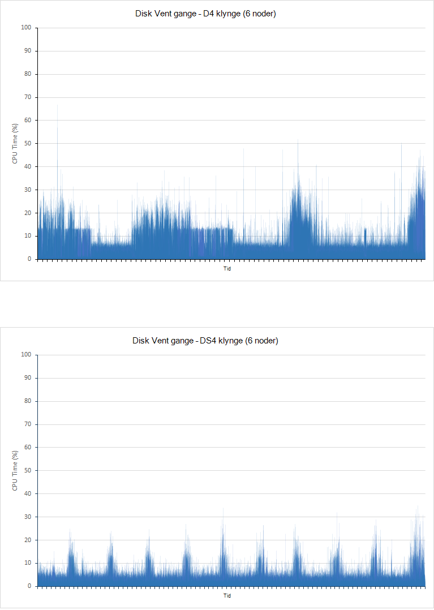

<properties
   pageTitle="Forbedre data sammenlægning og forespørgsel ydeevnen med Elasticsearch på Azure | Microsoft Azure"
   description="En oversigt over overvejelser ved optimering af ydeevne til Elasticsearch forespørgsel og søgning."
   services=""
   documentationCenter="na"
   authors="dragon119"
   manager="bennage"
   editor=""
   tags=""/>

<tags
   ms.service="guidance"
   ms.devlang="na"
   ms.topic="article"
   ms.tgt_pltfrm="na"
   ms.workload="na"
   ms.date="09/22/2016"
   ms.author="masashin"/>
   
# <a name="tuning-data-aggregation-and-query-performance-with-elasticsearch-on-azure"></a>Forbedre data sammenlægning og forespørgsel ydeevnen med Elasticsearch på Azure

[AZURE.INCLUDE [pnp-header](../../includes/guidance-pnp-header-include.md)]

I denne artikel er [en del af en række](guidance-elasticsearch.md). 

Der er en primær årsag til at bruge Elasticsearch til at understøtte søgning gennem data. Brugere skal kunne hurtigt finde de oplysninger, de leder efter. Desuden skal systemet aktivere brugere kan stille spørgsmål til dataene, skal du søge efter korrelationer og kommer til konklusioner, der kan nå forretningsmæssige beslutninger. Denne behandling er det, der adskiller data fra oplysninger.

Dette dokument indeholder en oversigt over indstillinger, som du kan overveje, når afgøre den bedste måde at optimere dit system til forespørgslen, og Søg ydeevne.

Alle ydeevne anbefalinger afhænger i høj grad de scenarier, som gælder for din situation, mængde data, som du indekserer og den rente, hvormed søge programmer og brugere i dine data. Omhyggeligt skal du teste resultaterne af enhver ændring i konfiguration eller indeksering struktur ved hjælp af dine egne data og arbejdsbelastninger for at vurdere fordelene til din specifikke scenarier. Til denne slutningen beskrives i dette dokument også et antal, der blev udført for et bestemt problem, der er implementeret ved hjælp af forskellige konfigurationer. Du kan tilpasse den metode, der er taget til vurdering af ydeevnen for dine egne systemer. Oplysninger om disse test, der er beskrevet i [tillæg](#appendix-the-query-and-aggregation-performance-test).

## <a name="index-and-query-performance-considerations"></a>Indeks og forespørgsel overvejelser

I dette afsnit beskrives nogle almindelige faktorer, du skal overveje, om når design indekserer, har du brug for at understøtte hurtigt forespørgsler og søgning.

### <a name="storing-multiple-types-in-an-index"></a>Gemme flere typer i et indeks

Et Elasticsearch indeks kan indeholde flere typer. Det kan være bedre at undgå denne metode og oprette en separat indeks for hver type. Overvej følgende punkter:

- Forskellige typer kan angive forskellige programmer til analyse, og det er ikke altid Ryd hvilke analyzer Elasticsearch skal bruge, hvis der er udført en forespørgsel på niveauet for indeks i stedet for på niveauet for type. Du kan finde oplysninger i [Undgår Type faktorer](https://www.elastic.co/guide/en/elasticsearch/guide/current/mapping.html#_avoiding_type_gotchas) .

- Shards for indeks, der indeholder flere typer er sandsynligvis større end rettighederne for indeks, der indeholder en enkelt type. Større en shard, flere der kræves af Elasticsearch til at filtrere data når udførelse af forespørgsler.

- Hvis der er en betydeligt uoverensstemmelse mellem datamængder for typerne, kan blive tyndt fordelt oplysninger for én type, på tværs af mange shards reducere effektiviteten af søgninger, der henter disse data.

    

    ***Effekterne ved at dele et indeks mellem typer*** 

    I den øverste del af diagrammet deles det samme indeks af dokumenter af type A og B. type Der er mange flere dokumenter af typen A end type B. søger efter type en er involverer forespørgsler alle fire shards. Den nederste del af diagrammet viser effekten, hvis separat indeks er oprettet for hver type. I dette tilfælde kræver søger efter type en er kun adgang til to shards.

- Lille shards kan være mere jævnt fordelt end store shards, hvilket gør det nemmere for Elasticsearch at udbrede noder afkrydsningsfeltet Indlæs.

- Forskellige typer kan have forskellige perioder. Det kan være svært at arkivere gamle data, der deler shards med aktive data.


Under visse omstændigheder dele et indeks på tværs af datatyper kan dog være effektiv Hvis:

- Søgninger dække regelmæssigt typer opbevares i det samme indeks.

- Typerne kun have et lille antal dokumenter hver. Vedligeholde en separat række shards for hver type kan være en betydeligt omkostninger i dette tilfælde.


### <a name="optimizing-index-types"></a>Optimere indeks typer

Et Elasticsearch indeks indeholder en kopi af de oprindelige JSON-dokumenter, der blev brugt til at udfylde den. Denne oplysningerne i den [* \_kilde*](https://www.elastic.co/guide/en/elasticsearch/reference/current/mapping-source-field.html#mapping-source-field) i hvert indekserede element. Disse data er ikke kan søges efter, men som standard, der returneres af anmodninger om *få* og *søgning* . Men feltet påløber, omkostninger og optager lagerplads, foretage shards større og øge lydstyrken på I/O, der er udført. Du kan deaktivere den * \_kilde* felt på grundlag af hver type:

```http
PUT my_index
{
  "mappings": {
    "my_type": {
      "_source": {
        "enabled": false
      }
    }
  }
}
```
Deaktivere dette felt, fjernes også muligheden for at udføre følgende handlinger:

- Opdatere data i indekset ved hjælp af *opdateret* API.

- Udføre søgninger, der returnerer fremhævede data.

- Indeksere fra ét Elasticsearch indeks direkte til en anden.

- Ændre tilknytninger eller indstillinger for analyse.

- Fejlfinding forespørgsler ved at få vist det oprindelige dokument.


### <a name="reindexing-data"></a>Indeksere data

Antallet af shards, der er tilgængelige for et indeks i sidste ende bestemmer kapaciteten i indekset. Du kan udføre en indledende (og informeret) gæt på hvor mange shards vil blive krævet, men du bør altid overveje dokumentet reindeksere strategi på forhånd. I mange situationer kan indeksere være en tilsigtede opgave som vokser i data. Du kan ikke vil tildele et stort antal shards til et indeks i starten af hensyn til optimering af søgning, men allokere nye shards, som mængden data udvides. I andre tilfælde indeksere muligvis udføres på grundlag af flere ad hoc-, hvis dine overslag om data lydstyrken forøgelse bevise blot være forkerte.

> [AZURE.NOTE] Indeksere kan ikke være nødvendig for data, der alderen hurtigt. I dette tilfælde kan et program oprette et nyt indeks i hver periode. Eksempler medtage ydeevne logfiler eller revidere data, der kan være gemt i et nyt indeks hver dag.

<!-- -->

Oprette et nyt indeks ud fra data i en gamle og derefter fjerne det gamle indeks omfatter indeksere effektivt. Hvis et indeks er stort, denne proces kan tage tid, og du kan være nødvendigt at sikre, at dataene forbliver søgbar i denne periode. Derfor skal du oprette et [alias for hver indeks](https://www.elastic.co/guide/en/elasticsearch/reference/current/indices-aliases.html)og forespørgsler skal hente data via disse aliasser. Mens indeksere, holde det alias, der peger på den gamle indeks, og derefter skifte den for at referere til det nye indeks når indeksere er fuldført. Denne metode er også nyttig til at få adgang til tidsbaserede data, der opretter et nyt indeks hver dag. Bruge et alias, der bevæges hen over det nye indeks, som den er oprettet for at få adgang til aktuelt.

### <a name="managing-mappings"></a>Administrere tilknytninger

Elasticsearch bruger tilknytninger til at finde ud af, hvad der står på de data, der optræder i hvert felt i et dokument. Hver type har sin egen tilknytning, hvilket effektivt definerer et skema for den pågældende type. Elasticsearch bruger disse oplysninger til at generere omvendt indeks for hvert felt i dokumenterne i en type. Hvert felt har datatypen (som *streng*, *dato*eller *lang*) og en værdi i et dokument. Du kan angive tilknytningerne for et indeks, når indekset oprettes, eller de kan udledes ved Elasticsearch, når nye dokumenter er føjet til en type. Imidlertid overveje følgende punkter:

- Tilknytninger genereres dynamisk kan medføre fejl afhængigt af hvordan felter fortolkes, når dokumenter er føjet til et indeks. For eksempel dokument 1 kan indeholde et felt A, der indeholder et tal og årsager Elasticsearch til at tilføje en tilknytning, der angiver, at dette felt er en *lang tid*. Hvis en efterfølgende dokument er tilføjet i hvilket felt A indeholder ikke-numeriske data og derefter kan den ikke. I dette tilfælde skal felt A sandsynligvis har blevet fortolket som en streng når det første dokument er blevet tilføjet. Angive denne tilknytning, når du har oprettet et indeks kan hjælpe med at forhindre disse problemer.

- Designe din dokumenter for at undgå at generere for meget store tilknytninger, som dette kan tilføje betydeligt indirekte, når du udfører søgninger, forbruge masser af hukommelse og også medføre forespørgsler mislykkes til at finde data. Indføre en ensartet navngivningskonvention for felter i dokumenter, som deler den samme type. For eksempel ikke bruge feltnavne som "Fornavn", "Fornavn" og "Fornavn" i forskellige dokumenter. Brug det samme feltnavn i hvert dokument. Desuden forsøg ikke at bruge værdier som nøgler (dette er et almindelige tilgang i kolonne-serien databaser, men kan medføre ineffektiv brug og fejl med Elasticsearch). Du kan finde yderligere oplysninger finder [Tilknytning Cirkeladskillelse](https://www.elastic.co/blog/found-crash-elasticsearch#mapping-explosion).

- Brug *not_analyzed* for at undgå angivet en tokenværdi, hvor det er relevant. Eksempelvis hvis et dokument indeholder en strengfelt med navnet *data* , som indeholder værdien "ABC definition" kan derefter du forsøge at udføre en søgning efter alle dokumenter, der svarer til denne værdi som følger:

  ```http
  GET /myindex/mydata/_search
  {
    "query" : {
      "filtered" : {
        "filter" : {
          "term" : {
            "data" : "ABC-DEF"
          }
        }
      }
    }
  }
  ```

 Denne søgning, men ikke til at returnere de forventede resultater på grund af den måde, hvori strengen ABC definition er tokenized, når den er indekseret. Det opdeles effektivt i to tokens, ABC og definition, ved en bindestreg. Denne funktion er udviklet til at understøtte fulde tekst søgning, men hvis du vil strengen skal fortolkes som et enkelt atomisk element skal du deaktivere angivet en tokenværdi, når dokumentet er blevet tilføjet til indekset. Du kan bruge en tilknytning som dette:

  ```http
  PUT /myindex
  {
    "mappings" : {
      "mydata" : {
        "properties" : {
          "data" : {
            "type" : "string",
            "index" : "not_analyzed"
          }
        }
      }
    }
  }
  ```

  Du kan finde yderligere oplysninger finder [Finde nøjagtige værdier](https://www.elastic.co/guide/en/elasticsearch/guide/current/_finding_exact_values.html#_term_filter_with_text).


### <a name="using-doc-values"></a>Ved hjælp af dokument værdier

Mange forespørgsler og sammenlægninger kræver, at dataene er sorteret som en del af handlingen søgning. Sortering kræver, at knytte et eller flere ord til en liste over dokumenter. For at hjælpe i denne proces, kan Elasticsearch indlæse alle værdier for et felt, der bruges som sorteringsnøgle i hukommelsen. Disse oplysninger er kendt som *fielddata*. Formålet er, at cachelagring fielddata i hukommelsen påløber, mindre I/O og være hurtigere end gentagne gange læser de samme data fra disk. Hvis et felt har kan høj kardinalitet derefter gemme fielddata i hukommelse kan bruge en masse heap mellemrum, muligvis påvirke muligheden for at udføre andre samtidige handlinger eller endda bruge alle lagerplads forårsager Elasticsearch mislykkes.

Som en alternativ metode understøtter Elasticsearch også *dokument værdier*. Værdien dokument ligner et element i hukommelsen fielddata bortset fra at den er gemt på disken og oprettes, når data er gemt i et indeks (fielddata er opbygget dynamisk når der udføres en forespørgsel.) Doc værdier optager ikke heap plads, og så er nyttige, for forespørgsler, sortere eller aggregere data på tværs af felter, der kan indeholde et meget store antal entydige værdier. Desuden kan reduceret Tryk på heap'en, der hjælpe med at forskydning ydeevne forskellene mellem henter data fra disken og læse fra hukommelse. Spildopsamling forventes at optræde mindre ofte, og andre samtidige handlinger, der anvender hukommelse er mindre sandsynligt sker.

Du aktiverer eller deaktiverer dokument værdier på grundlag per egenskab i et indeks ved hjælp af attributten *doc_values* , som vist i følgende eksempel:

```http
PUT /myindex
{
  "mappings" : {
    "mydata" : {
      "properties" : {
        "data" : {
          ...
          "doc_values": true
        }
      }
    }
  }
}
```
> [AZURE.NOTE] Doc værdier er aktiveret som standard med Elasticsearch version 2.0.0 og derefter.

Nøjagtige virkningen af at bruge dokument værdier er sandsynligvis vil være meget specifik til dine egne data og forespørgsel scenarier, så Vær klar til at udføre test af ydeevne for at oprette forbliver anvendelige. Bemærk også, dokument, værdier ikke fungerer med analyserede strengfelter. Du kan finde yderligere oplysninger finder [Dokument værdier](https://www.elastic.co/guide/en/elasticsearch/guide/current/doc-values.html#doc-values).

### <a name="using-replicas-to-reduce-query-contention"></a>Brug af replikaer til at reducere forespørgsel konflikt

En fælles strategi for at øge ydeevnen af forespørgsler er at oprette mange kopier af hvert indeks. Hentning af data, der kan være opfyldt ved henter data fra en replika. Denne strategi kan dog alvorligt påvirke ydeevnen for indtagelse datahandlinger, så det skal bruges sammen med omtanke i scenarier, der involverer blandede arbejdsmængder. Desuden er denne strategi kun af ydelse, hvis replikaer fordeles på tværs af noder og ikke konkurrere for ressourcer med primære shards, der er en del af det samme indeks. Husk, at det er muligt at øge eller mindske antallet af replikaer for et indeks dynamisk.

### <a name="using-the-shard-request-cache"></a>Brug af shard anmodning cachen

Elasticsearch kan gemme de lokale data, der er blevet anmodet af forespørgsler på hver shard i hukommelsen i cachen. Dette gør det muligt for søgninger, der henter de samme data til at køre hurtigere, data kan læses fra hukommelse i stedet for ledig lagerplads. Cachelagre data på denne måde kan derfor forbedre ydeevnen for visse søgehandlinger, bekostning reducere hukommelse til andre opgaver, der udføres samtidig. Der er også risikoen, served data fra cachen er forældet. Dataene i cachen er kun ugyldige, når shard opdateres og dataene er blevet ændret. Hyppigheden for opdaterer er underlagt værdien af indstillingen *refresh_interval* af indekset.

Anmodningen cachelagring af et indeks er deaktiveret som standard, men du kan aktivere den på følgende måde:

```http
PUT /myindex/_settings
{
  "index.requests.cache.enable": true
}
```

Shard anmodning om cachen er mest velegnet til oplysninger, der er relativt statiske som historiske eller logføring data.

### <a name="using-client-nodes"></a>Brug af klienten noder

Alle forespørgsler er behandlet af noden, der først modtager anmodningen. Denne node sender yderligere anmodninger til alle andre noder, der indeholder shards for de indeks, der forespørges, og derefter indsamles resultaterne til at returnere svaret. Hvis en forespørgsel involverer sammenfatning af data eller udføre komplekse beregninger, noden indledende er ansvarlig for at udføre den relevante behandling. Hvis systemet har til at understøtte et lille antal komplekse forespørgsler, kan du overveje at oprette en samling af klienten noder til at afhjælpe afkrydsningsfeltet Indlæs fra noderne data. Omvendt, hvis systemet har til at håndtere et stort antal enkle forespørgsler, derefter sende disse anmodninger direkte til noderne data og bruge en belastningsjustering til at distribuere anmodningerne jævnt.

### <a name="tuning-queries"></a>Justering af forespørgsler

Følgende punkter opsummering tip til optimering af ydeevnen for Elasticsearch forespørgsler:

- Undgå forespørgsler, der involverer jokertegn, når det er muligt.

- Hvis det samme felt underlagt hele teksten søgning og nøjagtige afstemning, derefter skal du gemme dataene til feltet i analyserede og nonanalyzed formularer. Udføre hele teksten søgninger mod feltet analyserede og nøjagtigt match med feltet nonanalyzed.

- Kun returnere dataene, som det er nødvendigt. Hvis du har store dokumenter, men et program kræver kun oplysningerne i et undersæt af felterne, returneres denne undersæt fra forespørgsler i stedet for hele dokumenter. Denne strategi kan reducere kravene til netværksbåndbredde af klyngen.

- Når det er muligt, kan du bruge filtre i stedet for forespørgsler, når du søger efter data. Et filter blot bestemmer, om et dokument opfylder et givet kriterium, mens en forespørgsel også beregner hvor tæt et match et dokument, der er (vundne). Internt, de værdier, der er oprettet af et filter er gemt som en bitmap, der angiver match/Nej, der passer til hvert dokument, og de kan cachelagres af Elasticsearch. Hvis den samme filterkriterium forekommer efterfølgende, kan bitmappen hentet fra cachen og bruges til at hente de tilsvarende dokumenter hurtigt. Du kan finde flere oplysninger [Interne filterhandling](https://www.elastic.co/guide/en/elasticsearch/guide/current/_finding_exact_values.html#_internal_filter_operation).

- Bruge *boolesk* filtre for at udføre statisk sammenligninger, og kun bruge *og*, *eller*og *ikke* filtre for dynamisk beregnede filtre, som dem, der involverer scripting eller *geografisk -\* * filtre.

- Hvis en forespørgsel kombinerer *boolesk* filtre med *og* *eller*, eller *ej* med *geografisk -* * filtre, placer den *og*/*eller*/*ikke geografisk-** filtre sidst, så de fungerer på det mindste mulige datasæt.

    På samme måde, bruge en *post_filter* til at køre dyr filter handlinger. Disse filtre vil blive udført sidst.

- Bruge sammenlægninger i stedet for facetter. Undgå at beregne samlinger, analysere, eller som har mange mulige værdier.

    > **Bemærk**: facetter er blevet fjernet i Elasticsearch version 2.0.0.

- Brug *kardinalitet* sammenlægning frem for *value_count* sammenlægning, medmindre programmet kræver et bestemt antal identiske elementer. Et bestemt antal kan blive hurtigt forældede, og mange programmer kun kræver en begrundet tilnærmelse.

- Undgå at scripting. Scripts i forespørgsler og filtre kan være dyrt og resultaterne ikke er gemt i cachen. Længerevarende scripts kan forbruge Søg tråde på ubestemt tid, forårsager efterfølgende anmodninger om at være i kø. Hvis køen fyldes op, afvises anmodninger om yderligere.

## <a name="testing-and-analyzing-aggregation-and-search-performance"></a>Test og analyse af sammenlægning, og Søg ydeevne

I dette afsnit beskrives resultaterne af en række test, der blev udført mod variabel klynge og indeks konfigurationer. To typer test udførte på følgende måde:

- * *Den *indtagelse og forespørgsel* test **. Denne test i gang med et tomt indeks, der er udfyldt som testen fortsætter ved at udføre flere indsættelser (hver operation tilføjet 1000 dokumenter). På samme tid, er et antal forespørgsler, der er udviklet til at søge efter dokumenter, der er tilføjet i den forløbne 15 minutters periode og generere sammenlægninger gentages med 5 anden intervaller. Denne test blev typisk tilladelse til at køre i 24 timer for at genskabe virkningerne af en udfordring arbejdsbyrde omfatter store data indtagelse med i realtid forespørgsler.

- **Den *forespørgsel kun* teste**. Denne test, der ligner den *indtagelse og forespørgsel* teste bortset fra at delen indtagelse udelades, og indekset på hver node er udfyldt på forhånd med 100 millioner dokumenter. En ændret antal forespørgsler udføres. elementet tid at begrænse dokumenter til dem, der er tilføjet i de sidste 15 minutter er blevet fjernet, som dataene blev nu statisk. Testene, der har kørt i 90 minutter, der er mindre tid, der er behov for at oprette et ydeevne mønster på grund af fast mængden af data.

---

Alle dokumenter i indekset havde det samme skema. I denne tabel indeholder en oversigt over felterne i skemaet:

Navn                          | Type         | Noter |
  ----------------------------- | ------------ | -------------------------------------------------------- |
  Organisation                  | Streng      | Testen genererer 200 entydige organisationer. |
  CustomField1 - CustomField5   |Streng       |Dette er fem strengfelter, som er angivet til en tom streng.|
  DateTimeRecievedUtc           |Tidsstempel    |Den dato og klokkeslæt, hvor dokumentet blev tilføjet.|
  Host                          |Streng       |Dette felt er angivet til en tom streng.|
  HttpMethod                    |Streng       |Dette felt er indstillet til en af følgende værdier: "Skrive", "Hent", "LÆGGE".|
  HttpReferrer                  |Streng       |Dette felt er angivet til en tom streng.|
  HttpRequest                   |Streng       |Dette felt er udfyldt med tilfældige teksten mellem 10 og 200 tegn.|
  HttpUserAgent                 |Streng       |Dette felt er angivet til en tom streng.|
  HttpVersion                   |Streng       |Dette felt er angivet til en tom streng.|
  Organisationsnavn              |Streng       |Dette felt er angivet til samme værdi som feltet organisation.|
  SourceIp                      |IP-ADRESSE           |Feltet indeholder en IP-adresse, der angiver "origin" data. |
   SourceIpAreaCode              |Lang         |Dette felt er angivet til 0.|
  SourceIpAsnNr                 |Streng       |Dette felt er angivet til "AS\#\#\#\#\#".|
  SourceIpBase10                |Lang         |Dette felt er angivet til 500.|
  SourceIpCountryCode           |Streng       |Feltet indeholder et 2-tegns landekoden. |
  SourceIpCity                  |Streng       |Feltet indeholder en streng, der identificerer en by i et land. |
  SourceIpLatitude              |Dobbelt       |Feltet indeholder en vilkårlig værdi.|
  SourceIpLongitude             |Dobbelt       |Feltet indeholder en vilkårlig værdi.|
  SourceIpMetroCode             |Lang         |Dette felt er angivet til 0.|
  SourceIpPostalCode            |Streng       |Dette felt er angivet til en tom streng.|
  SourceLatLong                 |Geografisk punkt   |Dette felt er angivet til et tilfældigt geografisk punkt.|
  SourcePort                    |Streng       |Dette felt er udfyldt med Strengrepræsentationen af et tilfældigt tal.|
  TargetIp                      |IP-ADRESSE           |Dette er udfyldt med en vilkårlig IP-adresse i området 0.0.100.100 til 255.9.100.100.|
  SourcedFrom                   |Streng       |Dette felt er angivet til strengen "MonitoringCollector".|
  TargetPort                    |Streng       |Dette felt er udfyldt med Strengrepræsentationen af et tilfældigt tal.|
  Vurdering af ansøger                        |Streng       |Dette felt er udfyldt med en af 20 forskellige strengværdier markeret tilfældigt.|
  UseHumanReadableDateTimes     |Boolesk værdi      |Dette felt er indstillet til falsk.|
 
Følgende forespørgsler er blevet udført som en gruppe af hver gentagelse af testene. Navne i kursiv bruges til at referere til disse forespørgsler i resten af dette dokument. Bemærk, at tid kriteriet (dokumenter, der er tilføjet i de sidste 15 minutter) er udeladt fra den *forespørgsel kun* test:

- Hvor mange dokumenter med hver *bedømmelse* værdi, der er angivet i de sidste 15 minutter (*antal ved bedømmelse*)? 

- Hvor mange dokumenter er blevet tilføjet i hvert 5 minutters interval i de sidste 15 minutter (*antal over tid*)?

- Hvor mange dokumenter af hver *vurdering* værdi er blevet føjet for hvert land i de sidste 15 minutter (*Besøg efter land*)?

- Hvilke 15 organisationer udført de fleste ofte i dokumenter, der er tilføjet i de sidste 15 minutter (*toppen 15 organisationer*)?

- Hvor mange forskellige organisationer udført i dokumenter, der er tilføjet i de sidste 15 minutter (*entydige Tæl organisationer*)?

- Hvor mange dokumenter, der er tilføjet i de sidste 15 minutter (*samlede antal forekomster Tæl*)?

- Hvor mange forskellige *SourceIp* værdier forekommer i dokumenter, der er tilføjet i de sidste 15 minutter (*entydige IP Tæl*)?


Definitionen af indekset og oplysninger om forespørgslerne, der er beskrevet i [tillæg](#appendix-the-query-and-aggregation-performance-test).

Testene, der blev udviklet til at forstå virkningerne af følgende variabler:

- **Disken type**. Test, der er udført på en 6-node klynge af D4 FOS ved hjælp af standard-lager (harddiske) og gentages på en 6-node klynge af DS4 FOS ved hjælp af premium lagerplads (SSDs).

- **Maskine størrelse - skalering**. Test, der er udført på en 6-node klynge bestående af DS3 FOS (angivet som den *lille* klynge), gentages på en klynge af DS4 FOS ( *medium* klynge) og gentages igen på en klynge af DS14 computere (den *store* klynge). Den følgende tabel opsummerer de vigtigste karakteristika for hver VM SKU:

 Klynge | VM SKU        | Antallet af kerner | Antallet af datadisce | RAM (GB) |
---------|---------------|-----------------|----------------------|----------|
 Lille   | Standard DS3  | 4               | 8                    | 14       |
 Mediet  | Standard DS4  | 8               | 16                   | 28       |
 Store   | Standard DS14 | 16              | 32                   | 112      |

- **Klyngestørrelse - skalering af**. Test, der er udført på klynger af DS14 FOS med 1, 3 og 6 noder.

- **Antallet af indeks replikaer**. Test, der er blevet udført ved brug af indeks, der er konfigureret med 1 og 2 replikaer.

- **Doc værdier**. Oprindeligt blev testene, der udføres med indekset konfiguration *doc_values* indstillet til *Sand* (standardværdien). Valgte test er blevet gentaget med *doc_values* indstillet til *Falsk*.

- **Cachelagring**. Tests blev udført med shard anmodning cachen aktiveret på indekset.

- **Antallet af shards**. Test blev gentages med varierende antal shards for at fastlægge, om forespørgsler mere effektivt stødte på tværs af indeks, der indeholder færre, større shards eller flere, mindre shards.


## <a name="performance-results---disk-type"></a>Resultater - disk type

Disken ydeevne blev evalueret ved at køre en *indtagelse og forespørgsel* test, 6-node klynge af D4 FOS (ved hjælp af harddiske), og af 6-node klynge af DS4 FOS (ved hjælp af SSDs). Konfiguration af Elasticsearch i begge klynger er den samme. Dataene blev udbrede 16 diske på hver node og hver node indeholder 14GB RAM, der er allokeret til Java virtual machine (JVM) kører Elasticsearch, den resterende hukommelse (også 14GB) blev skrevet til operativsystem brug. Hver test kørte til 24 timer. I denne periode er markeret for at aktivere effekterne i den stigende mængde data bliver synlige og for at tillade systemet stabiliseres. Tabellen nedenfor opsummerer de resultater, fremhævning svar tidspunkter for de forskellige handlinger, der består testen.

 Klynge | Handlingen/forespørgsel            | Gennemsnitlig svartid (ms) |
---------|----------------------------|----------------------------|
 D4      | Indtagelse                  | 978                        |
         | Tæl i vurdering af ansøger            | 103                        |
         | Tæl Over tid            | 134                        |
         | Besøg efter land            | 199                        |
         | Toppen 15 organisationer       | 137                        |
         | Entydige Tæl organisationer | 139                        |
         | Tælle entydige IP-adresse            | 510                        |
         | Besøg i alt Tæl           | 89                         |
 DS4     | Indtagelse                  | 511                        |
         | Tæl i vurdering af ansøger            | 187                        |
         | Tæl Over tid            | 411                        |
         | Besøg efter land            | 402                        |
         | Toppen 15 organisationer       | 307                        |
         | Entydige Tæl organisationer | 320                        |
         | Tælle entydige IP-adresse            | 841                        |
         | Besøg i alt Tæl           | 236                        |

Ved første øjekast synes, at DS4 klynge udføres forespørgsler mindre hul end D4 klynge, nogle gange fordoble (eller dårligere), feltet svartid. Dette kan ikke se hele historien via. Den næste tabel viser antallet af indtagelse operationer i hver klynge (Husk, at hver operation indlæser 1000 dokumenter):

 Klynge | Indtagelse handlingen Tæl |
---------|---------------------------|
 D4      | 264769                    |
 DS4     | 503157                    |

DS4 klynge kunne indlæse næsten dobbelt så mange data end D4 klynge under testen. Derfor analyse svar tidspunkter for hver handling, skal du også overveje, hvor mange dokumenter hver forespørgsel har at scanne, og hvor mange dokumenter, returneres. Disse er dynamisk figurer, som mængde dokumenter i indekset kontinuerligt vokser. Du kan ikke blot dividere 503137 ved 264769 (antal indtagelse operationer i hver klynge) og derefter gange resultatet med den gennemsnitlige svartid for hver forespørgsel, der er udført af D4 klynge til at give en sammenligning oplysninger, som dette ignorerer mængden I/O udføres samtidig ved handlingen indtagelse. I stedet skal du måle den fysiske mængde data, der skrives til og læse fra disken, som en test skrider frem. Testplan JMeter registrerer disse oplysninger for hver enkelt node. De opsummerede resultater er:

 Klynge | Gennemsnitlig byte skrevet/læst ved hver handling |
---------|----------------------------------------------|
 D4      | 13471557                                     |
 DS4     | 24643470                                     |

Disse data viser, at DS4 klynge var i stand til at opretholde et i/o-rente cirka 1,8 gange, D4 klynge. Da, bortset fra art diskene, er alle andre ressourcer på samme måde, at forskellen skal være på grund af ved hjælp af SSDs hellere harddiske.

For at justere denne konklusion, følgende grafer viser, hvordan I/O blev udført over tid ved hver klynge:


<!-- -->

***Aktivitet på disken til D4 og DS4 klynger***

Grafen for D4 klynge viser betydeligt variation, især under først halvdel af testen. Det var sandsynligvis på grund af (throttling) for at reducere i/o-rente. I de indledende faser af testen er forespørgslerne, der kan køre hurtigt, når der er lille data til at analysere. Diskene i D4 klynge sandsynligvis derfor anses for at fungere tæt på deres input/output-handlinger i anden (IOP'ER) kapacitet, selvom hver/o-handlingen ikke kan returnere meget data. DS4 klynge er i stand til at understøtte en højere IOP'ER hastighed og ikke lide samme graden af (throttling), er mere almindelig i/o-satser. For at understøtte denne teorien kan vise det næste par af grafer hvordan CPU'EN blev blokeret af disk I/O over tid (disken Vent ofte vises i graferne er del af den tid, CPU'EN bruges vente på I/O):



***CPU disk i/o-vente sluttidspunkter for D4 og DS4 klynger***

Det er vigtigt at forstå, at der er to primært årsager til, i/o-handlinger til at blokere CPU'EN:

- I/o-undersystem kunne læse eller skrive data til eller fra disken.

- I/o-undersystem kan være begrænset af host-miljø. Azure implementeret ved hjælp af harddiske har en maksimale overførselshastighed af 500 IOP'ER og SSDs har en maksimale overførselshastighed på 5000 IOP'ER.


For klynge D4 mængden af tid brugt vente på I/O i første halvdel af test svarer tæt på en omvendt måde med det diagram, der viser i/o-kurser. Perioder på lav I/O svarer til perioder betydeligt CPU'EN tilbringer blokerede, angiver, at I/O er der begrænset. Når flere data er føjet til klyngen situation ændringerne, og i anden halvdel af test spidser i i/o-Vent gange svarer med spidser i i/o-overførselshastighed. På dette tidspunkt er CPU'EN blokeret under udførelse af reelle I/O. Med klynge DS4 er den tid, der venter på I/O igen, lige meget mere. Hver spidsbelastning svarer til en tilsvarende top i i/o-ydeevne i stedet for en trough, det betyder, at der er meget lidt eller ingen variere den benyttede virkelighed.

Der er et andet element, du bør overveje. Under testen genererede D4 klynge 10584 indtagelse fejl og 21 forespørgsel fejl. Test på DS4 klynge produceret ingen fejl.

## <a name="performance-results---scaling-up"></a>Resultater - skalering

Skalere op test blev gennemført ved at køre test mod 6-node klynger af DS3, DS4 og DS14 FOS. Disse Lagerenheder er markeret, fordi en DS4 VM indeholder dobbelt så mange CPU kerner og hukommelse som en DS3, og en DS14 maskine Double er CPU-ressourcer igen samtidig med at fire gange mængden hukommelse. Tabellen nedenfor sammenligner de vigtigste aspekter af hver SKU:

 SKU  | \#CPU-kerner | Hukommelse (GB) | Maks disk IOP'ER | Maks båndbredde (MB/s)|
------|-------------|-------------|---------------|--------------|
 DS3  | 4           | 14          | 12,800| 128 |
 DS4  | 8           | 28          | 25,600| 256 |
 DS14 | 16          | 112         | 50000| 512 |

Den følgende tabel opsummerer resultaterne af kørsel af tester små (DS3), medium (DS4) og store (DS14) klynger. Hver VM bruges SSDs til at holde dataene. Hver test kørte til 24 timer.

Tabellen rapporter antallet af vellykket anmodninger om forskellige forespørgselstyper (mislykkede forsøg ikke er inkluderet). Antallet af anmodninger om forsøgte for hver type forespørgsel er stort set det samme under en af testen. Dette skyldes, at testplan JMeter udfører en enkelt forekomst af hver forespørgsel (antal ved vurdering, antal Over tid, besøg efter land, toppen 15 organisationer, entydige Tæl organisationer, entydige IP-antal og samlet antal forekomster af Kim) sammen i én enkelt enhed, kaldet en *test transaktion* (denne post er uafhængigt af den opgave, som udfører handlingen indtagelse, som køres af en separat tråd). Hver gentagelse af testplanen udfører en enkelt test transaktion. Antallet af testtransaktioner blev fuldført er derfor et mål for svartid på den lavest forespørgsel i hver transaktion.

| Klynge      | Handlingen/forespørgsel            | Antallet af anmodninger | Gennemsnitlig svartid (ms) |
|--------------|----------------------------|--------------------|----------------------------|
| Små (DS3)  | Indtagelse                  | 207284             | 3328                       |
|              | Tæl i vurdering af ansøger            | 18444              | 268                        |
|              | Tæl Over tid            | 18444              | 340                        |
|              | Besøg efter land            | 18445              | 404                        |
|              | Toppen 15 organisationer       | 18439              | 323                        |
|              | Entydige Tæl organisationer | 18437              | 338                        |
|              | Tælle entydige IP-adresse            | 18442              | 468                        |
|              | Besøg i alt Tæl           | 18428              | 294   
|||||
| Mediet (DS4) | Indtagelse                  | 503157             | 511                        |
|              | Tæl i vurdering af ansøger            | 6958               | 187                        |
|              | Tæl Over tid            | 6958               | 411                        |
|              | Besøg efter land            | 6958               | 402                        |
|              | Toppen 15 organisationer       | 6958               | 307                        |
|              | Entydige Tæl organisationer | 6956               | 320                        |
|              | Tælle entydige IP-adresse            | 6955               | 841                        |
|              | Besøg i alt Tæl           | 6958               | 236                        |
|||||
| Store (DS14) | Indtagelse                  | 502714             | 511                        |
|              | Tæl i vurdering af ansøger            | 7041               | 201                        |
|              | Tæl Over tid            | 7040               | 298                        |
|              | Besøg efter land            | 7039               | 363                        |
|              | Toppen 15 organisationer       | 7038               | 244                        |
|              | Entydige Tæl organisationer | 7037               | 283                        |
|              | Tælle entydige IP-adresse            | 7037               | 681                        |
|              | Besøg i alt Tæl           | 7038               | 200                        |

Disse figurer viser, til denne test ydeevnen for DS4 og DS14 klynge er praktisk lignende. Svar tidspunkter for forespørgslerne for DS3 klynge vises også sammenligne positivt først, og antallet af forespørgsel handlinger, der udføres er langt ud over værdierne for DS4 og DS14 klyngen. En bør også tage stærke varsling om indtagelse rente og den deraf følgende antal dokumenter, der søges. I DS3 klynge indtagelse langt mere er begrænset, og databasen indeholdt kun omkring 40% af de dokumenter, kan du læse i ved hver af de andre to klynger ved slutningen af testen. Dette er kan være på grund af behandling af ressource-, Netværks- og disk båndbredde til en DS3 VM sammenlignet med en DS4 eller DS14 VM. Da der en DS4 VM har dobbelt så mange ressourcer, der er tilgængelige som en DS3 VM, og en DS14 har to gange (fire gange for hukommelse) ressourcer af en DS4 VM, forbliver ét spørgsmål: Hvorfor er forskellen på indtagelse satser DS4 og DS14 klynger betydeligt mindre end, der opstår mellem DS3 og DS4 klynger? Det kan være på grund af udnyttelse af netværk og båndbredde begrænsninger af Azure FOS. De nedenstående grafer Vis disse data til alle tre klynger:


**Udnyttelse af netværk for DS3, DS4 og DS14 klynger udføre testen indtagelse og forespørgsel** 

<!-- -->

Begrænsningerne netværksbåndbredde med Azure FOS udgives ikke og kan variere, men at hjemmenetværk aktivitet tilsyneladende har plan på et gennemsnit af omkring 2.75GBps for begge DS4 og DS14 test foreslår, at sådan grænse er nået og er blevet den primære faktor i begrænse overførselshastighed. I forbindelse med klynge DS3 var aktiviteten på netværket, er væsentligt lavere, så den nederste ydeevne er mere sandsynligvis på grund af begrænsninger i tilgængeligheden af andre ressourcer.

For at isolere virkningerne af handlingerne indtagelse og viser, hvordan forespørgselsydelse varierer som noder skalere op, blev et sæt af forespørgsel kun test udført ved hjælp af de samme noder. Den følgende tabel opsummerer de resultater, der fås på hver klynge:

> [AZURE.NOTE] Du skal ikke sammenligner den ydeevne og antallet af anmodninger, der er udført af forespørgsler i den *forespørgsel kun* test med de køre ved *indtagelse og forespørgsel* testen. Dette skyldes, at forespørgslerne, der er blevet ændret og lydstyrken af de pågældende dokumenter er anderledes.

| Klynge      | Handlingen/forespørgsel            | Antallet af anmodninger | Beregne gennemsnittet af svar Ttme (ms) |
|--------------|----------------------------|--------------------|----------------------------|
| Små (DS3)  | Tæl i vurdering af ansøger            | 464                | 11758                      |
|              | Tæl Over tid            | 464                | 14699                      |
|              | Besøg efter land            | 463                | 14075                      |
|              | Toppen 15 organisationer       | 464                | 11856                      |
|              | Entydige Tæl organisationer | 462                | 12314                      |
|              | Tælle entydige IP-adresse            | 461                | 19898                      |
|              | Besøg i alt Tæl           | 462                | 8882  
|||||
| Mediet (DS4) | Tæl i vurdering af ansøger            | 1045               | 4489                       |
|              | Tæl Over tid            | 1045               | 7292                       |
|              | Besøg efter land            | 1053               | 7564                       |
|              | Toppen 15 organisationer       | 1055               | 5066                       |
|              | Entydige Tæl organisationer | 1051               | 5231                       |
|              | Tælle entydige IP-adresse            | 1051               | 9228                       |
|              | Besøg i alt Tæl           | 1051               | 2180                       |
|||||
| Store (DS14) | Tæl i vurdering af ansøger            | 1842               | 1927                       |
|              | Tæl Over tid            | 1839               | 4483                       |
|              | Besøg efter land            | 1838               | 4761                       |
|              | Toppen 15 organisationer       | 1842               | 2117                       |
|              | Entydige Tæl organisationer | 1837               | 2393                       |
|              | Tælle entydige IP-adresse            | 1837               | 7159                       |
|              | Besøg i alt Tæl           | 1837               | 642                        |

Dette klokkeslæt tendenser i de gennemsnitlige svar gange på tværs af de forskellige klynger er mere klart. Udnyttelse af netværk er godt under 2.75GBps kræves tidligere, før de DS4 og DS14 klynger (som sandsynligvis mættet netværk i de indtagelse og forespørgsel undersøgelser), og 1.5GBps for DS3 klynge. Det er faktisk tættere på 200MBps i alle tilfælde, som vist ved de grafer nedenfor:


***Netværk anvendelsen for DS3, DS4 og DS14 klynger udføre en forespørgsel kun test*** 

Begrænse faktor i DS3 og DS4 klynger vises nu være CPU-forbrug, som er tæt på 100% for meget af tid. I DS14 gennemsnit klynge CPU'EN brugen lige over 80%. Dette er stadig høj, men klart fremhæver fordelene ved har flere CPU kerner tilgængelige. Følgende billede viser CPU brugsmønstre for DS3, DS4 og DS14 klynger.


***CPU-forbrug for DS3 og DS14 klynger udføre en forespørgsel kun test*** 

## <a name="performance-results---scaling-out"></a>Resultater - skalering af

For at illustrere, hvordan systemet skaleres med antallet af knuder, køres test ved hjælp af DS14 klynger med 1, 3 og 6 noder. Nuværende tidspunkt kun den *forespørgsel kun* test blev udført, ved hjælp af 100 millioner dokumenter og køre til 90 minutter:

| Klynge | Handlingen/forespørgsel            | Antallet af anmodninger | Gennemsnitlig svartid (ms) |
|---------|----------------------------|--------------------|----------------------------|
| 1 node  | Tæl i vurdering af ansøger            | 288                | 6216                       |
|         | Tæl Over tid            | 288                | 28933                      |
|         | Besøg efter land            | 288                | 29455                      |
|         | Toppen 15 organisationer       | 288                | 9058                       |
|         | Entydige Tæl organisationer | 287                | 19916                      |
|         | Tælle entydige IP-adresse            | 284                | 54203                      |
|         | Besøg i alt Tæl           | 287                | 3333                       |
|||||
| 3 noder | Tæl i vurdering af ansøger            | 1194               | 3427                       |
|         | Tæl Over tid            | 1194               | 5381                       |
|         | Besøg efter land            | 1191               | 6840                       |
|         | Toppen 15 organisationer       | 1196               | 3819                       |
|         | Entydige Tæl organisationer | 1190               | 2938                       |
|         | Tælle entydige IP-adresse            | 1189               | 12516                      |
|         | Besøg i alt Tæl           | 1191               | 1272                       |
|||||
| 6 noder | Tæl i vurdering af ansøger            | 1842               | 1927                       |
|         | Tæl Over tid            | 1839               | 4483                       |
|         | Besøg efter land            | 1838               | 4761                       |
|         | Toppen 15 organisationer       | 1842               | 2117                       |
|         | Entydige Tæl organisationer | 1837               | 2393                       |
|         | Tælle entydige IP-adresse            | 1837               | 7159                       |
|         | Besøg i alt Tæl           | 1837               | 642                        |

Antallet af knuder gør en betydeligt forskel i forespørgselsydelse af klynge, selvom på en ikke-lineære måde. Klynge 3 noder fuldfører ca. 4 gange så mange forespørgsler som klynge enkelt node, mens klynge 6 noder håndterer 6 gange som mange. For at hjælpe med at forklare denne nonlinearity, vises følgende grafer hvordan CPU'EN blev der bruges af de tre klynger:


***CPU-forbrug for 1, 3 og 6-node klynger udføre en forespørgsel kun test***

Enkelt node og 3-node klynger er CPU-bundet, mens selvom CPU-forbrug er høj i 6-node klynge der er ekstra behandling kapacitet. Andre faktorer er i dette tilfælde kunne være at begrænse overførselshastigheden. Dette kan bekræftes ved at teste med 9 og 12 noderne, og vil sandsynligvis vises yderligere ekstra behandling kapacitet.

Dataene i tabellen ovenfor viser også, hvordan de gennemsnitlige svartider for forespørgsler variere. Dette er det element, der er mest informative, når du tester, hvordan et system skaleres til bestemte typer af forespørgsel. Nogle søgninger er klart langt mere effektivt, når der strækker sig over flere noder end andre. Det kan være på grund af forholdet mellem antallet af knuder og antallet af dokumenter i klynge stigende, hver klynge indeholdt 100 millioner dokumenter. Når du udfører søgninger, der involverer sammenfatning af data, behandler Elasticsearch og dataene hentet som en del af processen sammenlægning i hukommelsen på hver node. Hvis der er flere noder, er der færre data til at hente bufferen, og behandle på hver node.

## <a name="performance-results---number-of-replicas"></a>Resultater - antal replikaer

De *indtagelse og forespørgsel* undersøgelser blev kører i forhold til et indeks med et enkelt replika. Testene, der blev gentages på 6-node DS4 og DS14 klynger ved hjælp af et indeks, der er konfigureret med to replikaer. Alle test kørte til 24 timer. Tabellen nedenfor viser sammenligning resultaterne for et og to kopier:

| Klynge | Handlingen/forespørgsel            | Gennemsnitlig svartid (ms) - 1 replika | Gennemsnitlig svartid (ms) - 2 replikaer | % forskellig i svartid |
|---------|----------------------------|----------------------------------------|-----------------------------------------|-------------------------------|
| DS4     | Indtagelse                  | 511                                    | 655                                     | + 28%                          |
|         | Tæl i vurdering af ansøger            | 187                                    | 168                                     | -10%                          |
|         | Tæl Over tid            | 411                                    | 309                                     | -25%                          |
|         | Besøg efter land            | 402                                    | 562                                     | + 40%                          |
|         | Toppen 15 organisationer       | 307                                    | 366                                     | + 19%                          |
|         | Entydige Tæl organisationer | 320                                    | 378                                     | + 18%                          |
|         | Tælle entydige IP-adresse            | 841                                    | 987                                     | + 17%                          |
|         | Besøg i alt Tæl           | 236                                    | 236                                     | + 0%                           |
||||||
| DS14    | Indtagelse                  | 511                                    | 618                                     | + 21%                          |
|         | Tæl i vurdering af ansøger            | 201                                    | 275                                     | + 37%                          |
|         | Tæl Over tid            | 298                                    | 466                                     | + 56%                          |
|         | Besøg efter land            | 363                                    | 529                                     | + 46%                          |
|         | Toppen 15 organisationer       | 244                                    | 407                                     | + 67%                          |
|         | Entydige Tæl organisationer | 283                                    | 403                                     | + 42%                          |
|         | Tælle entydige IP-adresse            | 681                                    | 823                                     | + 21%                          |
|         | Besøg i alt Tæl           | 200                                    | 221                                     | + 11%                          |

Indtagelse rente reduceret som antallet af replikaer øget. Dette bør forventes som Elasticsearch skriver flere kopier af hvert dokument, opretter ekstra disk I/O.  Dette afspejles ved grafer for DS14 klynge til indeks med 1 og 2 replikaer, der er vist i billedet nedenfor. Hvis det er indekset med 1 replika blev den gennemsnitlige i/o-overførselshastighed 16896573 byte/sekund. For indekset med 2 replikaer blev den gennemsnitlige i/o-sats 33986843 byte/sekund, lige over to gange som mange.


***Disk I/O satser for noder med 1 og 2 replikaer udføre testen indtagelse og forespørgsel***

| Klynge | Forespørgsel                      | Gennemsnitlig svartid (ms) - 1 replika | Gennemsnitlig svartid (ms) - 2 replikaer |
|---------|----------------------------|----------------------------------------|-----------------------------------------|
| DS4     | Tæl i vurdering af ansøger            | 4489                                   | 4079                                    |
|         | Tæl Over tid            | 7292                                   | 6697                                    |
|         | Besøg efter land            | 7564                                   | 7173                                    |
|         | Toppen 15 organisationer       | 5066                                   | 4650                                    |
|         | Entydige Tæl organisationer | 5231                                   | 4691                                    |
|         | Tælle entydige IP-adresse            | 9228                                   | 8752                                    |
|         | Besøg i alt Tæl           | 2180                                   | 1909                                    |
|||||
| DS14    | Tæl i vurdering af ansøger            | 1927                                   | 2330                                    |
|         | Tæl Over tid            | 4483                                   | 4381                                    |
|         | Besøg efter land            | 4761                                   | 5341                                    |
|         | Toppen 15 organisationer       | 2117                                   | 2560                                    |
|         | Entydige Tæl organisationer | 2393                                   | 2546                                    |
|         | Tælle entydige IP-adresse            | 7159                                   | 7048                                    |
|         | Besøg i alt Tæl           | 642                                    | 708                                     |

Disse resultaterne viser en forbedring i gennemsnitlig svartid for DS4 klynge, men et større for DS14 klynge. Til at fortolke disse resultater, skal du også overveje antallet forespørgsler, der er udført af hver test:

| Klynge | Forespørgsel                      | Udført - tal 1 replika | Udført - tal 2 replikaer |
|---------|----------------------------|------------------------------|-------------------------------|
| DS4     | Tæl i vurdering af ansøger            | 1054                         | 1141                          |
|         | Tæl Over tid            | 1054                         | 1139                          |
|         | Besøg efter land            | 1053                         | 1138                          |
|         | Toppen 15 organisationer       | 1055                         | 1141                          |
|         | Entydige Tæl organisationer | 1051                         | 1136                          |
|         | Tælle entydige IP-adresse            | 1051                         | 1135                          |
|         | Besøg i alt Tæl           | 1051                         | 1136                          |
|||||
| DS14    | Tæl i vurdering af ansøger            | 1842                         | 1718                          |
|         | Tæl Over tid            | 1839                         | 1716                          |
|         | Besøg efter land            | 1838                         | 1714                          |
|         | Toppen 15 organisationer       | 1842                         | 1718                          |
|         | Entydige Tæl organisationer | 1837                         | 1712                          |
|         | Tælle entydige IP-adresse            | 1837                         | 1712                          |
|         | Besøg i alt Tæl           | 1837                         | 1712                          |

Disse data viser, øges antallet af forespørgsler, der er udført af DS4 klynge på linje med faldet i gennemsnitlig svartid, men igen på omvendte er sandt om DS14 klynge. En betydeligt faktor er, at CPU-forbrug for DS4 klynge i de gengivne 1 og 2 gengivne undersøgelser blev ujævnt spredes. Nogle noder medfører tæt forbrug på 100%, mens andre havde ekstra behandling kapacitet. Forbedring af ydeevne sandsynligvis på grund af øget muligheden for at distribuere behandling på tværs af noderne i klyngen. Følgende billede viser variationen i CPU behandling mellem de mest let og stærkt anvendte FOS (noder 4 og 3):


***CPU-forbrug for mindst bruges og er mest anvendte noderne i den DS4 klynge udføre en forespørgsel kun test***

For DS14 klynge var det ikke sag. CPU-forbrug for begge metoder var lavere på tværs af alle noder, og tilgængeligheden af en anden replika blev mindre af en fordel og meget mere af en omkostninger:


***CPU-forbrug for mindst bruges og er mest anvendte noderne i den DS14 klynge udføre en forespørgsel kun test***

Disse resultaterne viser at skulle benchmark systemet grundigt, når du beslutter, om du vil bruge flere replikaer. Du skal altid have mindst én kopi af hvert indeks (medmindre du er villig til at risikerer at miste data, hvis en node mislykkes), men yderligere replikaer kan angive en belastning på systemet til ingen fordel, afhængigt af din arbejdsmængder og de tilgængelige til klyngen hardwareressourcer.

## <a name="performance-results---doc-values"></a>Resultater - dokument værdier

*Indtagelse og forespørgsel* tests blev udført med dokument værdier aktiveret, forårsager Elasticsearch til at gemme data, der bruges til at sortere felter på disken. Testene, der er blevet gentaget med dokument-værdier, der er deaktiveret, så Elasticsearch opbygget fielddata dynamisk og cachelagret i hukommelsen. Alle test kørte til 24 timer. Tabellen nedenfor sammenligner svartiderne for test, der kører i forhold til klynger af 6 knuder, der er oprettet ved hjælp af D4, DS4 og DS14 FOS (D4 klynge bruger normalt harddiske, mens DS4 og DS14 klynger bruger SSDs).

| Klynge | Handlingen/forespørgsel            | Gennemsnitlig svartid (ms) - dokument værdier, der er aktiveret | Gennemsnitlig svartid (ms) - dokument værdier, der er deaktiveret | % forskellig i svartid |
|---------|----------------------------|-------------------------------------------------|--------------------------------------------------|-------------------------------|
| D4      | Indtagelse                  | 978                                             | 835                                              | -15%                          |
|         | Tæl i vurdering af ansøger            | 103                                             | 132                                              | + 28%                          |
|         | Tæl Over tid            | 134                                             | 189                                              | + 41%                          |
|         | Besøg efter land            | 199                                             | 259                                              | + 30%                          |
|         | Toppen 15 organisationer       | 137                                             | 184                                              | + 34%                          |
|         | Entydige Tæl organisationer | 139                                             | 197                                              | + 42%                          |
|         | Tælle entydige IP-adresse            | 510                                             | 604                                              | + 18%                          |
|         | Besøg i alt Tæl           | 89                                              | 134                                              | + 51%                          |
||||||
| DS4     | Indtagelse                  | 511                                             | 581                                              | + 14%                          |
|         | Tæl i vurdering af ansøger            | 187                                             | 190                                              | + 2%                           |
|         | Tæl Over tid            | 411                                             | 409                                              | -0.5%                         |
|         | Besøg efter land            | 402                                             | 414                                              | + 3%                           |
|         | Toppen 15 organisationer       | 307                                             | 284                                              | -7%                           |
|         | Entydige Tæl organisationer | 320                                             | 313                                              | -% af 2                           |
|         | Tælle entydige IP-adresse            | 841                                             | 955                                              | + 14%                          |
|         | Besøg i alt Tæl           | 236                                             | 281                                              | + 19%                          |
||||||
| DS14    | Indtagelse                  | 511                                             | 571                                              | + 12%                          |
|         | Tæl i vurdering af ansøger            | 201                                             | 232                                              | + 15%                          |
|         | Tæl Over tid            | 298                                             | 341                                              | + 14%                          |
|         | Besøg efter land            | 363                                             | 457                                              | + 26%                          |
|         | Toppen 15 organisationer       | 244                                             | 338                                              | + 39%                          |
|         | Entydige Tæl organisationer | 283                                             | 350                                              | + 24%                          |
|         | Tælle entydige IP-adresse            | 681                                             | 909                                              | + 33%                          |
|         | Besøg i alt Tæl           | 200                                             | 245                                              | + 23%                          |

Den næste tabel sammenligner tallet indtagelse handlinger, der er udført af testene:

| Klynge | Indtagelse handlingen Tæl - dokument værdier, der er aktiveret | Indtagelse handlingen Tæl - dokument værdier deaktiveret | % forskellig i \number indtagelse handlinger |
|---------|----------------------------------------------|-----------------------------------------------|-----------------------------------------|
| D4      | 264769                                       | 408690                                        | + 54%                                    |
| DS4     | 503137                                       | 578237                                        | + 15%                                    |
| DS14    | 502714                                       | 586472                                        | + 17%                                    |

Forbedret indtagelse satser opstå i forbindelse med dokument-værdier, der er deaktiveret, da der skrives færre data til disken som dokumenter er indsat. Forbedret ydeevne er især chatanmodning D4 VM ved hjælp af harddiske til at gemme data. I dette tilfælde svartid for indtagelse handlinger også reduceret med 15% (se den første tabel i dette afsnit). Dette kan på grund af nedsat trykket på harddiske der var sandsynligvis løbende tæt på deres IOP'ER begrænsninger i testen med dokument værdier, der er aktiveret, se Disk Type testen kan finde flere oplysninger. Følgende graf sammenligner D4 FOS i/o-ydeevne med dokument værdier aktiveret (værdier på disk), og dokument værdier deaktiveret (værdier i hukommelse):


***Aktivitet på disken for D4 klynge med dokument værdier aktiveres og deaktiveres***

I modsætning vise indtagelse værdierne for FOS ved hjælp af SSDs en lille stigning i antallet af dokumenter, men også en stigning i feltet Svartid indtagelse-handlinger. Forespørgsel svar gange blev også dårligere med ét eller to små undtagelser. SSDs er mindre sandsynlige skal du køre tæt på deres IOP'ER grænser med dokument-værdier, der er aktiveret, så ændringer i ydeevne er mere sandsynligt skyldes øget behandling aktivitet og spild af administration af JVM heap. Dette er klart ved at sammenligne CPU-forbrug med dokument værdier aktiveres og deaktiveres. Næste grafen fremhæver disse data til DS4 klynge, hvor de fleste af CPU-forbrug flytter fra 30-40% band med dokument-værdier, der er aktiveret, at 40-50% båndet med dokument-værdier, der er deaktiveret (DS14 klynge viste en lignende tendens):


***CPU-forbrug for DS4 klynge med dokument værdier aktiveres og deaktiveres***

For at skelne virkningen af dokument værdier på forespørgselsydelse af data indtagelse, udførte par af forespørgsel kun test for DS4 og DS14 klynger med dokument værdier aktiveres og deaktiveres. Tabellen nedenfor opsummerer resultaterne af disse test:

| Klynge | Handlingen/forespørgsel            | Gennemsnitlig svartid (ms) - dokument værdier, der er aktiveret | Gennemsnitlig svartid (ms) - dokument værdier, der er deaktiveret | % forskellig i svartid |
|---------|----------------------------|-------------------------------------------------|--------------------------------------------------|-------------------------------|
| DS4     | Tæl i vurdering af ansøger            | 4489                                            | 3736                                             | -16%                          |
|         | Tæl Over tid            | 7293                                            | 5459                                             | -25%                          |
|         | Besøg efter land            | 7564                                            | 5930                                             | -22%                          |
|         | Toppen 15 organisationer       | 5066                                            | 3874                                             | -14%                          |
|         | Entydige Tæl organisationer | 5231                                            | 4483                                             | -% af 2                           |
|         | Tælle entydige IP-adresse            | 9228                                            | 9474                                             | + 3%                           |
|         | Besøg i alt Tæl           | 2180                                            | 1218                                             | -44%                          |
||||||
| DS14    | Tæl i vurdering af ansøger            | 1927                                            | 2144                                             | + 11%                          |
|         | Tæl Over tid            | 4483                                            | 4337                                             | -3%                           |
|         | Besøg efter land            | 4761                                            | 4840                                             | + 2%                           |
|         | Toppen 15 organisationer       | 2117                                            | 2302                                             | + 9%                           |
|         | Entydige Tæl organisationer | 2393                                            | 2497                                             | + 4%                           |
|         | Tælle entydige IP-adresse            | 7159                                            | 7639                                             | + 7%                           |
|         | Besøg i alt Tæl           | 642                                             | 633                                              | -1%                           |

Husk, at, med Elasticsearch 2.0 og derefter, doc værdier er aktiveret som standard. Deaktivere dokument værdier vises i de test, som dækker DS4 klynge, skal have en positiv effekt overordnede, mens omvendte gælder generelt for den DS14-klynge (de to tilfælde, hvor er bedre ydeevne med dokument værdier deaktiveret udgør en meget beskeden mængde).

For klynge DS4 var CPU-forbrug i begge tilfælde tæt på 100% for varigheden af begge test, der angiver, at klyngen var CPU bundet. Antallet af forespørgsler behandles reduceret dog fra 7369 til 5894 (20%). Husk, at hvis dokument værdier er deaktiveret Elasticsearch dynamisk genererer fielddata i hukommelsen, og dette bruger CPU strøm. Denne konfiguration er reduceret rente på disk I/O, men øget belastning på CPU'er, der allerede kører tæt på deres maksimale funktioner, så i dette tilfælde forespørgslerne er hurtigere med dokument-værdier, der er deaktiveret, men der er færre dem.

I DS14 testene med og uden dokument værdier CPU var aktivitet høj, men ikke 100%. Antallet af forespørgsler, der udføres var lidt højere (cirka 4%) i test med dokument-værdier, der er aktiveret:

| Klynge | Forespørgsel                      | Tal udført - dokument værdier, der er aktiveret | Tal, der er udført - dokument værdier deaktiveret |
|---------|----------------------------|---------------------------------------|----------------------------------------|
| DS4     | Tæl i vurdering af ansøger            | 1054                                  | 845                                    |
|         | Tæl Over tid            | 1054                                  | 844                                    |
|         | Besøg efter land            | 1053                                  | 842                                    |
|         | Toppen 15 organisationer       | 1055                                  | 846                                    |
|         | Entydige Tæl organisationer | 1051                                  | 839                                    |
|         | Tælle entydige IP-adresse            | 1051                                  | 839                                    |
|         | Besøg i alt Tæl           | 1051                                  | 839  
|||||                                  |
| DS14    | Tæl i vurdering af ansøger            | 1772                                  | 1842                                   |
|         | Tæl Over tid            | 1772                                  | 1839                                   |
|         | Besøg efter land            | 1770                                  | 1838                                   |
|         | Toppen 15 organisationer       | 1773                                  | 1842                                   |
|         | Entydige Tæl organisationer | 1769                                  | 1837                                   |
|         | Tælle entydige IP-adresse            | 1768                                  | 1837                                   |
|         | Besøg i alt Tæl           | 1769                                  | 1837                                   |

## <a name="performance-results---shard-request-cache"></a>Resultater - shard anmodning cache

Hvis du vil vise, hvordan cachelagring indeksdataene i hukommelsen for hver node kan påvirke ydeevnen, en *forespørgsel og indtagelse* test blev udført på en DS4 og en DS14 6-node klynge med indeks cachelagring aktiveret - se afsnittet [ved hjælp af shard anmodning cachen](#using-the-shard-request-cache) kan finde flere oplysninger. Resultaterne er sammenlignet med dem, der er oprettet ved de tidligere test med det samme indeks, men med indeks cachelagring deaktiveret. Tabellen nedenfor opsummerer resultaterne. Bemærk, at dataene er blevet faldende dækker kun de første 90 minutter for testen, på dette tidspunkt sammenligning tendensen var synlige og fortsætter testen vil sandsynligvis har ikke fået eventuelle ekstra indsigt:

| Klynge | Handlingen/forespørgsel            | Gennemsnitlig svartid (ms) - indeks cache deaktiveret | Gennemsnitlig svartid (ms) - indeks cache er aktiveret | % forskellig i svartid |
|---------|----------------------------|---------------------------------------------------|--------------------------------------------------|-------------------------------|
| DS4     | Indtagelse                  | 504                                               | 3260                                             | + 547%                         |
|         | Tæl i vurdering af ansøger            | 218                                               | 273                                              | + 25%                          |
|         | Tæl Over tid            | 450                                               | 314                                              | -30%                          |
|         | Besøg efter land            | 447                                               | 397                                              | -11%                          |
|         | Toppen 15 organisationer       | 342                                               | 317                                              | -7%                           |
|         | Entydige Tæl organisationer | 370                                               | 324                                              | -12 %%                         |
|         | Tælle entydige IP-adresse            | 760                                               | 355                                              | -53%                          |
|         | Besøg i alt Tæl           | 258                                               | 291                                              | + 12%                          |
||||||
| DS14    | Indtagelse                  | 503                                               | 3365                                             | + 569%                         |
|         | Tæl i vurdering af ansøger            | 234                                               | 262                                              | + 12%                          |
|         | Tæl Over tid            | 357                                               | 298                                              | -17%                          |
|         | Besøg efter land            | 416                                               | 383                                              | -8%                           |
|         | Toppen 15 organisationer       | 272                                               | 324                                              | -7%                           |
|         | Entydige Tæl organisationer | 330                                               | 321                                              | -3%                           |
|         | Tælle entydige IP-adresse            | 674                                               | 352                                              | -48%                          |
|         | Besøg i alt Tæl           | 227                                               | 292                                              | + 29%                          |

Disse data vises to interessante steder:

-  Data indtagelse satser ser ud til at være meget formindsket ved at aktivere cachelagring af indeks.

-  Indeks cachelagring nødvendigvis forbedrer ikke svartid af alle de typer af forespørgsel og kan have en negativ effekt på visse sammenlægningshandlinger som dem, der er udført af antallet af vurdering og samlede besøg antal forespørgsler.
 

For at forstå, hvorfor systemet viser problemet, skal du overveje antallet af forespørgsler, der er blevet udført i hver sag under test kører. Den følgende tabel opsummerer disse data:

| Klynge | Handlingen/forespørgsel            | Tælling af handlinger/forespørgsler - indeks cache deaktiveret | Tælling af handlinger/forespørgsler - indeks cache er aktiveret |
|---------|----------------------------|-------------------------------------------------|------------------------------------------------|
| DS4     | Indtagelse                  | 38611                                           | 13232                                          |
|         | Tæl i vurdering af ansøger            | 524                                             | 18704                                          |
|         | Tæl Over tid            | 523                                             | 18703                                          |
|         | Besøg efter land            | 522                                             | 18702                                          |
|         | Toppen 15 organisationer       | 521                                             | 18706                                          |
|         | Entydige Tæl organisationer | 521                                             | 18700                                          |
|         | Tælle entydige IP-adresse            | 521                                             | 18699                                          |
|         | Besøg i alt Tæl           | 521                                             | 18701                                          |
||||                                        |
| DS14    | Indtagelse                  | 38769                                           | 12835                                          |
|         | Tæl i vurdering af ansøger            | 528                                             | 19239                                          |
|         | Tæl Over tid            | 528                                             | 19239                                          |
|         | Besøg efter land            | 528                                             | 19238                                          |
|         | Toppen 15 organisationer       | 527                                             | 19240                                          |
|         | Entydige Tæl organisationer | 524                                             | 19234                                          |
|         | Tælle entydige IP-adresse            | 524                                             | 19234                                          |
|         | Besøg i alt Tæl           | 527                                             | 19236                                          |

Du kan se, selvom den indtagelse rente når cachelagring blev aktiveret blev cirka 1/3 i, når cachelagring blev deaktiveret, øges antallet af forespørgsler, der udføres med en faktor på 34. Forespørgsler ikke længere påløber så meget diskplads I/O og havde ikke til at konkurrere for diskressourcer. Dette afspejles ved grafer i nedenstående illustration, som sammenligner i/o-aktiviteten for alle fire tilfælde:


***Aktivitet på disken I/O til indtagelse og forespørgsel test med indeks cachelagring deaktiveret og aktiveret***

Faldet i disk I/O mente også, at CPU'EN brugte mindre tid, der venter på I/O til at fuldføre. Dette er fremhævet ved den næste figur:


***CPU-tid brugt vente på disk I/O til at fuldføre til indtagelse og forespørgsel test med indeks cachelagring deaktiveret og aktiveret***

Reduktion i disk I/O mente, at Elasticsearch kan bruge en meget større del af sin tid, der behandler forespørgsler fra data bevares i hukommelse. Dette øget CPU-forbrug, som bliver synlige, hvis du ser på CPU-forbrug for alle fire sager. De grafer nedenfor viser, hvordan CPU-brug mere er indtruffet med cachelagring aktiveret:


***CPU-forbrug for indtagelse og forespørgsel test med indeks cachelagring deaktiveret og aktiveret***

Mængde netværk I/O i begge scenarier for varigheden af testene, der blev bredt lignende. Test uden cachelagring viste en gradvist er forringet under afprøvningen, men den længere, 24-timers kører af disse test, der blev vist, at denne statistik plan på cirka 2.75GBps. Billedet nedenfor viser disse data til DS4 klynger (dataene til DS14 klynger var minder meget om):


***Netværk trafik enheder til indtagelse og forespørgsel test med indeks cachelagring deaktiveret og aktiveret***

Som beskrevet i testen [Skalering](#performance-results-scaling-up) , begrænsninger til netværksbåndbredde med Azure FOS udgives ikke og kan variere, men de moderate niveauer af CPU og diskplads aktivitet foreslår, at udnyttelse af netværk muligvis begrænse faktor i dette scenarie.

Cachelagring er mere naturligt egnet til scenarier, hvor dataene sjældent ændres. Fremhæve gennemslagskraft cachelagring i dette scenarie skal den *kun forespørgsel* er blevet udført test med cachelagring aktiveret. Resultaterne er vist nedenfor (disse test kørte i 90 minut, og indeks under test indeholdt 100 millioner dokumenter):

| Klynge | Forespørgsel                      | Gennemsnitlig svartid (ms) | Antal forespørgsler, der er udført |
|---------|----------------------------|----------------------------|-------------------------|
|         |                            | **Cache deaktiveret**         | **Cache er aktiveret**       |
| DS4     | Tæl i vurdering af ansøger            | 4489                       | 210                     |
|         | Tæl Over tid            | 7292                       | 211                     |
|         | Besøg efter land            | 7564                       | 231                     |
|         | Toppen 15 organisationer       | 5066                       | 211                     |
|         | Entydige Tæl organisationer | 5231                       | 211                     |
|         | Tælle entydige IP-adresse            | 9228                       | 218                     |
|         | Besøg i alt Tæl           | 2180                       | 210                     |
|         |                            |                            |                         |
| DS14    | Tæl i vurdering af ansøger            | 1927                       | 211                     |
|         | Tæl Over tid            | 4483                       | 219                     |
|         | Besøg efter land            | 4761                       | 236                     |
|         | Toppen 15 organisationer       | 2117                       | 212                     |
|         | Entydige Tæl organisationer | 2393                       | 212                     |
|         | Tælle entydige IP-adresse            | 7159                       | 220                     |
|         | Besøg i alt Tæl           | 642                        | 211                     |

Variansen i ydeevne, af de test, hukommelsestilknyttet er på grund af forskellen i ressourcer tilgængelige på DS4 og DS14 FOS. I begge tilfælde af cachelagrede testen blev den gennemsnitlige svartid sænket betydeligt som data hentes direkte fra hukommelse. Det er også værd at bemærke, svar klokkeslæt for den cachelagrede DS4 og DS14 klynge test er meget tæt på trods af skævhed med hukommelsestilknyttet resultaterne. Der er også meget lille forskellen mellem svartiderne for hver forespørgsel i hver test, de alle tage cirka 220ms. Disk I/O satser og CPU-forbrug for begge klynger er meget lav som én gang alle dataene er i hukommelsen lille i/o- eller behandling er påkrævet. Netværk I/O rente blev svarer til det i de test, der ikke er cachelagrede, bekræfter pågældende netværksbåndbredde kan være en begrænse faktor i denne test. De følgende grafer præsentere oplysningerne for DS4-klyngen. Profil af DS14 klynge blev minder meget om:


***Disk I/O, CPU-forbrug og udnyttelse af netværk til forespørgsel kun test med indeks cachelagring aktiveret***

Tallene i ovenstående tabel foreslår, ved hjælp af DS14 arkitekturen viser ingen fordel over ved hjælp af DS4. Faktisk antallet af eksempler, der genereres af DS14 klynge blev ved 5% nedenfor, som af DS4 klynge, men det kan være på grund af netværk begrænsninger, der kan variere en smule over tid.

## <a name="performance-results---number-of-shards"></a>Resultater - antallet af shards

Formålet med denne test var at fastslå, om antallet shards, der er oprettet for et indeks har nogen indflydelse på nævnte indeks forespørgsel ydeevne.

Separat forsøg viste tidligere, shard konfigurationen af et indeks kan påvirke rente data indtagelse. På tests udført til at bestemme forespørgselsydelse fulgte en lignende metode, men er begrænset til en 6-node klynge, der kører på DS14 hardware. Denne metode kan du minimere antallet variabler, så alle forskelle i ydeevnen skal være på grund af mængde shards.

Den *forespørgsel kun* test blev udført på kopier af det samme indeks, der er konfigureret med 7, 13, 23, 37 og 61 primære shards. Indekset indeholdt 100 millioner dokumenter og fået en enkelt replika fordoble antallet af shards på tværs af klyngen. Hver test stødte for 90 minutter. Den følgende tabel opsummerer resultaterne. Den gennemsnitlige svartid vises, er feltet Svartid for JMeter test posteringen, der omfatter det komplette sæt af forespørgsler, der er udført af hver gentagelse af testen. Se note i afsnittet [resultater - skalering](#performance-results-scaling-up) for at få mere at vide:

| Antallet af shards          | Shard layout (shards per node, herunder replikaer) | Antal forespørgsler, der er udført | AVG svartid (ms) |
|---------------------------|----------------------------------------------------|-----------------------------|------------------------|
| 7 (herunder replikaer 14) | 3-2-2-2-2-3                                        | 7461                        | 40524                  |
| 13 (26)                   | 5-4-5-4-4-4                                        | 7369                        | 41055                  |
| 23 (46)                   | 7-8-8-7-8-8                                        | 14193                       | 21283                  |
| 37 (74)                   | 13-12-12-13-12-12                                  | 13399                       | 22506                  |
| 61 (122)                  | 20-21-20-20-21-20                                  | 14743                       | 20445                  |

Disse resultater angiver, at der er en stor forskel mellem 13(26) shard klynge og 23,(46) shard klynge ydeevne, overførselshastighed næsten fordobles og svar gange halveres. Dette er sandsynligvis på grund af konfigurationen af FOS og de strukturer, Elasticsearch bruger til at behandle search-anmodninger. Search-anmodninger er i kø, og hver søgeanmodning behandles af en enkelt søgning tråd. Antallet af Søg tråde, der er oprettet af en Elasticsearch node er en funktion af antallet processorer, der er tilgængelige på den computer, der er vært for noden. Resultaterne foreslår, at med kun 4 eller 5 shards på en node behandlingsressourcer ikke er blive fuldt ud. Dette understøttes ved at se på CPU-forbrug, mens du kører denne test. Følgende billede er et øjebliksbillede, der er hentet fra Marvel under udførelse af 13(26) shard testen:


***CPU-forbrug for en forespørgsel kun test på 7(14) shard klynge***

Sammenligne disse tal med de 23(46) shard testen:


***CPU-forbrug for en forespørgsel kun test på 23(46) shard klynge***

I en 23(46) shard test var CPU-forbrug langt højere. Hver node indeholder 7 eller 8 shards. DS14 arkitekturen giver 16 processorer og Elasticsearch er bedre kunne udnytte dette antal kerner med flere shards. Tallene i ovenstående tabel foreslår, at øge antallet af shards ud over dette punkt kan forbedre ydeevnen en smule, men du skal forskydning disse tal i forhold til det ekstra arbejde med vedligeholde en stor mængde shards. Disse test indikerer, at opnå optimal antallet af shards per node er halvdelen af antallet processorer, der er tilgængelige på hver node. Men husk, at disse resultater er opnået, når kun kører forespørgsler. Hvis dit system importerer data, bør du også overveje, hvordan sharding kan påvirke ydeevnen for indtagelse datahandlinger. 

## <a name="summary"></a>Oversigt

Elasticsearch indeholder mange indstillinger, du kan bruge til at strukturere indeks og finjustere dem for at understøtte store forespørgsel handlinger. Dette dokument er opsummeret nogle almindelige konfigurationer og teknikker, som du kan bruge til at finjustere din database til forespørgsel formål. Du bør dog genkendes, der er en fordeling mellem optimering af en database til at understøtte hurtigt at hente i modsætning til at understøtte store mængder data indtagelse. Hvad er gode til at forespørge kan nogle gange har skader indflydelse på indsættelser og omvendt. I et system, der vises i blandede arbejdsmængder, skal du vurderer, hvor saldoen ligger og justere systemparametrene i overensstemmelse hermed.

Desuden kan anvendes af forskellige konfigurationer og teknikker, kan variere, afhængigt af strukturen af dataene og begrænsningerne (eller på anden måde) hardware systemet er opbygget på. Mange af de test, der vises i dette dokument illustrerer, hvordan markeringen af hardwareplatform kan påvirke overførselshastighed, samt hvordan nogle strategier kan være nyttige i visse tilfælde, men skader i andre. Det vigtigste er at forstå de tilgængelige indstillinger og derefter udføre strenge udviklingskurver med dine egne data til at bestemme den mest optimale kombination.

Endelig skal du huske, at en Elasticsearch database ikke er nødvendigvis et statisk element. Den sandsynligvis vil vokse over tid, og de strategier, der bruges til at strukturere dataene kan være nødvendigt at revideres regelmæssigt. Det kan for eksempel være nødvendigt at skalere op, kan skalere eller indeksere igen data med flere shards. Efterhånden som systemet øges i størrelsen og kompleksiteten, Vær klar til at teste kontinuerligt ydeevne for at sikre, at du stadig opfylder alle SLA garanti for, at dine kunder.

## <a name="appendix-the-query-and-aggregation-performance-test"></a>Tillæg: en forespørgsel og sammenlægning performance-test

Dette tillæg beskrives en performance-test, der udføres mod Elasticsearch klynge. Testene, der køres ved hjælp af JMeter, der kører på en separat række FOS. Oplysninger om konfigurationen af testmiljøet er beskrevet i [oprette en performance-test miljø til Elasticsearch på Azure](guidance-elasticsearch-creating-performance-testing-environment.md). Du kan oprette dine egne JMeter testplan manuelt følge vejledningen i dette tillæg, for at udføre dit eget tests, eller du kan bruge de tilgængelige automatiserede testscripts separat. Se [kører automatiske Elasticsearch ydeevne tests](guidance-elasticsearch-running-automated-performance-tests.md)kan finde flere oplysninger.

Data forespørgsel arbejdsbelastningen udføres sæt af forespørgsler, der er beskrevet nedenfor under udførelse af en omfattende overførsel af dokumenter på samme tid. Formålet med denne arbejdsbelastningen var at efterligne et produktionsmiljø, hvor nye data konstant er føjes mens søgninger udføres. Forespørgsler er struktureret for at hente de nyeste data fra dokumenter, der er tilføjet i de sidste 15 minutter.

Hvert dokument er gemt i et enkelt indeks, der hedder *idx*og havde type *dokument*. Du kan bruge følgende HTTP-anmodningen til at oprette indekset. Indstillingerne for *number_of_replicas* og *number_of_shards* varieret fra de værdier, der er vist nedenfor i mange af testene. Desuden for de test, der bruges fielddata i stedet for dokument-værdier, hver egenskab blev kommenterede med attributten *"doc_values": falsk*.

**Vigtigt**: indekset blev sluppet og genoprettet før hver test køre. 

``` http
PUT /idx
{  
    "settings" : {
        "number_of_replicas": 1,
        "refresh_interval": "30s",
        "number_of_shards": "5",
        "index.translog.durability": "async"    
    },
    "doc": {
        "mappings": {
            "event": {
                "_all": {
                    "enabled": false
                },
                "_timestamp": {
                    "enabled": true,
                    "store": true,
                    "format": "date_time"
                },
                "properties": {
                    "Organization": {
                        "type": "string",
                        "index": "not_analyzed"
                    },
                    "CustomField1": {
                        "type": "string",
                        "index": "not_analyzed"
                    },
                    "CustomField2": {
                        "type": "string",
                        "index": "not_analyzed"
                    },
                    "CustomField3": {
                        "type": "string",
                        "index": "not_analyzed"
                    },
                    "CustomField4": {
                        "type": "string",
                        "index": "not_analyzed"
                    },
                    "CustomField5": {
                        "type": "string",
                        "index": "not_analyzed"
                    },
                    "DateTimeReceivedUtc": {
                        "type": "date",
                        "format": "dateOptionalTime"
                    },
                    "Host": {
                        "type": "string",
                        "index": "not_analyzed"
                    },
                    "HttpMethod": {
                        "type": "string",
                        "index": "not_analyzed"
                    },
                    "HttpReferrer": {
                        "type": "string",
                        "index": "not_analyzed"
                    },
                    "HttpRequest": {
                        "type": "string",
                        "index": "not_analyzed"
                    },
                    "HttpUserAgent": {
                        "type": "string",
                        "index": "not_analyzed"
                    },
                    "HttpVersion": {
                        "type": "string",
                        "index": "not_analyzed"
                    },
                    "OrganizationName": {
                        "type": "string",
                        "index": "not_analyzed"
                    },
                    "SourceIp": {
                        "type": "ip"
                    },
                    "SourceIpAreaCode": {
                        "type": "long"
                    },
                    "SourceIpAsnNr": {
                        "type": "string",
                        "index": "not_analyzed"
                    },
                    "SourceIpBase10": {
                        "type": "long"
                    },
                    "SourceIpCity": {
                        "type": "string",
                        "index": "not_analyzed"
                    },
                    "SourceIpCountryCode": {
                        "type": "string",
                        "index": "not_analyzed"
                    },
                    "SourceIpLatitude": {
                        "type": "double"
                    },
                    "SourceIpLongitude": {
                        "type": "double"
                    },
                    "SourceIpMetroCode": {
                        "type": "long"
                    },
                    "SourceIpPostalCode": {
                        "type": "string",
                        "index": "not_analyzed"
                    },
                    "SourceIpRegion": {
                        "type": "string",
                        "index": "not_analyzed"
                    },
                    "SourceLatLong": {
                        "type": "geo_point",
                        "doc_values": true,
                        "lat_lon": true,
                        "geohash": true
                    },
                    "SourcePort": {
                        "type": "string",
                        "index": "not_analyzed"
                    },
                    "SourcedFrom": {
                        "type": "string",
                        "index": "not_analyzed"
                    },
                    "TargetIp": {
                        "type": "ip"
                    },
                    "TargetPort": {
                        "type": "string",
                        "index": "not_analyzed"
                    },
                    "Rating": {
                        "type": "string",
                        "index": "not_analyzed"
                    },
                    "UseHumanReadableDateTimes": {
                        "type": "boolean"
                    }
                }
            }
        }
    }
}
```

Følgende forespørgsler er udført af en test:
* Hvor mange dokumenter med hver bedømmelse værdi, der er angivet i de sidste 15 minutter?

  ```http
  GET /idx/doc/_search
  {
    "query": {
      "bool": {
        "must": [
          {
            "range": {
              "DateTimeReceivedUtc": {
                "gte": "now-15m",
                "lte": "now"
              }
            }
          }
        ],
        "must_not": [],
        "should": []
      }
    },
    "from": 0,
    "size": 0,
    "aggs": {
      "2": {
        "terms": {
          "field": "Rating",
          "size": 5,
          "order": {
            "_count": "desc"
          }
        }
      }
    }
  }
  ```

* Hvor mange dokumenter er blevet tilføjet i hvert 5 minutters interval i de sidste 15 minutter?

  ```http
  GET /idx/doc/_search
  {
    "query": {
      "bool": {
        "must": [
          {
            "range": {
              "DateTimeReceivedUtc": {
                "gte": "now-15m",
                "lte": "now"
              }
            }
          }
        ],
        "must_not": [],
        "should": []
      }
    },
    "from": 0,
    "size": 0,
    "sort": [],
    "aggs": {
      "2": {
        "date_histogram": {
          "field": "DateTimeReceivedUtc",
          "interval": "5m",
          "time_zone": "America/Los_Angeles",
          "min_doc_count": 1,
          "extended_bounds": {
            "min": "now-15m",
            "max": "now"
          }
        }
      }
    }
  }
  ```

* Hvor mange dokumenter af hver bedømmelse værdi er blevet føjet for hvert land i de sidste 15 minutter?

  ```HTTP
  GET /idx/doc/_search
  {
    "query": {
      "filtered": {
        "query": {
          "query_string": {
            "query": "*",
            "analyze_wildcard": true
          }
        },
        "filter": {
          "bool": {
            "must": [
              {
                "query": {
                  "query_string": {
                    "query": "*",
                    "analyze_wildcard": true
                  }
                }
              },
              {
                "range": {
                  "DateTimeReceivedUtc": {
                    "gte": "now-15m",
                    "lte": "now"
                  }
                }
              }
            ],
            "must_not": []
          }
        }
      }
    },
    "size": 0,
    "aggs": {
      "2": {
        "terms": {
          "field": "Rating",
          "size": 5,
          "order": {
            "_count": "desc"
          }
        },
        "aggs": {
          "3": {
            "terms": {
              "field": "SourceIpCountryCode",
              "size": 15,
              "order": {
                "_count": "desc"
              }
            }
          }
        }
      }
    }
  }
  ```

* Hvilke 15 organisationer udført hyppigst i dokumenter, der er tilføjet i de sidste 15 minutter?

  ```http
  GET /idx/doc/_search
  {
    "query": {
      "filtered": {
        "query": {
          "query_string": {
            "query": "*",
            "analyze_wildcard": true
          }
        },
        "filter": {
          "bool": {
            "must": [
              {
                "query": {
                  "query_string": {
                    "query": "*",
                    "analyze_wildcard": true
                  }
                }
              },
              {
                "range": {
                  "DateTimeReceivedUtc": {
                    "gte": "now-15m",
                    "lte": "now"
                  }
                }
              }
            ],
            "must_not": []
          }
        }
      }
    },
    "size": 0,
    "aggs": {
      "2": {
        "terms": {
          "field": "Organization",
          "size": 15,
          "order": {
            "_count": "desc"
          }
        }
      }
    }
  }
  ```

* Hvor mange forskellige organisationer udført i dokumenter, der er tilføjet i de sidste 15 minutter?

  ```http
  GET /idx/doc/_search
  {
    "query": {
      "filtered": {
        "query": {
          "query_string": {
            "query": "*",
            "analyze_wildcard": true
          }
        },
        "filter": {
          "bool": {
            "must": [
              {
                "query": {
                  "query_string": {
                    "query": "*",
                    "analyze_wildcard": true
                  }
                }
              },
              {
                "range": {
                  "DateTimeReceivedUtc": {
                    "gte": "now-15m",
                    "lte": "now"
                  }
                }
              }
            ],
            "must_not": []
          }
        }
      }
    },
    "size": 0,
    "aggs": {
      "2": {
        "cardinality": {
          "field": "Organization"
        }
      }
    }
  }
  ```

* Hvor mange dokumenter, der er tilføjet i de sidste 15 minutter?

  ```http
  GET /idx/doc/_search
  {
    "query": {
      "filtered": {
        "query": {
          "query_string": {
            "query": "*",
            "analyze_wildcard": true
          }
        },
        "filter": {
          "bool": {
            "must": [
              {
                "query": {
                  "query_string": {
                    "analyze_wildcard": true,
                    "query": "*"
                  }
                }
              },
              {
                "range": {
                  "DateTimeReceivedUtc": {
                    "gte": "now-15m",
                    "lte": "now"
                  }
                }
              }
            ],
            "must_not": []
          }
        }
      }
    },
    "size": 0,
    "aggs": {}
  }
  ```

* Hvor mange forskellige SourceIp værdier forekommer i dokumenter, der er tilføjet i de sidste 15 minutter?

  ```http
  GET /idx/doc/_search
  {
    "query": {
      "filtered": {
        "query": {
          "query_string": {
            "query": "*",
            "analyze_wildcard": true
          }
        },
        "filter": {
          "bool": {
            "must": [
              {
                "query": {
                  "query_string": {
                    "query": "*",
                    "analyze_wildcard": true
                  }
                }
              },
              {
                "range": {
                  "DateTimeReceivedUtc": {
                    "gte": "now-15m",
                    "lte": "now"
                  }
                }
              }
            ],
            "must_not": []
          }
        }
      }
    },
    "size": 0,
    "aggs": {
      "2": {
        "cardinality": {
          "field": "SourceIp"
        }
      }
    }
  }
  ```
