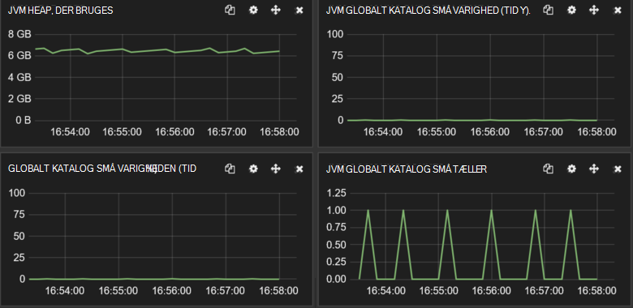

<properties
   pageTitle="Justering af data indtagelse ydeevnen til Elasticsearch på Azure | Microsoft Azure"
   description="Sådan maksimere data indtagelse ydeevne med Elasticsearch på Azure."
   services=""
   documentationCenter="na"
   authors="dragon119"
   manager="bennage"
   editor=""
   tags=""/>

<tags
   ms.service="guidance"
   ms.devlang="na"
   ms.topic="article"
   ms.tgt_pltfrm="na"
   ms.workload="na"
   ms.date="09/22/2016"
   ms.author="masashin"/>

# <a name="tuning-data-ingestion-performance-for-elasticsearch-on-azure"></a>Justering af data indtagelse ydeevnen til Elasticsearch på Azure

[AZURE.INCLUDE [pnp-header](../../includes/guidance-pnp-header-include.md)]

I denne artikel er [en del af en række](guidance-elasticsearch.md). 

## <a name="overview"></a>Oversigt

Der er et vigtigt aspekt, når du opretter en hvilken som helst Søg i databasen til at bestemme den bedste måde at strukturere systemet for at indtager søgbare data hurtigt og effektivt. Overvejelser omkring dette krav vedrører ikke kun valget af infrastruktur, hvorpå du implementerer systemet, men også forskellige optimeringer, som du kan bruge til at sikre, at systemet holder med de forventede niveauer af data strømmer. 

I dette dokument beskrives indstillingerne installation og konfiguration, som du bør overveje til implementering af en Elasticsearch klynge, der forventer en høj hastighed for data indtagelse. For at give dækkende data til vejledende formål, vises dette dokument også resultaterne af udviklingskurver forskellige konfigurationer ved hjælp af en enkelt store mængder data indtagelse arbejdsbyrde. Oplysninger om arbejdsbelastningen er beskrevet i [tillæg](#appendix-the-bulk-load-data-ingestion-performance-test) i slutningen af dette dokument.

Formålet med benchmarks blev ikke at generere absolut ydeevne figurer til kørsel af Elasticsearch eller selv at anbefale en bestemt topologi, men i stedet for at illustrere metoder, du kan bruge til vurdering af ydeevne, sidetilpasning data noder og implementere klynger, der kan opfylder dine egne ydeevnekrav til. 

Det er vigtigt at undersøge ydeevne grundigt baseret på dine egne arbejdsbelastninger, når sidetilpasning dine egne systemer. Indsaml telemetri, der gør det muligt at få oplysninger om optimal hardwarekonfigurationen bruge, og de vandrette skalering faktorer, du bør overveje. Især, skal du:

- Overvej at samlede størrelse af de data, der er sendt og ikke kun antallet af elementer i hver flere Indsæt anmodning. Et mindre antal store flere elementer i hver enkelt anmodning kan være mere optimal end et større tal, afhængigt af den ressource, der er tilgængelige til at behandle hver enkelt anmodning.

Du kan overvåge virkningerne af varierende flere Indsæt anmodningen ved hjælp af [Marvel](https://www.elastic.co/products/marvel), ved hjælp af *readbytes*/*writebytes* I/O tællere med [JMeter](https://jmeter.apache.org/)og operativsystem funktioner som *iostat* og *vmstat* på Ubuntu. 

- Forestå test af ydeevne og indsamle telemetri mål CPU behandling og i/o-Vent tidspunkter, disken ventetid, overførselshastighed og svar gange. Disse oplysninger kan hjælpe med at identificere potentielle flaskehalse og vurdere de omkostninger og fordele ved at bruge premium-lager. Tage i betragtning, CPU og diskplads anvendelsen måske ikke selv på tværs af alle noder afhængigt af måden, hvilke shards og replikaer er distribueret på tværs af klynge (nogle noder kan indeholde flere shards end andre).

- Overvej at hvordan antallet af samtidige anmodninger om arbejdsbelastningen fordeles på tværs af klyngen og vurdere virkningen af at bruge forskellige antal noder til at håndtere denne arbejdsbyrde.

- Overveje, hvordan arbejdsbelastninger, som kan vokse som virksomheden udvides. Vurdere virkningen af denne vækst på omkostningerne FOS og lagerplads, der bruges af noderne.

- Genkendes, ved hjælp af en klynge med et større antal noder med almindelige diske kan være mere økonomisk Hvis scenariet kræver et stort antal forespørgsler og disk infrastrukturen fører overførselshastighed, der opfylder dine serviceaftaler (SLA). Øge antallet af knuder kan dog introducere omkostninger i form af yderligere mellem noder kommunikation og synkronisering.

- Forstå, et stort antal kerner per node kan generere mere disken trafik som flere dokumenter kan behandles. I dette tilfælde mål disken anvendelsen at vurdere, om i/o-undersystem kan blive en flaskehals og finde ud af fordelene ved at bruge premium-lager.

- Teste og analysere kompromiser med en højere antallet af knuder med færre kerner kontra færre noder med flere kerner. Husk på, at øge antallet af replikaer eskalerer kravene til klyngen og kræve, at du kan tilføje noder.

- Overvej, ved hjælp af kortvarige diske kræver muligvis, indeks skal gendannes hyppigere.

- Mål lydstyrken lagerforbrug til vurdering af kapacitet og under anvendelsen af lagerplads. For eksempel i vores scenarie gemt vi 1,5 milliarder dokumenter ved hjælp af 350GB lagerplads.

- Måle filoverførsel satser for din arbejdsmængder og Overvej, hvor tæt du sandsynligvis at få adgang til den samlede i/o-overførsel grænsen for en given lagerplads-konto, som du har oprettet virtuelle disk.

## <a name="node-and-index-design"></a>Node og indeks design

I et system, skal understøtte store data indtagelse, stiller du spørgsmål til de følgende:

- **Er dataene, hurtige eller relativt statiske?** Jo mere dynamiske data, desto større vedligeholdelse arbejdsbyrde for Elasticsearch. Hvis dataene replikeres, bevares hver replika synkront. Hurtige data, der har en begrænset levetid eller, der kan nemt genskabes kan få glæde af deaktivering af replikering helt. Denne indstilling er beskrevet i afsnittet [justering af store data indtagelse.](#tuning-large-scale-data-ingestion)

- **Hvordan opdateret skal du bruge de data, der er registreret som ved at søge?** Hvis du vil bevare ydeevnen placerer Elasticsearch så mange data i hukommelsen som muligt. Det betyder, at ikke alle ændringer er direkte tilgængelige for search-anmodninger. Processen Elasticsearch bruges til at bevare ændringer og gøre dem synlige er beskrevet i [At foretage ændringer fast](https://www.elastic.co/guide/en/elasticsearch/guide/current/translog.html#translog). 

    Rente dataene bliver synlige er underlagt de *opdatere\_interval* konfiguration af relevante indekset. Dette interval angives som standard på 1 sekund. Men ikke alle situation kræver opdaterer skal udføres dette hurtigt. For eksempel indeks registrering af logdata muligvis klare en hurtig og gentaget strømmer oplysninger som skal være optagelse hurtigt, men ikke kræver de oplysninger, der er umiddelbart tilgængelig til forespørgsler. I dette tilfælde skal du overveje at reducere hyppigheden for opdaterer. Denne funktion er også beskrevet i afsnittet [justering af store data indtagelse.](#tuning-large-scale-data-ingestion)

- **Hvor hurtigt er de data, der sandsynligvis vokse?** Indeks kapacitet bestemmes af antallet af shards, der er angivet, når du har oprettet et indeks. For at gøre det muligt for vækst skal du angive et passende antal shards (standard er fem). Hvis indekset oprettes på en enkelt node, vil være placeret alle fem shards på noden, men som mængden data vokser yderligere noder kan tilføjes og Elasticsearch dynamisk distribuere shards på tværs af noder. Hver shard har dog en omkostninger. Alle søgninger i et indeks forespørgsel alle shards, så oprettelse af et stort antal shards til en lille mængde data kan sænke data forsøg på at hente (undgå scenariet [Kagillion shards](https://www.elastic.co/guide/en/elasticsearch/guide/current/kagillion-shards.html) ).

    Nogle arbejdsbelastninger (såsom logføring) kan oprette et nyt indeks hver dag, og hvis du har bemærket, at antallet af shards er tilstrækkelige til mængden data, skal du ændre det før oprette det næste indeks (eksisterende indeks, påvirkes ikke). Hvis du skal distribuere eksisterende data på tværs af flere shards, er en af mulighederne at indeksere oplysningerne igen. Oprette et nyt indeks med den relevante konfiguration, og Kopiér dataene i den. Denne proces kan gøres gennemsigtige til programmer ved hjælp af [indeks aliasser](https://www.elastic.co/guide/en/elasticsearch/reference/current/indices-aliases.html).

- **Skal data være opdelt mellem brugere i et scenarie med multitenancy?** Du kan oprette separate indekser for hver bruger, men det kan være dyrt, hvis brugerne kun har en moderat mængde data. I stedet overveje at oprette [delte indeks](https://www.elastic.co/guide/en/elasticsearch/guide/current/shared-index.html) og bruge [aliasser baseret på filtre](https://www.elastic.co/guide/en/elasticsearch/guide/current/faking-it.html) til at dirigere anmodninger om til hver bruger dataene. Tilsidesætte standard routing konfigurationen af indeks og distribuere dataene baseret på nogle id-attribut for brugeren, hvis du vil bevare dataene til en bruger sammen i den samme shard.

- **Er data lange eller forbigående?** Hvis du bruger et sæt af Azure FOS for at implementere en Elasticsearch klynge, kan du gemme kortvarige data på en lokal ressource systemdisk i stedet for et vedhæftet drev.
Ved hjælp af en VM SKU, der anvender en SSD for disken ressource kan forbedre i/o-ydeevne. Men alle oplysningerne på disken ressource er midlertidige og kan gå tabt, hvis VM genstarter (se afsnittet når dataene på en midlertidig drev være tabt med at [forstå de midlertidigt drev på Microsoft Azure virtuelle maskiner](http://blogs.msdn.com/b/mast/archive/2013/12/07/understanding-the-temporary-drive-on-windows-azure-virtual-machines.aspx) få mere at vide). Hvis du vil bevare data mellem genstarter, skal du oprette datadisce for at holde disse oplysninger og knytte dem til VM.

- **Hvordan aktive bliver dataene?** Azure virtuelle harddiske er underlagt begrænsninger, hvis mængden læse-og skriveadgang aktivitet overstiger angivne parametre (aktuelt 500 input/output-operationer sekundet (IOP'ER) til en disk, der er knyttet til et almindeligt lag VM og 5000 IOP'ER for en Premium lagerplads disk). 

    For at reducere risikoen for (throttling), og Forøg/o-ydeevne, du overveje at oprette flere datadisce for hver VM og konfigurere Elasticsearch til at sprede data på tværs af disketterne som beskrevet i [Disk- og systemkrav](guidance-elasticsearch-running-on-azure.md#disk-and-file-system-requirements).

    Du skal vælge en hardwarekonfiguration, der hjælper med at minimere antallet af disk I/O læse handlinger ved at sikre, at tilstrækkelig hukommelse er tilgængelig til ofte adgang til cachedata. Dette er beskrevet i afsnittet [hukommelse](guidance-elasticsearch-running-on-azure.md#memory-requirements) opdateringskrav i kører Elasticsearch på Azure.

- **Hvilken type arbejdsbelastningen skal hver node til at understøtte?** Elasticsearch fordel af har hukommelse til at cachedata i Excel (i form af filsystemcachen) og JVM heap'en som beskrevet i afsnittet [hukommelse](guidance-elasticsearch-running-on-azure.md#memory-requirements) opdateringskrav i kører Elasticsearch på Azure. 

    Mængden hukommelse, antal CPU kerner og mængden af tilgængelige diske Angiv ved SKU på den virtuelle maskine. Yderligere oplysninger finder du se [Virtuelle maskiner priser](http://azure.microsoft.com/pricing/details/virtual-machines/) på Azure-webstedet.

### <a name="virtual-machine-options"></a>Virtuelt indstillinger

Du kan klargøre FOS i Azure ved hjælp af en række forskellige lagerenheder. De ressourcer, der er tilgængelige for en Azure VM afhænger af SKU, der er markeret. Hver SKU indeholder en anden blanding af kerner, hukommelse og lagerplads. Du skal vælge en passende størrelse af VM, der håndterer den forventede arbejdsbelastning men, der også bevise økonomisk.
Starte med en konfiguration, som opfylder dine aktuelle behov (udføre udviklingskurver for at teste, som beskrives senere i dette dokument). Du kan tilpasse en klynge senere ved at tilføje flere VM'er, der kører Elasticsearch noder.

[Størrelser for virtuelle maskiner](../virtual-machines/virtual-machines-linux-sizes.md) på webstedet Azure dokumenter de forskellige indstillinger og lagerenheder, der er tilgængelige for FOS.

Du skal svare til størrelsen og ressourcer, der er en VM den rolle, der skal udføre noder, der kører på VM.

Efter en datanode:

- Tildele op til 30 GB eller 50% af den tilgængelige RAM hukommelse til Java heap, afhængigt af hvad der er nederst. Lad resten af operativsystemet skal bruges til cachelagring af filer. Hvis du bruger Linux, kan du angive mængden hukommelse til at tildele til Java heap'en ved at angive ES\_HEAP\_størrelse miljøvariablen før du kører Elasticsearch. Du kan også, hvis du bruger Windows eller Linux, kan du bestemme hukommelsesstørrelse med parametrene *Xmx* og *Xms* , når du starter Elasticsearch.

    Afhængigt af arbejdsbelastningen, færre store FOS muligvis ikke som effektive ydeevne som at bruge et større antal moderat størrelse FOS. Du skal udføre test, der kan måle kompromiserne mellem flere netværkstrafik og vedligeholdelse involveret kontra omkostninger ved at øge antallet af kerner tilgængelige og reduceret disk støtte på hver node.

- Brug premium lager til lagring af Elasticsearch data. Det er beskrevet mere detaljeret i sektionen [Indstillinger for lagring af](#storage-options) .

- Brug flere diske af de samme størrelse og stribe data på tværs af disketterne. SKU af din FOS vil bestemmer det maksimale antal datadisce, som du kan vedhæfte. Få mere at vide under [Disk- og systemkrav](guidance-elasticsearch-running-on-azure.md#disk-and-file-system-requirements).

- Brug en multi core CPU SKU med mindst 2 kerner, helst 4 eller mere. 

For en klient node:

- Tildele ikke plads til Elasticsearch data, dedikeret klienter lagrer ikke data på disken.

- Sørg for, der er tilstrækkelig hukommelse til at håndtere arbejdsmængder. Flere Indsæt anmodninger læses i hukommelsen før de data, der sendes til de forskellige data noder, og resultaterne af sammenlægninger og forespørgsler, der er akkumuleret i hukommelsen før den returneres til klientprogrammet. Benchmark-din egen arbejdsmængder og overvåge hukommelsesforbruget ved hjælp af et værktøj som Marvel eller [JVM oplysninger](https://www.elastic.co/guide/en/elasticsearch/guide/current/_monitoring_individual_nodes.html#_jvm_section) , der returneres ved hjælp af *node/statistik* API (`GET _nodes/stats`) til at vurdere optimal krav.  Overvåge især den *heap\_bruges\_procent* metriske for hver node og har til formål at holde Heapstørrelse under 75% af den tilgængelige plads.

- Sikre, at tilstrækkelige CPU-kerner kan modtage og behandle forventede lydstyrken for anmodninger.
Anmodninger om er i kø, som de modtages før behandling, og omfanget af elementer, der kan sættes i kø er en funktion af antallet CPU kerner på hver node. Du kan overvåge kø længderne ved hjælp af dataene i [trådgruppe oplysninger](https://www.elastic.co/guide/en/elasticsearch/guide/current/_monitoring_individual_nodes.html#_threadpool_section) , der returneres ved hjælp af node/statistik API. 

    Hvis *afvist* antallet for en kø angiver, at der anmodninger afvises, betyder det, at klyngen er begyndt at flaskehals. Dette kan skyldes CPU båndbredde, men kan også være på grund af andre faktorer som manglende hukommelse eller langsom i/o-ydeevne, så Brug disse oplysninger sammen med andre statistikker til at finde ud af den egentlige årsag.

    Klient noder kan eller ikke kan være nødvendigt, afhængigt af din arbejdsmængder. Data indtagelse arbejdsbelastninger ofte ikke kan få glæde af med dedikeret klienter, mens nogle søgninger og sammenlægninger kan køre hurtigere. Vær klar til at teste din egen scenarier.

    Klient noder er særligt nyttige til programmer, der bruger Transport klient API til at oprette forbindelse til klyngen. Du kan også bruge API'EN Node klient, som dynamisk opretter en dedikeret klient til programmet, ved hjælp af ressourcerne, der af programmet host-miljø. Hvis dine programmer bruger Node klient API, derefter det muligvis ikke nødvendig for din klynge skal indeholde forudkonfigurerede dedikeret klient noder. 
    
    Dog være opmærksom på, at en node, der er oprettet ved hjælp af klienten Node API er en førsteklasses medlem af klyngen og som Sådan deltager i netværk chatter med andre noder. Ofte kan start og Stop klient noder oprette unødvendige støj på tværs af hele klynge.

For en overordnet node:

- Tildele ikke plads til Elasticsearch data, dedikeret master noder gemmes ikke data på disken.

- CPU-krav skal være minimale.

- Hukommelseskrav til afhænger af klyngen størrelse. Oplysninger om tilstanden for klyngen bevares i hukommelsen. For små klynger mængden hukommelse, som kræves er minimale, men til en stor, meget aktiv klynge, hvor der oprettes indekser ofte og shards bevæge sig rundt, mængden tilstandsoplysninger kan vokse betydeligt. Overvåge JVM Heapstørrelse for at afgøre, om du vil tilføje mere hukommelse.

> [AZURE.NOTE]Klynge pålidelighed altid oprette flere master noder til og konfigurere de resterende noder for at undgå risikoen for en delt hjerneforskningen falder. Ideelt, bør der være et ulige antal overordnede noder. Dette emne er beskrevet mere detaljeret i [konfiguration af spændstighed og gendannelse på Elasticsearch på Azure][].

### <a name="storage-options"></a>Indstillinger for lagring

Der findes et antal indstillinger for lagring af på Azure FOS med forskellige kompromiser påvirker omkostninger, ydeevne, tilgængelighed og gendannelse, skal du overveje omhyggeligt.

Bemærk, at du skal gemme Elasticsearch data på dedikeret datadisce.  Dette hjælper med at reducere konflikt med operativsystemet, og Sørg for, at store mængder Elasticsearch I/O ikke konkurrere med operativsystemfunktioner for i/o-ressourcer.

Azure diske er underlagt begrænsninger for ydeevnen. Hvis du synes, at en klynge gennemgår periodiske indstilling aktivitet kan derefter i/o-anmodninger være begrænset. Hvis du vil forhindre dette, at finjustere dit design til saldo dokumentstørrelse i Elasticsearch mod lydstyrken for anmodninger om sandsynlige skal modtages af hver disk.

Diske, der er baseret på standard lager understøtter en maksimale anmodning rente 500 IOP'ER, mens diske, der er baseret på premium lager kan fungere på op til 5.000 IOP'ER, afhængigt af størrelsen på datadisce. Premium lagerplads diske er kun tilgængelige for FOS DS og GS række. For at finde den maksimale disk IOP'ER efter VM størrelse skal du se [størrelser for virtuelle maskiner i Azure](../virtual-machines/virtual-machines-linux-sizes.md). Ydeevnen på premium lagerplads bestemmes af VM størrelsen sammen med disk størrelse allokering. Kan finde flere oplysninger under [Premium lagerplads: High-Performance lagerplads til Azure virtuelt arbejdsbelastninger](../storage/storage-premium-storage.md).

**Fast datadisce**

Fast data er virtuelle harddiske, der understøttes af Azure-lager. Hvis VM skal genskabes efter en overordnet fejl, kan eksisterende virtuelle harddiske knyttes nemt til den nye VM. Virtuelle harddiske kan oprettes ud fra standard lagerplads (drejer rundt medier) eller premium lagerplads (SSDs). Hvis du vil bruge SSDs skal du oprette FOS ved hjælp af DS serien eller bedre. DS maskiner omkostninger den samme som de tilsvarende D-serien FOS, men du betaler ekstra til brug af premium lagerplads.

I tilfælde, hvor den maksimale overførselshastighed per disk er tilstrækkelige til at understøtte den forventede arbejdsbelastning, kan du overveje enten at oprette flere datadisce og Tillad Elasticsearch [stribe data på tværs af disketterne](guidance-elasticsearch-running-on-azure.md#disk-and-file-system-requirements)eller implementere systemniveau [RAID 0 spredning ved hjælp af virtuelle disk](../virtual-machines/virtual-machines-linux-configure-raid.md).

> [AZURE.NOTE]Erfaringer med Microsoft viser, at ved hjælp af RAID 0 er særligt nyttige til udjævning ud i/o-virkningerne af *spiky* arbejdsbelastninger, som generere hyppige indstilling aktivitet.

Brug premium lokalt overflødige (eller lokalt overflødige for nedre ende eller QA arbejdsbelastninger) lagerplads for kontoen lagerplads holder disketter. replikering på tværs af lande og områder er ikke påkrævet for Elasticsearch høj tilgængelighed. 

**Kortvarige diske**

Ved hjælp af fast diske baseret på SSDs kræver oprette VM'er, der understøtter premium lagerplads. Dette er en pris underforstået. Brug af den lokale kortvarige disk til at holde Elasticsearch data kan være en rentable løsning for moderat størrelse noder, der kræver op til 800 GB lagerplads. På Standard-D-serien af FOS er kortvarige diske implementeret ved hjælp af SSDs, som understøtter langt større ydeevne og meget kortere ventetid end almindelige diske

Når du bruger Elasticsearch, ydeevnen kan være svarer til at bruge premium lagerplads uden at betale – se afsnittet [Adressering diskproblemer ventetid](#addressing-disk-latency-issues) for flere oplysninger.

Størrelsen af VM begrænser mængden af plads i kortvarige lagerplads, som beskrevet i blogindlægget [D-serien ydeevne forventninger](https://azure.microsoft.com/blog/d-series-performance-expectations/).

For eksempel en Standard\_D1 VM indeholder 50GB lagerplads kortvarige, en Standard\_D2 VM har 100GB lagerplads kortvarige og et Standard\_D14 VM indeholder 800GB kortvarige mellemrum. Til klynger hvor noder kun kræver denne mængde plads, kan det være rentable at bruge en D-serien VM med kortvarige lagerplads.

Du skal saldo tilgængelige med kortvarige lagerplads mod tid og omkostninger, der er involveret i gendanne disse data, når en maskine genstartet øget overførselshastigheden. Indholdet af kortvarige disken går tabt, hvis VM flyttes til en anden værtsserver, hvis værten opdateres, eller hvis værten har en hardwarefejl. Hvis selve dataene har en begrænset levetid måske denne datatab være acceptable. For mere holdbart data, kan det være muligt at genopbygge et indeks eller gendanne de manglende oplysninger fra en sikkerhedskopi. Det er muligt at minimere risikoen for tab ved hjælp af replikaer på andre FOS.

> [AZURE.NOTE]Brug ikke en **enkelt** VM til at holde vigtige fremstilling data. Hvis noden mislykkes, skal alle dataene er ikke tilgængelig. Sørg for, at dataene er replikeres til mindst én anden node til vigtige oplysninger.

**Azure-filer**

[Azure fil Service](http://blogs.msdn.com/b/windowsazurestorage/archive/2014/05/12/introducing-microsoft-azure-file-service.aspx) giver adgang til delte filer ved hjælp af Azure-lager. Du kan oprette filshares, som du kan derefter tilslutte på Azure FOS. Flere FOS kan oprette forbindelse til den samme filshare gør det muligt at få adgang til de samme data.

For at forbedre ydeevnen er det ikke anbefales, at du bruger filshares til opbevaring af Elasticsearch data, der ikke behøver at deles på tværs af noder, normalt data er mere egnet til dette formål. Filshares kan bruges til at oprette Elasticsearch [skygge replika indeks](https://www.elastic.co/guide/en/elasticsearch/reference/current/indices-shadow-replicas.html). Men denne funktion er i øjeblikket forsøg og bør ikke gennemføres i et produktionsmiljø på nuværende tidspunkt. Derfor betragtes skyggeindeks ikke længere i denne vejledning.

**Netværksindstillinger**

Azure implementerer et delt netværk farveskema. FOS ved hjælp af den samme hardware rack konkurrere om netværksressourcer. Derfor tilgængelige netværksbåndbredde kan variere, alt efter tidspunktet, og dagligt Skift af arbejde, der kører på FOS dele den samme fysiske netværksinfrastruktur. Du har ikke ret meget kontrol over disse faktorer. Det er vigtigt at forstå, at netværksydeevne sandsynligvis varierer over tid, skal du angive så brugerens forventninger i overensstemmelse hermed.

## <a name="scaling-up-nodes-to-support-large-scale-data-ingestion"></a>Skalering af noder til at understøtte store data indtagelse

Du kan oprette Elasticsearch klynger ved hjælp af praktisk moderat hardware, og derefter skalere op eller skalere ud, som mængden data vokser og øge antallet af anmodninger. Med Azure, du skala op ved at køre på større og mere dyrt FOS, eller du kan skala ud ved hjælp af flere mindre og billigere FOS. 

Du kan også udføre en kombination af begge strategier. Der findes ingen generel løsning for alle scenarier, så at vurdere den bedste fremgangsmåde for en given situation, du skal være forberedt til at udføre en række ydeevne tester.

Dette afsnit vedrører den skalere op tilgang, skalering out er beskrevet i afsnittet [Skalering ud: konklusioner](#scaling-out-conclusions).
I dette afsnit beskrives resultaterne af en række, der blev udført mod et sæt Elasticsearch klynger, der indeholder FOS af forskellige størrelser. Klynger er udpeget som lille, medium og store. Den følgende tabel opsummerer de ressourcer, der er allokeret til FOS i hver klynge.

| Klynge | VM SKU      | Antallet af kerner | Antallet af datadisce | RAM  |
|---------|-------------|-----------------|----------------------|------|
| Lille   | Standard D2 | 2               | 4                    | 7GB  |
| Mediet  | Standard D3 | 4               | 8                    | 14GB |
| Store   | Standard D4 | 8               | 16                   | 28GB |

Hver Elasticsearch klynge indeholdt 3 data noder. Disse data noder håndteret klient-anmodninger samt håndtering af databehandling. Separat klient noder blev ikke brugt, da de tilbudt lille fordelene for scenariet til indtagelse, der bruges af testene. Klyngen indeholdt også tre overordnede noder, hvoraf den ene blev valgt ved Elasticsearch til at koordinere klyngen.

Testene, der blev udført ved hjælp af Elasticsearch 1.7.3. Testene, der oprindeligt blev udført på klynger kører Ubuntu Linux 14.0.4, og derefter gentages med brug af Windows Server 2012. Oplysninger om arbejdsbelastningen er udført af testene, der er beskrevet i [tillæg](#appendix-the-bulk-load-data-ingestion-performance-test).

### <a name="data-ingestion-performance--ubuntu-linux-1404"></a>Data indtagelse ydelse – Ubuntu Linux 14.0.4

Den følgende tabel opsummerer de overordnede resultatet af kørslen test til to timer for hver konfiguration:

| Konfiguration | Eksempel antal | Gennemsnitlig svartid (ms) | Overførselshastighed (handlinger/s) |
|---------------|--------------|----------------------------|---------------------------|
| Lille         | 67057        | 636                        | 9.3                       |
| Mediet        | 123482       | 692                        | 17.2                      |
| Store         | 197085       | 839                        | 27.4                      |

Overførselshastighed og antal prøver behandles til de tre konfigurationer er i tilnærmet forholdet 1:2:3. De ressourcer, der er tilgængelige med hensyn til hukommelse, CPU kerner og diske har dog forholdet 1:2:4. Det var mente er værd at undersøge laveste-niveau-ydeevne detaljerne for knuderne i klynge for at vurdere hvorfor det kan være tilfældet. Disse oplysninger kan hjælpe med at afgøre, om der er begrænsninger til skalering, og hvornår det kan være bedre at overveje skalering af. 

### <a name="determining-limiting-factors-network-utilization"></a>Finde ud af, at begrænse faktorer: udnyttelse af netværk

Elasticsearch er afhængig af har tilstrækkelige netværksbåndbredde til at understøtte strømmer af klient-anmodninger samt oplysninger om synkronisering, der flyder mellem noderne i klyngen. Som fremhævede tidligere, har du begrænset kontrol over båndbreddetilgængeligheden, som afhænger af mange variabler som datacenter i brug, og den aktuelle netværksbelastning af andre FOS dele den samme netværksinfrastruktur. Det er dog stadig værd at undersøge netværksaktivitet for hver klynge for at bekræfte, at mængde trafik ikke er for stor. Diagrammet nedenfor viser en sammenligning af netværkstrafikken modtages af node 2 i hver af de klynger (enhederne for andre noderne i hver klynge var minder meget om).


De gennemsnitlige byte, der er modtaget sekundet til node 2 i hver klynge konfiguration i to time perioden var på følgende måde:

| Konfiguration | Gennemsnitlige antal byte modtaget/sekund |
|---------------|--------------------------------------|
| Lille         | 3993640.3                            |
| Mediet        | 7311689.9                            |
| Store         | 11893874.2                           |

Testene, der blev udført, mens systemet kørte i **stationær tilstand**. I situationer, hvor indeksere skulle genoprette balancen eller node gendanne foregår, dataoverførsler mellem noder holder primære og replika shards, kan generere betydeligt netværkstrafik. Effekterne af denne proces er beskrevet mere i dokumentet [konfiguration af spændstighed og gendannelse på Elasticsearch på Azure][].

### <a name="determining-limiting-factors-cpu-utilization"></a>Finde ud af, at begrænse faktorer: CPU-forbrug

Den rente, hvormed anmodninger skal håndteres er mindst delvist underlagt tilgængelige behandling kapaciteten. Elasticsearch accepterer flere insert-anmodninger på flere indsætte kø. Hver node har et sæt af flere indsætte køer afhænger af antallet processorer, der er tilgængelige. Som standard, der er én kø for hver processor og hver kø kan indeholde op til 50 udestående anmodninger, før de starter afvises. 

Programmer skal sende anmodninger med en hastighed, der ikke forårsager køerne til overspill. Antallet af elementer i hver kø på én gang, skal være en funktion af hastigheden, hvormed anmodninger sendes af klientprogrammer og den rente, hvormed forespørgslerne samme hentes og behandles af Elasticsearch. Derfor hentes én vigtige statistikken problemstillinger fejl rente opsummeret i følgende tabel.

| Konfiguration | Samlet eksempler | Antal fejl  | Fejl rente |
|---------------|---------------|--------------|------------|
| Lille         | 67057         | 0            | 0,00%      |
| Mediet        | 123483        | 1            | 0.0008%    |
| Store         | 200702        | 3617         | 1,8%      |

Hver af disse fejl skyldes følgende Java undtagelse:

```
org.elasticsearch.action.support.replication.TransportShardReplicationOperationAction$PrimaryPhase$1@75a30c1b]; ]
[219]: index [systembase], type [logs], id [AVEAioKb2TRSNcPa_8YG], message [RemoteTransportException[[esdatavm2][inet[/10.0.1.5:9300]][indices:data/write/bulk[s]]]; nested: EsRejectedExecutionException[rejected execution (queue capacity 50)
```

Øge antallet af køer og/eller længden af hver kø kan reducere antallet af fejl, men denne metode kan kun klare indstilling kortvarigt. Gør dette, mens du kører en vedvarende række data indtagelse opgaver vil blot udskyde det punkt, hvor fejlene til virkelighed. Desuden denne ændring forbedrer ikke overførselshastigheden og vil sandsynligvis skade svartid af klientprogrammer, som anmodninger sættes i kø længere før behandles.

Standard indeksstrukturen af 5 shards med 1 replika (10 shards i alle), resultaterne i en mindre ubalance i belastning mellem knuderne i en klynge, to noder skal indeholde tre shards, mens anden noden skal indeholde fire. Noden det mest optagne er mest sandsynlige skal være det element, der begrænser overførselshastighed de mest, er grunden denne node er valgt i hver sag. 

Det følgende sæt af grafer illustrere CPU-forbrug for noden det mest optagne i hver klynge.


Den gennemsnitlige CPU-forbrug for disse noder er for lille, medium og store klynger, 75.01%, 64.93%. og 64.64%. Sjældent betyder anvendelsen faktisk påløber 100%, og anvendelsen udelader som størrelsen på noderne og de tilgængelige CPU power tilgængelige øges. CPU power sandsynligvis derfor ikke en faktor begrænse ydeevnen for store klynge.

### <a name="determining-limiting-factors-memory"></a>Finde ud af, at begrænse faktorer: hukommelse

Hukommelsesforbruget er et andet vigtigt aspekt, der kan påvirke ydeevnen. For testene, blev Elasticsearch tildelt 50% af tilgængelig hukommelse. Dette er på linje med [dokumenteret anbefalinger](https://www.elastic.co/guide/en/elasticsearch/guide/current/heap-sizing.html#_give_half_your_memory_to_lucene). Mens testene, der kørte, blev JVM overvåges for unødvendig garbage samling aktivitet (angivelse af manglende heaphukommelse). I alle tilfælde skal Heapstørrelse blev stabil og JVM medfører lav garbage i offlinetilstand. Skærmbilledet nedenfor viser et øjebliksbillede af Marvel, fremhævning tasten JVM statistik for en kort periode, mens testen kørte på den store klynge.



***JVM hukommelse og garbage aktivitet i af websteder på den store klynge.***

### <a name="determining-limiting-factors-disk-io-rrates"></a>Finde ud af, at begrænse faktorer: disk i/o-rRates

Funktionen resterende til fysisk på serversiden, der kan begrænse ydeevnen er ydeevnen for disken i/o-undersystem. Diagrammet nedenfor sammenligner diskaktiviteten med hensyn til byte, der skrives til det mest optagne knuderne i hver klynge.

 

Følgende tabel viser de gennemsnitlige byte, der skrives sekundet til node 2 i hver klynge konfiguration i to time perioden:

| Konfiguration | Gennemsnitlige antal byte skrevet/sekund |
|---------------|-------------------------------------|
| Lille         | 25502361.94                         |
| Mediet        | 48856124.5                          |
| Store         | 88137675.46                         |

Mængden data, der er skrevet øges med antallet af anmodninger om behandles af en klynge, men i/o-satserne er inden for angivne grænser Azure-lager (diske, der er oprettet ved hjælp af Azure lagerplads kan understøtte en vedvarende satser 10 'er til 100s af MB/s, afhængigt af om Standard eller Premium lagerplads bruges). At undersøge mængden af tid brugt venter på disk I/O hjælper med at angive, hvorfor disken overførselshastighed godt under teoretiske maksimum. Få vist disse statistik for for de samme tre noder, grafer og tabellen nedenfor:

> [AZURE.NOTE]Ventetiden disk måles ved at overvåge procentdelen af CPU-tid, hvor processorer, der er blokeret venter i/o-handlingerne er fuldført.


| Konfiguration | Gennemsnitlig disken vente CPU-tid (%) |
|---------------|--------------------------------|
| Lille         | 21.04                          |
| Mediet        | 14.48                          |
| Store         | 15.84                          |

Disse data angiver, at en signifikant andel af CPU-tid (mellem næsten 16% og 21%) er brugt venter på disk I/O til at fuldføre. Dette begrænse muligheden for, at Elasticsearch til at behandle anmodninger og gemme data.

Under testen kører, den store klynge indsat mere end **fem 100 millioner dokumenter**. Tillade test fortsat viste, vent gange øget betydeligt, når databasen indeholdt over seks 100 millioner dokumenter. Årsager til dette problem er ikke fuldt undersøges, men kan på grund af disk fragmentering forårsage øget disk ventetid. 

Øge størrelsen på klyngen over flere noder være en hjælp for at afhjælpe virkningerne af dette problem. I yderste tilfælde kan det være nødvendigt at defragmentere en disk, der vises for mange i/o-tidspunkter. Dog defragmentere en stor disk kan tage længere tid (muligvis mere end 48 timer for en 2TB Virtuelle drev), og bare omformatere drevet og tillade Elasticsearch til at gendanne de manglende data fra replika shards kan være en mere økonomisk tilgang.

### <a name="addressing-disk-latency-issues"></a>Håndtere ventetid diskproblemer

Testene, der blev oprindeligt udføres via FOS konfigureret med standard diske. En almindelig disk er baseret på drejer rundt medier og derfor er underlagt rotational ventetid og andre flaskehalse, der kan begrænse i/o-satser. Azure giver også premium lagring, som er oprettet ved hjælp af SSD enheder. Disse enheder har ikke nogen rotational ventetid og derfor kan give forbedret i/o-hastigheder. 

Tabellen nedenfor sammenligner resultaterne af at erstatte standard diske med premium diske i den store klynge (den Standard D4 FOS i den store klynge er blevet erstattet med Standard DS4 FOS; antallet af kerner, hukommelse og diske er den samme i begge tilfælde den eneste forskel er, at DS4 FOS bruges SSDs).

| Konfiguration    | Eksempel antal | Gennemsnitlig svartid (ms) | Overførselshastighed (handlinger/s) |
|------------------|--------------|----------------------------|---------------------------|
| Store - Standard | 197085       | 839                        | 27.4                      |
| Store - Premium  | 255985       | 581                        | 35.6                      |

Svar gange er blevet væsentligt bedre, hvilket resulterer i en gennemsnitlig overførselshastighed meget tættere til 4 x, lille klynge. Dette er mere på linje med de ressourcer, der er tilgængelige på et Standard DS4 VM. Gennemsnitlig CPU-forbrug på noden det mest optagne i klynge (node 1 i dette tilfælde) øget som den brugte mindre tid, der venter på I/O til at fuldføre:


Reduktion i disk ventetiden bliver synlige, når du overveje følgende graf, som viser, at for det mest optagne noden denne statistik, flyttes til omkring 1% i gennemsnit:


Der findes en pris til at betale for denne forbedring, men. Antallet af indtagelse fejl øges med en faktor på 10 til 35797 (12.3%). De fleste af disse fejl blev igen, resultatet af flere indsætte kø overløb. Da der hardwaren, der vises nu for at kunne køre tæt kapacitet, kan det være nødvendigt at enten tilføje flere noder eller begrænsning rente flere indsætter at reducere lydstyrken for fejl. Disse problemer er beskrevet senere i dette dokument.

### <a name="testing-with-ephemeral-storage"></a>Test med kortvarige lagerplads

De samme test blev gentages på en klynge af D4 FOS ved hjælp af kortvarige lagerplads. Kortvarige lagerplads implementeres på D4 FOS som en enkelt 400GB SSD. Antallet af prøver behandles, svartid og overførselshastighed blev alle minder meget om tallene, rapporteret for klynge baseret på DS14 FOS med premium lagerplads.

| Konfiguration                     | Eksempel antal | Gennemsnitlig svartid (ms) | Overførselshastighed (handlinger/s) |
|-----------------------------------|--------------|----------------------------|---------------------------|
| Store - Premium                   | 255985       | 581                        | 35.6                      |
| Stor – Standard (kortvarige disk) | 255626       | 585                        | 35.5                      |

Fejl rente var også lignende (33862 fejl af 289488 anmodninger i alt – 11,7%).

De følgende grafer viser CPU-forbrug og disk vente statistik for det mest optagne noden i klynge (node 2 denne gang):


! [] (media/guidance-elasticsearch/data-ingestion-image13.png

I dette tilfælde ydeevne for alene overvejes ved hjælp af kortvarige lagerplads en mere økonomisk løsning end at bruge premium-lager.

### <a name="data-ingestion-performance--windows-server-2012"></a>Data indtagelse ydelse – Windows Server 2012

De samme test blev gentages med et sæt af Elasticsearch klynger med noder, der kører Windows Server 2012. Formålet med disse test er at fastlægge, hvilken effekter, hvis der overhovedet skal valg af operativsystem muligvis på klynge ydeevne.

Følgende tabel viser overførselshastighed og svar klokkeslæt opnået for små, mellemstore og store klyngekonfigurationer for at illustrere skalerbarhed af Elasticsearch i Windows. Bemærk, at disse test alle blev udført med Elasticsearch, der er konfigureret til at bruge SSD kortvarige lagerplads, som testene med Ubuntu havde vist, at disken ventetid var sandsynligvis er en vigtig faktor i at opnå optimal ydeevne:

| Konfiguration | Eksempel antal | Gennemsnitlig svartid (ms) | Overførselshastighed (handlinger/s) |
|---------------|--------------|----------------------------|---------------------------|
| Lille         | 90295        | 476                        | 12.5                      |
| Mediet        | 169243       | 508                        | 23.5                      |
| Store         | 257115       | 613                        | 35.6                      |

Disse resultater angiver, hvordan Elasticsearch skaleres med VM størrelse og ressourcer, der er tilgængelige i Windows.

De følgende tabeller sammenligner resultaterne for de store klynge i Ubuntu og Windows:

| Operativsystem | Eksempel antal | Gennemsnitlig svartid (ms) | Overførselshastighed (handlinger/s) | Fejl rente (%) |
|------------------|--------------|----------------------------|---------------------------|----------------|
| Ubuntu           | 255626       | 585                        | 35.5                      | 11,7           |
| Windows          | 257115       | 613                        | 35.6                      | 7.2            |

Overførselshastigheden var overensstemmelse med, til de store Ubuntu klynger, selvom svartiden var lidt højere. Dette kan gøres regnskab for den nederste sats for fejl (fejl rapporteres hurtigere end mislykket, så har en lavere svartid).

CPU-forbrug, der rapporteres af de værktøjer til overvågning af Windows var smule højere end Ubuntu. Skal du behandle direkte sammenligninger af målinger som disse på tværs af operativsystemer med stor forsigtighed på grund af måden, forskellige operativsystemer rapportere disse statistikker. Desuden findes kan finde oplysninger om disk ventetid med hensyn til CPU ventetiden I/O ikke på samme måde som det er for Ubuntu. Det vigtigste er, at CPU-forbrug blev høj, der angiver, tid brugt vente I/O blev lav:


### <a name="scaling-up-conclusions"></a>Skalering: konklusioner

Elasticsearch ydeevne for en grundigt klar klynge der sandsynligvis er tilsvarende på Windows og Ubuntu, og at den ubalance op i et lignende mønster på begge operativsystemer. Bedste ydeevne, **bruge premium lagerplads til opbevaring af Elasticsearch data**.

## <a name="scaling-out-clusters-to-support-large-scale-data-ingestion"></a>Skalering af klynger til at understøtte store data indtagelse

Skalering af er den gratis metode til at skalere undersøgte i forrige afsnit. En vigtig funktion af Elasticsearch er den naturlige vandret skalerbarhed, der er indbygget i softwaren. Øge størrelsen på en klynge er kun nødvendigt at tilføje flere noder. Du behøver ikke at udføre manuel handlinger for at omfordele indeks eller shards som opgaverne skal håndteres automatisk, selvom der er en række af konfigurationsindstillinger, som du kan bruge til at påvirke denne proces. 

Tilføjelse af flere noder hjælper med at forbedre ydeevnen ved at sprede belastning på tværs af flere maskiner. Når du tilføjer flere noder, skal du muligvis også overveje at indeksere data for at øge antallet af shards, der er tilgængelige. Du kan tilsidesætte denne proces til en vis grad ved oprettelse af indeks, der har flere shards, end der er tilgængelige noder først. Når yderligere noder er tilføjet, kan shards distribueres.

Ud over at drage fordel af de vandrette skalerbarhed af Elasticsearch, er der andre årsager til implementering af indeks, der har flere shards end noder. Hver shard er implementeret som en separat datastruktur (en [Lucene](https://lucene.apache.org/) indeks), og har sin egen interne mekanismer til bevarer konsistens og håndtering af på dokumentsammenfald. Oprette flere shards øger parallelitet i en knude og kan forbedre ydeevnen. 

Vedligeholde dog ydeevne, mens skalering er en handling, justering af belastning. Flere noderne og shards en klynge indeholder større indsats er påkrævet for at synkronisere det arbejde, der er udført af klynge, hvilket kan reducere overførselshastighed. For en given arbejdsbyrde er der en optimal konfiguration, som maksimerer indtagelse ydeevne, mens minimering vedligeholdelse omkostninger. Denne konfiguration er meget afhængigt af art arbejdsbelastningen og klynge; nærmere betegnet kan lydstyrken, størrelsen og indholdet af dokumenterne, den rente, hvor indtagelse foregår og den hardware, som systemet kører.  

Dette afsnit indeholder en oversigt over resultaterne af undersøgelser i sidetilpasning klynger, der er beregnet til at understøtte arbejdsbelastningen bruges af de performance-test, der er beskrevet tidligere. Samme test blev udført på klynger med FOS baseret på den store VM størrelse (Standard D4 med 8 CPU kerner, 16 datadisce og 28GB RAM) kører Ubuntu Linux 14.0.4, men konfigureret med forskellige antal knuder og shards. Resultaterne er ikke beregnet til at være endelige, som de gælder kun for et bestemt problem, men de kan fungere som et godt udgangspunkt til at hjælpe dig med at analysere vandret skalerbarhed af din klynger og generere antal shards til noder, der bedst opfylder dine egne krav til optimal forholdet.

### <a name="baseline-results--3-nodes"></a>Oprindelig plan resultater – 3 noder

Test af data indtagelse blev for at få en oprindelig plan-figur, kører i forhold til en klynge med 3 noder med 5 shards og 1 replika. Dette er standardkonfigurationen for et Elasticsearch indeks. Elasticsearch distribuerer 2 primære shards til 2 for knuderne i denne konfiguration, og de resterende primære shard er gemt på den tredje node. Tabellen nedenfor opsummerer overførselshastighed med hensyn til flere indtagelse handlinger sekundet og antallet af dokumenter, der er blevet gemt af testen.

> [AZURE.NOTE] I tabeller, der følges i dette afsnit præsenteres fordelingen af de primære shards som et tal for hver enkelt node, adskilt af stiplet. For eksempel er 5 shard 3-node layout beskrevet som 2-2-1. Layoutet af replika shards er ikke inkluderet. De følger et lignende farveskema til de primære shards.

| Konfiguration | Dokumentantal | Overførselshastighed (handlinger/s)   | Shard layout |
|---------------|----------------|-----------------------------|--------------|
| 5 shards      | 200560412      | 27.86                       | 2-2-1        |

### <a name="6-node-results"></a>6-node resultater

Testen blev gentages på en klynge med 6 noder. Formålet med disse test blev at forsøge at konstatere mere præcist virkninger lagring af mere end én shard på en node.

| Konfiguration | Dokumentantal | Overførselshastighed (handlinger/s)   | Shard layout |
|---------------|----------------|-----------------------------|--------------|
| 4 shards      | 227360412      | 31.58                       | 1-1-0-1-1-0  |
| 7 shards      | 268013252      | 37.22                       | 2-1-1-1-1-1  |
| 10 shards     | 258065854      | 35.84                       | 1-2-2-2-1-2  |
| 11 shards     | 279788157      | 38.86                       | 2-2-2-1-2-2  |
| 12 shards     | 257628504      | 35.78                       | 2-2-2-2-2-2  |
| 13 shards     | 300126822      | 41.68                       | 2-2-2-2-2-3  |

Disse resultater vises til at angive følgende tendenserne:

* Flere shards per node forbedrer overførselshastighed. Med den lille antal shards per node, der er oprettet for disse test, var denne dette forventet, årsager, der er beskrevet tidligere.

* Et ulige antal shards giver bedre ydeevne end et lige tal. Grundene til disse er mindre Ryd, men det *kan* være, algoritmen routing, der bruger Elasticsearch er bedre i stand til at distribuere data på tværs af shards i dette tilfælde fører til en mere ensartet belastning per node.

Hvis du vil teste disse hypoteser, udførte adskillige yderligere test med et større antal shards. På Rådet fra Elasticsearch, blev det besluttet at bruge et primtal af shards for hver test, som disse give en begrundet fordeling af ulige tal til det pågældende område.

| Konfiguration | Dokumentantal | Overførselshastighed (handlinger/s)   | Shard layout      |
|---------------|----------------|-----------------------------|-------------------|
| 23 shards     | 312844185      | 43.45                       | 4-4-4-3-4-4       |
| 31 shards     | 309930777      | 43.05                       | 5-5-5-5-6-5       |
| 43 shards     | 316357076      | 43.94                       | 8-7-7-7-7-7       |
| 61 shards     | 305072556      | 42.37                       | 10-11-10-10-10-10 |
| 91 shards     | 291073519      | 40.43                       | 15-15-16-15-15-15 |
| 119 shards    | 273596325      | 38.00                       | 20-20-20-20-20-19 |

Disse resultater forslag til, at et deponering punkt er nået på omkring 23 shards. Øge antallet af shards forårsagede efter dette punkt en lille er forringet i ydeevne (overførsel for 43 shards er muligvis en fejl).

### <a name="9-node-results"></a>9-node resultater

Testene, der er blevet gentaget ved hjælp af en klynge af 9 noder, igen ved hjælp af et primtal af shards.

| Konfiguration | Dokumentantal | Overførselshastighed (handlinger/s)   | Shard layout               |
|---------------|----------------|-----------------------------|----------------------------|
| 17 shards     | 325165364      | 45.16                       | 2-2-2-2-2-2-2-2-1          |
| 19 shards     | 331272619      | 46.01                       | 2-2-2-2-2-2-2-2-3          |
| 29 shards     | 349682551      | 48.57                       | 3-3-3-4-3-3-3-4-3          |
| 37 shards     | 352764546      | 49,00                       | 4-4-4-4-4-4-4-4-5          |
| 47 shards     | 343684074      | 47.73                       | 5-5-5-6-5-5-5-6-5          |
| 89 shards     | 336248667      | 46.70                       | 10-10-10-10-10-10-10-10-9  |
| 181 shards    | 297919131      | 41.38                       | 20-20-20-20-20-20-20-20-21 |

Disse resultater viste et lignende mønster, med et deponering punkt omkring 37 shards.

### <a name="scaling-out-conclusions"></a>Skalering ud: konklusioner

Ved hjælp af en grov ekstrapolering angivet resultaterne af de test, 6-node og 9 node, til dette scenarie ideel antallet af shards til at maksimere ydeevnen var 4n +/-1, hvor n er antallet af knuder. Dette *kan* være en funktion af antallet af flere Indsæt tråde, der er tilgængelige, som også er afhængig af antallet CPU kerner begrundelsen der således (se [Multidocument mønstre](https://www.elastic.co/guide/en/elasticsearch/guide/current/distrib-multi-doc.html#distrib-multi-doc) få mere at vide):

- Hver flere Indsæt anmodningen, der er sendt af klientprogrammet modtages af en enkelt datanode.

- Noden data opbygger en ny flere Indsæt anmodning om hver primære shard påvirkes af den oprindelige forespørgsel og sender dem til de andre noder parallelt.

- Efterhånden som hver primære shard skrives, sendes en anden anmodning til hver replika for pågældende shard. Den primære shard venter anmodningen sendes til replikaen for at fuldføre før du er færdig.

Som standard opretter Elasticsearch én flere Indsæt tråd for hver tilgængelige CPU-kerne i en VM. Hvis det er den D4 VM'er, der bruges af denne test, hver CPU indeholdt 8 kerner, så 8 flere indsætte tråde blev oprettet. Indekset bruges samlet 4 (i ét tilfælde 5) primære shards på hver node, men der er også 4 (5) replikaer på hver node. Indsætte data i disse shards og replikaer kan bruge op til 8 tråde på hver node per anmodningen, svarer til det tal, der er tilgængelige. Øge eller reducere antallet af shards kan medføre forhold til at sammenkæde som tråde er muligvis venstre frie eller anmodninger er i kø. Dog uden yderligere forsøg dette er blot en teori og det er ikke muligt at være endelige.

Testene illustreret også et andre vigtige punkt. I dette scenarie skal øge antallet af knuder kan forbedre overførselshastigheden indtagelse, men resultaterne skaleres ikke så nødvendigvis lineært. Udfører yderligere test med 12 og 15 node klynger kan vise punktet viser ingen yderligere fordel hvilke skaleres ud. Hvis denne antallet af knuder leverer ikke nok lagerplads, kan det være nødvendigt at vende tilbage til skalaen op strategi og begynde at bruge flere eller større diske, der er baseret på premium lager.

> [AZURE.IMPORTANT] Træde ikke forholdet 4n +/-1 som en magiske formel, der fungerer altid for hver klynge. Hvis du har færre eller flere CPU kerner tilgængelig, kan det være forskellige optimal shard konfigurationen. Resultaterne er baseret på en bestemt arbejdsbyrde, der kun har data indtagelse. Resultaterne kan være meget forskelligartet for arbejdsbelastninger, som også indeholder en blanding af forespørgsler og sammenlægninger.

> Desuden anvendes data indtagelse arbejdsbelastningen et enkelt indeks. I mange situationer sandsynligvis dataene fordeles på tværs af flere indeks, hvilket medfører forskellige mønstre eller brugen af ressourcer.

> Det vigtigste i denne øvelse er at forstå den metode, der bruges i stedet for resultaterne, som. Du skal være forberedt til vurdering af din egen skalerbarhed baseret på din egen arbejdsbelastninger til at hente oplysninger, der er mest relevante til dit eget scenarie.

## <a name="tuning-large-scale-data-ingestion"></a>Justering af store data indtagelse

Elasticsearch er nemme at konfigurere, med mange parametre og indstillinger, som du kan bruge til at optimere ydeevnen til bestemte use cases og scenarier. I dette afsnit beskrives nogle almindelige eksempler. Vær opmærksom på, at den fleksibilitet, som indeholder Elasticsearch i denne forbindelse leveres med en advarsel, det er meget nemmere at detune Elasticsearch og gøre ydeevnen dårligere. Når justering, kan kun oprette et ændre ad gangen, og altid måle virkningerne af ændringerne til at sikre, at ikke der skader dit system.

### <a name="optimizing-resources-for-indexing-operations"></a>Optimering af ressourcer for indeksering handlinger

Følgende liste beskrives nogle punkter, du bør overveje, når justering af en Elasticsearch klynge for at understøtte store data indtagelse. De første to elementer er mest sandsynlige skal have en umiddelbart indlysende påvirkning af ydeevnen, mens resten udgør en mere beskeden mængde, afhængigt af arbejdsbelastningen:

*  Nye dokumenter, der er føjet til et indeks bliver kun synlige for søgninger, når indekset opdateres. Opdatere et indeks er en dyr handling, så det kun udføres med jævne mellemrum i stedet for som hvert dokument er blevet oprettet. Opdateringsintervallet standard er 1 sekund. Hvis du vil udføre flere handlinger, skal du overveje at deaktivere midlertidigt indeks opdaterer. Angive indekset *opdatere\_interval* -1.

    ```http
    PUT /my_busy_index
    {
        "settings" : {
            "refresh_interval": -1
        }
    }
    ```

    Udløse en opdatering manuelt ved hjælp af den [* \_opdatere*](https://www.elastic.co/guide/en/elasticsearch/reference/current/indices-refresh.html) API i slutningen af handlingen for at synliggøre dataene. Du kan få flere oplysninger i [Flere indeksering brugen](https://www.elastic.co/guide/en/elasticsearch/reference/current/indices-update-settings.html#bulk) . Yderligere oplysninger om [resultatet af en ændring opdateringsintervallet på data indtagelse](#the-impact-of-changing-the-index-refresh-interval-on-data-ingestion-performance) er beskrevet senere.

* Hvis et indeks replikeres, hver indekseringshandlingen (dokument oprette, opdatere eller slette) gentages på replika shards, efterhånden som de opstår i den primære shard. Overveje at deaktivere gentagelse under flere importhandlinger og derefter aktivere den igen, når importen er fuldført:

    ```http
    PUT /my_busy_index
    {
        "settings" : {
            "number_of_replicas": 0
        }
    }
    ```

    Når du genaktiverer gentagelse, udfører Elasticsearch byte for byte netværksoverførsel af data fra indekset til hver replika. Dette er mere effektivt end gentaget indeksering processen dokumentet ved dokument på hver node. Risikoen er, at data kan gå tabt af de primære node opstår under udførelse af masseimport, men gendannelse muligvis blot et spørgsmål om at starte importen igen. [Virkningen af replikering af data indtagelse ydeevnen](#the-impact-of-replicas-on-data-ingestion-performance) er beskrevet mere detaljeret senere.

* Elasticsearch forsøger at saldo de ressourcer, der er tilgængelige mellem dem, der kræves til at forespørge og dem, der kræves til ingesting data. Det kan derfor begrænses data indtagelse ydeevne (variere den benyttede hændelser registreres Elasticsearch log). Denne begrænsning er beregnet til at forhindre, at et stort antal indeks segmenter i at blive oprettet samtidig, der kræver fletning og gemme til disk, en proces, der kan monopolisere ressourcer. Hvis dit system ikke er i øjeblikket udførelse af forespørgsler, kan du deaktivere data indtagelse (throttling). Dette skulle give indeksering at maksimere ydeevnen. Du kan deaktivere (throttling) for en hel klynge på følgende måde:

    ```http
    PUT /_cluster/settings
    {
        "transient" : {
            "indices.store.throttle.type": "none"
        }
    }
    ```

    Angive typen begrænsning på klynge tilbage til *"Flet"* , når indtagelse er afsluttet. Også Bemærk, at deaktivere (throttling) kan føre til ustabil i klynge, så sørg for, at du har procedurer, som kan gendanne klyngen, hvis det er nødvendigt.

* Elasticsearch forbeholder sig en del af heaphukommelse for indeksering handlinger, der bruges mest resten af forespørgsler og søgninger. Formålet med disse buffere er at reducere antallet af disk i/o-handlinger, med henblik på at udføre færre, større skriver end flere, mindre skriver. Standard andelen af heaphukommelse allokeres er 10%. Hvis du indekserer en stor mængde data måske denne værdi være utilstrækkelig. For systemer, der understøtter store mængder data indtagelse, skal du tillade op til 512MB hukommelse til hver aktive shard i noden. Eksempelvis hvis du kører Elasticsearch på D4 FOS (28GB RAM) og har tildelt 50% af tilgængelig hukommelse til JVM (14 Gigabyte), bliver derefter 1,4 GB tilgængelig til brug ved at indeksere handlinger. Hvis en node indeholder 3 aktive shards, derefter er denne konfiguration sandsynligvis tilstrækkelige. Men hvis en node indeholder flere shards end dette, skal du overveje at øge værdien af den *indices.memory.index\_bufferen\_størrelse* parameter i elasticsearch.yml konfigurationsfil. Du kan finde yderligere oplysninger finder [Overvejelser i forbindelse Elasticsearch indeksering](https://www.elastic.co/blog/performance-considerations-elasticsearch-indexing).

    Tildeling af mere end 512MB til hver aktive shard ikke vil sandsynligvis det forbedre ydelsen ved indeksering og kan faktisk være skadelige, som mindre hukommelse er tilgængelig for at udføre andre opgaver. Også være opmærksom på, at tildeling af yderligere heap plads til indeks buffere fjernes hukommelse for andre handlinger som søgning og sammenlægning af data og kan sænke ydeevnen i forespørgslerne.

* Elasticsearch begrænser antallet af tråde (Standardværdien er 8), der kan samtidigt udføre indeksering handlinger i en shard. Hvis en node kun indeholder et lille antal shards, derefter overveje at øge den *indeks\_på dokumentsammenfald* indstilling for et indeks, der er underlagt en stor mængde indeksering handlinger eller er mål for en flere Indsæt på følgende måde:

    ```http
    PUT /my_busy_index
    {
        "settings" : {
            "index_concurrency": 20
        }
    }
    ```

* Hvis du udfører et stort antal indeksering og at handlinger for en kort periode, kan du øge antallet af *indeks* og *flere* tråde tilgængelig i tråd puljen og øge størrelsen på *flere indsætte* køen for hver enkelt datanode. Dette giver flere anmodninger skal i kø i stedet for at blive slettet. Du kan finde yderligere oplysninger finder [Tråd puljen](https://www.elastic.co/guide/en/elasticsearch/reference/current/modules-threadpool.html). Hvis du udfører vedvarende høj niveauer af data indtagelse, anbefales derefter øge antallet af flere tråde ikke. I stedet oprette ekstra noder og bruge sharding til at distribuere indeksering belastning på tværs af disse noder. Alternativt kan du overveje at sende flere Indsæt batches serielt i stedet for parallelt som det skal fungere som en naturlig variere den benyttede metode, der kan reducere risikoen for fejl på grund af en masse indsætte kø overløb.

### <a name="the-impact-of-changing-the-index-refresh-interval-on-data-ingestion-performance"></a>Virkningen af at ændre indekset opdateringsinterval på data indtagelse ydeevne

Opdateringsintervallet styrer den rente, hvormed bliver synlige for forespørgsler og sammenlægninger oralt data, men hyppige opdaterer kan påvirke ydeevnen for indtagelse datahandlinger. Opdateringsintervallet standard er 1 sekund. Du kan deaktivere opdatering helt, men dette kan ikke være relevant at arbejdsbelastningen. Du kan eksperimentere ved forsøg på forskellige intervaller og om oprettelse af søde stedet, der afbalancerer indtagelse resultater i forhold til behovet for at præsentere opdaterede oplysninger.

Test af data indtagelse blev som et eksempel på påvirkningen gentages på en Elasticsearch klynge bestående af 7 shards udbrede 3 data noder. Indekset stod for en enkelt replika. Hver datanode var baseret på en D4 VM (28GB RAM, 8 processorer) bruger SSD-sikkerhedskopier kortvarige storage til at holde dataene. Hver test kørte for 1 time.

Opdater rente er indstillet til standardværdien for 1 sekund i denne test. Følgende tabel viser overførselshastighed og svar tiderne for denne test sammenlignet med en separat Kør hvor Opdater rente blev reduceret til én gang hver 30 sekunder.

| Opdatere rente | Eksempel antal | Gennemsnitlig svartid – mislykket (ms) | Overførselshastighed – mislykket (handlinger/s) |
|--------------|--------------|----------------------------------------------------|---------------------------------------------------|
| 1 sekund     | 93755        | 460                                                | 26.0                                              |
| 30 sekunder   | 117758       | 365                                                | 32.7                                              |

I denne test udløste slippe Opdater rente 18% forbedring i overførselshastighed og en 21% reduktion af gennemsnitlig svartid. De følgende grafer, der er oprettet ved hjælp af Marvel illustrere den primære grund til denne forskel. Tallene nedenfor viser indeks Flet aktivitet, der er indtruffet med opdateringsintervallet angivet til 1 sekund og 30 sekunder. 

Indeks fletter udføres for at forhindre, at antallet i hukommelsen indeks segmenter blive for flere. En 1 sekund opdateringsintervallet genererer et stort antal små målgrupper, der skal flettes ofte, mens et 30 sekund opdateringsinterval genererer færre store målgrupper, som kan flettes mere optimalt.


***Indeks Flet aktivitet for et indeks Opdater rente 1 sekund***


***Indeks Flet aktivitet for et indeks Opdater rente på 30 sekunder***

### <a name="the-impact-of-replicas-on-data-ingestion-performance"></a>Virkningen af replikaer af data indtagelse ydeevnen

Replikaer er en væsentlige funktion af enhver tolerant klynge og uden at bruge dem risikoen, at miste oplysninger, hvis en node mislykkes. Dog replikaer øge mængden af disk og netværk I/O, der udføres og kan være skadelige den rente, hvor data er optagelse. Årsager beskrevet tidligere, kan det være en fordel at midlertidigt deaktivere replikaer for varigheden af store datahandlinger for overførsel.

Data indtagelse performance-test blev gentages med tre konfigurationer:

* Brug af en klynge med ingen replikaer.

* Brug af en klynge med 1 replika.

* Brug af en klynge med 2 replikaer.

I alle tilfælde skal klyngen indeholdt 7 shards udbrede 3 noder og kørte på FOS konfigureret som beskrevet i forrige sættet af test. Testindekset bruges et opdateringsinterval på 30 sekunder.

Den følgende tabel opsummerer svar gange og overførselshastighed for hver test til sammenligning:

| Konfiguration | Eksempel antal | Gennemsnitlig svartid – mislykket (ms) | Overførselshastighed – mislykket (handlinger/s) | Indtagelse datafejl |
|---------------|--------------|----------------------------------------------------|---------------------------------------------------|--------------------------|
| 0 replikaer    | 215451       | 200                                                | 59.8                                              | 0                        |
| 1 replika     | 117758       | 365                                                | 32.7                                              | 0                        |
| 2 replikaer    | 94218        | 453                                                | 26.1                                              | 194262                   |


Afvis i ydeevne som antallet af replikaer stiger er markeret, men du skal også bemærke den store mængde data indtagelse fejl i den tredje test. De meddelelser, der genereres af disse fejl angivet, at de på grund af flere Indsæt kø overfyldt forårsager anmodninger om at blive afvist. Disse afviste invitationer opstod meget hurtigt, det er grunden antallet er stort.

> [AZURE.NOTE] Resultaterne af en tredje test fremhæve vigtigheden af at bruge en strategi for intelligent forsøg igen, når der opstår midlertidige fejl som dette – tilbage fra for et øjeblik at tillade flere Indsæt køen løbe før mellem flere Gentag Indsæt handling.

De næste sæt af grafer sammenligne svar tidspunkter, testene. I hver sag første grafen viser de overordnede svar gange, mens anden zoomer graph ind på svar tidspunkter for hurtigste handlinger (Bemærk, at skalaen på den første graph er ti gange, der repræsenterer sekundet). Du kan se, hvordan profilen svar gange varierer på tværs af de tre test.

De fleste handlinger tog med ingen replikaer mellem 75ms og 750ms med hurtigste svaret tidspunkter omkring 25 MS:


Med 1 replika er den mest på forhånd funktionsdygtige svartid i området 125ms til 1250ms. De hurtigste svar tog cirka 75ms, selvom der ikke er nogle af disse hurtige svar end i 0 replikaer store og små bogstaver. Der er også langt flere svar, der tog betydeligt længere end de mest almindelige tilfælde overstiger 1250ms:


Det mest på forhånd svar tidsinterval blev 200 millisekunder til 1500ms med 2 replikaer, men der blev yderst færre resultater under det mindste område end i 1 replika test. Anvendelse af resultater over den øvre grænse er dog meget svarer til det i 1 replika testen. Dette er sandsynligvis på grund af virkningerne af flere Indsæt køen overfyldt (overstiger en kø længde på 50 anmodninger). Det ekstra arbejde, der kræves for at bevare 2 replikaer får køen til overløb hyppigere, forhindre indtagelse handlinger fra at kunne unødvendig svar gange. Handlinger er afvist hurtigt i stedet for at tage et længerevarende stykke tid, muligvis forårsager timeout undtagelser eller svartid klientprogrammer (dette er formålet med flere Indsæt kø ordning), som påvirker beskyttelsen:


Brug af Marvel, kan du se effekten af antallet replikaer på flere indeks køen. Figuren nedenfor viser dataene fra Marvel, der viser, hvordan flere indsætte kø udfyldt under testen. Den gennemsnitlige kø længde blev omkring 40 anmodninger, men periodiske lyseksplosioner forårsagede det på anmodninger om og overløb blev afvist som et resultat:


***Flere indeks kø størrelsen og antallet af anmodninger om afvist med 2 replikaer.***

Du skal sammenligne med det tal, som viser resultaterne for en enkelt replika. Elasticsearch program kunne behandle anmodninger hurtigt nok til at holde gennemsnitlige kø længden på omkring 25, og i intet punkt har kø være længere end 50 anmodninger så ingen løsning blev afvist.


***Flere indeks kø størrelsen og antallet af anmodninger om afvist med 1 replika.***

## <a name="best-practices-for-clients-sending-data-to-elasticsearch"></a>Bedste fremgangsmåder til at sende data til Elasticsearch-klienter

Mange aspekter af ydeevne er bekymrede ikke kun internt i systemet, men med hvordan systemet bruges af klientprogrammer. Elasticsearch indeholder mange funktioner, som kan anvendes af processen indtagelse; oprettelse af entydige identifikationskoder for dokumenter, er udføre dokument analyser og endda bruger scripts til at transformere dataene, når det er gemt nogle eksempler. Men disse funktioner alle tilføje til belastningen på Elasticsearch-program og i mange tilfælde kan udføres mere effektivt af klientprogrammer før overførslen. 

> [AZURE.NOTE] Denne liste over bedste fremgangsmåder drejer primært med ingesting nye data i stedet at ændre eksisterende data, der allerede er gemt i et indeks. Indtagelse arbejdsbelastninger udføres som føje handlinger ved Elasticsearch, mens dataændringer udføres som Slet/tilføje handlinger. Dette skyldes, at dokumenter i et indeks er fast, så ændring af et dokument involverer erstatning af hele dokumentet med en ny version. Du kan vælge at foretage en HTTP PLACERE anmodning at overskrive et eksisterende dokument, eller du kan bruge den Elasticsearch *opdatere* API, abstracts en forespørgsel for at hente et eksisterende dokument, fletter ændringerne, og derefter udfører en læg for at gemme det nye dokument.

Desuden kan du overvejer at implementere følgende fremgangsmåder, hvor det er relevant:

* Deaktivere tekst analyse for indeksere felter, der ikke er nødvendigt at analysere. Analyse omfatter opdeling af tekst for at aktivere forespørgsler, der kan søge efter bestemte betingelser. Det kan dog være en CPU-intensivt opgave, så du skal selektiv. Hvis du bruger Elasticsearch til at gemme logdata, kan det være praktisk at tokenize de detaljerede logføringsoplysninger meddelelser til at tillade komplekse søgninger. Andre felter, som dem, der indeholder fejlkoder eller identifikationskoder skal sandsynligvis ikke tokenized (hvor ofte er du sandsynligvis at anmode om oplysninger om alle meddelelser, fejlkode indeholder en "3", til example?) følgende kode deaktiverer analyse for felterne *navn* og *hostip* i typen *logge* af *systembase* indekset.

    ```http
    PUT /systembase
    {
        "settings" : {
            ...
        },
        "logs" : {
            ...
            "name": {
                "type": "string",
                "index" : "not_analyzed"
            },
            "hostip": {
                "type": "string",
                "index" : "not_analyzed"
            },
            ...
        }
    }
    ```

* Deaktivere feltet *_all* i et indeks, hvis det ikke er påkrævet. Den * \_alle* felt sammenkæder værdierne i de andre felter i dokumentet til analyse og indeksering. Det er praktisk til udførelse af forespørgsler, der kan stemmer overens med et felt i et dokument. Hvis klienter forventes skal sammenlignes med navngivne felter, du derefter aktiverer * \_alle* blot påløber, CPU og lager omkostninger. Følgende eksempel viser, hvordan du deaktiverer den * \_alle* felt for typen *logfiler* i *systembase* indekset.

    ```http
    PUT /systembase
    {
        "settings" : {
            ...
        },
        "logs" : {
            "_all": {
                "enabled" : false
            },
            ...,
        ...
        }
    }
    ```

    Bemærk, at du kan oprette en selektiv version af * \_alle* , der kun indeholder oplysninger fra bestemte felter. Kan finde flere oplysninger under [Deaktivering af \_alle felt](https://www.elastic.co/guide/en/elasticsearch/reference/current/mapping-all-field.html#disabling-all-field).

* Undgå dynamiske tilknytninger i indeks. Dynamisk tilknytning er en effektiv funktion, men at føje nye felter til et eksisterende indeks kræver koordinere ændringer i indeksstrukturen over noderne og midlertidigt kan medføre indekset være låst. Dynamisk tilknytning kan også føre til en cirkeladskillelse i antallet af felter og den deraf følgende mængde metadata til indeks Hvis ikke bruges med forsigtighed. Dette resulterer i Øget lagerplads krav og i/o-, både for ingesting data, og når du udfører forespørgsler. Begge af disse problemer vil påvirke ydeevnen. Overveje at deaktivere dynamisk tilknytning og definere dine indeks strukturer eksplicit. Se [Dynamisk felt tilknytning](https://www.elastic.co/guide/en/elasticsearch/reference/current/dynamic-field-mapping.html#dynamic-field-mapping)kan finde flere oplysninger.

* Forstå, hvordan du fordele arbejdsbelastningen for at imødekomme modstridende krav. Altid bør du overveje, data indtagelse kan have en væsentlig betydning for ydeevnen for andre samtidige handlinger, som brugere udførelse af forespørgsler. Data indtagelse kan være underlagt pludselig lyseksplosioner, og hvis systemet forsøger at bruge alle de data, der er modtaget umiddelbart på strømmer kan medføre forespørgsel satser at sænke hastigheden for en strøm. Elasticsearch forsøger at forhindre, at denne situation opstår ved at kontrollere den rente, hvormed behandler indtagelse anmodninger gennem flere indsætte kø (se afsnittet [fastlægge begrænse faktorer – CPU-forbrug](#determining-limiting-factors-cpu-utilization) for yderligere oplysninger), men denne funktion skal virkelig behandles som endelig. Hvis dit programkode ikke er parat til at håndtere afvist anmodninger om risikerer du at miste data. I stedet skal du overveje at bruge et mønster som [kø-baserede Indlæs Levelling](https://msdn.microsoft.com/library/dn589783.aspx) til at styre den rente, hvormed dataene sendes til Elasticsearch.

* Sørg for, at din klynge har tilstrækkelige ressourcer til at håndtere arbejdsbelastningen, især hvis indeks er konfigureret med flere replikaer.

* Brug flere Indsæt API til at overføre store batches med dokumenter. Størrelse flere anmodninger korrekt. Nogle gange større navne er ikke bedre ydeevne og kan medføre, Elasticsearch tråde og andre ressourcer til at blive overbelastet, forsinke andre samtidige handlinger. Dokumenter i en samlet Indsæt batch afholdes i hukommelsen, når noden koordinerende, mens handlingen er udført. Den fysiske størrelsen af hvert batch er vigtigere end antallet dokument. Der er ingen hårde og hurtig regel som hvad der udgør batchstørrelse ideel, selvom Elasticsearch dokumentation anbefaler ved hjælp af mellem 5 og 15 MB som en begyndende Peg til dine egne efterforskninger. Forestå performance-test for at oprette batchstørrelsen på optimal til dine egne scenarier og arbejdsbyrde blanding.

* Sørg for, at flere insert-anmodninger er fordelt over noder i stedet for dirigeres til en enkelt node. Dirigere alle anmodninger om til en enkelt node kan medføre hukommelse konsumption, som hver flere Indsæt anmodning, behandles er gemt i hukommelsen i noden. Det kan også øge netværksventetid, som anmodninger omdirigeres til andre noder.

* Elasticsearch bruger beslutningsdygtigt størstedelen af noderne primær og replika, når du skriver data. Skrivehandlingen er ikke gennemføres, før quorum rapporter succes. Denne fremgangsmåde hjælper med at sikre, at data ikke er skrevet Hvis en størstedelen af noderne er ikke tilgængelige på grund af et netværk partition (fejl) begivenhed. Ved hjælp af en quorum kan sænke ydeevnen for skrivning. Du kan deaktivere quorum-baserede skriver ved at angive parameteren *konsistens* til *én* , når du skriver data. I følgende eksempel tilføjer et nyt dokument, men den er fuldført, så snart skrivning til den primære shard er afsluttet.

    ```http
    PUT /my_index/my_data/104?consistency=one
    {
        "name": "Bert",
        "age": 23
    }
    ```

    Bemærk, at som med asynkron gentagelse, deaktivere quorum-baserede skriver kan føre til uoverensstemmelser mellem den primære shard og hver af replikaerne.

* Når du bruger quorums, venter Elasticsearch, hvis utilstrækkelig noder findes før bestemmes, skrive skal annulleres, fordi en quorum ikke kan kontaktes. Denne Vent periode bestemmes af parameteren timeout forespørgsel (standard er 1 minut). Du kan ændre denne indstilling ved hjælp af parameteren timeout forespørgsel. I eksemplet nedenfor opretter et nyt dokument og venter på op til 5 sekunder, før quorum svare før annullering af:

    ```http
    PUT /my_index/my_data/104?timeout=5s
    {
        "name": "Sid",
        "age": 27
    }
    ```

    Elasticsearch kan du også bruge din egen version tal [genereres eksternt](https://www.elastic.co/guide/en/elasticsearch/reference/current/docs-index_.html#_version_types).

* Overveje at deaktivere den * \_kilde* i et indeks. Feltet indeholder en kopi af det oprindelige JSON-dokument, der blev brugt, når dokumentet er gemt. Gemme dette felt medfører ekstra lagerplads omkostninger og disk I/O. Disse omkostninger kan være marginal afhængigt af dokumentstrukturen, og du skal også være opmærksom på, hvis du deaktiverer den * \_kilde* felt forhindrer en klient, der kan udføre følgende handlinger:

    * Brug af Opdater API til ændring af et dokument.
    * Udføre den flyvende fremhævning, når du kører forespørgsler.
    * Indeksere data.
    * Fejlfinding forespørgsler og sammenlægninger ved at få vist det oprindelige dokument.

    I følgende eksempel deaktiverer den * \_kilde* felt for typen *logfiler* i *systembase* indekset.

  ```http
  PUT /systembase
  {
        "settings" : {
            ...
        },
        "logs" : {
            "_source": {
                "enabled": false
            },
            ...,
        ...
        }
  }
  ```

## <a name="general-guidelines-for-conducting-data-ingestion-performance-testing-with-elasticsearch"></a>Generelle retningslinjer for at foretage data indtagelse performance-test med Elasticsearch

Følgende punkter Fremhæv nogle af de elementer, du bør overveje, når kører ydeevne tester med Elasticsearch og analyse af resultaterne.

* Test af ydeevne er behøver at være tidskrævende og dyrt. Indsamle statistik, der måler filoverførsel hastigheder på disk og netværk, CPU-forbrug, CPU Vent gange og disk ventetid (hvis det er muligt) som minimum. Dette kan give dig hurtig feedback på en test indsats med god afkast af investeringer.

* Udnytte alle scripting-funktioner fra din Indlæs test af værktøjet til at indsamle målepunkter, ellers ikke muligvis tilgængelige. For eksempel har Linux en lang række pålidelige præstationstal, som du kan samle ved hjælp af funktioner som *vmstat* og *iostat*. Du kan bruge scripting med JMeter til at registrere disse data som en del af en testplan.

* Ydeevnen teknisk er hovedsageligt om analyse af statistik baseret på pålidelige og gentaget data. Stop ikke på højt niveau mål, som ikke giver de nødvendige indsigt. Uddan dig selv med dataene, og foretag ydeevne engineering af en Udviklingscenter ops proces med en fast feedback løkke. Se altid på statistikken sammenligne tendenser og tidligere resultater/konfigurationer. Ved at gøre dette jævnligt du vil oprette data, du vil kunne forstå, er gentaget med din arbejdsbelastninger, og som du vil kunne vurdere virkningerne af ændringer i konfiguration og installation.

* Brug et værktøj som Marvel til at overvåge klynge og node ydeevne, mens test for at få yderligere viden. JMeter kan være effektiv for registrering af rækkedata til efterfølgende analyse, men ved hjælp af Marvel kan give dig en realtid funktionalitet for hvordan ydeevnen klarer og de mulige årsager til fejl og sænke filterlister. Desuden indeholder mange Indlæs testværktøjer ikke synlighed til indre omfanget af Elasticsearch. Bruge og sammenligne indeksering overførselshastighed satser, Flet segmentet tæller, spildopsamlingsfunktionen (globalt katalog) statistik og (throttling) gange, der er tilgængelige i indeks statistik. Gentag denne analyse med jævne mellemrum.

* Sammenligne Indlæs test værktøjet statistik med node statistik i Marvel (disk og netværk trafik, CPU-udnyttelse, hukommelse og tråd puljen brug) at forstå korrelations mønstret mellem de tal, der rapporteres af infrastruktur og bestemte Elasticsearch statistik.

* Generelt kan du overveje *en node én shard* som den oprindelige plan til test af ydeevne og vurdere programmet omkostninger ved at tilføje noder. Dog ikke afhænge af helt ekstrapolation ydelse på baggrund af et lille antal knuder og shards. Synkronisering og kommunikation omkostninger i klyngen kan have uventede effekter på større antallet af knuder og shards.

* Se shard allokering på tværs af noder til at sammenligne statistik. Nogle noder har færre replikaer og shards, som opretter en ubalance ressource anvendelsen.

* Hvis du udfører test af belastning, kan du øge antallet af tråde, der bruger test-værktøj til at registrere arbejde til klyngen, indtil der opstår fejl. Test af bæredygtig overførselshastighed, kan du overveje at vedligeholde din test niveau under den forventede spidsbelastning. Hvis fejlen rente overstiger loftet, vil fejl betale omkostninger på back end-ressourcer på grund af mulighed for gendannelse. Vil overførselshastighed milepælsdatoer blive forringet i disse situationer.

* For at simulere, hvordan systemet reagerer på en uventet store burst af aktivitet, skal du overveje kører test, der opretter en fejl rente, der overskrider din forventede spidsbelastning. Dette giver dig overførselshastighed figurer ikke blot med hensyn til kapacitet, men også omkostninger for mulighed for gendannelse.

* Bruge en dokumentantal til at vurdere din ydeevne-profil, og Papirkurv dokumenter efter din arbejdsbelastningen mønstre. Overvej at, som er tilføjet flere dokumenter, ydeevne-profil, blive ændret.

* Vær opmærksom på SLA for IOP'ER og filoverførsel satser grænser for lagerplads du bruger. Forskellige lagerplads typer (SSD, drejer rundt medier) har forskellige overførslen.

* Husk, at CPU ydeevnen kan slippe ikke kun på grund af disk og netværk aktivitet, men fordi back end-programmer kan bruge låsning og kommunikation gør med fordelt behandling, der kan medføre underudnyttelse som overflødig storage af processoren.

* Kør test af ydeevne i mindst to timer (ikke et par minutter). Indeksering kan påvirke ydeevnen på måder, som ikke muligvis er synlige med det samme. For eksempel kan JVM garbage samling statistik og indeksering fletter ændre profilen ydeevnen over tid.

* Overvej, hvordan indeks opdaterer muligvis stor betydning indtagelse dataoverførsel og (throttling) med en klynge.

## <a name="summary"></a>Oversigt

Det er vigtigt at forstå, hvordan du kan tilpasse din løsning som mængder data og antallet af anmodninger om stiger. Elasticsearch, der kører på Azure gør det muligt for lodrette og vandrette skalering. Du kan køre på større FOS med flere ressourcer, og du kan distribuere en Elasticsearch klynge på tværs af et netværk af FOS. Området af indstillinger kan være forvirrende. Er det mere økonomisk at implementere en klynge på et stort antal small FOS på en klynge med et lille antal store FOS, eller et sted, hvor midt? Desuden, hvor mange shards skal hvert indeks indeholder, og hvad er kompromiserne vedrørende data indtagelse kontra forespørgselsydelse? Den måde, som er distribueret shards på tværs af noder kan have stor indflydelse på indtagelse dataoverførsel. Brug af flere shards kan reducere mængden af interne konflikt, der sker inden for en shard, men du skal saldo denne fordel med de omkostninger, der bruger mange shards kan angive på en klynge. For at besvare spørgsmålene effektivt, skal du være forberedt til test af systemet for at afgøre den mest relevante strategi.

For data indtagelse arbejdsbelastninger er ydeevnen for disken i/o-undersystem en vigtig faktor. Brug af SSDs kan gavne overførselshastighed ved at reducere disk ventetid for skrivning. Hvis du ikke har brug for store mængder diskplads på en node, kan du overveje at bruge standard FOS med kortvarige lager i stedet for mere omfattende VM'er, der understøtter premium lagerplads.

## <a name="appendix-the-bulk-load-data-ingestion-performance-test"></a>Tillæg: en flere Indlæs data indtagelse performance-test

Dette tillæg beskrives en performance-test, der udføres mod Elasticsearch klynge. Testene, der køres ved hjælp af JMeter, der kører på en separat række FOS. Oplysninger om konfigurationen af testmiljøet er beskrevet i [oprette en performance-test miljø til Elasticsearch på Azure][]. For at udføre tests, din egen, kan du oprette din egen JMeter testplan manuelt, eller du kan bruge de tilgængelige automatiserede testscripts separat. Se [kører automatiseret Elasticsearch performance-test][] for yderligere oplysninger.

Data indtagelse arbejdsbelastningen udføres en omfattende overførsel af dokumenter ved hjælp af flere Indsæt API. Formålet med dette indeks var at efterligne et lager, modtager logdata, der repræsenterer systemhændelser til efterfølgende Søg og analyse. Hvert dokument er gemt i et enkelt indeks, der hedder *systembase*og havde type *logfiler*. Alle dokumenter, der havde det samme faste skema, der er beskrevet i følgende tabel:

| Felt         | Datatype            | Eksempel                           |
|---------------|---------------------|-----------------------------------|
| @timestamp    | dato og klokkeslæt            | 2013-12-11T08:01:45.000Z          |
| Navn          | streng              | checkout.Payment                  |
| meddelelse       | streng              | Indgående anmodningsmeddelelsen          |
| severityCode  | heltal             | 1                                 |
| alvor      | streng              | info                              |
| værtsnavn      | streng              | sixshot                           |
| hostip        | streng (IP-adresse) | 10.0.0.4                          |
| personlige id           | heltal                 | 123                               |
| tid           | heltal                 | 4325                              |
| Sikkerhedskontrol         | streng (uuid)       | {00000000-0000-0000-000000000000} |
| Programnavn       | streng              | mytestapp                         |
| appVersion    | streng              | 0.1.0.1234                        |
| type          | heltal                 | 5                                 |
| undertype       | heltal                 | 1                                 |
| correlationId | GUID                | {00000000-0000-0000-000000000000} |
| OS            | streng              | Linux                             |
| osVersion     | streng              | 4.1.1                             |
| parametre    | [ ]                | {nøgle: værdi i nøgle:}             |

Du kan bruge følgende anmodningen til at oprette indekset. Den *tal\_af\_replikaer*, *opdatere\_interval*, og *tal\_af\_shards* indstillinger varieret fra de værdier, der er vist nedenfor i mange af testene.

> [AZURE.IMPORTANT] Indekset blev sluppet og genoprettet før hver test Kør.

```http
PUT /systembase
{
    "settings" : {
        "number_of_replicas": 1,
        "refresh_interval": "30s",
        "number_of_shards": "5"
    },
    "logs" : {
        "properties" : {
            "@timestamp": {
            "type": "date",
            "index" : "not_analyzed"
            },
            "name": {
                "type": "string",
                "index" : "not_analyzed"
            },
            "message": {
                "type": "string",
                "index" : "not_analyzed"
            },
            "severityCode": {
                "type": "integer",
                "index" : "not_analyzed"
            },
            "severity": {
                "type": "string",
                "index" : "not_analyzed"
            },
            "hostname": {
                "type": "string",
                "index" : "not_analyzed"
            },
            "hostip": {
                "type": "string",
                "index" : "not_analyzed"
            },
            "pid": {
                "type": "integer",
                "index" : "not_analyzed"
            },
            "tid": {
                "type": "integer",
                "index" : "not_analyzed"
            },
            "appId": {
                "type": "string",
                "index" : "not_analyzed"
            },
            "appName": {
                "type": "string",
                "index" : "not_analyzed"
            },
            "appVersion": {
                "type": "integer",
                "index" : "not_analyzed"
            },
            "type": {
                "type": "integer",
                "index" : "not_analyzed"
            },
            "subtype": {
                "type": "integer",
                "index" : "not_analyzed"
            },
            "correlationId": {
                "type": "string",
                "index" : "not_analyzed"
            },
            "os": {
                "type": "string",
                "index" : "not_analyzed"
            },
            "osVersion": {
                "type": "string",
                "index" : "not_analyzed"
            },
            "parameters": {
                "type": "string",     
                "index" : "not_analyzed"
            }
        }
    }
}
```

Hver flere Indsæt batchen indeholdt 1000 dokumenter. Hvert dokument blev oprettet ud fra en kombination af tilfældige værdier for *severityCode*, *hostname*, *hostip*, *personlige id*, *tid*, *programnavn*, *appVersion*, *type*, *undertype*og *correlationId* felter og et vilkårligt udvalg af tekst fra et fast antal vilkår for felterne *navn*, *meddelelse*, *alvor*, *os*, *osVersion*, *parametre*, *fil1*og *fil2* . Antallet af forekomster af klienten tjenesteprogrammer bruges til at overføre data blev omhyggeligt udvalgte at maksimere vellykket input lydstyrken. Test stødte til to timer at aktivere klynge udligne og reducere matrixens påvirkning af enhver midlertidige fejl i de overordnede resultater. I dette tidsrum overført nogle test næsten 1,5 milliarder dokumenter.

Data, der blev oprettet dynamisk ved hjælp af en brugerdefineret JUnit anmodning CVS, der blev føjet til en tråd gruppe i en JMeter testplan. Koden JUnit blev oprettet ved hjælp af skabelonen JUnit test store og små bogstaver i Eklipse IDE.

> [AZURE.NOTE] Oplysninger om, hvordan du opretter en JUnit test for JMeter, se [implementere en JMeter JUnit CVS til test Elasticsearch ydeevne][].

Følgende kodestykke viser Java-kode til test Elasticsearch 1.7.3. Bemærk, at klassen JUnit test i dette eksempel hedder *ElasticsearchLoadTest2*:

```java
/* Java */
package elasticsearchtest2;

    import static org.junit.Assert.*;

    import org.junit.*;

    import java.util.*;

    import java.io.*;

    import org.elasticsearch.action.bulk.*;
    import org.elasticsearch.common.transport.*;
    import org.elasticsearch.client.transport.*;
    import org.elasticsearch.common.settings.*;
    import org.elasticsearch.common.xcontent.*;

    public class ElasticsearchLoadTest2 {

        private String [] names={"checkout","order","search","payment"};
        private String [] messages={"Incoming request from code","incoming operation succeeded with code","Operation completed time","transaction performed"};
        private String [] severity={"info","warning","transaction","verbose"};
        private String [] apps={"4D24BD62-20BF-4D74-B6DC-31313ABADB82","5D24BD62-20BF-4D74-B6DC-31313ABADB82","6D24BD62-20BF-4D74-B6DC-31313ABADB82","7D24BD62-20BF-4D74-B6DC-31313ABADB82"};

        private String hostname = "";
        private String indexstr = "";
        private String typestr = "";
        private int port = 0;
        private int itemsPerInsert = 0;
        private String clustername = "";
        private static Random rand=new Random();

        @Before
        public void setUp() throws Exception {
        }

        public ElasticsearchLoadTest2(String paras) {
        \* Paras is a string containing a set of comma separated values for:
            hostname
            indexstr
            typestr
            port
            clustername
            node
            itemsPerInsert
        */

            // Note: No checking/validation is performed

            String delims = "[ ]*,[ ]*"; // comma surrounded by zero or more spaces
            String[] items = paras.split(delims);

            hostname = items[0];
            indexstr = items[1];
            typestr = items[2];
            port = Integer.parseInt(items[3]);
            clustername = items[4];
            itemsPerInsert = Integer.parseInt(items[5]);

            if (itemsPerInsert == 0)
                itemsPerInsert = 1000;
            }

        @After
        public void tearDown() throws Exception {
        }

        @Test
        public void BulkBigInsertTest() throws IOException {

            Settings settings = ImmutableSettings.settingsBuilder().put("cluster.name", clustername).build();

            TransportClient client;
            client = new TransportClient(settings);

            try {
                client.addTransportAddress(new InetSocketTransportAddress(hostname, port));
                BulkRequestBuilder bulkRequest = client.prepareBulk();
                Random random = new Random();
                char[] exmarks = new char[12000];
                Arrays.fill(exmarks, 'x');
                String dataString = new String(exmarks);

                for(int i=1; i &lt; itemsPerInsert; i++){
                    random.nextInt(10);
                    int host=random.nextInt(20);

                    bulkRequest.add(client.prepareIndex(indexstr, typestr).setSource(XContentFactory.jsonBuilder().startObject()
                        .field("@timestamp", new Date())
                        .field("name", names[random.nextInt(names.length)])
                        .field("message", messages[random.nextInt(messages.length)])
                        .field("severityCode", random.nextInt(10))
                        .field("severity", severity[random.nextInt(severity.length)])
                        .field("hostname", "Hostname"+host)
                        .field("hostip", "10.1.0."+host)
                        .field("pid",random.nextInt(10))
                        .field("tid",random.nextInt(10))
                        .field("appId", apps[random.nextInt(apps.length)])
                        .field("appName", "application" + host)
                        .field("appVersion", random.nextInt(5))
                        .field("type", random.nextInt(6))
                        .field("subtype", random.nextInt(6))
                        .field("correlationId", UUID.randomUUID().toString())
                        .field("os", "linux")
                        .field("osVersion", "14.1.5")
                        .field("parameters", "{key:value,key:value}")
                        .field("data1",dataString)
                        .field("data2",dataString)
                    .endObject()));
                }

                BulkResponse bulkResponse = bulkRequest.execute().actionGet();
                assertFalse(bulkResponse.hasFailures());
            }
            finally {
                client.close();
            }
        }

        @Test
        public void BulkDataInsertTest() throws IOException {
            Settings settings = ImmutableSettings.settingsBuilder().put("cluster.name", clustername).build();

            TransportClient client;
            client = new TransportClient(settings);

            try {
                client.addTransportAddress(new InetSocketTransportAddress(hostname, port));
                BulkRequestBuilder bulkRequest = client.prepareBulk();

                for(int i=1; i&lt; itemsPerInsert; i++){
                    rand.nextInt(10);
                    int host=rand.nextInt(20);

                    bulkRequest.add(client.prepareIndex(indexstr, typestr).setSource(XContentFactory.jsonBuilder().startObject()
                        .field("@timestamp", new Date())
                        .field("name", names[rand.nextInt(names.length)])
                        .field("message", messages[rand.nextInt(messages.length)])
                        .field("severityCode", rand.nextInt(10))
                        .field("severity", severity[rand.nextInt(severity.length)])
                        .field("hostname", "Hostname" + host)
                        .field("hostip", "10.1.0."+host)
                        .field("pid",rand.nextInt(10))
                        .field("tid",rand.nextInt(10))
                        .field("appId", apps[rand.nextInt(apps.length)])
                        .field("appName", "application"+host)
                        .field("appVersion", rand.nextInt(5))
                        .field("type", rand.nextInt(6))
                        .field("subtype", rand.nextInt(6))
                        .field("correlationId", UUID.randomUUID().toString())
                        .field("os", "linux")
                        .field("osVersion", "14.1.5")
                        .field("parameters", "{key:value,key:value}")
                    .endObject()));
                }

                BulkResponse bulkResponse = bulkRequest.execute().actionGet();
                assertFalse(bulkResponse.hasFailures());
            }
            finally {
                client.close();
            }
        }
    }
```

Privat *streng* matrixer *navne*, *meddelelser*, *alvor*og *apps* indeholder et lille sæt af værdier, der elementer er markeret fra tilfældigt. De resterende dataelementer for hvert dokument oprettes ved kørsel.

De parametre, der tager parameteren *streng* startes fra JMeter, og de værdier, der overføres i strengen, der er angivet som en del af JUnit anmodning CVS konfigurationen. Til denne JUnit test forventes parameteren *streng* til at indeholde følgende oplysninger:

* **Hostname**. Dette er navnet eller IP-adressen på Azure justering af belastning. Justering af belastning forsøger at distribuere anmodningen på tværs af noderne data i klyngen. Hvis du ikke bruger en belastningsjustering kan du angive adressen på en node i klyngen, men alle anmodninger, blive omdirigeret til, at node og, der kan medføre i den bliver en flaskehals.

* **Indexstr**. Dette er navnet på det indeks, der genereres af en JUnit test dataene føjes til. Hvis du oprettede indekset, som beskrevet ovenfor, kan denne værdi skal være *systembase*.

* **Typestr**. Dette er typen i indekset, hvor data er gemt. Hvis du oprettede indekset, som beskrevet ovenfor, kan denne værdi skal være *logfiler*.

* **Port**. Dette er porten til at oprette forbindelse til på værten. I de fleste tilfælde dette skal du vælge 9300 (porten bruges af Elasticsearch lytte til klient API-anmodninger, port 9200 bruges kun til HTTP-anmodninger).

* **Clustername**. Dette er navnet på den Elasticsearch klynge, der indeholder indekset.

* **ItemsPerInsert**. Dette er en numerisk parameter, der angiver antallet af dokumenter til at tilføje i hver flere Indsæt batchen. Standarderne for størrelse er 1000.

Du kan angive data for Konstruktørstrengen på siden JUnit anmodning, der bruges til at konfigurere JUnit CVS i JMeter. Følgende billede viser et eksempel:


Metoderne *BulkInsertTest* og *BigBulkInsertTest* udføre det faktiske arbejde for oprettelse og overførsel af dataene. Begge metoderne ligner meget. De oprette forbindelse til Elasticsearch klynge og derefter oprette en mængde dokumenter (som bestemmes af parameteren *ItemsPerInsert* parametre streng). Dokumenterne, der føjes til indekset ved hjælp af Elasticsearch flere API. Forskellen mellem de to metoder er, at felterne *fil1* og *fil2* streng i hvert dokument er udeladt i overførslen i metoden *BulkInsertTest* , men er udfyldt med strenge af 12000 tegn i metoden *BigBulkInsertTest* . Bemærk, at du vælge, hvilken af følgende metoder til at køre ved hjælp af *Metoden* på siden JUnit anmodning i JMeter (fremhævet i den foregående figur).

> [AZURE.NOTE] Eksempelkoden præsenteres her bruger biblioteket Elasticsearch 1.7.3 Transport klient. Hvis du bruger Elasticsearch 2.0.0 eller senere, skal du bruge det relevante bibliotek for den version, der er markeret. Se siden [Transport klient](https://www.elastic.co/guide/en/elasticsearch/client/java-api/2.0/transport-client.html) på webstedet Elasticsearch kan finde flere oplysninger om biblioteket Elasticsearch 2.0.0 Transport klient.

[Konfiguration af spændstighed og gendannelse på Elasticsearch på Azure]: guidance-elasticsearch-configuring-resilience-and-recovery.md
[Oprette en Performance-test miljø til Elasticsearch på Azure]: guidance-elasticsearch-creating-performance-testing-environment.md
[Køre Automatiseret Elasticsearch Performance-test]: guidance-elasticsearch-running-automated-performance-tests.md
[Implementere en JMeter JUnit CVS til test Elasticsearch ydeevne]: guidance-elasticsearch-deploying-jmeter-junit-sampler.md
