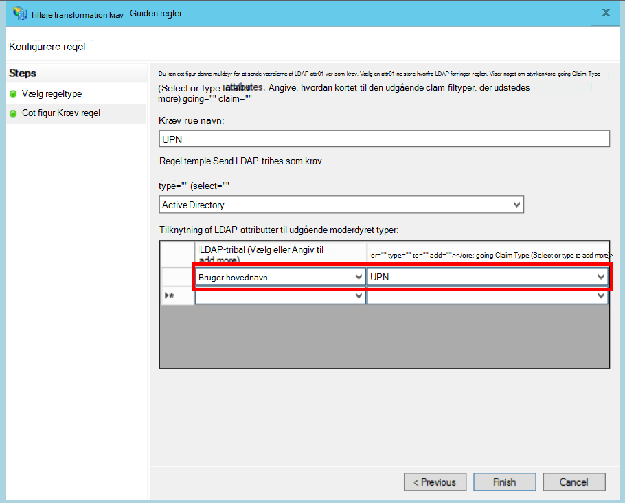

<properties
   pageTitle="En sammenslutning til en kundes AD FS | Microsoft Azure"
   description="Hvordan til federate med en kunde er AD FS i et multiprofiler til computeren"
   services=""
   documentationCenter="na"
   authors="JohnPWSharp"
   manager="roshar"
   editor=""
   tags=""/>

<tags
   ms.service="guidance"
   ms.devlang="dotnet"
   ms.topic="article"
   ms.tgt_pltfrm="na"
   ms.workload="na"
   ms.date="06/02/2016"
   ms.author="v-josha"/>

# <a name="federating-with-a-customers-ad-fs-for-multitenant-apps-in-azure"></a>En sammenslutning til en kundes AD FS til multiprofiler apps i Azure

[AZURE.INCLUDE [pnp-header](../../includes/guidance-pnp-header-include.md)]

I denne artikel er [en del af en række]. Der er også en komplet [Northwind] , der følger med denne serie.

I denne artikel beskrives, hvordan en med flere lejer SaaS program kan understøtte godkendelse via Active Directory Federation Services (AD FS), for at oprette et organisationsnetværk med en kundes AD FS.

## <a name="overview"></a>Oversigt

Azure Active Directory (Azure AD) gør det nemt at logge på brugere fra Azure AD-lejere, herunder Office365 og Dynamics CRM Online-kunder. Men hvad med kunder, der bruger lokalt Active Directory på et intranet?

En af mulighederne er for disse kunder til at synkronisere deres lokalt AD med Azure AD, ved hjælp af [Azure AD-forbindelse]. Nogle kunder kan dog ikke kan bruge denne metode på grund af virksomhedens IT-politik eller andre årsager. Det er tilfældet, er en anden mulighed at samle gennem Active Directory Federation Services (AD FS).

Sådan aktiveres dette scenarie:

-   Kunden skal have en forbindelse til internettet AD FS-farm.
-   Provideren SaaS installerer deres egne AD FS-farmen.
-   Kunden og provideren SaaS skal konfigurere [sammenslutning sikkerhed og rettighedsadministration]. Dette er en manuel proces.

Der er tre primære roller i relationen Hav tillid til:

-   Kundens AD FS er [konto partner], ansvaret for godkendelse af brugere fra kunden er AD, og oprette sikkerhedstokens med bruger krav.
-   Provideren SaaS AD FS er [ressource partner], som har tillid til konto partneren og modtager bruger krav.
-   Programmet er konfigureret som en afhængige part (RP) i provideren SaaS AD FS.

    

> [AZURE.NOTE] I denne artikel antager vi de program bruger OpenID forbinde som godkendelsesprotokollen. En anden mulighed er at bruge WS-sammenslutning.

> For OpenID Connect, provideren SaaS skal bruge AD FS 4.0 kører i Windows Server 2016, som er i øjeblikket i Technical Preview. AD FS 3.0 understøtter ikke OpenID forbindelse.

> ASP.NET Core 1.0 omfatter ikke out box understøttelse af WS-sammenslutning.

Se et eksempel på brug af WS-sammenslutning med ASP.NET 4 under [active directory-dotnet-webapp-wsfederation eksempel][active-directory-dotnet-webapp-wsfederation].

## <a name="authentication-flow"></a>Godkendelse flow

1.  Når brugeren klikker på "Log på", omdirigerer programmet til et OpenID forbinde slutpunkt på provideren SaaS AD FS.
2.  Brugeren indtaster hans eller hendes organisatoriske brugernavn ("`alice@corp.contoso.com`"). AD FS bruger startdomænet registrering til at omdirigere til kundens AD FS, hvor brugeren angiver deres legitimationsoplysninger.
3.  Kundens AD FS sender bruger krav til provideren SaaS AD FS, ved hjælp af Windows Firewall-sammenslutning (eller SAML).
4.  Krav flyde fra AD FS til appen med OpenID Opret forbindelse. Dette kræver en protocol overgang fra WS-sammenslutning.

## <a name="limitations"></a>Begrænsninger

På tidspunktet for denne du skriver modtager programmet et begrænset antal krav i id_token OpenID, som vises i den følgende tabel. AD FS 4.0 er i stadig preview, så dette sæt kan ændres. Det er ikke i øjeblikket muligt at angive yderligere krav:

Gør krav   | Beskrivelse
------|-------------
AUD | Målgruppe. Programmet, det er udstedt af krav.
AuthenticationInstant   | [Godkendelse Chat]. Periode i hvilke godkendelse opstod.
c_hash  | Kode værdi. Dette er en hash af sikkerhedstoken indholdet.
EXP | [Udløbsdatoen]. Den tid, efter hvilket tokenet ikke længere accepteres.
IAT | [Udstedt på]. Det tidspunkt, hvor tokenet blev udstedt.
ISS | Udsteder. Værdien af dette krav er altid ressource partnerens AD FS.
Navn    | Brugernavn. Eksempel: `john@corp.fabrikam.com`.
NameIdentifier | [Navne-id]. Id for navnet på den enhed, er udstedt tokenet.
Nonce   | Session nonce. En entydig værdi, der genereres af AD FS for at forhindre genafspilningsangreb.
UPN | Brugerens hovednavn (UPN). Eksempel:john@corp.fabrikam.com
pwd_exp | Adgangskode udløbsperiode. Antallet af sekunder til brugerens adgangskode eller en lignende godkendelse hemmeligt, som en pinkode. udløber.

> [AZURE.NOTE] "iss" gøre krav på indeholder AD FS for partneren (typisk kravet identificerer provideren SaaS som udstederen). Kundens AD FS identificere ikke. Du kan finde kundens domænet som en del af UPN.

Resten af denne artikel beskrives, hvordan du konfigurerer tillidsforhold mellem RP (app) og konto partner (kunde).

## <a name="ad-fs-deployment"></a>AD FS-installation

Provideren SaaS kan installere AD FS enten lokalt eller på Azure FOS. Følgende retningslinjer er vigtige for sikkerhed og tilgængelighed:

-   Installer mindst to AD FS- og to AD FS-proxy-servere at opnå de bedste tilgængeligheden af tjenesten AD FS.
-   Domænecontrollere og AD FS servere bør aldrig være vises direkte til internettet, og skal være i et virtuelt netværk med direkte adgang til dem.
-   Web proxyer (tidligere AD FS proxyer) skal bruges til at publicere AD FS-servere på internettet.

Hvis du vil konfigurere kræver en lignende topologi i Azure brug af virtuelle netværk, NSG'S, azure VM og tilgængelighed sæt. Få mere at vide i [retningslinjer for installation af Windows Server Active Directory på Azure virtuelle maskiner][active-directory-on-azure].

## <a name="configure-openid-connect-authentication-with-ad-fs"></a>Konfigurere godkendelse af OpenID oprette forbindelse med AD FS

Provideren SaaS skal aktivere OpenID oprette forbindelse mellem ansøgning og AD FS. Gør du ved at tilføje en programgruppen i AD FS.  Du kan finde detaljerede oplysninger i denne [blogindlæg], under "Konfigurere en Web App for OpenId Opret forbindelse Log på AD FS." 

Dernæst skal konfigurere OpenID forbinde-programmer. Metadata slutpunktet `https://domain/adfs/.well-known/openid-configuration`, hvor domænet er provideren SaaS AD FS domæne.

Du kan typisk kombinere med andre OpenID forbinde slutpunkter (såsom AAD). Du skal have to forskellige logon knapper eller en anden måde at adskille dem, så brugeren, sendes til den korrekte godkendelse slutpunkt.

## <a name="configure-the-ad-fs-resource-partner"></a>Konfigurere AD FS ressource Partner

Provideren SaaS skal benytte følgende fremgangsmåde for hver kunde, som ønsker at oprette forbindelse via ADFS:

1.  Tilføje et krav udbyder tillidsforhold.
2.  Tilføje krav regler.
3.  Aktivere hjem startdomænet registrering.

Her er trinnene mere detaljeret.

### <a name="add-the-claims-provider-trust"></a>Tilføje krav udbyder Hav tillid til

1.  I Server Manager skal du klikke på **værktøjer**, og vælg derefter **AD FS Management**.
2.  I konsoltræet under **AD FS**, højreklik på **Krav udbyder tillidsforhold**. Vælg **Tilføj krav udbyder sikkerhed og rettighedsadministration**.
3.  Klik på **Start** for at starte guiden.
4.  Vælg indstillingen "importdataene om Kravsprovideren publiceret online eller på et lokalt netværk". Angiv URI på kundens sammenslutning metadata slutpunkt. (Eksempel: `https://contoso.com/FederationMetadata/2007-06/FederationMetadata.xml`.) Du skal til at hente det fra kunden.
5.  Fuldføre guiden ved hjælp af standardindstillingerne.

### <a name="edit-claims-rules"></a>Redigere krav regler

1.  Højreklik på den tilføjede krav udbyder tillid, og vælg **Rediger krav regler**.
2.  Klik på **Tilføj regel**.
3.  Vælg "Overfører gennem eller Filtrer en indgående krav", og klik på **Næste**.
    
4.  Angiv et navn til reglen.
5.  Vælg **UPN**under "Indgående kravtype".
6.  Vælg "Bestået gennem alle gøre krav værdier".
  
7.  Klik på **Udfør**.
8.  Gentag trin 2-7, og angiv **Anker gøre krav på Type** for den indgående krav.
9.  Klik på **OK** for at fuldføre guiden.

### <a name="enable-home-realm-discovery"></a>Aktivere hjem startdomænet registrering
Kør følgende PowerShell-script:

```
Set-ADFSClaimsProviderTrust -TargetName "name" -OrganizationalAccountSuffix @("suffix")
```

er AD (eksempel, "corp.fabrikam.com"), hvor "navn" er det fulde navn på krav udbyder Hav tillid til, og "suffiks" er UPN-suffikset til kunden.

Slutbrugere kan skrive i deres organisationskonto med denne konfiguration, og AD FS markerer automatisk Kravsprovideren tilsvarende. Se [tilpasse siderne AD FS-logon], i afsnittet "Konfigurer identitetsudbyder bruge visse mail suffikser".

## <a name="configure-the-ad-fs-account-partner"></a>Konfigurere AD FS konto Partner

Kunden skal gøre følgende:

1.  Tilføje en afhængige part (RP) sikkerhed og rettighedsadministration.
2.  Indsætter krav streger.

### <a name="add-the-rp-trust"></a>Tilføje RP Hav tillid til

1.  I Server Manager skal du klikke på **værktøjer**, og vælg derefter **AD FS Management**.
2.  I konsoltræet under **AD FS**, højreklik på **Stole part har tillid til**. Vælg **Tilføj afhængige af sikkerhed og rettighedsadministration**.
3.  Vælg **Krav opmærksom på** , og klik på **Start**.
4.  Vælg indstillingen "importdataene om Kravsprovideren publiceret online eller på et lokalt netværk" på siden **Vælg datakilde** . Angiv URI på provideren SaaS sammenslutning metadata slutpunkt.
  
5.  Skriv et navn på siden **Angiv vist navn** .
6.  Vælg en politik på siden **Vælg politik for adgangskontrol** . Du kan tillade alle i organisationen, eller du kan vælge en bestemt sikkerhedsgruppe.
  
7.  Angiv en hvilken som helst parametre, der kræves i feltet **politik** .
8.  Klik på **Næste** for at fuldføre guiden.

### <a name="add-claims-rules"></a>Tilføje krav regler

1.  Højreklik på den tilføjede afhængige part Hav tillid til, og vælg **Rediger Kræv udstedelse politik**.
2.  Klik på **Tilføj regel**.
3.  Vælg "Send LDAP-attributter som krav", og klik på **Næste**.
4.  Angiv et navn for reglen, som "UPN".
5.  Vælg **Active Directory**under **gemme attribut**.
  
6.  I sektionen **tilknytning af LDAP attributter** :
  - Vælg **Bruger hovednavn**under **LDAP-attributten**.
  - Vælg **UPN**under **Udgående Kræv Type**.
  
7.  Klik på **Udfør**.
8.  Klik på **Tilføj regel** igen.
9.  Vælg "Send krav ved hjælp af en brugerdefineret regel", og klik på **Næste**.
10. Angiv et navn for reglen, som "Anker Kræv Type".
11. Angiv følgende oplysninger under **brugerdefineret regel**:

    ```
    EXISTS([Type == "http://schemas.microsoft.com/ws/2014/01/identity/claims/anchorclaimtype"])=>
      issue (Type = "http://schemas.microsoft.com/ws/2014/01/identity/claims/anchorclaimtype",
             Value = "http://schemas.xmlsoap.org/ws/2005/05/identity/claims/upn");
    ```

    Denne regel problemer et krav af typen `anchorclaimtype`. Kravet fortæller den afhængige part bruge UPN som det bruger-id fast.

12. Klik på **Udfør**.
13. Klik på **OK** for at fuldføre guiden.

## <a name="next-steps"></a>Næste trin

- Læs næste artikel i denne serie: [ved hjælp af klienten program for at få adgang tokens ud fra Azure AD][client assertion]

<!-- Links -->
[en del af en serie]: guidance-multitenant-identity.md
[Azure AD Connect]: ../active-directory/active-directory-aadconnect.md
[sammenslutning Hav tillid til]: https://technet.microsoft.com/library/cc770993(v=ws.11).aspx
[konto partner]: https://technet.microsoft.com/library/cc731141(v=ws.11).aspx
[ressource partner]: https://technet.microsoft.com/library/cc731141(v=ws.11).aspx
[Godkendelse af Hurtigsøgning]: https://msdn.microsoft.com/library/system.security.claims.claimtypes.authenticationinstant%28v=vs.110%29.aspx
[Udløbsdato]: http://tools.ietf.org/html/draft-ietf-oauth-json-web-token-25#section-4.1.4
[Udstedt på]: http://tools.ietf.org/html/draft-ietf-oauth-json-web-token-25#section-4.1.6
[Navne-id]: https://msdn.microsoft.com/library/system.security.claims.claimtypes.nameidentifier(v=vs.110).aspx
[active-directory-on-azure]: https://msdn.microsoft.com/library/azure/jj156090.aspx
[blogindlæg]: http://www.cloudidentity.com/blog/2015/08/21/OPENID-CONNECT-WEB-SIGN-ON-WITH-ADFS-IN-WINDOWS-SERVER-2016-TP3/
[Tilpasse sider AD FS-logon]: https://technet.microsoft.com/library/dn280950.aspx
[Northwind]: https://github.com/Azure-Samples/guidance-identity-management-for-multitenant-apps
[client assertion]: guidance-multitenant-identity-client-assertion.md
[active-directory-dotnet-webapp-wsfederation]: https://github.com/Azure-Samples/active-directory-dotnet-webapp-wsfederation
