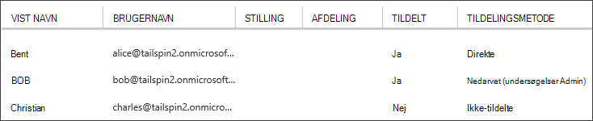

<properties
   pageTitle="Programmet roller | Microsoft Azure"
   description="Hvordan du udfører godkendelse ved hjælp af programmet roller"
   services=""
   documentationCenter="na"
   authors="MikeWasson"
   manager="roshar"
   editor=""
   tags=""/>

<tags
   ms.service="guidance"
   ms.devlang="dotnet"
   ms.topic="article"
   ms.tgt_pltfrm="na"
   ms.workload="na"
   ms.date="02/16/2016"
   ms.author="mwasson"/>

#  <a name="application-roles-in-multitenant-applications"></a>Programmet roller i multiprofiler programmer

[AZURE.INCLUDE [pnp-header](../../includes/guidance-pnp-header-include.md)]

I denne artikel er [en del af en række]. Der er også en komplet [Northwind] , der følger med denne serie.

Programmet roller bruges til at tildele tilladelser til brugere. For eksempel [Hold undersøgelser] [ Tailspin] program definerer følgende roller:

- Administrator. Kan udføre alle CRUD-handlinger på en undersøgelse, der hører til den pågældende lejer.
- Creator. Kan oprette nye undersøgelser.
- Læser. En hvilken som helst undersøgelser, der hører til den pågældende lejer kan læse.

Du kan se, at roller i sidste ende få oversættes til tilladelser under [godkendelse]. Men det første spørgsmål om at tildele og administrere roller. Vi identificeret tre overordnede indstillinger:

-   [Azure AD App roller](#roles-using-azure-ad-app-roles)
-   [Azure AD-sikkerhedsgrupper](#roles-using-azure-ad-security-groups)
-   [Rolle programadministrator](#roles-using-an-application-role-manager).

## <a name="roles-using-azure-ad-app-roles"></a>Roller ved hjælp af Azure AD App roller

Dette er den måde, som vi har brugt i appen Hold undersøgelser.

I denne metode definerer feltet SaaS udbyder programrollerne ved at føje dem til programmanifestet. Når en kunde tilmelder, tildeler administrator for kundens AD directory brugere til rollerne. Når en bruger logger på, sendes de tildelte brugerroller som krav.

> [AZURE.NOTE] Hvis kunden har Azure AD Premium, administrator kan tildele en sikkerhedsgruppe til en rolle, og medlemmer af gruppen arver rollen app. Dette er en praktisk metode til at administrere roller, fordi gruppeejeren ikke behøver at være administrator AD

Fordele ved denne fremgangsmåde:

-   Enkel programming model.
-   Roller er specifikke for programmet. Rolle krav om ét program sendes ikke til et andet program.
-   Hvis kunden fjerner programmet fra deres AD-lejer, gå rollerne, der ikke til stede.
-   Programmet er ikke nødvendigt eventuelle ekstra Active Directory-tilladelser, end læse brugerens profil.

Ulemper:

- Kunder uden Azure AD Premium kan ikke tildele roller sikkerhedsgrupper. Alle bruger opgaver skal udføres af en administrator AD for disse kunder.
- Hvis du har en back end-web API, som er separat fra WebApp, gælder ikke rolletildelinger for webappen for World Wide web API. Flere beskrivelse af dette punkt finder du under [sikring af en back-end web API].

### <a name="implementation"></a>Implementering

**Definer rollerne.** Provideren SaaS erklærer app roller i [programmanifestet]. Her er for eksempel feltets manifest undersøgelser app:

```
"appRoles": [
  {
    "allowedMemberTypes": [
      "User"
    ],
    "description": "Creators can create Surveys",
    "displayName": "SurveyCreator",
    "id": "1b4f816e-5eaf-48b9-8613-7923830595ad",
    "isEnabled": true,
    "value": "SurveyCreator"
  },
  {
    "allowedMemberTypes": [
      "User"
    ],
    "description": "Administrators can manage the Surveys in their tenant",
    "displayName": "SurveyAdmin",
    "id": "c20e145e-5459-4a6c-a074-b942bbd4cfe1",
    "isEnabled": true,
    "value": "SurveyAdmin"
  }
],
```

Den `value` egenskab vises i rolle kravet. Den `id` egenskaben er det entydige id for rollen defineret. Altid oprette en ny GUID værdi for `id`.

**Tildele brugere**. Når en ny kunde tilmelder sig, er programmet registreret i kundens AD-lejer. På dette tidspunkt kan administrator AD for lejeren tildele brugere til roller.

> [AZURE.NOTE] Som nævnt tidligere, kan kunder med Azure AD Premium også tildele sikkerhedsgrupper roller.

Fra portalen Azure følgende skærmbillede viser tre brugere. Bent blev tildelt direkte til en rolle. BOB nedarvet en rolle som medlem af en sikkerhedsgruppe med navnet "Undersøgelser Admin", som er tildelt til en rolle. Christian er ikke tildelt til en rolle.



> [AZURE.NOTE] Du kan også kan programmet tildele roller fra et program, ved hjælp af Azure AD Graph API.  Dog kræver dette program tilladelse til at få tilladelse til at skrive for kundens AD mappe. Et program med disse tilladelser kan gøre mange ulempe &mdash; kunden have tillid til appen ikke for at lave fejl deres mappe. Mange kunder kan være rede til at give denne adgangsniveau.

**Få rolle krav**. Når en bruger logger på, programmet modtager brugerens tildelte roller i et krav med type `http://schemas.microsoft.com/ws/2008/06/identity/claims/role`.  

En bruger kan have flere roller eller ingen rolle. I din godkendelseskode forudsætter ikke brugeren har ét rolle gøre krav. I stedet, skrive programkode, der kontrollerer, om værdien i et bestemt kravet er til stede:

```csharp
if (context.User.HasClaim(ClaimTypes.Role, "Admin")) { ... }
```

## <a name="roles-using-azure-ad-security-groups"></a>Roller ved hjælp af Azure AD-sikkerhedsgrupper

I denne metode repræsenteres roller som AD sikkerhedsgrupper. Programmet tildeler tilladelser til brugere, der er baseret på deres medlemskaber af sikkerhedsgrupper.

Fordele:

-   For kunder, der ikke har Azure AD Premium, så denne metode kunden kan bruge sikkerhedsgrupper til at administrere rolletildelinger.

Ulemper:

- Kompleksitet. Da hver lejer sender anden gruppe krav, APP'en skal holde styr på som sikkerhedsgrupper svarer til hvilke programmet roller for hver lejer.
- Hvis kunden fjerner programmet fra deres AD-lejer, bevares sikkerhedsgrupperne i deres AD-mappe.

### <a name="implementation"></a>Implementering

I programmanifestet, angive den `groupMembershipClaims` egenskab, der skal "SecurityGroup". Det er nødvendigt at få gruppe medlemskab krav fra AAD.

```
{
   // ...
   "groupMembershipClaims": "SecurityGroup",
}
```

Når en ny kunde tilmelder sig, får programmet kunden til at oprette sikkerhedsgrupper for de roller, der skal bruges af programmet. Kunden skal derefter angive gruppeobjektet id'er i programmet. Programmet gemmer disse i en tabel, der knytter gruppe-id'er til programmet roller, per lejer.

> [AZURE.NOTE] Du kan også kunne programmet oprette grupperne fra et program, ved hjælp af Azure AD Graph API.  Det vil sige mindre i fejl. Men det kræver, at programmet til at hente "læse og skrive alle grupper" tilladelser for kundens AD directory. Mange kunder kan være rede til at give denne adgangsniveau.

Når en bruger logger på:

1.  Brugerens grupper modtager programmet, som krav. Værdien af hver enkelt ansøgning er objekt-ID for en gruppe.
2.  Azure AD begrænser antallet af grupper, der er sendt i tokenet. Hvis antallet af grupper overskrider denne grænse, sender Azure AD "forældede" særlige krav. Hvis kravet er til stede, skal programmet forespørge Azure AD Graph API for at få alle de grupper, som den pågældende bruger tilhører. Yderligere oplysninger finder du [godkendelse i skyen programmer, der bruger AD grupper] under afsnittet "Grupper gøre krav overskud".
3.  Programmet søger efter objekt-id'er i sin egen database til at finde de tilsvarende programmet roller til at tildele til brugeren.
4.  Programmet føjer værdien i et brugerdefineret kravet til hovedstolen bruger, der udtrykker rollen programmet på computeren. For eksempel: `survey_role` = "SurveyAdmin".

Godkendelse politikker skal bruge kravet brugerdefineret rolle ikke gruppen gøre krav.

## <a name="roles-using-an-application-role-manager"></a>Roller ved hjælp af en rolle programadministrator

Med denne metode gemmes programmet roller ikke i Azure AD overhovedet. I stedet, gemmer programmet rolletildelinger for hver bruger i sin egen DB &mdash; for eksempel bruge klassen **RoleManager** i ASP.NET identitet.

Fordele:

-   Appen har fuld kontrol over roller og brugertildelinger.

Ulemper:

- Mere komplekse, sværere at vedligeholde.
- AD-sikkerhedsgrupper kan ikke bruge til at administrere rolletildelinger.
- Gemmer brugeroplysninger i databasen, hvor det får ikke synkroniseret med lejerens AD directory, som brugere tilføjes eller fjernes.   

Der findes mange eksisterende eksempler på denne metode. For eksempel skal du se [oprette en ASP.NET MVC app med auth og SQL DB og installere til Azure App-tjenesten].

## <a name="next-steps"></a>Næste trin

- Læs næste artikel i denne serie: [rollebaseret og ressource-baseret godkendelse i multiprofiler programmer][godkendelse]

<!-- Links -->
[Tailspin]: guidance-multitenant-identity-tailspin.md
[en del af en serie]: guidance-multitenant-identity.md
[godkendelse]: guidance-multitenant-identity-authorize.md
[Sikring af en back end-web API]: guidance-multitenant-identity-web-api.md
[Oprette en ASP.NET MVC app med auth og SQL DB og installere til Azure App-tjenesten]: ../app-service-web/web-sites-dotnet-deploy-aspnet-mvc-app-membership-oauth-sql-database.md
[progammanifest]: ../active-directory/active-directory-application-manifest.md
[Northwind]: https://github.com/Azure-Samples/guidance-identity-management-for-multitenant-apps
