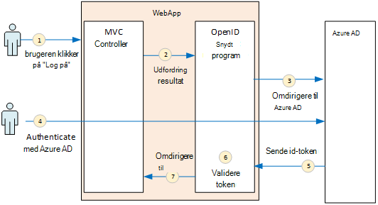
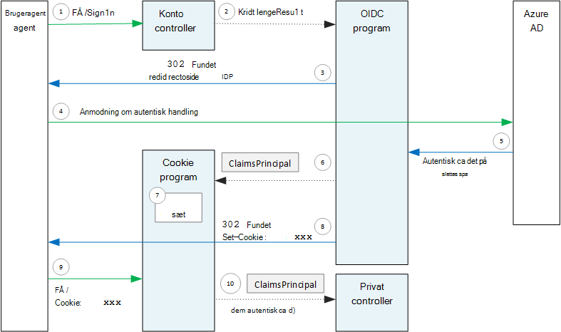

<properties
   pageTitle="Godkendelse i multiprofiler programmer | Microsoft Azure"
   description="Hvordan et multiprofiler program kan godkende brugere fra Azure AD"
   services=""
   documentationCenter="na"
   authors="MikeWasson"
   manager="roshar"
   editor=""
   tags=""/>

<tags
   ms.service="guidance"
   ms.devlang="dotnet"
   ms.topic="article"
   ms.tgt_pltfrm="na"
   ms.workload="na"
   ms.date="05/23/2016"
   ms.author="mwasson"/>

# <a name="authentication-in-multitenant-apps-using-azure-ad-and-openid-connect"></a>Godkendelse i multiprofiler apps, ved hjælp af Azure AD og OpenID forbinde

[AZURE.INCLUDE [pnp-header](../../includes/guidance-pnp-header-include.md)]

I denne artikel er [en del af en række](guidance-multitenant-identity.md). Der er også en komplet [Northwind] , der følger med denne serie.

I denne artikel beskrives, hvordan et multiprofiler program kan godkende brugere fra Azure Active Directory (Azure AD), ved hjælp af OpenID forbinde (OIDC) til at godkende.

## <a name="overview"></a>Oversigt

Vores [referenceimplementering](guidance-multitenant-identity-tailspin.md) er en ASP.NET Core 1.0-program. Programmet bruger den indbyggede OpenID forbinde programmer til at udføre OIDC godkendelse strømmen. I det følgende diagram viser, hvad der sker, når brugeren logger på, på et højt niveau.



1.  Brugeren klikker på knappen "Log på" i appen. Denne handling håndteres af en MVC controller.
2.  MVC controller returnerer en **ChallengeResult** handling.
3.  Program opfanger **ChallengeResult** og opretter et 302 svar, som omdirigerer brugeren til Azure AD-logonsiden.
4.  Brugeren skal godkende med Azure AD.
5.  Azure AD sender et ID-token til programmet.
6.  Programmer valideret ID tokenet. Brugeren er på dette tidspunkt nu godkendt i programmet.
7.  Programmer omdirigerer brugeren tilbage til programmet.

## <a name="register-the-app-with-azure-ad"></a>Registrere appen med Azure AD

Hvis du vil aktivere OpenID forbinde, registrerer provideren SaaS programmet i deres egen Azure AD-lejer.

Du kan registrere programmet ved at følge trinnene i [Integrering af programmer med Azure Active Directory](../active-directory/active-directory-integrating-applications.md)i sektionen, [tilføje et program](../active-directory/active-directory-integrating-applications.md#adding-an-application).

På siden **Konfigurer** :

-   Bemærk klient-ID.
-   Vælg **Ja**under **programmet er flere lejer**.
-   Angive **Svar URL-adresse** til en URL-adresse, hvor Azure AD sender godkendelse svaret. Du kan bruge din app base URL-adressen.
  - Bemærk: URL-sti kan være noget, så længe værtsnavnet stemmer overens med din udløst app.
  - Du kan angive flere svar URL-adresser. Under udvikling, kan du bruge en `localhost` adresse for at køre appen lokalt.
-   Generere en klient hemmeligt: Under **taster**, klik på rullelisten, der står **Vælg varighed** og vælg enten 1 eller 2 år. Tasten bliver synlige, når du klikker på **Gem**. Sørg for at kopiere værdien, fordi den ikke vises igen, når du indlæser konfigurationssiden.

## <a name="configure-the-auth-middleware"></a>Konfigurere auth-programmer

I dette afsnit beskrives, hvordan du konfigurerer godkendelse program i ASP.NET Core 1.0 til multiprofiler godkendelse med OpenID forbindelse.

Tilføj den OpenID forbinde programmer i klasse start:

```csharp
app.UseOpenIdConnectAuthentication(options =>
{
    options.AutomaticAuthenticate = true;
    options.AutomaticChallenge = true;
    options.ClientId = [client ID];
    options.Authority = "https://login.microsoftonline.com/common/";
    options.CallbackPath = [callback path];
    options.PostLogoutRedirectUri = [application URI];
    options.SignInScheme = CookieAuthenticationDefaults.AuthenticationScheme;
    options.TokenValidationParameters = new TokenValidationParameters
    {
        ValidateIssuer = false
    };
    options.Events = [event callbacks];
});
```

> [AZURE.NOTE] Se [Startup.cs](https://github.com/Azure-Samples/guidance-identity-management-for-multitenant-apps/blob/master/src/Tailspin.Surveys.Web/Startup.cs).

Se [Start af programmet](https://docs.asp.net/en/latest/fundamentals/startup.html) i dokumentationen til ASP.NET Core 1.0 kan finde flere oplysninger om klassen Start.

Angive indstillinger for følgende programmer:

- **ClientId**. Programmets klient-ID, som du har fået, når du har registreret programmet i Azure AD.
- **Nøglecenter**. Angiv dette til et multiprofiler program til `https://login.microsoftonline.com/common/`. Dette er URL-adressen til den almindelige Azure AD-slutpunkt, som gør det muligt for brugere fra en hvilken som helst Azure AD-lejer til at logge på. Du kan finde flere oplysninger om almindelige slutpunktet, [dette blogindlæg](http://www.cloudidentity.com/blog/2014/08/26/the-common-endpoint-walks-like-a-tenant-talks-like-a-tenant-but-is-not-a-tenant/).
- Angive **ValidateIssuer** i **TokenValidationParameters**til falsk. Det betyder, at app skal være ansvarlig for at validere udsteder værdien i ID-tokenet. (Program valideret stadig tokenet selve). Du kan finde flere oplysninger om validering af udstederen, [udsteder validering](guidance-multitenant-identity-claims.md#issuer-validation).
- **CallbackPath**. Dette angives lig med stien i svar URL-adresse, der er registreret i Azure AD. Eksempelvis hvis svar URL-adressen er `http://contoso.com/aadsignin`, **CallbackPath** skal være `aadsignin`. Hvis du ikke angiver denne indstilling, er standardværdien `signin-oidc`.
- **PostLogoutRedirectUri**. Angive en URL-adresse for at omdirigere brugere efter indstillingen Log af. Dette skal være en side, som gør det muligt for anonyme anmodninger &mdash; typisk på startsiden.
- **SignInScheme**. Angiv denne indstilling til `CookieAuthenticationDefaults.AuthenticationScheme`. Denne indstilling betyder, at når brugeren er godkendt, bruger krav er gemt lokalt i en cookie. Denne cookie er, hvordan brugeren bliver logget på i browseren.
- **Begivenheder.** Begivenhed tilbagekald; Se [godkendelse begivenheder](#authentication-events).

Også føje Cookiegodkendelse programmer til pipeline. Dette program er ansvarlig for oprettelsen af tjenesten bruger krav på en cookie, og derefter læsning cookie under efterfølgende siden indlæses.

```csharp
app.UseCookieAuthentication(options =>
{
    options.AutomaticAuthenticate = true;
    options.AutomaticChallenge = true;
    options.AccessDeniedPath = "/Home/Forbidden";
});
```

## <a name="initiate-the-authentication-flow"></a>Påbegynd strømmen godkendelse

For at starte godkendelse strømmen i ASP.NET MVC skal returnere en **ChallengeResult** fra contoller:

```csharp
[AllowAnonymous]
public IActionResult SignIn()
{
    return new ChallengeResult(
        OpenIdConnectDefaults.AuthenticationScheme,
        new AuthenticationProperties
        {
            IsPersistent = true,
            RedirectUri = Url.Action("SignInCallback", "Account")
        });
}
```

Derved de programmer, der kan returnere et 302 (fundet) svar, der omdirigerer til godkendelse slutpunkt.

## <a name="user-login-sessions"></a>Bruger login sessioner

Som nævnt, når brugeren logger først ind, skriver Cookiegodkendelse program bruger krav til en cookie. Herefter godkendes HTTP-anmodninger ved at læse cookien.

Som standard cookie programmer skriver en [sessionscookie][session-cookie], hvilke henter slettet én gang brugeren lukker browseren. Næste gang brugeren ud for webstedet, de skal logge på igen. Men hvis du indstiller **IsPersistent** til sand i **ChallengeResult**, programmer skriver en fast cookie, så brugeren bliver logget på, efter at have lukket browseren. Du kan konfigurere udløb cookies; [kontrollere cookie]mappeindstillingerne[cookie-options]. Fast cookies er mere praktisk for brugeren, men kan være upassende for visse programmer (sig, en bank program) hvor du vil bruger til at logge på hver gang.

## <a name="about-the-openid-connect-middleware"></a>Om OpenID forbinde-programmer

Den OpenID forbinde program i ASP.NET skjuler de fleste protocol detaljer. Dette afsnit indeholder nogle noter om implementering, kan være nyttige for at forstå protocol strømmen.

Først skal Lad os undersøge godkendelse strømmen med hensyn til ASP.NET (ignorere oplysninger med OIDC protocol forløb mellem app og Azure AD). I det følgende diagram viser processen.



I dette diagram er der to MVC enheder. Konto controlleren håndterer logonanmodninger, og hjem controlleren knyttet til startsiden.

Her er godkendelsesprocessen:

1. Brugeren klikker på knappen "Logon", og sender en GET-anmodning i browseren. For eksempel: `GET /Account/SignIn/`.
2. Konto controller returnerer en `ChallengeResult`.
3. OIDC programmer returnerer en HTTP 302 svar, omdirigerer til Azure AD.
4. Browseren sender anmodningen om godkendelse til Azure AD
5. Brugeren logger ind til Azure AD og Azure AD sender et godkendelsessvar.
6. OIDC-program opretter en krav hovedstolen og overfører dem til Cookiegodkendelse-programmer.
7. Cookie-program serializes krav hovedstolen og angiver en cookie.
8. OIDC programmer omdirigerer til programmets tilbagekald URL-adresse.
10. Browseren følger omdirigeringen, sende cookie i indkaldelsen.
11. Cookie-program deserializes cookie til et vigtigste krav og angiver `HttpContext.User` lig med hovedstolen krav. Anmodningen sendes til en MVC controller.

### <a name="authentication-ticket"></a>Godkendelse brugertilladelse

Hvis godkendelse lykkes, opretter OIDC program en godkendelse brugertilladelse, som indeholder en krav sikkerhedskonto, der indeholder brugerens krav. Du kan få adgang til brugertilladelse i hændelsen **AuthenticationValidated** eller **TicketReceived** .

> [AZURE.NOTE] Før hele godkendelse strømmen er afsluttet, `HttpContext.User` stadig indeholder en anonym ydelsen, _ikke_ den godkendte bruger. Anonym hovedstolen har en tom krænkelse af websteder. Når godkendelse er fuldført og omdirigeringer app cookie program deserializes godkendelse cookie og sæt `HttpContext.User` på et krav, der repræsenterer den godkendte bruger.

### <a name="authentication-events"></a>Godkendelse begivenheder

Under godkendelsesprocessen hæver den OpenID forbinde program en serie af hændelser:

- **RedirectToAuthenticationEndpoint**. Kaldes højre, før program, der omdirigerer til godkendelse slutpunkt. Du kan bruge denne hændelse til at ændre URL redirect; for eksempel, tilføje anmodning om parametre. Se [tilføje administrator samtykke prompten](guidance-multitenant-identity-signup.md#adding-the-admin-consent-prompt) for et eksempel.

- **AuthorizationResponseReceived**. Kaldet efter programmer modtager godkendelsessvar fra identitetsudbyder (IDP), men før program valideret svaret.  

- **AuthorizationCodeReceived**. Kaldet med godkendelseskoden.

- **TokenResponseReceived**. Kaldes, når programmer henter en access token fra IDP. Gælder kun for godkendelse kode forløb.

- **AuthenticationValidated**. Kaldes, når programmer har valideret id-token. På dette tidspunkt har programmet et sæt af valideret krav om brugeren. Du kan bruge denne hændelse til at udføre yderligere validering på krav eller til at transformere krav. Se [arbejde med krav](guidance-multitenant-identity-claims.md).

- **UserInformationReceived**. Kaldes, hvis program bliver brugerprofilen fra bruger oplysninger slutpunkt. Gælder kun for godkendelse kode flow og kun, når `GetClaimsFromUserInfoEndpoint = true` i indstillingerne for programmer.

- **TicketReceived**. Kaldes, når godkendelse er fuldført. Dette er den sidste hændelse, hvis du, at godkendelse lykkes. Når denne hændelse håndteres, er at brugeren logget på appen.

- **AuthenticationFailed**. Kaldes, hvis godkendelse mislykkes. Brug denne hændelse til at håndtere godkendelsesfejl &mdash; for eksempel ved at omdirigere til en fejlside.

Angiv indstillingen **begivenheder** på program, for at give tilbagekald til disse begivenheder. Der er to forskellige måder at erklære hændelseshandlerne: indbygget med lambdas eller i en klasse, der stammer fra **OpenIdConnectEvents**.

På linje med lambdas:

```csharp
app.UseOpenIdConnectAuthentication(options =>
{
    // Other options not shown.

    options.Events = new OpenIdConnectEvents
    {
        OnTicketReceived = (context) =>
        {
             // Handle event
             return Task.FromResult(0);
        },
        // other events
    }
});
```

**OpenIdConnectEvents**som følger:

```csharp
public class SurveyAuthenticationEvents : OpenIdConnectEvents
{
    public override Task TicketReceived(TicketReceivedContext context)
    {
        // Handle event
        return base.TicketReceived(context);
    }
    // other events
}

// In Startup.cs:
app.UseOpenIdConnectAuthentication(options =>
{
    // Other options not shown.

    options.Events = new SurveyAuthenticationEvents();
});
```

Den anden metode anbefales, hvis din begivenhed tilbagekald har en omfattende logik, så de ikke rod klasse Start. Vores referenceimplementering bruger denne metode Se [SurveyAuthenticationEvents.cs](https://github.com/Azure-Samples/guidance-identity-management-for-multitenant-apps/blob/master/src/Tailspin.Surveys.Web/Security/SurveyAuthenticationEvents.cs).

### <a name="openid-connect-endpoints"></a>OpenID forbinde slutpunkter

Azure AD understøtter [OpenID forbinde registrering](https://openid.net/specs/openid-connect-discovery-1_0.html), hvori identitetsudbyder (IDP) returnerer et JSON metadata dokument fra et [velkendt slutpunkt](https://openid.net/specs/openid-connect-discovery-1_0.html#ProviderConfig). Metadatadokumentet indeholder oplysninger som f.eks.:

-   URL-adressen på det godkendelse slutpunkt. Dette er hvor app'en omdirigerer for at godkende brugeren.
-   URL-adressen på det "afsluttet" slutpunkt, hvor appen går til at logge af brugeren.
-   URL-adresse at få de signerende nøgler, som klienten bruger til at validere OIDC tokens, som den bliver fra IDP.

Som standard ved OIDC programmer, hvordan du kan hente denne metadata. Angiv indstillingen **nøglecenter** i program, og programmer konstruktioner URL-adressen for metadataene. (Du kan tilsidesætte metadata URL-adressen ved at angive indstillingen **MetadataAddress** .)

### <a name="openid-connect-flows"></a>OpenID forbinde flyder

Som standard bruger OIDC program hybrid flow med formular indlæg svar tilstand.

-   _Hybrid flow_ betyder, at klienten kan få et ID-token og en tilladelse kode i den samme kørsel til godkendelse-serveren.
-   _Formular sende svar tilstand_ betyder, at godkendelse serveren bruger HTTP-SENDE en anmodning om en til at sende id-token og godkendelse koden til appen. Værdierne, der er formular urlencoded (indholdstype = "program/x-www-form-urlencoded").

Når OIDC program omdirigerer til godkendelse slutpunktet, omfatter alle forespørgselsparametre streng, der bruges til OIDC Omdiriger URL-adressen. For hybride flow:

-   client_id. Denne værdi er angivet i indstillingen **ClientId**
-   omfang = "openid profil", hvilket betyder, at det er en anmodning om en OIDC og vi vil brugerens profil.
-   response_type = "kode id_token". Dette angiver hybrid forløb.
-   response_mode = "form_post". Dette angiver Svarblanket til indlæg.

For at angive et andet flow, skal du angive egenskaben **ResponseType** på indstillinger. Eksempel:

```csharp
app.UseOpenIdConnectAuthentication(options =>
{
    options.ResponseType = "code"; // Authorization code flow

    // Other options
}
```

## <a name="next-steps"></a>Næste trin

- Læs næste artikel i denne serie: [arbejde med kravbaseret identiteter i multiprofiler programmer][claims]


[claims]: guidance-multitenant-identity-claims.md
[cookie-options]: https://docs.asp.net/en/latest/security/authentication/cookie.html#controlling-cookie-options
[session-cookie]: https://en.wikipedia.org/wiki/HTTP_cookie#Session_cookie
[Northwind]: https://github.com/Azure-Samples/guidance-identity-management-for-multitenant-apps
