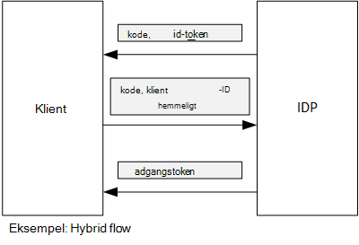

<properties
   pageTitle="Brug af klienten program til at få adgangstokens fra Azure AD | Microsoft Azure"
   description="Sådan bruges klient program til at få adgangstokens fra Azure AD."
   services=""
   documentationCenter="na"
   authors="MikeWasson"
   manager="roshar"
   editor=""
   tags=""/>

<tags
   ms.service="guidance"
   ms.devlang="dotnet"
   ms.topic="article"
   ms.tgt_pltfrm="na"
   ms.workload="na"
   ms.date="05/23/2016"
   ms.author="mwasson"/>

# <a name="using-client-assertion-to-get-access-tokens-from-azure-ad"></a>Brug af klienten program til at få adgangstokens fra Azure AD

[AZURE.INCLUDE [pnp-header](../../includes/guidance-pnp-header-include.md)]

I denne artikel er [en del af en række]. Der er også en komplet [Northwind] , der følger med denne serie.

## <a name="background"></a>Baggrund

Når du bruger godkendelse kode forløb eller hybrid flow i OpenID forbinde, samtaler klienten en tilladelse kode for et adgangstoken. I dette trin har klienten at godkende sig selv på serveren.



Der er en metode til at godkende klienten ved hjælp af en klient hemmeligt. Det er hvordan [Hold undersøgelser] [ Surveys] program som standard er konfigureret.

Her er et eksempel anmodning fra klienten til IDP, anmoder om et adgangstoken. Bemærk de `client_secret` parameter.

```
POST https://login.microsoftonline.com/b9bd2162xxx/oauth2/token HTTP/1.1
Content-Type: application/x-www-form-urlencoded

resource=https://tailspin.onmicrosoft.com/surveys.webapi
  &client_id=87df91dc-63de-4765-8701-b59cc8bd9e11
  &client_secret=i3Bf12Dn...
  &grant_type=authorization_code
  &code=PG8wJG6Y...
```

Hemmeligheden er bare en streng, så du behøver at sørge for ikke at trænger værdien. Den bedste fremgangsmåde er at holde klient hemmeligt af versionsstyring. Når du installerer til Azure, gemme hemmeligheden i en [app indstilling][configure-web-app].

Alle med adgang til Azure abonnementet kan dog få vist app-indstillinger. Desuden er der altid en fristelsen til at kontrollere hemmeligheder til versionsstyring (f.eks., i installation scripts), dele dem via mail og så videre.

Du kan bruge [klient program] i stedet for en klient hemmeligt for ekstra sikkerhed. Med klient program bruger klienten et x.509-certifikat til at bevise token anmodningen blev modtaget fra klienten på computeren. Klientcertifikat er installeret på webserveren. Generelt, at det bliver nemmere at begrænse adgangen til certifikatet, end for at sikre, at ingen andre ved et uheld viser en klient hemmeligt. Du kan finde flere oplysninger om konfiguration af certifikater i en WebApp, se [Ved hjælp af certifikater i Azure websteder programmer][using-certs-in-websites]

Her er en token anmodning ved hjælp af klienten program:

```
POST https://login.microsoftonline.com/b9bd2162xxx/oauth2/token HTTP/1.1
Content-Type: application/x-www-form-urlencoded

resource=https://tailspin.onmicrosoft.com/surveys.webapi
  &client_id=87df91dc-63de-4765-8701-b59cc8bd9e11
  &client_assertion_type=urn:ietf:params:oauth:client-assertion-type:jwt-bearer
  &client_assertion=eyJhbGci...
  &grant_type=authorization_code
  &code= PG8wJG6Y...
```

Bemærk, at den `client_secret` parameter ikke længere bruges. I stedet på `client_assertion` parameter indeholder et JWT token, som blev signeret ved hjælp af klientcertifikat. Den `client_assertion_type` parameter angiver typen program &mdash; i dette tilfælde JWT symbol. Serveren kontrollerer JWT tokenet. Hvis JWT Tokenet er ugyldigt, returnerer token anmodning om en fejl.

> [AZURE.NOTE] X.509-certifikater er ikke kun form af klienten program; Vi fokuserer på den her fordi det understøttes af Azure AD.

## <a name="using-client-assertion-in-the-surveys-application"></a>Brug af klienten program i programmet undersøgelser

Dette afsnit viser, hvordan du konfigurerer Hold undersøgelser program tilladelse til at bruge klienten program. I disse trin, du opretter et selvsigneret certifikat, der er velegnet til udvikling, men ikke til daglig drift.

1. Køre PowerShell-script [/Scripts/Setup-KeyVault.ps1] [ Setup-KeyVault] på følgende måde:

    ```
    .\Setup-KeyVault.ps -Subject [subject]
    ```

    For den `Subject` parameter, Skriv et navn, som "surveysapp". Scriptet genererer et selvsigneret certifikat og gemmer den i "aktuelle bruger/personlig" certifikat store.

2. Output fra scriptet er et JSON-fragment. Tilføje denne værdi i programmanifestet af web app, som følger:

    1. Log på [administrationsportalen til af Azure] [ azure-management-portal] og gå til din Azure AD-mappe.

    2. Klik på **programmer**.

    3. Vælg undersøgelser programmet.

    4.  Klik på **Administrer manifestet** , og vælg **Download manifestet**.

    5.  Åbn manifestfilen JSON i et tekstredigeringsprogram. Indsætte output fra scriptet til den `keyCredentials` egenskab. Det skal ligne følgende:

        ```    
        "keyCredentials": [
            {
              "type": "AsymmetricX509Cert",
              "usage": "Verify",
              "keyId": "29d4f7db-0539-455e-b708-....",
              "customKeyIdentifier": "ZEPpP/+KJe2fVDBNaPNOTDoJMac=",
              "value": "MIIDAjCCAeqgAwIBAgIQFxeRiU59eL.....
            }
          ],
         ```

    6.  Gemme dine ændringer i filen JSON.

    7.  Gå tilbage til portalen. Klik på **Administrer manifestet** > **Overføre manifestet** og overfør filen JSON.

3. Kør følgende kommando for at få miniature certifikatets.

    ```
    certutil -store -user my [subject]
    ```

    hvor `[subject]` er den værdi, du har angivet for emne i PowerShell-script. Miniature står anført under "Cert Hash(sha1)". Fjerne mellemrum mellem de hexadecimale tal.

4. Opdater din app hemmeligheder. Højreklik Tailspin.Surveys.Web projektet i Solution Explorer, og vælg **Administrer bruger hemmeligheder**. Tilføje en post til "Asymmetric" under "AzureAd", som vist nedenfor:

    ```
    {
      "AzureAd": {
        "ClientId": "[Surveys application client ID]",
        // "ClientSecret": "[client secret]",  << Delete this entry
        "PostLogoutRedirectUri": "https://localhost:44300/",
        "WebApiResourceId": "[App ID URI of your Survey.WebAPI application]",
        // new:
        "Asymmetric": {
          "CertificateThumbprint": "[certificate thumbprint]",  // Example: "105b2ff3bc842c53582661716db1b7cdc6b43ec9"
          "StoreName": "My",
          "StoreLocation": "CurrentUser",
          "ValidationRequired": "false"
        }
      },
      "Redis": {
        "Configuration": "[Redis connection string]"
      }
    }
    ```

    Du skal angive `ValidationRequired` til falsk, fordi certifikatet, der ikke var en signeret af en rod CA nøglecenter. Brug et certifikat, der er signeret af et Nøglecenter nøglecenter og angive fremstilling, `ValidationRequired` til sand.

    Også slette indtastningen for `ClientSecret`, fordi det ikke er nødvendigt med klient program.

5. Find den kode, der registrerer i Startup.cs, den `ICredentialService`. Fjern kommentar fra den linje, der bruger `CertificateCredentialService`, og kommentar udpege den linje, der bruger `ClientCredentialService`:

    ```csharp
    // Uncomment this:
    services.AddSingleton<ICredentialService, CertificateCredentialService>();
    // Comment out this:
    //services.AddSingleton<ICredentialService, ClientCredentialService>();
    ```

På kørselstidspunktet læser webprogrammet certifikatet fra certifikat store. Certifikatet, der skal være installeret på den samme computer som WebApp.

## <a name="next-steps"></a>Næste trin

- Læs næste artikel i denne serie: [Ved hjælp af Azure nøgle samling til at beskytte programmet hemmeligheder][key vault]


<!-- Links -->
[configure-web-app]: ../app-service-web/web-sites-configure.md
[azure-management-portal]: https://manage.windowsazure.com
[klient-program]: https://tools.ietf.org/html/rfc7521
[key vault]: guidance-multitenant-identity-keyvault.md
[Setup-KeyVault]: https://github.com/Azure-Samples/guidance-identity-management-for-multitenant-apps/blob/master/scripts/Setup-KeyVault.ps1
[Surveys]: guidance-multitenant-identity-tailspin.md
[using-certs-in-websites]: https://azure.microsoft.com/blog/using-certificates-in-azure-websites-applications/
[en del af en serie]: guidance-multitenant-identity.md
[Northwind]: https://github.com/Azure-Samples/guidance-identity-management-for-multitenant-apps
