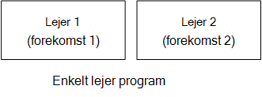

<properties
   pageTitle="Identitet administration til multiprofiler programmer | Microsoft Azure"
   description="Introduktion til administration af identitet i multiprofiler programmer"
   services=""
   documentationCenter="na"
   authors="MikeWasson"
   manager="roshar"
   editor=""
   tags=""/>

<tags
   ms.service="guidance"
   ms.devlang="dotnet"
   ms.topic="article"
   ms.tgt_pltfrm="na"
   ms.workload="na"
   ms.date="06/02/2016"
   ms.author="mwasson"/>

# Introduktion til administration af identitet til multiprofiler programmer i Microsoft Azure

[AZURE.INCLUDE [pnp-header](../../includes/guidance-pnp-header-include.md)]

I denne artikel er [en del af en række]. Der er også en komplet [Northwind] , der følger med denne serie.

Antag, at du skriver en enterprise SaaS program tilladelse til at være placeret i skyen. Programmet får naturligvis brugere:

Men disse brugere tilhører organisationer:

Eksempel: Hold sælger abonnementer til dens SaaS program. Contoso og Fabrikam Tilmeld dig programmet. Når Bent (`alice@contoso`) tegn i, skal programmet ved, at Bent er en del af Contoso.

- Bent _skal_ have adgang til Contoso data.
- Bent _må ikke_ have adgang til Fabrikam data.

Denne vejledning viser dig, hvordan du administrerer bruger-id'er i en multiprofiler program, ved hjælp af [Azure Active Directory] [ AzureAD] (Azure AD) til at håndtere logon og godkendelse.

## Hvad er multitenancy?

En _lejer_ er en gruppe af brugere. I et SaaS til computeren er lejeren et abonnement eller en kunde af programmet. _Multitenancy_ er en arkitektur, hvor flere lejere dele den samme fysiske forekomst af appen. Selvom lejere deler fysisk ressourcer (såsom FOS eller lagerplads), får hver lejer sin egen logiske forekomst af appen.

Typisk programmet data, der deles af brugere i en lejer, men ikke med andre lejere.

Sammenligne denne arkitektur med en enkelt lejer arkitektur, hvor hver lejer har en dedikeret fysisk forekomst. I en enkelt arkitekturer, kan du tilføje lejere ved ideer op nye forekomster af appen.

### Multitenancy og vandret skalering

For at opnå skala i skyen, er det almindelige tilføje mere fysisk forekomster. Dette kaldes også _vandret skalering_ eller _Skalering ud_. Overvej en web-app. Hvis du vil håndtere mere trafik, kan du tilføje flere server FOS og placere dem bag en justering af belastning. Hver VM kører en separat fysisk forekomst af WebApp.

Enhver anmodning kan sendes til en hvilken som helst forekomst. Systemet fungerer sammen, som en enkelt logisk forekomst. Du kan nedbryde en VM eller rotation af en ny VM, uden at påvirke brugere. I denne arkitektur hver fysisk forekomst er flere lejer, og du skalere ved at tilføje flere forekomster. Hvis én forekomst går ned, påvirker det skal ikke er en hvilken som helst lejeradministration.

## Identitet i en multiprofiler app

I en multiprofiler app, skal du overveje brugere i forbindelse med lejere.

**Godkendelse**

- Brugere logge på appen med deres organisation legitimationsoplysninger. De behøver ikke at oprette nye brugerprofiler for appen.
- Brugere i samme organisation er en del af samme lejer.
- Når en bruger logger på, ved programmet, hvilke lejer, brugeren tilhører.

**Godkendelse**

- Når du giver en brugers handlinger (f.eks., få vist en ressource), skal brugerens lejer, app tage hensyn.
- Brugere kan være tildelt roller i programmet, som "Administrator" eller "standardbruger". Rolletildelinger skal administreres af kunden ikke af provideren SaaS.

**Eksempel.** Bent, en medarbejder hos Contoso, fører til programmet i sin browser og klikker på knappen "Log på". Hun omdirigeres til en logonskærmen, hvor hun angiver sine virksomhedens legitimationsoplysninger (brugernavn og din adgangskode). På dette tidspunkt hun er logget på app som `alice@contoso.com`. Programmet kender også, at Bent er administrator for dette program. Da hun er administrator, kan hun se en liste over alle de ressourcer, der hører til Contoso. Hun kan dog få vist Fabrikams ressourcer, da hun er administrator kun inden for sin lejer.

I denne vejledning, vil vi se specifikt på ved hjælp af Azure AD til administration af identitet.

- Vi antager, at kunden gemmer deres brugerprofiler i Azure AD (herunder Office365 og Dynamics CRM lejere)
- Kunder med lokalt Active Directory (AD) kan bruge [Azure AD-forbindelse] [ ADConnect] synkronisere deres lokalt AD med Azure AD.

Hvis en kunde med lokale-AD ikke kan bruge Azure AD-forbindelse (på grund af virksomhedens IT-politik eller andre grunde), er SaaS udbyder kan oprette til kunden AD gennem Active Directory Federation Services (AD FS). Denne indstilling er beskrevet i [Federating med en kundes AD FS].

Denne vejledning overveje ikke andre aspekter af multitenancy som datapartitionering, per lejer konfiguration og så videre.

## Næste trin

- Læs næste artikel i denne serie: [om feltet Hold undersøgelser program][tailpin]

<!-- Links -->
[ADConnect]: ../active-directory/active-directory-aadconnect.md
[AzureAD]: https://azure.microsoft.com/documentation/services/active-directory/
[en del af en serie]: guidance-multitenant-identity.md
[En sammenslutning til en kundes AD FS]: guidance-multitenant-identity-adfs.md
[Northwind]: https://github.com/Azure-Samples/guidance-identity-management-for-multitenant-apps
[tailpin]: guidance-multitenant-identity-tailspin.md
