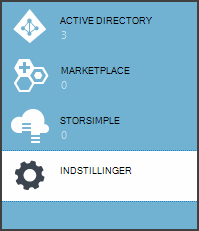
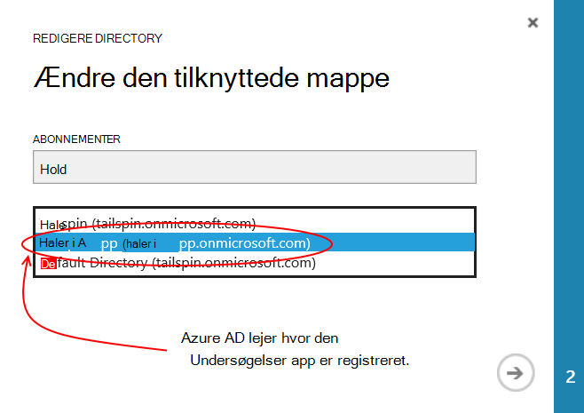
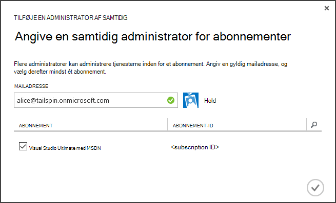
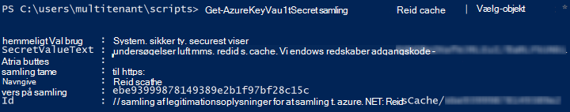

<properties
   pageTitle="Bruger nøgle samling af legitimationsoplysninger til at beskytte programmet hemmeligheder | Microsoft Azure"
   description="Hvordan Brug tasten samling tjenesten til at gemme programmet hemmeligheder"
   services=""
   documentationCenter="na"
   authors="MikeWasson"
   manager="roshar"
   editor=""
   tags=""/>

<tags
   ms.service="guidance"
   ms.devlang="dotnet"
   ms.topic="article"
   ms.tgt_pltfrm="na"
   ms.workload="na"
   ms.date="02/16/2016"
   ms.author="mwasson"/>

# <a name="using-azure-key-vault-to-protect-application-secrets"></a>Bruger Azure-tasten samling til at beskytte programmet hemmeligheder

[AZURE.INCLUDE [pnp-header](../../includes/guidance-pnp-header-include.md)]

I denne artikel er [en del af en række]. Der er også en komplet [Northwind] , der følger med denne serie.

## <a name="overview"></a>Oversigt

Det er fælles for har programindstillinger, som er følsomme og skal beskyttes, f.eks.:

- Database forbindelsesstrenge
- Adgangskoder
- Cryptographic taster

Som en bedste fremgangsmåde sikkerhed, skal du aldrig gemme disse hemmeligheder i versionsstyring. Det er også nemt for at de kan trænger &mdash; selvom din kilde kode lager er private. Og det så godt holder ikke hemmeligheder fra generelt offentlige. På større projekter, kan du vil begrænse hvilke udviklere og operatorer kan få adgang til fremstilling hemmeligheder. (Indstillinger for test- eller udviklingsmiljø miljøer er forskellige).

En mere sikker mulighed er at gemme disse hemmeligheder i [Azure nøgle samling][KeyVault]. Nøgle samling er en skybaseret hostet tjeneste til administration af cryptographic nøgler og andre hemmeligheder. I denne artikel viser, hvordan du bruger tasten samling af legitimationsoplysninger til at gemme konfigurationsindstillinger for du app.

I [Hold undersøgelser] [ Surveys] -program, er følgende indstillinger hemmeligt:

- Forbindelsesstrengen til databasen.
- Forbindelsesstrengen Redis.
- Klient hemmeligt webprogrammet.

Hvis du vil lagre konfiguration hemmeligheder i nøgle samling, programmet undersøgelser implementerer en provider, brugerdefineret konfiguration, der henter til ASP.NET Core 1.0 [konfigurationssystem][configuration]. Den brugerdefinerede udbyder læser indstillinger for søgekonfiguration fra nøgle samling på Start.

Programmet undersøgelser indlæser indstillinger for søgekonfiguration fra følgende steder:

- Filen appsettings.json
- Den [bruger hemmeligheder gemme] [ user-secrets] (udviklingsmiljø kun; til test)
- Værtsmiljø (app indstillinger i Azure online)
- Vigtige samling

Hver af disse tilsidesætter den forrige opgave, så alle indstillingerne, der er gemt i nøgle samling går forud for.

> [AZURE.NOTE] Provideren nøgle samling konfiguration er som standard deaktiveret. Det er ikke er nødvendigt for at køre programmet lokalt. Du vil aktivere den i et produktionsmiljø.

> Provideren nøgle samling understøttes ikke i øjeblikket til .NET Core, fordi den kræver [Microsoft.Azure.KeyVault] [ Microsoft.Azure.KeyVault] pakke.

Ved start programmet læser indstillinger fra alle registrerede konfiguration udbyder og bruger dem til at udfylde et objekt på det kraftigste indtastede indstillinger. (Du kan finde flere oplysninger, se [ved hjælp af indstillinger og konfigurationsobjekter][options].)

## <a name="implementation"></a>Implementering

[KeyVaultConfigurationProvider] [ KeyVaultConfigurationProvider] klasse er en udbyder af konfiguration, der tilsluttes ASP.NET Core 1.0 [konfigurationssystem][configuration].

Bruge den `KeyVaultConfigurationProvider`, ringe på `AddKeyVaultSecrets` filtypenavn metode i klassen start:

```csharp
    var builder = new ConfigurationBuilder()
        .SetBasePath(appEnv.ApplicationBasePath)
        .AddJsonFile("appsettings.json");

    if (env.IsDevelopment())
    {
        builder.AddUserSecrets();
    }
    builder.AddEnvironmentVariables();
    var config = builder.Build();

    // Add key vault configuration:
    builder.AddKeyVaultSecrets(config["AzureAd:ClientId"],
        config["KeyVault:Name"],
        config["AzureAd:Asymmetric:CertificateThumbprint"],
        Convert.ToBoolean(config["AzureAd:Asymmetric:ValidationRequired"]),
        loggerFactory);
```

Bemærk, at `KeyVaultConfigurationProvider` kræver nogle konfigurationsindstillinger, der skal være gemt på en af de andre konfiguration kilder.

Når programmet starter, `KeyVaultConfigurationProvider` optælles alle hemmeligheder i den vigtige samling af legitimationsoplysninger. For hver hemmeligt søges der efter mærket med navnet 'ConfigKey'. Værdien af mærket er navnet på konfigurationsindstillingen.

> [AZURE.NOTE] [Mærker] [ key-tags] er valgfrit metadata, der er gemt med en nøgle. Mærker anvendes her, fordi vigtige navne ikke må indeholde kolon (:).

```csharp
var kvClient = new KeyVaultClient(GetTokenAsync);
var secretsResponseList = await kvClient.GetSecretsAsync(_vault, MaxSecrets, token);
foreach (var secretItem in secretsResponseList.Value)
{
    //The actual config key is stored in a tag with the Key "ConfigKey"
    // because ':' is not supported in a shared secret name by Key Vault.
    if (secretItem.Tags != null && secretItem.Tags.ContainsKey(ConfigKey))
    {
        var secret = await kvClient.GetSecretAsync(secretItem.Id, token);
        Data.Add(secret.Tags[ConfigKey], secret.Value);
    }
}
```

> [AZURE.NOTE] Se [KeyVaultConfigurationProvider.cs].

## <a name="setting-up-key-vault-in-the-surveys-app"></a>Konfiguration af nøgle samling i appen undersøgelser

Forudsætninger for:

- Installer [Azure ressourcestyring cmdletter][azure-rm-cmdlets].
- Konfigurere programmet undersøgelser, som beskrevet i [køre programmet undersøgelser][readme].

Overordnede trin:

1. Konfigurere administrator i lejeren.
2. Konfigurere et klientcertifikat.
3. Oprette en vigtige samling af legitimationsoplysninger.
4. Tilføj indstillinger for søgekonfiguration til din nøgle samling.
5. Fjern kommentar fra den kode, der gør det muligt for vigtige samling.
6. Opdater programmets bruger hemmeligheder.

### <a name="set-up-an-admin-user"></a>Konfigurere administrator

> [AZURE.NOTE] Hvis du vil oprette en vigtige samling, skal du bruge en konto, som kan administrere abonnementet Azure. Et program, du give tilladelse til at læse fra den vigtige samling af legitimationsoplysninger skal også registreret i samme lejer som denne konto.

I dette trin, vil du sikre dig, at du kan oprette en vigtige samling, mens logget på som en bruger fra de hvor undersøgelser app er registreret.

Først skal du ændre den mappe, der er knyttet til abonnementet Azure.

1. Log på [administrationsportalen til af Azure][azure-management-portal]

2. Klik på **Indstillinger**.

    

3. Vælg abonnementet Azure.

4. Klik på **Rediger Directory** nederst på portalen.

    

5. I "Ændre den tilknyttede mappe" skal du vælge den Azure AD-lejer, hvor undersøgelser program er registreret,

    

6. Klik på pileknappen og fuldføre dialogboksen.

Opret en administrator bruger inden for den Azure AD-lejer, hvor undersøgelser program er registreret.

1. Log på [administrationsportalen til af Azure][azure-management-portal].

2. Vælg den Azure AD-lejer, hvor dit program er registreret.

3. Klik på **brugere** > **Tilføj bruger**.

4. I dialogboksen **Tilføj bruger** , kan du tildele brugeren til den globale administratorrolle.

Tilføj administrator som samtidig administrator for dit Azure abonnement.

1. Log på [administrationsportalen til af Azure][azure-management-portal].

2. Klik på **Indstillinger** , og vælg abonnementet Azure.

3. Klik på **Administratorer**

4. Klik på **Tilføj** nederst på portalen.

5. Angiv mail for den bruger, administrator, som du tidligere har oprettet.

6. Markér afkrydsningsfeltet for abonnementet.

7. Klik på knappen markering for at fuldføre dialogboksen.




### <a name="set-up-a-client-certificate"></a>Konfigurere et klientcertifikat

1. Køre PowerShell-script [/Scripts/Setup-KeyVault.ps1] [ Setup-KeyVault] på følgende måde:
    ```
    .\Setup-KeyVault.ps1 -Subject <<subject>>
    ```
    For den `Subject` parameter, Skriv et navn, som "surveysapp". Scriptet genererer et selvsigneret certifikat og gemmer den i "aktuelle bruger/personlig" certifikat store.

2. Output fra scriptet er et JSON-fragment. Tilføje denne værdi i programmanifestet af web app, som følger:

    1. Log på [administrationsportalen til af Azure] [ azure-management-portal] og gå til din Azure AD-mappe.

    2. Klik på **programmer**.

    3. Vælg undersøgelser programmet.

    4.  Klik på **Administrer manifestet** , og vælg **Download manifestet**.

    5.  Åbn manifestfilen JSON i et tekstredigeringsprogram. Indsætte output fra scriptet til den `keyCredentials` egenskab. Det skal ligne følgende:
    ```
            "keyCredentials": [
                {
                  "type": "AsymmetricX509Cert",
                  "usage": "Verify",
                  "keyId": "29d4f7db-0539-455e-b708-....",
                  "customKeyIdentifier": "ZEPpP/+KJe2fVDBNaPNOTDoJMac=",
                  "value": "MIIDAjCCAeqgAwIBAgIQFxeRiU59eL.....
                }
              ],
    ```          
    6.  Gemme dine ændringer i filen JSON.

    7.  Gå tilbage til portalen. Klik på **Administrer manifestet** > **Overføre manifestet** og overfør filen JSON.

3. Tilføje det samme JSON-fragment til programmanifestet af web API (Surveys.WebAPI).

4. Kør følgende kommando for at få miniature certifikatets.
    ```
    certutil -store -user my [subject]
    ```
    hvor `[subject]` er den værdi, du har angivet for emne i PowerShell-script. Miniature står anført under "Cert Hash(sha1)". Fjerne mellemrum mellem de hexadecimale tal.

Du skal bruge miniature senere.

### <a name="create-a-key-vault"></a>Oprette en vigtige samling

1. Køre PowerShell-script [/Scripts/Setup-KeyVault.ps1] [ Setup-KeyVault] på følgende måde:

    ```
    .\Setup-KeyVault.ps1 -KeyVaultName <<key vault name>> -ResourceGroupName <<resource group name>> -Location <<location>>
    ```

    Når du bliver bedt om legitimationsoplysninger, log på som Azure AD-bruger, du oprettede tidligere. Scriptet opretter en ny ressourcegruppe og en ny nøgle samling inden for ressourcegruppen.

    Bemærk: For - parameteren placering, du kan bruge følgende PowerShell-kommando til at få en liste over gyldige områder:

    ```
    Get-AzureRmResourceProvider -ProviderNamespace "microsoft.keyvault" | Where-Object { $_.ResourceTypes.ResourceTypeName -eq "vaults" } | Select-Object -ExpandProperty Locations
    ```

2. Køre SetupKeyVault.ps igen, med følgende parametre:

    ```
    .\Setup-KeyVault.ps1 -KeyVaultName <<key vault name>> -ApplicationIds @("<<web app client ID>>", "<<web API client ID>>")
    ```

    hvor

    - vigtige samling navn = det navn, du har givet den vigtige samling af legitimationsoplysninger i ovenstående trin.
    - Web app-klient-ID = klient-ID for webprogram undersøgelser.
    - Web api klient-ID = klient-ID for Surveys.WebAPI programmet.

    Eksempel:
    ```
    .\Setup-KeyVault.ps1 -KeyVaultName tailspinkv -ApplicationIds @("f84df9d1-91cc-4603-b662-302db51f1031", "8871a4c2-2a23-4650-8b46-0625ff3928a6")
    ```

    > [AZURE.NOTE] Du kan få klienten id'er fra [Azure management portal][azure-management-portal]. Vælg Azure AD-lejer, vælg programmet, og klik på **Konfigurer**.

    Dette script godkender WebApp og web API til at hente hemmeligheder fra din nøgle samling. Se [Introduktion til Azure nøgle samling] [ authorize-app] kan finde flere oplysninger.

### <a name="add-configuration-settings-to-your-key-vault"></a>Føje konfigurationsindstillinger til din nøgle samling

1. Køre SetupKeyVault.ps på følgende måde:

    ```
    .\Setup-KeyVault.ps1 -KeyVaultName <<key vault name> -KeyName RedisCache -KeyValue "<<Redis DNS name>>.redis.cache.windows.net,password=<<Redis access key>>,ssl=true" -ConfigName "Redis:Configuration"
    ```
    hvor

    - vigtige samling navn = det navn, du har givet den vigtige samling af legitimationsoplysninger i ovenstående trin.
    - Redis DNS-navn = DNS-navnet på din Redis cache forekomst.
    - Redis hurtigtast = tasten adgang til din Redis cache forekomst.

    Denne kommando føjer et hemmeligt til din nøgle samling. Hemmeligheden er et navn/værdi-par plus et mærke:

    -   Navnet på den nøgle bruges ikke af programmet, men skal være entydig i den nøgle samling af legitimationsoplysninger.
    -   Værdien er værdien af konfigurationsindstillingen i dette tilfælde Redis forbindelsesstrengen.
    -   mærket "ConfigKey" indeholder navnet på tasten konfiguration.

2. På dette tidspunkt er det en god ide at teste, om du er blevet gemt hemmeligheder til vigtige samling. Kør følgende PowerShell-kommando:

    ```
    Get-AzureKeyVaultSecret <<key vault name>> RedisCache | Select-Object *
    ```
    Output skal vise værdien hemmeligt plus nogle metadata:

    

3. Kør SetupKeyVault.ps igen for at tilføje forbindelsesstrengen til databasen:

    ```
    .\Setup-KeyVault.ps1 -KeyVaultName <<key vault name> -KeyName ConnectionString -KeyValue <<DB connection string>> -ConfigName "Data:SurveysConnectionString"
    ```

    hvor `<<DB connection string>>` er værdien af forbindelsesstrengen til databasen.

    Kopiér forbindelsesstrengen fra filen Tailspin.Surveys.Web/appsettings.json til test med den lokale database. Hvis du gør dette, skal du sørge for at ændre de dobbelte omvendte skråstreger ('\\\\') i en enkelt omvendt skråstreg. De dobbelte omvendte skråstreger er et escape-tegn i filen JSON.

    Eksempel:

    ```
    .\Setup-KeyVault.ps1 -KeyVaultName mykeyvault -KeyName ConnectionString -KeyValue "Server=(localdb)\MSSQLLocalDB;Database=Tailspin.SurveysDB;Trusted_Connection=True;MultipleActiveResultSets=true" -ConfigName "Data:SurveysConnectionString"
    ```

### <a name="uncomment-the-code-that-enables-key-vault"></a>Fjern kommentar fra den kode, der gør det muligt for nøgle samling

1. Åbn Tailspin.Surveys løsningen.

2. I [Tailspin.Surveys.Web/Startup.cs][web-startup], Find følgende kode blokering, og fjern kommentar fra den.

    ```csharp
    //#if DNX451
    //            _configuration = builder.Build();
    //            builder.AddKeyVaultSecrets(_configuration["AzureAd:ClientId"],
    //                _configuration["KeyVault:Name"],
    //                _configuration["AzureAd:Asymmetric:CertificateThumbprint"],
    //                Convert.ToBoolean(_configuration["AzureAd:Asymmetric:ValidationRequired"]),
    //                loggerFactory);
    //#endif
    ```

3. I [Tailspin.Surveys.WebAPI/Startup.cs][web-api-startup], Find følgende kode blokering, og fjern kommentar fra den.

    ```csharp
    //#if DNX451
    //            var config = builder.Build();
    //            builder.AddKeyVaultSecrets(config["AzureAd:ClientId"],
    //                config["KeyVault:Name"],
    //                config["AzureAd:Asymmetric:CertificateThumbprint"],
    //                Convert.ToBoolean(config["AzureAd:Asymmetric:ValidationRequired"]),
    //                loggerFactory);
    //#endif
    ```

4. I [Tailspin.Surveys.Web/Startup.cs][web-startup], Find den kode, der registrerer de `ICredentialService`. Fjern kommentar fra den linje, der bruger `CertificateCredentialService`, og kommentar udpege den linje, der bruger `ClientCredentialService`:

    ```csharp
    // Uncomment this:
    services.AddSingleton<ICredentialService, CertificateCredentialService>();
    // Comment out this:
    //services.AddSingleton<ICredentialService, ClientCredentialService>();
    ```

    Denne ændring gør det muligt for web app til at bruge [klienten program] [ client-assertion] at få OAuth access tokens. Med klient-program behøver du en OAuth-klienten hemmeligt. Alternativt kan du gemme klient hemmeligt i vigtige samling. Dog certifikatet vigtige samling og klienten program begge bruge en klient, så hvis du aktiverer vigtige samling, er det en god ide at aktivere samt klient-program.

### <a name="update-the-user-secrets"></a>Opdatere bruger hemmeligheder

Højreklik Tailspin.Surveys.Web projektet i Solution Explorer, og vælg **Administrer bruger hemmeligheder**. Slet den eksisterende JSON i filen secrets.json og sæt ind i den følgende:

    ```
    {
      "AzureAd": {
        "ClientId": "[Surveys web app client ID]",
        "PostLogoutRedirectUri": "https://localhost:44300/",
        "WebApiResourceId": "[App ID URI of your Surveys.WebAPI application]",
        "Asymmetric": {
          "CertificateThumbprint": "[certificate thumbprint. Example: 105b2ff3bc842c53582661716db1b7cdc6b43ec9]",
          "StoreName": "My",
          "StoreLocation": "CurrentUser",
          "ValidationRequired": "false"
        }
      },
      "KeyVault": {
        "Name": "[key vault name]"
      }
    }
    ```

Erstat [kantede parenteser] poster med de korrekte værdier.

- `AzureAd:ClientId`: Klient-ID på undersøgelser app'en.
- `AzureAd:WebApiResourceId`: Den App-ID URI, du angav, da du oprettede programmet Surveys.WebAPI i Azure AD.
- `Asymmetric:CertificateThumbprint`: Det certifikat miniature, du fik tidligere, da du oprettede klientcertifikat.
- `KeyVault:Name`: Navnet på din nøgle samling.

> [AZURE.NOTE] `Asymmetric:ValidationRequired`FALSK er, fordi det certifikat, du har oprettet tidligere ikke var signeret af et nøglecenter (CA). Brug et certifikat, der er signeret af et rodnøglecenter og angive fremstilling, `ValidationRequired` til sand.

Gem filen opdaterede secrets.json.

Derefter i Solution Explorer, højreklik på Tailspin.Surveys.WebApi projektet, og vælg **Administrer bruger hemmeligheder**. Slette den eksisterende JSON og sætte ind i følgende:

```
{
  "AzureAd": {
    "ClientId": "[Surveys.WebAPI client ID]",
    "WebApiResourceId": "https://tailspin5.onmicrosoft.com/surveys.webapi",
    "Asymmetric": {
      "CertificateThumbprint": "[certificate thumbprint]",
      "StoreName": "My",
      "StoreLocation": "CurrentUser",
      "ValidationRequired": "false"
    }
  },
  "KeyVault": {
    "Name": "[key vault name]"
  }
}
```

Erstatte posterne i [kantede parenteser], og Gem filen secrets.json.

> [AZURE.NOTE] Sørg for at bruge klient-ID til programmet Surveys.WebAPI, ikke programmet undersøgelser for web API.


<!-- Links -->
[authorize-app]: ../key-vault/key-vault-get-started.md/#authorize
[azure-management-portal]: https://manage.windowsazure.com/
[azure-rm-cmdlets]: https://msdn.microsoft.com/library/mt125356.aspx
[client-assertion]: guidance-multitenant-identity-client-assertion.md
[configuration]: https://docs.asp.net/en/latest/fundamentals/configuration.html
[KeyVault]: https://azure.microsoft.com/services/key-vault/
[KeyVaultConfigurationProvider]: https://github.com/Azure-Samples/guidance-identity-management-for-multitenant-apps/blob/master/src/Tailspin.Surveys.Configuration.KeyVault/KeyVaultConfigurationProvider.cs
[key-tags]: https://msdn.microsoft.com/library/azure/dn903623.aspx#BKMK_Keytags
[Microsoft.Azure.KeyVault]: https://www.nuget.org/packages/Microsoft.Azure.KeyVault/
[options]: https://docs.asp.net/en/latest/fundamentals/configuration.html#using-options-and-configuration-objects
[readme]: https://github.com/Azure-Samples/guidance-identity-management-for-multitenant-apps/blob/master/docs/running-the-app.md
[Setup-KeyVault]: https://github.com/Azure-Samples/guidance-identity-management-for-multitenant-apps/blob/master/scripts/Setup-KeyVault.ps1
[Surveys]: guidance-multitenant-identity-tailspin.md
[user-secrets]: http://go.microsoft.com/fwlink/?LinkID=532709
[web-startup]: https://github.com/Azure-Samples/guidance-identity-management-for-multitenant-apps/blob/master/src/Tailspin.Surveys.Web/Startup.cs
[web-api-startup]: https://github.com/Azure-Samples/guidance-identity-management-for-multitenant-apps/blob/master/src/Tailspin.Surveys.WebAPI/Startup.cs
[en del af en serie]: guidance-multitenant-identity.md
[KeyVaultConfigurationProvider.cs]: https://github.com/Azure-Samples/guidance-identity-management-for-multitenant-apps/blob/master/src/Tailspin.Surveys.Configuration.KeyVault/KeyVaultConfigurationProvider.cs
[Northwind]: https://github.com/Azure-Samples/guidance-identity-management-for-multitenant-apps
