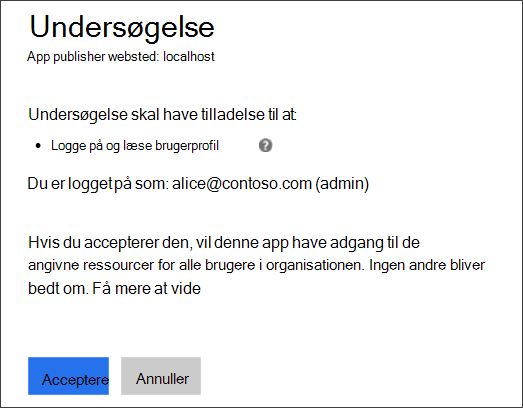
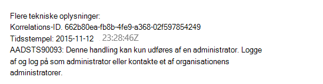
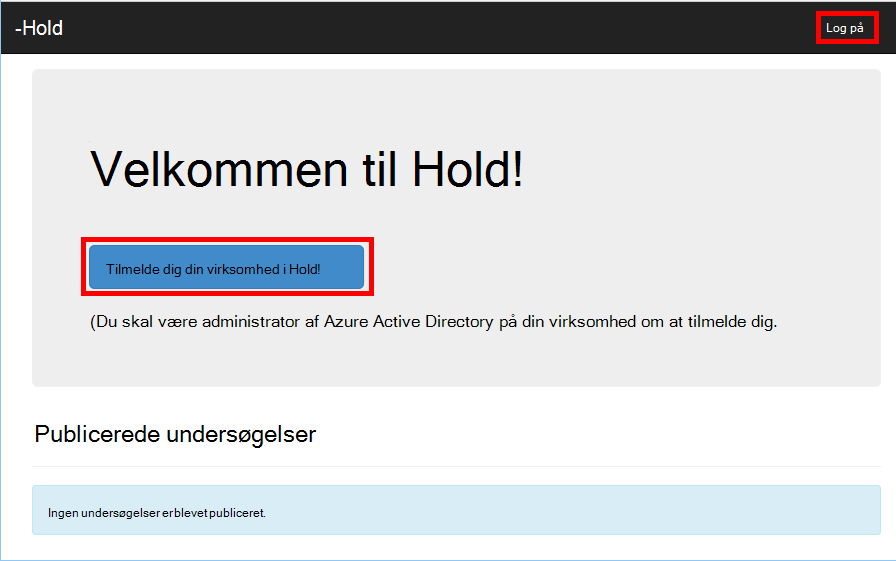
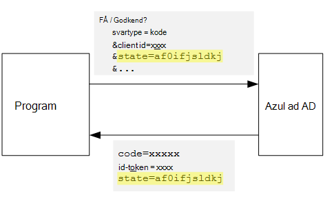
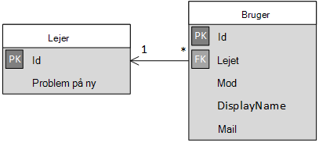

<properties
   pageTitle="Tilmelding og lejer onboarding i multiprofiler programmer | Microsoft Azure"
   description="Sådan indbyggede lejere i et multiprofiler til computeren"
   services=""
   documentationCenter="na"
   authors="MikeWasson"
   manager="roshar"
   editor=""
   tags=""/>

<tags
   ms.service="guidance"
   ms.devlang="dotnet"
   ms.topic="article"
   ms.tgt_pltfrm="na"
   ms.workload="na"
   ms.date="05/23/2016"
   ms.author="mwasson"/>

# <a name="sign-up-and-tenant-onboarding-in-a-multitenant-application"></a>Tilmelding og lejer onboarding i et multiprofiler til computeren

[AZURE.INCLUDE [pnp-header](../../includes/guidance-pnp-header-include.md)]

I denne artikel er [en del af en række]. Der er også en komplet [Northwind] , der følger med denne serie.

I denne artikel beskrives, hvordan du implementere en _tilmelding_ procesfarver i et program, med flere lejer, som gør det muligt for en kunde til at tilmelde deres organisation for dit program.
Der er flere årsager til at implementere en tilmeldingsprocessen:

-   Tillad administrator AD til samtykke for kundens hele organisationen bruge programmet.
-   Indsamle betaling med kreditkort eller andre kundeoplysninger.
-   Udføre en enkeltstående per lejer setup kræves af programmet.

## <a name="admin-consent-and-azure-ad-permissions"></a>Administrator samtykke og Azure AD-tilladelser

For at godkende med Azure AD, et program, skal du have adgang til brugerens mappe. Programmet skal som minimum tilladelse til at læse brugerens profil. Første gang, en bruger logger på, viser Azure AD en samtykke side, der viser de tilladelser, der anmodes om. Ved at klikke på **Accepter**, giver brugeren tilladelse til programmet.

Som standard er tilladelse på hver bruger. Alle brugere, der logger på ser siden samtykke. Azure AD understøtter dog _administrator samtykke_, kan en administrator AD samtykke for hele organisationen.

Når administrator samtykke strømmen bruges, angives siden samtykke, AD-administrator er tilladelsen på vegne af hele lejeren:



Når administratoren klikker på **Acceptér**, andre brugere i samme lejer kan logge på og Azure AD springer skærmbilledet samtykke.

Kun en AD-administrator kan give administrator samtykke, fordi det giver tilladelse på vegne af hele organisationen. Hvis en ikke-administrator forsøger at godkende med administrator samtykke strømmen, vises der en fejl i Azure AD:



Hvis programmet kræver yderligere tilladelser på et senere tidspunkt, skal kunden tilmelde igen og samtykke til de opdaterede tilladelser.  

## <a name="implementing-tenant-sign-up"></a>Implementere lejer tilmelding

For [Hold undersøgelser] [ Tailspin] program, kan vi definerede flere krav til tilmeldingsprocessen:

-   En lejer skal tilmelde dig, før brugerne kan logge på.
-   Tilmelding til en bruger administrator samtykke strømmen.
-   Tilmelding føjer brugerens lejer til databasen.
-   Når en lejer tilmelder, viser programmet en onboarding side.

I dette afsnit gennemgår vi for vores implementering af tilmeldingsprocessen.
Det er vigtigt at forstå, "Tilmeld dig" eller "logon" er et program som repræsenterer. Under flow godkendelse ved Azure AD ikke uden videre om brugeren, mens der tilmelding. Det er op til program tilladelse til at holde styr på konteksten.

Når en anonym bruger besøger programmet undersøgelser, brugeren er vist to knapper, ét til at logge på og en "tilmelde din virksomhed" (tilmelde dig).



Disse knapper kalde handlinger i klassen [AccountController] .

Den `SignIn` handling returnerer en **ChallegeResult**, som medfører, at den OpenID forbinde programmer, der kan omdirigere til godkendelse slutpunkt. Dette er standard måde at udløse godkendelse i ASP.NET Core 1.0.  

```csharp
[AllowAnonymous]
public IActionResult SignIn()
{
    return new ChallengeResult(
        OpenIdConnectDefaults.AuthenticationScheme,
        new AuthenticationProperties
        {
            IsPersistent = true,
            RedirectUri = Url.Action("SignInCallback", "Account")
        });
}
```

Sammenligne nu den `SignUp` handling:

```csharp
[AllowAnonymous]
public IActionResult SignUp()
{
    // Workaround for https://github.com/aspnet/Security/issues/546
    HttpContext.Items.Add("signup", "true");

    var state = new Dictionary<string, string> { { "signup", "true" }};
    return new ChallengeResult(
        OpenIdConnectDefaults.AuthenticationScheme,
        new AuthenticationProperties(state)
        {
            RedirectUri = Url.Action(nameof(SignUpCallback), "Account")
        });
}
```

Sådan `SignIn`, `SignUp` handling returnerer også en `ChallengeResult`. Men denne gang skal vi tilføje en del af en tilstandsoplysninger til den `AuthenticationProperties` i den `ChallengeResult`:

-   tilmelding: et boolesk flag, der angiver, at brugeren har startet tilmeldingsprocessen.

Tilstandsoplysninger i `AuthenticationProperties` bliver føjet til parameteren OpenID forbinde [tilstand] , der afrundes rejser under godkendelse strømmen.



Når brugeren godkender i Azure AD og viderestilles tilbage til programmet, indeholder godkendelse brugertilladelse tilstanden. Vi bruger denne oplysning for at sikre, at værdien "tilmelding" fortsætter på tværs af hele godkendelse strømmen.

## <a name="adding-the-admin-consent-prompt"></a>Tilføje administrator samtykke prompten

I Azure AD udløses administrator samtykke strømmen ved at tilføje en "prompt" parameter i forespørgselsstreng i anmodningen om godkendelse:

```
/authorize?prompt=admin_consent&...
```

Programmet undersøgelser tilføjer bliver bedt om det under den `RedirectToAuthenticationEndpoint` begivenhed. Denne hændelse kaldes højre, før program, der omdirigerer til godkendelse slutpunkt.

```csharp
public override Task RedirectToAuthenticationEndpoint(RedirectContext context)
{
    if (context.IsSigningUp())
    {
        context.ProtocolMessage.Prompt = "admin_consent";
    }

    _logger.RedirectToIdentityProvider();
    return Task.FromResult(0);
}
```

> [AZURE.NOTE] Se [SurveyAuthenticationEvents.cs].

Angive` ProtocolMessage.Prompt` fortæller de programmer, der kan føje parameteren "prompt" til anmodningen om godkendelse.

Bemærk, at bliver bedt om det er kun nødvendigt under tilmeldingen. Almindelige logon skal du ikke medtage den. For at skelne mellem dem, vi søge efter den `signup` værdi i tilstanden godkendelse. Følgende lokalnummer metode kontrollerer, om problemet:

```csharp
internal static bool IsSigningUp(this BaseControlContext context)
{
    Guard.ArgumentNotNull(context, nameof(context));

    string signupValue;
    object obj;
    // Check the HTTP context and convert to string
    if (context.HttpContext.Items.TryGetValue("signup", out obj))
    {
        signupValue = (string)obj;
    }
    else
    {
        // It's not in the HTTP context, so check the authentication ticket.  If it's not there, we aren't signing up.
        if ((context.AuthenticationTicket == null) ||
            (!context.AuthenticationTicket.Properties.Items.TryGetValue("signup", out signupValue)))
        {
            return false;
        }
    }

    // We have found the value, so see if it's valid
    bool isSigningUp;
    if (!bool.TryParse(signupValue, out isSigningUp))
    {
        // The value for signup is not a valid boolean, throw                
        throw new InvalidOperationException($"'{signupValue}' is an invalid boolean value");
    }

    return isSigningUp;
}
```

> [AZURE.NOTE] Se [BaseControlContextExtensions.cs].

> [AZURE.NOTE] Bemærk: Denne kode omfatter en løsning for en kendt fejl i ASP.NET Core 1.0 RC1. I den `RedirectToAuthenticationEndpoint` begivenhed, der findes ingen måde at få egenskaberne godkendelse, der indeholder tilstanden "tilmelding". Som en løsning på `AccountController.SignUp` metode anbringer også tilstanden "tilmelding" til den `HttpContext`. Dette virker, fordi `RedirectToAuthenticationEndpoint` sker før omdirigeringen, så vi stadig er den samme `HttpContext`.

## <a name="registering-a-tenant"></a>Registrere en lejer

Programmet undersøgelser gemmer nogle oplysninger om hver lejer og bruger i databasen.



I tabellen lejer er IssuerValue værdien af udsteder kravet for lejeren. I forbindelse med Azure AD er `https://sts.windows.net/<tentantID>` og giver en entydig værdi per lejer.

Når en ny lejer tilmelder sig, undersøgelser programmet skriver en lejer post til databasen. Dette sker i den `AuthenticationValidated` begivenhed. (Ikke gøre det før begivenheden, fordi ID-tokenet ikke godkendt endnu, så du ikke har tillid til værdierne, der gør krav. Se [godkendelse].

Her er den relevante kode fra programmet undersøgelser:

```csharp
public override async Task AuthenticationValidated(AuthenticationValidatedContext context)
{
    var principal = context.AuthenticationTicket.Principal;
    var userId = principal.GetObjectIdentifierValue();
    var tenantManager = context.HttpContext.RequestServices.GetService<TenantManager>();
    var userManager = context.HttpContext.RequestServices.GetService<UserManager>();
    var issuerValue = principal.GetIssuerValue();
    _logger.AuthenticationValidated(userId, issuerValue);

    // Normalize the claims first.
    NormalizeClaims(principal);
    var tenant = await tenantManager.FindByIssuerValueAsync(issuerValue)
        .ConfigureAwait(false);

    if (context.IsSigningUp())
    {
        // Originally, we were checking to see if the tenant was non-null, however, this would not allow
        // permission changes to the application in AAD since a re-consent may be required.  Now we just don't
        // try to recreate the tenant.
        if (tenant == null)
        {
            tenant = await SignUpTenantAsync(context, tenantManager)
                .ConfigureAwait(false);
        }

        // In this case, we need to go ahead and set up the user signing us up.
        await CreateOrUpdateUserAsync(context.AuthenticationTicket, userManager, tenant)
            .ConfigureAwait(false);
    }
    else
    {
        if (tenant == null)
        {
            _logger.UnregisteredUserSignInAttempted(userId, issuerValue);
            throw new SecurityTokenValidationException($"Tenant {issuerValue} is not registered");
        }

        await CreateOrUpdateUserAsync(context.AuthenticationTicket, userManager, tenant)
            .ConfigureAwait(false);
    }
}
```

> [AZURE.NOTE] Se [SurveyAuthenticationEvents.cs].

Denne kode gør følgende:

1.  Kontrollér, om lejerens udsteder værdi er allerede i databasen. Hvis lejeren ikke har tilmeldt sig, `FindByIssuerValueAsync` returnerer null.
2.  Hvis brugeren er tilmeldt dig:
  1.    Føje lejeren til databasen (`SignUpTenantAsync`).
  2.    Føje den godkendte bruger til databasen (`CreateOrUpdateUserAsync`).
3.  Ellers har fuldført normal logon-strømmen:
  1.    Hvis lejerens udsteder ikke blev fundet i databasen, betyder det lejeren ikke er registreret, og kunden har brug at tilmelde dig. I så fald Udløs en undtagelse for at få godkendelse mislykkes.
  2.    Ellers skal du oprette en post i databasen for denne bruger, hvis der ikke en allerede (`CreateOrUpdateUserAsync`).

Her er den [SignUpTenantAsync] metode, der tilføjer lejeren til databasen.

```csharp
private async Task<Tenant> SignUpTenantAsync(BaseControlContext context, TenantManager tenantManager)
{
    Guard.ArgumentNotNull(context, nameof(context));
    Guard.ArgumentNotNull(tenantManager, nameof(tenantManager));

    var principal = context.AuthenticationTicket.Principal;
    var issuerValue = principal.GetIssuerValue();
    var tenant = new Tenant
    {
        IssuerValue = issuerValue,
        Created = DateTimeOffset.UtcNow
    };

    try
    {
        await tenantManager.CreateAsync(tenant)
            .ConfigureAwait(false);
    }
    catch(Exception ex)
    {
        _logger.SignUpTenantFailed(principal.GetObjectIdentifierValue(), issuerValue, ex);
        throw;
    }

    return tenant;
}
```

Her er en oversigt over hele tilmelding strømmen i programmet undersøgelser:

1.  Brugeren klikker på knappen **Tilmeld dig** .
2.  Den `AccountController.SignUp` handling returnerer et challege resultat.  Tilstanden godkendelse omfatter "tilmelding" værdi.
3.  I den `RedirectToAuthenticationEndpoint` begivenheden, tilføje den `admin_consent` prompt.
4.  Den OpenID forbinde program omdirigerer til Azure AD, og brugeren skal godkende.
5.  I den `AuthenticationValidated` begivenheden, udseende til tilstanden "tilmelding".
6.  Føje lejeren til databasen.

## <a name="next-steps"></a>Næste trin

- Læs næste artikel i denne serie: [programmet roller i multiprofiler programmer][app roles]


<!-- Links -->
[app roles]: guidance-multitenant-identity-app-roles.md
[Tailspin]: guidance-multitenant-identity-tailspin.md
[en del af en serie]: guidance-multitenant-identity.md
[AccountController]: https://github.com/Azure-Samples/guidance-identity-management-for-multitenant-apps/blob/master/src/Tailspin.Surveys.Web/Controllers/AccountController.cs
[stat]: http://openid.net/specs/openid-connect-core-1_0.html#AuthRequest
[SurveyAuthenticationEvents.cs]: https://github.com/Azure-Samples/guidance-identity-management-for-multitenant-apps/blob/master/src/Tailspin.Surveys.Web/Security/SurveyAuthenticationEvents.cs
[BaseControlContextExtensions.cs]: https://github.com/Azure-Samples/guidance-identity-management-for-multitenant-apps/blob/master/src/Tailspin.Surveys.Web/Security/BaseControlContextExtensions.cs
[Godkendelse]: guidance-multitenant-identity-authenticate.md
[SignUpTenantAsync]: https://github.com/Azure-Samples/guidance-identity-management-for-multitenant-apps/blob/master/src/Tailspin.Surveys.Web/Security/SurveyAuthenticationEvents.cs
[Northwind]: https://github.com/Azure-Samples/guidance-identity-management-for-multitenant-apps
