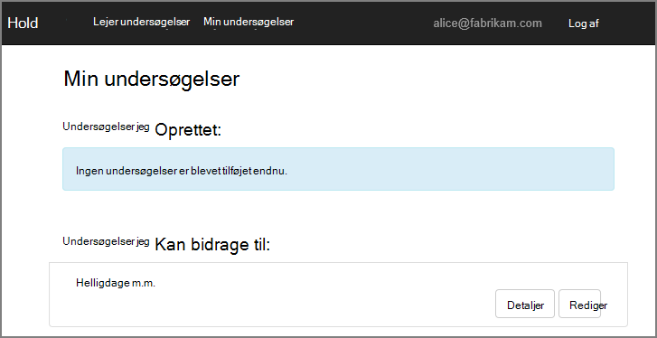

<properties
   pageTitle="Om programmet Hold undersøgelser | Microsoft Azure"
   description="Hold undersøgelser programmet oversigt"
   services=""
   documentationCenter="na"
   authors="MikeWasson"
   manager="roshar"
   editor=""
   tags=""/>

<tags
   ms.service="guidance"
   ms.devlang="dotnet"
   ms.topic="article"
   ms.tgt_pltfrm="na"
   ms.workload="na"
   ms.date="05/23/2016"
   ms.author="mwasson"/>

# Om programmet Hold undersøgelser

[AZURE.INCLUDE [pnp-header](../../includes/guidance-pnp-header-include.md)]

I denne artikel er [en del af en række]. Der er også en komplet [Northwind] , der følger med denne serie.

Hold er en opdigtet virksomhed, der er ved at udvikle et SaaS program med navnet undersøgelser. Dette program giver organisationer mulighed at oprette og publicere online undersøgelser.

- En organisation kan tilmelde sig programmet.
- Når organisationen er tilmeldt, kan brugerne logge ind i programmet med deres egne legitimationsoplysninger.
- Brugere kan oprette, redigere og publicere undersøgelser.

> [AZURE.NOTE] For at komme i gang med programmet, skal du se [køre programmet undersøgelser].

## Brugere kan oprette, redigere og få vist undersøgelser

En godkendt bruger kan få vist alle de undersøgelser, som han eller hun har oprettet, eller har bidragyder rettigheder til, og oprette nye undersøgelser. Bemærk, at brugeren er logget på med sine organisationsidentitet `bob@contoso.com`.

Dette skærmbillede viser siden Rediger undersøgelse:

Brugerne kan også få vist alle undersøgelser, der er oprettet af andre brugere i samme lejer.

## Undersøgelse ejere kan invitere bidragydere

Når en bruger opretter en undersøgelse, kan han eller hun invitere andre til at være bidragydere på undersøgelsen. Bidragydere kan redigere undersøgelsen, men kan ikke slette eller publicere den.  

En bruger kan tilføje bidragydere fra andre lejere, som giver kryds-lejer Deling af ressourcer. I dette skærmbillede, Bob (`bob@contoso.com`) er at tilføje Bent (`alice@fabrikam.com`) som en bidragyder til en undersøgelse, Bob har oprettet.

Når Bent logger på, kan hun se undersøgelsen vises under "Jeg kan bidrage til undersøgelser".

Bemærk, at Bent logger på sin egen lejer, ikke som gæst i Contoso lejeren. Bent har tilladelser som bidragydere kun for denne undersøgelse &mdash; hun kan ikke få vist andre undersøgelser fra Contoso-lejer.

## Arkitektur

Programmet undersøgelser består af en web front-end og en web API back-end. Begge er implementeret ved hjælp af [ASP.NET Core 1.0].

Webprogrammet bruger Azure Active Directory (Azure AD) til at godkende brugere. Webprogrammet kalder også Azure AD for at hente OAuth 2 access tokens til Web API. Access tokens cachelagres i Azure Redis Cache. Cachen gør det muligt for flere forekomster til at dele den samme token cache (f.eks., i en serverfarm).

## Næste trin

- Læs næste artikel i denne serie: [godkendelse i multiprofiler apps, ved hjælp af Azure Active Directory og OpenID forbinde][authentication]

<!-- Links -->

[authentication]: guidance-multitenant-identity-authenticate.md
[en del af en serie]: guidance-multitenant-identity.md
[Køre programmet undersøgelser]: https://github.com/Azure-Samples/guidance-identity-management-for-multitenant-apps/blob/master/docs/running-the-app.md
[ASP.NET Core 1.0]: https://docs.asp.net/en/latest/
[Northwind]: https://github.com/Azure-Samples/guidance-identity-management-for-multitenant-apps
