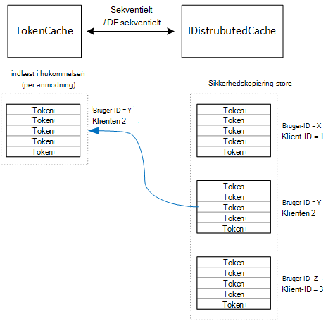

<properties
   pageTitle="Cachelagring adgang tokens i et multiprofiler computeren | Microsoft Azure"
   description="Cachelagring access tokens, der bruges til at starte en back-end Web API"
   services=""
   documentationCenter="na"
   authors="MikeWasson"
   manager="roshar"
   editor=""
   tags=""/>

<tags
   ms.service="guidance"
   ms.devlang="dotnet"
   ms.topic="article"
   ms.tgt_pltfrm="na"
   ms.workload="na"
   ms.date="02/16/2016"
   ms.author="mwasson"/>


# <a name="caching-access-tokens-in-a-multitenant-application"></a>Cachelagring access tokens i et multiprofiler til computeren

[AZURE.INCLUDE [pnp-header](../../includes/guidance-pnp-header-include.md)]

I denne artikel er [en del af en række]. Der er også en komplet [Northwind] , der følger med denne serie.

Det er relativt dyrt at få en OAuth adgang adgangstoken, fordi den kræver en HTTP-anmodning til token slutpunktet. Det er godt at cachen tokens, når det er muligt. [Azure AD Authentication Library] [ ADAL] (ADAL) gemmer automatisk tokens, som fås fra Azure AD, herunder Opdater tokens.

ADAL indeholder en standard token cacheimplementering. Men denne token cache er beregnet til oprindelig klient apps, og er _ikke_ egnet til webapps:

-   Det er et statisk forekomst, og ikke tråd sikre.
-   Den skaleres ikke til stort antal brugere, fordi tokens ud fra alle brugere gå til den samme ordbog.
-   Det kan ikke deles på tværs af internettet servere i en farm.

I stedet, du skal implementere en brugerdefineret token cache, der stammer fra ADAL `TokenCache` klasse men egner sig til et server-miljø og giver niveauet bør isolationsniveauet mellem tokens for forskellige brugere.

Den `TokenCache` klasse gemmer en ordbog med tokens, indekseret af udsteder, ressource, klient-ID og bruger. En brugerdefineret token cache skal skrive denne ordbog til et lager til sikkerhedskopiering, som en Redis cache.

I programmet Hold undersøgelser på `DistributedTokenCache` klasse implementerer token cachen. Denne implementering bruger [IDistributedCache] [ distributed-cache] fremstilling fra ASP.NET Core 1.0. På den måde, en hvilken som helst `IDistributedCache` implementering kan bruges som et lager til sikkerhedskopiering.

-   Som standard bruger appen undersøgelser en Redis cache.
-   For en enkelt forekomst webserver, kan du bruge ASP.NET Core 1.0 [datacache i hukommelsen][in-memory-cache]. (Dette er også en god mulighed for at køre appen lokalt under udviklingen.)

> [AZURE.NOTE] Redis cachen understøttes i øjeblikket ikke til .NET Core.

`DistributedTokenCache`gemmer cache dataene som nøgle/værdi-par i sikkerhedskopiering store. Tasten er bruger-ID samt klient-ID, så sikkerhedskopiering store indeholder data fra separate cache for hver enkelt kombination af bruger/klient.



Sikkerhedskopiering store er opdelt af bruger. For hver HTTP-anmodning, tokens for den pågældende bruger læse fra store sikkerhedskopiering og indlæst i den `TokenCache` ordbog. Hvis Redis bruges som store sikkerhedskopiering hver server-forekomst i en serverfarm læser/skriver til den samme cache, og denne metode skaleres til mange brugere.

## <a name="encrypting-cached-tokens"></a>Kryptere cachelagrede tokens

Tokens er følsomme data, fordi de give adgang til en brugers ressourcer. (Desuden i modsætning til en brugers adgangskode, du kan kun gemme en hash af tokenet.) Det er meget vigtigt for at beskytte tokens mod misbrug. Cachen Redis sikkerhedskopien er beskyttet med adgangskode, men hvis en person henter adgangskoden, de kan få adgang til alle cachelagrede access tokens. Derfor den `DistributedTokenCache` krypterer alt, som skrives til sikkerhedskopiering store. Kryptering er færdig med ASP.NET Core 1.0 [databeskyttelse] [ data-protection] API'er.

> [AZURE.NOTE] Hvis du installerer til Azure-websteder, tasterne kryptering er sikkerhedskopieret til lagrede netværk og synkroniseres på tværs af alle computere (se [Key Management][key-management]). Som standard er taster ikke er krypteret, når der benyttes i Azure websteder, men du kan [aktivere kryptering ved hjælp af et x.509-certifikat][x509-cert-encryption].


## <a name="distributedtokencache-implementation"></a>DistributedTokenCache implementering

[DistributedTokenCache] [ DistributedTokenCache] klasse er afledt af ADAL [TokenCache] [ tokencache-class] klasse.

I parametre, den `DistributedTokenCache` klasse opretter en nøgle til den aktuelle bruger og indlæser cachen fra sikkerhedskopiering store:

```csharp
public DistributedTokenCache(
    ClaimsPrincipal claimsPrincipal,
    IDistributedCache distributedCache,
    ILoggerFactory loggerFactory,
    IDataProtectionProvider dataProtectionProvider)
    : base()
{
    _claimsPrincipal = claimsPrincipal;
    _cacheKey = BuildCacheKey(_claimsPrincipal);
    _distributedCache = distributedCache;
    _logger = loggerFactory.CreateLogger<DistributedTokenCache>();
    _protector = dataProtectionProvider.CreateProtector(typeof(DistributedTokenCache).FullName);
    AfterAccess = AfterAccessNotification;
    LoadFromCache();
}
```

Tasten oprettes ved at sammenkæde bruger-ID og klient-ID. Begge af følgende er taget fra krav, der findes i brugerens `ClaimsPrincipal`:

```csharp
private static string BuildCacheKey(ClaimsPrincipal claimsPrincipal)
{
    string clientId = claimsPrincipal.FindFirstValue("aud", true);
    return string.Format(
        "UserId:{0}::ClientId:{1}",
        claimsPrincipal.GetObjectIdentifierValue(),
        clientId);
}
```

For at indlæse cache dataene skal læses fortløbende blob fra sikkerhedskopiering store, og kald `TokenCache.Deserialize` til at konvertere blob til data fra cache.

```csharp
private void LoadFromCache()
{
    byte[] cacheData = _distributedCache.Get(_cacheKey);
    if (cacheData != null)
    {
        this.Deserialize(_protector.Unprotect(cacheData));
    }
}
```

Når ADAL adgang til cachen, skal udløses en `AfterAccess` begivenhed. Hvis cachen dataene er ændret, den `HasStateChanged` egenskaben er sand. Det er tilfældet, opdatere sikkerhedskopiering store for at afspejle ændringen, og angiv derefter `HasStateChanged` til falsk.

```csharp
public void AfterAccessNotification(TokenCacheNotificationArgs args)
{
    if (this.HasStateChanged)
    {
        try
        {
            if (this.Count > 0)
            {
                _distributedCache.Set(_cacheKey, _protector.Protect(this.Serialize()));
            }
            else
            {
                // There are no tokens for this user/client, so remove the item from the cache.
                _distributedCache.Remove(_cacheKey);
            }
            this.HasStateChanged = false;
        }
        catch (Exception exp)
        {
            _logger.WriteToCacheFailed(exp);
            throw;
        }
    }
}
```

TokenCache sender to andre hændelser:

- `BeforeWrite`. Kaldet lige før ADAL skriver til cachen. Du kan bruge dette til at implementere en strategi for på dokumentsammenfald
- `BeforeAccess`. Kaldet lige før ADAL læser fra cachen. Her kan du genindlæse cachen for at hente den nyeste version.

I dette tilfælde har vi besluttet ikke at håndtere disse to hændelser.

- På dokumentsammenfald, sidste skrive wins. Det er OK, da tokens gemmes uafhængigt for hver bruger + -klient, så en konflikt ville kun ske, hvis den samme bruger havde to samtidige logon-sessioner.
- Vi Indlæs cache på alle anmodninger om læsning. Anmodninger om er korttidsoplysninger. Hvis cachen bliver ændret i periode, vil den næste anmodning løfte den nye værdi.

## <a name="next-steps"></a>Næste trin

- Læs næste artikel i denne serie: [Federating med en kundes AD FS til multiprofiler apps i Azure][adfs]

<!-- links -->
[ADAL]: https://msdn.microsoft.com/library/azure/jj573266.aspx
[adfs]: guidance-multitenant-identity-adfs.md
[data-protection]: https://docs.asp.net/en/latest/security/data-protection/index.html
[distributed-cache]: https://docs.asp.net/en/latest/fundamentals/distributed-cache.html
[DistributedTokenCache]: https://github.com/Azure-Samples/guidance-identity-management-for-multitenant-apps/blob/master/src/Tailspin.Surveys.TokenStorage/DistributedTokenCache.cs
[key-management]: https://docs.asp.net/en/latest/security/data-protection/configuration/default-settings.html
[in-memory-cache]: https://docs.asp.net/en/latest/fundamentals/caching.html
[tokencache-class]: https://msdn.microsoft.com/library/azure/microsoft.identitymodel.clients.activedirectory.tokencache.aspx
[x509-cert-encryption]: https://docs.asp.net/en/latest/security/data-protection/implementation/key-encryption-at-rest.html#x-509-certificate
[en del af en serie]: guidance-multitenant-identity.md
[Northwind]: https://github.com/Azure-Samples/guidance-identity-management-for-multitenant-apps
