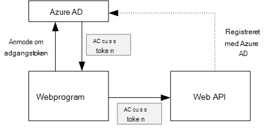
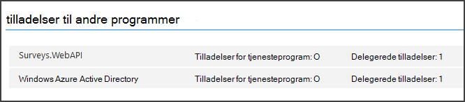

<properties
   pageTitle="Sikring af en back end-web API i et multiprofiler computeren | Microsoft Azure"
   description="Hvordan du sikrer en back end-web API"
   services=""
   documentationCenter="na"
   authors="MikeWasson"
   manager="roshar"
   editor=""
   tags=""/>

<tags
   ms.service="guidance"
   ms.devlang="dotnet"
   ms.topic="article"
   ms.tgt_pltfrm="na"
   ms.workload="na"
   ms.date="06/02/2016"
   ms.author="mwasson"/>

# <a name="securing-a-backend-web-api-in-a-multitenant-application"></a>Sikring af en back end-web API i et multiprofiler til computeren

[AZURE.INCLUDE [pnp-header](../../includes/guidance-pnp-header-include.md)]

I denne artikel er [en del af en række]. Der er også en komplet [Northwind] , der følger med denne serie.

[Hold undersøgelser] programmet bruger en back end-web API til at administrere CRUD handlinger på undersøgelser. Når en bruger klikker på "Mine undersøgelser", sender webprogrammet for eksempel en HTTP-anmodning på World Wide web API:

```
GET /users/{userId}/surveys
```

World Wide web API returnerer et JSON objekt:

```
{
  "Published":[],
  "Own":[
    {"Id":1,"Title":"Survey 1"},
    {"Id":3,"Title":"Survey 3"},
    ],
  "Contribute": [{"Id":8,"Title":"My survey"}]
}
```

World Wide web API tillader ikke anonyme anmodninger, så WebApp skal godkende sig selv ved hjælp af OAuth 2 bæreren tokens.

> [AZURE.NOTE] Dette er en server til server-scenarie. Programmet gør ikke en hvilken som helst AJAX opkald til API fra browserklienten på computeren.

Der er to primære metoder, du kan bruge:

- Delegeret bruger-id. Webprogrammet godkender med det bruger-id.
- Program-id. Webprogrammet godkender med dens klient-ID, ved hjælp af OAuth2 klient legitimationsoplysninger forløb.

Hold programmet implementerer delegeret bruger-id. Her er de vigtigste forskelle:

**Delegeret bruger-id**

- Sendes til World Wide web API-bærertoken indeholder bruger-id.
- World Wide web API gør godkendelse beslutninger baseret på bruger-id.
- Webprogrammet skal håndtere 403 (forbudt) fejl fra World Wide web API, hvis brugeren ikke har tilladelse til at udføre en handling.
- Typisk foretager webprogrammet stadig nogle godkendelse beslutninger, der påvirker brugergrænseflade, som vise eller skjule elementer i Brugergrænsefladen).
- Web API kan potentielt anvendes af upålidelige klienter, som et JavaScript-program eller en oprindelig klientprogrammet.

**Program-id**

- World Wide web API få ikke oplysninger om brugeren.
- World Wide web API kan ikke udføre en hvilken som helst godkendelse, der er baseret på bruger-id. Alle godkendelse beslutninger er foretaget af webprogrammet.  
- Web API kan ikke bruges af en upålidelige klient (JavaScript eller oprindelige klientprogrammet).
- Denne metode kan være lidt nemmere at implementere, fordi der ikke er nogen godkendelse logik i Web API.

Webprogrammet skal have et adgangstoken, som er de legitimationsoplysninger, der skal bruges til at ringe til World Wide web API i enten tilgang.

- Til delegeret bruger-id har tokenet til at komme fra IDP, som kan udstede et token på vegne af brugeren.

- Klient-legitimationsoplysninger, kan et program få tokenet fra IDP eller være vært for sin egen token server. (Men ikke skrive en token server fra bunden, bruge en grundigt testet ramme som [IdentityServer3].) Hvis du godkende med Azure AD, har det anbefales for at få adgangstoken fra Azure AD, selv med klient legitimationsoplysninger forløb.

I resten af denne artikel antages programmet godkender med Azure AD.



## <a name="register-the-web-api-in-azure-ad"></a>Registrere web API i Azure AD

Hvis Azure AD at udstede en bærertoken til World Wide web API, skal du konfigurere nogle ting i Azure AD.

1. [Registrere World Wide web API i Azure AD].

2. Føje klient-ID af WebApp til progammanifest web API i den `knownClientApplications` egenskab. Se [opdatere programmet manifester].

3. [Give web program tilladelse til at ringe til World Wide web API].

  I portalen Azure administration, kan du angive to typer tilladelser: "Tilladelser for tjenesteprogram" for program-id (klient legitimationsoplysninger flow) eller "Delegerede tilladelser" til delegeret bruger-id.

  

## <a name="getting-an-access-token"></a>Få et adgangstoken

Før du kalder web API henter-webprogrammet en access token fra Azure AD. I en .NET-programmer kan du bruge [Azure AD godkendelse bibliotek (ADAL) til .NET][ADAL].

Programmet samtaler i OAuth 2 godkendelse kode flow, en godkendelseskode for et adgangstoken. Følgende kode bruger ADAL til at hente adgangstoken. Denne kode kaldes under den `AuthorizationCodeReceived` begivenhed.

```csharp
// The OpenID Connect middleware sends this event when it gets the authorization code.   
public override async Task AuthorizationCodeReceived(AuthorizationCodeReceivedContext context)
{
    string authorizationCode = context.ProtocolMessage.Code;
    string authority = "https://login.microsoftonline.com/" + tenantID
    string resourceID = "https://tailspin.onmicrosoft.com/surveys.webapi" // App ID URI
    ClientCredential credential = new ClientCredential(clientId, clientSecret);

    AuthenticationContext authContext = new AuthenticationContext(authority, tokenCache);
    AuthenticationResult authResult = await authContext.AcquireTokenByAuthorizationCodeAsync(
        authorizationCode, new Uri(redirectUri), credential, resourceID);

    // If successful, the token is in authResult.AccessToken
}
```

Her er de forskellige parametre, der skal bruges:

- `authority`. Udledt fra lejer-ID'ET for den bruger, der er logget på. (Ikke lejer ID provideren SaaS)  
- `authorizationCode`. den auth kode, du er kommet tilbage fra IDP.
- `clientId`. Den webprogram klient-ID.
- `clientSecret`. Den webprogram klient hemmeligt.
- `redirectUri`. Omdiriger URI, som du angiver for OpenID Opret forbindelse. Dette er, hvor IDP ringer tilbage med tokenet.
- `resourceID`. App-ID-URI af web API, som du oprettede, når du har registreret web API i Azure AD
- `tokenCache`. Et objekt, der lagrer access tokens. Se [Token cachelagring].

Hvis `AcquireTokenByAuthorizationCodeAsync` lykkes, ADAL cachelagres tokenet. Senere, kan du få tokenet fra cachen ved at ringe til AcquireTokenSilentAsync:

```csharp
AuthenticationContext authContext = new AuthenticationContext(authority, tokenCache);
var result = await authContext.AcquireTokenSilentAsync(resourceID, credential, new UserIdentifier(userId, UserIdentifierType.UniqueId));
```

hvor `userId` er brugerens objekt-ID, som findes i den `http://schemas.microsoft.com/identity/claims/objectidentifier` gøre krav.

## <a name="using-the-access-token-to-call-the-web-api"></a>Ved hjælp af adgangstokenet til at ringe til World Wide web API

Når du har tokenet, kan du sende den via overskriften godkendelse på HTTP-anmodninger på World Wide web API.

```
Authorization: Bearer xxxxxxxxxx
```

Følgende lokalnummer metode fra programmet undersøgelser angiver godkendelse sidehovedet på en HTTP-anmodning, ved hjælp af klassen **HttpClient** .

```csharp
public static async Task<HttpResponseMessage> SendRequestWithBearerTokenAsync(this HttpClient httpClient, HttpMethod method, string path, object requestBody, string accessToken, CancellationToken ct)
{
    var request = new HttpRequestMessage(method, path);
    if (requestBody != null)
    {
        var json = JsonConvert.SerializeObject(requestBody, Formatting.None);
        var content = new StringContent(json, Encoding.UTF8, "application/json");
        request.Content = content;
    }

    request.Headers.Authorization = new AuthenticationHeaderValue("Bearer", accessToken);
    request.Headers.Accept.Add(new MediaTypeWithQualityHeaderValue("application/json"));

    var response = await httpClient.SendAsync(request, ct);
    return response;
}
```

> [AZURE.NOTE] Se [HttpClientExtensions.cs].

## <a name="authenticating-in-the-web-api"></a>Godkendelse i web API

World Wide web API skal godkende bærertokenet. I ASP.NET Core 1.0, kan du bruge [Microsoft.AspNet.Authentication.JwtBearer] [ JwtBearer] pakke. Pakken indeholder programmer, der gør det muligt for programmet til at modtage OpenID forbinde bæreren tokens.

Registrere programmer i din web API `Startup` klasse.

```csharp
app.UseJwtBearerAuthentication(options =>
{
    options.Audience = "[app ID URI]";
    options.Authority = "https://login.microsoftonline.com/common/";
    options.TokenValidationParameters = new TokenValidationParameters
    {
        //Instead of validating against a fixed set of known issuers, we perform custom multi-tenant validation logic
        ValidateIssuer = false,
    };
    options.Events = new SurveysJwtBearerEvents();
});
```

> [AZURE.NOTE] Se [Startup.cs].

- **Målgruppe**. Angiv denne indstilling for at App-ID URL-adressen til World Wide web API, som du oprettede, når du har registreret web API med Azure AD.
- **Nøglecenter**. Angiv dette til et multiprofiler program til `https://login.microsoftonline.com/common/`.
- **TokenValidationParameters**. Angive **ValidateIssuer** til et multiprofiler program til falsk. Det betyder, at programmet validerer udstederen.
- **Hændelser, der** er en klasse, der stammer fra **JwtBearerEvents**.

### <a name="issuer-validation"></a>Udsteder validering

Valider token udsteder i hændelsen **JwtBearerEvents.ValidatedToken** . Udstederen sendes i "iss" kravet.

I programmet undersøgelser behandler web API ikke [lejer tilmelding]. Derfor kontrollerer det lige, om udstederen er allerede i databasen. Hvis ikke, det medfører en undtagelse, som medfører, at godkendelse mislykkes.

```csharp
public override async Task ValidatedToken(ValidatedTokenContext context)
{
    var principal = context.AuthenticationTicket.Principal;
    var tenantManager = context.HttpContext.RequestServices.GetService<TenantManager>();
    var userManager = context.HttpContext.RequestServices.GetService<UserManager>();
    var issuerValue = principal.GetIssuerValue();
    var tenant = await tenantManager.FindByIssuerValueAsync(issuerValue);

    if (tenant == null)
    {
        // the caller was not from a trusted issuer - throw to block the authentication flow
        throw new SecurityTokenValidationException();
    }
}
```

> [AZURE.NOTE] Se [SurveysJwtBearerEvents.cs].

Du kan også bruge hændelsen **ValidatedToken** til at gøre [krav transformation]. Husk, at krav kommer direkte fra Azure AD, så hvis webprogrammet har en hvilken som helst krav transformationer, dem, der ikke afspejles i bærertokenet, World Wide web API modtager.

## <a name="authorization"></a>Godkendelse

Finde [rollebaseret og ressource-baseret godkendelse]i en generel beskrivelse af godkendelse[Authorization]. 

JwtBearer programmer håndterer godkendelse svar. Bruge **[godkende]** atrribute for eksempel for at begrænse en controller handling til godkendte brugere, og angiv **JwtBearerDefaults.AuthenticationScheme** som godkendelse farveskema:

```csharp
[Authorize(ActiveAuthenticationSchemes = JwtBearerDefaults.AuthenticationScheme)]
```

Dette returnerer en 401 statuskode, hvis brugeren ikke er godkendt.

For at begrænse en controller handling ved authorizaton politik, skal du angive politikkens navn i attributten **[godkende]** :

```csharp
[Authorize(Policy = PolicyNames.RequireSurveyCreator)]
```

Dette returnerer en 401 statuskode, hvis brugeren ikke er godkendt og 403, hvis brugeren er godkendt, men ikke godkendt. Registrere politikken ved start:

```csharp
public void ConfigureServices(IServiceCollection services)
{
    services.AddAuthorization(options =>
    {
        options.AddPolicy(PolicyNames.RequireSurveyCreator,
            policy =>
            {
                policy.AddRequirements(new SurveyCreatorRequirement());
                policy.AddAuthenticationSchemes(JwtBearerDefaults.AuthenticationScheme);
            });
    });
}
```

## <a name="next-steps"></a>Næste trin

- Læs næste artikel i denne serie: [cachelagring access tokens i et multiprofiler til computeren][token cache]

<!-- links -->
[ADAL]: https://msdn.microsoft.com/library/azure/jj573266.aspx
[JwtBearer]: https://www.nuget.org/packages/Microsoft.AspNet.Authentication.JwtBearer
[en del af en serie]: guidance-multitenant-identity.md
[Hold undersøgelser]: guidance-multitenant-identity-tailspin.md
[IdentityServer3]: https://github.com/IdentityServer/IdentityServer3
[Registrere web API i Azure AD]: https://github.com/Azure-Samples/guidance-identity-management-for-multitenant-apps/blob/master/docs/running-the-app.md#register-the-surveys-web-api
[Opdatere programmet manifester]: https://github.com/Azure-Samples/guidance-identity-management-for-multitenant-apps/blob/master/docs/running-the-app.md#update-the-application-manifests
[Give web program tilladelse til at ringe til World Wide web API]: https://github.com/Azure-Samples/guidance-identity-management-for-multitenant-apps/blob/master/docs/running-the-app.md#give-the-web-app-permissions-to-call-the-web-api
[Token cachelagring]: guidance-multitenant-identity-token-cache.md
[HttpClientExtensions.cs]: https://github.com/Azure-Samples/guidance-identity-management-for-multitenant-apps/blob/master/src/Tailspin.Surveys.Common/HttpClientExtensions.cs
[Startup.CS]: https://github.com/Azure-Samples/guidance-identity-management-for-multitenant-apps/blob/master/src/Tailspin.Surveys.WebAPI/Startup.cs
[tilmelding til en lejer]: guidance-multitenant-identity-signup.md
[SurveysJwtBearerEvents.cs]: https://github.com/Azure-Samples/guidance-identity-management-for-multitenant-apps/blob/master/src/Tailspin.Surveys.WebAPI/SurveyJwtBearerEvents.cs
[krav transformation]: guidance-multitenant-identity-claims.md#claims-transformations
[Authorization]: guidance-multitenant-identity-authorize.md
[Northwind]: https://github.com/Azure-Samples/guidance-identity-management-for-multitenant-apps
[token cache]: guidance-multitenant-identity-token-cache.md
