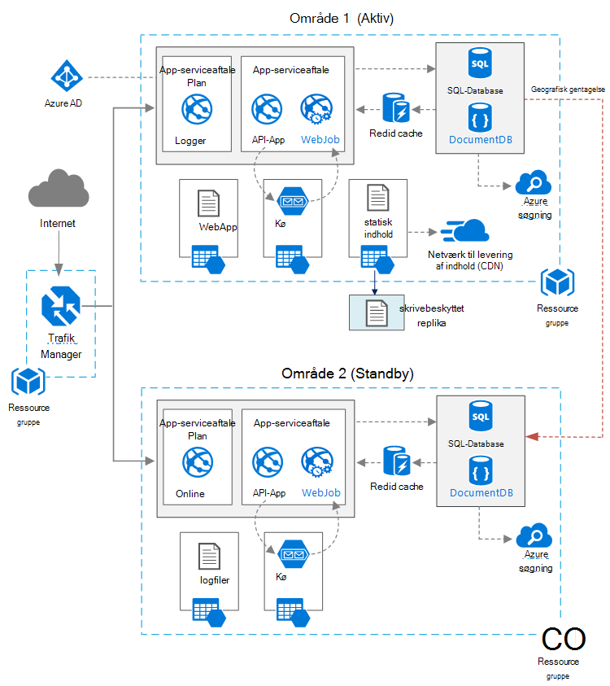

<properties
   pageTitle="-Webprogrammet med høj tilgængelighed | Azure referencearkitektur | Microsoft Azure"
   description="Anbefalede arkitektur for webprogram med høj tilgængelighed, kører i Microsoft Azure."
   services="app-service,app-service\web,sql-database" 
   documentationCenter="na"
   authors="MikeWasson"
   manager="roshar"
   editor=""
   tags=""/>

<tags
   ms.service="guidance"
   ms.devlang="na"
   ms.topic="article"
   ms.tgt_pltfrm="na"
   ms.workload="na"
   ms.date="06/27/2016"
   ms.author="mwasson"/>

# <a name="azure-reference-architecture-web-application-with-high-availability"></a>Azure referencearkitektur:-webprogrammet med høj tilgængelighed

[AZURE.INCLUDE [pnp-RA-branding](../../includes/guidance-pnp-header-include.md)]

I denne artikel viser en anbefalede arkitektur for et webprogram med høj tilgængelighed, kører på Microsoft Azure. Arkitekturen bygger på [Azure referencearkitektur: forbedre skalerbarhed i et webprogram][guidance-web-apps-scalability].

## <a name="architecture-diagram"></a>Arkitektur diagram



Denne arkitektur bygger på den, der vises i [forbedring skalerbarhed i et webprogram][guidance-web-apps-scalability]. De vigtigste forskelle er:

- **Primære og sekundære områder**. Denne arkitektur bruger to områder til at opnå større tilgængelighed. Programmet er installeret til hvert områder. Under normale handlinger sendes netværkstrafik til det primære område. Men hvis, som er tilgængelig, dirigeres trafik til den sekundære område. Du kan finde oplysninger om failover, [administrere failover](#managing-failover-and-failback).

- **Azure trafik Manager**. [Trafik Manager] [ traffic-manager] dirigerer indgående anmodninger til det primære område. Hvis det program, der kører denne region bliver utilgængeligt, mislykkes trafik Manager over til den sekundære område. 

- **Geografisk gentagelse** af SQL-Database og DocumentDB.

## <a name="recommendations"></a>Anbefalinger

### <a name="regional-pairing"></a>Internationale parring

Hvert område for Azure hører sammen med et andet område i den samme Geografi. Vælg Generelt områder i det samme internationale par (for eksempel af US 2 og centrale USA). Fordele ved at gøre dette, omfatter:

- Hvis der er en bred afbrydelse, prioriteres gendannelse af mindst ét område af alle par.
- Planlagte Azure systemopdateringer udbredes til parvis områder fortløbende, for at minimere mulige nedetid.
- I de fleste tilfælde ligger par i den samme Geografi skal man mødes data residency krav.

Men Sørg for, at begge områder understøtter alle de Azure tjenester, der er behov for dit program. Se [Services efter område][services-by-region]. Finde flere oplysninger om internationale par [Business løbende og genoprettelse efter nedbrud (BCDR): Azure parvis områder][regional-pairs].

### <a name="resource-groups"></a>Ressourcegrupper

Overvej at placere den primære region, sekundær region og trafik Manager i separate [ressourcegrupper][resource groups]. Her kan du administrere de ressourcer, der er installeret til hvert område som en enkelt samling &mdash; du kan installere dem separat, slette installationen og sorterer. 

### <a name="traffic-manager"></a>Trafik Manager

**Routing.** Trafik Manager understøtter flere [routing algoritmer][tm-routing]. Dette scenario, der er beskrevet i denne artikel, brug af _prioritet_ routing (tidligere kaldet _failover_ routing). Med denne indstilling sender trafik Manager alle anmodninger til det primære region, medmindre slutpunktet for det pågældende område bliver er utilgængelig. På dette tidspunkt skifter den automatisk til den sekundære område. Se [konfigurere Failover routing metode][tm-configure-failover].

**Sundhed efterprøvning af af.** Trafik Manager bruger en HTTP (eller HTTPS) efterprøvning af af til at overvåge tilgængeligheden af hvert slutpunkt. Efterprøvning af af giver trafik Manager en gang/fejl test for fejlbehæftede over til den sekundære område. Det fungerer ved at sende en anmodning til en bestemt URL-sti. Hvis den får et ikke-200 svar inden for en timeout-periode, mislykkes efterprøvning af af. Når du fire mislykkede anmodninger, trafik Manager markerer slutpunktet, vises som nedsat og skifter til andet slutpunktet. Yderligere oplysninger finder du [trafik Manager slutpunkt overvågning og failover][tm-monitoring].

Oprette et sundhed efterprøvning af af slutpunkt, som oplyser den overordnede status for programmet, og brug dette slutpunkt for systemtilstand efterprøvning af af som en bedste fremgangsmåde. Slutpunktet bør kontakte kritiske afhængigheder som App Service apps, lagerplads køen og SQL-Database. Ellers kan efterprøvning af af rapportere en "sund" slutpunkt, når vigtige dele af programmet faktisk ned. 

På den anden side ikke bruge sundhed efterprøvning af af til at kontrollere lavere prioritet tjenester. Hvis en mailtjeneste går ned, kan programmet for eksempel skifte til en anden udbyder eller bare sende mails senere. Programmet ikke bør sandsynligvis mislykkes i den pågældende situation. Yderligere oplysninger finder du ser [Sundhed slutpunkt overvågning mønster][health-endpoint-monitoring-pattern].
  
### <a name="sql-database"></a>SQL-Database

Brug [Aktive geografisk replikering] [ sql-replication] til at oprette et læsevenligt sekundært i et andet område. Du kan have op til fire læsbare secondaries. Hvis din primære database mislykkes, eller blot skal gøres tilgængelige offline, du kan skifte til en af dine sekundær databaser. Aktive geografisk replikering kan konfigureres til en database i en hvilken som helst elastiske database puljen.

### <a name="documentdb"></a>DocumentDB

DocumentDB understøtter geografisk gentagelse på tværs af områder. Et område er angivet som skrivbart, og de andre er skrivebeskyttede kopier. 

Hvis der er en internationale afbrydelse, kan du ikke forfra ved at vælge et andet område, du skal skrive område. DocumentDB klienten SDK sender automatisk skrive anmodninger til det aktuelle Skriv område, så du ikke behøver at opdatere klientkonfiguration efter en failover. Få mere at vide under [fordel data globalt med DocumentDB][docdb-geo]. 

> [AZURE.NOTE] Alle replikaerne tilhører samme ressourcegruppe.

### <a name="storage"></a>Lagerplads

Bruge [læseadgang geografisk overflødige lagerplads] til Azure-lager,[ ra-grs] (RA-GRS). Med RA-GRS lagerplads replikeres dataene til en sekundær område. Du har skrivebeskyttet adgang til data i det sekundære region, via et separat slutpunkt. Hvis der er en internationale afbrydelse eller nedbrud, Azure-lager teamet kan finde ud af, til at udføre en geografisk failover til den sekundære område. Der findes ingen kunde handling, der kræves til denne failover.

Oprette en sikkerhedskopi kø i det sekundære område for kø lagerplads. Appen kan bruge Sikkerhedskopiering køen, under failover, indtil det primære område bliver tilgængelig igen. Så programmet kan stadig behandle nye anmodninger. 

## <a name="availability-considerations"></a>Overvejelser i forbindelse med tilgængelighed

En flere områder arkitektur kan give højere tilgængelighed end anvender for et enkelt område. Hvis en internationale afbrydelse påvirker det primære område, kan du ikke det sekundære område. Denne arkitektur kan også hjælpe, hvis et enkelt undersystem af programmet mislykkes.  
     
Der er flere generelle fremgangsmåder til at opnå høj tilgængelighed på tværs af datacentre:      
- Aktiv/passiv med varmt standby. Trafikken går til et område, mens de andre venter på standby. Programmet er installeret og køre i det sekundære område. Du kan starte med en mindre forekomst optælling i det sekundære datacenter og derefter skalere ud efter behov. 

- Aktiv/passiv med kolde standby. Det samme, men programmet er ikke installeret, indtil det er nødvendigt for failover. Denne metode koster mindre til at køre, men Generelt er længere nedetid under en fejl. 

- Aktive. Begge områder er aktiv, og anmodninger er Indlæs ligeligt mellem dem. Hvis et datacenter er tilgængelig, hentes den af rotation. 

I denne artikel fokuserer på aktiv/passiv med varmt standby, ved hjælp af [Azure trafik Manager] [ traffic-manager] til at dirigere trafik til området. 

### <a name="traffic-manager"></a>Trafik Manager

Trafik Manager mislykkes automatisk, hvis det primære område bliver utilgængeligt. Når trafik Manager ikke, er der et stykke tid, når klienter ikke kan nå det program, som kan være flere minutter. To faktorer påvirker den samlede varighed:

- Sundhed efterprøvning af af skal registrerer, at det primære datacenter er blevet er utilgængelig.

- DNS-servere skal opdatere cachelagrede DNS-posterne for IP-adresse, som afhænger af den DNS-time to live (TTL). Standard TTL er 300 sekunder (5 minutter), men du kan konfigurere denne værdi, når du opretter profilen trafik Manager.

Se Få mere at vide [Om trafik Manager overvåge][tm-monitoring]. 

Trafik Manager er et punkt mulige fejl i systemet. Hvis den tjeneste, kan klienter kan ikke få adgang til dit program under nedetiden. Gennemse [Trafik Manager SLA][tm-sla], og afgøre, om ved hjælp af trafik Manager alene opfylder virksomhedens behov for høj tilgængelighed. Hvis ikke, kan du overveje at tilføje en anden trafik management-løsning som en failback. Hvis tjenesten Azure trafik Manager mislykkes, skal du ændre din CNAME-poster i DNS til at pege på anden trafik management-tjenesten. (Dette trin skal udføres manuelt, og dit program vil være tilgængelige, indtil DNS-ændringer er blevet overført). 

### <a name="sql-database"></a>SQL-Database

Gendannelse punkt formålet (frigivne Produktionsordre) og det aktuelle anslåede gendannelse klokkeslæt (Indsæt) for SQL-Database er beskrevet [her][sql-rpo]. 

### <a name="storage"></a>Lagerplads

RA-GRS lagerplads giver robust lagerplads, men det er vigtigt at forstå, hvad der kan ske under en afbrydelse: 

- Hvis der opstår en lagerplads afbrydelse, vil der være et stykke tid, når du ikke har skriveadgang til dataene. Du kan stadig få fra den sekundære slutpunkt under afbrydelse.

- Hvis en internationale afbrydelse eller nedbrud påvirker den primære placering, og dataene, der kan ikke gendannes, fastlægge Azure-lager team til at udføre en geografisk failover til den sekundære område. 

- Replikering af data til den sekundære region udføres asynkront. Hvis der er udført en geografisk-failover, er nogle datatab derfor muligt, hvis dataene ikke kan gendannes fra det primære område.

- Midlertidige fejl, som et netværk afbrydelse udløser ikke en lagerplads failover. Designe dit program kunne tolerant for forbigående fejl. Mulige afhjælpninger:

    - Læse fra sekundært.

    - Midlertidigt vil skifte til en anden lagerplads konto nye skrives (for eksempel til beskeder i kø) til. 

    - Kopiér data fra sekundært til en anden lagerplads konto.

    - Give reduceret funktionalitet, indtil systemet mislykkes tilbage.

Få mere at vide se [Hvad du skal gøre, hvis der opstår en Azure-lager afbrydelse][storage-outage].

## <a name="managing-failover-and-failback"></a>Administration af failover og failback

### <a name="traffic-manager"></a>Trafik Manager

Trafik Manager mislykkes automatisk, hvis det primære område bliver utilgængeligt. Som standard mislykkes den også automatisk tilbage, når det primære område bliver tilgængelig igen.

Vi anbefaler dog udføre manuel failback i stedet for automatisk ned tilbage. Kontroller, at alle programmet delsystemer er sund før ned tilbage. Ellers kan du oprette en situation, hvor programmet spejlvendes frem og tilbage mellem datacentre. 

Hvis du vil forhindre automatiske failback manuelt Skru prioriteten af det primære område efter en failover begivenhed. Antag f.eks, at det primære område er prioritet 1, og sekundært er prioritet 2. Angiv det primære område til prioritet 3, for at forhindre automatiske failback efter en failover. Når du er klar til at skifte tilbage, kan du nulstille prioriteten tilbage til 1.

Følgende kommandoer Opdater prioritet.

**PowerShell** 

```bat
$endpoint = Get-AzureRmTrafficManagerEndpoint -Name <endpoint> -ProfileName <profile> -ResourceGroupName <resource-group> -Type AzureEndpoints
$endpoint.Priority = 3
Set-AzureRmTrafficManagerEndpoint -TrafficManagerEndpoint $endpoint
```

Få mere at vide cmdlets til [Azure trafik Manager][tm-ps].

**Azure CLI**

```bat
azure network traffic-manager endpoint set --name <endpoint> --profile-name <profile> --resource-group <resource-group> --type AzureEndpoints --priority 3
```    

### <a name="sql-database"></a>SQL-Database

Hvis den primære database mislykkes, skal du udføre en manuel failover til den sekundære database. Se [gendanne en Azure SQL-Database eller failover til et sekundært][sql-failover]. Indtil du ikke, forbliver den sekundære database skrivebeskyttet tilstand. 


<!-- links -->

[azure-sql-db]: https://azure.microsoft.com/en-us/documentation/services/sql-database/
[docdb-geo]: ../documentdb/documentdb-distribute-data-globally.md
[guidance-web-apps-scalability]: guidance-web-apps-scalability.md
[health-endpoint-monitoring-pattern]: https://msdn.microsoft.com/library/dn589789.aspx
[ra-grs]: ../storage/storage-redundancy.md#read-access-geo-redundant-storage
[regional-pairs]: ../best-practices-availability-paired-regions.md
[resource groups]: ../resource-group-overview.md
[services-by-region]: https://azure.microsoft.com/en-us/regions/#services
[sql-failover]: ../sql-database/sql-database-disaster-recovery.md
[sql-replication]: ../sql-database/sql-database-geo-replication-overview.md
[sql-rpo]: ../sql-database/sql-database-business-continuity.md#sql-database-business-continuity-features
[storage-outage]: ../storage/storage-disaster-recovery-guidance.md
[tm-configure-failover]: ../traffic-manager/traffic-manager-configure-failover-routing-method.md
[tm-monitoring]: ../traffic-manager/traffic-manager-monitoring.md
[tm-ps]: https://msdn.microsoft.com/en-us/library/mt125941.aspx
[tm-routing]: ../traffic-manager/traffic-manager-routing-methods.md
[tm-sla]: https://azure.microsoft.com/en-us/support/legal/sla/traffic-manager/v1_0/
[traffic-manager]: https://azure.microsoft.com/en-us/services/traffic-manager/
