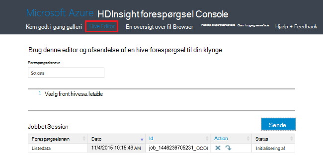

<properties
    pageTitle="Administrere Hadoop klynger i portalen til Azure HDInsight | Microsoft Azure"
    description="Lær, hvordan du administrerer HDInsight Service. Oprette en HDInsight klynge, åbne konsollen interaktive JavaScript, og Åbn konsollen Hadoop-kommando."
    services="hdinsight"
    documentationCenter=""
    tags="azure-portal"
    authors="mumian"
    manager="jhubbard"
    editor="cgronlun"/>

<tags
    ms.service="hdinsight"
    ms.workload="big-data"
    ms.tgt_pltfrm="na"
    ms.devlang="na"
    ms.topic="article"
    ms.date="09/14/2016"
    ms.author="jgao"/>

# Administrere Hadoop klynger i HDInsight ved hjælp af portalen Azure

[AZURE.INCLUDE [selector](../../includes/hdinsight-portal-management-selector.md)]

Ved hjælp af [Azure portal][azure-portal], du kan oprette Hadoop klynger i Azure HDInsight, ændre Hadoop brugeradgangskode og aktivere RDP Remote Desktop Protocol (), så du kan få adgang til kommandoen Hadoop-konsollen på klyngen.

Oplysninger i denne artikel gælder kun for vinduet-baserede HDInsight klynger. Klik på tabulatorvælgeren ovenfor for at få oplysninger om administration af Linux-baserede klynger.

Klik på tabulatorvælgeren oplysninger om oprettelse af Hadoop klynger i HDInsight ved hjælp af andre værktøjer. 

**Forudsætninger**

Før du begynder i denne artikel, skal du have følgende:

- **En Azure-abonnement**. Se [få Azure gratis prøveversion](https://azure.microsoft.com/documentation/videos/get-azure-free-trial-for-testing-hadoop-in-hdinsight/).
- **Azure-lager konto** – en HDInsight klynge bruger en Azure Blob storage beholder som standard-filsystemet. Du kan finde flere oplysninger om hvordan Azure Blob-lager giver en problemfri oplevelse med HDInsight klynger, [Brug Azure Blob-lager med HDInsight](hdinsight-hadoop-use-blob-storage.md). Se, [hvordan du opretter en lagerplads konto](../storage/storage-create-storage-account.md)få mere at vide om oprettelse af en Azure-lager-konto.

##Åbn-portalen

1. Log på [https://portal.azure.com](https://portal.azure.com).
2. Når du åbner portalen, kan du:

    - Klik på **Ny** fra menuen til venstre til at oprette en ny klynge:
    
        
    - Klik på **HDInsight klynger** fra menuen til venstre.
    
        

    Hvis **HDInsight** ikke vises på menuen til venstre skal du klikke på **Gennemse**. 

    

##Oprette klynger

Du kan finde oprettelse af vejledningen ved hjælp af portalen, [oprette HDInsight klynger](hdinsight-provision-clusters.md#create-using-the-preview-portal).

HDInsight fungerer med et bredt udvalg af Hadoop-komponenter. Liste over de komponenter, der er blevet godkendt og understøttes, se [hvilken version af Hadoop i Azure HDInsight](hdinsight-component-versioning.md). Du kan tilpasse HDInsight ved hjælp af en af følgende indstillinger:

- Bruge scripthandling til at køre brugerdefinerede scripts, som kan tilpasse en klynge for at ændre klynge konfiguration eller installere brugerdefinerede komponenter som Giraph eller Solr. Se [tilpasse HDInsight klynge ved hjælp af scripthandling](hdinsight-hadoop-customize-cluster.md)kan finde flere oplysninger.
- Bruge klynge tilpasning parametre i HDInsight .NET SDK eller Azure PowerShell under oprettelse af klynge. Disse ændringer i konfigurationen bevares derefter gennem levetiden for klyngen og påvirkes ikke af klynge node reimages, som udfører Azure-platformen med jævne mellemrum for vedligeholdelse. Du kan finde flere oplysninger om brug af parametrene klynge tilpasning, [oprette HDInsight klynger](hdinsight-provision-clusters.md).
- Nogle indbyggede Java-komponenter, som Mahout og kaskadevis, kan køres på klyngen som glas filer. Filerne glas kan distribueret til Azure Blob-lager og sendes til HDInsight klynger gennem Hadoop-job bidrag metode. Yderligere oplysninger finder du se [sende Hadoop job fra et program](hdinsight-submit-hadoop-jobs-programmatically.md).

    >[AZURE.NOTE] Hvis du har problemer med installation af glas filer til HDInsight klynger eller ringer glas filer på HDInsight klynger, skal du kontakte [Microsoft Support](https://azure.microsoft.com/support/options/).

    > Overlappende understøttes ikke af HDInsight og er ikke omfattet Microsoft Support. Lister over understøttede komponenter, se [Nyheder i de klynge versioner, der leveres af HDInsight?](hdinsight-component-versioning.md).

Installation af brugerdefineret softwaren på klynge ved hjælp af Fjernskrivebord understøttes ikke. Du skal undgå at gemme filer på drev af noden hoved, som de vil gå tabt, hvis du har brug at genskabe klynger. Vi anbefaler, at gemme filer på Azure Blob-lager. BLOB-lager er fast.

##Liste og Vis klynger

1. Log på [https://portal.azure.com](https://portal.azure.com).
2. Klik på **HDInsight klynger** fra menuen til venstre.
3. Klik på klyngenavnet. Hvis listen klynge er lang tid, kan du bruge filter øverst på siden.
4. Dobbeltklik på en klynge fra listen for at få vist detaljerne.

    **Menuen og vigtige oplysninger**:

    
    
    - Du kan tilpasse menuen ved Højreklik et vilkårligt sted i menuen, og klik derefter på **Tilpas**.
    - **Indstillinger** og **Alle indstillinger**: Viser bladet **Indstillinger** for klynge, hvor du kan få adgang til detaljerede konfigurationsoplysninger for-klyngen.
    - **Dashboard**, **Klynge Dashboard** og **URL-adresse: Dette er alle metoder til at få adgang til dashboardet klynge, som er Ambari Web til Linux-baserede klynger. - **Secure Shell **: Viser vejledningen for at oprette forbindelse til den klynge ved hjælp af Secure Shell (SSH) forbindelse.
    - **Skala klynge**: gør det muligt at ændre antallet af knuder arbejder for denne klynge.
    - **Slette**: Sletter klyngen.
    - **Hurtig start ()**: Viser oplysninger, der hjælper dig med at komme i gang ved hjælp af HDInsight.
    - **Brugere ()**: gør det muligt at angive tilladelser for _portalen administration_ af denne klynge for andre brugere på dit Azure-abonnement.
    
        > [AZURE.IMPORTANT] Denne _kun_ påvirker adgang og tilladelser til denne klynge i Azure-portalen, og har ingen indflydelse på hvem der kan oprette forbindelse til eller sende job til HDInsight klynge.
    - **Mærker ()**: mærker gør det muligt at angive nøgle/værdi-par til at definere en brugerdefineret taksonomi for dine tjenester til skyen. For eksempel kan du oprette en nøgle med navnet __projekt__og derefter bruge en fælles værdi for alle tjenester, der er knyttet til et bestemt projekt.
    - **Ambari visninger**: Links til Ambari Web.
    
    > [AZURE.IMPORTANT] Hvis du vil administrere de tjenester, som HDInsight klyngen, skal du bruge Ambari internettet eller Ambari REST-API. Du kan finde flere oplysninger om brug af Ambari, [administrere HDInsight klynger ved hjælp af Ambari](hdinsight-hadoop-manage-ambari.md).

    **Brug**:
    
    
    
5. Klik på **Indstillinger**.

    

    - **Egenskaber**: se egenskaberne for klynge.
    - **Klynge AAD identitet**: 
    - **Azure lagerplads taster**: få vist standardkontoen lager og nøglen. Kontoen lagerplads er konfiguration under oprettelsen af klynge.
    - **Klynge Login**: ændre klynge HTTP brugernavn og adgangskode.
    - **Eksterne Metastores**: få vist Hive og Oozie metastores. Metastores kan kun konfigureres under oprettelsen af klynge.
    - **Skala klynge**: Forøg eller Formindsk antallet af knuder, klynge arbejder.
    - **Fjernskrivebord**: aktivere og deaktivere Fjernskrivebord (RDP) adgang og konfigurere RDP-brugernavn.  RDP-brugernavn skal være forskellige fra HTTP brugernavnet.
    - **Registreret partner**:
    
    > [AZURE.NOTE] Dette er en generisk liste over tilgængelige indstillinger ikke alle kan være til stede for alle typer af klynge.

6. Klik på **Egenskaber**:

    Listerne egenskaber følgende:
    
    - **Hostname**: klyngenavn.
    - **Klynge URL-adresse**.
    - **Status**: medtage afbrudt, accepteres, ClusterStorageProvisioned, AzureVMConfiguration, HDInsightConfiguration, brugbar, kører, fejl, hvis du sletter, slettet, har fået timeout, DeleteQueued, DeleteTimedout, DeleteError, PatchQueued, CertRolloverQueued, ResizeQueued, ClusterCustomization
    - **Område**: Azure placering. Se rullemenuen **område** på [HDInsight priser](https://azure.microsoft.com/pricing/details/hdinsight/)for en liste over understøttede Azure placeringer.
    - **Oprettet af data**.
    - **Operativsystem**: enten **Windows** eller **Linux**.
    - **Type**: Hadoop, HBase, Storm, sætte gang. 
    - **Version**. Se [HDInsight versioner](hdinsight-component-versioning.md)
    - **Abonnement**: abonnementets navn.
    - **Abonnement-ID**.
    - **Primær datakilde**. Azure Blob storage konto bruges som standard Hadoop-filsystemet.
    - **Arbejder noder priser niveau**.
    - **I afsnit node priser niveau**.

##Slette klynger

Slet en klynge bliver ikke slettet lagerplads standardkontoen eller alle sammenkædede lagerplads-konti. Du kan oprette klyngen igen ved hjælp af de samme lagerplads konti og den samme metastores.

1. Log på [portalen][azure-portal].
2. Klik på **Gennemse alt** fra menuen til venstre, skal du klikke på **HDInsight klynger**, skal du klikke på klyngenavnet på din.
3. Klik på **Slet** i menuen øverste, og følg derefter vejledningen.

Se også [Pause/Luk klynger](#pauseshut-down-clusters).

##Skala klynger
Klynge skalering funktion gør det muligt at ændre antallet af knuder, som bruges af en klynge, der kører på Azure HDInsight uden at skulle oprette klyngen.

>[AZURE.NOTE] Kun clusters med HDInsight version 3.1.3 eller højere understøttes. Hvis du er usikker på, hvilken version af din klynge, kan du se siden Egenskaber.  Se [liste og Vis klynger](#list-and-show-clusters).

Virkningen af at ændre antallet af dataknuder for hver type af klynge, der understøttes af HDInsight:

- Hadoop

    Du kan øge antallet af knuder arbejder i en Hadoop-klynge, der kører uden at påvirke alle andre ventende eller kører job problemfrit. Nyt job kan også sendes, når handlingen er i gang. Fejl i handlingen skalering håndteres problemfrit, så klyngen er altid tilbage i en funktionel tilstand.

    Når en Hadoop klynge skaleres ved at reducere antallet af dataknuder,, er nogle af tjenesterne i klyngen genstartet. Derved alle, der kører og ventende job mislykkes ved afslutningen af handlingen skalering. Du kan dog indsender job, når handlingen er fuldført.

- HBase

    Du kan problemfrit tilføjer eller fjerner noder til din HBase klynge, mens den kører. Regionale servere afstemmes automatisk i løbet af et par minutter skalering er udført. Du kan også manuelt saldo de regionale servere, ved at logge ind i headnode af klynge og køre følgende kommandoer fra et kommandopromptvindue:

        >pushd %HBASE_HOME%\bin
        >hbase shell
        >balancer

    Du kan finde flere oplysninger om brug af HBase shell se]
- Storm

    Du kan problemfrit tilføjer eller fjerner data noder til din Storm klynge, mens den kører. Men når installationen er fuldført af handlingen skalering, skal du genoprette topologien.

    Skulle genoprette balancen kan gøres på to måder:

    * Storm web brugergrænseflade
    * Værktøj til kommandolinjen (CLI)

    Se [Apache Storm dokumentation](http://storm.apache.org/documentation/Understanding-the-parallelism-of-a-Storm-topology.html) for at få flere oplysninger.

    Webdelen Storm brugergrænseflade findes på HDInsight klyngen:

    

    Her er et eksempel, hvordan du kan bruge kommandoen CLI for at genoprette Storm topologien:

        ## Reconfigure the topology "mytopology" to use 5 worker processes,
        ## the spout "blue-spout" to use 3 executors, and
        ## the bolt "yellow-bolt" to use 10 executors

        $ storm rebalance mytopology -n 5 -e blue-spout=3 -e yellow-bolt=10

**Skalere klynger**

1. Log på [portalen][azure-portal].
2. Klik på **Gennemse alt** fra menuen til venstre, skal du klikke på **HDInsight klynger**, skal du klikke på klyngenavnet på din.
3. Klik på **Indstillinger** i menuen øverste, og klik derefter på **Skala klynge**.
4. Angiv **antallet af arbejder noder**. Grænsen for antallet af klyngenode varierer mellem Azure abonnementer. Du kan kontakte Faktureringssupport for at øge grænsen.  Oplysninger om omkostninger vil afspejle de ændringer, du har foretaget i antallet af knuder.

    

##Afbryd midlertidigt/Luk klynger

De fleste Hadoop-job er batchen opgaver, der kun kørte nogle gange. De fleste Hadoop-klynger er der stort perioder tid, som klyngen ikke bruges til behandling. Med HDInsight gemmes dine data i Azure-lager, så du kan slette en klynge sikkert, når den ikke er i brug.
Du betaler også for en HDInsight klynge, selvom den ikke er i brug. Da gebyrerne for klyngen mange gange mere end gebyrer for lagerplads, giver økonomisk mening at slette klynger, når de ikke er i brug.

Der er mange måder, du kan programmere processen:

- Bruger Azure Data Factory. Se [Azure HDInsight sammenkædede Service](../data-factory/data-factory-compute-linked-services.md) og [transformere og analysere ved hjælp af Azure Data Factory](../data-factory/data-factory-data-transformation-activities.md) for efter behov og selv defineret HDInsight sammenkædet.
- Bruge Azure PowerShell.  Se [analysér flight forsinkelse data](hdinsight-analyze-flight-delay-data.md).
- Brug Azure CLI. Se [administrere HDInsight klynger ved hjælp af Azure CLI](hdinsight-administer-use-command-line.md).
- Brug HDInsight .NET SDK. Få vist [sende Hadoop sager](hdinsight-submit-hadoop-jobs-programmatically.md).

Prisoplysninger, finde [HDInsight priser](https://azure.microsoft.com/pricing/details/hdinsight/). Hvis du vil slette en klynge fra portalen, skal du se [slette klynger](#delete-clusters)

##Ændre klynge brugernavn

En HDInsight klynge kan have to brugerkonti. Brugerkontoen HDInsight klynge oprettes under oprettelsesprocessen. Du kan også oprette en RDP-brugerkonto for at få adgang til klynge via RDP. Se [aktivere Fjernskrivebord](#connect-to-hdinsight-clusters-by-using-rdp).

**Ændre den HDInsight klynge brugernavn og adgangskode**

1. Log på [portalen][azure-portal].
2. Klik på **Gennemse alt** fra menuen til venstre, skal du klikke på **HDInsight klynger**, skal du klikke på klyngenavnet på din.
3. Klik på **Indstillinger** i menuen øverste, og klik derefter på **Klynge logon**.
4. Hvis **klynge logon** er blevet aktiveret, skal du klikke på **Deaktiver**og klik derefter på **Aktiver** , før du kan ændre brugernavnet og adgangskoden..
4. Ændre **Klynge Login-navn** og/eller **Klynge-logonadgangskode**, og klik derefter på **Gem**.

    

##Giv/revoke access

HDInsight klynger har de følgende HTTP-webtjenester (alle disse tjenester har RESTful slutpunkter):

- ODBC
- JDBC
- Ambari
- Oozie
- Templeton

Disse tjenester er som standard tildelt til access. Du kan revoke/give adgang til fra Azure-portalen.

>[AZURE.NOTE] Ved at give/tilbagekalde adgang, kan du nulstille klynge brugernavn og din adgangskode.

**Til at give/revoke HTTP-web services adgang**

1. Log på [portalen][azure-portal].
2. Klik på **Gennemse alt** fra menuen til venstre, skal du klikke på **HDInsight klynger**, skal du klikke på klyngenavnet på din.
3. Klik på **Indstillinger** i menuen øverste, og klik derefter på **Klynge logon**.
4. Hvis **klynge logon** er blevet aktiveret, skal du klikke på **Deaktiver**og klik derefter på **Aktiver** , før du kan ændre brugernavnet og adgangskoden..
6. For **Klynge Login brugernavn** og **Adgangskode til klynge logon**, Angiv den nye brugernavn og adgangskode (henholdsvis) for-klyngen.
7. Klik på **Gem**.

    

##Finde lagerplads standardkontoen

Hver HDInsight klynge har en standardkonto lagerplads. Lagerplads standardkontoen og dens taster til en klynge vises under **Indstillinger for**/**Egenskaber**/**Azure lagerplads taster**. Se [liste og Vis klynger](#list-and-show-clusters).

    
##Find ressourcegruppen 

I tilstanden Azure ressourcestyring oprettes hver HDInsight klynge med en Azure ressourcegruppe. Gruppen Azure ressource, der tilhører en klynge vises i:

- Listen klynge har kolonnen **Ressourcegruppe** .
- Klynge **væsentlige** felt.  

Se [liste og Vis klynger](#list-and-show-clusters).
   
##Åbne HDInsight forespørgsel konsol

Konsollen HDInsight forespørgsel indeholder følgende funktioner:

- **Kom i gang galleriet**: for at bruge galleriet skal du se [Få mere at vide Hadoop ved hjælp af galleriet Azure HDInsight kom Introduktion](hdinsight-learn-hadoop-use-sample-gallery.md).
- **Hive Editor**: A web brugergrænseflade til afsendelse af Hive job.  Se [køre Hive forespørgsler ved hjælp af konsollen forespørgsel](hdinsight-hadoop-use-hive-query-console.md).

    

- **Jobs**: overvåge Hadoop-job.  

    

    Klik på **Forespørgselsnavn** for at få vist detaljerne, herunder jobegenskaber, **Jobbet forespørgsel**, og ** Job Output. Du kan også hente både forespørgslen og output til computeren.

- **Fil Browser**: Gennemse lagerplads standardkontoen og sammenkædede lagerplads konti.

    

    På skærmbilledet, den **<Account>** type angiver, at elementet er en Azure-lager-konto.  Klik på kontonavnet til at gennemse filerne.
    
- **Hadoop-brugergrænseflade**.

    
    
    Fra **Hadoop-brugergrænseflade*, du kan gennemse filer, og Kontrollér loggene. 

- **Garn brugergrænseflade**.

    

##Køre Hive-forespørgsler

Klik på **Hive Editor** i konsollen HDInsight forespørgsel til kørte Hive job fra portalen. Klik på [Åbn HDInsight forespørgsel console](#open-hdinsight-query-console).

##Overvåge job

Hvis du vil overvåge job fra portalen, skal du klikke på **Jobs** i konsollen HDInsight forespørgsel. Klik på [Åbn HDInsight forespørgsel console](#open-hdinsight-query-console).

##Gennemse filer

Hvis du vil gennemse filer, der er gemt i lagerplads standardkontoen og kontiene sammenkædede lagerplads, skal du klikke på **Fil browseren** i konsollen HDInsight forespørgsel. Klik på [Åbn HDInsight forespørgsel console](#open-hdinsight-query-console).

Du kan også bruge værktøjet **Gennemse filsystemet** fra **Hadoop brugergrænseflade** i konsollen HDInsight.  Klik på [Åbn HDInsight forespørgsel console](#open-hdinsight-query-console).

##Overvåge klynge brugen

Sektionen __brugen__ af bladet HDInsight klynge viser oplysninger om antallet kerner, der er tilgængelige til dit abonnement til brug sammen med HDInsight samt antallet af kerner, der er tildelt denne klynge, og hvordan de er allokeret for knuderne i denne klynge. Se [liste og Vis klynger](#list-and-show-clusters).

> [AZURE.IMPORTANT] Hvis du vil overvåge de tjenester, som HDInsight klyngen, skal du bruge Ambari internettet eller Ambari REST-API. Du kan finde flere oplysninger om brug af Ambari se [administrere HDInsight klynger ved hjælp af Ambari](hdinsight-hadoop-manage-ambari.md)

##Åbne Hadoop-Brugergrænsefladen

Hvis du vil overvåge klyngen, gennemse filsystemet, og Kontrollér loggene, skal du klikke på **Hadoop brugergrænseflade** i konsollen HDInsight forespørgsel. Klik på [Åbn HDInsight forespørgsel console](#open-hdinsight-query-console).

##Åbn garn brugergrænseflade

Hvis du vil bruge garn brugergrænseflade, skal du klikke på **Garn Brugergrænsefladen** i konsollen HDInsight forespørgsel. Klik på [Åbn HDInsight forespørgsel console](#open-hdinsight-query-console).

##Oprette forbindelse til klynger ved hjælp af RDP

Legitimationsoplysninger for den klynge, som du angav på oprettelsen give adgang til tjenester på klyngen, men ikke på selve klynge via Fjernskrivebord. Du kan slå Fjernskrivebord adgang, når du klargør en klynge eller efter en klynge er klargjort. Du kan finde oplysninger om aktivering af Fjernskrivebord ved oprettelse, [oprette HDInsight klynge](hdinsight-provision-clusters.md).

**Aktivere Fjernskrivebord**

1. Log på [portalen][azure-portal].
2. Klik på **Gennemse alt** fra menuen til venstre, skal du klikke på **HDInsight klynger**, skal du klikke på klyngenavnet på din.
3. Klik på **Indstillinger** i menuen øverste, og klik derefter på **Fjernskrivebord**.
4. Angiv **Udløber på**, **Remote Desktop-brugernavn** og **Din adgangskode Remote Desktop**, og klik derefter på **Aktivér**.

    

    Standardværdierne for udløber på er en uge.
> [AZURE.NOTE] Du kan også bruge HDInsight .NET SDK til at aktivere Fjernskrivebord på en klynge. Bruge metoden **EnableRdp** for objektet HDInsight-klienten på følgende måde: **klient. EnableRdp (clustername, placering, "rdpuser", "rdppassword", DateTime.Now.AddDays(6))**. På samme måde for at deaktivere Fjernskrivebord på klyngen, kan du bruge **klienten. DisableRdp (clustername, placering)**. Du kan finde flere oplysninger om disse metoder, [HDInsight.NET SDK Reference](http://go.microsoft.com/fwlink/?LinkId=529017). Dette gælder kun for HDInsight klynger kører på Windows.

**Oprette forbindelse til en klynge ved hjælp af RDP**

1. Log på [portalen][azure-portal].
2. Klik på **Gennemse alt** fra menuen til venstre, skal du klikke på **HDInsight klynger**, skal du klikke på klyngenavnet på din.
3. Klik på **Indstillinger** i menuen øverste, og klik derefter på **Fjernskrivebord**.
4. Klik på **Opret forbindelse** , og følg vejledningen. Hvis Connect er deaktiveret, skal du aktivere det først. Kontrollér, at ved hjælp af Remote Desktop bruger brugernavn og din adgangskode.  Du kan ikke bruge brugerlegitimationsoplysninger klynge.

##Åbn Hadoop kommandolinjen

Hvis du vil oprette forbindelse til klyngen ved hjælp af Fjernskrivebord og bruge kommandolinjen Hadoop, skal du først har aktiveret Fjernskrivebord adgang til klyngen som beskrevet i forrige afsnit.

**Åbne en Hadoop kommandolinje**

1. Oprette forbindelse til den klynge ved hjælp af Remote Desktop.
8. Fra computeren, skal du dobbeltklikke på **Hadoop-kommandolinjen**.

    ![HDI. HadoopCommandLine][image-hadoopcommandline]

    Du kan finde flere oplysninger om Hadoop-kommandoer, [Hadoop kommandoer reference](http://hadoop.apache.org/docs/current/hadoop-project-dist/hadoop-common/CommandsManual.html).

Mappenavnet indeholder versionsnummeret Hadoop integreret i det forrige skærmbillede. Versionsnummeret kan ændres afhængigt af versionen af de Hadoop-komponenter, der er installeret på klyngen. Du kan bruge Hadoop-miljøvariabler til at referere til disse mapper. Eksempel:

    cd %hadoop_home%
    cd %hive_home%
    cd %hbase_home%
    cd %pig_home%
    cd %sqoop_home%
    cd %hcatalog_home%
    
##Næste trin
I denne artikel, har du lært, hvordan du opretter en HDInsight klynge ved hjælp af portalen, og hvordan du åbner værktøjet Hadoop-kommandolinjen. Hvis du vil vide mere, skal du se følgende artikler:

* [Administrere ved hjælp af PowerShell Azure HDInsight](hdinsight-administer-use-powershell.md)
* [Administrere HDInsight ved hjælp af Azure CLI](hdinsight-administer-use-command-line.md)
* [Oprette HDInsight klynger](hdinsight-provision-clusters.md)
* [Sende Hadoop-job fra et program](hdinsight-submit-hadoop-jobs-programmatically.md)
* [Introduktion til Azure HDInsight](hdinsight-hadoop-linux-tutorial-get-started.md)
* [Hvilken version af Hadoop er i Azure HDInsight?](hdinsight-component-versioning.md)

[azure-portal]: https://portal.azure.com
[image-hadoopcommandline]: ./media/hdinsight-administer-use-management-portal/hdinsight-hadoop-command-line.png "Hadoop-kommandolinjen"
