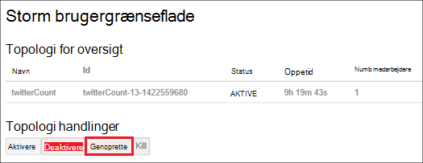

<properties
    pageTitle="Administrere Linux-baserede Hadoop klynger i portalen til Azure HDInsight | Microsoft Azure"
    description="Lær at oprette og administrere Linux-baserede HDInsight klynger ved hjælp af portalen Azure."
    services="hdinsight"
    documentationCenter=""
    authors="mumian"
    manager="jhubbard"
    editor="cgronlun"
    tags="azure-portal"/>

<tags
    ms.service="hdinsight"
    ms.workload="big-data"
    ms.tgt_pltfrm="na"
    ms.devlang="na"
    ms.topic="article"
    ms.date="08/10/2016"
    ms.author="jgao"/>

#Administrere Hadoop klynger i HDInsight ved hjælp af portalen Azure

[AZURE.INCLUDE [selector](../../includes/hdinsight-portal-management-selector.md)]

Ved hjælp af [Azure portal][azure-portal], kan du administrere Linux-baserede klynger i Azure HDInsight. Brug tabulatorvælgeren oplysninger om oprettelse af Hadoop klynger i HDInsight ved hjælp af andre værktøjer. 

**Forudsætninger**

Før du begynder i denne artikel, skal du have følgende:

- **En Azure-abonnement**. Se [få Azure gratis prøveversion](https://azure.microsoft.com/documentation/videos/get-azure-free-trial-for-testing-hadoop-in-hdinsight/).

##Åbn-portalen

1. Log på [https://portal.azure.com](https://portal.azure.com).
2. Når du åbner portalen, kan du:

    - Klik på **Ny** fra menuen til venstre til at oprette en ny klynge:
    
        
    - Klik på **HDInsight klynger** fra menuen til venstre til at få vist de eksisterende klynger
    
        

        Hvis **HDInsight** ikke vises i menuen til venstre, klik på **Gennemse**, og klik derefter på **HDInsight klynger**.

        

##Oprette klynger

[AZURE.INCLUDE [delete-cluster-warning](../../includes/hdinsight-delete-cluster-warning.md)]

HDInsight fungerer med et bredt udvalg af Hadoop-komponenter. Liste over de komponenter, der er blevet godkendt og understøttes, se [hvilken version af Hadoop i Azure HDInsight](hdinsight-component-versioning.md). Du kan finde generelle klynge oprettelse af oplysningerne, [oprette Hadoop klynger i HDInsight](hdinsight-hadoop-provision-linux-clusters.md). 

##Liste og Vis klynger

1. Log på [https://portal.azure.com](https://portal.azure.com).
2. Klik på **HDInsight klynger** fra menuen til venstre til at få vist de eksisterende klynger.
3. Klik på klyngenavnet. Hvis listen klynge er lang tid, kan du bruge filter øverst på siden.
4. Dobbeltklik på en klynge fra listen for at få vist detaljerne.

    **Menuen og vigtige oplysninger**:

    
    
    - **Indstillinger** og **Alle indstillinger**: Viser bladet **Indstillinger** for klynge, hvor du kan få adgang til detaljerede konfigurationsoplysninger for-klyngen.
    - **Dashboard**, **Klynge Dashboard** og ** URL-adresse: Dette er alle metoder til at få adgang til dashboardet klynge, som er Ambari Web til Linux-baserede klynger.
    - **Secure Shell**: Viser vejledningen for at oprette forbindelse til den klynge ved hjælp af Secure Shell (SSH) forbindelse.
    - **Skala klynge**: gør det muligt at ændre antallet af knuder arbejder for denne klynge.
    - **Slette**: Sletter klyngen.
    - **Hurtig start ()**: Viser oplysninger, der hjælper dig med at komme i gang ved hjælp af HDInsight.
    - **Brugere ()**: gør det muligt at angive tilladelser for _portalen administration_ af denne klynge for andre brugere på dit Azure-abonnement.
    
        > [AZURE.IMPORTANT] Denne _kun_ påvirker adgang og tilladelser til denne klynge i Azure-portalen, og har ingen indflydelse på hvem der kan oprette forbindelse til eller sende job til HDInsight klynge.
    - **Mærker ()**: mærker gør det muligt at angive nøgle/værdi-par til at definere en brugerdefineret taksonomi for dine tjenester til skyen. For eksempel kan du oprette en nøgle med navnet __projekt__og derefter bruge en fælles værdi for alle tjenester, der er knyttet til et bestemt projekt.
    - **Ambari visninger**: Links til Ambari Web.
    
    > [AZURE.IMPORTANT] Hvis du vil administrere de tjenester, som HDInsight klyngen, skal du bruge Ambari internettet eller Ambari REST-API. Du kan finde flere oplysninger om brug af Ambari, [administrere HDInsight klynger ved hjælp af Ambari](hdinsight-hadoop-manage-ambari.md).

    **Brug**:
    
    
    
5. Klik på **Indstillinger**.

    

    - **Overvågningslogge**:
    - **Hurtig Start**: Viser oplysninger, der hjælper dig med at komme i gang ved hjælp af HDInsight.
    - **Skala klynge**: Forøg eller Formindsk antallet af knuder, klynge arbejder.
    - **Secure Shell**: Viser vejledningen for at oprette forbindelse til den klynge ved hjælp af Secure Shell (SSH) forbindelse.
    - **HDInsight Partner**: Tilføj/Fjern den aktuelle HDInsight Partner.
    - **Eksterne Metastores**: få vist Hive og Oozie metastores. Metastores kan kun konfigureres under oprettelsen af klynge.
    - **Scripthandlinger**: køre Bash scripts på klyngen.
    - **Egenskaber**: se egenskaberne for klynge.
    - **Azure lagerplads taster**: få vist standardkontoen lager og nøglen. Kontoen lagerplads er konfiguration under oprettelsen af klynge.
    - **Klynge AAD identitet**: 
    - **Brugere**: gør det muligt at angive tilladelser for _portalen administration_ af denne klynge for andre brugere på dit Azure-abonnement.
    - **Mærker**: mærker gør det muligt at angive nøgle/værdi-par til at definere en brugerdefineret taksonomi for dine tjenester til skyen. For eksempel kan du oprette en nøgle med navnet __projekt__og derefter bruge en fælles værdi for alle tjenester, der er knyttet til et bestemt projekt.
    
    > [AZURE.NOTE] Dette er en generisk liste over tilgængelige indstillinger ikke alle kan være til stede for alle typer af klynge.

6. Klik på **Egenskaber**:

    Egenskaberne, er:
    
    - **Hostname**: klyngenavn.
    - **Klynge URL-adresse**.
    - **Status**: medtage afbrudt, accepteres, ClusterStorageProvisioned, AzureVMConfiguration, HDInsightConfiguration, brugbar, kører, fejl, hvis du sletter, slettes, har fået timeout, DeleteQueued, DeleteTimedout, DeleteError, PatchQueued, CertRolloverQueued, ResizeQueued, ClusterCustomization
    - **Område**: Azure placering. Se rullemenuen **område** på [HDInsight priser](https://azure.microsoft.com/pricing/details/hdinsight/)for en liste over understøttede Azure placeringer.
    - **Oprettet af data**.
    - **Operativsystem**: enten **Windows** eller **Linux**.
    - **Type**: Hadoop, HBase, Storm, sætte gang. 
    - **Version**. Se [HDInsight versioner](hdinsight-component-versioning.md)
    - **Abonnement**: abonnementets navn.
    - **Abonnement-ID**.
    - **Standard-datakilde**: standard radialklyngebaseret filsystemet.
    - **Arbejder noder priser niveau**.
    - **I afsnit node priser niveau**.

##Slette klynger

Slet en klynge bliver ikke slettet lagerplads standardkontoen eller alle sammenkædede lagerplads-konti. Du kan oprette klyngen igen ved hjælp af de samme lagerplads konti og den samme metastores. Det anbefales at bruge en ny standard Blob objektbeholder, når du har oprettet klyngen igen.

1. Log på [portalen][azure-portal].
2. Klik på **Gennemse alt** fra menuen til venstre, skal du klikke på **HDInsight klynger**, skal du klikke på klyngenavnet på din.
3. Klik på **Slet** i menuen øverste, og følg derefter vejledningen.

Se også [Pause/Luk klynger](#pauseshut-down-clusters).

##Skala klynger
Klynge skalering funktion gør det muligt at ændre antallet af knuder, som bruges af en klynge, der kører på Azure HDInsight uden at skulle oprette klyngen.

>[AZURE.NOTE] Kun clusters med HDInsight version 3.1.3 eller højere understøttes. Hvis du er usikker på, hvilken version af din klynge, kan du se siden Egenskaber.  Se [liste og Vis klynger](#list-and-show-clusters).

Virkningen af at ændre antallet af dataknuder for hver type af klynge, der understøttes af HDInsight:

- Hadoop

    Du kan øge antallet af knuder arbejder i en Hadoop-klynge, der kører uden at påvirke alle andre ventende eller kører job problemfrit. Nyt job kan også sendes, når handlingen er i gang. Fejl i handlingen skalering håndteres problemfrit, så klyngen er altid tilbage i en funktionstilstand.

    Når en Hadoop klynge skaleres ved at reducere antallet af dataknuder,, er nogle af tjenesterne i klyngen genstartet. Derved alle, der kører og ventende job mislykkes ved afslutningen af handlingen skalering. Du kan dog indsender job, når handlingen er fuldført.

- HBase

    Du kan problemfrit tilføjer eller fjerner noder til din HBase klynge, mens den kører. Regionale servere afstemmes automatisk i løbet af et par minutter skalering er udført. Du kan også manuelt saldo de regionale servere, ved at logge ind i headnode af klynge og køre følgende kommandoer fra et kommandopromptvindue:

        >pushd %HBASE_HOME%\bin
        >hbase shell
        >balancer

    Du kan finde flere oplysninger om brug af HBase shell se]
- Storm

    Du kan problemfrit tilføjer eller fjerner data noder til din Storm klynge, mens den kører. Men når installationen er fuldført af handlingen skalering, skal du genoprette topologien.

    Skulle genoprette balancen kan gøres på to måder:

    * Storm web brugergrænseflade
    * Værktøj til kommandolinjen (CLI)

    Se [Apache Storm dokumentation](http://storm.apache.org/documentation/Understanding-the-parallelism-of-a-Storm-topology.html) for at få flere oplysninger.

    Webdelen Storm brugergrænseflade findes på HDInsight klyngen:

    

    Her er et eksempel, hvordan du kan bruge kommandoen CLI for at genoprette Storm topologien:

        ## Reconfigure the topology "mytopology" to use 5 worker processes,
        ## the spout "blue-spout" to use 3 executors, and
        ## the bolt "yellow-bolt" to use 10 executors

        $ storm rebalance mytopology -n 5 -e blue-spout=3 -e yellow-bolt=10

**Skalere klynger**

1. Log på [portalen][azure-portal].
2. Klik på **Gennemse alt** fra menuen til venstre, skal du klikke på **HDInsight klynger**, skal du klikke på klyngenavnet på din.
3. Klik på **Indstillinger** i menuen øverste, og klik derefter på **Skala klynge**.
4. Angiv **antallet af arbejder noder**. Grænsen for antallet af klyngenode varierer mellem Azure abonnementer. Du kan kontakte Faktureringssupport for at øge grænsen.  Oplysninger om omkostninger vil afspejle de ændringer, du har foretaget i antallet af knuder.

    

##Afbryd midlertidigt/Luk klynger

De fleste Hadoop-job er batchen opgaver, der kun kørte nogle gange. De fleste Hadoop-klynger er der stort perioder tid, som klyngen ikke bruges til behandling. Med HDInsight gemmes dine data i Azure-lager, så du kan slette en klynge sikkert, når den ikke er i brug.
Du betaler også for en HDInsight klynge, selvom den ikke er i brug. Da gebyrerne for klyngen mange gange mere end gebyrer for lagerplads, giver økonomiske mening at slette klynger, når de ikke er i brug.

Der er mange måder, du kan programmere processen:

- Bruger Azure Data Factory. Se [oprette efter behov Linux-baserede Hadoop klynger i HDInsight ved hjælp af Azure Data Factory](hdinsight-hadoop-create-linux-clusters-adf.md) til oprettelse af efter behov HDInsight sammenkædet tjenester.
- Bruge Azure PowerShell.  Se [analysér flight forsinkelse data](hdinsight-analyze-flight-delay-data.md).
- Brug Azure CLI. Se [administrere HDInsight klynger ved hjælp af Azure CLI](hdinsight-administer-use-command-line.md).
- Brug HDInsight .NET SDK. Få vist [sende Hadoop sager](hdinsight-submit-hadoop-jobs-programmatically.md).

Prisoplysninger, finde [HDInsight priser](https://azure.microsoft.com/pricing/details/hdinsight/). Hvis du vil slette en klynge fra portalen, skal du se [slette klynger](#delete-clusters)

##Ændre adgangskoder

En HDInsight klynge kan have to brugerkonti. HDInsight klynge brugerkonto (kaldes også HTTP-brugerkonto) og brugerkontoen SSH oprettes under oprettelsesprocessen. Du kan Ambari internettet Brugergrænsefladen til at ændre klynge bruger konto brugernavn og adgangskode og scripthandlinger til at ændre brugerkontoen SSH

###Ændre klynge brugeradgangskode

Du kan bruge Ambari Webbrugergrænsefladen ændre klynge brugeradgangskoden. Hvis du vil logge på Ambari, skal du bruge den eksisterende klynge brugernavn og adgangskode.

> [AZURE.NOTE] Hvis du ændrer klynge bruger (admin) adgangskode, kan det medføre script handlinger kørte mod denne klynge mislykkes. Hvis du har en hvilken som helst permanente scripthandlinger, target arbejder noder, kan disse mislykkes, når du har tilføjet noder til klynge gennem ændre størrelsen på Handlinger. Du kan finde flere oplysninger om scripthandlinger, [tilpasse HDInsight klynger ved hjælp af scripthandlinger](hdinsight-hadoop-customize-cluster-linux.md).

1. Log på ved hjælp af HDInsight klynge brugerlegitimationsoplysninger Ambari Webbrugergrænsefladen. Standard-brugernavn er **administrator**. URL-adressen er **https://&lt;HDInsight klyngenavn > azurehdinsight.net**.
2. Klik på **administrator** fra den øverste menu, og klik derefter på "Administrere Ambari". 
3. Klik på **brugere**fra menuen til venstre.
4. Klik på **administrator**.
5. Klik på **Skift adgangskode**.

Ambari ændrer derefter adgangskoden på alle noder i klyngen.

###Ændre SSH brugeradgangskode

1. Følgende ved hjælp af en teksteditor, Gem som en fil med navnet __changepassword.sh__.

    > [AZURE.IMPORTANT] Du skal bruge en editor, der bruger LF som linje slutningen. Hvis editoren bruger CRLF, derefter fungerer scriptet ikke.
    
        #! /bin/bash
        USER=$1
        PASS=$2

        usermod --password $(echo $PASS | openssl passwd -1 -stdin) $USER

2. Overføre filen til en lagerplacering, der kan åbnes fra HDInsight ved hjælp af en HTTP eller HTTPS-adresse. For eksempel gemme en offentlig fil såsom OneDrive eller Azure Blob-lager. Gem URI (HTTP eller HTTPS adresse,) til fil, som det er nødvendigt i næste trin.

3. Vælge din klynge HDInsight fra Azure-portalen, og vælg derefter __alle indstillinger__. Vælg __Scripthandlinger__fra bladet __Indstillinger__ .

4. Vælg __Send ny__bladet __Scripthandlinger__ . Når bladet __Send scripthandling__ vises, skal du angive følgende oplysninger.

  	| Felt | Værdi |
  	| ----- | ----- |
  	| Navn | Ændre ssh adgangskode |
  	| Fest script URI | URI til filen changepassword.sh |
  	| Noder (hoved, arbejder, Nimbus, overordnede, Zookeeper osv.) | ✓ for alle nodetyper vises |
  	| Parametre | Angiv brugernavnet SSH og klik derefter på den nye adgangskode. Der skal være et enkelt mellemrum mellem brugernavnet og adgangskoden.
  	| Fastholdes handlingen script... | Lad dette felt være umarkerede.

5. Vælg __Opret__ for at anvende scriptet. Når scriptet afsluttes, vil du kunne oprette forbindelse til den klynge ved hjælp af SSH med den nye adgangskode.

##Giv/revoke access

HDInsight klynger har de følgende HTTP-webtjenester (alle disse tjenester har RESTful slutpunkter):

- ODBC
- JDBC
- Ambari
- Oozie
- Templeton

Disse tjenester er som standard tildelt til access. Du kan revoke/Giv adgang ved hjælp af [Azure CLI](hdinsight-administer-use-command-line.md#enabledisable-http-access-for-a-cluster) og [Azure PowerShell](hdinsight-administer-use-powershell.md#grantrevoke-access).

##Finde abonnement-ID

**Finde abonnementet Azure id'er**

1. Log på [portalen][azure-portal].
2. Klik på **Gennemse alt** fra menuen til venstre, og klik derefter på **abonnementer**. Hvert abonnement har et navn og et-ID.

Hver klynge er bundet til et Azure-abonnement. Abonnement-ID vises på klynge **væsentlige** felt. Se [liste og Vis klynger](#list-and-show-clusters).

##Find ressourcegruppen 

I tilstanden ARM oprettes hver HDInsight klynge med en Azure ressourcegruppe. Gruppen Azure ressource, der tilhører en klynge vises i:

- Listen klynge har kolonnen **Ressourcegruppe** .
- Klynge **væsentlige** felt.  

Se [liste og Vis klynger](#list-and-show-clusters).

##Finde lagerplads standardkontoen

Hver HDInsight klynge har en standardkonto lagerplads. Lagerplads standardkontoen og dens taster til en klynge vises under **Indstillinger for**/**Egenskaber**/**Azure lagerplads taster**. Se [liste og Vis klynger](#list-and-show-clusters).

##Køre Hive-forespørgsler

Du kan ikke køre Hive jobbet direkte fra Azure-portalen, men du kan bruge visningen Hive på Ambari Webbrugergrænseflade.

**Køre Hive forespørgsler med Ambari Hive visning**

1. Log på ved hjælp af HDInsight klynge brugerlegitimationsoplysninger Ambari Webbrugergrænsefladen. Defaut brugernavnet er **administrator**. URL-adressen er **https://&lt;HDInsight klyngenavn > azurehdinsight.net**.
2. Åbne Hive visningen, som vist på følgende skærmbillede:  

    
3. Klik på **forespørgsel** fra den øverste menu.
4. Angiv en Hive-forespørgsel i **Forespørgselseditor**, og klik derefter på **Udfør**.

##Overvåge job

Se [administrere HDInsight klynger ved hjælp af Ambari Webbrugergrænsefladen](hdinsight-hadoop-manage-ambari.md#monitoring).

##Gennemse filer

Ved hjælp af portalen Azure, kan du gennemse indholdet af standard objektbeholderen.

1. Log på [https://portal.azure.com](https://portal.azure.com).
2. Klik på **HDInsight klynger** fra menuen til venstre til at få vist de eksisterende klynger.
3. Klik på klyngenavnet. Hvis listen klynge er lang tid, kan du bruge filter øverst på siden.
4. Klik på **Indstillinger**.
5. **Indstillinger for** blade, klik på **Azure lagerplads taster**.
6. Klik på kontonavnet standard lagerplads.
7. Klik på feltet **BLOB** .
8. Klik på objektbeholder standardnavnet.

##Overvåge klynge brugen

Sektionen __brugen__ af bladet HDInsight klynge viser oplysninger om antallet kerner, der er tilgængelige til dit abonnement til brug sammen med HDInsight samt antallet af kerner, der er tildelt denne klynge, og hvordan de er allokeret for knuderne i denne klynge. Se [liste og Vis klynger](#list-and-show-clusters).

> [AZURE.IMPORTANT] Hvis du vil overvåge de tjenester, som HDInsight klyngen, skal du bruge Ambari internettet eller Ambari REST-API. Du kan finde flere oplysninger om brug af Ambari se [administrere HDInsight klynger ved hjælp af Ambari](hdinsight-hadoop-manage-ambari.md)

##Oprette forbindelse til en klynge

Se [bruge Hive med Hadoop i HDInsight med SSH](hdinsight-hadoop-use-hive-ssh.md#ssh).
    
##Næste trin
I denne artikel, har du lært, hvordan du opretter en HDInsight klynge ved hjælp af portalen, og hvordan du åbner værktøjet Hadoop-kommandolinjen. Hvis du vil vide mere, skal du se følgende artikler:

* [Administrere ved hjælp af PowerShell Azure HDInsight](hdinsight-administer-use-powershell.md)
* [Administrere HDInsight ved hjælp af Azure CLI](hdinsight-administer-use-command-line.md)
* [Oprette HDInsight klynger](hdinsight-provision-clusters.md)
* [Brug Hive i HDInsight](hdinsight-use-hive.md)
* [Bruge gris i HDInsight](hdinsight-use-pig.md)
* [Brug Sqoop i HDInsight](hdinsight-use-sqoop.md)
* [Introduktion til Azure HDInsight](hdinsight-hadoop-linux-tutorial-get-started.md)
* [Hvilken version af Hadoop er i Azure HDInsight?](hdinsight-component-versioning.md)

[azure-portal]: https://portal.azure.com
[image-hadoopcommandline]: ./media/hdinsight-administer-use-portal-linux/hdinsight-hadoop-command-line.png "Hadoop-kommandolinjen"
