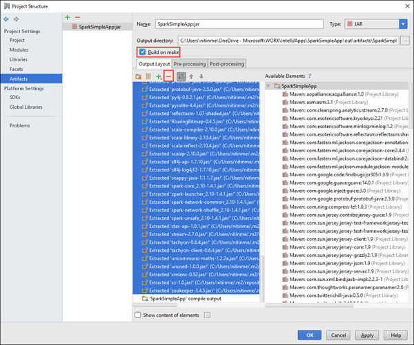

<properties
    pageTitle="Oprette enkeltstående scala programmer til at køre på HDInsight Spark klynger | Microsoft Azure"
    description="Lær at oprette en enkeltstående knallertmotor program tilladelse til at køre på HDInsight Spark klynger."
    services="hdinsight"
    documentationCenter=""
    authors="nitinme"
    manager="jhubbard"
    editor="cgronlun"
    tags="azure-portal"/>

<tags
    ms.service="hdinsight"
    ms.workload="big-data"
    ms.tgt_pltfrm="na"
    ms.devlang="na"
    ms.topic="article"
    ms.date="10/28/2016"
    ms.author="nitinme"/>

# Oprette en enkeltstående program Scala tilladelse til at køre på Apache knallertmotor klynge på HDInsight Linux

I denne artikel indeholder en trinvis vejledning i udviklingsprogrammer enkeltstående knallertmotor skrevet på Scala ved hjælp af Maven med IntelliJ ide. I artiklen bruger Apache Maven som build systemet og starter med en eksisterende Maven archetype for Scala, der leveres af IntelliJ ide.  På en overordnet omfatter oprette en Scala-programmet i IntelliJ ide følgende trin:

* Du kan bruge Maven som build systemet.
* Opdatere Project Object Model (POM)-fil for at løse knallertmotor modul afhængigheder.
* Skriv dit program i Scala.
* Generere en glas-fil, der kan sendes til HDInsight Spark klynger.
* Kør programmet på knallertmotor klynge ved hjælp af Livius.

>[AZURE.NOTE] HDInsight indeholder også en IntelliJ ide-plug-in-værktøj for at gøre det nemmere at oprette og sende programmer til en HDInsight Spark klynge på Linux. Du kan finde yderligere oplysninger finder [Brug HDInsight værktøjer plug-in til IntelliJ ide at oprette og sende knallertmotor programmer](hdinsight-apache-spark-intellij-tool-plugin.md).

**Forudsætninger**

* Et Azure-abonnement. Se [få Azure gratis prøveversion](https://azure.microsoft.com/documentation/videos/get-azure-free-trial-for-testing-hadoop-in-hdinsight/).
* En Apache knallertmotor klynge på HDInsight Linux. Flere oplysninger under [oprette Apache knallertmotor klynger i Azure HDInsight](hdinsight-apache-spark-jupyter-spark-sql.md).
* Oracle Java Development kit. Du kan installere det fra [her](http://www.oracle.com/technetwork/java/javase/downloads/jdk8-downloads-2133151.html).
* En Java IDE. I denne artikel bruges IntelliJ ide 15.0.1. Du kan installere det fra [her](https://www.jetbrains.com/idea/download/).

## Installere plug-in Scala til IntelliJ ide

Hvis IntelliJ ide installation ikke ikke bedt om at aktivere Scala-plug-in, Start IntelliJ IDE og gå gennem følgende trin for at installere plug-in'et:

1. Starte IntelliJ ide, og klik på **Konfigurer** fra velkomstskærmen, og klik derefter på **plug-ins**.

    

2. Klik på **installere JetBrains-plug-in** fra det nederste venstre hjørne i det næste skærmbillede. Søge efter Scala i dialogboksen **Gennemse JetBrains plug-ins** , der åbnes, og klik derefter på **Installer**.

    

3. Klik på **Genstart IntelliJ ide knappen** for at genstarte IDE, når plug-in'et er blevet installeret korrekt.

## Oprette et enkeltstående Scala projekt

1. Start IntelliJ IDE og oprette et nyt projekt. Foretage følgende valg i det nye projekt i dialogboksen, og klik derefter på **Næste**.

    

    * Vælg **Maven** som projekttype.
    * Angiv et **projekt SDK**. Klik på ny, og gå til mappen Java installation typisk `C:\Program Files\Java\jdk1.8.0_66`.
    * Vælg indstillingen **Opret ud fra archetype** .
    * Vælg **org.scala-tools.archetypes:scala-archetype-simple**på listen over archetypes. Dette opretter højre mappestrukturen og hente de nødvendige standard afhængigheder for at skrive Scala program.

2. Indeholder værdier, der er relevante for **gruppe-id**, **ArtifactId**og **Version**. Klik på **Næste**.

3. Accepter standardindstillingerne i den næste dialogboks, hvor du angiver Maven eget bibliotek og andre indstillinger, og klik på **Næste**.

4. Angive et projektnavn og en placering i den sidste dialogboks, og klik derefter på **Udfør**.

5. Slet filen **MySpec.Scala** på **src\test\scala\com\microsoft\spark\example**. Du skal ikke bruge dette til programmet.

6. Hvis det er nødvendigt, kan du omdøbe de standard kilde- og test filer. Gå til **src\main\scala\com.microsoft.spark.example**i venstre rude i IntelliJ ide. Højreklik på **App.scala**, skal du klikke på **Refactor**, klik på Omdøb filer, og i dialogboksen Angiv det nye navn til programmet, og klik derefter **Refactor**.

      

7. I de efterfølgende trin, vil du opdatere pom.xml for at definere afhængigheder for gnister Scala programmet. For disse afhængigheder hentet og løses automatisk, skal du konfigurere Maven i overensstemmelse hermed.

    

    1. Klik på **Indstillinger**i menuen **filer** .
    2. Gå til at **opbygge, udførelse, installation**i dialogboksen **Indstillinger for**  > **Opbygge værktøjer** > **Maven** > **import**.
    3. Vælg indstillingen for at **importere Maven projekter automatisk**.
    4. Klik på **Anvend**, og klik derefter på **OK**.

8. Opdater Scala kildefilen for at medtage dit programkode. Åbne og erstatte den eksisterende eksempelkode med følgende kode og gemme ændringerne. Denne kode læser data fra den HVAC.csv (tilgængelig på alle HDInsight Spark klynger), henter de rækker, der kun har ét ciffer i kolonnen sjette og skriver output til **/HVACOut** under objektbeholderen til lagring af standard for-klyngen.

        package com.microsoft.spark.example

        import org.apache.spark.SparkConf
        import org.apache.spark.SparkContext

        /**
          * Test IO to wasb
          */
        object WasbIOTest {
          def main (arg: Array[String]): Unit = {
            val conf = new SparkConf().setAppName("WASBIOTest")
            val sc = new SparkContext(conf)

            val rdd = sc.textFile("wasbs:///HdiSamples/HdiSamples/SensorSampleData/hvac/HVAC.csv")

            //find the rows which have only one digit in the 7th column in the CSV
            val rdd1 = rdd.filter(s => s.split(",")(6).length() == 1)

            rdd1.saveAsTextFile("wasbs:///HVACout")
          }
        }

9. Opdater pom.xml.

    1.  I `<project>\<properties>` skal du tilføje følgende:

            <scala.version>2.10.4</scala.version>
            <scala.compat.version>2.10.4</scala.compat.version>
            <scala.binary.version>2.10</scala.binary.version>

    2. I `<project>\<dependencies>` skal du tilføje følgende:

            <dependency>
              <groupId>org.apache.spark</groupId>
              <artifactId>spark-core_${scala.binary.version}</artifactId>
              <version>1.4.1</version>
            </dependency>

    Gemme ændringer i pom.xml.

10. Oprette .jar-filen. IntelliJ IDE giver mulighed for oprettelse af glas som en genstand på et projekt. Udfør følgende trin.

    1. Klik på **Projektstruktur**fra menuen **filer** .
    2. Klik på **elementer** i dialogboksen **Projektstruktur** , og klik på plustegnet. Klik på **JAR**i pop op-dialogboksen, og klik derefter på **fra moduler med afhængigheder**.

        

    3. I dialogboksen **Opret JAR fra moduler** , klik på ellipsen ( ) mod **Main klasse**.

    4. Vælg den klasse, der vises som standard, og klik derefter på **OK**i dialogboksen **Vælg Main klasse** .

        

    5. Sørg for, at indstillingen til at **uddrage til destinationen glas** er markeret i dialogboksen **Opret JAR fra moduler** , og klik derefter på **OK**. Dette opretter en enkelt glas med alle afhængigheder.

        

    6. Fanen output layout viser alle krukker, der er inkluderet som en del af Maven projektet. Du kan markere og slette dem, som programmet Scala har ingen direkte afhængighed. For det program, vi opretter her, kan du fjerne alle undtagen sidst en (**SparkSimpleApp samle output**). Vælg krukker slette, og klik derefter på ikonet **Slet** .

        

        Sørg for, at **opbygge på gør** er markeret, hvilket sikrer, at glas oprettes, hver gang projektet er oprettet eller opdateret. Klik på **Anvend** , og klik derefter på **OK**.

    7. Klik på **Generer**menulinjen, og klik derefter på **Sikre Project**. Du kan også klikke på **Opret elementer** for at oprette krukken. Output glas oprettes under **\out\artifacts**.

        

## Kør programmet på knallertmotor klynge

Hvis du vil køre programmet på klyngen, skal du gøre følgende:

* **Kopiere programmet glas til Azure lagerplads blob** er knyttet til klyngen. Du kan bruge [**AzCopy**](../storage/storage-use-azcopy.md), en kommandolinjen til at gøre dette. Der findes en masse samt andre klienter, som du kan bruge til at overføre data. Du kan finde flere oplysninger om dem på [overføre data til Hadoop-job i HDInsight](hdinsight-upload-data.md).

* **Brug Livius til at sende et program job fra en fjernplacering** til knallertmotor klynge. Knallertmotor klynger på HDInsight omfatter Livius, der viser RESTEN slutpunkter for at sende knallertmotor job fra en fjernplacering. Du kan finde yderligere oplysninger finder [sende knallertmotor job ved hjælp af Livius med knallertmotor klynger på HDInsight](hdinsight-apache-spark-livy-rest-interface.md).

## Se også

* [Oversigt: Apache knallertmotor på Azure HDInsight](hdinsight-apache-spark-overview.md)

### Scenarier

* [Knallertmotor med BI: analyse af interaktive data ved hjælp af knallertmotor i HDInsight med BI-værktøjer](hdinsight-apache-spark-use-bi-tools.md)

* [Knallertmotor med Machine Learning: Brug knallertmotor i HDInsight til analyse af bygning temperaturen ved hjælp af VVS-data](hdinsight-apache-spark-ipython-notebook-machine-learning.md)

* [Knallertmotor med Machine Learning: Brug knallertmotor i HDInsight til at forudsige mad undersøgelsesresultaterne](hdinsight-apache-spark-machine-learning-mllib-ipython.md)

* [Knallertmotor Streaming: Brug knallertmotor i HDInsight til udvikling af realtid streaming programmer](hdinsight-apache-spark-eventhub-streaming.md)

* [Websted log analyse ved hjælp af knallertmotor i HDInsight](hdinsight-apache-spark-custom-library-website-log-analysis.md)

### Oprette og køre programmer

* [Køre job fra en fjernplacering på en knallertmotor klynge, ved hjælp af Livius](hdinsight-apache-spark-livy-rest-interface.md)

### Værktøjer og filtypenavne

* [Brug HDInsight værktøjer plug-in til IntelliJ ide at oprette og sende knallertmotor Scala programmer](hdinsight-apache-spark-intellij-tool-plugin.md)

* [Brug HDInsight værktøjer plug-in til IntelliJ ide for at fejlfinde knallertmotor programmer fra en fjernplacering](hdinsight-apache-spark-intellij-tool-plugin-debug-jobs-remotely.md)

* [Bruge Zeppelin notesbøger med en knallertmotor klynge på HDInsight](hdinsight-apache-spark-use-zeppelin-notebook.md)

* [Kerner, der er tilgængelige for Jupyter notesbog i knallertmotor klynge i HDInsight](hdinsight-apache-spark-jupyter-notebook-kernels.md)

* [Bruge eksterne pakker med Jupyter notesbøger](hdinsight-apache-spark-jupyter-notebook-use-external-packages.md)

* [Installere Jupyter på din computer og oprette forbindelse til en HDInsight Spark klynge](hdinsight-apache-spark-jupyter-notebook-install-locally.md)

### Administrere ressourcer

* [Administrere ressourcer for Apache knallertmotor klynge i Azure HDInsight](hdinsight-apache-spark-resource-manager.md)

* [Holde styr på og fejlfinding job, der kører på en Apache knallertmotor klynge i HDInsight](hdinsight-apache-spark-job-debugging.md)
