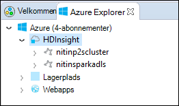

 <properties
    pageTitle="Oprette knallertmotor Scala programmer med HDInsight værktøjer i Azure-værktøjskassen til Eklipse | Microsoft Azure"
    description="Lær at oprette en enkeltstående knallertmotor program tilladelse til at køre på HDInsight Spark klynger."
    services="hdinsight"
    documentationCenter=""
    authors="nitinme"
    manager="jhubbard"
    editor="cgronlun"
    tags="azure-portal"/>

<tags
    ms.service="hdinsight"
    ms.workload="big-data"
    ms.tgt_pltfrm="na"
    ms.devlang="na"
    ms.topic="article"
    ms.date="08/30/2016"
    ms.author="nitinme"/>

# Bruge HDInsight værktøjer i Azure-værktøjskassen til Eklipse til at oprette knallertmotor programmer for HDInsight knallertmotor Linux klynge

I denne artikel indeholder en trinvis vejledning i udviklingsprogrammer knallertmotor skrevet i Scala og sende det til en HDInsight Spark klynge med HDInsight værktøjer i Azure-værktøjskassen til Eklipse. Du kan bruge værktøjerne i et par forskellige måder:

* Til at udvikle og sende et Scala Spark program på en HDInsight Spark klynge
* Få adgang til din Azure HDInsight knallertmotor klyngeressourcer
* At udvikle og køre en Scala Spark program lokalt

>[AZURE.IMPORTANT] Dette værktøj kan bruges til at oprette og sende programmer kun for en HDInsight Spark klynge på Linux.

##Forudsætninger

* Et Azure-abonnement. Se [få Azure gratis prøveversion](https://azure.microsoft.com/documentation/videos/get-azure-free-trial-for-testing-hadoop-in-hdinsight/).

* En Apache knallertmotor klynge på HDInsight Linux. Flere oplysninger under [oprette Apache knallertmotor klynger i Azure HDInsight](hdinsight-apache-spark-jupyter-spark-sql.md).

* Oracle Java Development kit version 7 og 8-version. 
    * **Java SDK 7** bruges til at udarbejde knallertmotor projekter, som HDInsight klynger understøtter Java version 7. Du kan hente Java SDK 7 fra [her](http://www.oracle.com/technetwork/java/javase/downloads/jdk7-downloads-1880260.html).
    * **Java SDK 8** bruges til Eklipse ide-runtime. Du kan hente det fra [her](http://www.oracle.com/technetwork/java/javase/downloads/jdk8-downloads-2133151.html).

* Eklipse IDE. I denne artikel bruges Eklipse Neon. Du kan installere det fra [her](https://www.eclipse.org/downloads/).

* Scala IDE for Eklipse. 
    * **Hvis du har Eklipse IDE installeret**, kan du tilføje Scala IDE plug-in'en ved at gå til **Hjælp** -> **Installere ny SoftWare**, og Tilføj [http://download.scala-ide.org/sdk/lithium/e44/scala211/stable/site](http://download.scala-ide.org/sdk/lithium/e44/scala211/stable/site) som kilde for at hente Scala Plugin for Eklipse. 
    * **Hvis du ikke har Eklipse IDE installeret**, kan du installere Scala IDE direkte fra [her](http://scala-ide.org/download/sdk.html). Du kan hente .zip-filen fra dette link, udtrække den, gå til mappen **/eclipse** og derefter køre **eclipse.exe** fil derfra.
    
    >[AZURE.NOTE] Trinnene i dette dokument er baseret på ved hjælp af Eklipse IDE med Scala-plug-in installeret.

* Knallertmotor SDK. Du kan hente det fra [her](http://go.microsoft.com/fwlink/?LinkID=723585&clcid=0x409).

* Du kan installere e (fx) clipse fra [https://www.eclipse.org/efxclipse/install.html](https://www.eclipse.org/efxclipse/install.html).

## Installere HDInsight værktøjer i Azure-værktøjskassen til Eklipse

HDInsight værktøjer til Eklipse er tilgængelig som en del af Azure-værktøjskassen til Eklipse. Oplysninger om, hvordan du installerer Azure-værktøjskassen, kan du se [installere Azure-værktøjskassen til Eklipse](../azure-toolkit-for-eclipse-installation.md).

## Log på abonnementet Azure

1. Start Eklipse IDE, og Åbn Azure Stifinder. Klik på **Åbn visning** i menuen **vindue** i IDE, og klik derefter på **andre**. Udvid **Azure**fra den dialogboks, der åbnes, skal du klikke på **Azure Explorer**, og klik derefter på **OK**.

    

2. Højreklik på noden **Azure** i **Azure Explorer**, og klik derefter på **Administrer abonnementer**.

3. Klik på **Log på** i dialogboksen **Administrer abonnementer** og angive dine Azure legitimationsoplysninger.

    

4. Når du er logget på, vises dialogboksen **Administrer abonnementer** alle Azure abonnementer der er knyttet til legitimationsoplysningerne. Klik på **Luk** i dialogboksen.

5. Udvid **HDInsight** for at få vist HDInsight Spark klynger under dit abonnement på fanen Azure Explorer.

    

6. Du kan yderligere udvide en klynge navn node for at få vist de ressourcer (fx lagerplads konti), der er knyttet til klyngen.

    

## Konfigurere et knallertmotor Scala projekt til en HDInsight Spark klynge

1. Fra arbejdsplads Eklipse ide-Klik på **filer**, klik på **Ny**og derefter klikke på **projekt**. 

2. Udvid **HDInsight**i guiden **Nyt projekt** , Vælg **knallertmotor på HDInsight (Scala)**, og klik derefter på **Næste**.

    

3. I dialogboksen **Nyt HDInsight Scala projekt** Angiv/Vælg værdier som vist i billedet nedenfor, og klik derefter på **Næste**.

    

    * Angiv et navn for projektet.
    * Sørg for, at **bruge en testmiljø JRE** er indstillet til **JavaSE 1.7**i feltet **JRE** .
    * Sørg for, at knallertmotor SDK er indstillet til den placering, hvor du har hentet SDK. Link til placeringen af overførslen er inkluderet i [forudsætninger, der er](#prerequisites) tidligere i dette emne. Du kan også hente SDK fra det link, der er inkluderet i denne dialogboks, som vist i billedet ovenfor.    

4. Klik på fanen **biblioteker** på Næste i dialogboksen, og dobbeltklik derefter på **JRE systembibliotek [JavaSE-1.7]**.

    

5. Sørg for, at **Testmiljø** er indstillet til **JavaSE-1.7(jdk1.7.0_79)**i dialogboksen **Rediger bibliotek** . Hvis dette ikke er tilgængeligt som en valgmulighed, skal du følge nedenstående trin.

    1. Vælg indstillingen **Alternative JRE** og se, om **JavaSE-1.7(jdk1.7.0_79)** er tilgængelig.
    2. Hvis ikke, skal du klikke på knappen **Installeret JREs** .

          

    3. Klik på **Tilføj**i dialogboksen **Installeret JREs** .

            

    4. Vælg **Standard VM**i dialogboksen **JRE Type** , og klik derefter på **Næste**

            

    5. I dialogboksen **JRE Definition** skal du klikke på mappen, og derefter gå til en placering til JDK 7-installation og vælge rodmappen for **jdk1.7.0_79**.

            

    6. Klik på **Udfør**. Vælg den tilføjede JRE i dialogboksen **Installeret JREs** , og klik derefter på **OK**.

           

    7. Den tilføjede JRE skal være angivet til **Udførelse af miljø**. Klik på **Udfør**.

           

6. Dobbeltklik på **Scala bibliotek beholder [2.11.8]**tilbage under fanen **biblioteker** . Vælg **fast Scala bibliotek objektbeholder: 2.10.6**i dialogboksen **Rediger bibliotek** . 

    

    Klik på **Udfør** , indtil du lukke dialogboksen Indstillinger for project.

## Oprette et Scala program for HDInsight Spark klynge

1. I de allerede er åbnet Eklipse IDE fra **Pakke Explorer**, udvide det projekt, du oprettede tidligere, skal du højreklikke på **src**, peg på **Ny**og derefter klikke på **andre**.

2. Udvid **Scala guider**i dialogboksen **Vælg en guide** , skal du klikke på **Scala objekt**, og klik derefter på **Næste**.

    

3. Angiv et navn til objektet i dialogboksen **Opret ny fil** , og klik derefter på **Udfør**.

    

4. Indsæt følgende kode i tekstredigeringsprogrammet.

        import org.apache.spark.SparkConf
        import org.apache.spark.SparkContext
    
        object MyClusterApp{
          def main (arg: Array[String]): Unit = {
            val conf = new SparkConf().setAppName("MyClusterApp")
            val sc = new SparkContext(conf)
        
            val rdd = sc.textFile("wasbs:///HdiSamples/HdiSamples/SensorSampleData/hvac/HVAC.csv")
        
            //find the rows which have only one digit in the 7th column in the CSV
            val rdd1 =  rdd.filter(s => s.split(",")(6).length() == 1)
        
            rdd1.saveAsTextFile("wasbs:///HVACOut")
          }     
        }

5. Kør programmet på en HDInsight Spark klynge.

    1. **Pakke Explorer**, skal du højreklikke på projektnavnet, og vælg derefter **Sende knallertmotor program tilladelse til at HDInsight**.      

    2. Angiv følgende værdier i dialogboksen **Knallertmotor bidrag** .

        * Vælg den HDInsight Spark klynge, hvor du vil køre programmet for **Klyngenavn**.

        * Skal du enten vælge en genstand Eklipse projektet, eller Vælg en harddisk.

        * Skriv navnet på det objekt, du har angivet i koden mod tekstfeltet **Main klassenavnet** (se billedet nedenfor).

            

        * Fordi programkode i dette eksempel ikke kræver en hvilken som helst kommandolinjeargumenter eller henviser til krukker og filer, kan du lade tekstfelterne resterende tomt.

        * Klik på **Send**.

    3. Fanen **Knallertmotor bidrag** skal starte viser forløbet. Du kan stoppe programmet ved at klikke på den røde knap i vinduet "Knallertmotor bidrag". Du kan også få vist logfilerne for denne specifikke program, der kører ved at klikke på globusikonet (angivet med den blå boksen på billede).

        

    I næste afsnit lære du at få adgang til jobbet output ved hjælp af værktøjerne HDInsight i Azure-værktøjskassen til Eklipse.

## Adgang til og administrere HDInsight Spark klynger ved hjælp af værktøjerne HDInsight i Azure-værktøjskassen til Eklipse

Du kan udføre forskellige handlinger ved hjælp af værktøjerne HDInsight.

### Få adgang til objektbeholderen til lagring af for-klyngen

1. Udvid **HDInsight** rodnode for at få vist en liste over HDInsight Spark klynger, der er tilgængelige fra Stifinder Azure.

3. Udvid klyngenavnet for at se lagerplads kontoen og objektbeholderen til lagring af standard for-klyngen.

    

4. Klik på lagerplads objektbeholdernavnet, der er knyttet til klyngen. I højre rude skal du se en mappe med navnet **HVACOut**. Dobbeltklik for at åbne mappen, og du får vist **en del -*** filer. Åbn en af disse filer for at se output af programmet.

### Få adgang til knallertmotor historik serveren

1. Højreklik på navnet på din knallertmotor klynge **Azure Explorer**, og vælg derefter **Åbn knallertmotor oversigt over Brugergrænsefladen**. Når du bliver bedt om det, kan du angive Administratoroplysninger for-klyngen. Hvis du har angivet disse under klargøring af klyngen.

2. I dashboardet knallertmotor historik Server, kan du søge efter programmet du bare færdig kører ved hjælp af navnet på programmet. I ovenstående kode, du angiver den programmet navn ved hjælp af `val conf = new SparkConf().setAppName("MyClusterApp")`. Det vil sige, blev kaldt knallertmotor programmet **MyClusterApp**.

### Start portalen Ambari

Højreklik på navnet på din knallertmotor klynge **Azure Explorer**, og vælg derefter **Åbn klynge Management-portalen (Ambari)**. Når du bliver bedt om det, kan du angive Administratoroplysninger for-klyngen. Hvis du har angivet disse under klargøring af klyngen.

### Administrere Azure abonnementer

Som standard vises HDInsight værktøjerne i Azure-værktøjskassen til Eklipse knallertmotor klynger fra alle dine Azure abonnementer. Hvis det er nødvendigt, kan du angive de abonnementer, du vil have adgang til klyngen. Højreklik på noden **Azure** rod fra **Azure Explorer**, og klik derefter på **Administrer abonnementer**. Fjern markeringen i afkrydsningsfelterne mod det abonnement, du ikke vil få adgang til, og klik derefter på **Luk**i dialogboksen. Du kan også klikke på **Log af** Hvis du vil logge af abonnementet Azure.

## Køre en knallertmotor Scala program lokalt

Du kan bruge værktøjerne HDInsight i Azure-værktøjskassen til Eklipse til at køre knallertmotor Scala programmer lokalt på computeren. Typisk sådanne programmer ikke har brug for adgang til klyngeressourcer som objektbeholder til lagring og kan køre og testes lokalt.

### Nødvendige program

Du kan få en undtagelse, mens du kører programmet lokale knallertmotor Scala på en Windows-computer, som beskrevet i [KNALLERTMOTOR 2356](https://issues.apache.org/jira/browse/SPARK-2356) , der opstår på grund af en manglende **WinUtils.exe** på Windows OS. Du kan løse fejlen, skal du [hente den eksekverbare fil herfra](http://public-repo-1.hortonworks.com/hdp-win-alpha/winutils.exe) til en placering som **C:\WinUtils\bin**. Derefter skal du tilføje en miljøvariablen **HADOOP_HOME** og værdien af variablen til **C\WinUtils**.

### Køre et lokalt knallertmotor Scala program  

1. Start Eklipse og oprette et nyt projekt. Foretage følgende valg i det nye projekt i dialogboksen, og klik derefter på **Næste**.

    

    * Vælg **HDInsight**i venstre rude.
    * Vælg **knallertmotor på HDInsight lokale køre stikprøve (Scala)**fra den højre rude.
    * Klik på **Næste**.

2. For at give projektoplysninger, skal du følge trin 3 til 6 som vist i det tidligere afsnit [konfigurere et knallertmotor Scala programprojekt til en HDInsight knallertmotor klynge](#set-up-a-spark-scala-application-project-for-an-hdinsight-spark cluster).

3. Skabelonen tilføjer en eksempelkode (**LogQuery**) under mappen **src** , som du kan køre lokalt på din computer.

    

4.  Højreklik på programmet **LogQuery** , pege på **Kør som**, og klik derefter på **1 Scala program**. Du får vist en output således i fanen **konsol** nederst.

    

## Feedback og kendte problemer

I øjeblikket får vist knallertmotor skriver direkte understøttes ikke, og vi arbejder på.

Hvis du har en hvilken som helst forslag eller feedback, eller hvis du støder på problemer, når du bruger dette værktøj, Velkommen til at slippe os en mail på hdivstool på microsoft prik com.

## Se også

* [Oversigt: Apache knallertmotor på Azure HDInsight](hdinsight-apache-spark-overview.md)

### Scenarier

* [Knallertmotor med BI: analyse af interaktive data ved hjælp af knallertmotor i HDInsight med BI-værktøjer](hdinsight-apache-spark-use-bi-tools.md)

* [Knallertmotor med Machine Learning: Brug knallertmotor i HDInsight til analyse af bygning temperaturen ved hjælp af VVS-data](hdinsight-apache-spark-ipython-notebook-machine-learning.md)

* [Knallertmotor med Machine Learning: Brug knallertmotor i HDInsight til at forudsige mad undersøgelsesresultaterne](hdinsight-apache-spark-machine-learning-mllib-ipython.md)

* [Knallertmotor Streaming: Brug knallertmotor i HDInsight til udvikling af realtid streaming programmer](hdinsight-apache-spark-eventhub-streaming.md)

* [Websted log analyse ved hjælp af knallertmotor i HDInsight](hdinsight-apache-spark-custom-library-website-log-analysis.md)

### Oprette og køre programmer

* [Oprette en enkeltstående program, ved hjælp af Scala](hdinsight-apache-spark-create-standalone-application.md)

* [Køre job fra en fjernplacering på en knallertmotor klynge, ved hjælp af Livius](hdinsight-apache-spark-livy-rest-interface.md)

### Værktøjer og filtypenavne

* [Bruge HDInsight værktøjer i Azure-værktøjskassen til IntelliJ til at oprette og sende knallertmotor Scala programmer](hdinsight-apache-spark-intellij-tool-plugin.md)

* [Brug HDInsight værktøjer i Azure-værktøjskassen til IntelliJ at foretage fejlfinding af sætte gang programmer fra en fjernplacering](hdinsight-apache-spark-intellij-tool-plugin-debug-jobs-remotely.md)

* [Bruge Zeppelin notesbøger med en knallertmotor klynge på HDInsight](hdinsight-apache-spark-use-zeppelin-notebook.md)

* [Kerner, der er tilgængelige for Jupyter notesbog i knallertmotor klynge i HDInsight](hdinsight-apache-spark-jupyter-notebook-kernels.md)

* [Bruge eksterne pakker med Jupyter notesbøger](hdinsight-apache-spark-jupyter-notebook-use-external-packages.md)

* [Installere Jupyter på din computer og oprette forbindelse til en HDInsight Spark klynge](hdinsight-apache-spark-jupyter-notebook-install-locally.md)

### Administrere ressourcer

* [Administrere ressourcer for Apache knallertmotor klynge i Azure HDInsight](hdinsight-apache-spark-resource-manager.md)

* [Holde styr på og fejlfinding job, der kører på en Apache knallertmotor klynge i HDInsight](hdinsight-apache-spark-job-debugging.md)
