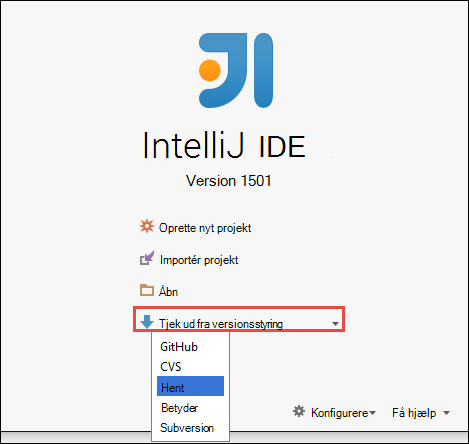
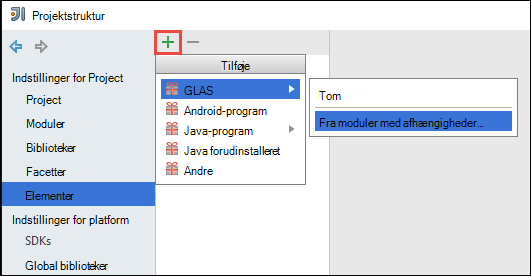
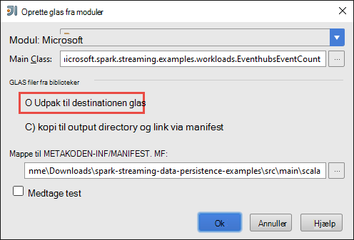

<properties 
    pageTitle="Bruge Azure begivenhed Hubs med Apache knallertmotor i HDInsight til at behandle streaming data | Microsoft Azure" 
    description="Trinvis vejledning til at sende en data streame til Azure begivenhed Hub og derefter modtage disse begivenheder på knallertmotor ved hjælp af en scala program" 
    services="hdinsight" 
    documentationCenter="" 
    authors="nitinme" 
    manager="jhubbard" 
    editor="cgronlun"
    tags="azure-portal"/>

<tags 
    ms.service="hdinsight" 
    ms.workload="big-data" 
    ms.tgt_pltfrm="na" 
    ms.devlang="na" 
    ms.topic="article" 
    ms.date="09/30/2016" 
    ms.author="nitinme"/>

# Knallertmotor Streaming: Behandle begivenheder fra Azure begivenhed Hubs med Apache knallertmotor klynge på HDInsight Linux

Knallertmotor Streaming udvider core knallertmotor API til at opbygge SVG, høj overførselshastighed, fejlsikret stream behandling programmer. Data kan være optagelse fra mange kilder. I denne artikel bruger vi Azure begivenhed Hubs til indtager data. Begivenhed Hubs er et meget SVG indtagelse system, der kan indtag millioner af hændelser sekundet. 

I dette selvstudium lærer du at oprette en Azure begivenhed Hub, hvordan du indtager meddelelser til en begivenhed Hub ved hjælp af en console-program i Java, og til at hente dem parallelt ved hjælp af en styret program, der er skrevet i Scala. Dette program bruger dataene streames gennem begivenhed Hubs og sender den til forskellige output (Azure-lager Blob, Hive tabel og SQL-tabel).

> [AZURE.NOTE] For at følge vejledningen i denne artikel, er du nødt til at bruge begge versioner af Azure portal. Du skal bruge [Azure klassisk portal](https://manage.windowsazure.com)for at oprette en begivenhed Hub. Hvis du vil arbejde med HDInsight Spark klynge, skal bruge du [Azure-portalen](https://portal.azure.com/).  

**Forudsætninger for:**

Du skal have følgende:

- Et Azure-abonnement. Se [få Azure gratis prøveversion](https://azure.microsoft.com/documentation/videos/get-azure-free-trial-for-testing-hadoop-in-hdinsight/).
- En Apache knallertmotor klynge. Flere oplysninger under [oprette Apache knallertmotor klynger i Azure HDInsight](hdinsight-apache-spark-jupyter-spark-sql.md).
- Oracle Java Development kit. Du kan installere det fra [her](http://www.oracle.com/technetwork/java/javase/downloads/jdk8-downloads-2133151.html).
- En Java IDE. I denne artikel bruges IntelliJ ide 15.0.1. Du kan installere det fra [her](https://www.jetbrains.com/idea/download/).
- Microsoft JDBC driver til SQL Server, v4.1 eller nyere. Dette er påkrævet for at skrive begivenhed data til en SQL Server-database. Du kan installere det fra [her](https://msdn.microsoft.com/sqlserver/aa937724.aspx).
- Azure SQL-database. Flere oplysninger under [oprette en SQL-database i minutter](../sql-database/sql-database-get-started.md).

## Hvad gør denne løsning?

Dette er hvordan streaming løsningen flyder:

1. Oprette en Azure begivenhed-Hub, der skal modtage en strøm af begivenheder.

2. Køre en lokal enkeltstående program, der opretter hændelser og skubber det Azure begivenhed hubben. Eksempelprogrammet, der gør dette udgives på [https://github.com/hdinsight/spark-streaming-data-persistence-examples](https://github.com/hdinsight/spark-streaming-data-persistence-examples).

2. Køre et streaming program fra en fjernplacering på en knallertmotor klynge, der læser streaming hændelser fra Azure begivenhed Hub og skubber den på forskellige placeringer (Azure Blob, Hive tabel og SQL-databasetabel). 

## Oprette Azure begivenhed Hub

1. Vælg **Ny**fra [Azure-portalen](https://manage.windowsazure.com), > **Service Bus** > **Begivenhed Hub** > **Brugerdefineret oprette**.

2. På skærmbilledet **Tilføj en ny begivenhed-Hub** , Indtast et **Navn på denne begivenhed Hub**skal du vælge det **område** til at oprette hub på, og oprette et nyt navneområde eller vælge en eksisterende. Klik på **pilen** for at fortsætte.

    ![side 1 i guiden] (./media/hdinsight-apache-spark-eventhub-streaming/hdispark.streaming.create.event.hub.png "Oprette en Azure begivenhed Hub")

    > [AZURE.NOTE] Du skal vælge den samme **placering** som din Apache knallertmotor klynge i HDInsight at reducere ventetid og omkostninger.

3. Angiv værdier **Partition Tæl** og **Meddelelse opbevaring** på skærmbilledet **Konfigurer begivenhed Hub** , og klik derefter på markeringen. I dette eksempel skal du bruge en partition optælling af 10 og en meddelelse opbevaring af 1. Bemærk partition antallet, fordi du skal bruge denne værdi senere.

    ![side 2 i guiden] (./media/hdinsight-apache-spark-eventhub-streaming/hdispark.streaming.create.event.hub2.png "Angiv partition størrelse og opbevaring dage for begivenhed Hub")

4. Klik på den hændelse-Hub, du har oprettet, klik på **Konfigurer**, og derefter oprette to access politikker for begivenhed hubben.

    <table>
    <tr><th>Navn</th><th>Tilladelser</th></tr>
    <tr><td>mysendpolicy</td><td>Send</td></tr>
    <tr><td>myreceivepolicy</td><td>Lytte</td></tr>
    </table>

    Når du opretter tilladelserne, kan du vælge ikonet **Gem** nederst på siden. Dette opretter de delte adgang politikker, der skal bruges til at sende (**mysendpolicy**), og lyt (**myreceivepolicy**) til denne begivenhed Hub.

    ![politikker] (./media/hdinsight-apache-spark-eventhub-streaming/hdispark.streaming.event.hub.policies.png "Oprette begivenhed Hub politikker")

    
5. Tage noter tasterne politik genereres for de to politikker på samme side. Gemme disse taster, fordi de skal bruges senere.

    ![politik taster] (./media/hdinsight-apache-spark-eventhub-streaming/hdispark.streaming.event.hub.policy.keys.png "Gemme politik taster")

6. Klik på **Oplysninger om forbindelsen** fra bunden til at hente og gemme forbindelse strengene til begivenhed hubben ved hjælp af de to politikker på siden **Dashboard** .

    ![politik taster] (./media/hdinsight-apache-spark-eventhub-streaming/hdispark.streaming.event.hub.policy.connection.strings.png "Gemme politik forbindelsesstrenge")

## Brug et Scala program til at sende meddelelser til begivenhed Hub

I dette afsnit kan du bruge et enkeltstående lokalt Scala program til at sende en strøm af begivenheder til Azure begivenhed-Hub, du har oprettet i ovenstående trin. Dette program er tilgængelig på GitHub på [https://github.com/hdinsight/eventhubs-sample-event-producer](https://github.com/hdinsight/eventhubs-sample-event-producer). Trinnene her antager, at du allerede har forked GitHub lageret.

1. Åbn programmet, **EventhubsSampleEventProducer**i IntelliJ ide.
    
2. Oprette projektet. Klik på **Sikre projekt**fra menuen **Build** . Output glas oprettes under **\out\artifacts**.

>[AZURE.TIP] Du kan også bruge en indstilling, der er tilgængelige i IntelliJ ide for at oprette projektet direkte fra et GitHub-lager. For at forstå, hvordan du kan bruge denne metode, skal du bruge instruktionerne i næste afsnit for at få vejledning. Bemærk, at en masse trin, der er beskrevet i næste afsnit ikke er gældende for Scala programmet, som du opretter i dette trin. Eksempel:

> * Du kan ikke nødvendigt at opdatere POM for at medtage knallertmotor versionen. Det skyldes, at der er ingen afhængighed på knallertmotor til oprettelse af dette program
> * Du kan ikke nødvendigt at tilføje nogle afhængighed krukker til biblioteket project. Det skyldes, at disse krukker ikke er påkrævet for dette projekt.

## Opdatere Scala streaming programmet på computeren til at modtage hændelserne

Et eksempel Scala program til at modtage begivenheden og omdirigere til forskellige destinationer findes på [https://github.com/hdinsight/spark-streaming-data-persistence-examples](https://github.com/hdinsight/spark-streaming-data-persistence-examples). Følg nedenstående trin for at opdatere programmet og oprette output glas.

1. Start IntelliJ ide, og vælg **Tjek ud fra versionsstyring** startskærmen, og klik derefter på **ciffer**.
        
    

2. I dialogboksen **Klon lager** skal du angive URL-adresse til ciffer lager, klone fra, Angiv den mappe, at klone til, og klik derefter på **Klon**.

    

    
3. Følg anvisningerne, indtil projektet er helt klonet. Tryk på **Alt + 1** til at åbne **Project-visning**. Det skal ligne følgende.

    
    
4. Kontrollér, at programmet koden er kompileret med Java8. For at sikre, klik på **filer**, klik på **Projektstruktur**og under fanen **projekt** Sørg for projektniveau sprog er indstillet til **8 - Lambdas, type anmærkninger osv**.

    

5. Åbn **pom.xml** , og Sørg for, at knallertmotor versionen er korrekt. Under <properties> node, se efter følgende kodestykke og Bekræft knallertmotor versionen.

        <scala.version>2.10.4</scala.version>
        <scala.compat.version>2.10.4</scala.compat.version>
        <scala.binary.version>2.10</scala.binary.version>
        <spark.version>1.6.2</spark.version>
    
5. Programmet kræver to afhængighed krukker:

    * **EventHub modtager glas**. Dette er påkrævet for gnister til at modtage meddelelser fra begivenhed Hub. Hvis du vil bruge denne glas, opdatere **pom.xml** for at tilføje følgende under `<dependencies>`.

            <dependency>
              <groupId>com.microsoft.azure</groupId>
              <artifactId>spark-streaming-eventhubs_2.10</artifactId>
              <version>1.6.0</version>
            </dependency> 

    * **JDBC driver glas**. Dette er påkrævet for at skrive de meddelelser, der er modtaget fra begivenhed Hub i en Azure SQL-database. Du kan hente v4.1 eller en nyere version af filen glas fra [her](https://msdn.microsoft.com/sqlserver/aa937724.aspx). Tilføj reference til denne glas i project-biblioteket. Udfør følgende trin:

        1. Klik på **Projektstruktur**IntelliJ ide vinduet hvor du har programmet, Åbn, klik på **filer**, og klik derefter på **biblioteker**. 
        
        2. Klik på ikonet Tilføj (), skal du klikke på **Java**og derefter gå til det sted, hvor du har hentet JDBC driver glas. Følg vejledningen for at føje glas filen til biblioteket project.

            ![tilføje manglende afhængigheder] (./media/hdinsight-apache-spark-eventhub-streaming/add-missing-dependency-jars.png "Tilføje manglende afhængighed krukker")

        3. Klik på **Anvend**.

6. Oprette glas outputfilen. Udfør følgende trin.
    1. Klik på **elementer** i dialogboksen **Projektstruktur** , og klik på plustegnet. Klik på **JAR**i pop op-dialogboksen, og klik derefter på **fra moduler med afhængigheder**.

        

    1. I dialogboksen **Opret JAR fra moduler** , klik på ellipsen () mod **Main klasse**.

    1. Vælge en af de tilgængelige klasser, og klik derefter på **OK**i dialogboksen **Vælg Main klasse** .

        

    1. Sørg for, at indstillingen til at **uddrage til destinationen glas** er markeret i dialogboksen **Opret JAR fra moduler** , og klik derefter på **OK**. Dette opretter en enkelt glas med alle afhængigheder.

        

    1. Fanen **Output Layout** viser alle krukker, der er inkluderet som en del af Maven projektet. Du kan markere og slette dem, som programmet Scala har ingen direkte afhængighed. For det program, vi opretter her, kan du fjerne alle undtagen sidst en (**microsoft-knallertmotor-streaming-eksempler samle output**). Vælg krukker slette, og klik derefter på ikonet **Slet** ().

        

        Sørg for, at **opbygge på gør** er markeret, hvilket sikrer, at glas oprettes, hver gang projektet er oprettet eller opdateret. Klik på **Anvend** , og klik derefter på **OK**.

    1. I Output under fanen **Layout** højre nederst i feltet **Tilgængelige elementer** , har du den SQL JDBC glas, som du tidligere har tilføjet til biblioteket, project. Du skal tilføje denne værdi under fanen **Output Layout** . Højreklik på filen glas, og klik derefter på **Udtrække til Output rod**.

          

        Fanen **Output Layout** ser nu sådan ud.

             

        Klik på **Anvend** , og klik derefter på **OK**i dialogboksen **Projektstruktur** . 

    1. Klik på **Generer**menulinjen, og klik derefter på **Sikre Project**. Du kan også klikke på **Opret elementer** for at oprette krukken. Output glas oprettes under **\out\artifacts**.

        

## Køre programmer fra en fjernplacering på en knallertmotor klynge, ved hjælp af Livius

Vi bruger Livius til at køre programmet streaming ved hjælp af en knallertmotor klynge. Du kan finde detaljerede diskussion om, hvordan du bruger Livius med HDInsight Spark klynge, [Send job fra en fjernplacering til en Apache knallertmotor klynge på Azure HDInsight](hdinsight-apache-spark-livy-rest-interface.md). Før du kan starte kører er remote job til stream hændelser ved hjælp af knallertmotor der et par ting, du skal gøre:

1. Start lokale enkeltstående program tilladelse til at generere begivenheder og sendes til begivenhed Hub. Brug følgende kommando for at gøre dette:

        java -cp EventhubsSampleEventProducer.jar com.microsoft.eventhubs.client.example.EventhubsClientDriver --eventhubs-namespace "mysbnamespace" --eventhubs-name "myeventhub" --policy-name "mysendpolicy" --policy-key "<policy key>" --message-length 32 --thread-count 32 --message-count -1

2. Kopiér den streaming glas (**microsoft-knallertmotor-streaming-examples.jar**) til den Azure Blob-lager, der er knyttet til klyngen. Dette gør glas tilgængelig for Livius. Du kan bruge [**AzCopy**](../storage/storage-use-azcopy.md), en kommandolinjen til at gøre dette. Der findes mange andre klienter, du kan bruge til at overføre data. Du kan finde flere oplysninger om dem på [overføre data til Hadoop-job i HDInsight](hdinsight-upload-data.md).

3. Installere KRØLLET på den computer, hvor du kører disse programmer fra. Vi bruger KRØLLET til at kalde Livius slutpunkterne for at køre job fra en fjernplacering.

### Køre programmer til at modtage begivenheder i en Azure-lager Blob som tekst

Åbn en kommandoprompt, Naviger til den mappe, hvor du har installeret KRØLLET og køre følgende kommando (Erstat brugernavn og adgangskode og klynge navn):

    curl -k --user "admin:mypassword1!" -v -H "Content-Type: application/json" -X POST --data @C:\Temp\inputBlob.txt "https://mysparkcluster.azurehdinsight.net/livy/batches"

Parametre i filen **inputBlob.txt** defineres således:

    { "file":"wasbs:///example/jars/microsoft-spark-streaming-examples.jar", "className":"com.microsoft.spark.streaming.examples.workloads.EventhubsEventCount", "args":["--eventhubs-namespace", "mysbnamespace", "--eventhubs-name", "myeventhub", "--policy-name", "myreceivepolicy", "--policy-key", "<put-your-key-here>", "--consumer-group", "$default", "--partition-count", 10, "--batch-interval-in-seconds", 20, "--checkpoint-directory", "/EventCheckpoint", "--event-count-folder", "/EventCount/EventCount10"], "numExecutors":20, "executorMemory":"1G", "executorCores":1, "driverMemory":"2G" }

Lad os se, hvad parametrene i filen input er:

* **filen** er stien til filen programmet glas på kontoen Azure-lager, der er knyttet til klyngen.
* **Klassenavn** er navnet på klassen i krukken.
* **argumenter** er på listen med argumenter, der kræves, før klassen
* **numExecutors** er antallet kerner, der bruges af knallertmotor til at køre programmet streaming. Dette skal altid være mindst to gange antallet af begivenhed Hub partitioner.
* **executorMemory**, **executorCores**, **driverMemory** er parametre, der bruges til at tildele ressourcer, der kræves til streaming programmet.

>[AZURE.NOTE] Du behøver ikke at oprette de outputmapper (EventCheckpoint, EventCount/EventCount10), der bruges som parametre. Streaming programmet opretter dem for dig.
    
Når du kører kommandoen, skal du se output ud som følger:

    < HTTP/1.1 201 Created
    < Content-Type: application/json; charset=UTF-8
    < Location: /18
    < Server: Microsoft-IIS/8.5
    < X-Powered-By: ARR/2.5
    < X-Powered-By: ASP.NET
    < Date: Tue, 01 Dec 2015 05:39:10 GMT
    < Content-Length: 37
    <
    {"id":1,"state":"starting","log":[]}* Connection #0 to host mysparkcluster.azurehdinsight.net left intact

Skal du notere batchen id i den sidste linje i output (i dette eksempel er det '1'). For at bekræfte, at programmet kører korrekt, kan du se kontoen Azure-lager, der er knyttet til klyngen, og du bør se mappen **/EventCount/EventCount10** , der har oprettet. Denne mappe skal indeholde blob, der registrerer antallet af hændelser behandlet inden for angivne tidsrum angivet i parameter **batchen interval i sekunder**.

Programmet fortsætter med at køre, indtil du Luk den. Gør du ved at bruge følgende kommando:

    curl -k --user "admin:mypassword1!" -v -X DELETE "https://mysparkcluster.azurehdinsight.net/livy/batches/1"

### Køre programmer til at modtage begivenheder i en Azure-lager Blob som JSON

Åbn en kommandoprompt, Naviger til den mappe, hvor du har installeret KRØLLET og køre følgende kommando (Erstat brugernavn og adgangskode og klynge navn):

    curl -k --user "admin:mypassword1!" -v -H "Content-Type: application/json" -X POST --data @C:\Temp\inputJSON.txt "https://mysparkcluster.azurehdinsight.net/livy/batches"

Parametre i filen **inputJSON.txt** defineres således:

    { "file":"wasbs:///example/jars/microsoft-spark-streaming-examples.jar", "className":"com.microsoft.spark.streaming.examples.workloads.EventhubsToAzureBlobAsJSON", "args":["--eventhubs-namespace", "mysbnamespace", "--eventhubs-name", "myeventhub", "--policy-name", "myreceivepolicy", "--policy-key", "<put-your-key-here>", "--consumer-group", "$default", "--partition-count", 10, "--batch-interval-in-seconds", 20, "--checkpoint-directory", "/EventCheckpoint", "--event-count-folder", "/EventCount/EventCount10", "--event-store-folder", "/EventStore10"], "numExecutors":20, "executorMemory":"1G", "executorCores":1, "driverMemory":"2G" }

Parametrene, der ligner hvad du har angivet for tekstoutput, i det forrige trin. Igen, behøver du ikke oprette output mapperne (EventCheckpoint, EventCount/EventCount10), der bruges som parametre. Streaming programmet opretter dem for dig.

 Når du kører kommandoen, du kan se på kontoen Azure-lager, der er knyttet til klyngen og skal du se afsnittet mappen **/EventStore10** , der har oprettet. Åbn en fil, præfikset **del –** og du bør se de hændelser, der er behandlet i JSON-format.

### Køre programmer til at modtage begivenheder i en Hive-tabel

Hvis du vil køre programmet, der streamer begivenheder i en Hive-tabel, du har brug for nogle yderligere komponenter. Dette er:

* datanucleus-api-jdo-3.2.6.jar
* datanucleus-rdbms-3.2.9.jar
* datanucleus-core-3.2.10.jar
* hive-site.xml

**.Jar** filerne er tilgængelige på din HDInsight Spark klynge på `/usr/hdp/current/spark-client/lib`. **Hive-site.xml** er aktiveret i `/usr/hdp/current/spark-client/conf`.

Du kan bruge [WinScp](http://winscp.net/eng/download.php) og overskrive disse filer fra klyngen til din lokale computer. Du kan derefter bruge værktøjer til at kopiere disse filer til kontoen lagerplads, der er knyttet til klyngen. Du kan finde flere oplysninger om, hvordan du overføre filer til kontoen lagerplads, kan du se [overføre data til Hadoop-job i HDInsight](hdinsight-upload-data.md).

Når du har kopieret over filerne til kontoen Azure-lager, Åbn en kommandoprompt, Naviger til den mappe, hvor du har installeret KRØLLET og køre følgende kommando (Erstat brugernavn og adgangskode og klynge navn):

    curl -k --user "admin:mypassword1!" -v -H "Content-Type: application/json" -X POST --data @C:\Temp\inputHive.txt "https://mysparkcluster.azurehdinsight.net/livy/batches"

Parametre i filen **inputHive.txt** defineres således:

    { "file":"wasbs:///example/jars/microsoft-spark-streaming-examples.jar", "className":"com.microsoft.spark.streaming.examples.workloads.EventhubsToHiveTable", "args":["--eventhubs-namespace", "mysbnamespace", "--eventhubs-name", "myeventhub", "--policy-name", "myreceivepolicy", "--policy-key", "<put-your-key-here>", "--consumer-group", "$default", "--partition-count", 10, "--batch-interval-in-seconds", 20, "--checkpoint-directory", "/EventCheckpoint", "--event-count-folder", "/EventCount/EventCount10", "--event-hive-table", "EventHiveTable10" ], "jars":["wasbs:///example/jars/datanucleus-api-jdo-3.2.6.jar", "wasbs:///example/jars/datanucleus-rdbms-3.2.9.jar", "wasbs:///example/jars/datanucleus-core-3.2.10.jar"], "files":["wasbs:///example/jars/hive-site.xml"], "numExecutors":20, "executorMemory":"1G", "executorCores":1, "driverMemory":"2G" }

Parametrene, der ligner hvad du har angivet for tekstoutput, i de forrige trin. Igen, behøver du ikke at oprette mapperne output (EventCheckpoint, EventCount/EventCount10) eller output Hive-tabellen (EventHiveTable10), der bruges som parametre. Streaming programmet opretter dem for dig. Bemærk, at indstillingen **krukker** og **filer** omfatter stier, der skal .jar filer og den hive-site.xml, som du kopierede, oven på kontoen, lagerplads.

For at bekræfte, at tabellen hive blev oprettet, kan du SSH til de klynge og køre Hive forespørgsler. Flere oplysninger under [Brug Hive med Hadoop i HDInsight med SSH](hdinsight-hadoop-use-hive-ssh.md). Når du har forbindelse ved hjælp af SSH, kan du køre følgende kommando for at bekræfte, at tabellen Hive **EventHiveTable10**, der oprettes.

    show tables;

Du burde se output ligner følgende:

    OK
    eventhivetable10
    hivesampletable

Du kan også køre en udvælgelsesforespørgsel for at få vist indholdet af tabellen.

    SELECT * FROM eventhivetable10 LIMIT 10;

Du burde se output ud som følger:

    ZN90apUSQODDTx7n6Toh6jDbuPngqT4c
    sor2M7xsFwmaRW8W8NDwMneFNMrOVkW1
    o2HcsU735ejSi2bGEcbUSB4btCFmI1lW
    TLuibq4rbj0T9st9eEzIWJwNGtMWYoYS
    HKCpPlWFWAJILwR69MAq863nCWYzDEw6
    Mvx0GQOPYvPR7ezBEpIHYKTKiEhYammQ
    85dRppSBSbZgThLr1s0GMgKqynDUqudr
    5LAWkNqorLj3ZN9a2mfWr9rZqeXKN4pF
    ulf9wSFNjD7BZXCyunozecov9QpEIYmJ
    vWzM3nvOja8DhYcwn0n5eTfOItZ966pa
    Time taken: 4.434 seconds, Fetched: 10 row(s)

### Køre programmer til at modtage begivenheder i en Azure SQL-databasetabeller

Før du kører dette trin, du skal kontrollere, at du har en Azure SQL-database, der er oprettet. Du skal værdier for databasenavnet, databasenavnet server og database administratorrettigheder som parametre. Du behøver ikke at oprette databasetabellen via. Streaming programmet opretter, for dig.

Åbn en kommandoprompt, Naviger til den mappe, hvor du har installeret KRØLLET og køre følgende kommando:

    curl -k --user "admin:mypassword1!" -v -H "Content-Type: application/json" -X POST --data @C:\Temp\inputSQL.txt "https://mysparkcluster.azurehdinsight.net/livy/batches"

Parametre i filen **inputSQL.txt** defineres således:

    { "file":"wasbs:///example/jars/microsoft-spark-streaming-examples.jar", "className":"com.microsoft.spark.streaming.examples.workloads.EventhubsToAzureSQLTable", "args":["--eventhubs-namespace", "mysbnamespace", "--eventhubs-name", "myeventhub", "--policy-name", "myreceivepolicy", "--policy-key", "<put-your-key-here>", "--consumer-group", "$default", "--partition-count", 10, "--batch-interval-in-seconds", 20, "--checkpoint-directory", "/EventCheckpoint", "--event-count-folder", "/EventCount/EventCount10", "--sql-server-fqdn", "<database-server-name>.database.windows.net", "--sql-database-name", "mysparkdatabase", "--database-username", "sparkdbadmin", "--database-password", "<put-password-here>", "--event-sql-table", "EventContent" ], "numExecutors":20, "executorMemory":"1G", "executorCores":1, "driverMemory":"2G" }

For at bekræfte, at programmet kører korrekt, kan du oprette forbindelse til Azure SQL-databasen ved hjælp af SQL Server Management Studio. Vejledning i, hvordan du gør dette, skal du se [oprette forbindelse til SQL-Database med SQL Server Management Studio](../sql-database/sql-database-connect-query-ssms.md). Når du har forbindelse til databasen, kan du navigere til den **EventContent** tabel, der er oprettet af streaming program. Du kan køre en hurtig forespørgsel for at få vist data fra tabellen. Køre følgende forespørgsel:

    SELECT * FROM EventCount

Du burde se output, der svarer til følgende:

    00046b0f-2552-4980-9c3f-8bba5647c8ee
    000b7530-12f9-4081-8e19-90acd26f9c0c
    000bc521-9c1b-4a42-ab08-dc1893b83f3b
    00123a2a-e00d-496a-9104-108920955718
    0017c68f-7a4e-452d-97ad-5cb1fe5ba81b
    001KsmqL2gfu5ZcuQuTqTxQvVyGCqPp9
    001vIZgOStka4DXtud0e3tX7XbfMnZrN
    00220586-3e1a-4d2d-a89b-05c5892e541a
    0029e309-9e54-4e1b-84be-cd04e6fce5ec
    003333cf-874f-4045-9da3-9f98c2b4ea49
    0043c07e-8d73-420a-9af7-1fcb94575356
    004a11a9-0c2c-4bc0-a7d5-2e0ebd947ab9

    
## Se også

* [Oversigt: Apache knallertmotor på Azure HDInsight](hdinsight-apache-spark-overview.md)

### Scenarier

* [Knallertmotor med BI: analyse af interaktive data ved hjælp af knallertmotor i HDInsight med BI-værktøjer](hdinsight-apache-spark-use-bi-tools.md)

* [Knallertmotor med Machine Learning: Brug knallertmotor i HDInsight til analyse af bygning temperaturen ved hjælp af VVS-data](hdinsight-apache-spark-ipython-notebook-machine-learning.md)

* [Knallertmotor med Machine Learning: Brug knallertmotor i HDInsight til at forudsige mad undersøgelsesresultaterne](hdinsight-apache-spark-machine-learning-mllib-ipython.md)

* [Websted log analyse ved hjælp af knallertmotor i HDInsight](hdinsight-apache-spark-custom-library-website-log-analysis.md)

### Oprette og køre programmer

* [Oprette en enkeltstående program, ved hjælp af Scala](hdinsight-apache-spark-create-standalone-application.md)

* [Køre job fra en fjernplacering på en knallertmotor klynge, ved hjælp af Livius](hdinsight-apache-spark-livy-rest-interface.md)

### Værktøjer og filtypenavne

* [Brug HDInsight værktøjer plug-in til IntelliJ ide at oprette og sende knallertmotor Scala programmer](hdinsight-apache-spark-intellij-tool-plugin.md)

* [Brug HDInsight værktøjer plug-in til IntelliJ ide for at fejlfinde knallertmotor programmer fra en fjernplacering](hdinsight-apache-spark-intellij-tool-plugin-debug-jobs-remotely.md)

* [Bruge Zeppelin notesbøger med en knallertmotor klynge på HDInsight](hdinsight-apache-spark-use-zeppelin-notebook.md)

* [Kerner, der er tilgængelige for Jupyter notesbog i knallertmotor klynge i HDInsight](hdinsight-apache-spark-jupyter-notebook-kernels.md)

* [Bruge eksterne pakker med Jupyter notesbøger](hdinsight-apache-spark-jupyter-notebook-use-external-packages.md)

* [Installere Jupyter på din computer og oprette forbindelse til en HDInsight Spark klynge](hdinsight-apache-spark-jupyter-notebook-install-locally.md)

### Administrere ressourcer

* [Administrere ressourcer for Apache knallertmotor klynge i Azure HDInsight](hdinsight-apache-spark-resource-manager.md)

* [Holde styr på og fejlfinding job, der kører på en Apache knallertmotor klynge i HDInsight](hdinsight-apache-spark-job-debugging.md)

[hdinsight-versions]: hdinsight-component-versioning.md
[hdinsight-upload-data]: hdinsight-upload-data.md
[hdinsight-storage]: hdinsight-hadoop-use-blob-storage.md

[azure-purchase-options]: http://azure.microsoft.com/pricing/purchase-options/
[azure-member-offers]: http://azure.microsoft.com/pricing/member-offers/
[azure-free-trial]: http://azure.microsoft.com/pricing/free-trial/
[azure-management-portal]: https://manage.windowsazure.com/
[azure-create-storageaccount]: ../storage-create-storage-account/ 
