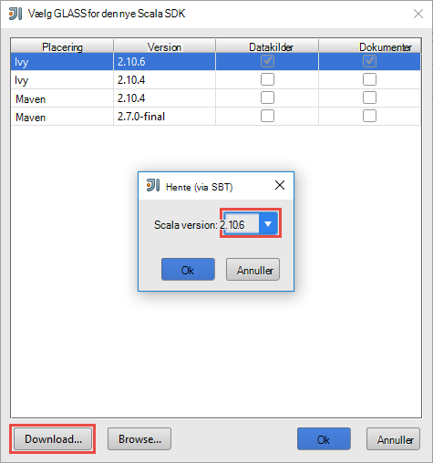
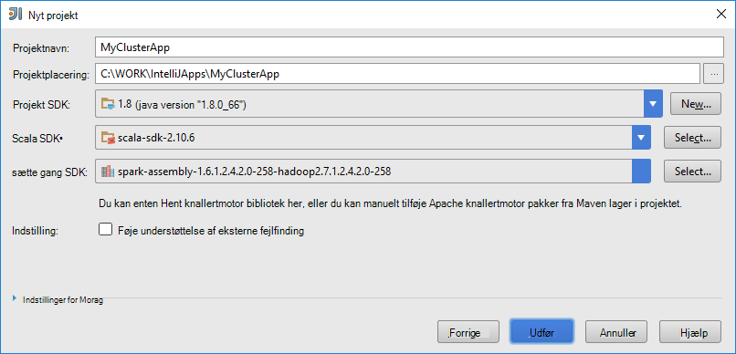
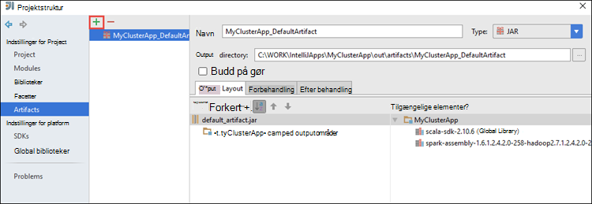
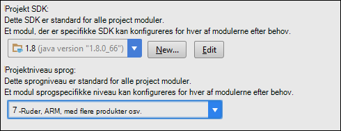
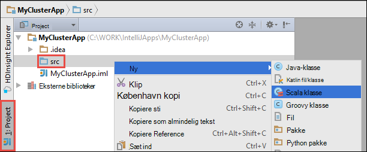

 <properties
    pageTitle="Brug HDInsight værktøjer i Azure-værktøjskassen til IntelliJ til fejlfinding ved hjælp af programmer, der kører på HDInsight Spark klynger | Microsoft Azure"
    description="Få mere at vide hvordan bruge HDInsight værktøjer i Azure-værktøjskassen til IntelliJ til fejlfinding ved hjælp af programmer, der kører på HDInsight Spark klynger."
    services="hdinsight"
    documentationCenter=""
    authors="nitinme"
    manager="jhubbard"
    editor="cgronlun"
    tags="azure-portal"/>

<tags
    ms.service="hdinsight"
    ms.workload="big-data"
    ms.tgt_pltfrm="na"
    ms.devlang="na"
    ms.topic="article"
    ms.date="09/09/2016"
    ms.author="nitinme"/>

# Bruge HDInsight værktøjer i Azure-værktøjskassen til IntelliJ til at foretage fejlfinding af knallertmotor programmer eksternt på HDInsight knallertmotor Linux klynge

I denne artikel indeholder en trinvis vejledning i at bruge HDInsight værktøjerne i Azure-værktøjskassen til IntelliJ til at sende et knallertmotor job på HDInsight Spark klynge og fejlfinde den fra en fjernplacering fra din computer. Hvis du vil gøre det, skal du udføre følgende overordnede trin:

1. Oprette et websted til websted eller punkt-til-websted Azure virtuelt netværk. Trinnene i dette dokument forudsætter, at du bruger et websted til websted netværk.

2. Oprette en knallertmotor klynge i Azure HDInsight, der er en del af websted til Azure virtuelt netværk.

3. Kontrollér forbindelsen mellem klynge headnode og dit skrivebord.

4. Oprette et Scala program i IntelliJ IDE og konfigurere det til ekstern fejlfinding.

5. Kør og udføre fejlfinding i programmet.

##Forudsætninger

* Et Azure-abonnement. Se [få Azure gratis prøveversion](https://azure.microsoft.com/documentation/videos/get-azure-free-trial-for-testing-hadoop-in-hdinsight/).

* En Apache knallertmotor klynge på HDInsight Linux. Flere oplysninger under [oprette Apache knallertmotor klynger i Azure HDInsight](hdinsight-apache-spark-jupyter-spark-sql.md).
 
* Oracle Java Development kit. Du kan installere det fra [her](http://www.oracle.com/technetwork/java/javase/downloads/jdk8-downloads-2133151.html).
 
* IntelliJ ide. I denne artikel bruges version 15.0.1. Du kan installere det fra [her](https://www.jetbrains.com/idea/download/).
 
* HDInsight værktøjer i Azure-værktøjskassen til IntelliJ. HDInsight værktøjer til IntelliJ er tilgængelige som en del af Azure-værktøjskassen til IntelliJ. Oplysninger om, hvordan du installerer Azure-værktøjskassen, kan du se [installere Azure-værktøjskassen til IntelliJ](../azure-toolkit-for-intellij-installation.md).

* Log på dit Azure abonnement fra IntelliJ ide. Følg vejledningen [her](hdinsight-apache-spark-intellij-tool-plugin.md#log-into-your-azure-subscription).
 
* Du kan få en undtagelse, mens du kører knallertmotor Scala-programmet til ekstern fejlfinding på en Windows-computer, som beskrevet i [KNALLERTMOTOR 2356](https://issues.apache.org/jira/browse/SPARK-2356) , der opstår på grund af en manglende WinUtils.exe i Windows. Du kan løse fejlen, skal du [hente den eksekverbare fil herfra](http://public-repo-1.hortonworks.com/hdp-win-alpha/winutils.exe) til en placering som **C:\WinUtils\bin**. Derefter skal du tilføje en miljøvariablen **HADOOP_HOME** og værdien af variablen til **C\WinUtils**.

## Trin 1: Oprette en Azure virtuelt netværk

Følg vejledningen fra den nedenstående links til at oprette et virtuelt Azure-netværk, og Bekræft derefter forbindelsen mellem computer og Azure virtuelt netværk.

* [Oprette en VNet med en-til-websted VPN-forbindelse ved hjælp af Azure-portalen](../vpn-gateway/vpn-gateway-howto-site-to-site-resource-manager-portal.md)
* [Oprette en VNet med en-til-websted VPN-forbindelse ved hjælp af PowerShell](../vpn-gateway/vpn-gateway-create-site-to-site-rm-powershell.md)
* [Konfigurere en punkt-til-site forbindelse til et virtuelt netværk ved hjælp af PowerShell](../vpn-gateway/vpn-gateway-howto-point-to-site-rm-ps.md)

## Trin 2: Oprette en HDInsight Spark klynge

Du skal også oprette en Apache knallertmotor klynge på Azure HDInsight, der er en del af det virtuelle Azure-netværk, du har oprettet. Brug de tilgængelige oplysninger i [oprette Linux-baserede klynger i HDInsight](hdinsight-hadoop-provision-linux-clusters.md). Vælg det virtuelle Azure-netværk, du har oprettet i ovenstående trin, som en del af valgfri konfiguration.

## Trin 3: Bekræft forbindelsen mellem klynge headnode og dit skrivebord

1. Få IP-adressen på headnode. Åbn Ambari UI for-klyngen. Klik på **Dashboard**fra bladet klynge.

    

2. Klik på **Hosts**Ambari UI, fra det øverste højre hjørne.

    

3. Du skal se en liste over headnodes, arbejder noder og zookeeper knuder. Headnodes har **hn*** præfiks. Klik på den første headnode.

    

4. Kopiér IP-adressen på headnode og værtsnavnet nederst på siden, som åbnes fra feltet **Oversigt** .

    

5. Omfatte IP-adressen og værtsnavnet for headnode til **hosts** -filen på computeren, hvor du vil køre og fra en fjernplacering fejlfinde knallertmotor job. Dette gør det muligt at kommunikere med headnode ved hjælp af IP-adressen samt værtsnavnet.

    1. Åbn en Notesblok med administratorrettigheder. Klik på **Åbn** i menuen Filer og derefter gå til placeringen af filen hosts. På en Windows-computer, er det `C:\Windows\System32\Drivers\etc\hosts`.

    2. Tilføj følgende **hosts** -filen.

            # For headnode0
            192.xxx.xx.xx hn0-nitinp
            192.xxx.xx.xx hn0-nitinp.lhwwghjkpqejawpqbwcdyp3.gx.internal.cloudapp.net

            # For headnode1
            192.xxx.xx.xx hn1-nitinp
            192.xxx.xx.xx hn1-nitinp.lhwwghjkpqejawpqbwcdyp3.gx.internal.cloudapp.net

5. Kontrollér, at du kan pinge de begge headnodes ved hjælp af IP-adressen samt værtsnavnet fra den computer, du har forbindelse til det virtuelle Azure-netværk, der bruges af HDInsight klynge.

6. SSH til den klynge headnode ved hjælp af vejledningen på [Opret forbindelse til en HDInsight klynge, ved hjælp af SSH](hdinsight-hadoop-linux-use-ssh-windows.md#connect-to-a-linux-based-hdinsight-cluster). Fra headnode klynge pinge IP-adressen på den stationære computer. Du skal teste forbindelse til begge de IP-adresser, som er tildelt til computeren, et til netværksforbindelsen og et til det virtuelle Azure-netværk, der er tilsluttet computeren.

7. Gentag trinnene for de andre headnode. 

## Trin 4: Oprette et knallertmotor Scala-program ved hjælp af værktøjerne HDInsight i Azure-værktøjskassen til IntelliJ og konfigurere det til ekstern fejlfinding

1. Start IntelliJ IDE og oprette et nyt projekt. Foretage følgende valg i det nye projekt i dialogboksen, og klik derefter på **Næste**.

    

    * Vælg **HDInsight**i venstre rude.
    * Vælg **knallertmotor på HDInsight (Scala)**fra den højre rude.
    * Klik på **Næste**.

2. I det næste vindue skal du give projektoplysninger.

    * Angive et projektnavn og projektets placering.
    * Kontrollér, at du angiver en Java-version, der er større end 7 til **Project SDK**.
    * Til **Scala SDK**, klik på **Opret**, klik på **Hent**og derefter vælge versionen af Scala til brug. **Sørg for, at du ikke bruger version 2.11.x**. Dette eksempel bruger version **2.10.6**.

        

    * **Knallertmotor SDK**, hente og bruge SDK fra [her](http://go.microsoft.com/fwlink/?LinkID=723585&clcid=0x409). Du kan også ignorere dette og bruge [knallertmotor Maven lager](http://mvnrepository.com/search?q=spark) i stedet, men Kontroller, at du har installeret for at udvikle programmerne knallertmotor højre maven lageret. (For eksempel, du har brug at sikre, at du har installeret, hvis du bruger knallertmotor Streaming; delen knallertmotor Streaming Også skal du kontrollere, at du bruger lager er markeret som Scala 2.10 – kan ikke bruge lageret, der er markeret som Scala 2.11.)

        

    * Klik på **Udfør**.

3. Knallertmotor project oprettes der automatisk en genstand for dig. Hvis du vil se genstand, skal du følge disse trin.

    1. Klik på **Projektstruktur**fra menuen **filer** .
    2. Klik på **elementer** for at få vist den standard genstand, der er oprettet i dialogboksen **Projektstruktur** .

        

    Du kan også oprette dine egne genstand bly at klikke på den **+** -ikonet, er fremhævet i billedet ovenfor.

4. Klik på **projekt**i dialogboksen **Projektstruktur** . Hvis **Project SDK** er indstillet til 1,8, skal du sørge for **projektniveau sprog** er indstillet til **7 - ruder, ARM, med flere produkter osv**.

    

4. Tilføje biblioteker til projektet. Tilføje et dokumentbibliotek, skal du højreklikke på projektnavnet i projekttræet, og klik derefter på **Åbn modul indstillinger**. I dialogboksen **Project strukturen** i venstre rude skal du klikke på **biblioteker**skal du klikke på (+) symbol, og klik derefter på **Fra Maven**. 

     

    Søge i dialogboksen **Hent bibliotek fra Maven lager** og tilføje følgende biblioteker.

    * `org.scalatest:scalatest_2.10:2.2.1`
    * `org.apache.hadoop:hadoop-azure:2.7.1`

5. Kopiér `yarn-site.xml` og `core-site.xml` fra klynge headnode og tildele den til projektet. Brug følgende kommandoer til at kopiere filerne. Du kan bruge [Cygwin](https://cygwin.com/install.html) til at køre følgende `scp` kommandoer til at kopiere filerne fra klynge headnodes.

        scp <ssh user name>@<headnode IP address or host name>://etc/hadoop/conf/core-site.xml .

    Da vi allerede har tilføjet klynge headnode IP-adresse og værtsnavne fo værter filen på skrivebordet, kan vi bruge kommandoerne **scp** på følgende måde.

        scp sshuser@hn0-nitinp:/etc/hadoop/conf/core-site.xml .
        scp sshuser@hn0-nitinp:/etc/hadoop/conf/yarn-site.xml .

    Føje disse filer til projektet ved at kopiere dem under mappen **/src** i dit projekt træ, for eksempel `<your project directory>\src`.

6. Opdater den `core-site.xml` til at foretage følgende ændringer.

    1. `core-site.xml`indeholder den krypterede nøgle til kontoen lagerplads, der er knyttet til klyngen. I den `core-site.xml` , du føjet til projektet, erstatte tasten krypteret med tasten faktisk lagerplads der er knyttet til lager standardkontoen. Se [administrere din lagerplads access-taster](../storage/storage-create-storage-account.md#manage-your-storage-account).

            <property>
                <name>fs.azure.account.key.hdistoragecentral.blob.core.windows.net</name>
                <value>access-key-associated-with-the-account</value>
            </property>

    2. Fjern følgende poster fra den `core-site.xml`.

            <property>
                <name>fs.azure.account.keyprovider.hdistoragecentral.blob.core.windows.net</name>
                <value>org.apache.hadoop.fs.azure.ShellDecryptionKeyProvider</value>
            </property>

            <property>
                <name>fs.azure.shellkeyprovider.script</name>
                <value>/usr/lib/python2.7/dist-packages/hdinsight_common/decrypt.sh</value>
            </property>

            <property>
                <name>net.topology.script.file.name</name>
                <value>/etc/hadoop/conf/topology_script.py</value>
            </property>

    3. Gem filen.

7. Tilføj klassen hoved for dit program. Højreklik på **src**fra vinduet **Projektstifinder**, peg på **Ny**, og klik derefter på **Scala klasse**.

    

8. Angiv et navn til **type** Vælg **objekt**, og klik derefter på **OK**i dialogboksen **Opret ny Scala klasse** .

    

9. I den `MyClusterAppMain.scala` filer, Indsæt følgende kode. Denne kode opretter knallertmotor kontekst og startes en `executeJob` metode fra den `SparkSample` objekt.

        import org.apache.spark.{SparkConf, SparkContext}

        object SparkSampleMain {
          def main (arg: Array[String]): Unit = {
            val conf = new SparkConf().setAppName("SparkSample")
                                      .set("spark.hadoop.validateOutputSpecs", "false")
            val sc = new SparkContext(conf)
        
            SparkSample.executeJob(sc,
                                   "wasbs:///HdiSamples/HdiSamples/SensorSampleData/hvac/HVAC.csv",
                                   "wasbs:///HVACOut")
          }
        }

10. Gentag trin 8 og 9 ovenfor for at tilføje et nyt Scala objekt kaldet `SparkSample`. Tilføj følgende kode til denne klasse. Denne kode læser data fra den HVAC.csv (tilgængelig på alle HDInsight Spark klynger), henter de rækker, der kun har ét ciffer i kolonnen syvende i CSV og skriver output til **/HVACOut** under objektbeholderen til lagring af standard for-klyngen.

        import org.apache.spark.SparkContext
    
        object SparkSample {
          def executeJob (sc: SparkContext, input: String, output: String): Unit = {
            val rdd = sc.textFile(input)
        
            //find the rows which have only one digit in the 7th column in the CSV
            val rdd1 =  rdd.filter(s => s.split(",")(6).length() == 1)
        
            val s = sc.parallelize(rdd.take(5)).cartesian(rdd).count()
            println(s)
        
            rdd1.saveAsTextFile(output)
            //rdd1.collect().foreach(println)
          }
        
        }

11. Gentag trin 8 og 9 ovenfor for at tilføje en ny klasse kaldet `RemoteClusterDebugging`. Denne klasse implementerer knallertmotor test forbindelse, der bruges til fejlfinding af programmer. Tilføj følgende kode i den `RemoteClusterDebugging` klasse.

        import org.apache.spark.{SparkConf, SparkContext}
        import org.scalatest.FunSuite
        
        class RemoteClusterDebugging extends FunSuite {
        
          test("Remote run") {
            val conf = new SparkConf().setAppName("SparkSample")
                                      .setMaster("yarn-client")
                                      .set("spark.yarn.am.extraJavaOptions", "-Dhdp.version=2.4")
                                      .set("spark.yarn.jar", "wasbs:///hdp/apps/2.4.2.0-258/spark-assembly-1.6.1.2.4.2.0-258-hadoop2.7.1.2.4.2.0-258.jar")
                                      .setJars(Seq("""C:\WORK\IntelliJApps\MyClusterApp\out\artifacts\MyClusterApp_DefaultArtifact\default_artifact.jar"""))
                                      .set("spark.hadoop.validateOutputSpecs", "false")
            val sc = new SparkContext(conf)
        
            SparkSample.executeJob(sc,
              "wasbs:///HdiSamples/HdiSamples/SensorSampleData/hvac/HVAC.csv",
              "wasbs:///HVACOut")
          }
        }

    Par vigtige ting, du skal være opmærksom her:
    
    * For `.set("spark.yarn.jar", "wasbs:///hdp/apps/2.4.2.0-258/spark-assembly-1.6.1.2.4.2.0-258-hadoop2.7.1.2.4.2.0-258.jar")`, Sørg for, at samlingen knallertmotor glas er tilgængelig på klynge opbevaring på den angivne sti.
    * For `setJars`, Angiv den placering, hvor genstand glas skal oprettes. Det er typisk `<Your IntelliJ project directory>\out\<project name>_DefaultArtifact\default_artifact.jar`. 

11. I den `RemoteClusterDebugging` klasse, skal du højreklikke på `test` nøgleord og vælg **Opret RemoteClusterDebugging konfiguration**.

    

12. Angiv et navn til konfigurationen i dialogboksen, og vælg den **type Test** som **navnet på Test**. Lade alle andre værdier som standard, klik på **Anvend**, og klik derefter på **OK**.

    

13. Du bør nu se en **Remote kører** konfiguration rullemenu i menulinjen. 

    

## Trin 5: Køre programmet i fejlsikret tilstand

1. Åbn i projektet IntelliJ ide `SparkSample.scala` og oprette et pausepunkt ud for 'val rdd1'. Vælg **linje i funktionen executeJob**i pop op-menuen til at oprette et pausepunkt.

    

2. Klik på knappen **Fejlfinding køre** ud for den **Eksterne køre** konfiguration ned til at begynde at køre programmet.

    

3. Når kørsel af programmet når breakpointet, skal du se en **fejlfindingen** fane i den nederste rude.

    

4. Klik på den (**+**) for at føje en værdikontrol, som vist i billedet nedenfor. 

    

    Her, fordi programmet brudt før variablen `rdd1` blev oprettet ved hjælp af denne værdikontrol, kan vi se, hvad er de første 5 rækker i variablen `rdd`. Tryk på **ENTER**.

    

    Hvad du ser i billedet ovenfor er, at på kørselstidspunktet, du kunne for at forespørge terrabytes af data og fejlfinding hvordan dit program skrider frem. For eksempel i outputtet vist i billedet ovenfor, kan du se, at den første række af output er et sidehoved. Baseret på det, kan du ændre din programkode for at springe over kolonneoverskriften, hvis det er nødvendigt.

5. Du kan nu klikke på ikonet **CV Program** for at fortsætte med programmet kører.

    

6. Hvis programmet er fuldført, skal du se afsnittet output ud som følger.

    

 

## Se også

* [Oversigt: Apache knallertmotor på Azure HDInsight](hdinsight-apache-spark-overview.md)

### Scenarier

* [Knallertmotor med BI: analyse af interaktive data ved hjælp af knallertmotor i HDInsight med BI-værktøjer](hdinsight-apache-spark-use-bi-tools.md)

* [Knallertmotor med Machine Learning: Brug knallertmotor i HDInsight til analyse af bygning temperaturen ved hjælp af VVS-data](hdinsight-apache-spark-ipython-notebook-machine-learning.md)

* [Knallertmotor med Machine Learning: Brug knallertmotor i HDInsight til at forudsige mad undersøgelsesresultaterne](hdinsight-apache-spark-machine-learning-mllib-ipython.md)

* [Knallertmotor Streaming: Brug knallertmotor i HDInsight til udvikling af realtid streaming programmer](hdinsight-apache-spark-eventhub-streaming.md)

* [Websted log analyse ved hjælp af knallertmotor i HDInsight](hdinsight-apache-spark-custom-library-website-log-analysis.md)

### Oprette og køre programmer

* [Oprette en enkeltstående program, ved hjælp af Scala](hdinsight-apache-spark-create-standalone-application.md)

* [Køre job fra en fjernplacering på en knallertmotor klynge, ved hjælp af Livius](hdinsight-apache-spark-livy-rest-interface.md)

### Værktøjer og filtypenavne

* [Bruge HDInsight værktøjer i Azure-værktøjskassen til IntelliJ til at oprette og sende knallertmotor Scala programmer](hdinsight-apache-spark-intellij-tool-plugin.md)

* [Bruge HDInsight værktøjer i Azure-værktøjskassen til Eklipse til at oprette knallertmotor programmer](hdinsight-apache-spark-eclipse-tool-plugin.md)

* [Bruge Zeppelin notesbøger med en knallertmotor klynge på HDInsight](hdinsight-apache-spark-use-zeppelin-notebook.md)

* [Kerner, der er tilgængelige for Jupyter notesbog i knallertmotor klynge i HDInsight](hdinsight-apache-spark-jupyter-notebook-kernels.md)

* [Bruge eksterne pakker med Jupyter notesbøger](hdinsight-apache-spark-jupyter-notebook-use-external-packages.md)

* [Installere Jupyter på din computer og oprette forbindelse til en HDInsight Spark klynge](hdinsight-apache-spark-jupyter-notebook-install-locally.md)

### Administrere ressourcer

* [Administrere ressourcer for Apache knallertmotor klynge i Azure HDInsight](hdinsight-apache-spark-resource-manager.md)

* [Holde styr på og fejlfinding job, der kører på en Apache knallertmotor klynge i HDInsight](hdinsight-apache-spark-job-debugging.md)
