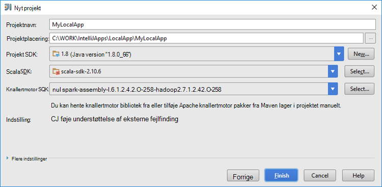

 <properties
    pageTitle="Oprette knallertmotor Scala programmer med HDInsight værktøjer i Azure-værktøjskassen til IntelliJ | Microsoft Azure"
    description="Lær at oprette en enkeltstående knallertmotor program tilladelse til at køre på HDInsight Spark klynger."
    services="hdinsight"
    documentationCenter=""
    authors="nitinme"
    manager="jhubbard"
    editor="cgronlun"
    tags="azure-portal"/>

<tags
    ms.service="hdinsight"
    ms.workload="big-data"
    ms.tgt_pltfrm="na"
    ms.devlang="na"
    ms.topic="article"
    ms.date="09/09/2016"
    ms.author="nitinme"/>

# Bruge HDInsight værktøjer i Azure-værktøjskassen til IntelliJ til at oprette knallertmotor programmer for HDInsight knallertmotor Linux klynge

I denne artikel indeholder en trinvis vejledning i udviklingsprogrammer knallertmotor skrevet i Scala og sende det til en HDInsight Spark klynge med HDInsight værktøjer i Azure-værktøjskassen til IntelliJ.  Du kan bruge værktøjerne i et par forskellige måder:

* Til at udvikle og sende et Scala Spark program på en HDInsight Spark klynge
* Få adgang til din Azure HDInsight knallertmotor klyngeressourcer
* At udvikle og køre en Scala Spark program lokalt

Du kan også følge en video [her](https://mix.office.com/watch/1nqkqjt5xonza) for at komme i gang.

>[AZURE.IMPORTANT] Dette værktøj kan bruges til at oprette og sende programmer kun for en HDInsight Spark klynge på Linux.

##Forudsætninger

* Et Azure-abonnement. Se [få Azure gratis prøveversion](https://azure.microsoft.com/documentation/videos/get-azure-free-trial-for-testing-hadoop-in-hdinsight/).

* En Apache knallertmotor klynge på HDInsight Linux. Flere oplysninger under [oprette Apache knallertmotor klynger i Azure HDInsight](hdinsight-apache-spark-jupyter-spark-sql.md).

* Oracle Java Development kit. Du kan installere det fra [her](http://www.oracle.com/technetwork/java/javase/downloads/jdk8-downloads-2133151.html).

* IntelliJ ide. I denne artikel bruges version 15.0.1. Du kan installere det fra [her](https://www.jetbrains.com/idea/download/).

## Installere HDInsight værktøjer i Azure-værktøjskassen til IntelliJ

HDInsight værktøjer til IntelliJ er tilgængelig som en del af Azure-værktøjskassen til IntelliJ. Oplysninger om, hvordan du installerer Azure-værktøjskassen, kan du se [installere Azure-værktøjskassen til IntelliJ](../azure-toolkit-for-intellij-installation.md).

## Log på abonnementet Azure

1. Start IntelliJ IDE, og Åbn Azure Stifinder. Klik på **Værktøjet Windows** , og klik derefter på **Azure Explorer**fra menuen **Vis** i IDE.

    

2. Højreklik på noden **Azure** i **Azure Explorer**, og klik derefter på **Administrer abonnementer**.

3. Klik på **Log på** i dialogboksen **Administrer abonnementer** og angive dine Azure legitimationsoplysninger.

    

4. Når du er logget på, vises dialogboksen **Administrer abonnementer** alle Azure abonnementer der er knyttet til legitimationsoplysningerne. Klik på **Luk** i dialogboksen.

5. Fanen **Azure Explorer** Udvid **HDInsight** for at få vist HDInsight Spark klynger under dit abonnement.

    

6. Du kan yderligere udvide en klynge navn node for at få vist de ressourcer (fx lagerplads konti), der er knyttet til klyngen.

    

## Køre et knallertmotor Scala til computeren på en HDInsight Spark klynge

1. Start IntelliJ IDE og oprette et nyt projekt. Foretage følgende valg i det nye projekt i dialogboksen, og klik derefter på **Næste**.

    

    * Vælg **HDInsight**i venstre rude.
    * Vælg **knallertmotor på HDInsight (Scala)**fra den højre rude.
    * Klik på **Næste**.

2. I det næste vindue skal du give projektoplysninger.

    * Angive et projektnavn og projektets placering.
    * Kontrollér, at du angiver en Java-version, der er større end 7 til **Project SDK**.
    * Til **Scala SDK**, klik på **Opret**, klik på **Hent**og derefter vælge versionen af Scala til brug. **Sørg for, at du ikke bruger version 2.11.x**. Dette eksempel bruger version **2.10.6**.

        

    * **Knallertmotor SDK**, hente og bruge SDK fra [her](http://go.microsoft.com/fwlink/?LinkID=723585&clcid=0x409). Du kan også ignorere dette og bruge [knallertmotor Maven lager](http://mvnrepository.com/search?q=spark) i stedet, men Kontroller, at du har installeret for at udvikle programmerne knallertmotor højre maven lageret. (For eksempel, du har brug at sikre, at du har installeret, hvis du bruger knallertmotor Streaming; delen knallertmotor Streaming Også skal du kontrollere, at du bruger lager er markeret som Scala 2.10 – kan ikke bruge lageret, der er markeret som Scala 2.11.)

        

    * Klik på **Udfør**.

3. Knallertmotor project oprettes der automatisk en genstand for dig. Hvis du vil se genstand, skal du følge disse trin.

    1. Klik på **Projektstruktur**fra menuen **filer** .
    2. Klik på **elementer** for at få vist den standard genstand, der er oprettet i dialogboksen **Projektstruktur** .

        

    Du kan også oprette dine egne genstand bly at klikke på den **+** -ikonet, er fremhævet i billedet ovenfor.

4. Klik på **projekt**i dialogboksen **Projektstruktur** . Hvis **Project SDK** er indstillet til 1,8, skal du sørge for **projektniveau sprog** er indstillet til **7 - ruder, ARM, med flere produkter osv**.

    

5. Tilføje kildekode dit program.

    1. Højreklik på **src**fra vinduet **Projektstifinder**, peg på **Ny**, og klik derefter på **Scala klasse**.

        

    2. Angiv et navn til **type** Vælg **objekt**, og klik derefter på **OK**i dialogboksen **Opret ny Scala klasse** .

        

    3. Indsæt følgende kode i filen **MyClusterApp.scala** . Denne kode læser data fra den HVAC.csv (tilgængelig på alle HDInsight Spark klynger), henter de rækker, der kun har ét ciffer i kolonnen syvende i CSV og skriver output til **/HVACOut** under objektbeholderen til lagring af standard for-klyngen.

            import org.apache.spark.SparkConf
            import org.apache.spark.SparkContext

            object MyClusterApp{
              def main (arg: Array[String]): Unit = {
                val conf = new SparkConf().setAppName("MyClusterApp")
                val sc = new SparkContext(conf)

                val rdd = sc.textFile("wasbs:///HdiSamples/HdiSamples/SensorSampleData/hvac/HVAC.csv")

                //find the rows which have only one digit in the 7th column in the CSV
                val rdd1 =  rdd.filter(s => s.split(",")(6).length() == 1)

                rdd1.saveAsTextFile("wasbs:///HVACOut")
              }

            }

5. Kør programmet på en HDInsight Spark klynge.

    1. Højreklik på projektnavnet **Projektstifinder**, og vælg derefter **Sende knallertmotor program tilladelse til at HDInsight**.

        

    2. Du bliver bedt om at angive dine legitimationsoplysninger Azure-abonnement. Angiv følgende værdier i dialogboksen **Knallertmotor bidrag** .

        * Vælg den HDInsight Spark klynge, hvor du vil køre programmet for **gnister klynger (kun Linux)**.

        * Du skal enten vælge et genstand fra IntelliJ projektet, eller Vælg en fra harddisken.

        * Mod tekstfeltet **Main klassenavnet** skal du klikke på ellipsen ( ), Vælg den primære klasse i dit program kildekode, og klik derefter på **OK**.

            

        * Fordi programkode i dette eksempel ikke kræver en hvilken som helst kommandolinjeargumenter eller henviser til krukker og filer, kan du lade tekstfelterne resterende tomt.

        * Når du har indtastet alle materialer, skal i dialogboksen ligne følgende.

            

        * Klik på **Send**.

    3. Fanen **Knallertmotor bidrag** nederst i vinduet skal starte viser forløbet. Du kan også stoppe programmet ved at klikke på den røde knap i vinduet "Knallertmotor bidrag".

        

    I næste afsnit lære du at få adgang til jobbet output ved hjælp af værktøjerne HDInsight i Azure-værktøjskassen til IntelliJ.

## Adgang til og administrere HDInsight Spark klynger ved hjælp af værktøjerne HDInsight i Azure-værktøjskassen til IntelliJ

Du kan udføre forskellige handlinger ved hjælp af værktøjerne HDInsight, der er en del af Azure-værktøjskassen til IntelliJ.

### Få adgang til visningen jobbet direkte fra HDInsight-værktøjer

1. Udvid **HDInsight**fra **Azure Explorer**, udvid knallertmotor klyngenavnet, og klik derefter på **Jobs**.

2. I højre rude viser fanen **Knallertmotor Job Vis** alle de programmer, der køres på klyngen. Klik på navnet på programmet, du vil se flere oplysninger.

    

3. Felterne for **Fejlmeddelelse**, **Jobbet Output**, **Livius Job logfiler**og **Knallertmotor Driver logfiler** er udfyldt baseret på det program, du vælger.

4. Du kan også åbne **Knallertmotor oversigt over Brugergrænsefladen** og **GARN Brugergrænsefladen** (på niveauet for programmet) ved at klikke på knapperne respektive øverst på skærmen.

### Få adgang til knallertmotor historik serveren

1. Fra **Azure Explorer**, udvide **HDInsight**, skal du højreklikke på navnet på din knallertmotor klynge og derefter vælge **Åbn knallertmotor oversigt over Brugergrænsefladen**. Når du bliver bedt om det, kan du angive Administratoroplysninger for-klyngen. Hvis du har angivet disse under klargøring af klyngen.

2. I dashboardet knallertmotor historik Server, kan du søge efter programmet du bare færdig kører ved hjælp af navnet på programmet. I ovenstående kode, du angiver den programmet navn ved hjælp af `val conf = new SparkConf().setAppName("MyClusterApp")`. Det vil sige, blev kaldt knallertmotor programmet **MyClusterApp**.

### Start portalen Ambari

Udvid **HDInsight**fra **Azure Explorer**, højreklik på dit knallertmotor klyngenavn, og vælg derefter **Åbn klynge Management-portalen (Ambari)**. Når du bliver bedt om det, kan du angive Administratoroplysninger for-klyngen. Hvis du har angivet disse under klargøring af klyngen.

### Administrere Azure abonnementer

Som standard viser værktøjerne HDInsight knallertmotor klynger fra alle dine Azure abonnementer. Hvis det er nødvendigt, kan du angive de abonnementer, du vil have adgang til klyngen. Højreklik på noden **Azure** rod fra **Azure Explorer**, og klik derefter på **Administrer abonnementer**. Fjern markeringen i afkrydsningsfelterne mod det abonnement, du ikke vil få adgang til, og klik derefter på **Luk**i dialogboksen. Du kan også klikke på **Log af** Hvis du vil logge af abonnementet Azure.

## Køre en knallertmotor Scala program lokalt

Du kan bruge værktøjerne HDInsight i Azure-værktøjskassen til IntelliJ til at køre knallertmotor Scala programmer lokalt på computeren. Typisk sådanne programmer ikke har brug for adgang til klyngeressourcer som objektbeholder til lagring og kan køre og testes lokalt.

### Nødvendige program

Du kan få en undtagelse, mens du kører programmet lokale knallertmotor Scala på en Windows-computer, som beskrevet i [KNALLERTMOTOR 2356](https://issues.apache.org/jira/browse/SPARK-2356) , der opstår på grund af en manglende WinUtils.exe i Windows. Du kan løse fejlen, skal du [hente den eksekverbare fil herfra](http://public-repo-1.hortonworks.com/hdp-win-alpha/winutils.exe) til en placering som **C:\WinUtils\bin**. Derefter skal du tilføje en miljøvariablen **HADOOP_HOME** og værdien af variablen til **C\WinUtils**.

### Køre et lokalt knallertmotor Scala program  

1. Start IntelliJ IDE og oprette et nyt projekt. Foretage følgende valg i det nye projekt i dialogboksen, og klik derefter på **Næste**.

    

    * Vælg **HDInsight**i venstre rude.
    * Vælg **knallertmotor på HDInsight lokale køre stikprøve (Scala)**fra den højre rude.
    * Klik på **Næste**.

2. I det næste vindue skal du give projektoplysninger.

    * Angive et projektnavn og projektets placering.
    * Kontrollér, at du angiver en Java-version, der er større end 7 til **Project SDK**.
    * Til **Scala SDK**, klik på **Opret**, klik på **Hent**og derefter vælge versionen af Scala til brug. **Sørg for, at du ikke bruger version 2.11.x**. Dette eksempel bruger version **2.10.6**.

        

    * **Knallertmotor SDK**, hente og bruge SDK fra [her](http://go.microsoft.com/fwlink/?LinkID=723585&clcid=0x409). Du kan også ignorere dette og bruge [knallertmotor Maven lager](http://mvnrepository.com/search?q=spark) i stedet, men Kontroller, at du har installeret for at udvikle programmerne knallertmotor højre maven lageret. (For eksempel, du har brug at sikre, at du har installeret, hvis du bruger knallertmotor Streaming; delen knallertmotor Streaming Også skal du kontrollere, at du bruger lager er markeret som Scala 2.10 – kan ikke bruge lageret, der er markeret som Scala 2.11.)

        

    * Klik på **Udfør**.

3. Skabelonen tilføjer en eksempelkode (**LogQuery**) under mappen **src** , som du kan køre lokalt på din computer.

    

4.  Højreklik på programmet **LogQuery** , og klik derefter på **"Kør 'LogQuery'"**. Du får vist en output således under fanen **køre** nederst.

    

## Konvertere eksisterende IntelliJ ide programmer til at bruge værktøjerne HDInsight i Azure-værktøjskassen til IntelliJ

Du kan også konvertere dine eksisterende knallertmotor Scala programmer, der er oprettet i IntelliJ ide ikke kompatibelt med HDInsight værktøjerne i Azure-værktøjskassen til IntelliJ. Dette gør det muligt at bruge værktøjet til at sende programmerne til en HDInsight Spark klynge. Du kan gøre det ved at benytte følgende fremgangsmåde:

1. Åbn den tilknyttede .iml-fil til en eksisterende knallertmotor Scala appliction oprettet ved hjælp af IntelliJ ide.
2. På rodniveau, får du vist et **modul** element således:

        <module org.jetbrains.idea.maven.project.MavenProjectsManager.isMavenModule="true" type="JAVA_MODULE" version="4">

3. Redigere elementet til at tilføje `UniqueKey="HDInsightTool"` så elementet **modul** ligner følgende:

        <module org.jetbrains.idea.maven.project.MavenProjectsManager.isMavenModule="true" type="JAVA_MODULE" version="4" UniqueKey="HDInsightTool">

4. Gemme ændringerne. Dit program skulle nu være kompatible med værktøjerne HDInsight i Azure-værktøjskassen til IntelliJ. Du kan teste dette ved at højreklikke på projektnavnet i Projektstifinder. Pop op-menuen skal nu har mulighed for at **Sende knallertmotor program tilladelse til at HDInsight**.

## Fejlfinding i forbindelse med

### "Skal du bruge en større Heapstørrelse" fejl i lokal køre

Hvis du bruger en 32-bit Java SDK under den lokale kørsel i knallertmotor 1,6, kan der ske følgende fejl:

    Exception in thread "main" java.lang.IllegalArgumentException: System memory 259522560 must be at least 4.718592E8. Please use a larger heap size.
        at org.apache.spark.memory.UnifiedMemoryManager$.getMaxMemory(UnifiedMemoryManager.scala:193)
        at org.apache.spark.memory.UnifiedMemoryManager$.apply(UnifiedMemoryManager.scala:175)
        at org.apache.spark.SparkEnv$.create(SparkEnv.scala:354)
        at org.apache.spark.SparkEnv$.createDriverEnv(SparkEnv.scala:193)
        at org.apache.spark.SparkContext.createSparkEnv(SparkContext.scala:288)
        at org.apache.spark.SparkContext.<init>(SparkContext.scala:457)
        at LogQuery$.main(LogQuery.scala:53)
        at LogQuery.main(LogQuery.scala)
        at sun.reflect.NativeMethodAccessorImpl.invoke0(Native Method)
        at sun.reflect.NativeMethodAccessorImpl.invoke(NativeMethodAccessorImpl.java:57)
        at sun.reflect.DelegatingMethodAccessorImpl.invoke(DelegatingMethodAccessorImpl.java:43)
        at java.lang.reflect.Method.invoke(Method.java:606)
        at com.intellij.rt.execution.application.AppMain.main(AppMain.java:144)

Dette skyldes, at Heapstørrelse ikke er stort nok til knallertmotor til at køre, da knallertmotor kræver mindst 471MB (du kan få flere oplysninger fra [KNALLERTMOTOR 12081](https://issues.apache.org/jira/browse/SPARK-12081) Hvis du vil). En simpel løsning er at bruge en 64-bit Java SDK. Du kan også ændre indstillingerne for JVM i IntelliJ ved at tilføje følgende indstillinger:

    -Xms128m -Xmx512m -XX:MaxPermSize=300m -ea

## Feedback og kendte problemer

I øjeblikket får vist knallertmotor skriver direkte understøttes ikke, og vi arbejder på.

Hvis du har en hvilken som helst forslag eller feedback, eller hvis du støder på problemer, når du bruger dette værktøj, Velkommen til at slippe os en mail på hdivstool på microsoft prik com.

## Se også

* [Oversigt: Apache knallertmotor på Azure HDInsight](hdinsight-apache-spark-overview.md)

### Scenarier

* [Knallertmotor med BI: analyse af interaktive data ved hjælp af knallertmotor i HDInsight med BI-værktøjer](hdinsight-apache-spark-use-bi-tools.md)

* [Knallertmotor med Machine Learning: Brug knallertmotor i HDInsight til analyse af bygning temperaturen ved hjælp af VVS-data](hdinsight-apache-spark-ipython-notebook-machine-learning.md)

* [Knallertmotor med Machine Learning: Brug knallertmotor i HDInsight til at forudsige mad undersøgelsesresultaterne](hdinsight-apache-spark-machine-learning-mllib-ipython.md)

* [Knallertmotor Streaming: Brug knallertmotor i HDInsight til udvikling af realtid streaming programmer](hdinsight-apache-spark-eventhub-streaming.md)

* [Websted log analyse ved hjælp af knallertmotor i HDInsight](hdinsight-apache-spark-custom-library-website-log-analysis.md)

### Oprette og køre programmer

* [Oprette en enkeltstående program, ved hjælp af Scala](hdinsight-apache-spark-create-standalone-application.md)

* [Køre job fra en fjernplacering på en knallertmotor klynge, ved hjælp af Livius](hdinsight-apache-spark-livy-rest-interface.md)

### Værktøjer og filtypenavne

* [Brug HDInsight værktøjer i Azure-værktøjskassen til IntelliJ at foretage fejlfinding af sætte gang programmer fra en fjernplacering](hdinsight-apache-spark-intellij-tool-plugin-debug-jobs-remotely.md)

* [Bruge HDInsight værktøjer i Azure-værktøjskassen til Eklipse til at oprette knallertmotor programmer](hdinsight-apache-spark-eclipse-tool-plugin.md)

* [Bruge Zeppelin notesbøger med en knallertmotor klynge på HDInsight](hdinsight-apache-spark-use-zeppelin-notebook.md)

* [Kerner, der er tilgængelige for Jupyter notesbog i knallertmotor klynge i HDInsight](hdinsight-apache-spark-jupyter-notebook-kernels.md)

* [Bruge eksterne pakker med Jupyter notesbøger](hdinsight-apache-spark-jupyter-notebook-use-external-packages.md)

* [Installere Jupyter på din computer og oprette forbindelse til en HDInsight Spark klynge](hdinsight-apache-spark-jupyter-notebook-install-locally.md)

### Administrere ressourcer

* [Administrere ressourcer for Apache knallertmotor klynge i Azure HDInsight](hdinsight-apache-spark-resource-manager.md)

* [Holde styr på og fejlfinding job, der kører på en Apache knallertmotor klynge i HDInsight](hdinsight-apache-spark-job-debugging.md)
