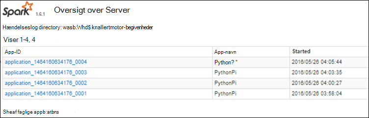

<properties 
    pageTitle="Holde styr på og fejlfinding job, der kører på Apache knallertmotor klynge i HDInsight | Microsoft Azure" 
    description="Brug GARN brugergrænseflade, gnister Brugergrænsefladen og knallertmotor historik server til at registrere og foretage fejlfinding af sager, der kører på en knallertmotor klynge i Azure HDInsight" 
    services="hdinsight" 
    documentationCenter="" 
    authors="nitinme" 
    manager="jhubbard" 
    editor="cgronlun"
    tags="azure-portal"/>

<tags 
    ms.service="hdinsight" 
    ms.workload="big-data" 
    ms.tgt_pltfrm="na" 
    ms.devlang="na" 
    ms.topic="article" 
    ms.date="08/25/2016" 
    ms.author="nitinme"/>

# Holde styr på og fejlfinding job, der kører på Apache knallertmotor klynge i HDInsight Linux

I denne artikel lærer du, hvordan du kan registrere og foretage fejlfinding af knallertmotor job ved hjælp af GARN Brugergrænsefladen, gnister Brugergrænsefladen og knallertmotor historik Server. I denne artikel er vi starter et knallertmotor job fra en notesbog, der er tilgængelige med klynge knallertmotor **Machine learning: skønnet analyse mad inspektion data ved hjælp af MLLib**. Du kan bruge nedenstående trin for at registrere et program, du har sendt ved hjælp af en hvilken som helst anden fremgangsmåde samt, for eksempel **knallertmotor sende**.

##Forudsætninger

Du skal have følgende:

- Et Azure-abonnement. Se [få Azure gratis prøveversion](https://azure.microsoft.com/documentation/videos/get-azure-free-trial-for-testing-hadoop-in-hdinsight/).
- En Apache knallertmotor klynge på HDInsight Linux. Flere oplysninger under [oprette Apache knallertmotor klynger i Azure HDInsight](hdinsight-apache-spark-jupyter-spark-sql.md).
- Du bør har startet kører notesbogen, **[Machine learning: skønnet analyse mad inspektion data ved hjælp af MLLib](hdinsight-apache-spark-machine-learning-mllib-ipython.md)**. Vejledning i at køre denne notesbog, du ved at følge linket.  

## Registrere et program i brugergrænsefladen i GARN.

1. Start GARN Brugergrænsefladen. Klik på **Klynge Dashboard**bladet klynge, og klik derefter på **GARN**.

    

    >[AZURE.TIP] Alternativt kan du også starte GARN Brugergrænsefladen fra Ambari UI. Klik på **Klynge Dashboard**for at starte Ambari UI, fra bladet klynge, og klik derefter på **HDInsight klynge Dashboard**. Klik på **GARN**UI Ambari, skal du klikke på **Hurtige Links**, skal du klikke på den aktive Ressourcestyring, og klik derefter på **Ressourcestyring brugergrænseflade**.  

3. Da du har startet knallertmotor jobbet ved hjælp af Jupyter notesbøger, har programmet navnet **remotesparkmagics** (dette er navnet på alle programmer, der er startet fra notesbøgerne). Klik på program-ID'ET mod navnet på programmet til at få flere oplysninger om jobbet. Dette åbner visningen programmet på computeren.

    

    For disse programmer, der er sendt fra Jupyter notesbøger, er status altid **kører** , indtil du afslutter notesbogen.

4. Fra visningen programmet på computeren, kan du fokusere på kortet yderligere, find ud af objektbeholdere er knyttet til programmet og loggene (stdout/stderr). Du kan også starte knallertmotor Brugergrænsefladen ved at klikke på sammenkædning svarer til **Sporing af URL-adresse**, som vist nedenfor. 

    

## Registrere et program i brugergrænsefladen i gnister.

I Brugergrænsefladen gnister, kan du analysere ned i de knallertmotor job, der er lagt af det program, du har startet på tidligere.

1. Klik på linket mod **Sporing af URL-adresse**for at starte knallertmotor Brugergrænsefladen, fra visningen programmet, som vist i skærmbilledet ovenfor. Du kan se alle de knallertmotor-job, der er startet af det program, der kører i Jupyter notesbog.

    

2. Klik på fanen **bobestyreren** for at se oplysninger om behandling og opbevaring for hver executor. Du kan også hente kaldestak ved at klikke på linket **Tråd lagring** .

    
 
3. Klik på fanen **faser** for at få vist de faser, der er knyttet til programmet.

    

    Hvert trin kan have flere opgaver, du kan få vist udførelse af statistik, ønsker vist nedenfor.

     

4. Fra siden fase, kan du starte DAG visualisering. Udvide link til **DAG visualisering** øverst på siden, som vist nedenfor.

    

    DAG eller direkte Aclyic Graph repræsenterer de forskellige faser i programmet på computeren. Hver blå boks i graph repræsenterer en knallertmotor handling, der er aktiveret fra programmet.

5. Fra siden fase, kan du også starte tidslinjevisning programmet på computeren. Udvide link til **Begivenhedstidslinje** øverst på siden, som vist nedenfor.

    

    Dette viser knallertmotor hændelserne i form af en tidslinje. Tidslinjevisningen er tilgængelig på tre niveauer på tværs af sager, inden for et job og inden for en fase. Billedet ovenfor registrerer tidslinjevisningen til en bestemt fase.

    >[AZURE.TIP] Hvis du markerer afkrydsningsfeltet **Aktiver Zoom** , kan du rulle venstre og højre på tværs af tidslinjevisningen.

6. Andre faner i Brugergrænsefladen knallertmotor indeholder nyttige oplysninger om forekomsten gnister.

    * Lagerplads fanen – Hvis dit program opretter en RDDs, kan du finde oplysninger om dem i fanen Storage.
    * Miljø fanen – denne fane indeholder en masse nyttige oplysninger om din knallertmotor forekomst såsom den 
        * Scala version
        * Hændelseslog directory, der er knyttet til klyngen
        * Antallet af executor borekerner til programmet
        * Osv.

## Du kan finde oplysninger om fuldførte job ved hjælp af knallertmotor historik Server

Når en sag er afsluttet, bevares oplysningerne om jobbet i knallertmotor historik Server.

1. Klik på **Klynge Dashboard**for at starte knallertmotor historik Server fra bladet klynge, og klik derefter på **Knallertmotor historik Server**.

    

    >[AZURE.TIP] Alternativt kan du også starte knallertmotor historik Server Brugergrænsefladen fra Ambari UI. Klik på **Klynge Dashboard**for at starte Ambari UI, fra bladet klynge, og klik derefter på **HDInsight klynge Dashboard**. Klik på **knallertmotor**UI Ambari, skal du klikke på **Hurtige Links**, og klik derefter på **Knallertmotor historik Server brugergrænseflade**.

2. Du får vist alle de færdige programmer, der er angivet. Klik på et program-ID til at analysere ned i et program for at få flere oplysninger.

    
    

## Se også

* [Oversigt: Apache knallertmotor på Azure HDInsight](hdinsight-apache-spark-overview.md)

### Scenarier

* [Knallertmotor med BI: analyse af interaktive data ved hjælp af knallertmotor i HDInsight med BI-værktøjer](hdinsight-apache-spark-use-bi-tools.md)

* [Knallertmotor med Machine Learning: Brug knallertmotor i HDInsight til analyse af bygning temperaturen ved hjælp af VVS-data](hdinsight-apache-spark-ipython-notebook-machine-learning.md)

* [Knallertmotor med Machine Learning: Brug knallertmotor i HDInsight til at forudsige mad undersøgelsesresultaterne](hdinsight-apache-spark-machine-learning-mllib-ipython.md)

* [Knallertmotor Streaming: Brug knallertmotor i HDInsight til udvikling af realtid streaming programmer](hdinsight-apache-spark-eventhub-streaming.md)

* [Websted log analyse ved hjælp af knallertmotor i HDInsight](hdinsight-apache-spark-custom-library-website-log-analysis.md)

### Oprette og køre programmer

* [Oprette en enkeltstående program, ved hjælp af Scala](hdinsight-apache-spark-create-standalone-application.md)

* [Køre job fra en fjernplacering på en knallertmotor klynge, ved hjælp af Livius](hdinsight-apache-spark-livy-rest-interface.md)

### Værktøjer og filtypenavne

* [Brug HDInsight værktøjer plug-in til IntelliJ ide at oprette og sende knallertmotor Scala programmer](hdinsight-apache-spark-intellij-tool-plugin.md)

* [Brug HDInsight værktøjer plug-in til IntelliJ ide for at fejlfinde knallertmotor programmer fra en fjernplacering](hdinsight-apache-spark-intellij-tool-plugin-debug-jobs-remotely.md)

* [Bruge Zeppelin notesbøger med en knallertmotor klynge på HDInsight](hdinsight-apache-spark-use-zeppelin-notebook.md)

* [Kerner, der er tilgængelige for Jupyter notesbog i knallertmotor klynge i HDInsight](hdinsight-apache-spark-jupyter-notebook-kernels.md)

* [Bruge eksterne pakker med Jupyter notesbøger](hdinsight-apache-spark-jupyter-notebook-use-external-packages.md)

* [Installere Jupyter på din computer og oprette forbindelse til en HDInsight Spark klynge](hdinsight-apache-spark-jupyter-notebook-install-locally.md)

### Administrere ressourcer

* [Administrere ressourcer for Apache knallertmotor klynge i Azure HDInsight](hdinsight-apache-spark-resource-manager.md)
