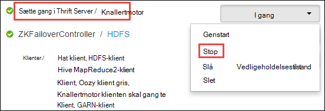

<properties 
    pageTitle="Brug ressource Manager til at tildele ressourcer til Apache knallertmotor klynge i HDInsight | Microsoft Azure" 
    description="Lær at bruge ressourcestyring til knallertmotor klynger på HDInsight for at forbedre ydeevnen." 
    services="hdinsight" 
    documentationCenter="" 
    authors="nitinme" 
    manager="jhubbard" 
    editor="cgronlun"
    tags="azure-portal"/>

<tags 
    ms.service="hdinsight" 
    ms.workload="big-data" 
    ms.tgt_pltfrm="na" 
    ms.devlang="na" 
    ms.topic="article" 
    ms.date="08/25/2016" 
    ms.author="nitinme"/>

# Administrere ressourcer for Apache knallertmotor klynge på HDInsight Linux

I denne artikel lærer du at få adgang til grænsefladerne som Ambari UI, GARN Brugergrænsefladen og knallertmotor historik Server, der er knyttet til din knallertmotor klynge. Du kan også få at vide om, hvordan du finjustere den klynge konfiguration for optimal ydeevne.

**Forudsætninger for:**

Du skal have følgende:

- Et Azure-abonnement. Se [få Azure gratis prøveversion](https://azure.microsoft.com/documentation/videos/get-azure-free-trial-for-testing-hadoop-in-hdinsight/).
- En Apache knallertmotor klynge på HDInsight Linux. Flere oplysninger under [oprette Apache knallertmotor klynger i Azure HDInsight](hdinsight-apache-spark-jupyter-spark-sql.md).

## Hvordan jeg starte Ambari Webbrugergrænsefladen?

1. Klik på feltet for din knallertmotor klynge fra [Azure-portalen](https://portal.azure.com/), fra startboard (hvis det fastgjort til startboard). Du kan også gå til din klynge under **Gennemse alle** > **HDInsight klynger**. 
 
2. Klik på **Dashboard**fra bladet knallertmotor klynge. Når du bliver bedt om det, kan du angive Administratoroplysninger for gnister klynge.

    ![Start Ambari] (./media/hdinsight-apache-spark-resource-manager/hdispark.cluster.launch.dashboard.png "Starte ressourcestyring")

3. Dette skal starte Ambari Webbrugergrænsefladen, som vist nedenfor.

    ![Ambari Web brugergrænseflade] (./media/hdinsight-apache-spark-resource-manager/ambari-web-ui.png "Ambari Web brugergrænseflade")   

## Hvordan jeg Start knallertmotor historik Server?

1. Klik på feltet for din knallertmotor klynge fra [Azure-portalen](https://portal.azure.com/), fra startboard (hvis det fastgjort til startboard).

2. Klik på **Klynge Dashboard**fra bladet klynge under **Hurtige Links**. Klik på **Knallertmotor historik Server**i bladet **Klynge Dashboard** .

    ![Knallertmotor historik Server] (./media/hdinsight-apache-spark-resource-manager/launch-history-server.png "Knallertmotor historik Server")

    Når du bliver bedt om det, kan du angive Administratoroplysninger for gnister klynge.

## Hvordan jeg starte garn Brugergrænsefladen?

Du kan bruge GARN Brugergrænsefladen til at overvåge programmer, der kører på knallertmotor klynge. 

1. Klik på **Klynge Dashboard**bladet klynge, og klik derefter på **GARN**.

    

    >[AZURE.TIP] Alternativt kan du også starte GARN Brugergrænsefladen fra Ambari UI. Klik på **Klynge Dashboard**for at starte Ambari UI, fra bladet klynge, og klik derefter på **HDInsight klynge Dashboard**. Klik på **GARN**UI Ambari, skal du klikke på **Hurtige Links**, skal du klikke på den aktive Ressourcestyring, og klik derefter på **Ressourcestyring brugergrænseflade**.

## Hvad er den optimale klynge konfiguration til at køre knallertmotor programmer?

De tre vigtigste parametre, der kan bruges til knallertmotor konfiguration afhængigt af programmet krav er `spark.executor.instances`, `spark.executor.cores`, og `spark.executor.memory`. En Executor er en proces, der er startet til et styret program. Den kører på noden arbejder og er ansvarlig for at udføre opgaverne for programmet. Standardantallet af bobestyreren og executor størrelsen for hver klynge beregnes på basis af antallet arbejder noder og arbejder node størrelse. Disse er gemt i `spark-defaults.conf` på klyngenoderne hoved. 

De tre konfiguration af parametre kan konfigureres på niveauet klynge (for alle programmer, der kører på klyngen) eller kan angives for hvert enkelt program.

### Ændre parametrene ved hjælp af Ambari UI

1. Klik **knallertmotor**fra Ambari UI på **konfigurationer**, og udvid derefter **brugerdefineret knallertmotor-standarder**.

    

2. Standardværdierne er godt at have 4 knallertmotor programmer køre samtidigt på klyngen. Du kan ændringer disse værdier fra brugergrænsefladen, som vist nedenfor.

    

3. Klik på **Gem** for at gemme ændringerne i konfigurationen. Øverst på siden, bliver du bedt om at genstarte alle de pågældende tjenester. Klik på **Genstart**.

    

### Ændre parametrene for et program, der kører i Jupyter notesbog

For programmer, der kører i Jupyter notesbog, du kan bruge den `%%configure` magisk til at foretage ændringer i konfigurationen. Ideelt set skal du foretage disse ændringer i starten af programmet, før du kører din første kode celle. Dette sikrer, at konfigurationen er anvendt på Livius sessionen, når det bliver oprettet. Hvis du vil ændre konfigurationen på et senere tidspunkt i programmet på computeren, skal du bruge den `-f` parameter. Men ved at gøre så alle opgavefremdrift i programmet går tabt.

Den kodestykke nedenfor viser, hvordan du ændre konfigurationen for et program, der kører i Jupyter.

    %%configure 
    {"executorMemory": "3072M", "executorCores": 4, “numExecutors”:10}

Konfiguration af parametre skal være bestået som en JSON-streng og skal være på den næste linje efter Magien, som vist i kolonnen eksempel. 

### Ændre knallertmotor sende af parametre for et program, der er sendt ved hjælp af

Følge kommandoen er et eksempel på, hvordan du kan ændre konfiguration af parametrene for en batch-program, der er sendt ved hjælp af `spark-submit`.

    spark-submit --class <the application class to execute> --executor-memory 3072M --executor-cores 4 –-num-executors 10 <location of application jar file> <application parameters>

### Ændre parametrene for et program, der er sendt ved hjælp af krøllet

Følge kommandoen er et eksempel på, hvordan du kan ændre konfiguration af parametrene for en batch-program, der er sendt ved hjælp af ved hjælp af krøllet.

    curl -k -v -H 'Content-Type: application/json' -X POST -d '{"file":"<location of application jar file>", "className":"<the application class to execute>", "args":[<application parameters>], "numExecutors":10, "executorMemory":"2G", "executorCores":5' localhost:8998/batches

### Hvordan kan jeg ændre disse parametre på en knallertmotor Thrift Server?

Knallertmotor Thrift Server giver JDBC/ODBC-adgang til en knallertmotor klynge og bruges til at tjenesten knallertmotor SQL-forespørgsler. Funktioner som Power BI, Tableau osv. bruge ODBC-protokollen til at kommunikere med knallertmotor Thrift Server for at udføre knallertmotor SQL-forespørgsler som et styret program. Når der oprettes en knallertmotor klynge, startes to forekomster af knallertmotor Thrift serveren, ét på hver hoved node. Hver knallertmotor Thrift Server vises som et styret program GARN brugergrænsefladen. 

Knallertmotor Thrift Server bruger knallertmotor dynamisk executor allokering og dermed den `spark.executor.instances` bruges ikke. I stedet knallertmotor Thrift Server bruger `spark.dynamicAllocation.minExecutors` og `spark.dynamicAllocation.maxExecutors` at angive executor antal. Af konfigurationsparametre `spark.executor.cores` og `spark.executor.memory` bruges til at ændre listens executor størrelse. Du kan ændre disse parametre, som vist nedenfor.

* Udvid kategorien **Avanceret knallertmotor-thrift-sparkconf** for at opdatere parametrene `spark.dynamicAllocation.minExecutors`, `spark.dynamicAllocation.maxExecutors`, og `spark.executor.memory`.

     

* Udvid kategorien **brugerdefineret knallertmotor-thrift-sparkconf** for at opdatere parameteren `spark.executor.cores`.

    

### Hvordan kan jeg ændre driverhukommelse på den Server, gnister Thrift?

Knallertmotor Thrift Server-driverhukommelse er konfigureret til 25% af hoved node RAM størrelse, forudsat den samlede RAM størrelse af noden hoved er større end 14GB. Du kan bruge Ambari UI til at ændre driver hukommelseskonfiguration, som vist nedenfor.

* Klik **knallertmotor**fra Ambari UI på **konfigurationer**, udvide **Avanceret knallertmotor env**, og derefter angive værdien for **spark_thrift_cmd_opts**.

    

## Jeg ikke bruge BI med knallertmotor klynge. Hvordan jeg tilbagekalde ressourcerne, der?

Da vi bruge knallertmotor dynamisk fordeling, er de kun ressourcer, der bruges af thrift server ressourcer for to program masterne. Hvis du vil frigøre disse ressourcer skal du stoppe de Thrift Server-tjenester, der kører på klyngen.

1. Klik på **knallertmotor**Ambari UI, i venstre rude.

2. Klik på **Knallertmotor Thrift servere**i den næste side.

    

3. Du bør se på to headnodes som knallertmotor Thrift serveren kører. Klik på en af headnodes.

    

4. Den næste side viser alle de tjenester, der kører på den pågældende headnode. Klik på knappen rullelisten ud for gnister Thrift Server på listen, og klik derefter på **Stop**.

    

5. Gentag disse trin på de andre headnode.

## Mine Jupyter notesbøger kører ikke som forventet. Hvordan kan jeg genstarte tjenesten?

1. Start Ambari Webbrugergrænsefladen, som vist ovenfor. Klik på **Jupyter**i venstre navigationsrude, skal du klikke på **Tjeneste handlinger**, og klik derefter på **Genstart alle**. Dette starter tjenesten Jupyter på alle headnodes.

    ![Genstart Jupyter] (./media/hdinsight-apache-spark-resource-manager/restart-jupyter.png "Genstart Jupyter")

    

## Se også

* [Oversigt: Apache knallertmotor på Azure HDInsight](hdinsight-apache-spark-overview.md)

### Scenarier

* [Knallertmotor med BI: analyse af interaktive data ved hjælp af knallertmotor i HDInsight med BI-værktøjer](hdinsight-apache-spark-use-bi-tools.md)

* [Knallertmotor med Machine Learning: Brug knallertmotor i HDInsight til analyse af bygning temperaturen ved hjælp af VVS-data](hdinsight-apache-spark-ipython-notebook-machine-learning.md)

* [Knallertmotor med Machine Learning: Brug knallertmotor i HDInsight til at forudsige mad undersøgelsesresultaterne](hdinsight-apache-spark-machine-learning-mllib-ipython.md)

* [Knallertmotor Streaming: Brug knallertmotor i HDInsight til udvikling af realtid streaming programmer](hdinsight-apache-spark-eventhub-streaming.md)

* [Websted log analyse ved hjælp af knallertmotor i HDInsight](hdinsight-apache-spark-custom-library-website-log-analysis.md)

### Oprette og køre programmer

* [Oprette en enkeltstående program, ved hjælp af Scala](hdinsight-apache-spark-create-standalone-application.md)

* [Køre job fra en fjernplacering på en knallertmotor klynge, ved hjælp af Livius](hdinsight-apache-spark-livy-rest-interface.md)

### Værktøjer og filtypenavne

* [Brug HDInsight værktøjer plug-in til IntelliJ ide at oprette og sende knallertmotor Scala programmer](hdinsight-apache-spark-intellij-tool-plugin.md)

* [Brug HDInsight værktøjer plug-in til IntelliJ ide for at fejlfinde knallertmotor programmer fra en fjernplacering](hdinsight-apache-spark-intellij-tool-plugin-debug-jobs-remotely.md)

* [Bruge Zeppelin notesbøger med en knallertmotor klynge på HDInsight](hdinsight-apache-spark-use-zeppelin-notebook.md)

* [Kerner, der er tilgængelige for Jupyter notesbog i knallertmotor klynge i HDInsight](hdinsight-apache-spark-jupyter-notebook-kernels.md)

* [Bruge eksterne pakker med Jupyter notesbøger](hdinsight-apache-spark-jupyter-notebook-use-external-packages.md)

* [Installere Jupyter på din computer og oprette forbindelse til en HDInsight Spark klynge](hdinsight-apache-spark-jupyter-notebook-install-locally.md)

### Administrere ressourcer

* [Holde styr på og fejlfinding job, der kører på en Apache knallertmotor klynge i HDInsight](hdinsight-apache-spark-job-debugging.md)

[hdinsight-versions]: hdinsight-component-versioning.md
[hdinsight-upload-data]: hdinsight-upload-data.md
[hdinsight-storage]: hdinsight-hadoop-use-blob-storage.md

[azure-purchase-options]: http://azure.microsoft.com/pricing/purchase-options/
[azure-member-offers]: http://azure.microsoft.com/pricing/member-offers/
[azure-free-trial]: http://azure.microsoft.com/pricing/free-trial/
[azure-management-portal]: https://manage.windowsazure.com/
[azure-create-storageaccount]: storage-create-storage-account.md 
