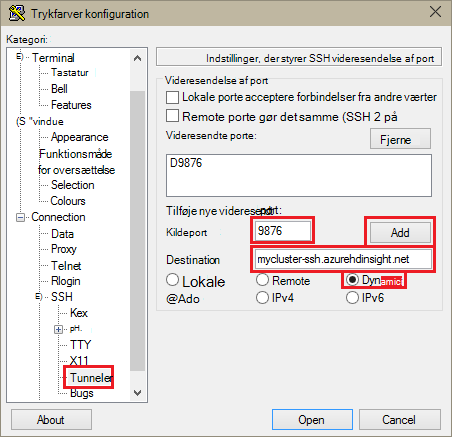
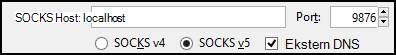
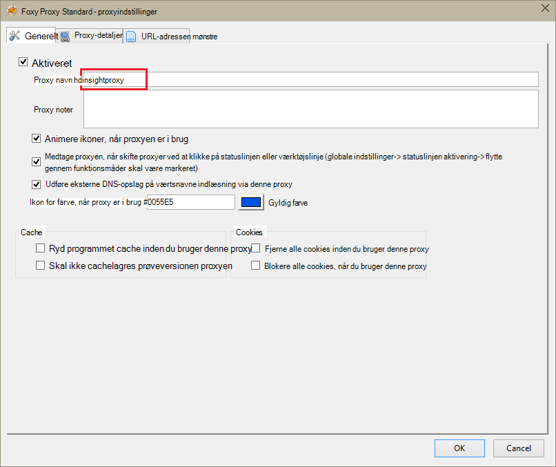
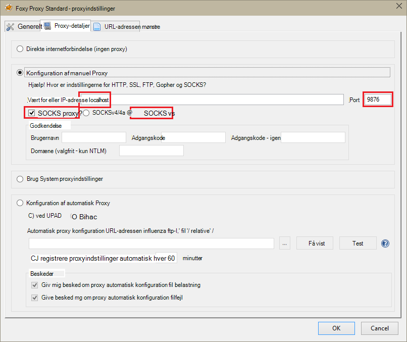
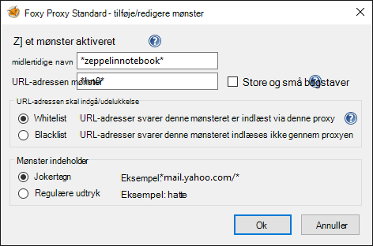
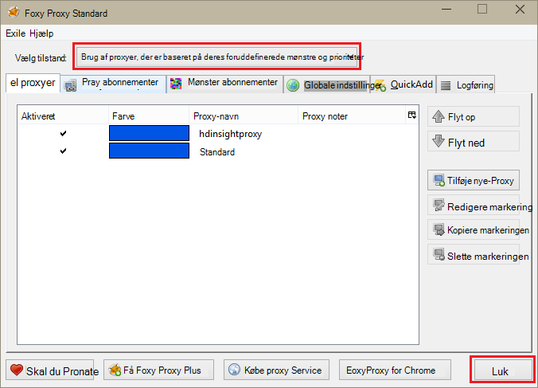

<properties 
    pageTitle="Installere Zeppelin notesbøger for Apache knallertmotor klynge på HDInsight Linux | Microsoft Azure" 
    description="Trinvis vejledning til, hvordan du installerer og bruger Zeppelin notesbøger med knallertmotor klynger på HDInsight Linux." 
    services="hdinsight" 
    documentationCenter="" 
    authors="nitinme" 
    manager="jhubbard" 
    editor="cgronlun"/>

<tags 
    ms.service="hdinsight" 
    ms.workload="big-data" 
    ms.tgt_pltfrm="na" 
    ms.devlang="na" 
    ms.topic="article" 
    ms.date="10/28/2016" 
    ms.author="nitinme"/>

# Installere Zeppelin notesbøger for Apache knallertmotor klynge på HDInsight Linux

Lær, hvordan du installerer Zeppelin notesbøger på Apache knallertmotor klynger og hvordan du bruger Zeppelin notesbøger til at køre knallertmotor job.

> [AZURE.IMPORTANT] Zeppelin notesbøger er nu tilgængelig som standard med knallertmotor klynger. Du behøver ikke at eksplicit installere dem på en knallertmotor klynge længere. Flere oplysninger under [Brug Zeppelin notesbøger med Apache knallertmotor klynge på HDInsight Linux](hdinsight-apache-spark-zeppelin-notebook.md). 

**Forudsætninger for:**

* Inden du starter selvstudiet, skal du have en Azure abonnement. Se [få Azure gratis prøveversion](https://azure.microsoft.com/documentation/videos/get-azure-free-trial-for-testing-hadoop-in-hdinsight/).
* En Apache knallertmotor klynge. Flere oplysninger under [oprette Apache knallertmotor klynger i Azure HDInsight](hdinsight-apache-spark-jupyter-spark-sql.md).
* En SSH-klient. For Linux og Unix eller Macintosh OS X på `ssh` kommandoen leveres med operativsystemet. Til Windows anbefaler vi [trykfarver](http://www.chiark.greenend.org.uk/~sgtatham/putty/download.html)

    > [AZURE.NOTE] Hvis du vil bruge en SSH klient andet end `ssh` eller trykfarver, skal du se i dokumentationen til din kunde om, hvordan du opretter en SSH tunnel.

* En webbrowser, der kan være konfigureret til at bruge en SOCKS-proxy

* __(valgfrit)__: en plug-in som [FoxyProxy](http://getfoxyproxy.org/,) , som kan anvende regler, der kun omdirigere specifikke anmodninger gennem tunnelen.

    > [AZURE.WARNING] Uden et plug-in som FoxyProxy, kan alle anmodninger via webbrowseren sendes gennem tunnelen. Dette kan medføre langsommere indlæsning af websider i din browser.

## Installere Zeppelin på en knallertmotor klynge

Du kan installere Zeppelin på en knallertmotor klynge, ved hjælp af scripthandling. Scripthandling bruger brugerdefinerede scripts til at installere komponenter på den klynge, der ikke er tilgængelige som standard. Du kan bruge brugerdefineret script til at installere Zeppelin fra portalen Azure, ved hjælp af HDInsight .NET SDK eller ved hjælp af Azure PowerShell. Du kan bruge scriptet til at installere Zeppelin enten som en del af oprettelse af klynge, eller når klyngen er oppe at køre. Links i afsnittene herunder giver instruktionerne om hvordan du gør dette. 

### Ved hjælp af portalen Azure

Du kan finde vejledning i at bruge portalen Azure til at køre scripthandling til at installere Zeppelin, [tilpasse HDInsight klynger ved hjælp af Script handlingen](hdinsight-hadoop-customize-cluster-linux.md#use-a-script-action-from-the-azure-portal). Du skal foretage nogle ændringer at følge vejledningen i denne artikel.

* Du skal bruge scriptet til at installere Zeppelin. Brugerdefineret script til at installere Zeppelin på en knallertmotor klynge på HDInsight er tilgængelig fra følgende links:
    * Til knallertmotor 1.6.0 klynger-`https://hdiconfigactions.blob.core.windows.net/linuxincubatorzeppelinv01/install-zeppelin-spark160-v01.sh`
    * Til knallertmotor 1.5.2 klynger-`https://hdiconfigactions.blob.core.windows.net/linuxincubatorzeppelinv01/install-zeppelin-spark151-v01.sh`

* Du skal køre handlingen script kun på headnode.

* Scriptet behøver ikke alle parametre. 

### Brug af HDInsight .NET SDK

Du kan finde oplysninger om, hvordan du bruger HDInsight .NET SDK til at køre scripthandling at installere Zeppelin, [tilpasse HDInsight klynger ved hjælp af Script handlingen](hdinsight-hadoop-customize-cluster-linux.md#use-a-script-action-from-the-hdinsight-net-sdk). Du skal foretage nogle ændringer at følge vejledningen i denne artikel.

* Du skal bruge scriptet til at installere Zeppelin. Brugerdefineret script til at installere Zeppelin på en knallertmotor klynge på HDInsight er tilgængelig fra følgende links:
    * Til knallertmotor 1.6.0 klynger-`https://hdiconfigactions.blob.core.windows.net/linuxincubatorzeppelinv01/install-zeppelin-spark160-v01.sh`
    * Til knallertmotor 1.5.2 klynger-`https://hdiconfigactions.blob.core.windows.net/linuxincubatorzeppelinv01/install-zeppelin-spark151-v01.sh`

* Scriptet behøver ikke alle parametre. 

* Angiv den klynge type, du opretter til gnister.

### Brug af Azure PowerShell

Brug følgende PowerShell-kodestykke til at oprette en knallertmotor klynge på HDInsight Linux med Zeppelin, der er installeret. Afhængigt af hvilken version af knallertmotor klynge, du har, skal du opdatere den PowerShell kodestykke nedenfor for at medtage link til den tilsvarende brugerdefineret script. 

* Til knallertmotor 1.6.0 klynger-`https://hdiconfigactions.blob.core.windows.net/linuxincubatorzeppelinv01/install-zeppelin-spark160-v01.sh`
* Til knallertmotor 1.5.2 klynger-`https://hdiconfigactions.blob.core.windows.net/linuxincubatorzeppelinv01/install-zeppelin-spark151-v01.sh`

[AZURE.INCLUDE [upgrade-powershell](../../includes/hdinsight-use-latest-powershell.md)]

    Login-AzureRMAccount
    
    # PROVIDE VALUES FOR THE VARIABLES
    $clusterAdminUsername="admin"
    $clusterAdminPassword="<<password>>"
    $clusterSshUsername="adminssh"
    $clusterSshPassword="<<password>>"
    $clusterName="<<clustername>>"
    $clusterContainerName=$clusterName
    $resourceGroupName="<<resourceGroupName>>"
    $location="<<region>>"
    $storage1Name="<<storagename>>"
    $storage1Key="<<storagekey>>"
    $subscriptionId="<<subscriptionId>>"
    
    Select-AzureRmSubscription -SubscriptionId $subscriptionId
    
    $passwordAsSecureString=ConvertTo-SecureString $clusterAdminPassword -AsPlainText -Force
    $clusterCredential=New-Object System.Management.Automation.PSCredential ($clusterAdminUsername, $passwordAsSecureString)
    $passwordAsSecureString=ConvertTo-SecureString $clusterSshPassword -AsPlainText -Force
    $clusterSshCredential=New-Object System.Management.Automation.PSCredential ($clusterSshUsername, $passwordAsSecureString)
    
    $azureHDInsightConfigs= New-AzureRmHDInsightClusterConfig -ClusterType Spark
    $azureHDInsightConfigs.DefaultStorageAccountKey = $storage1Key
    $azureHDInsightConfigs.DefaultStorageAccountName = "$storage1Name.blob.core.windows.net"
    
    Add-AzureRMHDInsightScriptAction -Config $azureHDInsightConfigs -Name "Install Zeppelin" -NodeType HeadNode -Parameters "void" -Uri "https://hdiconfigactions.blob.core.windows.net/linuxincubatorzeppelinv01/install-zeppelin-spark151-v01.sh"
    
    New-AzureRMHDInsightCluster -Config $azureHDInsightConfigs -OSType Linux -HeadNodeSize "Standard_D12" -WorkerNodeSize "Standard_D12" -ClusterSizeInNodes 2 -Location $location -ResourceGroupName $resourceGroupName -ClusterName $clusterName -HttpCredential $clusterCredential -DefaultStorageContainer $clusterContainerName -SshCredential $clusterSshCredential -Version "3.3"
 
## Konfigurere SSH tunnelføring for at få adgang til en Zeppelin notesbog

Du skal bruge SSH tunneler adgang til de Zeppelin notesbøger, der kører på knallertmotor klynge på HDInsight Linux. Nedenstående trin viser, hvordan du opretter en SSH tunnel ved hjælp af ssh kommandolinjen (Linux) og trykfarver (Windows).

### Oprette en tunnel med kommandoen SSH (Linux)

Brug følgende kommando for at oprette en SSH tunnel ved hjælp af den `ssh` kommandoen. Erstatte __brugernavn__ med en SSH bruger for din HDInsight klynge, og Erstat __CLUSTERNAME__ med navnet på din HDInsight klynge

    ssh -C2qTnNf -D 9876 USERNAME@CLUSTERNAME-ssh.azurehdinsight.net

Dette opretter en forbindelse, som dirigerer trafik til lokale port 9876 til klyngen over SSH. Indstillingerne er:

* **D 9876** - den lokale port, der bruges til at distribuere trafik via tunnelen.

* **C** - komprimere alle data, da webtrafik er primært består af tekst.

* **2** - kraft SSH til at prøve protocol version 2 kun.

* **spørgsmål** - brugerinput.

* **T** - Deaktiver pseudo tty allokering, da vi videresender bare en port.

* **n** - forhindre læsning af STDIN, da vi videresender bare en port.

* **N** - ikke udføre en remote kommandoen, da vi videresender bare en port.

* **f** - køre i baggrunden.

Hvis du har konfigureret klyngen med en SSH nøgle, skal du muligvis bruge den `-i` parameter og angive stien til den private SSH nøgle.

Når kommandoen er afsluttet, trafik, der sendes til port 9876 på den lokale computer sendes hoved node Secure Sockets Layer (SSL) til klyngen, så vises der stammer fra.

### Oprette en tunnel med trykfarver (Windows)

Brug følgende trin til at oprette en SSH tunnel med trykfarver.

1. Åbn trykfarver, og Angiv dine forbindelsesoplysninger. Hvis du ikke kender med trykfarver, se [Bruge SSH med Linux-baserede Hadoop på HDInsight fra Windows](hdinsight-hadoop-linux-use-ssh-windows.md) for oplysninger om hvordan du kan bruge det sammen med HDInsight.

2. Udvid **forbindelse**i sektionen **kategori** til venstre i dialogboksen, udvide **SSH**, og vælg derefter **tunneler**.

3. Angiv følgende oplysninger i formularen **Indstillinger, der styrer SSH port videresendelse** :

    * **Kildeport** - port på den klient, som du vil videresende. For eksempel **9876**.

    * **Destination** - feltet SSH adresse for Linux-baserede HDInsight klynge. For eksempel, **mycluster ssh.azurehdinsight.net**.

    * **Dynamisk** – aktiverer dynamisk SOCKS-proxy routing.

    

4. Klik på **Tilføj** for at tilføje indstillingerne, og klik derefter på **Åbn** for at åbne en SSH forbindelse.

5. Når du bliver bedt om det, log på serveren. Dette vil oprette en SSH session og Aktivér tunnelen.

### Brug tunnel fra din browser

> [AZURE.NOTE] Trinnene i dette afsnit bruge FireFox-browseren, som det er frit tilgængelige for Linux, Unix, Macintosh OS X- og Windows-systemer. Andre moderne browsere som Google Chrome, Microsoft Edge eller Apple Safari skal arbejde samt; dog kan FoxyProxy plug-in'et bruges i nogle trin ikke være tilgængelige for alle browsere.

1. Konfigurere browseren for at bruge **localhost:9876** som en **SOCKS v5** proxy. Her er, hvordan indstillingerne for Firefox ud. Hvis du har brugt en anden port end 9876, kan du ændre porten til den, du brugte:

    

    > [AZURE.NOTE] Valg af **Ekstern DNS** vil løse Domain Name System (DNS) anmodninger ved hjælp af HDInsight klynge. Hvis det er ikke er valgt, skal oversættes DNS lokalt.

2. Kontrollér, at trafik dirigeres gennem tunnelen ved vising et websted som [http://www.whatismyip.com/](http://www.whatismyip.com/) med proxyindstillinger aktiveres og deaktiveres i Firefox. Mens indstillingerne er aktiveret, bliver IP-adressen til en maskine i Microsoft Azure-datacenteret.

### Udvidelser til webbrowsere

Mens konfiguration af browseren for at bruge tunnelen virker, er du ikke normalt vil til at dirigere al trafik over tunnelen. Udvidelser til webbrowsere som [FoxyProxy](http://getfoxyproxy.org/) understøtter mønster tilsvarende URL-adressen anmodninger om (FoxyProxy Standard eller Plus kun), så kun anmodninger om bestemte URL-adresser sendes over tunnelen.

Hvis du har installeret FoxyProxy Standard, skal du bruge følgende trin til at konfigurere den for at videresende kun trafik til HDInsight over tunnelen.

1. Åbn filtypenavnet FoxyProxy i din browser. For eksempel i Firefox, vælge ikonet FoxyProxy ud for adressefeltet.

    

2. Vælg **Tilføj ny Proxy**, vælge fanen **Generelt** , og angiv derefter en Proxynavnet på **HDInsightProxy**.

    

3. Vælg fanen **Proxy detaljer** , og Udfyld følgende felter:

    * **Vært for eller IP-adresse** - dette er localhost, da vi bruger en SSH tunnel på den lokale computer.

    * **Port** - dette er den port, du har brugt til SSH tunnel.

    * **SOCKS proxy** - Vælg denne indstilling for at aktivere browseren til at bruge tunnelen som en proxy.

    * **SOCKS v5** – Vælg denne indstilling til at angive den nødvendige version for proxyen.

    

4. Vælg fanen **Mønstre URL-adressen** , og vælg derefter **Tilføj nyt mønster**. Brug følgende fremgangsmåde til at definere mønstret, og klik derefter på **OK**:

    * **Mønster navn** - **zeppelinnotebook** - dette er blot et fuldt navn til mønstret.

    * **URL-adressen mønster** - **\*hn0** * - Dette definerer et mønster, der svarer til den interne fuldstændige domænenavn af slutpunkt, der er vært for Zeppelin notesbøger. Da Zeppelin notesbøger er kun tilgængelige på headnode0 af klyngen, og slutpunktet er typisk `http://hn0-<string>.internal.cloudapp.net`, ved hjælp af mønstret * *hn0** sikre, at din anmodning omdirigeres til Zeppelin slutpunkt.

        

4. Klik på **OK** for at tilføje proxyen, og Luk **Proxyindstillinger**.

5. Ændre **Vælg tilstand** til **Brug proxyer, der er baseret på deres foruddefinerede mønstre og prioriteringer i forhold til**øverst i dialogboksen FoxyProxy, og klik derefter på **Luk**.

    

Når du har fulgt disse trin, der kun anmodninger om URL-adresser, der indeholder streng __hn0__ distribueres over SSL-tunnel. 

## Få adgang til Zeppelin notesbogen

Når du har SSH tunnelføring konfiguration, kan du bruge følgende trin til at åbne Zeppelin notesbog på knallertmotor klynge ved at følge trinnene nedenfor. I dette afsnit, skal du se, hvordan du kører % sql og % hive sætninger.

1. Åbn følgende slutpunktet fra webbrowseren:

        http://hn0-myspar:9995

    * **hn0** angiver headnode0
    * **myspar** er de første seks bogstaver i knallertmotor klyngenavnet.
    * **9995** er den port, hvor Zeppelin notesbog er tilgængeligt.

2. Oprette en ny notesbog. Klik på **notesbog**fra ruden sidehoved, og klik derefter på **Opret ny Note**.

    ![Opret en ny Zeppelin notesbog] (./media/hdinsight-apache-spark-use-zeppelin-notebook/hdispark.createnewnote.png "Opret en ny Zeppelin notesbog")

    På den samme side under overskriften **notesbog** , skal du se en ny notesbog med det navn, der starter med **Note XXXXXXXXX**. Klik på den nye notesbog.

3. Klik på overskriften på websiden til den nye notesbog, og ændre navnet på notesbogen, hvis du vil. Tryk på ENTER for at gemme ændringen af navnet. Sørg også for overskriften notesbog viser statussen **tilsluttet** i øverste højre hjørne.

    ![Zeppelin notesbog status] (./media/hdinsight-apache-spark-use-zeppelin-notebook/hdispark.newnote.connected.png "Zeppelin notesbog status")

### Køre SQL-sætninger

4. Indlæse eksempeldata i en midlertidig tabel. Når du opretter en knallertmotor klynge i HDInsight, kopieres data eksempelfilen, **hvac.csv**, til den tilknyttede lagerplads konto under **\HdiSamples\SensorSampleData\hvac**.

    Indsæt følgende kodestykke i det tomme afsnit, der er oprettet som standard i den nye notesbog.

        // Create an RDD using the default Spark context, sc
        val hvacText = sc.textFile("wasbs:///HdiSamples/HdiSamples/SensorSampleData/hvac/HVAC.csv")
        
        // Define a schema
        case class Hvac(date: String, time: String, targettemp: Integer, actualtemp: Integer, buildingID: String)
        
        // Map the values in the .csv file to the schema
        val hvac = hvacText.map(s => s.split(",")).filter(s => s(0) != "Date").map(
            s => Hvac(s(0), 
                    s(1),
                    s(2).toInt,
                    s(3).toInt,
                    s(6)
            )
        ).toDF()
        
        // Register as a temporary table called "hvac"
        hvac.registerTempTable("hvac")
        
    Tryk på **SKIFT + ENTER** , eller klik på knappen **Afspil** for afsnittet for at køre kodestykket. Status på det højre hjørne af afsnittet skal fremskridt fra klar AFVENTER kører til færdig. Output vises nederst i det samme afsnit. Skærmbilledet ser ud som følger:

    ![Opret en midlertidig tabel fra rækkedata] (./media/hdinsight-apache-spark-use-zeppelin-notebook/hdispark.note.loaddDataintotable.png "Opret en midlertidig tabel fra rækkedata")

    Du kan også angive en titel for hvert afsnit. Klik på ikonet **Indstillinger** fra den højre hjørne, og klik derefter på **Vis titel**.

5. Nu kan du køre knallertmotor SQL-sætninger på **VVS** -tabellen. Indsæt følgende forespørgsel i et nyt afsnit. Forespørgslen henter dokumentkomponent-ID og forskellen mellem mål og faktisk temperaturer for hver bygger på en bestemt dato. Tryk på **SKIFT + ENTER**.

        %sql
        select buildingID, (targettemp - actualtemp) as temp_diff, date 
        from hvac
        where date = "6/1/13" 

    **% Sql** -sætningen i starten fortæller notesbog til brug knallertmotor SQL-fortolker. Du kan se på definerede tolkningsprogrammerne fra fanen **fortolker** i overskriften notesbog.

    Følgende skærmbillede viser output.

    ![Køre en knallertmotor SQL-sætning, ved hjælp af notesbogen] (./media/hdinsight-apache-spark-use-zeppelin-notebook/hdispark.note.sparksqlquery1.png "Køre en knallertmotor SQL-sætning, ved hjælp af notesbogen")

     Klik på Indstillinger for visning (fremhævet i rektangel) for at skifte mellem forskellige repræsentationer for den samme output. Klik på **Indstillinger** for at vælge, hvilke consitutes nøgle og værdier i outputtet. Skærmbilledet over bruger **buildingID** som nøglen og gennemsnittet af **temp_diff** denne værdi.

    
6. Du kan også køre knallertmotor SQL-sætninger ved hjælp af variabler i forespørgslen. Den næste kodestykke viser, hvordan du definerer en variabel, **Temp**i forespørgslen med de mulige værdier, du vil forespørge med. Første gang du kører forespørgslen, udfyldes automatisk en rulleliste med de værdier, du har angivet for variablen.

        %sql
        select buildingID, date, targettemp, (targettemp - actualtemp) as temp_diff
        from hvac
        where targettemp > "${Temp = 65,65|75|85}" 

    Indsæt denne kodestykke i et nyt afsnit, og tryk på **SKIFT + ENTER**. Følgende skærmbillede viser output.

    ![Køre en knallertmotor SQL-sætning, ved hjælp af notesbogen] (./media/hdinsight-apache-spark-use-zeppelin-notebook/hdispark.note.sparksqlquery2.png "Køre en knallertmotor SQL-sætning, ved hjælp af notesbogen")

    Du kan vælge en ny værdi fra rullelisten efterfølgende forespørgsler og kør forespørgslen igen. Klik på **Indstillinger** for at vælge, hvilke consitutes nøgle og værdier i outputtet. Skærmbilledet ovenfor bruger **buildingID** som tasten gennemsnittet af **temp_diff** som værdien og **targettemp** som gruppen.

7. Genstart knallertmotor SQL-fortolker for at afslutte programmet. Klik på fanen **fortolker** øverst, og til knallertmotor fortolker, klik på **Genstart**.

    ![Genstart Zeppelin intepreter] (./media/hdinsight-apache-spark-use-zeppelin-notebook/hdispark.zeppelin.restart.interpreter.png "Genstart Zeppelin intepreter")

### Køre hive-sætninger

1. Klik på knappen **fortolker** fra notesbog Zeppelin.

    ![Opdater Hive fortolker] (./media/hdinsight-apache-spark-use-zeppelin-notebook/zeppelin-update-hive-interpreter-1.png "Opdater Hive fortolker")

2. Klik på **Rediger**for fortolker **hive** .

    ![Opdater Hive fortolker] (./media/hdinsight-apache-spark-use-zeppelin-notebook/zeppelin-update-hive-interpreter-2.png "Opdater Hive fortolker")

    Opdater følgende egenskaber.

    * Angive **default.password** til den adgangskode, du har angivet for admin-brugeren ved oprettelse af HDInsight Spark klynge.
    * Angive **default.url** til `jdbc:hive2://<spark_cluster_name>.azurehdinsight.net:443/default;ssl=true?hive.server2.transport.mode=http;hive.server2.thrift.http.path=/hive2`. Erstatte ** \<spark_cluster_name >** med navnet på din knallertmotor klynge.
    * Indstil **default.user** til navnet på den administrator bruger, du har angivet, mens du opretter klyngen. Eksempelvis *administrator*.

3. Klik på **Gem** , og når du bliver bedt om at genstarte hive fortolker, klikke på **OK**.

4. Oprette en ny notesbog, og Kør følgende sætning for at få vist alle hive tabellerne på klyngen.

        %hive
        SHOW TABLES

    Som standard har en HDInsight klynge et eksempel på tabellen kaldet **hivesampletable** , så du bør se følgende output.

    ![Hive output] (./media/hdinsight-apache-spark-use-zeppelin-notebook/zeppelin-update-hive-interpreter-3.png "Hive output")

5. Kør følgende sætning for at få vist posterne i tabellen.

        %hive
        SELECT * FROM hivesampletable LIMIT 5

    Du bør output ud som følger.

    ![Hive output] (./media/hdinsight-apache-spark-use-zeppelin-notebook/zeppelin-update-hive-interpreter-4.png "Hive output")

## Se også

* [Oversigt: Apache knallertmotor på Azure HDInsight](hdinsight-apache-spark-overview.md)

### Scenarier

* [Knallertmotor med BI: analyse af interaktive data ved hjælp af knallertmotor i HDInsight med BI-værktøjer](hdinsight-apache-spark-use-bi-tools.md)

* [Knallertmotor med Machine Learning: Brug knallertmotor i HDInsight til analyse af bygning temperaturen ved hjælp af VVS-data](hdinsight-apache-spark-ipython-notebook-machine-learning.md)

* [Knallertmotor med Machine Learning: Brug knallertmotor i HDInsight til at forudsige mad undersøgelsesresultaterne](hdinsight-apache-spark-machine-learning-mllib-ipython.md)

* [Knallertmotor Streaming: Brug knallertmotor i HDInsight til udvikling af realtid streaming programmer](hdinsight-apache-spark-eventhub-streaming.md)

* [Websted log analyse ved hjælp af knallertmotor i HDInsight](hdinsight-apache-spark-custom-library-website-log-analysis.md)

### Oprette og køre programmer

* [Oprette en enkeltstående program, ved hjælp af Scala](hdinsight-apache-spark-create-standalone-application.md)

* [Køre job fra en fjernplacering på en knallertmotor klynge, ved hjælp af Livius](hdinsight-apache-spark-livy-rest-interface.md)

### Værktøjer og filtypenavne

* [Brug HDInsight værktøjer plug-in til IntelliJ ide at oprette og sende knallertmotor Scala programmer](hdinsight-apache-spark-intellij-tool-plugin.md)

* [Brug HDInsight værktøjer plug-in til IntelliJ ide for at fejlfinde knallertmotor programmer fra en fjernplacering](hdinsight-apache-spark-intellij-tool-plugin-debug-jobs-remotely.md)

* [Kerner, der er tilgængelige for Jupyter notesbog i knallertmotor klynge i HDInsight](hdinsight-apache-spark-jupyter-notebook-kernels.md)

* [Bruge eksterne pakker med Jupyter notesbøger](hdinsight-apache-spark-jupyter-notebook-use-external-packages.md)

* [Installere Jupyter på din computer og oprette forbindelse til en HDInsight Spark klynge](hdinsight-apache-spark-jupyter-notebook-install-locally.md)

### Administrere ressourcer

* [Administrere ressourcer for Apache knallertmotor klynge i Azure HDInsight](hdinsight-apache-spark-resource-manager.md)

* [Holde styr på og fejlfinding job, der kører på en Apache knallertmotor klynge i HDInsight](hdinsight-apache-spark-job-debugging.md)

[hdinsight-versions]: hdinsight-component-versioning.md
[hdinsight-upload-data]: hdinsight-upload-data.md
[hdinsight-storage]: hdinsight-hadoop-use-blob-storage.md

[azure-purchase-options]: http://azure.microsoft.com/pricing/purchase-options/
[azure-member-offers]: http://azure.microsoft.com/pricing/member-offers/
[azure-free-trial]: http://azure.microsoft.com/pricing/free-trial/
[azure-management-portal]: https://manage.windowsazure.com/
[azure-create-storageaccount]: storage-create-storage-account.md 

