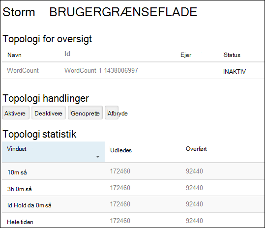
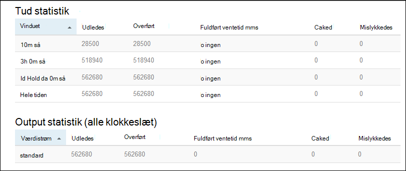

<properties
    pageTitle="Apache Storm Selvstudium: Introduktion til Linux-baserede Storm på HDInsight | Microsoft Azure"
    description="Komme i gang med stor data analyser ved hjælp af Apache Storm og Storm Starter eksempler på Linux-baserede HDInsight. Lær, hvordan du bruger Storm til at behandle data i realtid."
    keywords="Apache storm, apache storm selvstudium, stor data analytics, storm starter"
    services="hdinsight"
    documentationCenter=""
    authors="Blackmist"
    manager="jhubbard"
    editor="cgronlun"/>

<tags
   ms.service="hdinsight"
   ms.devlang="java"
   ms.topic="get-started-article"
   ms.tgt_pltfrm="na"
   ms.workload="big-data"
   ms.date="10/12/2016"
   ms.author="larryfr"/>

# Apache Storm Selvstudium: Introduktion til Storm Starter eksemplerne for stor data analytics på HDInsight

Apache Storm er et SVG fejlsikret fordelt, og realtid beregning system til at behandle streams af data. Du kan oprette en skybaseret Storm klynge, som udfører stor data analytics i realtid med Storm på Azure HDInsight.

> [AZURE.NOTE] Trinnene i artiklen oprette en Linux-baserede HDInsight klynge. Få en vejledning til at oprette en Windows-baseret Storm på HDInsight klynge i [Apache Storm Selvstudium: Introduktion til eksemplet Storm Starter ved hjælp af analyse af data på HDInsight](hdinsight-apache-storm-tutorial-get-started.md)

## Forudsætninger

[AZURE.INCLUDE [delete-cluster-warning](../../includes/hdinsight-delete-cluster-warning.md)]

Du skal have følgende for at fuldføre selvstudiet Apache Storm:

- **En Azure-abonnement**. Se [få Azure gratis prøveversion](https://azure.microsoft.com/documentation/videos/get-azure-free-trial-for-testing-hadoop-in-hdinsight/).

- **Kendskab til SSH og SCP**. Du kan finde flere oplysninger om brug af SSH og SCP med HDInsight, se følgende:

    - **Linux, Unix eller OS X-klienter**: se [Brug SSH med Linux-baserede Hadoop på HDInsight fra Linux, OS X eller Unix](hdinsight-hadoop-linux-use-ssh-unix.md)

    - **Windows-klienter**: se [Brug SSH med Linux-baserede Hadoop på HDInsight fra Windows](hdinsight-hadoop-linux-use-ssh-windows.md)

### Krav til Access

[AZURE.INCLUDE [access-control](../../includes/hdinsight-access-control-requirements.md)]

## Oprette en Storm klynge

I dette afsnit, skal du oprette en HDInsight version 3.2 klynge (Storm version 0.9.3) ved hjælp af en skabelon til Azure ressourcestyring. Du kan finde oplysninger om HDInsight versioner og deres SLA [HDInsight komponent versionsstyring](hdinsight-component-versioning.md). Du kan finde andre metoder til oprettelse af klynge, [oprette HDInsight klynger](hdinsight-hadoop-provision-linux-clusters.md).

1. Klik på følgende billede for at åbne skabelonen i portalen Azure.         

    
    
    Skabelonen er placeret i en offentlig blob beholder, *https://hditutorialdata.blob.core.windows.net/armtemplates/create-linux-based-storm-cluster-in-hdinsight.json*. 
   
2. Angiv følgende oplysninger fra bladet parametre:

    - **ClusterName**: Angiv et navn til den Hadoop-klynge, du vil oprette.
    - **Klynge login-navn og din adgangskode**: login standardnavnet er administrator.
    - **SSH brugernavn og din adgangskode**.
    
    Skriv disse værdier.  Du skal bruge dem senere i selvstudiet.

    > [AZURE.NOTE] SSH bruges til at få fjernadgang til den HDInsight-klynge, ved hjælp af en kommandolinje. Det brugernavn og adgangskode, du bruger her bruges, når du opretter forbindelse til klynge gennem SSH. Brugernavnet SSH skal også være entydig, som den opretter en brugerkonto i alle HDInsight klyngenoder. Følgende er nogle af de kontonavne reserveret til brug af tjenesterne på klyngen, og kan ikke bruges som SSH brugernavn:
    >
    > rod, hdiuser, storm, hbase, ubuntu, zookeeper, hdfs, garn, mapred, hbase, hive, oozie, falcon, sqoop, admin, tez, hcat, hdinsight zookeeper.

    > Du kan finde flere oplysninger om brug af SSH med HDInsight du se en af følgende artikler:

    > * [Bruge SSH med Linux-baserede Hadoop på HDInsight fra Linux, Unix eller OS X](hdinsight-hadoop-linux-use-ssh-unix.md)
    > * [Bruge SSH med Linux-baserede Hadoop på HDInsight fra Windows](hdinsight-hadoop-linux-use-ssh-windows.md)

    
3. Klik på **OK** for at gemme parametrene.

4. Klik på rullelisten **ressourcegruppe** fra bladet **brugerdefineret installation** , og klik derefter på **Ny** for at oprette en ny ressourcegruppe. Ressourcegruppen er en objektbeholder, der grupperer klyngen, kontoen afhængige lagerplads og andre sammenkædede ressource.

5. skal du klikke på **juridiske begreber**, og klik derefter på **Opret**.

6. Klik på **Opret**. Du får vist et nyt felt med titlen Submitting installation til installation af skabelon. Det tager om omkring 20 minutter til at oprette klynge og SQL-database.

##Køre et eksempel på Storm Starter på HDInsight

Eksempler på [storm starter](https://github.com/apache/storm/tree/master/examples/storm-starter) medtages på HDInsight klyngen. I følgende trin kører du WordCount eksempel.

1. Oprette forbindelse til den HDInsight klynge, ved hjælp af SSH:

        ssh USERNAME@CLUSTERNAME-ssh.azurehdinsight.net
        
    Hvis du brugte en adgangskode til at sikre brugerkontoen SSH, bliver du bedt om at angive det. Hvis du har brugt en offentlig nøgle, kan du skal bruge den `-i` parameter for at angive den tilsvarende privat nøgle. For eksempel `ssh -i ~/.ssh/id_rsa USERNAME@CLUSTERNAME-ssh.azurehdinsight.net`.
        
    Du kan finde flere oplysninger om brug af SSH med Linux-baserede HDInsight, i følgende artikler:
    
    * [Bruge SSH med Linux-baserede Hadoop på HDInsight fra Linux, Unix eller OS X](hdinsight-hadoop-linux-use-ssh-unix.md)

    * [Bruge SSH med Linux-baserede Hadoop på HDInsight fra Windows](hdinsight-hadoop-linux-use-ssh-windows)

2. Brug følgende kommando til at starte en topologi for eksempel:

        storm jar /usr/hdp/current/storm-client/contrib/storm-starter/storm-starter-topologies-*.jar storm.starter.WordCountTopology wordcount
        
    > [AZURE.NOTE] Den `*` del af filnavnet bruges til at matche versionsnummeret, som ændres, når HDInsight opdateres.

    Dette starter eksempel WordCount topologien på klynge med et brugervenligt navn på 'wordcount'. Den tilfældigt generere sætninger og tælle forekomster af hvert ord i sætningerne.

    > [AZURE.NOTE] Når du indsender topologi til klyngen, skal du først kopiere filen glas, der indeholder klyngen inden du bruger den `storm` kommandoen. Dette kan gøres ved hjælp af den `scp` kommando fra den klient, hvor filen findes. For eksempel`scp FILENAME.jar USERNAME@CLUSTERNAME-ssh.azurehdinsight.net:FILENAME.jar`
    >
    > Eksemplet WordCount og andre storm starter eksempler findes allerede på din klynge på `/usr/hdp/current/storm-client/contrib/storm-starter/`.

##Overvåge topologien

Storm Brugergrænsefladen har en grænseflade til at arbejde med kører topologier og findes på din HDInsight klynge.

Brug følgende trin til at overvåge topologien ved hjælp af brugergrænsefladen i Storm.:

1. Åbn en webbrowser til https://CLUSTERNAME.azurehdinsight.net/stormui, hvor __CLUSTERNAME__ er navnet på din klynge. Dette åbner Storm Brugergrænsefladen.

    > [AZURE.NOTE] Hvis bedt om at angive et brugernavn og adgangskode, kan du angive klyngeadministratoren (admin) og adgangskode, du brugte hvornår oprettelse af klyngen.

2. Vælg et **wordcount** element i kolonnen **navn** under **topologi oversigt**. Derved vises yderligere oplysninger om topologien.

    

    Denne side indeholder følgende oplysninger:

    * **Topologi statistik** - grundlæggende oplysninger om topologi ydeevne, organiseret i gang windows.

        > [AZURE.NOTE] Vælge en bestemt tidsramme ændres en tidsramme for oplysninger, der vises i andre sektioner på siden.

    * **Spouts** - grundlæggende oplysninger om spouts, herunder den sidste fejl, der returneres af hver tud.

    * **Bolte** - grundlæggende oplysninger om bolte.

    * **Topologi konfiguration** – detaljerede oplysninger om topologi konfigurationen.

    Denne side indeholder også handlinger, der kan udføres på topologien:

    * **Aktivér** - CV'er behandling af en deaktiverede topologi.

    * **Deaktiver** - afbrydes en igangværende topologi.

    * **Genoprette** - justerer parallelitet for topologien. Du skal genoprette kører topologier, når du har ændret antallet af knuder i klyngen. Dette giver mulighed for topologien til at justere parallelitet som kompensation for øget/mindre antallet af knuder på klyngen. Du kan finde flere oplysninger, kan du se [om parallelitet af en Storm topologi](http://storm.apache.org/documentation/Understanding-the-parallelism-of-a-Storm-topology.html).

    * **Afbryde** - ophører en Storm topologi efter den angivne timeout.

3. Vælg en post i afsnittet **Spouts** eller **bolte** fra denne side. Derved vises oplysninger om den valgte komponent.

    

    På denne side vises følgende oplysninger:

    * **Tud/Bolt statistik** - grundlæggende oplysninger om ydeevnen komponent organiseret i gang windows.

        > [AZURE.NOTE] Vælge en bestemt tidsramme ændres en tidsramme for oplysninger, der vises i andre sektioner på siden.

    * **Input statistik** (kun bolt) - oplysninger om komponenter, der giver data, der bruges af bolten.

    * **Output statistik** - oplysninger om data fra denne bolt.

    * **Bobestyreren** - oplysninger om forekomster af denne komponent.

    * **Fejl** - fejl, der er oprettet med denne komponent.

4. Når du får vist detaljerne for en tud eller bolt, kan du vælge et element fra kolonnen **Port** i **bobestyreren** afsnit for at få vist detaljer for en bestemt forekomst af komponenten.

        2015-01-27 14:18:02 b.s.d.task [INFO] Emitting: split default ["with"]
        2015-01-27 14:18:02 b.s.d.task [INFO] Emitting: split default ["nature"]
        2015-01-27 14:18:02 b.s.d.executor [INFO] Processing received message source: split:21, stream: default, id: {}, [snow]
        2015-01-27 14:18:02 b.s.d.task [INFO] Emitting: count default [snow, 747293]
        2015-01-27 14:18:02 b.s.d.executor [INFO] Processing received message source: split:21, stream: default, id: {}, [white]
        2015-01-27 14:18:02 b.s.d.task [INFO] Emitting: count default [white, 747293]
        2015-01-27 14:18:02 b.s.d.executor [INFO] Processing received message source: split:21, stream: default, id: {}, [seven]
        2015-01-27 14:18:02 b.s.d.task [INFO] Emitting: count default [seven, 1493957]

    Du kan se, at word **syv** der opstod 1493957 gange fra disse data. Det er hvor mange gange, der er opstået da denne topologi er blevet startet.

##Stoppe topologien

Gå tilbage til siden **Oversigt topologi** for topologien antallet af ord, og vælg derefter knappen **Afslut** fra sektionen **topologi handlinger** . Når du bliver bedt om det, kan du skrive 10 sekunder at vente, før du stopper topologien. Efter timeout-perioden vises topologien ikke længere, når du besøger afsnittet **Storm Brugergrænsefladen** i dashboardet.

##Slette klyngen

[AZURE.INCLUDE [delete-cluster-warning](../../includes/hdinsight-delete-cluster-warning.md)]

##Næste trin

I dette selvstudium Apache Storm brugte du Storm Starter til at få mere for at vide om at oprette en Storm på HDInsight klynge og bruge dashboardet Storm at implementere, overvåge og administrere Storm topologier. Læs derefter Sådan [udvikle Java-baserede topologier ved hjælp af Maven](hdinsight-storm-develop-java-topology.md).

Hvis du allerede kender, udvikling Java-baserede topologier og vil installere en eksisterende topologi til HDInsight, se [Implementer og administrere Apache Storm topologier på HDInsight](hdinsight-storm-deploy-monitor-topology-linux.md).

Hvis du er en .NET udvikler, kan du oprette C# eller hybrid C# / Java topologier ved hjælp af Visual Studio. Du kan finde flere oplysninger [udvikle C# topologier for Apache Storm på HDInsight ved hjælp af Hadoop-værktøjer til Visual Studio](hdinsight-storm-develop-csharp-visual-studio-topology.md).

For eksempel se topologier, der kan bruges med Storm på HDInsight, i følgende eksempler:

    * [Eksempel topologier for Storm på HDInsight](hdinsight-storm-example-topology.md)

[apachestorm]: https://storm.incubator.apache.org
[stormdocs]: http://storm.incubator.apache.org/documentation/Documentation.html
[stormstarter]: https://github.com/apache/storm/tree/master/examples/storm-starter
[stormjavadocs]: https://storm.incubator.apache.org/apidocs/
[azureportal]: https://manage.windowsazure.com/
[hdinsight-provision]: hdinsight-provision-clusters.md
[preview-portal]: https://portal.azure.com/
