<properties
    pageTitle="Apache Storm Selvstudium: Introduktion til Storm | Microsoft Azure"
    description="Introduktion til big data analyser ved hjælp af Apache Storm og Storm Starter eksempler på HDInsight. Lær, hvordan du bruger Storm til at behandle data i realtid."
    keywords="Apache storm, apache storm selvstudium, stor data analytics, storm starter"
    services="hdinsight"
    documentationCenter=""
    authors="Blackmist"
    manager="jhubbard"
    editor="cgronlun"
    tags="azure-portal"/>

<tags
   ms.service="hdinsight"
   ms.devlang="java"
   ms.topic="article"
   ms.tgt_pltfrm="na"
   ms.workload="big-data"
   ms.date="09/07/2016"
   ms.author="larryfr"/>

# Apache Storm Selvstudium: Introduktion til Storm Starter eksemplerne for stor data analytics på HDInsight

Apache Storm er et SVG fejlsikret fordelt, og realtid beregning system til at behandle streams af data. Du kan oprette en skybaseret Storm klynge, som udfører stor data analytics i realtid med Storm på Microsoft Azure HDInsight. 

> [AZURE.NOTE] Trinnene i artiklen oprette en Windows-baseret HDInsight klynge. Få en vejledning til at oprette en Linux-baserede Storm på HDInsight klynge i [Apache Storm Selvstudium: Introduktion til eksemplet Storm Starter ved hjælp af analyse af data på HDInsight](hdinsight-apache-storm-tutorial-get-started-linux.md)

## Forudsætninger

[AZURE.INCLUDE [delete-cluster-warning](../../includes/hdinsight-delete-cluster-warning.md)]

Du skal have følgende for at fuldføre selvstudiet Apache Storm:

- **En Azure-abonnement**. Se [få Azure gratis prøveversion](https://azure.microsoft.com/documentation/videos/get-azure-free-trial-for-testing-hadoop-in-hdinsight/).

### Krav til Access

[AZURE.INCLUDE [access-control](../../includes/hdinsight-access-control-requirements.md)]

## Oprette en Storm klynge

Storm på HDInsight bruger Azure Blob-lager til lagring af logfiler og topologier, der er sendt til klyngen. Brug følgende trin til at oprette en Azure lagerplads konto til brug med din klynge:

1. Log på [Azure Portal][preview-portal].

2. Vælg **Ny**, Vælg __Data Analytics__og derefter vælge __HDInsight__.

    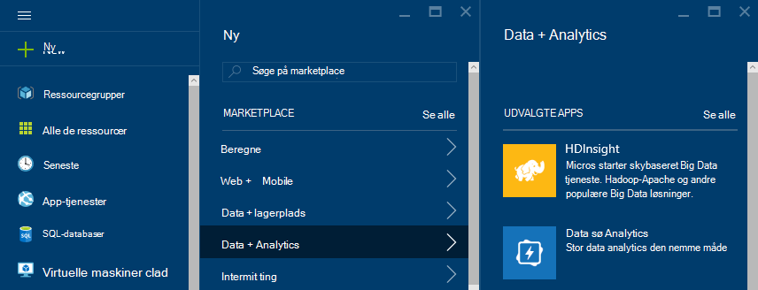

3. Angiv et __navn__. En grøn markering vises ud for det __Navn__ , hvis den er tilgængelig.

4. Hvis du har mere end ét abonnement, Vælg et __abonnement__ element til at vælge Azure abonnementet, der skal bruges for-klyngen.

5.  Brug __Vælg typen af klynge__ for at vælge en __Storm__ klynge. Vælg Windows for __operativsystemet__. Vælg STANDARD for __Klynge niveau__. Til sidst skal bruge knappen Vælg for at gemme disse indstillinger.

    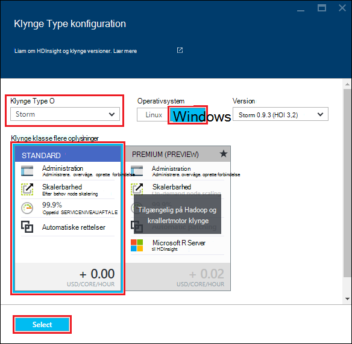

5. For __Ressourcegruppe__kan du os på rullelisten se en liste over eksisterende grupper, og vælg derefter en til at oprette klynge i. Eller du kan vælge __Ny__ og derefter angive navnet på den nye ressourcegruppe. Der vises en grøn markering til at angive, hvis det nye gruppenavn er tilgængelig.

6. Vælg __legitimationsoplysninger__, og indtast en __Klynge Login brugernavn__ og __Adgangskode til klynge logon__. Til sidst skal bruge __Vælg__ til at angive legitimationsoplysninger. Fjernskrivebord bruges ikke i dette dokument, så du kan lade feltet være deaktiveret.

    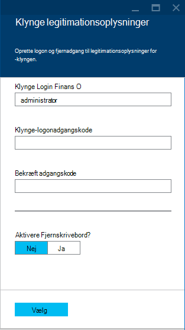

6. Du kan Vælg et element til at vælge en eksisterende datakilde eller oprette en ny for __Datakilden__.

    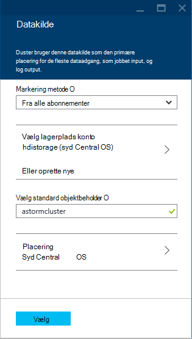

    I øjeblikket kan du vælge en Azure lagerplads konto som datakilde til en HDInsight klynge. Brug følgende fremgangsmåde til at forstå posterne på bladet __Datakilde__ .

    - __Markering metode__: Angiv denne indstilling til __fra alle abonnementer__ for at aktivere gennemsyn af lagerplads konti på dine abonnementer. Angiv til __Hurtigtast__ , hvis du vil angive __Lagerplads navn__ og __Hurtigtast__ til en eksisterende konto lagerplads.

    - __Opret ny__: Brug dette til at oprette en ny firmapost lagerplads. Brug det felt, der vises, for at angive navnet på kontoen, lagerplads. En grøn markering vises, hvis navnet er tilgængelig.

    - __Vælg standard objektbeholder__: Brug dette til at skrive navnet på objektbeholderen standard skal bruges til klyngen. Selvom du kan angive et navn her, anbefaler vi, at du med det samme navn som klyngen, så du let kan genkende, bruges objektbeholderen for denne specifikke klynge.

    - __Placering__: geografisk område, der skal være kontoen lagerplads er i, eller der oprettes i.

        > [AZURE.IMPORTANT] Vælge en placering til standard-datakilde også angiver placeringen af HDInsight klyngen. Datakilden klynge og standard skal være placeret i samme region.

    - __Vælg__: Brug dette til at gemme konfigurationen af datakilden.

7. Vælg __Node priser lag__ til at få vist oplysninger om de noder, der oprettes for denne klynge. Antallet af knuder, som er som standard angivet til __4__. Angiv dette til __1__, som dette er tilstrækkelige til dette selvstudium og reducerer omkostningerne for klyngen. De estimerede omkostninger for klyngen vises i bunden af denne blade.

    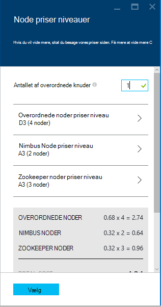

    Brug __Vælg__ til at gemme oplysningerne om __Node priser niveauer__ .

8. Vælg __valgfri konfiguration__. Denne blade kan du vælge den klynge version samt konfigurere andre valgfri indstillinger som deltager i et __Virtuelt netværk__.

    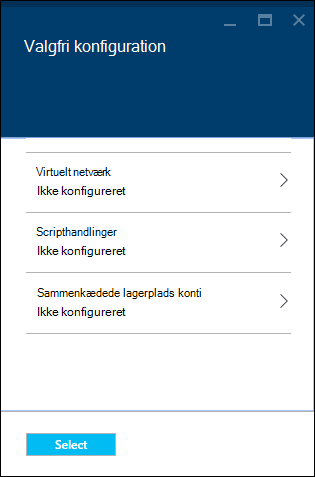

9. Sørg for, at __Fastgør til Startboard__ er markeret, og vælg derefter __Opret__. Dette opretter klyngen og tilføjer et felt til det for Startboard af din Azure portal. Ikonet angiver, at klyngen klargøring og ændringer at få vist ikonet HDInsight én gang klargøring er fuldført.

  	| Mens klargøring | Klargøring af fuldført |
  	| ------------------ | --------------------- |
  	|  | 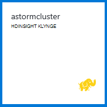 |

    > [AZURE.NOTE] Det tager noget tid for klynge skal oprettes, normalt omkring 15 minutter. Brug feltet på Startboard eller posten __beskeder__ til venstre på siden til at se, om klargøring processen.

## Køre et eksempel på Storm Starter på HDInsight

Selvstudiet Apache Storm introducerer dig til stor data analyser ved hjælp af Storm Starter eksempler på GitHub.

Hver Storm på HDInsight klynge leveres med Storm Dashboard, der kan bruges til at overføre og køre Storm topologier på klyngen. Hver klynge leveres også med eksempeltopologier, der kan køres direkte fra dashboardet Storm.

### Oprette forbindelse til dashboard

Dashboard er placeret i **https://&lt;clustername >.azurehdinsight.net//**, hvor **clustername** er navnet på klyngen. Du kan også finde et link til dashboard ved at vælge klyngen fra Startboard og vælge linket __Dashboard__ i øverst del af bladet.

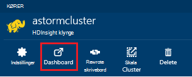

> [AZURE.NOTE] Når du opretter forbindelse til dashboard, kan du bliver bedt om at angive et brugernavn og adgangskode. Dette er det administratornavn (**Administratorer**) og den adgangskode, der bruges, når du har oprettet klyngen.

Når dashboardet Storm har indlæst, ser du **Sende topologi** formularen.

Formularen **Sende topologi** kan bruges til at overføre og køre .jar filer, der indeholder Storm topologier. Det indeholder også flere grundlæggende eksempler, der følger med klyngen.

### Køre eksemplet antallet af ord fra Storm Starter projektet i GitHub

Eksemplerne med klyngen medtage flere variationer af et word-optælling topologi. Disse eksempler omfatter en **spout** , tilfældigt udsender sætninger og **bolte** , bryde hver sætning i enkeltord, og derefter tælle, hvor mange gange hvert ord, der er opstået. Disse eksempler er fra [Storm Starter eksempler](https://github.com/apache/storm/tree/master/examples/storm-starter), som er en del af Apache Storm.

Udfør følgende trin for at køre en Storm Starter eksempel:

1. Vælg **StormStarter - WordCount** fra rullemenuen **Jar fil** . Dette udfylder felterne **Klassenavnet** og **Yderligere parametre** med parametrene for dette eksempel.

    

    * **Klassenavnet** - klassen i filen .jar, som sender topologien.
    * **Yderligere parametre** - eventuelle parametre, der kræves, før topologien. I dette eksempel bruges feltet til at give et fuldt navn til den sendte topologi.

2. Klik på **Send**. Feltet **resultat** viser kommandoen bruges til at lægge jobbet, samt resultaterne af kommandoen efter et bestemt tidspunkt. Feltet **fejl** viser eventuelle fejl, der forekommer i sende topologien.

    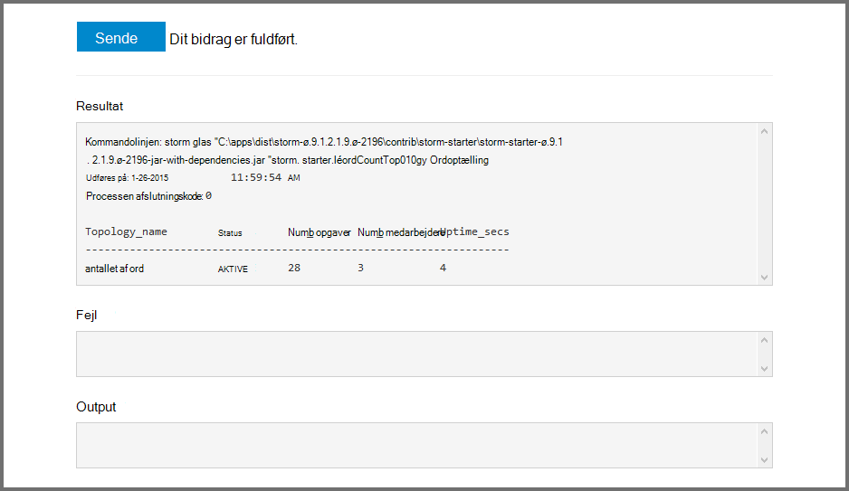

    > [AZURE.NOTE] Resultaterne angiver ikke, at topologien er færdig - **en Storm topologi, når den er startet, kører, indtil du stopper det.** Antallet af ord topologien genererer tilfældige sætninger, og beholder en antal hvor mange gange det registrerer hvert ord, indtil du stopper den.

### Overvåge topologien

Storm Brugergrænsefladen kan bruges til at overvåge topologien.

1. Vælg **Storm Brugergrænsefladen** fra toppen af dashboardet Storm. Dette viser opsummeringsoplysninger for klyngen og alle, der kører topologier.

    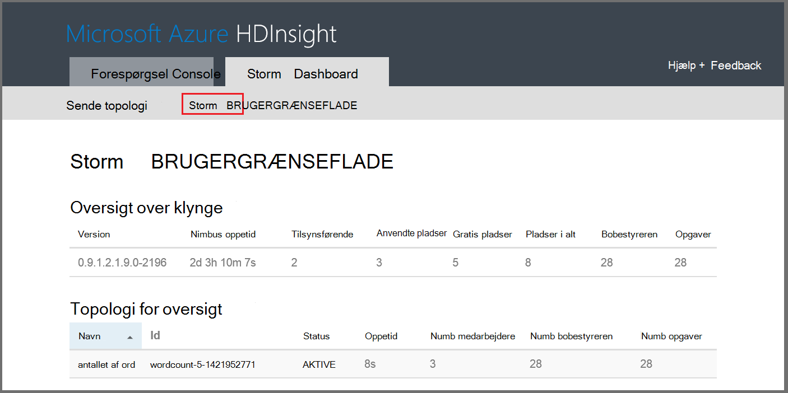

    Fra siden ovenfor, kan du se det tidspunkt, topologien har været aktiv samt antallet af medarbejdere, bobestyreren og opgaver, der bruges.

    > [AZURE.NOTE] Kolonnen **navn** indeholder det angivne tidligere via feltet **Yderligere parametre** fulde navn.

4. Vælg et **wordcount** element i kolonnen **navn** under **topologi oversigt**. Dette viser flere oplysninger om topologien.

    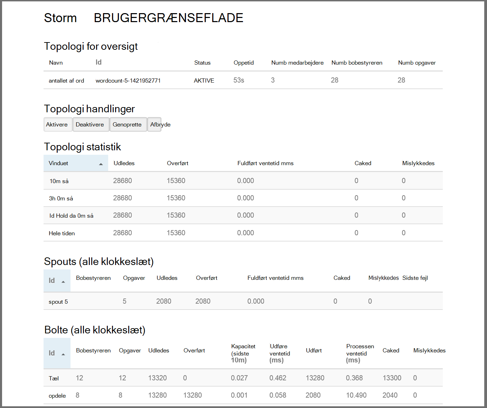

    Denne side indeholder følgende oplysninger:

    * **Topologi statistik** - grundlæggende oplysninger om topologi ydeevne, organiseret i gang windows.

        > [AZURE.NOTE] Vælge en bestemt tidsramme ændres en tidsramme for oplysninger, der vises i andre sektioner på siden.

    * **Spouts** - grundlæggende oplysninger om spouts, herunder den sidste fejl, der returneres af hver tud.

    * **Bolte** - grundlæggende oplysninger om bolte.

    * **Topologi konfiguration** – detaljerede oplysninger om topologi konfigurationen.

    Denne side indeholder også handlinger, der kan udføres på topologien:

    * **Aktivér** - CV'er behandling af en deaktiverede topologi.

    * **Deaktiver** - afbrydes en igangværende topologi.

    * **Genoprette** - justerer parallelitet for topologien. Du skal genoprette kører topologier, når du har ændret antallet af knuder i klyngen. Dette giver mulighed for topologien til at justere parallelitet som kompensation for øget/mindre antallet af knuder på klyngen. Du kan finde flere oplysninger, kan du se [om parallelitet af en Storm topologi](http://storm.apache.org/documentation/Understanding-the-parallelism-of-a-Storm-topology.html).

    * **Afbryde** - ophører en Storm topologi efter den angivne timeout.

5. Vælg en post i afsnittet **Spouts** eller **bolte** fra denne side. Dette viser oplysninger om den valgte komponent.

    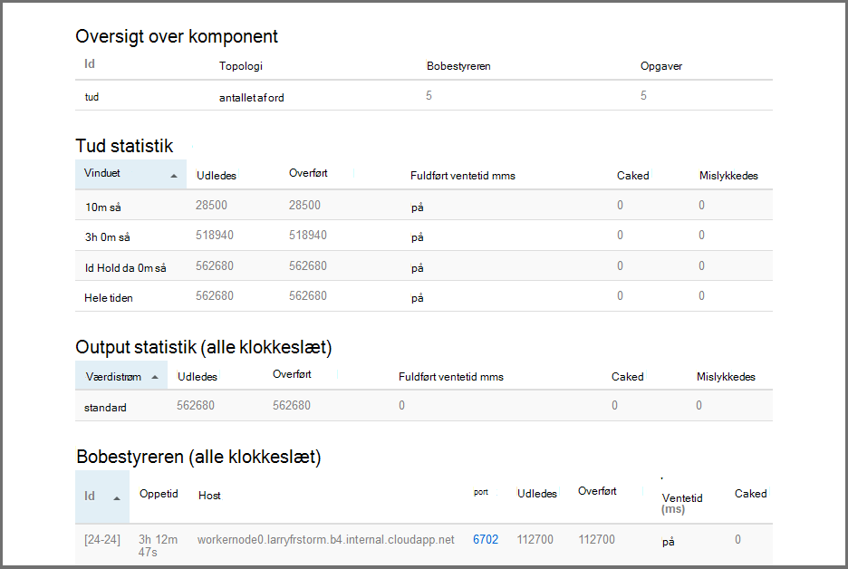

    På denne side vises følgende oplysninger:

    * **Tud/Bolt statistik** - grundlæggende oplysninger om ydeevnen komponent organiseret i gang windows.

        > [AZURE.NOTE] Vælge en bestemt tidsramme ændres en tidsramme for oplysninger, der vises i andre sektioner på siden.

    * **Input statistik** (kun bolt) - oplysninger om komponenter, der giver data, der bruges af bolten.

    * **Output statistik** - oplysninger om data fra denne bolt.

    * **Bobestyreren** - oplysninger om forekomster af denne komponent.

    * **Fejl** - fejl, der er oprettet med denne komponent.

5. Når du får vist detaljerne for en tud eller bolt, kan du vælge et element fra kolonnen **Port** i **bobestyreren** afsnit for at få vist detaljer for en bestemt forekomst af komponenten.

        2015-01-27 14:18:02 b.s.d.task [INFO] Emitting: split default ["with"]
        2015-01-27 14:18:02 b.s.d.task [INFO] Emitting: split default ["nature"]
        2015-01-27 14:18:02 b.s.d.executor [INFO] Processing received message source: split:21, stream: default, id: {}, [snow]
        2015-01-27 14:18:02 b.s.d.task [INFO] Emitting: count default [snow, 747293]
        2015-01-27 14:18:02 b.s.d.executor [INFO] Processing received message source: split:21, stream: default, id: {}, [white]
        2015-01-27 14:18:02 b.s.d.task [INFO] Emitting: count default [white, 747293]
        2015-01-27 14:18:02 b.s.d.executor [INFO] Processing received message source: split:21, stream: default, id: {}, [seven]
        2015-01-27 14:18:02 b.s.d.task [INFO] Emitting: count default [seven, 1493957]

    Fra disse data, kan du se, at word **syv** der opstod 1,493,957 gange. Det er hvor mange gange, der er opstået da denne topologi er blevet startet.

### Stoppe topologien

Gå tilbage til siden **Oversigt topologi** for topologien antallet af ord, og vælg derefter **Slet** fra sektionen **topologi handlinger** . Når du bliver bedt om det, kan du skrive 10 sekunder at vente, før du stopper topologien. Efter timeout-perioden vises topologien ikke længere, når du besøger afsnittet **Storm Brugergrænsefladen** i dashboardet.

##Slette klyngen

[AZURE.INCLUDE [delete-cluster-warning](../../includes/hdinsight-delete-cluster-warning.md)]

## Oversigt

I dette selvstudium Apache Storm brugte du Storm Starter til at få mere for at vide om at oprette en Storm på HDInsight klynge og bruge dashboardet Storm at implementere, overvåge og administrere Storm topologier.

## Næste trin

* **HDInsight værktøjer til Visual Studio** - HDInsight værktøjer kan du bruge Visual Studio til at sende, overvåge og administrere Storm topologier ligner dashboardet Storm nævnt tidligere. HDInsight værktøjer også giver mulighed for at oprette C# Storm topologier og omfatter eksempeltopologier, som du kan installere og køre på din klynge.

    Yderligere oplysninger finder du se [komme i gang ved hjælp af værktøjerne HDInsight til Visual Studio](hdinsight-hadoop-visual-studio-tools-get-started.md).

* **Eksempelfiler** - feltet HDInsight Storm klynge indeholder flere eksempler i mappen **%STORM_HOME%\contrib** . Hvert eksempel skal indeholde følgende:

    * Koden – for eksempel storm-starter-0.9.1.2.1.5.0-2057-sources.jar

    * Siden Java dokumenter – for eksempel storm-starter-0.9.1.2.1.5.0-2057-javadoc.jar

    * Eksemplet – for eksempel storm-starter-0.9.1.2.1.5.0-2057-jar-with-dependencies.jar

    Brug kommandoen 'glas' til at uddrage kildekode eller Java-dokumenter. For eksempel ' glas - xvf storm-starter-0.9.1.2.1.5.0.2057-javadoc.jar'.

    > [AZURE.NOTE] Java-dokumenter består af websider. Når udpakket, kan du bruge en browser til at få vist filen **index.html** .

    For at få adgang til disse eksempler, skal du aktivere Fjernskrivebord Storm på HDInsight klynge, og derefter kopiere filerne fra **%STORM_HOME%\contrib**.

* Følgende dokument indeholder en liste over andre eksempler, der kan bruges med Storm på HDInsight:

    * [Eksempel topologier for Storm på HDInsight](hdinsight-storm-example-topology.md)

[apachestorm]: https://storm.incubator.apache.org
[stormdocs]: http://storm.incubator.apache.org/documentation/Documentation.html
[stormstarter]: https://github.com/apache/storm/tree/master/examples/storm-starter
[stormjavadocs]: https://storm.incubator.apache.org/apidocs/
[azureportal]: https://manage.windowsazure.com/
[hdinsight-provision]: hdinsight-provision-clusters.md
[preview-portal]: https://portal.azure.com/
