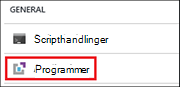
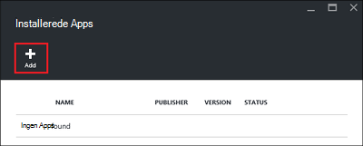
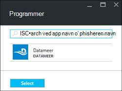
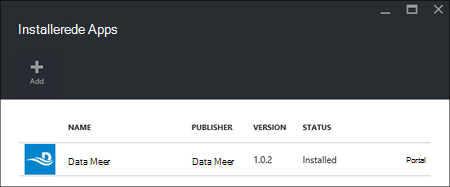

<properties
    pageTitle="Installere Hadoop-programmer på HDInsight | Microsoft Azure"
    description="Lær, hvordan du installerer HDInsight programmer på HDInsight programmer."
    services="hdinsight"
    documentationCenter=""
    authors="mumian"
    manager="jhubbard"
    editor="cgronlun"
    tags="azure-portal"/>

<tags
    ms.service="hdinsight"
    ms.devlang="na"
    ms.topic="hero-article"
    ms.tgt_pltfrm="na"
    ms.workload="big-data"
    ms.date="09/14/2016"
    ms.author="jgao"/>

# Installere HDInsight-programmer

Et HDInsight program er et program, der kan brugere installere på en Linux-baserede HDInsight klynge. Disse programmer kan udvikles af Microsoft, uafhængige softwareleverandører (ISV) eller dig selv. I denne artikel lærer du, hvordan du installerer et udgivet program. Se [installere brugerdefinerede HDInsight programmer](hdinsight-apps-install-custom-applications.md)til installation af dit eget program. 

Der er i øjeblikket en udgivet program:

- **Datameer**: [Datameer](http://www.datameer.com/documentation/display/DAS50/Home?ls=Partners&lsd=Microsoft&c=Partners&cd=Microsoft) tilbyder analytikere en interaktiv metode til at finde, analysere og visualisere resultater i Big Data. Hente flere datakilder nemt at registrere nye relationer og få svar hurtigt du skal bruge.

>[AZURE.NOTE] Datameer er i øjeblikket kun understøttes i Azure HDInsight version 3.2 klynger.

Vejledningen i denne artikel bruge Azure portal. Du kan også eksportere skabelonen Azure ressourcestyring fra portalen eller hente en kopi af skabelonen ressourcestyring fra leverandører og bruge Azure PowerShell og Azure CLI til at installere skabelonen.  Se [oprette Linux-baserede Hadoop klynger i HDInsight ved hjælp af Ressourcestyring skabeloner](hdinsight-hadoop-create-linux-clusters-arm-templates.md).

## Forudsætninger

Hvis du vil installere HDInsight-programmer på en eksisterende HDInsight klynge, skal du have en HDInsight klynge. Se [oprette klynger](hdinsight-hadoop-linux-tutorial-get-started.md#create-cluster)for at oprette en. Du kan også installere HDInsight programmer, når du opretter en HDInsight klynge.

## Installere programmer på eksisterende klynger

Følgende procedure viser, hvordan du installerer HDInsight programmer til en eksisterende HDInsight klynge.

**Installere et HDInsight-program**

1. Log på [Azure-portalen](https://portal.azure.com).
2. Klik på **HDInsight klynger** i menuen til venstre.  Hvis du ikke kan se den, klik på **Gennemse**og derefter klikke på **HDInsight klynger**.
3. Klik på en HDInsight klynge.  Hvis du ikke har en, skal du oprette en første.  Se [oprette klynger](hdinsight-hadoop-linux-tutorial-get-started.md#create-cluster).
4. Klik på **programmer** under kategorien **Generelt** bladet **Indstillinger** . Bladet **Installeret Apps** viser alle installerede programmer. 

    

5. Klik på **Tilføj** fra menuen blade. 

    

    Du skal se en liste over eksisterende HDInsight programmer.

    

6. Klik på en af programmerne, acceptere juridiske betingelser, og klik derefter på **Vælg**.

Du kan se status for installation fra portalen meddelelserne (Klik på klokkeikonet øverst på portalen). Når programmet er installeret, vises programmet på bladet installeret Apps.

## Installere programmer under oprettelse af klynge

Du har mulighed for at installere HDInsight-programmer, når du opretter en klynge. HDInsight programmer er installeret, efter klyngen oprettes og er i tilstanden, der kører under processen. Følgende procedure viser, hvordan du installerer HDInsight programmer, når du opretter en klynge.

**Installere et HDInsight-program**

1. Log på [Azure-portalen](https://portal.azure.com).
2. Klik på **Ny**, skal du klikke på **Data + Analytics**, og klik derefter på **HDInsight**.
3. Angiv **Klyngenavn**: dette navn skal være globalt entydig.
4. Klik på **abonnement** for at markere det Azure abonnement, der skal bruges til klyngen.
5. Klik på **Vælg klynge Type**, og vælg derefter:

    - **Klynge Type**: Hvis du ikke ved, hvad du skal vælge, vælge **Hadoop**. Det er den mest populære klynge type.
    - **Operativsystem**: Vælg **Linux**.
    - **Version**: bruge standardversionen, hvis du ikke ved, hvad du skal vælge. Du kan finde yderligere oplysninger finder [HDInsight klynge versioner](hdinsight-component-versioning.md).
    - **Klynge niveau**: Azure HDInsight giver stor data skyen tilbud i to kategorier: Standard niveau og Premium niveau. Du kan finde flere oplysninger [klynge niveauer](hdinsight-hadoop-provision-linux-clusters.md#cluster-tiers).
6. Klikke på **programmer**, klik på en af de publicerede programmer, og klik derefter på **Vælg**.
6. Klik på **legitimationsoplysninger** og derefter angive en adgangskode for admin-brugeren. Du skal også angive en **SSH brugernavn** og en **adgangskode** eller **Offentlig nøgle**, der bruges til at godkende brugeren SSH. Ved hjælp af en offentlig nøgle, er den anbefalede måde. Klik på **Vælg** nederst til at gemme legitimationsoplysninger konfiguration.
8. Klik på **Datakilde**skal du vælge en af de eksisterende lagerplads-konto eller oprette en ny lagerplads konto skal bruges som lager standardkontoen for-klyngen.
9. Klik på **Ressourcegruppe** for at vælge en eksisterende ressourcegruppe, eller klik på **Ny** for at oprette en ny ressourcegruppe

10. Kontrollér, at **Fastgør til Startboard** er markeret, og klik derefter på **Opret**bladet **Ny HDInsight klynge** . 

## Liste over installerede HDInsight apps og egenskaber

På portalen viser en liste over de installerede HDInsight programmer til en klynge og egenskaberne for hvert installerede program.

**Liste over HDInsight program og få vist egenskaber**

1. Log på [Azure-portalen](https://portal.azure.com).
2. Klik på **HDInsight klynger** i menuen til venstre.  Hvis du ikke kan se den, klik på **Gennemse**og derefter klikke på **HDInsight klynger**.
3. Klik på en HDInsight klynge.
4. Klik på **programmer** under kategorien **Generelt** bladet **Indstillinger** . Bladet installeret Apps viser alle installerede programmer. 

    

5. Klik på en af de installerede programmer til at vise egenskaben. Egenskaben blade lister:

    - App-navn: programnavn.
    - Status: programmet status. 
    - Webside: Webadressen for det webprogram, du har installeret til noden kant, hvis der ikke er nogen. Legitimationsoplysninger, der er den samme som de HTTP brugerlegitimationsoplysninger, du har konfigureret for-klyngen.
    - HTTP-slutpunkt: legitimationsoplysninger, der er den samme som de HTTP brugerlegitimationsoplysninger, du har konfigureret for-klyngen. 
    - SSH slutpunkt: Du kan bruge [SSH](hdinsight-hadoop-linux-use-ssh-unix.md) til at oprette forbindelse til noden kant. SSH legitimationsoplysningerne, er den samme som de SSH brugerlegitimationsoplysninger, du har konfigureret for-klyngen.

6. Hvis du vil slette et program, klik på programmet, og klik derefter på **Slet** i genvejsmenuen.

## Oprette forbindelse til noden kant

Du kan oprette forbindelse til noden kant ved hjælp af HTTP og SSH. De viste oplysninger kan findes fra [portalen](#list-installed-hdinsight-apps-and-properties). Finde flere oplysninger om brug af SSH, [Brug SSH med Linux-baserede Hadoop på HDInsight fra Linux, Unix, eller OS X](hdinsight-hadoop-linux-use-ssh-unix.md). 

HTTP-slutpunkt legitimationsoplysninger er HTTP-brugerlegitimationsoplysninger, du har konfigureret for HDInsight-klyngen; SSH slutpunkt legitimationsoplysningerne, er de SSH legitimationsoplysninger, som du har konfigureret for HDInsight-klyngen.

## Fejlfinding i forbindelse med

Se [fejlfinding af installationen](hdinsight-apps-install-custom-applications.md#troubleshoot-the-installation).

## Næste trin

- [Installere brugerdefinerede HDInsight-programmer](hdinsight-apps-install-custom-applications.md): Lær, hvordan du installerer en ophævelse udgivet HDInsight program til HDInsight.
- [Publicere HDInsight-programmer](hdinsight-apps-publish-applications.md): Lær at publicere dine brugerdefinerede HDInsight programmer til Azure Marketplace.
- [MSDN: installere et HDInsight program](https://msdn.microsoft.com/library/mt706515.aspx): Lær, hvordan du definerer HDInsight programmer.
- [Tilpasse Linux-baserede HDInsight klynger ved hjælp af Script handlingen](hdinsight-hadoop-customize-cluster-linux.md): Lær at bruge scripthandling til at installere flere programmer.
- [Oprette Linux-baserede Hadoop klynger i HDInsight ved hjælp af Ressourcestyring skabeloner](hdinsight-hadoop-create-linux-clusters-arm-templates.md): Lær, hvordan du ringe til Ressourcestyring skabeloner for at oprette HDInsight klynger.
- [Brug af tomme kant knuder på HDInsight](hdinsight-apps-use-edge-node.md): Lær at bruge en tom kantnode for adgang til HDInsight klynge, teste HDInsight programmer og vært HDInsight programmer.

