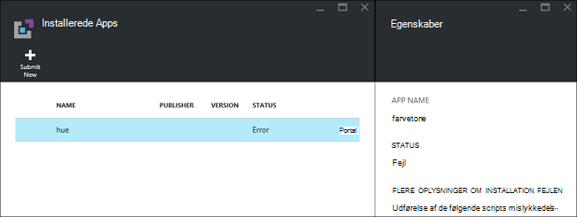
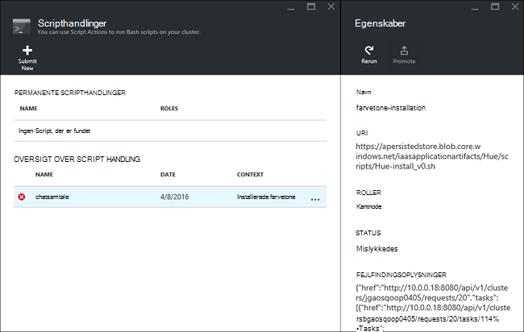

<properties
    pageTitle="Installere Hadoop-programmer på HDInsight | Microsoft Azure"
    description="Lær, hvordan du installerer HDInsight programmer på HDInsight programmer."
    services="hdinsight"
    documentationCenter=""
    authors="mumian"
    manager="jhubbard"
    editor="cgronlun"
    tags="azure-portal"/>

<tags
    ms.service="hdinsight"
    ms.devlang="na"
    ms.topic="hero-article"
    ms.tgt_pltfrm="na"
    ms.workload="big-data"
    ms.date="09/14/2016"
    ms.author="jgao"/>

# Installere brugerdefinerede HDInsight-programmer

Et HDInsight program er et program, der kan brugere installere på en Linux-baserede HDInsight klynge.  Disse programmer kan udvikles af Microsoft, uafhængige softwareleverandører (ISV) eller dig selv. I denne artikel lærer du, hvordan du installerer et HDInsight-program, der ikke er udgivet på Azure-portalen på HDInsight. Det program, du vil installere er [Farvetone](http://gethue.com/). 

Andre relaterede artikler:

- [Installere HDInsight-programmer](hdinsight-apps-install-applications.md): Lær, hvordan du installerer et HDInsight program til din klynger.
- [Publicere HDInsight-programmer](hdinsight-apps-publish-applications.md): Lær at publicere dine brugerdefinerede HDInsight programmer til Azure Marketplace.
- [MSDN: installere et HDInsight program](https://msdn.microsoft.com/library/mt706515.aspx): Lær, hvordan du definerer HDInsight programmer.

 
## Forudsætninger

Hvis du vil installere HDInsight-programmer på en eksisterende HDInsight klynge, skal du have en HDInsight klynge. Se [oprette klynger](hdinsight-hadoop-linux-tutorial-get-started.md#create-cluster)for at oprette en. Du kan også installere HDInsight programmer, når du opretter en HDInsight klynge.

## Installere HDInsight-programmer

HDInsight programmer kan installeres, når du opretter en klynge eller til en eksisterende HDInsight klynge. Til at definere Azure ressourcestyring skabeloner, se [MSDN: installere et HDInsight program](https://msdn.microsoft.com/library/mt706515.aspx).

De filer, der bruges til installation af dette program (nuance):

- [azuredeploy.JSON](https://github.com/hdinsight/Iaas-Applications/blob/master/Hue/azuredeploy.json): feltet ressourcestyring skabelon til installation af HDInsight-program. Se [MSDN: installere et HDInsight program](https://msdn.microsoft.com/library/mt706515.aspx) til udvikling af din egen ressourcestyring skabelon.
- [Farvetone install_v0.sh](https://github.com/hdinsight/Iaas-Applications/blob/master/Hue/scripts/Hue-install_v0.sh): Script handling, der kaldes af skabelonen ressourcestyring til konfiguration af noden kant. 
- [Farvetone binaries.tgz](https://hdiconfigactions.blob.core.windows.net/linuxhueconfigactionv01/hue-binaries-14-04.tgz): den binære farvetone-fil, der hedder fra Chen install_v0.sh. 
- [Farvetone-binære filer-14-04.tgz](https://hdiconfigactions.blob.core.windows.net/linuxhueconfigactionv01/hue-binaries-14-04.tgz): den binære farvetone-fil, der hedder fra Chen install_v0.sh. 
- [webwasb tomcat.tar.gz](https://hdiconfigactions.blob.core.windows.net/linuxhueconfigactionv01/webwasb-tomcat.tar.gz): et eksempel-webprogram (Tomcat), der hedder fra Chen install_v0.sh.

**Installere Farvetone til en eksisterende HDInsight klynge**

1. Klik på følgende billede for at logge på Azure og åbne skabelonen ressourcestyring i portalen Azure. 

    

    Denne knap åbner en ressourcestyring skabelon på Azure-portalen.  Skabelonen ressourceleder, der er placeret i [https://github.com/hdinsight/Iaas-Applications/tree/master/Hue](https://github.com/hdinsight/Iaas-Applications/tree/master/Hue).  Hvis du vil lære at skrive denne ressourcestyring skabelon, skal du se [MSDN: installere et HDInsight program](https://msdn.microsoft.com/library/mt706515.aspx).
    
2. Angiv følgende oplysninger fra bladet **parametre** :

    - **ClusterName**: Angiv navnet på klyngen, hvor du vil installere programmet. Denne klynge skal være en eksisterende klynge.
    
3. Klik på **OK** for at gemme parametrene.
4. Angiv **ressourcegruppe**fra bladet **brugerdefineret installation** .  Ressourcegruppen er en objektbeholder, der grupperer klyngen, kontoen afhængige lagerplads og andre ressourcer. Det er påkrævet for at bruge den samme ressourcegruppe som klyngen.
5. Klik på **juridiske begreber**, og klik derefter på **Opret**.
6. Bekræft afkrydsningsfeltet **Fastgør til dashboard** er markeret, og klik derefter på **Opret**. Du kan se status for installation fra feltet fastgjort til portalen dashboardet og portalen meddelelsen (Klik på klokkeikonet øverst på portalen).  Det tager omkring 10 minutter for at installere programmet.

**Installere Farvetone, mens du opretter en klynge**

1. Klik på følgende billede for at logge på Azure og åbne skabelonen ressourcestyring i portalen Azure. 

    

    Denne knap åbner en ressourcestyring skabelon på Azure-portalen.  Skabelonen ressourceleder, der er placeret i [https://hditutorialdata.blob.core.windows.net/hdinsightapps/create-linux-based-hadoop-cluster-in-hdinsight.json](https://hditutorialdata.blob.core.windows.net/hdinsightapps/create-linux-based-hadoop-cluster-in-hdinsight.json).  Hvis du vil lære at skrive denne ressourcestyring skabelon, skal du se [MSDN: installere et HDInsight program](https://msdn.microsoft.com/library/mt706515.aspx).

2. Følg instruktionerne til at oprette klynge og installere farvetone. Du kan finde flere oplysninger om oprettelse af HDInsight klynger, [oprette Linux-baserede Hadoop klynger i HDInsight](hdinsight-hadoop-provision-linux-clusters.md).

Ud over portalen Azure, kan du også bruge [Azure PowerShell](hdinsight-hadoop-create-linux-clusters-arm-templates.md#deploy-with-powershell) og [Azure CLI](hdinsight-hadoop-create-linux-clusters-arm-templates.md#deploy-with-azure-cli) til at ringe til Ressourcestyring skabeloner.

## Validere installationen

Du kan kontrollere programmet status på Azure-portalen til at validere programmet installationen. Desuden kan du også at validere alle HTTP slutpunkter fulgte op som forventet, og websiden, hvis der er en:

**At åbne farvetone portal**

1. Log på [Azure-portalen](https://portal.azure.com).
2. Klik på **HDInsight klynger** i menuen til venstre.  Hvis du ikke kan se den, klik på **Gennemse**og derefter klikke på **HDInsight klynger**.
3. Klik på den klynge, hvor du har installeret programmet.
4. Klik på **programmer** under kategorien **Generelt** bladet **Indstillinger** . Du skal se **Farvetone** er angivet i bladet **Installeret Apps** .
5. Klik på **Farvetone** på listen til at få vist egenskaberne.  
6. Klik på linket webside for at validere webstedet Åbn HTTP slutpunktet i en browser validere farvetone internettet brugergrænseflade, skal du åbne SSH slutpunktet ved hjælp af [trykfarver](hdinsight-hadoop-linux-use-ssh-windows.md) eller andre [SSH klienter](hdinsight-hadoop-linux-use-ssh-unix.md).
 
## Foretage fejlfinding af installationen

Du kan kontrollere status for installation på programmet fra portalen meddelelsen (Klik på klokkeikonet øverst på portalen). 

Hvis et programinstallationen mislykkedes, kan du vist fejlmeddelelser og fejlfindingsoplysninger fra 3 steder:

- HDInsight-programmer: generelle fejloplysninger.

    Åbn klyngen fra portalen, og klik på programmer fra bladet indstillinger:

    

- HDInsight scripthandling: Hvis de HDInsight programmer fejlmeddelelse angiver en script handling fejl, der præsenteres flere oplysninger om fejlen script i ruden script handlinger.

    Klik på scripthandling fra bladet indstillinger. Oversigt over script handling viser fejlmeddelelserne

    
    
- Ambari Web brugergrænseflade: Hvis Installer scriptet var årsagen til fejlen, skal du bruge Ambari Webbrugergrænseflade til at kontrollere fuld logge om scripts, Installer.

    Du kan finde flere oplysninger [fejlfinding](hdinsight-hadoop-customize-cluster-linux.md#troubleshooting).

## Fjerne HDInsight-programmer

Der findes flere måder til at slette HDInsight programmer.

### Bruge portal

**Fjerne et program ved hjælp af portalen**

1. Log på [Azure-portalen](https://portal.azure.com).
2. Klik på **HDInsight klynger** i menuen til venstre.  Hvis du ikke kan se den, klik på **Gennemse**og derefter klikke på **HDInsight klynger**.
3. Klik på den klynge, hvor du har installeret programmet.
4. Klik på **programmer** under kategorien **Generelt** bladet **Indstillinger** . Du skal se en liste over installerede programmer. Dette selvstudium skal vises **Farvetone** i bladet **Installeret Apps** .
5. Højreklik på det program, du vil fjerne, og klik derefter på **Slet**.
6. Klik på **Ja** for at bekræfte.

Du kan også slette klyngen eller slette ressourcegruppen, som indeholder programmet fra portalen.

### Bruge Azure PowerShell

Ved hjælp af Azure PowerShell, kan du slette klyngen eller slette ressourcegruppen. Se [slette klynger ved hjælp af Azure PowerShell](hdinsight-administer-use-powershell.md#delete-clusters).

### Bruge Azure CLI

Bruger Azure CLI, kan du slette klyngen eller slette ressourcegruppen. Se [slette klynger ved hjælp af Azure CLI](hdinsight-administer-use-command-line.md#delete-clusters).

## Næste trin

- [MSDN: installere et HDInsight program](https://msdn.microsoft.com/library/mt706515.aspx): Lær, hvordan du udvikler ressourcestyring skabeloner til implementering af HDInsight programmer.
- [Installere HDInsight-programmer](hdinsight-apps-install-applications.md): Lær, hvordan du installerer et HDInsight program til din klynger.
- [Publicere HDInsight-programmer](hdinsight-apps-publish-applications.md): Lær at publicere dine brugerdefinerede HDInsight programmer til Azure Marketplace.
- [Tilpasse Linux-baserede HDInsight klynger ved hjælp af Script handlingen](hdinsight-hadoop-customize-cluster-linux.md): Lær at bruge scripthandling til at installere flere programmer.
- [Oprette Linux-baserede Hadoop klynger i HDInsight ved hjælp af Ressourcestyring skabeloner](hdinsight-hadoop-create-linux-clusters-arm-templates.md): Lær, hvordan du ringe til Ressourcestyring skabeloner for at oprette HDInsight klynger.
- [Brug af tomme kant knuder på HDInsight](hdinsight-apps-use-edge-node.md): Lær at bruge en tom kantnode for adgang til HDInsight klynge, teste HDInsight programmer og vært HDInsight programmer.
