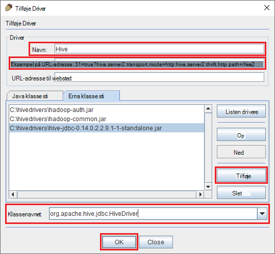
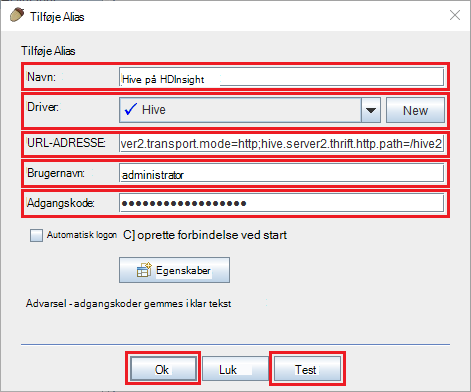

<properties
 pageTitle="Bruge JDBC til forespørgsel Hive på Azure HDInsight"
 description="Lær at bruge JDBC til at oprette forbindelse til Hive på Azure HDInsight og køre forespørgsler på data, der er gemt i skyen."
 services="hdinsight"
 documentationCenter=""
 authors="Blackmist"
 manager="jhubbard"
 editor="cgronlun"
    tags="azure-portal"/>

<tags
 ms.service="hdinsight"
 ms.devlang="java"
 ms.topic="article"
 ms.tgt_pltfrm="na"
 ms.workload="big-data"
 ms.date="08/23/2016"
 ms.author="larryfr"/>

#Oprette forbindelse til Hive på Azure HDInsight bruger Hive JDBC driveren

[AZURE.INCLUDE [ODBC-JDBC-selector](../../includes/hdinsight-selector-odbc-jdbc.md)]

I dette dokument, skal du lære, hvordan du bruger JDBC fra en Java-programmet til at sende fra en fjernplacering Hive forespørgsler til en HDInsight klynge. Du skal lære at oprette forbindelse fra SQuirreL SQL client, og hvordan du kan oprette forbindelse fra et program fra Java.

Du kan finde flere oplysninger om grænsefladen Hive JDBC, [HiveJDBCInterface](https://cwiki.apache.org/confluence/display/Hive/HiveJDBCInterface).

##Forudsætninger

For at fuldføre trinnene i denne artikel, skal du følgende:

* Et Hadoop på HDInsight klynge. Enten Linux-baserede eller Windows-baserede klynger fungerer.

* [SQuirreL SQL](http://squirrel-sql.sourceforge.net/). SQuirreL er en JDBC-klientprogrammet.

Hvis du vil oprette og køre programmet eksempel Java sammenkædet fra denne artikel, skal du følgende.

* [Java udvikler Kit (JDK) version 7](https://www.oracle.com/technetwork/java/javase/downloads/jdk7-downloads-1880260.html) eller nyere.

* [Apache Maven](https://maven.apache.org). Maven er et projekt opbygge system til Java projekter, som bruges af det projekt, der er knyttet til denne artikel.

##Forbindelsesstreng

JDBC forbindelser til en HDInsight klynge på Azure foretages over 443, og trafikken sikres ved hjælp af SSL. Offentlige gatewayen, klynger sidde bag omdirigerer trafikken til port HiveServer2 faktisk lytter på. En typisk forbindelsesstreng vil så følgende:

    jdbc:hive2://CLUSTERNAME.azurehdinsight.net:443/default;ssl=true?hive.server2.transport.mode=http;hive.server2.thrift.http.path=/hive2

Erstat __CLUSTERNAME__ med navnet på din HDInsight klynge.

##Godkendelse

Når du opretter forbindelsen, skal du bruge HDInsight klynge administrator brugernavn og adgangskode til at godkende klynge gatewayen. Når du forbinder fra JDBC klienter som SQuirreL SQL, skal du angive administrator brugernavn og adgangskode i klientindstillinger.

Fra et Java-program, skal du bruge brugernavn og adgangskode, når der oprettes en forbindelse. For eksempel åbner følgende Java-kode en ny forbindelse ved hjælp af forbindelsesstreng, admin brugernavn og adgangskode:

    DriverManager.getConnection(connectionString,clusterAdmin,clusterPassword);

##Oprette forbindelse til SQuirreL SQL client

SQuirreL SQL er en JDBC klient, der kan bruges til at køre Hive forespørgsler med din HDInsight klynge. Følgende trin forudsætter, at du allerede har installeret SQuirreL SQL og fører dig gennem hente og konfiguration af driverne til Hive.

1. Kopiere Hive JDBC driverne fra din HDInsight klynge.

    * Følge nedenstående trin for at hente de nødvendige glas filer til __Linux-baserede HDInsight__.

        1. Oprette en ny mappe, der indeholder filerne. For eksempel `mkdir hivedriver`.

        2. Skifte til den nye mappe fra en kommandoprompt, Fest, PowerShell eller andre kommandolinjen prompt, og brug følgende kommandoer til at kopiere filerne fra HDInsight klynge.

                scp USERNAME@CLUSTERNAME:/usr/hdp/current/hive-client/lib/hive-jdbc*standalone.jar .
                scp USERNAME@CLUSTERNAME:/usr/hdp/current/hadoop-client/hadoop-common.jar .
                scp USERNAME@CLUSTERNAME:/usr/hdp/current/hadoop-client/hadoop-auth.jar .

            Erstat __brugernavn__ med konto SSH brugernavnet for-klyngen. Erstat __CLUSTERNAME__ med HDInsight klyngenavnet.

            > [AZURE.NOTE] På Windows-miljøer skal du bruge værktøjet PSCP i stedet for scp. Du kan hente det fra [http://www.chiark.greenend.org.uk/~sgtatham/putty/download.html](http://www.chiark.greenend.org.uk/~sgtatham/putty/download.html).

    * Følge nedenstående trin for at hente glas filerne til __Windows-baseret HDInsight__.

        1. Vælge din klynge HDInsight fra portalen Azure, og vælg derefter ikonet __Fjernskrivebord__ .

            

        2. Brug knappen __Opret forbindelse__ til at oprette forbindelse til klyngen på bladet Fjernskrivebord. Hvis Fjernskrivebord ikke er aktiveret, kan du bruge formularen til at angive et brugernavn og adgangskode, vælg derefter __aktivere__ til at aktivere Fjernskrivebord for-klyngen.

            

            Når du har valgt __Opret forbindelse__, overføres en RDP-fil. Brug denne fil til start af Fjernskrivebord-klienten. Når du bliver bedt om det, kan du bruge det brugernavn og adgangskode, du har angivet for Fjernskrivebord adgang.

        3. Når forbindelse, kan du kopiere følgende filer fra sessionen Fjernskrivebord til din lokale computer. Placere dem i en lokal mappe med navnet `hivedriver`.

            * C:\apps\dist\hive-0.14.0.2.2.9.1-7\lib\hive-JDBC-0.14.0.2.2.9.1-7-Standalone.JAR
            * C:\apps\dist\hadoop-2.6.0.2.2.9.1-7\share\hadoop\common\hadoop-Common-2.6.0.2.2.9.1-7.JAR
            * C:\apps\dist\hadoop-2.6.0.2.2.9.1-7\share\hadoop\common\lib\hadoop-auth-2.6.0.2.2.9.1-7.JAR

            > [AZURE.NOTE] Version tallene inkluderet på stier og filnavne kan være forskellige for din klynge.

        4. Afbryde forbindelsen til Fjernskrivebord sessionen, når du er færdig med at kopiere filerne.

3. Starte SQuirreL SQL-program. Vælg __drivere__til venstre i vinduet.

    

4. Ikonerne øverst i dialogboksen __drivere__ , Vælg den __+__ ikonet for at oprette en ny driver.

    

5. Tilføj følgende oplysninger i dialogboksen Tilføj Driver.

    * __Navn__: Hive
    * __Eksempel på URL-adresse__: jdbc:hive2://localhost:443/default;ssl=true?hive.server2.transport.mode=http;hive.server2.thrift.http.path=/hive2
    * __Ekstra klasse sti__: Brug knappen Tilføj for at tilføje glas filerne hentede tidligere
    * __Klassenavnet__: org.apache.hive.jdbc.HiveDriver

    

    Klik på __OK__ for at gemme disse indstillinger.

6. Vælg __aliasser__i venstre side af SQuirreL SQL-vinduet. Klik på __+__ ikon for at oprette en ny forbindelse alias.

    

7. Bruge følgende værdier i dialogboksen __Tilføj Alias__ .

    * __Navn__: Hive på HDInsight
    * __Driver__: Brug på rullelisten til at vælge __Hive__ driveren
    * __URL-adresse__: jdbc:hive2://CLUSTERNAME.azurehdinsight.net:443/default;ssl=true?hive.server2.transport.mode=http;hive.server2.thrift.http.path=/hive2

        Erstat __CLUSTERNAME__ med navnet på din HDInsight klynge.

    * __Brugernavn__: klynge logon kontonavn for din HDInsight klynge. Standard er `admin`.
    * __Adgangskode__: adgangskoden til kontoen klynge login. Dette er en adgangskode, du angav, da oprettelse af HDInsight klynge.

    

    Brug knappen __Test__ til at bekræfte, at forbindelsen fungerer. Når __oprette forbindelse til: Hive på HDInsight__ dialogboksen vises, skal du vælge __Opret forbindelse__ til at udføre testen. Hvis testen, vises en dialogboks med en __forbindelsen er oprettet__ .

    Brug knappen __Ok__ nederst i dialogboksen __Tilføj Alias__ for at gemme forbindelse alias.

8. __Opret forbindelse til__ rullelisten øverst i SQuirreL SQL, Vælg __Hive på HDInsight__. Når du bliver bedt om det, kan du vælge __Opret forbindelse__.

    

9. Når forbindelse, Angiv følgende forespørgsel i dialogboksen SQL-forespørgsel, og vælg derefter ikonet __køre__ . Området resultaterne bør vise resultaterne af forespørgslen.

        select * from hivesampletable limit 10;

    

##Oprette forbindelse fra et eksempel Java-program

Et eksempel på brug af en Java-klient til forespørgsel Hive på HDInsight er tilgængelig på [https://github.com/Azure-Samples/hdinsight-java-hive-jdbc](https://github.com/Azure-Samples/hdinsight-java-hive-jdbc). Følg vejledningen i lager til at oprette og køre eksemplet.

##Fejlfinding i forbindelse med

### Der opstod uventet fejl forsøg på at åbne en SQL-forbindelse.

__Symptomer__: Når du opretter forbindelse til en HDInsight klynge, der er version 3.3 eller 3.4, modtager du muligvis en fejl, der opstod en uventet fejl. Staksporing for denne fejl begynder med følgende linjer:

    java.util.concurrent.ExecutionException: java.lang.RuntimeException: java.lang.NoSuchMethodError: org.apache.commons.codec.binary.Base64.<init>(I)V
    at java.util.concurrent.FutureTas...(FutureTask.java:122)
    at java.util.concurrent.FutureTask.get(FutureTask.java:206)

__Årsag__: Denne fejl skyldes en uoverensstemmelse i versionen af filen commons-codec.jar bruges af SQuirreL og den, der kræves af komponenterne Hive JDBC hentes fra HDInsight klynge.

__Løsning__: Hvis du vil rette fejlen, skal du følge nedenstående trin.

1. Hent filen commons-codec glas fra din HDInsight klynge.

        scp USERNAME@CLUSTERNAME:/usr/hdp/current/hive-client/lib/commons-codec*.jar ./commons-codec.jar

2. Afslut SQuirreL, og gå derefter til mappen, hvor SQuirreL er installeret på computeren. I mappen SquirreL under den `lib` directory, Erstat eksisterende commons-codec.jar med den, hentes fra HDInsight klynge.

3. Genstart SQuirreL. Fejlen skal ikke længere forekomme, når du opretter forbindelse til hive-filen på HDInsight.

##Næste trin

Nu hvor du har lært, hvordan du bruger JDBC til at arbejde med Hive, kan du bruge følgende links for at undersøge andre måder at arbejde med Azure HDInsight.

* [Overføre data til HDInsight](hdinsight-upload-data.md)
* [Bruge Hive med HDInsight](hdinsight-use-hive.md)
* [Brug gris med HDInsight](hdinsight-use-pig.md)
* [Brug MapReduce sager med HDInsight](hdinsight-use-mapreduce.md)
