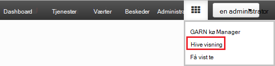
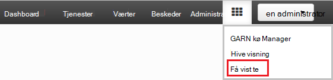
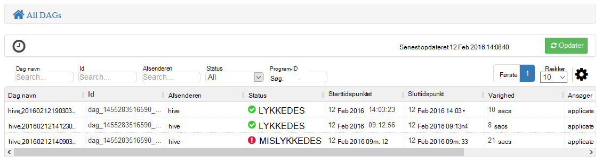
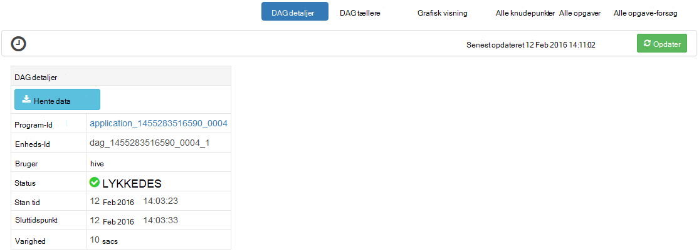
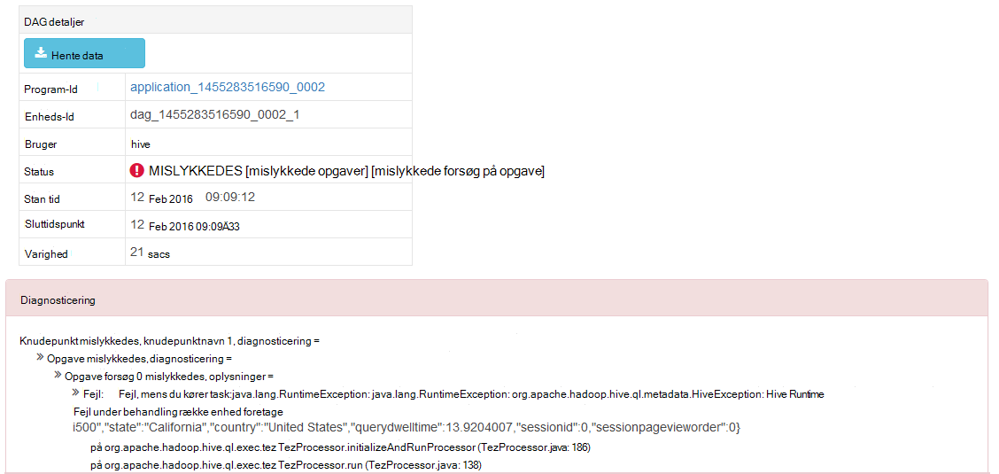
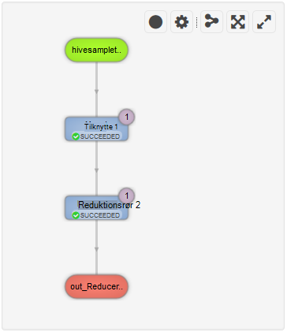
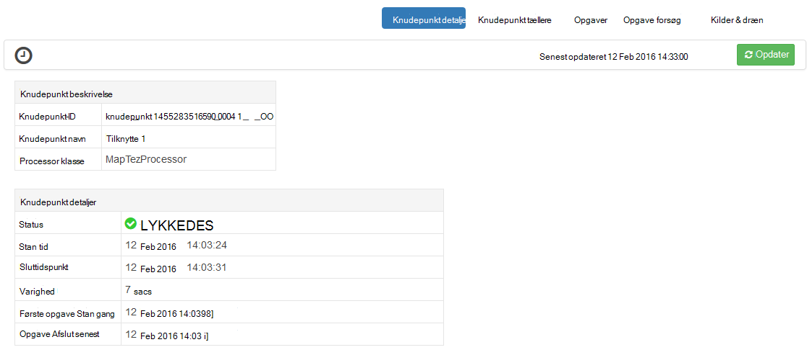
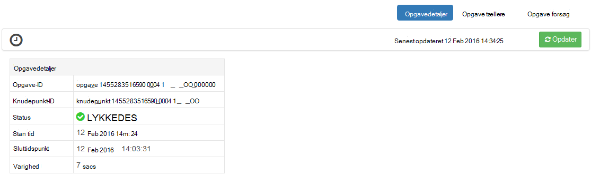

<properties
pageTitle="Brug Ambari Tez visning med HDInsight | Azure"
description="Lær, hvordan du bruger visningen Ambari Tez til at foretage fejlfinding af Tez job på HDInsight."
services="hdinsight"
documentationCenter=""
authors="Blackmist"
manager="jhubbard"
editor="cgronlun"/>

<tags
ms.service="hdinsight"
ms.devlang="na"
ms.topic="article"
ms.tgt_pltfrm="na"
ms.workload="big-data"
ms.date="10/04/2016"
ms.author="larryfr"/>

# Bruge Ambari visninger til at foretage fejlfinding af Tez job på HDInsight

Ambari Webbrugergrænseflade til HDInsight indeholder en Tez visning, der kan bruges til at forstå og fejlfinde job, der bruger Tez som udførelse af programmet. Visningen Tez giver dig mulighed at visualisere jobbet som en graf over forbundne elementer, analysere i hvert element og hente statistik og oplysninger om logføring.

> [AZURE.NOTE] Oplysningerne i dette dokument er specifikke for Linux-baserede HDInsight klynger. Finde oplysninger om fejlfinding Tez job ved hjælp af Windows-baseret HDInsight, se [bruge Tez Brugergrænsefladen for at fejlfinde Tez job på Windows-baseret HDInsight](hdinsight-debug-tez-ui.md).

## Forudsætninger

* En Linux-baserede HDInsight klynge. Få en vejledning til oprettelse af en ny klynge i [gang med at bruge Linux-baserede HDInsight](hdinsight-hadoop-linux-tutorial-get-started.md).

* En moderne webbrowser, der understøtter HTML5.

## Forstå Tez

Tez er en extensible ramme for databehandling i Hadoop, der giver større hastigheder end traditionelle MapReduce behandling. Det er standardprogrammet til Hive Linux-baserede HDInsight klynger.

Når arbejde, der er sendt til Tez, oprettes der en ført acykliske Graph (DAG), der beskriver rækkefølgen af udførelse af de handlinger, der kræves, før jobbet. Individuelle handlinger kaldes knudepunkter og udføre en del af det overordnede job. Den faktiske udførelse af det arbejde, der er beskrevet i et knudepunkt kaldes en opgave, og må distribueres på tværs af flere noder i klyngen.

### Forstå visningen Tez

Visningen Tez indeholder oplysninger om processer, der kører, eller har tidligere kørte ved hjælp af Tez. Det kan du få vist den DAG, der genereres af Tez, hvor det er fordelt over klynger, tællere, som bruges af opgaver og knudepunkter og fejloplysninger hukommelse. Det kan tilbyde nyttige oplysninger i følgende scenarier:

* Overvågning længerevarende behandler, få vist status for kort og reducere opgaver.

* Analysere historiske data for vellykkede eller mislykkede processer for at få mere at vide, hvordan behandling kan forbedres eller hvorfor mislykkedes.

## Generere en DAG

Visningen Tez vil kun indeholde data, hvis et job, der bruger Tez program er i gang, eller har været kørte i fortiden. Enkle Hive forespørgsler kan normalt løses uden at bruge Tez, men mere komplekse forespørgsler til at gøre filtrering, gruppering, sortering, joinforbindelser osv normalt kræver Tez.

Brug følgende trin til at køre en Hive-forespørgsel, der udføres ved hjælp af Tez.

1. Gå til https://CLUSTERNAME.azurehdinsight.net, hvor __CLUSTERNAME__ er navnet på din HDInsight klynge i en webbrowser.

2. Vælg ikonet __visninger__ i menuen øverst på siden. Det ser ud som en serie af kvadrater. Vælg __Hive visning__i rullemenuen, der vises. 

    

3. Når Hive får vist indlæse, Indsæt følgende i Forespørgselseditor, og klik derefter på __Udfør__.

        select market, state, country from hivesampletable where deviceplatform='Android' group by market, country, state;
    
    Når jobbet er afsluttet, skal du se output vises i sektionen __Proces forespørgselsresultaterne__ . Resultaterne skal ligne følgende
    
        market  state       country
        en-GB   Hessen      Germany
        en-GB   Kingston    Jamaica
        
4. Vælg fanen __Log__ . Der vises følgende oplysninger:
    
        INFO : Session is already open
        INFO :

        INFO : Status: Running (Executing on YARN cluster with App id application_1454546500517_0063)

    Gem værdien __App-id__ , som der skal bruges i næste afsnit.

## Bruge visningen Tez

1. Vælg ikonet __visninger__ i menuen øverst på siden. Vælg __Tez visning__i rullemenuen, der vises.

    

2. Når visningen Tez indlæses, vises en liste over DAGs, der i øjeblikket kører eller er blevet kørte på klyngen. Standardvisningen omfatter Dag Name, -Id, afsenderen, Status, starttidspunkt, sluttidspunkt, varighed, program-ID og kø. Du kan tilføje flere kolonner ved hjælp af gear-ikonet til højre på siden.

    

3. Hvis du har kun én post, vil det være for den forespørgsel, du har kørt i det forrige afsnit. Hvis du har flere poster, kan du søge ved at angive program-ID i feltet __Program-ID__ , og tryk derefter på enter.

4. Vælg __Dag navn__. Derved vises oplysninger om DAG, samt muligheden for at hente en zip af JSON-filer, der indeholder oplysninger om DAG.

    

5. Er flere links, der kan bruges til at få vist oplysninger om DAG over __DAG detaljer__ .

    * __DAG tællere__ viser oplysninger om tællere til denne DAG.
    
    * __Grafisk visning__ viser en grafisk repræsentation af denne DAG.
    
    * __Alle knudepunkter__ viser en liste over knudepunkterne i denne DAG.
    
    * __Alle opgaver__ viser en liste over opgaver til alle knudepunkter i denne DAG.
    
    * __Alle TaskAttempts__ viser oplysninger om forsøg at køre opgaver til denne DAG.
    
    > [AZURE.NOTE] Hvis du ruller visningen kolonne til knudepunkter, opgaver og TaskAttempts, kan du se, at der er links til at få vist __tællere__ og __få vist eller hente logfiler__ for hver række.

    Hvis der opstod en fejl med jobbet, vises DAG detaljerne statussen MISLYKKET, samt links til oplysninger om opgaven mislykkedes. Diagnosticeringsoplysninger vises under DAG oplysninger.
    
    

7. Vælg __grafisk visning__. Dette viser en grafisk repræsentation af DAG. Du kan placere musemarkøren over hver knudepunkt i visningen for at få vist oplysninger om den.

    

8. At klikke på et knudepunkt indlæser __Knudepunkt detaljer__ for det pågældende element. Klik på __Kort 1__ knudepunktet til at få vist oplysninger om dette element.

    

9. Bemærk, at du nu har links øverst på siden, der er relateret til knudepunkter og opgaver.

    > [AZURE.NOTE] Du kan også ankommer til denne side ved at gå tilbage til __DAG detaljer__, vælge __Knudepunkt detaljer__og derefter vælge __Kort 1__ knudepunktet.

    * __Knudepunkt tællere__ viser tæller oplysninger om denne knudepunkt.
    
    * __Opgaver__ , der viser opgaver til denne knudepunkt.
    
    * __Opgave forsøger__ viser oplysninger om forsøg på at køre opgaver til denne knudepunkt.
    
    * __Kilder og dræn__ viser datakilder og sinks for denne knudepunkt.

    > [AZURE.NOTE] Du kan rulle visningen kolonne for opgaver, opgave forsøg, og kilder & Sinks__ at få vist links til flere oplysninger for hvert element som med menuen forrige.

10. Vælg __opgaver__, og vælg derefter elementet med navnet __00_000000__. Derved vises __Opgavedetaljer__ for denne opgave. Du kan få vist __Opgave tællere__ og __Opgave forsøg__fra dette skærmbillede.

    

## Næste trin

Nu hvor du har lært, hvordan du bruger visningen Tez, få mere at vide om [Brug af Hive på HDInsight](hdinsight-use-hive.md).

Se [siden med Tez på Hortonworks](http://hortonworks.com/hadoop/tez/)mere detaljerede tekniske oplysninger om Tez.

Du kan finde flere oplysninger om brug af Ambari med HDInsight se [administrere HDInsight klynger ved hjælp af brugergrænsefladen i Ambari Web.](hdinsight-hadoop-manage-ambari.md)
