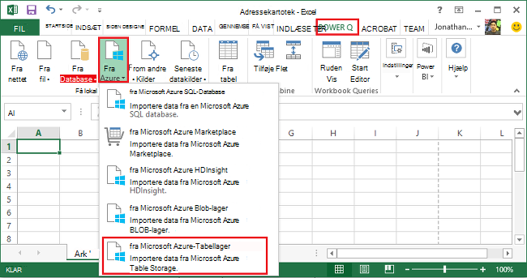
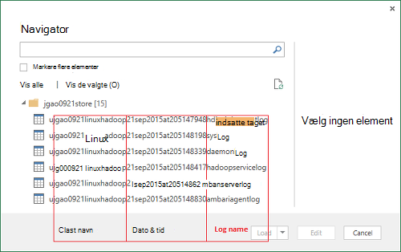
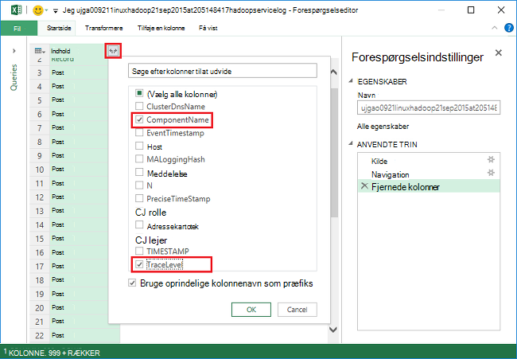
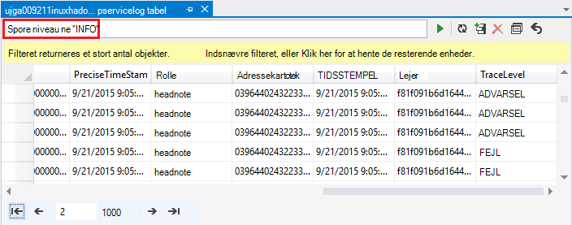
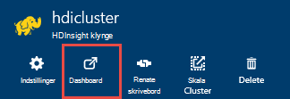
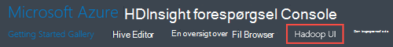
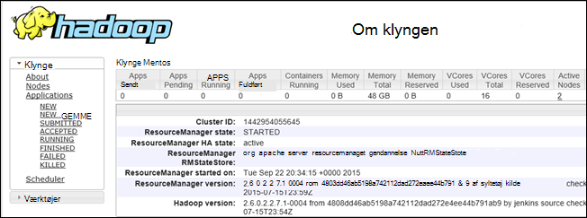

<properties
    pageTitle="Fejlfinding af Hadoop i HDInsight: få vist logfiler og fortolke fejlmeddelelser | Microsoft Azure"
    description="Få mere at vide om de fejlmeddelelser du muligvis får, når du administrerer HDInsight ved hjælp af PowerShell og trin, du kan bruge til at gendanne."
    services="hdinsight"
    tags="azure-portal"
    editor="cgronlun"
    manager="jhubbard"
    authors="mumian"
    documentationCenter=""/>

<tags
    ms.service="hdinsight"
    ms.workload="big-data"
    ms.tgt_pltfrm="na"
    ms.devlang="na"
    ms.topic="article"
    ms.date="09/02/2016"
    ms.author="jgao"/>

# Analysere HDInsight logfiler

Hver Hadoop klynge i Azure HDInsight har en Azure-lager-konto, der bruges som standard-filsystemet. Kontoen lagerplads kaldes lagerplads standardkontoen. Klynge bruger Azure Table storage og Blob-lager på lagerplads standardkontoen til at gemme dens logfiler.  For at finde ud af lagerplads standardkontoen for din klynge skal du se [administrere Hadoop klynger i HDInsight](hdinsight-administer-use-management-portal.md#find-the-default-storage-account). Loggene bevare i kontoen lagerplads, selv efter at klyngen slettes.

##Logfiler, der er skrevet til Azure tabeller

Loggene skrevet til Azure tabeller indeholder ét niveau af indsigt i hvad sker der med en HDInsight klynge.

Når du opretter en HDInsight klynge, oprettes automatisk 6 tabeller for Linux-baserede klynger i standard-tabellager:

- hdinsightagentlog
- Syslog
- daemonlog
- hadoopservicelog
- ambariserverlog
- ambariagentlog

3 tabeller oprettes til Windows-baserede klynger:

- Setuplog: logfil over begivenheder/undtagelser i klargøring/oprettelse af HDInsight klynger er stødt på.
- hadoopinstalllog: logfil over begivenheder/undtagelser stødt på, når du installerer Hadoop på klyngen. I denne tabel kan være nyttige i forbindelse med fejlfinding af problemer i forbindelse med klynger, der er oprettet med brugerdefinerede parametre.
- hadoopservicelog: logfil over begivenheder/undtagelser registreret af alle Hadoop-tjenester. I denne tabel kan være nyttige i forbindelse med fejlfinding af problemer i forbindelse med job mislykkede forsøg på HDInsight klynger.

Filnavnene tabel er **u<ClusterName>DDMonYYYYatHHMMSSsss<TableName>**.

Disse tabeller indeholder følgende felter:

- ClusterDnsName
- Komponentnavn
- EventTimestamp
- Host
- MALoggingHash
- Meddelelse
- N
- PreciseTimeStamp
- Rolle
- RowIndex
- Lejer
- TIDSSTEMPEL
- TraceLevel

### Værktøjer til at få adgang til logfiler

Der findes mange værktøjer til at få adgang til data i disse tabeller:

-  Visual Studio
-  Azure-lager Explorer
-  Power-forespørgsel til Excel

#### Bruge Power-forespørgsel til Excel

Power-forespørgsel kan installeres fra [www.microsoft.com/en-us/download/details.aspx?id=39379]( http://www.microsoft.com/en-us/download/details.aspx?id=39379). Se overførselssiden for systemkrav

**Bruge Power-forespørgsel til at åbne og analysere loggen for tjenesten**

1. Åbn **Microsoft Excel**.
2. Klik på **Fra Azure**fra menuen i **Power-forespørgsel** , og klik derefter på **fra Microsoft Azure Table storage**.
 
    
3. Angiv firmanavn lagerplads. Det kan være enten det korte navn eller det fulde Domænenavn.
4. Angive kontonøgle lagerplads. Du skal se en liste over tabeller:

    
5. Højreklik på tabellen hadoopservicelog i **navigationsruden** , og klik på **Rediger**. Du skal se 4 kolonner. Du kan også slette kolonnerne **Partitionsnøgle**, **Række nøgle**og **tidsstempel** ved at markere dem og derefter klikke på **Fjern kolonner** fra indstillingerne på båndet.
6. Klik på udvidelsesikonet på kolonnen indhold for at vælge de kolonner, du vil importere til Excel-regnearket. For denne demonstration, jeg valgte TraceLevel og Komponentnavn: det kan give mig nogle grundlæggende oplysninger som komponenter havde problemer.

    
7. Klik på **OK** for at importere dataene.
8. Vælg kolonnerne **TraceLevel**, rolle og **Komponentnavn** , og derefter klikke på **Gruppér efter** kontrolelement på båndet.
9. Klik på **OK** i dialogboksen Gruppér efter
10. Klik på** Anvend og Luk**.
 
Du kan nu bruge Excel til at filtrere og sortere efter behov. Tydeligt, kan du medtage andre kolonner (fx meddelelse) for at analysere ned i problemer, når de opstår, men at markere og gruppere de kolonner, der er beskrevet ovenfor indeholder et op. billede af, hvad sker der med Hadoop-tjenester. Den samme ide kan anvendes til tabellerne setuplog og hadoopinstalllog.

#### Brug af Visual Studio

**Bruge Visual Studio**

1. Åbne Visual Studio.
2. Menuen **Vis** , klik på **Skyen Explorer**. Eller blot klikke på **CTRL +\, CTRL + X**.
3. Fra **Skyen Explorer**skal du vælge **Ressourcetyper**.  De andre muligheder er **Grupper**.
4. Udvid **Lagerplads konti**, lagerplads standardkontoen for din klynge og **tabeller**.
5. Dobbeltklik på **hadoopservicelog**.
6. Tilføje et filter. Eksempel:
    
        TraceLevel eq 'ERROR'

    

    Du kan finde flere oplysninger om bygning af filtre, [Oprette Filter strenge for tabeldesign](../vs-azure-tools-table-designer-construct-filter-strings.md).
 
##Logfiler, der er skrevet til Azure Blob-lager

[Loggene skrevet til Azure tabeller](#log-written-to-azure-tables) indeholder ét niveau af indsigt i hvad sker der med en HDInsight klynge. Disse tabeller indeholder dog ikke opgaveniveau logfiler, som kan være nyttige i analysere yderligere til problemer, når de opstår. For at give denne næste detaljeniveau, er HDInsight klynger konfigureret til at skrive opgave logfiler til kontoen Blob-lager for et job, der er sendt gennem Templeton. Det betyder næsten, job sendt ved hjælp af Microsoft Azure PowerShell-cmdlet'er eller .NET Job bidrag API'er, ikke job sendt via RDP/command-line adgang til klyngen. 

Du kan se loggene, få [adgang GARN programmet logger på Linux-baserede HDInsight](hdinsight-hadoop-access-yarn-app-logs-linux.md).

Se [Simplifying bruger logger administration og adgang i GARN](http://hortonworks.com/blog/simplifying-user-logs-management-and-access-in-yarn/)kan finde flere oplysninger om programmet logfiler.
 
 
## Få vist klynge sundheds- og logfiler

###Få adgang til Hadoop-brugergrænseflade

Klik på en HDInsight klyngenavn for at åbne bladet klynge fra portalen Azure. Klik på **Dashboard**fra bladet klynge.

Når du bliver bedt om det, kan du angive klynge administratorrettigheder. Klik på **Hadoop brugergrænseflade**i konsollen forespørgsel, der åbnes.

###Få adgang til garnet brugergrænseflade

Klik på en HDInsight klyngenavn for at åbne bladet klynge fra portalen Azure. Klik på **Dashboard**fra bladet klynge. Når du bliver bedt om det, kan du angive administratorrettigheder klynge. Klik på **GARN Brugergrænsefladen**i konsollen forespørgsel, der åbnes.

Du kan bruge GARN Brugergrænsefladen til at gøre følgende:

* **Hente klynge status**. Udvid **klynge**i venstre rude, og klik på **om**. Denne Præsenter klynge status detaljer som samlet allokeret hukommelse, kerner brugt, tilstanden for ressourcestyring klynge, klynge version osv.

    

* **Hente node status**. Udvid **klynge**i venstre rude, og klik på **noder**. Dette viser en liste over alle noderne i klynge, HTTP-adressen for hver node ressourcer, der allokeres til hver node osv.

* **Overvåge jobstatus**. Udvid **klynge**i venstre rude, og klik derefter på **programmer** for at få vist alle job i klyngen. Hvis du vil se på job i en bestemt stat (som ny, sendte, kører, osv.), skal du klikke på det relevante hyperlink under **programmer**. Yderligere kan du klikke på jobbet navnet for at få mere at vide om jobbet sådanne herunder output, logge osv.

###Få adgang til brugergrænsefladen i HBase.

Klik på en HDInsight HBase klyngenavn for at åbne bladet klynge fra portalen Azure. Klik på **Dashboard**fra bladet klynge. Når du bliver bedt om det, kan du angive administratorrettigheder klynge. Klik på **HBase brugergrænseflade**i konsollen forespørgsel, der åbnes.

## HDInsight fejlkoder

De fejlmeddelelser, der er specificeret i dette afsnit er angivet til at hjælpe brugerne af Hadoop i Azure HDInsight forstå mulige fejltilstande, som de kan støde på, når du administrerer tjenesten ved hjælp af Azure PowerShell og til at informere dem på de trin, som kan blive ført til at gendanne fra fejlen.

Nogle af disse fejlmeddelelser kan også ses i portalen Azure, når den bruges til at administrere HDInsight klynger. Men andre fejlmeddelelser, du kan støde på, der er mindre findelt på grund af betingelserne for de mulige i denne kontekst korrigerende handlinger. Der findes andre fejlmeddelelser i de situationer, hvor Afhjælpningen er indlysende. 

### AtleastOneSqlMetastoreMustBeProvided
- **Beskrivelse**: Angiv Azure SQL database detaljer for mindst én komponent for at kunne bruge brugerdefinerede indstillinger for Hive og Oozie metastores.
- **Afhjælpning**: brugeren skal angive en gyldig SQL Azure-metastore og forsøg anmodningen igen.  

### AzureRegionNotSupported
- **Beskrivelse**: kan ikke oprette klynge i område *nameOfYourRegion*. Bruge et gyldigt HDInsight område, og prøv igen anmodning.
- **Afhjælpning**: kunde skal oprette den klynge område, der understøtter i øjeblikket dem: Sydøstasien, vest Europe, nord Europe, af US eller Vest USA.  

### ClusterContainerRecordNotFound
- **Beskrivelse**: serveren kunne ikke finde den ønskede klynge post.  
- **Afhjælpning**: Prøv igen.

### ClusterDnsNameInvalidReservedWord
- **Beskrivelse**: klynge DNS navn *yourDnsName* er ugyldig. Sørg for, at navnet begynder og slutter med alfanumeriske og kan kun indeholde '-' specialtegn  
- **Afhjælpning**: Sørg for, at du har brugt et gyldigt DNS-navn for din klynge, der begynder og slutter med alfanumeriske og indeholder særlige tegn dog stregen '-' og derefter prøve igen.

### ClusterNameUnavailable
- **Beskrivelse**: klynge navn *yourClusterName* er ikke tilgængelig. Vælg et andet navn.  
- **Afhjælpning**: brugeren skal angive et clustername, der er entydige og ikke findes, og prøv igen. Hvis brugeren er ved hjælp af portalen, kan Brugergrænsefladen skal kontakte dem, hvis et klyngenavn allerede bruges under Opret trinnene.

### ClusterPasswordInvalid
- **Beskrivelse**: klynge adgangskode er ugyldig. Adgangskode skal bestå af mindst 10 tegn og skal indeholde mindst ét tal, store bogstaver, små bogstaver og specialtegn som ikke indeholder mellemrum og må ikke indeholde brugernavn som en del af den.  
- **Afhjælpning**: angive en gyldig klynge adgangskode, og prøv igen.

### ClusterUserNameInvalid
- **Beskrivelse**: klynge brugernavn er ugyldige. Kontroller, at brugernavn ikke indeholder ikke specialtegn eller mellemrum.  
- **Afhjælpning**: angive et brugernavn for gyldige klynge og prøv igen.

### ClusterUserNameInvalidReservedWord
- **Beskrivelse**: klynge DNS navn *yourDnsClusterName* er ugyldig. Sørg for, at navnet begynder og slutter med alfanumeriske og kan kun indeholde '-' specialtegn  
- **Afhjælpning**: Angiv et gyldigt DNS klynge brugernavn, og prøv igen.

### ContainerNameMisMatchWithDnsName
- **Beskrivelse**: objektbeholder navn i URI *yourcontainerURI* og DNS-navn *yourDnsName* i anmodningsteksten skal være den samme.  
- **Afhjælpning**: Sørg for, at din objektbeholder navn og din DNS-navn er de samme, og prøv igen.

### DataNodeDefinitionNotFound
- **Beskrivelse**: en ugyldig klynge konfiguration. Blev ikke fundet en hvilken som helst data node definitioner i node størrelse.  
- **Afhjælpning**: Prøv igen.

### DeploymentDeletionFailure
- **Beskrivelse**: sletning af en installation mislykkedes for-klyngen  
- **Afhjælpning**: Prøv igen sletningen.

### DnsMappingNotFound
- **Beskrivelse**: Service konfigurationsfejl. Nødvendige DNS-tilknytningsoplysninger blev ikke fundet.  
- **Afhjælpning**: Slet klynge, og Opret en ny klynge.

### DuplicateClusterContainerRequest
- **Beskrivelse**: duplikere klynge objektbeholder oprettelse af forsøg. Der findes post for *nameOfYourContainer* , men Etags stemmer ikke overens.
- **Afhjælpning**: Angiv et entydigt navn for objektbeholderen, og prøv igen handlingen Opret.

### DuplicateClusterInHostedService
- **Beskrivelse**: hostet service *nameOfYourHostedService* allerede indeholder en klynge. En hostet tjeneste må ikke indeholde flere klynger  
- **Afhjælpning**: hoste klynge i en anden hostet tjeneste.

### FailureToUpdateDeploymentStatus
- **Beskrivelse**: serveren kunne ikke opdatere tilstanden for den klynge installation.  
- **Afhjælpning**: Prøv igen. Hvis dette sker flere gange, skal du kontakte CSS.

### HdiRestoreClusterAltered
- **Beskrivelse**: klynge *yourClusterName* er blevet slettet som en del af vedligeholdelse. Genopret klyngen.
- **Afhjælpning**: genskabe klyngen.

### HeadNodeConfigNotFound
- **Beskrivelse**: en ugyldig klynge konfiguration. Krævede hoved node konfiguration ikke findes i node størrelser.
- **Afhjælpning**: Prøv igen.

### HostedServiceCreationFailure
- **Beskrivelse**: kan ikke oprette hostet service *nameOfYourHostedService*. Prøv anmodning.  
- **Afhjælpning**: forsøg anmodningen igen.

### HostedServiceHasProductionDeployment
- **Beskrivelse**: hostet Service *nameOfYourHostedService* allerede har et produktionsmiljø. En hostet tjeneste må ikke indeholde flere fremstilling installationer. Prøv igen anmodningen med en anden klyngenavn.
- **Afhjælpning**: Brug en anden klyngenavn, og forsøg anmodningen igen.

### HostedServiceNotFound
- **Beskrivelse**: hostet Service *nameOfYourHostedService* til klyngen ikke blev fundet.  
- **Afhjælpning**: Hvis klyngen er i fejltilstand, slette den og derefter prøve igen.

### HostedServiceWithNoDeployment
- **Beskrivelse**: hostet Service *nameOfYourHostedService* har ingen tilknyttede installation.  
- **Afhjælpning**: Hvis klyngen er i fejltilstand, slette den og derefter prøve igen.

### InsufficientResourcesCores
- **Beskrivelse**: feltet SubscriptionId *yourSubscriptionId* har ikke kerner venstre til at oprette klynge *yourClusterName*. Påkrævet: *resourcesRequired*, tilgængelig: *resourcesAvailable*.  
- **Afhjælpning**: Frigør ressourcer i dit abonnement eller øge de ressourcer, der er tilgængelige for abonnementet, og prøv at oprette klyngen igen.

### InsufficientResourcesHostedServices
- **Beskrivelse**: abonnement-ID *yourSubscriptionId* har ikke kvote for en ny HostedService til at oprette klynge *yourClusterName*.  
- **Afhjælpning**: Frigør ressourcer i dit abonnement eller øge de ressourcer, der er tilgængelige for abonnementet, og prøv at oprette klyngen igen.

### InternalErrorRetryRequest
- **Beskrivelse**: serveren, der opstod en intern fejl. Prøv anmodning.  
- **Afhjælpning**: forsøg anmodningen igen.

### InvalidAzureStorageLocation
- **Beskrivelse**: Azure lagerplads placering *dataRegionName* ikke er en gyldig placering. Sørg for, at området er korrekte, og prøv igen anmodning.
- **Afhjælpning**: Vælg en lagerplacering, der understøtter HDInsight, Kontrollér, at din klynge er samtidig placeret, og prøv igen.

### InvalidNodeSizeForDataNode
- **Beskrivelse**: ugyldige VM størrelse for data noder. Kun 'Store VM' størrelse understøttes for alle data noder.  
- **Afhjælpning**: angive nodestørrelsen på understøttede til noden data, og prøv igen.

### InvalidNodeSizeForHeadNode
- **Beskrivelse**: ugyldige VM størrelse for hoved node. Kun 'ExtraLarge VM' størrelse understøttes for hoved node.  
- **Afhjælpning**: angive nodestørrelsen på understøttede til noden hoved og prøv igen

### InvalidRightsForDeploymentDeletion
- **Beskrivelse**: abonnement-ID *yourSubscriptionId* bruges har ikke tilstrækkelige tilladelser til at udføre sletning for klynge *yourClusterName*.  
- **Afhjælpning**: Hvis klyngen er i fejltilstand, slippe den og derefter prøve igen.  

### InvalidStorageAccountBlobContainerName
- **Beskrivelse**: ekstern storage konto blob objektbeholder navn *yourContainerName* er ugyldig. Kontrollér, at navnet starter med et bogstav og indeholder kun små bogstaver, tal og bindestreg.  
- **Afhjælpning**: Angiv en gyldig blob objektbeholder kontonavn lager og prøv igen.

### InvalidStorageAccountConfigurationSecretKey
- **Beskrivelse**: konfiguration for ekstern storage konto *yourStorageAccountName* skal have hemmeligt vigtige oplysninger skal angives.  
- **Afhjælpning**: angive en gyldig hemmeligt nøgle for kontoen lagerplads, og prøv igen.

### InvalidVersionHeaderFormat
- **Beskrivelse**: Version sidehoved *yourVersionHeader* ikke er gyldigt format af åååå-mm-dd.  
- **Afhjælpning**: Angiv et gyldigt format for sidehovedet i version og forsøg anmodningen igen.

### MoreThanOneHeadNode
- **Beskrivelse**: en ugyldig klynge konfiguration. Fundet mere end én hoved node konfiguration.  
- **Afhjælpning**: redigere konfigurationen, så onloy én hoved noden er angivet.

### OperationTimedOutRetryRequest
- **Beskrivelse**: Handlingen kunne ikke fuldføres inden for den tilladte tid eller det maksimale antal gentagne forsøg forsøger muligt. Prøv anmodning.  
- **Afhjælpning**: forsøg anmodningen igen.

### ParameterNullOrEmpty
- **Beskrivelse**: Parameter *yourParameterName* må ikke være null eller tom.  
- **Afhjælpning**: Angiv en gyldig værdi for parameteren.

### PreClusterCreationValidationFailure
- **Beskrivelse**: en eller flere af de klynge oprettelse af anmodning om input, er ikke gyldig. Sørg for inputværdierne er korrekte, og prøv igen anmodning.  
- **Afhjælpning**: Sørg for, at inputværdierne er korrekte, og prøv igen anmodning.

### RegionCapabilityNotAvailable
- **Beskrivelse**: område egenskab ikke tilgængeligt for område *yourRegionName* og abonnement-ID *yourSubscriptionId*.  
- **Afhjælpning**: Angiv et område, der understøtter HDInsight klynger. Offentligt understøttede områder er: Sydøstasien, vest Europe, nord Europe, af US eller Vest USA.

### StorageAccountNotColocated
- **Beskrivelse**: lagerplads konto *yourStorageAccountName* er i område *currentRegionName*. Det skal være det samme som klynge område *yourClusterRegionName*.  
- **Afhjælpning**: enten angive et lager konto i den samme region, din klynge i, eller hvis dine data er allerede i kontoen lagerplads, oprette en ny klynge i det samme område som den eksisterende lagerplads-konto. Hvis du ved hjælp af portalen, besked Brugergrænsefladen dem om dette problem på forhånd.

### SubscriptionIdNotActive
- **Beskrivelse**: den angivne abonnement-ID *yourSubscriptionId* ikke er aktivt.  
- **Afhjælpning**: genaktivere dit abonnement eller få et nyt gyldige abonnement.

### SubscriptionIdNotFound
- **Beskrivelse**: abonnement-ID *yourSubscriptionId* blev ikke fundet.  
- **Afhjælpning**: Kontrollér, at dit abonnement-ID er gyldig, og prøv igen.

### UnableToResolveDNS
- **Beskrivelse**: ikke kan løse DNS *yourDnsUrl*. Kontroller, at den fulde URL-adressen til blob slutpunktet leveres.  
- **Afhjælpning**: Angiver en gyldig blob URL-adresse. URL-adressen skal være fuldt ud gyldig, herunder starter med *http://* og slutter på *.com*.

### UnableToVerifyLocationOfResource
- **Beskrivelse**: kan ikke bekræfte placeringen af ressource *yourDnsUrl*. Kontroller, at den fulde URL-adressen til blob slutpunktet leveres.  
- **Afhjælpning**: Angiver en gyldig blob URL-adresse. URL-adressen skal være fuldt ud gyldig, herunder starter med *http://* og slutter på *.com*.

### VersionCapabilityNotAvailable
- **Beskrivelse**: Version egenskab ikke tilgængeligt for version *specifiedVersion* og abonnement-ID *yourSubscriptionId*.  
- **Afhjælpning**: Vælg en version, som er tilgængelig, og prøv igen.

### VersionNotSupported
- **Beskrivelse**: Version *specifiedVersion* understøttes ikke.
- **Afhjælpning**: Vælg en version, der er understøttet, og prøv igen.

### VersionNotSupportedInRegion
- **Beskrivelse**: Version *specifiedVersion* er ikke tilgængelig i Azure område *specifiedRegion*.  
- **Afhjælpning**: Vælg en version, der understøttes i det område, der er angivet, og prøv igen.

### WasbAccountConfigNotFound
- **Beskrivelse**: en ugyldig klynge konfiguration. Påkrævet WASB-Kontokonfiguration ikke findes i eksterne konti.  
- **Afhjælpning**: Bekræft, at kontoen findes og er angivet korrekt i konfigurationen og prøv igen.

## Næste trin

- [Bruge Ambari visninger til at foretage fejlfinding af Tez job på HDInsight](hdinsight-debug-ambari-tez-view.md)
- [Aktivere heap gemmer for Hadoop-tjenester på Linux-baserede HDInsight](hdinsight-hadoop-collect-debug-heap-dump-linux.md)
- [Administrere HDInsight klynger ved hjælp af brugergrænsefladen i Ambari Web.](hdinsight-hadoop-manage-ambari.md)
