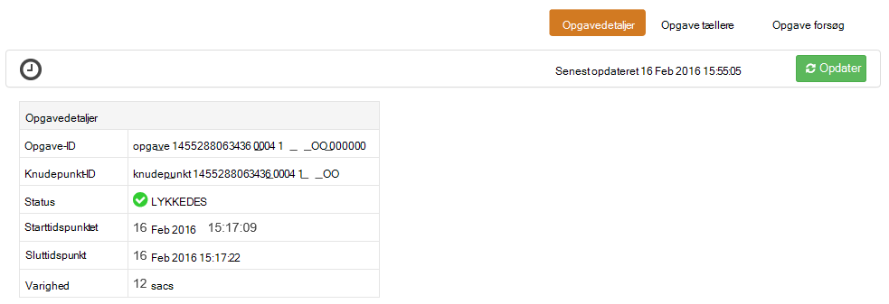

<properties
pageTitle="Bruge Tez Brugergrænsefladen med Windows-baseret HDInsight | Azure"
description="Lær, hvordan du bruger Tez UI til at foretage fejlfinding af Tez job på Windows-baseret HDInsight HDInsight."
services="hdinsight"
documentationCenter=""
authors="Blackmist"
manager="jhubbard"
editor="cgronlun"/>

<tags
ms.service="hdinsight"
ms.devlang="na"
ms.topic="article"
ms.tgt_pltfrm="na"
ms.workload="big-data"
ms.date="10/04/2016"
ms.author="larryfr"/>

# Brug Tez UI til at foretage fejlfinding af Tez job på Windows-baseret HDInsight

Tez UI er en webside, der kan bruges til at forstå og fejlfinde job, der bruger Tez som udførelse af programmet på Windows-baseret HDInsight klynger. Tez UI giver dig mulighed at visualisere jobbet som en graf over forbundne elementer, analysere i hvert element og hente statistik og oplysninger om logføring.

> [AZURE.NOTE] Oplysningerne i dette dokument er specifikke for Windows-baseret HDInsight klynger. Du kan finde oplysninger på visning og fejlfinding Tez på Linux-baserede HDInsight [Brug Ambari visninger til at foretage fejlfinding af Tez job på HDInsight](hdinsight-debug-ambari-tez-view.md).

## Forudsætninger

* En Windows-baseret HDInsight klynge. Få en vejledning til oprettelse af en ny klynge i [gang med at bruge Windows-baseret HDInsight](hdinsight-hadoop-tutorial-get-started-windows.md).

    > [AZURE.IMPORTANT] Tez UI er kun tilgængelig på Windows-baseret HDInsight klynger oprettet efter 8. februar 2016.

* En Windows-baseret Remote Desktop-klient.

## Forstå Tez

Tez er en extensible ramme for databehandling i Hadoop, der giver større hastigheder end traditionelle MapReduce behandling. Til Windows-baseret HDInsight klynger er det et valgfrit program, du kan aktivere for Hive ved hjælp af følgende kommando som en del af din Hive forespørgsel:

    set hive.execution.engine=tez;

Når arbejde, der er sendt til Tez, oprettes der en ført acykliske Graph (DAG), der beskriver rækkefølgen af udførelse af de handlinger, der kræves, før jobbet. Individuelle handlinger kaldes knudepunkter og udføre en del af det overordnede job. Den faktiske udførelse af det arbejde, der er beskrevet i et knudepunkt kaldes en opgave, og må distribueres på tværs af flere noder i klyngen.

### Forstå brugergrænsefladen i Tez.

Tez UI er en webside indeholder oplysninger om processer, der kører, eller har tidligere kørte ved hjælp af Tez. Det kan du få vist den DAG, der genereres af Tez, hvor det er fordelt over klynger, tællere, som bruges af opgaver og knudepunkter og fejloplysninger hukommelse. Det kan tilbyde nyttige oplysninger i følgende scenarier:

* Overvågning længerevarende behandler, få vist status for kort og reducere opgaver.

* Analysere historiske data for vellykkede eller mislykkede processer for at få mere at vide, hvordan behandling kan forbedres eller hvorfor mislykkedes.

## Generere en DAG

Tez UI vil kun indeholde data, hvis et job, der bruger Tez program er i gang, eller har været kørte i fortiden. Enkle Hive forespørgsler kan normalt løses uden at bruge Tez, men mere komplekse forespørgsler til at gøre filtrering, gruppering, sortering, joinforbindelser osv normalt kræver Tez.

Brug følgende trin til at køre en Hive-forespørgsel, der udføres ved hjælp af Tez.

1. Gå til https://CLUSTERNAME.azurehdinsight.net, hvor __CLUSTERNAME__ er navnet på din HDInsight klynge i en webbrowser.

2. Vælg den __Hive Editor__i menuen øverst på siden. Derved vises en side med det følgende eksempel på forespørgsel.

        Select * from hivesampletable

    Slette eksempel forespørgslen, og Erstat den med følgende.

        set hive.execution.engine=tez;
        select market, state, country from hivesampletable where deviceplatform='Android' group by market, country, state;

3. Vælg knappen __Send__ . Sektionen __Job Session__ nederst på siden vises status for forespørgslen. Når status ændres til __fuldført__, skal du vælge linket __Vis detaljer__ for at få vist resultaterne. __Jobbet Output__ skal ligne følgende:
        
        en-GB   Hessen      Germany
        en-GB   Kingston    Jamaica
        en-GB   Nairobi Area    Kenya

## Bruge brugergrænsefladen i Tez.

> [AZURE.NOTE] Tez UI er kun tilgængelig fra skrivebordet i klyngenoderne hoved, så du skal bruge Fjernskrivebord til at oprette forbindelse til noderne hoved.

1. [Azure-portalen](https://portal.azure.com), Vælg din HDInsight klynge. Fra toppen af bladet HDInsight skal du vælge ikonet __Fjernskrivebord__ . Derved vises bladet remote desktop

    

2. Vælg __Opret forbindelse__ til at oprette forbindelse til Klyngenoden hoved bladet Fjernskrivebord. Når du bliver bedt om det, kan du bruge den klynge Fjernskrivebord brugernavn og adgangskode til at godkende forbindelsen.

    

    > [AZURE.NOTE] Hvis du ikke har aktiveret Fjernskrivebord connectivity, angive et brugernavn, din adgangskode og udløbsdatoen, og vælg derefter __aktivere__ til at aktivere Fjernskrivebord. Når den er blevet aktiveret, kan du bruge de forrige trin til at oprette forbindelse.

3. Når forbindelse, Åbn Internet Explorer på Fjernskrivebord, Vælg tandhjulsikonet i øverste højre hjørne i browseren, og vælg derefter __Visningsindstillinger for kompatibilitet__.

4. Fjern markeringen i afkrydsningsfeltet __Vis intranetsteder i kompatibilitetstilstand__ , og __Brug Microsoft kompatibilitet lister__fra bunden af __Indstillinger for kompatibilitet visning__, og vælg derefter __Luk__.

5. I Internet Explorer, gå til http://headnodehost:8188/tezui / #/. Derved vises Tez UI

    

    Når Tez UI indlæser, vil du se en liste over DAGs, der i øjeblikket kører eller er blevet kørte på klyngen. Standardvisningen omfatter Dag Name, -Id, afsenderen, Status, starttidspunkt, sluttidspunkt, varighed, program-ID og kø. Du kan tilføje flere kolonner ved hjælp af gear-ikonet til højre på siden.

    Hvis du har kun én post, vil det være for den forespørgsel, du har kørt i det forrige afsnit. Hvis du har flere poster, kan du søge ved at angive søgekriterier i felterne over DAGs og derefter trykke på __Enter__.

4. Vælg __Dag navn__ for den seneste post i DAG. Derved vises oplysninger om DAG, samt muligheden for at hente en zip af JSON-filer, der indeholder oplysninger om DAG.

    

5. Er flere links, der kan bruges til at få vist oplysninger om DAG over __DAG detaljer__ .

    * __DAG tællere__ viser oplysninger om tællere til denne DAG.
    
    * __Grafisk visning__ viser en grafisk repræsentation af denne DAG.
    
    * __Alle knudepunkter__ viser en liste over knudepunkterne i denne DAG.
    
    * __Alle opgaver__ viser en liste over opgaver til alle knudepunkter i denne DAG.
    
    * __Alle TaskAttempts__ viser oplysninger om forsøg at køre opgaver til denne DAG.
    
    > [AZURE.NOTE] Hvis du ruller visningen kolonne til knudepunkter, opgaver og TaskAttempts, kan du se, at der er links til at få vist __tællere__ og __få vist eller hente logfiler__ for hver række.

    Hvis der opstod en fejl med jobbet, vises DAG detaljerne statussen MISLYKKET, samt links til oplysninger om opgaven mislykkedes. Diagnosticeringsoplysninger vises under DAG oplysninger.

7. Vælg __grafisk visning__. Dette viser en grafisk repræsentation af DAG. Du kan placere musemarkøren over hver knudepunkt i visningen for at få vist oplysninger om den.

    

8. At klikke på et knudepunkt indlæser __Knudepunkt detaljer__ for det pågældende element. Klik på __Kort 1__ knudepunktet til at få vist oplysninger om dette element. Vælg __Bekræft__ for at bekræfte navigationen.

    

9. Bemærk, at du nu har links øverst på siden, der er relateret til knudepunkter og opgaver.

    > [AZURE.NOTE] Du kan også ankommer til denne side ved at gå tilbage til __DAG detaljer__, vælge __Knudepunkt detaljer__og derefter vælge __Kort 1__ knudepunktet.

    * __Knudepunkt tællere__ viser tæller oplysninger om denne knudepunkt.
    
    * __Opgaver__ , der viser opgaver til denne knudepunkt.
    
    * __Opgave forsøger__ viser oplysninger om forsøg på at køre opgaver til denne knudepunkt.
    
    * __Kilder og dræn__ viser datakilder og sinks for denne knudepunkt.

    > [AZURE.NOTE] Du kan rulle visningen kolonne for opgaver, opgave forsøg, og kilder & Sinks__ at få vist links til flere oplysninger for hvert element som med menuen forrige.

10. Vælg __opgaver__, og vælg derefter elementet med navnet __00_000000__. Derved vises __Opgavedetaljer__ for denne opgave. Du kan få vist __Opgave tællere__ og __Opgave forsøg__fra dette skærmbillede.

    

## Næste trin

Nu hvor du har lært, hvordan du bruger visningen Tez, få mere at vide om [Brug af Hive på HDInsight](hdinsight-use-hive.md).

Se [siden med Tez på Hortonworks](http://hortonworks.com/hadoop/tez/)mere detaljerede tekniske oplysninger om Tez.
