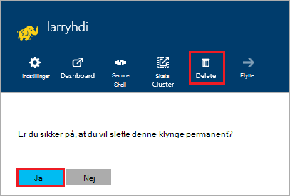

<properties
pageTitle="Sådan sletter du en HDInsight klynge | Azure"
description="Oplysninger om de forskellige måder, du kan slette en HDInsight klynge."
services="hdinsight"
documentationCenter=""
authors="Blackmist"
manager="jhubbard"
editor="cgronlun"/>

<tags
ms.service="hdinsight"
ms.devlang="na"
ms.topic="article"
ms.tgt_pltfrm="na"
ms.workload="big-data"
ms.date="10/28/2016"
ms.author="larryfr"/>

#Sådan sletter du en HDInsight klynge

HDInsight klynge fakturering starter, når en klynge oprettes og stopper, når klyngen slettes og er forholdsmæssig i minuttet, så du bør altid slette din klynge, når det er ikke længere bruges. I dette dokument lærer du, hvordan du sletter en klynge ved hjælp af portalen Azure, Azure PowerShell og Azure CLI.

> [AZURE.IMPORTANT] Slette en HDInsight klynge sletter ikke de Azure-lager-konti, der er knyttet til klyngen. Dette giver dig mulighed at bevare og genbruge data gemt ved klyngen.

##Azure-portalen

1. Logge på [Azure portal](https://portal.azure.com) og vælge din klynge HDInsight. Hvis din HDInsight klynge ikke er fastgjort til dashboard, kan du søge efter den ved navn ved hjælp af søgefeltet (forstørrelsesglasset ikon) i højre side på navigationslinjen.

    

2. Når bladet åbnes for-klyngen, skal du vælge ikonet __Slet__ . Når du bliver bedt om det, vælge __Ja__ til at slette klyngen.

    

##Azure PowerShell

Brug følgende kommando til at slette klyngen fra en PowerShell-prompt:

    Remove-AzureRmHDInsightCluster -ClusterName CLUSTERNAME

Erstat __CLUSTERNAME__ med navnet på din HDInsight klynge.

##Azure CLI

Brug følgende til at slette klyngen fra en meddelelse om:

    azure hdinsight cluster delete CLUSTERNAME
    
Erstat __CLUSTERNAME__ med navnet på din HDInsight klynge.
